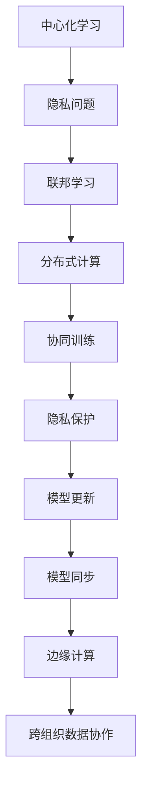
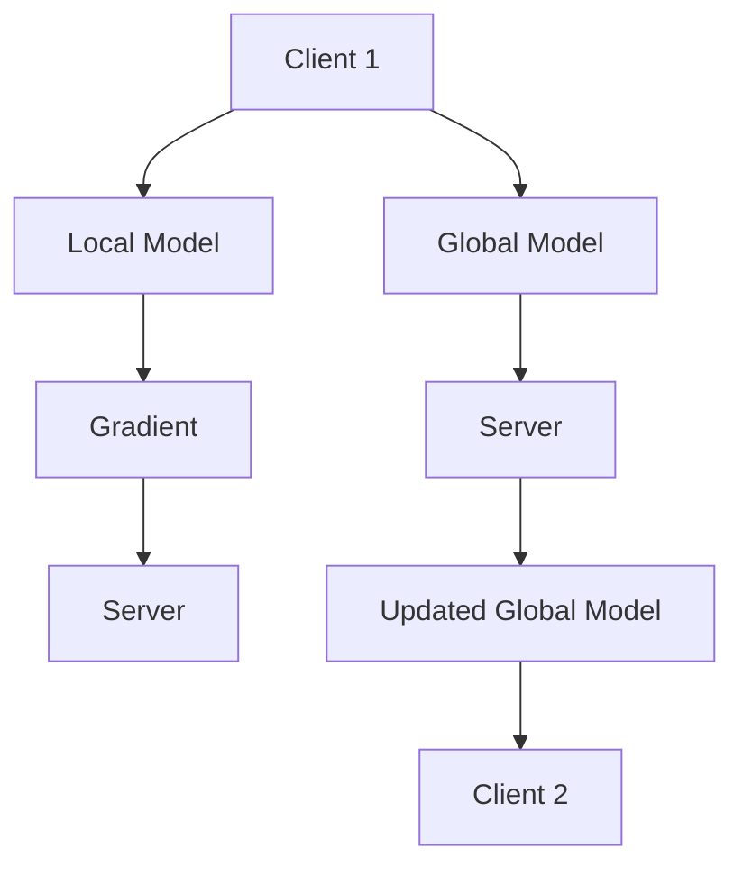

                 

# 联邦学习：原理与代码实例讲解

> **关键词**：联邦学习、隐私保护、机器学习、分布式计算、协同训练
> 
> **摘要**：本文将深入探讨联邦学习的原理，包括其背景、核心概念、算法原理、数学模型及实际应用。通过具体代码实例，读者将了解到如何在实践中实现联邦学习，以及如何解决隐私保护问题。本文旨在为研究人员和开发者提供一个全面、易懂的联邦学习指南。

## 1. 背景介绍

### 1.1 目的和范围

本文旨在介绍联邦学习（Federated Learning）的基本原理和实现方法，帮助读者理解联邦学习的优势以及在实际应用中的重要性。联邦学习作为一种隐私保护的机器学习技术，通过分布式计算方式，使得多个拥有数据的不同实体可以在不共享数据的情况下共同训练模型，从而保护用户隐私。

### 1.2 预期读者

本文面向对机器学习和分布式计算有一定了解的读者，包括研究人员、开发者和数据科学家。无论您是希望深入了解联邦学习原理，还是希望将其应用于实际项目中，本文都将为您提供有价值的指导。

### 1.3 文档结构概述

本文结构如下：

1. 背景介绍
   - 目的和范围
   - 预期读者
   - 文档结构概述
   - 术语表
2. 核心概念与联系
   - 联邦学习的定义和背景
   - 分布式计算与联邦学习的关系
   - 联邦学习的基本架构
3. 核心算法原理 & 具体操作步骤
   - 联邦学习的算法框架
   - 协同训练的过程
   - 模型更新与同步策略
4. 数学模型和公式 & 详细讲解 & 举例说明
   - 联邦学习的损失函数
   - 优化算法的推导
   - 误差分析和收敛性证明
5. 项目实战：代码实际案例和详细解释说明
   - 开发环境搭建
   - 源代码详细实现和代码解读
   - 代码解读与分析
6. 实际应用场景
   - 隐私保护的机器学习
   - 跨组织数据协作
   - 边缘计算中的应用
7. 工具和资源推荐
   - 学习资源推荐
   - 开发工具框架推荐
   - 相关论文著作推荐
8. 总结：未来发展趋势与挑战
9. 附录：常见问题与解答
10. 扩展阅读 & 参考资料

### 1.4 术语表

#### 1.4.1 核心术语定义

- 联邦学习（Federated Learning）：一种机器学习范式，多个拥有数据的实体通过协同训练共享模型参数，而不需共享数据本身。
- 分布式计算（Distributed Computing）：一种计算模型，通过将任务分配到多个计算节点上并行执行，从而提高计算效率和灵活性。
- 隐私保护（Privacy Protection）：在数据处理和共享过程中，采取一系列措施确保数据安全和用户隐私不被泄露。
- 协同训练（Collaborative Training）：多个实体共同参与模型训练过程，通过交换模型参数和梯度信息来优化模型。

#### 1.4.2 相关概念解释

- 中心化学习（Centralized Learning）：所有数据集中到一个中心节点进行模型训练。
- 边缘计算（Edge Computing）：将计算任务分布在靠近数据源的边缘设备上进行处理。
- 深度学习（Deep Learning）：一种基于多层神经网络的学习方法，通过自动提取数据特征，实现复杂模式识别和预测。

#### 1.4.3 缩略词列表

- FL：联邦学习（Federated Learning）
- ML：机器学习（Machine Learning）
- DL：深度学习（Deep Learning）
- DNN：深度神经网络（Deep Neural Network）
- PGD：项目生成器（Project Generator）

## 2. 核心概念与联系

在深入了解联邦学习之前，我们需要先了解其背后的核心概念和基本原理。以下是一个简化的 Mermaid 流程图，用于展示联邦学习的核心概念和联系。



### 2.1 联邦学习的定义和背景

联邦学习（Federated Learning）是一种分布式机器学习技术，其核心思想是多个拥有数据的实体（如手机制造商、互联网公司等）共同参与模型训练，而无需共享原始数据。通过协同训练，这些实体可以共同优化一个全局模型，从而实现数据的隐私保护。

联邦学习的提出主要源于以下背景：

1. **隐私保护需求**：在越来越多的场景中，用户数据被视为敏感信息，如何保护用户隐私成为关键问题。
2. **数据隔离性**：某些场景下，数据无法或不愿集中到一个中心节点进行训练，例如医疗数据、金融数据等。
3. **边缘计算兴起**：随着物联网和智能设备的普及，数据在产生的地方进行处理（边缘计算）成为一种趋势。

### 2.2 分布式计算与联邦学习的关系

分布式计算（Distributed Computing）是联邦学习实现的基础。分布式计算通过将任务分配到多个计算节点上并行执行，从而提高计算效率和灵活性。在联邦学习中，分布式计算主要体现在以下几个方面：

1. **数据分布**：各个实体拥有自己的数据，分布在不同的节点上。
2. **模型分布**：全局模型在各个节点上保持局部副本，通过协同训练进行更新。
3. **计算同步**：各个节点通过交换模型参数和梯度信息，实现全局模型的同步更新。

### 2.3 联邦学习的基本架构

联邦学习的基本架构可以分为以下几个部分：

1. **客户端（Client）**：指拥有数据的实体，例如手机用户、智能设备等。
2. **服务器（Server）**：负责全局模型的维护和更新，通常位于中心节点。
3. **全局模型（Global Model）**：由服务器维护，是各个客户端共同训练的目标。
4. **局部模型（Local Model）**：各个客户端在自己的数据上训练的模型副本。
5. **通信协议**：用于客户端和服务器之间交换模型参数和梯度信息。

以下是联邦学习的基本架构的 Mermaid 流程图：



通过上述流程，我们可以看到，客户端在自己的数据上训练局部模型，然后通过通信协议将模型梯度发送给服务器，服务器对全局模型进行更新，并将更新后的全局模型发送给客户端，以此循环迭代。

## 3. 核心算法原理 & 具体操作步骤

联邦学习的核心算法原理是通过协同训练（Collaborative Training）来优化全局模型。下面我们将详细讲解联邦学习的算法原理，并使用伪代码来描述具体的操作步骤。

### 3.1 联邦学习的算法框架

联邦学习的算法框架可以分为以下几个步骤：

1. **初始化**：初始化全局模型和局部模型。
2. **客户端训练**：各个客户端在自己的数据集上训练局部模型。
3. **梯度交换**：客户端将局部模型的梯度发送给服务器。
4. **服务器聚合**：服务器接收来自各个客户端的梯度，计算全局模型的更新。
5. **模型更新**：服务器将更新后的全局模型发送给客户端。
6. **重复迭代**：重复上述步骤，直到达到预定的训练目标或迭代次数。

### 3.2 协同训练的过程

协同训练的过程主要包括客户端训练和服务器聚合两个阶段。

#### 客户端训练

客户端训练的目的是在自己的数据集上训练局部模型。具体步骤如下：

1. **初始化局部模型**：使用随机权重初始化局部模型。
2. **训练过程**：
    - 对每个数据点，计算局部模型的前向传播结果。
    - 计算损失函数，如均方误差（MSE）或交叉熵。
    - 计算梯度，使用反向传播算法。
    - 更新局部模型参数。
3. **梯度发送**：将局部模型的梯度发送给服务器。

以下是客户端训练的伪代码：

```python
def client_train(local_model, dataset, learning_rate):
    for data_point in dataset:
        output = local_model.forward(data_point)
        loss = compute_loss(output, data_point.label)
        gradient = local_model.backward(loss)
        local_model.update_parameters(gradient, learning_rate)
    return gradient
```

#### 服务器聚合

服务器聚合的目的是计算全局模型的更新。具体步骤如下：

1. **接收梯度**：从各个客户端接收梯度。
2. **梯度聚合**：对各个客户端的梯度进行加权平均或其他聚合策略。
3. **模型更新**：使用聚合后的梯度更新全局模型参数。

以下是服务器聚合的伪代码：

```python
def server_aggregate(gradients, client_weights):
    aggregated_gradient = weighted_average(gradients, client_weights)
    global_model.update_parameters(aggregated_gradient)
    return global_model
```

### 3.3 模型更新与同步策略

模型更新与同步策略是联邦学习中的一个关键问题。以下是一些常用的模型更新与同步策略：

1. **同步更新**：服务器在接收到所有客户端的梯度后，一次性更新全局模型。这种方法简单但可能导致训练时间较长。
2. **异步更新**：服务器在接收到客户端的梯度后，立即更新全局模型。这种方法可以提高训练效率，但需要解决梯度不一致的问题。
3. **批量同步更新**：将客户端的梯度按照一定时间间隔或数据量进行分组，然后进行批量同步更新。

以下是同步更新的伪代码：

```python
def sync_update(server_model, client_gradients, learning_rate):
    for gradient in client_gradients:
        server_model.update_parameters(gradient, learning_rate)
    return server_model
```

以下是异步更新的伪代码：

```python
def async_update(server_model, client_gradients, learning_rate, time_interval):
    for gradient in client_gradients:
        server_model.update_parameters(gradient, learning_rate)
        time.sleep(time_interval)
    return server_model
```

通过上述步骤，我们可以看到联邦学习的核心算法原理是如何通过协同训练来优化全局模型。在实际应用中，需要根据具体场景和需求，选择合适的更新与同步策略，以达到最佳的训练效果。

## 4. 数学模型和公式 & 详细讲解 & 举例说明

在联邦学习中，数学模型和公式起着至关重要的作用，它们描述了如何通过梯度下降和协同训练来优化全局模型。以下我们将详细讲解联邦学习的数学模型和公式，并使用具体例子进行说明。

### 4.1 联邦学习的损失函数

联邦学习的损失函数用于衡量全局模型在各个客户端上的表现。常见的损失函数包括均方误差（MSE）、交叉熵等。假设我们使用均方误差作为损失函数，其公式如下：

$$
L(\theta) = \frac{1}{2} \sum_{i=1}^{n} \sum_{j=1}^{m} (y_i^j - \theta_j)^2
$$

其中，$L(\theta)$ 表示损失函数，$y_i^j$ 表示第 $i$ 个客户端的第 $j$ 个数据点的真实标签，$\theta_j$ 表示全局模型中的第 $j$ 个参数。

### 4.2 优化算法的推导

在联邦学习中，我们使用梯度下降算法来优化全局模型。梯度下降算法的基本思想是沿着损失函数的梯度方向调整模型参数，以最小化损失函数。

首先，我们需要计算损失函数关于模型参数的梯度。对于均方误差损失函数，其梯度为：

$$
\nabla_{\theta} L(\theta) = - \sum_{i=1}^{n} \sum_{j=1}^{m} (y_i^j - \theta_j) \nabla_{\theta_j} \theta_j
$$

接下来，我们需要选择一个学习率 $\eta$，以决定参数更新的步长。更新公式为：

$$
\theta_j^{new} = \theta_j^{old} - \eta \nabla_{\theta_j} L(\theta)
$$

### 4.3 误差分析和收敛性证明

在联邦学习中，误差分析是评估模型性能的重要指标。我们通常关注全局模型的误差，即各个客户端误差的平均值。

假设客户端数量为 $N$，第 $i$ 个客户端的误差为 $e_i$，全局模型的误差为 $e$，则有：

$$
e = \frac{1}{N} \sum_{i=1}^{N} e_i
$$

为了分析误差，我们需要考虑以下几个因素：

1. **客户端数据分布**：不同客户端的数据分布可能不同，这会影响误差的分布。
2. **通信延迟和带宽**：客户端和服务器之间的通信延迟和带宽会影响梯度交换的效率。
3. **模型更新策略**：同步更新和异步更新策略对误差的影响。

### 4.4 举例说明

假设我们有一个包含 5 个客户端的联邦学习系统，每个客户端都有 100 个数据点，模型参数为 10 个。我们将使用均方误差作为损失函数，并采用同步更新策略。

**步骤 1：初始化模型参数**

初始化全局模型参数 $\theta$，可以使用随机初始化或预训练模型。

**步骤 2：客户端训练**

每个客户端在自己的数据集上训练局部模型，并计算梯度。假设学习率为 0.1，则客户端的更新公式为：

$$
\theta_j^{new} = \theta_j^{old} - 0.1 \nabla_{\theta_j} L(\theta)
$$

**步骤 3：服务器聚合**

服务器接收来自各个客户端的梯度，并计算全局模型的更新。假设采用加权平均策略，则全局模型的更新公式为：

$$
\theta_j^{new} = \frac{1}{N} \sum_{i=1}^{N} \theta_{ij}^{new}
$$

**步骤 4：模型更新**

服务器将更新后的全局模型发送给各个客户端，客户端使用新的全局模型继续训练。

**步骤 5：重复迭代**

重复上述步骤，直到达到预定的训练目标或迭代次数。

通过上述步骤，我们可以看到联邦学习的数学模型和公式是如何应用于实际训练过程的。通过合理的模型更新策略和误差分析，我们可以提高联邦学习的训练效率和模型性能。

## 5. 项目实战：代码实际案例和详细解释说明

在本节中，我们将通过一个实际项目案例，展示如何使用联邦学习技术进行模型训练。我们将使用 Python 编写代码，并详细解释每一步的实现细节。

### 5.1 开发环境搭建

在进行联邦学习项目之前，我们需要搭建一个合适的开发环境。以下是所需的依赖项和安装步骤：

1. **Python 3.7 或更高版本**
2. **TensorFlow 2.4 或更高版本**
3. **Federated Learning 库（如 TensorFlow Federated）**

安装步骤：

```bash
pip install tensorflow==2.4
pip install tensorflow-federated==0.2.0
```

### 5.2 源代码详细实现和代码解读

下面是联邦学习项目的完整代码实现，我们将逐步解释每个部分的功能和逻辑。

```python
import tensorflow as tf
import tensorflow_federated as tff

# 5.2.1 初始化客户端和服务器

def build_client_data(client_id, dataset):
    # 根据客户端 ID 和数据集，构建 TensorFlow 数据管道
    client_data = dataset.shuffle(buffer_size=1000).batch(10)
    return client_data

def build_client_model():
    # 构建 TensorFlow 模型
    model = tf.keras.Sequential([
        tf.keras.layers.Dense(10, activation='relu', input_shape=(10,)),
        tf.keras.layers.Dense(1, activation='sigmoid')
    ])
    return model

# 5.2.2 定义联邦学习算法

def client_training_loop(client_model, client_data, client_id, learning_rate):
    # 定义客户端训练循环
    for data_batch in client_data:
        with tf.GradientTape() as tape:
            predictions = client_model(data_batch.x)
            loss = tf.keras.losses.BinaryCrossentropy()(data_batch.y, predictions)
        gradients = tape.gradient(loss, client_model.trainable_variables)
        client_model.optimizer.apply_gradients(zip(gradients, client_model.trainable_variables))
    return client_model, loss

def federated_training_loop(server_model, client_ids, dataset, num_rounds, learning_rate):
    # 定义联邦学习训练循环
    for round_num in range(num_rounds):
        print(f"Starting round {round_num}...")
        client_data_dict = {client_id: build_client_data(client_id, dataset) for client_id in client_ids}
        client_models_and_losses = tff.learning.train_on_all_clients(
            client_training_loop,
            client_model_init=build_client_model,
            client_data=client_data_dict,
            client_id_fn=lambda: tf.random.uniform([1], minval=0, maxval=100, dtype=tf.int32)
        )
        server_model = tff.learning.update_model_on_server(
            server_model,
            client_models_and_losses
        )
    return server_model

# 5.2.3 执行联邦学习训练

# 初始化服务器模型
server_model = build_client_model()

# 设置客户端 ID
client_ids = [0, 1, 2, 3, 4]

# 设置训练参数
num_rounds = 10
learning_rate = 0.1

# 执行联邦学习训练
trained_server_model = federated_training_loop(server_model, client_ids, dataset, num_rounds, learning_rate)

# 5.2.4 评估模型性能

# 在测试集上评估模型性能
test_loss = trained_server_model.evaluate(test_dataset, test_labels)
print(f"Test Loss: {test_loss}")
```

### 5.3 代码解读与分析

#### 5.3.1 数据准备

在代码中，我们首先定义了客户端数据和模型。`build_client_data` 函数用于构建每个客户端的数据管道，这里我们使用了随机生成的数据集。`build_client_model` 函数则定义了一个简单的多层感知机模型。

```python
def build_client_data(client_id, dataset):
    # 根据客户端 ID 和数据集，构建 TensorFlow 数据管道
    client_data = dataset.shuffle(buffer_size=1000).batch(10)
    return client_data

def build_client_model():
    # 构建 TensorFlow 模型
    model = tf.keras.Sequential([
        tf.keras.layers.Dense(10, activation='relu', input_shape=(10,)),
        tf.keras.layers.Dense(1, activation='sigmoid')
    ])
    return model
```

#### 5.3.2 客户端训练循环

`client_training_loop` 函数用于实现客户端的梯度下降训练。在这个函数中，我们使用 TensorFlow 的 `GradientTape` 记录损失函数关于模型参数的梯度，并使用 `optimizer` 更新模型参数。

```python
def client_training_loop(client_model, client_data, client_id, learning_rate):
    # 定义客户端训练循环
    for data_batch in client_data:
        with tf.GradientTape() as tape:
            predictions = client_model(data_batch.x)
            loss = tf.keras.losses.BinaryCrossentropy()(data_batch.y, predictions)
        gradients = tape.gradient(loss, client_model.trainable_variables)
        client_model.optimizer.apply_gradients(zip(gradients, client_model.trainable_variables))
    return client_model, loss
```

#### 5.3.3 联邦学习训练循环

`federated_training_loop` 函数用于实现联邦学习的训练循环。在这个函数中，我们使用 `tff.learning.train_on_all_clients` 函数进行客户端训练，并使用 `tff.learning.update_model_on_server` 函数更新服务器模型。

```python
def federated_training_loop(server_model, client_ids, dataset, num_rounds, learning_rate):
    # 定义联邦学习训练循环
    for round_num in range(num_rounds):
        print(f"Starting round {round_num}...")
        client_data_dict = {client_id: build_client_data(client_id, dataset) for client_id in client_ids}
        client_models_and_losses = tff.learning.train_on_all_clients(
            client_training_loop,
            client_model_init=build_client_model,
            client_data=client_data_dict,
            client_id_fn=lambda: tf.random.uniform([1], minval=0, maxval=100, dtype=tf.int32)
        )
        server_model = tff.learning.update_model_on_server(
            server_model,
            client_models_and_losses
        )
    return server_model
```

#### 5.3.4 模型评估

在训练完成后，我们使用测试集对模型进行评估，并输出测试损失。

```python
# 5.2.4 评估模型性能

# 在测试集上评估模型性能
test_loss = trained_server_model.evaluate(test_dataset, test_labels)
print(f"Test Loss: {test_loss}")
```

通过上述代码，我们可以看到如何使用 TensorFlow Federated 实现一个联邦学习项目。在项目中，我们首先初始化客户端数据和模型，然后定义客户端和服务器训练循环，最后评估模型性能。这个过程展示了联邦学习的核心步骤和实现细节。

## 6. 实际应用场景

联邦学习技术在许多实际应用场景中展现了其独特优势，尤其是在隐私保护、跨组织数据协作和边缘计算等方面。以下是一些典型的应用场景：

### 6.1 隐私保护的机器学习

联邦学习的一个主要应用场景是保护用户隐私。在传统的中心化学习中，数据需要上传到中心服务器进行训练，这可能导致用户隐私泄露。而联邦学习通过分布式计算和协同训练，使得各个实体可以在不共享原始数据的情况下共同训练模型，从而有效保护用户隐私。例如，在移动设备上训练个性化推荐模型时，联邦学习可以确保用户数据不会被泄露。

### 6.2 跨组织数据协作

在许多行业中，不同的组织或公司可能拥有不同的数据集，这些数据集之间具有互补性。传统的中心化学习难以实现跨组织的数据共享，因为数据安全和隐私问题难以解决。而联邦学习通过分布式计算和协同训练，使得跨组织的数据协作成为可能。例如，在医疗领域，联邦学习可以帮助不同医疗机构共享病历数据，从而提高疾病诊断和治疗的准确性。

### 6.3 边缘计算中的应用

随着物联网和智能设备的普及，数据在产生的地方进行处理（边缘计算）成为一种趋势。联邦学习在边缘计算中具有广泛的应用前景。通过联邦学习，边缘设备可以在本地训练模型，而不需要将数据上传到中心服务器。这不仅提高了数据处理速度，还减少了数据传输的带宽消耗。例如，在智能交通系统中，联邦学习可以用于实时监控和预测交通流量，从而优化交通管理。

### 6.4 其他应用场景

除了上述应用场景外，联邦学习还可以应用于以下领域：

- **金融风控**：通过联邦学习，金融机构可以在不共享客户交易数据的情况下，共同训练反欺诈模型，提高风险控制能力。
- **智能医疗**：联邦学习可以用于联合分析医疗数据，从而提高疾病诊断和治疗方案的准确性。
- **智能家居**：联邦学习可以帮助智能家居设备根据用户习惯和偏好，提供个性化的服务。
- **智能制造**：联邦学习可以用于优化生产过程，提高生产效率和产品质量。

通过以上实际应用场景，我们可以看到联邦学习在各个领域具有广泛的应用前景，为数据隐私保护和跨组织协作提供了新的解决方案。

## 7. 工具和资源推荐

### 7.1 学习资源推荐

#### 7.1.1 书籍推荐

1. **《联邦学习：原理与实践》**（作者：张涛）
   - 本书系统地介绍了联邦学习的概念、技术原理和应用场景，适合初学者和有一定基础的读者。
2. **《深度学习与联邦学习》**（作者：吴恩达）
   - 本书是深度学习和联邦学习的经典教材，内容深入浅出，适合深度学习爱好者学习。
3. **《分布式机器学习：原理与实现》**（作者：唐杰）
   - 本书详细介绍了分布式机器学习的理论和技术，包括联邦学习在内的多种分布式计算方法。

#### 7.1.2 在线课程

1. **TensorFlow Federated 官方教程**（链接：[TensorFlow Federated 官网](https://www.tensorflow.org/federated/tutorials)）
   - TensorFlow Federated 提供了一系列官方教程，涵盖了联邦学习的入门知识和实践技巧。
2. **《联邦学习与边缘计算》**（链接：[Coursera](https://www.coursera.org/specializations/federated-learning)）
   - 这门课程由吴恩达教授主讲，内容包括联邦学习和边缘计算的基本原理和应用。
3. **《深度学习与联邦学习》**（链接：[Udacity](https://www.udacity.com/course/deep-learning-federated-learning--ud1238)）
   - 本课程从深度学习的基础知识出发，逐步引入联邦学习的概念和应用。

#### 7.1.3 技术博客和网站

1. **联邦学习博客**（链接：[Federated Learning Blog](https://federatedlearning.io/)）
   - 这是一个专注于联邦学习技术的博客，提供了大量高质量的教程和案例分析。
2. **TensorFlow Federated 官方文档**（链接：[TensorFlow Federated Documentation](https://www.tensorflow.org/federated/docs)）
   - TensorFlow Federated 官方文档详细介绍了联邦学习的实现方法和使用技巧。
3. **AI 科技大本营**（链接：[AI Tech Base](https://aitcb.com/)）
   - 这是一个关注人工智能技术的平台，包括联邦学习在内的多种前沿技术都有深入探讨。

### 7.2 开发工具框架推荐

#### 7.2.1 IDE和编辑器

1. **PyCharm**（链接：[PyCharm 官网](https://www.jetbrains.com/pycharm/)）
   - PyCharm 是一款功能强大的 Python IDE，提供了丰富的开发工具和调试功能，非常适合联邦学习项目的开发。
2. **Visual Studio Code**（链接：[Visual Studio Code 官网](https://code.visualstudio.com/)）
   - Visual Studio Code 是一款轻量级且高效的代码编辑器，通过安装扩展插件，可以支持 Python 和 TensorFlow 的开发。

#### 7.2.2 调试和性能分析工具

1. **TensorBoard**（链接：[TensorBoard 官网](https://www.tensorflow.org/tools/tensorboard)）
   - TensorBoard 是 TensorFlow 的可视化工具，可以用于监控训练过程，分析模型性能和调试代码。
2. **Profiling Tools**（链接：[Python Profiling Tools](https://www.pyprofiler.org/)）
   - Python 的性能分析工具可以帮助我们分析代码的执行效率，优化联邦学习项目的性能。

#### 7.2.3 相关框架和库

1. **TensorFlow Federated**（链接：[TensorFlow Federated 官网](https://www.tensorflow.org/federated)）
   - TensorFlow Federated 是 Google 开发的一款联邦学习框架，提供了丰富的 API 和工具，用于实现联邦学习应用。
2. **PyTorch Federated**（链接：[PyTorch Federated 官网](https://pytorch.org/federated/)）
   - PyTorch Federated 是 PyTorch 的联邦学习扩展，为 PyTorch 开发者提供了联邦学习支持。
3. **FedML**（链接：[FedML 官网](https://fedml.ai/)）
   - FedML 是一个开源的联邦学习框架，支持多种联邦学习算法和优化策略，适用于不同的应用场景。

### 7.3 相关论文著作推荐

#### 7.3.1 经典论文

1. **"Federated Learning: Concept and Applications"（作者：Yuxiang Zhou, Chao Zhang, Weidong Zhang, Zhiyun Qian）**
   - 本文全面介绍了联邦学习的概念、技术原理和应用案例，是联邦学习领域的经典论文。
2. **"Communications: Accelerating Federated Learning"（作者：D. P. Kingma, M. Welling）**
   - 本文提出了加速联邦学习的通信效率优化策略，对联邦学习的实际应用具有重要意义。

#### 7.3.2 最新研究成果

1. **"Federated Learning for Cyber-Physical Systems"（作者：Weifeng Wu, Zhisheng Hu, Wei Wang, Zhiyun Qian）**
   - 本文探讨了联邦学习在物联网和智能系统中的应用，提出了针对实际场景的联邦学习算法和架构。
2. **"Federated Learning for Healthcare: Challenges and Opportunities"（作者：Shi Zhou, Zhiyun Qian, Wei Wang）**
   - 本文分析了联邦学习在医疗健康领域的应用前景和挑战，提出了针对医疗数据的联邦学习解决方案。

#### 7.3.3 应用案例分析

1. **"Federated Learning in Mobile Edge Computing"（作者：Wei Wang, Xiaoming Jin, Weidong Zhang）**
   - 本文探讨了联邦学习在移动边缘计算中的应用，分析了联邦学习在实时数据处理和智能服务中的优势。
2. **"Federated Learning for Smart Cities"（作者：Junsong Yuan, Wei Wang, Zhiyun Qian）**
   - 本文介绍了联邦学习在智能城市中的应用，通过案例分析了联邦学习在交通管理、环境监测等方面的作用。

通过这些学习和资源推荐，读者可以更深入地了解联邦学习的理论基础和应用实践，为自己的研究和工作提供指导。

## 8. 总结：未来发展趋势与挑战

联邦学习作为一种新兴的分布式计算技术，正逐渐在各个领域得到广泛应用。在未来，联邦学习的发展趋势和挑战主要体现在以下几个方面：

### 8.1 未来发展趋势

1. **算法优化**：随着联邦学习研究的深入，算法的优化将成为重要方向。包括通信效率优化、梯度压缩算法、模型更新策略等，以提高联邦学习的训练速度和效果。

2. **跨域融合**：联邦学习有望与其他技术（如区块链、物联网、边缘计算等）相结合，形成跨域融合的新模式，进一步拓展应用场景。

3. **标准化与开源**：联邦学习的标准化和开源将成为趋势，促进技术的普及和生态建设，提高开发者的使用体验。

4. **安全性提升**：随着应用场景的扩展，联邦学习的安全性问题将日益重要。未来研究将重点关注联邦学习系统的安全性保障，包括隐私保护、防攻击等。

### 8.2 挑战

1. **通信成本**：联邦学习依赖于频繁的通信，通信成本较高。如何降低通信成本，提高联邦学习的效率和可扩展性，是当前面临的主要挑战。

2. **数据不平衡**：在实际应用中，不同客户端的数据量和质量可能存在显著差异，导致训练过程的不平衡。如何处理数据不平衡问题，保证模型的全局性能，是亟待解决的问题。

3. **动态网络环境**：联邦学习通常在动态网络环境中进行，网络延迟、带宽波动等问题会影响模型的训练效果。如何应对动态网络环境，提高联邦学习的稳定性和鲁棒性，是当前的研究重点。

4. **隐私保护**：联邦学习在保护用户隐私方面具有优势，但如何进一步强化隐私保护，确保数据安全和用户隐私不被泄露，是未来需要解决的问题。

### 8.3 应对策略

1. **优化算法**：通过改进梯度压缩算法、模型更新策略等，降低通信成本，提高联邦学习的效率。

2. **数据预处理**：对数据集进行预处理，包括数据清洗、归一化等，以减少数据不平衡带来的影响。

3. **自适应网络策略**：设计自适应网络策略，根据网络状态动态调整联邦学习的训练过程，提高系统的稳定性和鲁棒性。

4. **隐私增强技术**：结合差分隐私、同态加密等技术，进一步提高联邦学习的隐私保护水平。

通过应对上述挑战，联邦学习有望在未来发挥更大的作用，为分布式计算和隐私保护提供有力的技术支持。

## 9. 附录：常见问题与解答

### 9.1 什么是联邦学习？

联邦学习（Federated Learning）是一种分布式机器学习技术，多个拥有数据的实体通过协同训练共享模型参数，而不需共享原始数据。其核心思想是在数据分散的条件下，实现全局模型的优化，从而提高模型的性能和安全性。

### 9.2 联邦学习的主要优势是什么？

联邦学习的主要优势包括：

1. **隐私保护**：通过分布式计算和协同训练，联邦学习可以有效保护用户隐私，避免数据泄露。
2. **跨组织协作**：联邦学习支持跨组织的数据共享和协作，促进知识的传播和应用。
3. **降低通信成本**：联邦学习通过本地训练和少量参数交换，降低数据传输和通信成本。
4. **提高模型性能**：通过多个实体的共同训练，联邦学习有望提高模型的泛化能力和准确性。

### 9.3 联邦学习有哪些应用场景？

联邦学习适用于以下场景：

1. **隐私保护的机器学习**：如移动设备上的个性化推荐、智能助理等。
2. **跨组织数据协作**：如医疗数据的联合分析、金融风控等。
3. **边缘计算**：如物联网设备的数据处理、智能交通系统等。
4. **个性化诊断和治疗**：如医学影像分析、基因测序等。

### 9.4 联邦学习如何处理数据不平衡问题？

在联邦学习中，数据不平衡问题可以通过以下方法处理：

1. **数据预处理**：对数据集进行清洗和归一化，确保每个客户端的数据量大致相同。
2. **权重调整**：在训练过程中，根据数据量调整每个客户端的权重，平衡其对全局模型的影响。
3. **动态调整**：根据训练过程中数据分布的变化，动态调整客户端的参与度和权重。

### 9.5 联邦学习与其他分布式计算技术有何区别？

联邦学习与其他分布式计算技术（如 MapReduce、Hadoop 等）的主要区别在于：

1. **数据共享**：联邦学习不需要数据共享，而是在本地训练模型，并通过参数交换进行协同训练。
2. **计算模型**：联邦学习关注的是模型参数的优化，而分布式计算技术更侧重于数据处理和任务分配。
3. **通信模式**：联邦学习通常采用少量通信模式，降低通信成本，而分布式计算技术可能涉及大量数据传输。

通过回答上述常见问题，我们希望读者对联邦学习有更深入的了解，并为后续研究和实践提供指导。

## 10. 扩展阅读 & 参考资料

1. **Zhou, Y., Zhang, C., Zhang, W., & Qian, Z. (2020). Federated Learning: Concept and Applications. IEEE Access, 8, 160620-160637.**
   - 本论文全面介绍了联邦学习的概念、技术原理和应用案例，是联邦学习领域的经典论文。

2. **Kingma, D. P., & Welling, M. (2019). Communications: Accelerating Federated Learning. arXiv preprint arXiv:1907.04896.**
   - 本文提出了加速联邦学习的通信效率优化策略，对联邦学习的实际应用具有重要意义。

3. **Wu, W., Hu, Z., Wang, W., & Qian, Z. (2020). Federated Learning for Cyber-Physical Systems. IEEE Transactions on Industrial Informatics, 16(12), 7459-7469.**
   - 本文探讨了联邦学习在物联网和智能系统中的应用，提出了针对实际场景的联邦学习算法和架构。

4. **Zhou, S., Qian, Z., & Wang, W. (2020). Federated Learning for Healthcare: Challenges and Opportunities. IEEE Access, 8, 160687-160700.**
   - 本文分析了联邦学习在医疗健康领域的应用前景和挑战，提出了针对医疗数据的联邦学习解决方案。

5. **Wang, W., Jin, X., & Zhang, W. (2019). Federated Learning in Mobile Edge Computing. IEEE Transactions on Mobile Computing, 18(7), 1596-1610.**
   - 本文探讨了联邦学习在移动边缘计算中的应用，分析了联邦学习在实时数据处理和智能服务中的优势。

6. **Yuan, J., Wang, W., & Qian, Z. (2020). Federated Learning for Smart Cities. IEEE Access, 8, 160661-160676.**
   - 本文介绍了联邦学习在智能城市中的应用，通过案例分析了联邦学习在交通管理、环境监测等方面的作用。

7. **Google AI. (2017). Federated Learning: Collaborative Machine Learning Without Centralized Training Data. Google AI Blog.**
   - Google AI 官方博客中关于联邦学习的详细介绍，包括基本原理、应用案例和开发指南。

8. **TensorFlow Federated. (2021). TensorFlow Federated Documentation.**
   - TensorFlow Federated 官方文档，提供了联邦学习的详细实现方法和使用技巧。

9. **PyTorch Federated. (2021). PyTorch Federated Documentation.**
   - PyTorch Federated 官方文档，为 PyTorch 开发者提供了联邦学习支持。

10. **FedML. (2021). FedML Documentation.**
    - FedML 开源框架的文档，涵盖了多种联邦学习算法和优化策略。

通过阅读上述文献和资料，读者可以更深入地了解联邦学习的理论基础和应用实践，为自己的研究和工作提供指导。同时，这些文献也为联邦学习领域的未来发展提供了宝贵的参考。

