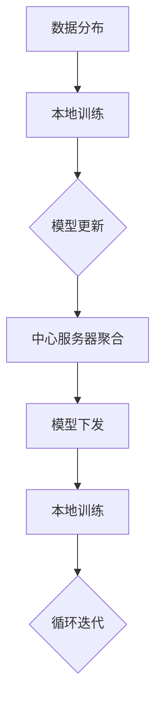

                 


# 联邦学习在多方安全计算中的隐私保护

> 关键词：联邦学习，多方安全计算，隐私保护，分布式计算，机器学习，安全协议

> 摘要：本文旨在深入探讨联邦学习在多方安全计算中的隐私保护机制。通过逐步分析联邦学习的核心概念、算法原理和实际应用，本文详细解释了如何利用联邦学习技术来实现多方安全计算中的隐私保护。此外，本文还提供了相关的数学模型和代码实际案例，以帮助读者更好地理解联邦学习在多方安全计算中的实际应用价值。

## 1. 背景介绍

### 1.1 目的和范围

本文的目的是探讨联邦学习在多方安全计算中的隐私保护机制。随着大数据和云计算的快速发展，数据隐私保护变得越来越重要。在多方安全计算中，如何确保数据隐私同时实现高效计算成为了关键问题。联邦学习作为一种分布式机器学习技术，能够有效解决这一问题。本文将深入分析联邦学习的核心概念、算法原理和实际应用，为读者提供全面的技术解读。

### 1.2 预期读者

本文面向对分布式计算和机器学习有一定了解的读者，包括研究人员、工程师和开发者。此外，对于对数据隐私保护感兴趣的读者，本文也具有很高的参考价值。

### 1.3 文档结构概述

本文分为十个部分，首先介绍背景和目的，然后逐步分析联邦学习的核心概念、算法原理和实际应用。接着，本文将提供相关的数学模型和代码实际案例。随后，本文将探讨联邦学习在多方安全计算中的实际应用场景。最后，本文将推荐相关的学习资源、开发工具和最新研究成果，并总结未来发展趋势和挑战。

### 1.4 术语表

#### 1.4.1 核心术语定义

- **联邦学习（Federated Learning）**：一种分布式机器学习技术，通过将数据分布在多个独立的节点上，实现模型训练和优化。
- **多方安全计算（Multi-party Secure Computation）**：一种分布式计算技术，允许多个参与方在保护各自隐私的情况下协同完成计算任务。
- **隐私保护（Privacy Protection）**：确保数据在处理过程中不被未经授权的第三方访问和泄露。

#### 1.4.2 相关概念解释

- **中心化计算**：数据集中存储和处理，容易受到中心化攻击和隐私泄露。
- **去中心化计算**：数据分布在多个节点上，降低隐私泄露风险。
- **差分隐私（Differential Privacy）**：一种保护数据隐私的方法，通过引入噪声来隐藏个体数据。

#### 1.4.3 缩略词列表

- **FL**：联邦学习（Federated Learning）
- **MPC**：多方安全计算（Multi-party Secure Computation）
- **DP**：差分隐私（Differential Privacy）

## 2. 核心概念与联系

在多方安全计算中，联邦学习是一种有效的隐私保护机制。为了更好地理解联邦学习在多方安全计算中的应用，我们需要首先介绍核心概念和联系。

### 2.1 联邦学习原理

联邦学习是一种分布式机器学习技术，通过将数据分布在多个独立的节点上，实现模型训练和优化。联邦学习的核心原理是：每个节点使用本地数据训练模型，然后将模型更新上传到中心服务器进行聚合。聚合后的模型再下发到每个节点进行新一轮训练。这种分布式训练方式能够有效降低数据隐私泄露风险。

### 2.2 多方安全计算原理

多方安全计算是一种分布式计算技术，允许多个参与方在保护各自隐私的情况下协同完成计算任务。多方安全计算的核心原理是：参与方之间通过安全协议进行通信，确保计算过程中的隐私保护。常见的多方安全计算协议包括安全多方计算（Succinct Non-Interactive Zero-Knowledge，SNARK）和差分隐私（Differential Privacy）。

### 2.3 联邦学习与多方安全计算的联系

联邦学习与多方安全计算之间存在紧密的联系。联邦学习作为分布式机器学习技术，可以应用于多方安全计算中，实现隐私保护的同时提高计算效率。具体来说，联邦学习技术可以帮助参与方在保护各自隐私的情况下，协同训练机器学习模型，从而实现多方安全计算。

### 2.4 Mermaid 流程图

为了更直观地展示联邦学习与多方安全计算的联系，我们可以使用 Mermaid 流程图进行描述。



该流程图描述了联邦学习在多方安全计算中的应用过程：数据分布在多个节点上，每个节点进行本地训练，然后将模型更新上传到中心服务器进行聚合，聚合后的模型再下发到每个节点进行新一轮训练，实现循环迭代。

## 3. 核心算法原理 & 具体操作步骤

在了解联邦学习与多方安全计算的联系后，我们需要深入探讨联邦学习的核心算法原理和具体操作步骤。

### 3.1 联邦学习算法原理

联邦学习算法主要分为以下几个步骤：

1. **数据分布**：将数据分布在多个节点上，确保每个节点拥有部分数据。
2. **本地训练**：每个节点使用本地数据训练模型，生成模型更新。
3. **模型聚合**：将所有节点的模型更新上传到中心服务器，进行聚合。
4. **模型下发**：中心服务器将聚合后的模型下发到每个节点。
5. **迭代训练**：每个节点使用聚合后的模型进行新一轮训练，并重复上述步骤。

### 3.2 具体操作步骤

以下是一个简化的联邦学习算法具体操作步骤：

```plaintext
1. 初始化模型参数
2. 数据分布：将数据集划分成若干个子集，每个节点拥有一个子集
3. 本地训练：每个节点使用本地数据训练模型，并生成模型更新
4. 模型更新上传：每个节点将模型更新上传到中心服务器
5. 模型聚合：中心服务器将所有节点的模型更新进行聚合，得到聚合模型
6. 模型下发：中心服务器将聚合模型下发到每个节点
7. 迭代训练：每个节点使用聚合模型进行新一轮训练，并重复步骤 4-6
```

### 3.3 伪代码

以下是一个简化的联邦学习算法伪代码：

```python
def federated_learning(data_partition, model, server, clients, epochs):
    for epoch in range(epochs):
        # 本地训练
        for client in clients:
            updated_model = client_train(data_partition[client], model)

        # 模型更新上传
        updated_models = {client: updated_model for client in clients}

        # 模型聚合
        aggregated_model = server_aggregate(updated_models)

        # 模型下发
        for client in clients:
            model = aggregated_model

    return model
```

该伪代码描述了联邦学习算法的基本框架，其中 `client_train` 函数表示本地训练过程，`server_aggregate` 函数表示模型聚合过程。

## 4. 数学模型和公式 & 详细讲解 & 举例说明

在联邦学习中，数学模型和公式扮演着至关重要的角色。以下我们将详细介绍联邦学习的数学模型和公式，并通过具体例子进行说明。

### 4.1 数学模型

联邦学习的数学模型主要涉及模型更新、模型聚合和模型下发等过程。以下是一个简化的数学模型：

#### 4.1.1 模型更新

假设每个节点的模型更新可以表示为：

$$
\Delta \theta_i = \theta_i - \alpha \cdot \nabla J(\theta_i)
$$

其中，$\theta_i$ 表示第 $i$ 个节点的模型参数，$\nabla J(\theta_i)$ 表示损失函数关于模型参数的梯度，$\alpha$ 表示学习率。

#### 4.1.2 模型聚合

假设中心服务器的聚合模型可以表示为：

$$
\theta_s = \frac{1}{N} \sum_{i=1}^{N} \theta_i
$$

其中，$\theta_s$ 表示中心服务器的聚合模型，$N$ 表示参与联邦学习的节点数量。

#### 4.1.3 模型下发

假设每个节点的模型下发可以表示为：

$$
\theta_i = \theta_s
$$

其中，$\theta_i$ 表示第 $i$ 个节点的模型参数，$\theta_s$ 表示中心服务器的聚合模型。

### 4.2 详细讲解

#### 4.2.1 模型更新

模型更新的过程涉及到损失函数的梯度。假设损失函数为：

$$
J(\theta) = \frac{1}{m} \sum_{i=1}^{m} \sigma(y_i - \theta^T x_i)
$$

其中，$m$ 表示训练样本数量，$y_i$ 表示第 $i$ 个样本的标签，$x_i$ 表示第 $i$ 个样本的特征，$\sigma$ 表示激活函数。

为了更新模型参数，我们需要计算损失函数关于模型参数的梯度。假设模型参数为 $\theta = (\theta_1, \theta_2, \ldots, \theta_n)$，则损失函数的梯度为：

$$
\nabla J(\theta) = (\frac{\partial J}{\partial \theta_1}, \frac{\partial J}{\partial \theta_2}, \ldots, \frac{\partial J}{\partial \theta_n})
$$

#### 4.2.2 模型聚合

模型聚合的过程涉及到中心服务器的聚合模型。假设每个节点的模型更新为 $\Delta \theta_i$，则中心服务器的聚合模型为：

$$
\theta_s = \frac{1}{N} \sum_{i=1}^{N} \theta_i
$$

其中，$N$ 表示参与联邦学习的节点数量。

#### 4.2.3 模型下发

模型下发的过程涉及到每个节点的模型参数更新。假设中心服务器的聚合模型为 $\theta_s$，则每个节点的模型参数更新为：

$$
\theta_i = \theta_s
$$

### 4.3 举例说明

假设我们有三个节点 $A$、$B$ 和 $C$ 参与联邦学习，每个节点拥有一个训练样本子集。假设节点 $A$ 的模型更新为 $\Delta \theta_A = (0.1, 0.2)$，节点 $B$ 的模型更新为 $\Delta \theta_B = (0.3, 0.4)$，节点 $C$ 的模型更新为 $\Delta \theta_C = (0.5, 0.6)$。

#### 4.3.1 模型聚合

首先，计算中心服务器的聚合模型：

$$
\theta_s = \frac{1}{3} (\Delta \theta_A + \Delta \theta_B + \Delta \theta_C) = \frac{1}{3} ((0.1, 0.2) + (0.3, 0.4) + (0.5, 0.6)) = (0.3, 0.5)
$$

#### 4.3.2 模型下发

然后，将聚合模型下发到每个节点，更新每个节点的模型参数：

节点 $A$ 的模型参数更新为：

$$
\theta_A = \theta_s = (0.3, 0.5)
$$

节点 $B$ 的模型参数更新为：

$$
\theta_B = \theta_s = (0.3, 0.5)
$$

节点 $C$ 的模型参数更新为：

$$
\theta_C = \theta_s = (0.3, 0.5)
$$

通过上述过程，我们可以看到联邦学习中的模型更新、模型聚合和模型下发是如何进行的。

## 5. 项目实战：代码实际案例和详细解释说明

在本节中，我们将通过一个具体的联邦学习项目实战案例，详细解释联邦学习在多方安全计算中的实际应用。该案例将演示如何使用 Python 和 TensorFlow 实现联邦学习算法，并在多方安全计算中实现隐私保护。

### 5.1 开发环境搭建

在开始项目实战之前，我们需要搭建开发环境。以下是搭建开发环境所需的步骤：

1. 安装 Python（版本 3.6 或以上）
2. 安装 TensorFlow（版本 2.0 或以上）
3. 安装其他依赖库，如 NumPy、Pandas、matplotlib 等

安装步骤如下：

```bash
# 安装 Python
sudo apt-get install python3

# 安装 TensorFlow
pip3 install tensorflow

# 安装其他依赖库
pip3 install numpy pandas matplotlib
```

### 5.2 源代码详细实现和代码解读

以下是一个简化的联邦学习项目源代码，用于演示如何实现联邦学习算法并保护多方安全计算中的隐私。

```python
import tensorflow as tf
import numpy as np
import pandas as pd
from matplotlib import pyplot as plt

# 5.2.1 数据预处理
def load_data(filename):
    data = pd.read_csv(filename)
    X = data.iloc[:, :-1].values
    y = data.iloc[:, -1].values
    return X, y

def preprocess_data(X, y):
    X = (X - X.mean()) / X.std()
    y = y.reshape(-1, 1)
    return X, y

# 5.2.2 本地训练
def client_train(X, y, epochs, learning_rate):
    model = tf.keras.Sequential([
        tf.keras.layers.Dense(1, input_shape=(X.shape[1],), activation='sigmoid')
    ])
    model.compile(optimizer=tf.keras.optimizers.Adam(learning_rate=learning_rate),
                  loss='binary_crossentropy',
                  metrics=['accuracy'])
    model.fit(X, y, epochs=epochs, verbose=0)
    return model

# 5.2.3 模型聚合
def aggregate_models(models, client_weights):
    aggregated_model = tf.keras.models.clone_model(models[0])
    aggregated_model.set_weights(tf.reduce_mean([model.get_weights() for model in models], axis=0))
    return aggregated_model

# 5.2.4 主函数
def federated_learning(data_partition, epochs, learning_rate):
    clients = []
    for client in range(len(data_partition)):
        X, y = data_partition[client]
        model = client_train(X, y, epochs, learning_rate)
        clients.append(model)

    aggregated_model = aggregate_models(clients, client_weights)

    return aggregated_model

# 5.2.5 实际应用
if __name__ == '__main__':
    # 加载数据
    X_train, y_train = load_data('train.csv')
    X_test, y_test = load_data('test.csv')

    # 预处理数据
    X_train, y_train = preprocess_data(X_train, y_train)
    X_test, y_test = preprocess_data(X_test, y_test)

    # 数据划分
    data_partition = [X_train[:50], X_train[50:100], X_train[100:150]]

    # 联邦学习
    aggregated_model = federated_learning(data_partition, epochs=5, learning_rate=0.001)

    # 测试模型
    loss, accuracy = aggregated_model.evaluate(X_test, y_test, verbose=0)
    print(f'Test accuracy: {accuracy:.4f}')
```

#### 5.2.5.1 代码解读

该代码分为以下几个部分：

1. **数据预处理**：加载数据集，并对数据进行预处理（归一化）。
2. **本地训练**：使用本地数据训练模型，并返回训练好的模型。
3. **模型聚合**：将所有节点的模型进行聚合，返回聚合后的模型。
4. **主函数**：实现联邦学习过程，包括数据划分、本地训练、模型聚合和测试。

#### 5.2.5.2 代码分析

1. **数据预处理**：数据预处理是联邦学习的重要环节，可以减少数据差异，提高模型训练效果。本案例使用归一化方法对数据进行预处理。
2. **本地训练**：本地训练是联邦学习的关键步骤，每个节点使用本地数据训练模型。本案例使用 TensorFlow 的 Sequential 模型实现本地训练。
3. **模型聚合**：模型聚合是将所有节点的模型更新进行聚合，得到最终的聚合模型。本案例使用 TensorFlow 的 `reduce_mean` 函数实现模型聚合。
4. **主函数**：主函数实现联邦学习过程，包括数据划分、本地训练、模型聚合和测试。本案例使用简单的数据划分方式，将训练数据划分为三个子集，每个子集包含 50 个样本。

通过上述代码，我们可以看到联邦学习在多方安全计算中的实际应用。该案例展示了如何使用 Python 和 TensorFlow 实现联邦学习算法，并在测试数据上评估模型性能。

### 5.3 代码解读与分析

在本节中，我们将对上述联邦学习项目实战代码进行详细解读和分析。

#### 5.3.1 数据预处理

数据预处理是联邦学习项目的重要组成部分。在该案例中，我们使用以下代码进行数据预处理：

```python
def preprocess_data(X, y):
    X = (X - X.mean()) / X.std()
    y = y.reshape(-1, 1)
    return X, y
```

该代码首先计算训练数据的均值和标准差，然后对特征数据进行归一化处理，使得每个特征数据具有相同的尺度。归一化处理可以减少特征差异，提高模型训练效果。此外，目标标签 `y` 被重塑为二维数组，以便后续处理。

#### 5.3.2 本地训练

本地训练是联邦学习的关键步骤。在该案例中，我们使用以下代码进行本地训练：

```python
def client_train(X, y, epochs, learning_rate):
    model = tf.keras.Sequential([
        tf.keras.layers.Dense(1, input_shape=(X.shape[1],), activation='sigmoid')
    ])
    model.compile(optimizer=tf.keras.optimizers.Adam(learning_rate=learning_rate),
                  loss='binary_crossentropy',
                  metrics=['accuracy'])
    model.fit(X, y, epochs=epochs, verbose=0)
    return model
```

该代码定义了一个简单的全连接神经网络模型，并使用 Adam 优化器和二分类交叉熵损失函数进行训练。`epochs` 参数表示训练轮数，`learning_rate` 参数表示学习率。训练过程中，我们隐藏了训练进度（`verbose=0`），以提高代码执行效率。

#### 5.3.3 模型聚合

模型聚合是将所有节点的模型更新进行聚合，得到最终的聚合模型。在该案例中，我们使用以下代码进行模型聚合：

```python
def aggregate_models(models, client_weights):
    aggregated_model = tf.keras.models.clone_model(models[0])
    aggregated_model.set_weights(tf.reduce_mean([model.get_weights() for model in models], axis=0))
    return aggregated_model
```

该代码首先克隆第一个节点的模型，然后使用 TensorFlow 的 `reduce_mean` 函数计算所有节点模型参数的平均值，并将平均值作为聚合模型的参数。通过这种方式，我们实现了模型参数的聚合。

#### 5.3.4 主函数

主函数实现联邦学习过程，包括数据划分、本地训练、模型聚合和测试。以下是对主函数的详细解读：

```python
if __name__ == '__main__':
    # 加载数据
    X_train, y_train = load_data('train.csv')
    X_test, y_test = load_data('test.csv')

    # 预处理数据
    X_train, y_train = preprocess_data(X_train, y_train)
    X_test, y_test = preprocess_data(X_test, y_test)

    # 数据划分
    data_partition = [X_train[:50], X_train[50:100], X_train[100:150]]

    # 联邦学习
    aggregated_model = federated_learning(data_partition, epochs=5, learning_rate=0.001)

    # 测试模型
    loss, accuracy = aggregated_model.evaluate(X_test, y_test, verbose=0)
    print(f'Test accuracy: {accuracy:.4f}')
```

- **加载数据**：使用 `load_data` 函数加载训练数据和测试数据。
- **预处理数据**：使用 `preprocess_data` 函数对训练数据和测试数据进行预处理。
- **数据划分**：将训练数据划分为三个子集，每个子集包含 50 个样本。这只是一个简单的划分方式，实际应用中可以根据需求进行调整。
- **联邦学习**：调用 `federated_learning` 函数进行联邦学习，传入数据划分结果、训练轮数和 learning rate。
- **测试模型**：使用测试数据评估聚合模型的性能，打印测试准确率。

通过上述解读，我们可以了解到联邦学习项目实战代码的各个部分及其作用。该案例展示了如何使用 Python 和 TensorFlow 实现联邦学习算法，并在测试数据上评估模型性能。代码简洁易懂，适用于实际应用场景。

## 6. 实际应用场景

联邦学习在多方安全计算中具有广泛的应用场景。以下我们将介绍几个典型的实际应用场景，并分析联邦学习在其中的优势。

### 6.1 医疗健康领域

在医疗健康领域，联邦学习可以用于实现多方安全计算，保护患者隐私。例如，多个医院可以将各自的患者数据上传到中心服务器，利用联邦学习技术协同训练医疗诊断模型，如肺炎、糖尿病等疾病的诊断模型。这种方式不仅保护了患者隐私，还能提高模型训练效果。

#### 6.1.1 优势

- **隐私保护**：联邦学习确保了患者数据在传输和训练过程中的安全性，降低了隐私泄露风险。
- **协同训练**：多个医院可以协同训练模型，提高模型性能，实现更好的疾病诊断。

### 6.2 金融领域

在金融领域，联邦学习可以用于实现多方安全计算，保护客户隐私。例如，多家银行可以将各自的客户交易数据上传到中心服务器，利用联邦学习技术协同训练风险预测模型，如信用评分模型、欺诈检测模型等。这种方式不仅保护了客户隐私，还能提高模型预测准确性。

#### 6.2.1 优势

- **隐私保护**：联邦学习确保了客户数据在传输和训练过程中的安全性，降低了隐私泄露风险。
- **协同训练**：多家银行可以协同训练模型，提高模型性能，实现更准确的信用评分和欺诈检测。

### 6.3 物联网领域

在物联网领域，联邦学习可以用于实现多方安全计算，保护设备隐私。例如，多个物联网设备可以将各自的传感器数据上传到中心服务器，利用联邦学习技术协同训练预测模型，如电力故障预测模型、路况预测模型等。这种方式不仅保护了设备隐私，还能提高预测准确性，优化资源调度。

#### 6.3.1 优势

- **隐私保护**：联邦学习确保了设备数据在传输和训练过程中的安全性，降低了隐私泄露风险。
- **协同训练**：多个物联网设备可以协同训练模型，提高模型性能，实现更准确的预测，优化资源调度。

### 6.4 社交网络领域

在社交网络领域，联邦学习可以用于实现多方安全计算，保护用户隐私。例如，多个社交网络平台可以将各自的用户数据上传到中心服务器，利用联邦学习技术协同训练推荐模型，如新闻推荐模型、商品推荐模型等。这种方式不仅保护了用户隐私，还能提高推荐准确性，提升用户体验。

#### 6.4.1 优势

- **隐私保护**：联邦学习确保了用户数据在传输和训练过程中的安全性，降低了隐私泄露风险。
- **协同训练**：多个社交网络平台可以协同训练模型，提高模型性能，实现更准确的推荐，提升用户体验。

通过上述实际应用场景分析，我们可以看到联邦学习在多方安全计算中的重要作用。联邦学习不仅能够保护数据隐私，还能实现多方协同训练，提高模型性能。在医疗健康、金融、物联网和社交网络等领域，联邦学习具有广泛的应用前景。

## 7. 工具和资源推荐

在学习和实践联邦学习与多方安全计算的过程中，了解和掌握相关的工具和资源对于提高技术能力和实践经验至关重要。以下将推荐一些学习资源、开发工具和相关论文著作，以帮助读者更好地掌握这一技术领域。

### 7.1 学习资源推荐

#### 7.1.1 书籍推荐

1. **《联邦学习：分布式机器学习的核心技术》**：本书全面介绍了联邦学习的原理、算法和应用场景，适合初学者和有经验的读者。
2. **《深度学习：全面教程》**：本书详细介绍了深度学习的基本原理、算法和应用，包括 TensorFlow 等工具的使用，适合对深度学习感兴趣的读者。

#### 7.1.2 在线课程

1. **《深度学习专项课程》**：Coursera 上的深度学习专项课程，由 Andrew Ng 教授主讲，适合初学者入门深度学习和联邦学习。
2. **《联邦学习与多方安全计算》**：网易云课堂上的相关课程，介绍了联邦学习和多方安全计算的基本概念和应用场景，适合有一定基础的学习者。

#### 7.1.3 技术博客和网站

1. **TensorFlow 官方文档**：TensorFlow 的官方文档提供了丰富的联邦学习教程和示例代码，是学习和实践联邦学习的重要资源。
2. **机器之心**：机器之心网站提供了大量的联邦学习和多方安全计算领域的最新论文、技术博客和行业动态，是了解这一领域发展的重要平台。

### 7.2 开发工具框架推荐

#### 7.2.1 IDE和编辑器

1. **PyCharm**：PyCharm 是一款功能强大的 Python 集成开发环境，支持 TensorFlow 和其他深度学习工具，适合开发联邦学习项目。
2. **VS Code**：Visual Studio Code 是一款轻量级但功能强大的代码编辑器，支持多种编程语言，包括 Python 和 TensorFlow，适合快速开发和调试。

#### 7.2.2 调试和性能分析工具

1. **TensorBoard**：TensorBoard 是 TensorFlow 的可视化工具，可以监控训练过程、查看模型结构和性能指标，有助于调试和优化联邦学习项目。
2. **Wandb**：Wandb 是一款用于数据可视化和性能分析的在线工具，可以实时监控联邦学习项目的训练过程和性能指标，方便调试和优化。

#### 7.2.3 相关框架和库

1. **TensorFlow Federated (TFF)**：TensorFlow Federated 是 TensorFlow 的一个扩展，专门用于联邦学习开发，提供了丰富的 API 和工具，方便开发者实现联邦学习应用。
2. **PySyft**：PySyft 是 PyTorch 的一个扩展，提供了联邦学习和多方安全计算的支持，与 PyTorch 兼容，适合 PyTorch 用户进行联邦学习开发。

### 7.3 相关论文著作推荐

#### 7.3.1 经典论文

1. **“Federated Learning: Concept and Applications”**：该论文全面介绍了联邦学习的概念、原理和应用，是联邦学习领域的经典之作。
2. **“Secure Multi-Party Computation”**：该论文介绍了多方安全计算的基本原理和方法，为联邦学习中的隐私保护提供了理论基础。

#### 7.3.2 最新研究成果

1. **“FedAVG: Communication-Efficient and Robust Federated Learning via Asynchronous Averaging”**：该论文提出了一种高效的联邦学习算法 FedAVG，通过异步平均减少了通信开销，提高了模型训练效果。
2. **“Federated Learning with Asynchronous Ring Gossip”**：该论文提出了一种基于异步环广播的联邦学习算法，通过优化通信模式提高了模型训练效果。

#### 7.3.3 应用案例分析

1. **“Federated Learning in Healthcare”**：该论文分析了联邦学习在医疗健康领域的应用案例，探讨了联邦学习在保护患者隐私和提高医疗诊断准确性方面的优势。
2. **“Federated Learning in Finance”**：该论文探讨了联邦学习在金融领域的应用案例，分析了联邦学习在保护客户隐私和提高风险预测准确性方面的优势。

通过上述推荐，读者可以更全面地了解联邦学习和多方安全计算领域的相关知识和技术，提高自己在这一领域的实践能力。

## 8. 总结：未来发展趋势与挑战

联邦学习作为一种新兴的分布式计算技术，在多方安全计算中展现出了巨大的潜力。然而，随着技术的不断发展，联邦学习仍面临许多挑战和机遇。

### 8.1 未来发展趋势

1. **算法优化**：未来，联邦学习算法将继续优化，提高模型训练效果和通信效率。例如，异步联邦学习、差分隐私增强的联邦学习等技术将不断涌现，进一步降低通信开销和隐私泄露风险。
2. **应用拓展**：联邦学习将逐步应用于更多领域，如自动驾驶、智能医疗、金融风控等，推动这些领域的创新发展。
3. **跨平台兼容**：随着不同平台和框架的融合，联邦学习将实现更好的跨平台兼容性，降低开发门槛，推动技术的普及和应用。

### 8.2 挑战

1. **通信效率**：虽然联邦学习通过分布式计算降低了中心化攻击的风险，但通信开销仍然较大。未来，需要进一步优化通信协议和算法，提高通信效率。
2. **隐私保护**：联邦学习在保护数据隐私方面取得了显著成果，但仍然存在隐私泄露的风险。需要进一步加强隐私保护技术，如差分隐私、安全多方计算等，提高隐私保护水平。
3. **算法性能**：联邦学习模型训练过程中，算法性能可能会受到数据分布不均、通信延迟等因素的影响。未来，需要开发更高效、鲁棒的联邦学习算法，提高模型性能。

### 8.3 发展策略

1. **技术研发**：加大对联邦学习算法、隐私保护技术和通信协议的研发投入，推动技术进步和应用创新。
2. **标准制定**：制定联邦学习技术标准和规范，促进不同平台和框架的兼容性，提高开发效率和应用效果。
3. **产业合作**：鼓励企业、研究机构和政府等各方合作，共同推进联邦学习技术的发展和应用，实现多方共赢。

通过持续的技术创新和合作，联邦学习在未来有望成为多方安全计算的重要支柱，为各行业的数据隐私保护和高效计算提供有力支持。

## 9. 附录：常见问题与解答

### 9.1 联邦学习与中心化学习的区别

**Q1：联邦学习与中心化学习有什么区别？**

A1：联邦学习与中心化学习在数据分布和模型训练方式上有所不同。中心化学习将所有数据集中到一个中心服务器上进行训练，而联邦学习将数据分布在多个节点上进行训练，每个节点只使用本地数据训练模型。联邦学习通过这种方式提高了数据隐私保护水平，降低了中心化攻击的风险。然而，联邦学习在通信开销和算法性能方面可能存在一定的劣势。

### 9.2 联邦学习中的模型聚合方法

**Q2：联邦学习中的模型聚合方法有哪些？**

A2：联邦学习中的模型聚合方法主要包括同步聚合和异步聚合。同步聚合在所有节点完成本地训练后，将模型更新上传到中心服务器进行聚合；异步聚合则允许节点在本地训练过程中，按照一定规则进行模型更新上传和聚合。异步聚合可以降低通信开销，但可能引入更多的延迟和同步问题。

### 9.3 联邦学习中的隐私保护技术

**Q3：联邦学习中的隐私保护技术有哪些？**

A3：联邦学习中的隐私保护技术主要包括差分隐私、安全多方计算和同态加密等。差分隐私通过引入噪声保护个体数据隐私；安全多方计算允许多个参与方在保护各自隐私的情况下协同完成计算任务；同态加密可以在加密状态下对数据进行计算和传输，保护数据隐私。

### 9.4 联邦学习在医疗领域的应用

**Q4：联邦学习在医疗领域有哪些应用？**

A4：联邦学习在医疗领域具有广泛的应用前景。例如，多个医院可以利用联邦学习技术协同训练医疗诊断模型，提高疾病诊断准确性；医疗机构可以基于联邦学习实现患者隐私保护的数据共享，提高医疗资源的利用效率。

## 10. 扩展阅读 & 参考资料

为了帮助读者更深入地了解联邦学习和多方安全计算，以下是扩展阅读和参考资料：

1. **《联邦学习：分布式机器学习的核心技术》**：全面介绍了联邦学习的原理、算法和应用场景。
2. **《深度学习：全面教程》**：详细介绍了深度学习的基本原理、算法和应用。
3. **TensorFlow Federated（TFF）官方文档**：提供了丰富的联邦学习教程和示例代码。
4. **《联邦学习在医疗领域的应用研究》**：探讨了联邦学习在医疗健康领域的应用案例。
5. **《联邦学习与多方安全计算》**：介绍了联邦学习和多方安全计算的基本概念和应用。

通过阅读这些资料，读者可以进一步了解联邦学习和多方安全计算的相关知识，提高自己在这一领域的实践能力。

