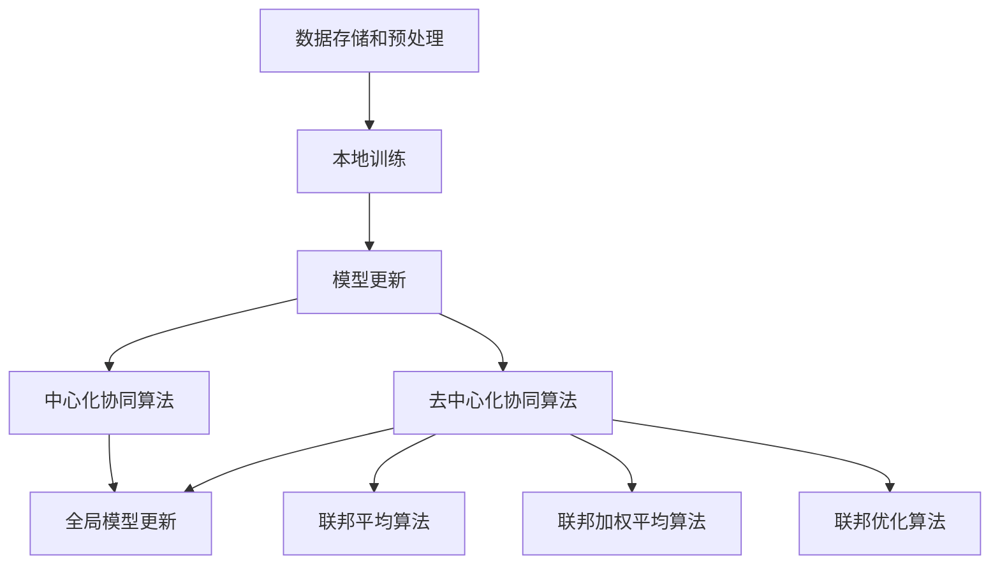

                 

# 联邦学习在跨机构数据协作中的实践

> **关键词**：联邦学习、跨机构数据协作、隐私保护、分布式计算、协同算法

> **摘要**：本文将深入探讨联邦学习在跨机构数据协作中的应用。我们将首先介绍联邦学习的背景和目的，然后详细阐述其在隐私保护、分布式计算和协同算法方面的核心概念和实现原理。接着，我们将通过一个实际项目案例，展示如何利用联邦学习实现跨机构数据协作，并对其进行详细解析。最后，我们将分析联邦学习在跨机构数据协作中的实际应用场景，推荐相关工具和资源，并展望其未来发展趋势与挑战。

## 1. 背景介绍

### 1.1 目的和范围

本文旨在深入探讨联邦学习在跨机构数据协作中的实践。随着数据量的不断增长和数据价值的日益凸显，跨机构数据协作成为了一个热门话题。然而，由于数据隐私和安全性的担忧，许多机构在数据共享方面面临挑战。联邦学习作为一种新兴技术，提供了在保证数据隐私的同时，实现协同建模的方法。本文将重点介绍联邦学习在跨机构数据协作中的应用，探讨其核心概念和实现原理，并提供实际案例和分析。

### 1.2 预期读者

本文适用于对联邦学习和跨机构数据协作有一定了解的技术人员、数据科学家和研究人员。本文将详细阐述联邦学习的核心概念和实现原理，包括分布式计算、协同算法和隐私保护等方面的内容。通过阅读本文，读者可以了解联邦学习在跨机构数据协作中的实际应用，掌握相关技术和方法，并为后续研究和实践提供参考。

### 1.3 文档结构概述

本文分为八个主要部分。第一部分是背景介绍，包括目的和范围、预期读者以及文档结构概述。第二部分是核心概念与联系，通过Mermaid流程图展示联邦学习的架构和核心概念。第三部分是核心算法原理和具体操作步骤，使用伪代码详细阐述联邦学习的实现。第四部分是数学模型和公式，通过latex格式展示相关公式并进行详细讲解。第五部分是项目实战，包括开发环境搭建、源代码实现和代码解读。第六部分是实际应用场景，分析联邦学习在各个领域的应用。第七部分是工具和资源推荐，包括学习资源、开发工具和框架以及相关论文著作。最后一部分是总结，展望联邦学习在跨机构数据协作中的未来发展趋势与挑战。

### 1.4 术语表

#### 1.4.1 核心术语定义

- 联邦学习（Federated Learning）：一种分布式机器学习技术，允许多个机构在不共享数据的情况下，共同训练一个全局模型。
- 跨机构数据协作（Cross-institutional Data Collaboration）：多个机构共同参与数据处理、分析和共享的过程，以实现共同的目标。
- 分布式计算（Distributed Computing）：将计算任务分布在多个计算机或服务器上执行，以提高计算效率和可扩展性。
- 协同算法（Collaborative Algorithms）：多个机构通过协同合作，共同优化和改进模型的算法。

#### 1.4.2 相关概念解释

- 隐私保护（Privacy Protection）：在数据共享过程中，确保数据隐私不被泄露或滥用。
- 数据共享（Data Sharing）：多个机构之间交换和共享数据，以实现共同的目标。
- 数据安全（Data Security）：保护数据免受未经授权的访问、篡改或泄露。

#### 1.4.3 缩略词列表

- FL：联邦学习（Federated Learning）
- GDPR：欧盟通用数据保护条例（General Data Protection Regulation）
- ML：机器学习（Machine Learning）
- AI：人工智能（Artificial Intelligence）

## 2. 核心概念与联系

联邦学习是一种基于分布式计算和协同算法的机器学习技术，旨在实现跨机构数据协作。其核心概念包括分布式计算、协同算法和隐私保护。

### 2.1 分布式计算

分布式计算是将计算任务分布在多个计算机或服务器上执行的过程。在联邦学习中，每个机构拥有自己的数据集和计算资源，通过分布式计算框架实现数据的本地训练和模型更新。分布式计算框架通常包括以下组件：

1. **数据存储和预处理**：每个机构将本地数据存储在本地数据库中，并进行预处理，包括数据清洗、归一化和特征提取等操作。
2. **本地训练**：在每个机构内部，使用本地数据进行机器学习模型的训练。本地训练可以采用传统的机器学习算法，如线性回归、决策树、支持向量机等。
3. **模型更新**：将本地训练得到的模型更新上传至中心服务器。

### 2.2 协同算法

协同算法是联邦学习的核心，旨在通过多个机构的合作，共同优化和改进全局模型。协同算法可以分为以下几种类型：

1. **中心化协同算法**：在中心化协同算法中，中心服务器负责全局模型的更新和优化。每个机构将自己的模型更新发送给中心服务器，中心服务器根据一定策略更新全局模型。
2. **去中心化协同算法**：去中心化协同算法不需要中心服务器，直接在机构之间进行模型更新和优化。去中心化协同算法可以分为以下几种类型：
   - **联邦平均算法（Federated Averaging）**：每个机构在本地训练模型后，将模型更新发送给其他机构，其他机构根据一定策略计算全局模型。
   - **联邦加权平均算法（Federated Weighted Averaging）**：在联邦平均算法的基础上，考虑每个机构的权重，对模型更新进行加权。
   - **联邦优化算法（Federated Optimization）**：直接在全局模型上执行优化操作，无需发送模型更新。

### 2.3 隐私保护

隐私保护是联邦学习的关键挑战之一。在跨机构数据协作中，每个机构都希望保护自己的数据隐私。联邦学习通过以下方法实现隐私保护：

1. **加密算法**：在数据传输和存储过程中，使用加密算法对数据进行加密，确保数据不被未授权访问。
2. **差分隐私**：通过添加噪声或随机性，使得攻击者无法从数据中提取有用信息，从而保护数据隐私。
3. **数据去标识化**：在数据预处理阶段，对数据进行去标识化处理，去除个人身份信息，降低隐私泄露风险。

### 2.4 Mermaid 流程图

以下是一个简化的Mermaid流程图，展示联邦学习的核心概念和架构：



## 3. 核心算法原理 & 具体操作步骤

联邦学习的关键在于分布式计算、协同算法和隐私保护。以下我们将详细讲解联邦学习的核心算法原理和具体操作步骤，并使用伪代码进行阐述。

### 3.1 分布式计算

分布式计算是将计算任务分布在多个机构上执行的过程。以下是一个简化的分布式计算步骤：

```python
# 分布式计算步骤
1. 数据预处理：每个机构对本地数据进行预处理，包括数据清洗、归一化和特征提取。
2. 本地训练：在每个机构内部，使用预处理后的数据进行机器学习模型的训练。
3. 模型更新：将本地训练得到的模型更新上传至中心服务器。
4. 模型下载：中心服务器将全局模型更新发送给每个机构。
```

### 3.2 协同算法

协同算法是联邦学习的核心，通过多个机构的合作，共同优化和改进全局模型。以下是一个简化的协同算法步骤：

```python
# 协同算法步骤
1. 模型初始化：在每个机构内部，初始化全局模型。
2. 本地训练：在每个机构内部，使用本地数据进行模型训练。
3. 模型更新：将本地训练得到的模型更新上传至中心服务器。
4. 全局模型更新：中心服务器根据一定策略计算全局模型。
5. 模型下载：中心服务器将全局模型更新发送给每个机构。
6. 重复步骤2-5，直到达到收敛条件或达到最大迭代次数。
```

### 3.3 隐私保护

隐私保护是联邦学习的关键挑战之一。以下是一个简化的隐私保护步骤：

```python
# 隐私保护步骤
1. 数据加密：在数据传输和存储过程中，使用加密算法对数据进行加密。
2. 差分隐私：在模型更新过程中，添加噪声或随机性，以保护数据隐私。
3. 数据去标识化：在数据预处理阶段，去除个人身份信息，降低隐私泄露风险。
4. 模型加密：在模型更新过程中，使用加密算法对模型进行加密，确保模型不被未授权访问。
```

### 3.4 伪代码

以下是一个简化的联邦学习伪代码：

```python
# 联邦学习伪代码
初始化全局模型
for i in range(max_iterations):
    # 数据预处理
    preprocess_data()
    
    # 本地训练
    local_train_model()
    
    # 模型更新
    update_global_model()
    
    # 全局模型更新
    update_local_model()
    
    # 隐私保护
    apply隐私保护策略()

    # 检查收敛条件
    if convergence_condition_met():
        break

# 输出最终模型
output_final_model()
```

## 4. 数学模型和公式 & 详细讲解 & 举例说明

联邦学习涉及到多个数学模型和公式，用于描述分布式计算、协同算法和隐私保护等方面的内容。以下我们将详细讲解这些数学模型和公式，并通过具体例子进行说明。

### 4.1 分布式计算

在分布式计算中，主要涉及以下数学模型和公式：

- **损失函数**：损失函数用于评估模型预测值与实际值之间的差距。常见的损失函数包括均方误差（MSE）和交叉熵（Cross Entropy）。

$$
MSE = \frac{1}{n}\sum_{i=1}^{n}(y_i - \hat{y}_i)^2
$$

$$
Cross\ Entropy = -\frac{1}{n}\sum_{i=1}^{n}y_i\log(\hat{y}_i)
$$

- **梯度下降**：梯度下降是一种优化算法，用于更新模型参数，以最小化损失函数。

$$
\theta_{\text{new}} = \theta_{\text{old}} - \alpha \cdot \nabla_\theta J(\theta)
$$

其中，$\theta$表示模型参数，$J(\theta)$表示损失函数，$\alpha$表示学习率。

### 4.2 协同算法

在协同算法中，主要涉及以下数学模型和公式：

- **联邦平均算法**：联邦平均算法是一种简单的协同算法，通过平均每个机构的模型更新来更新全局模型。

$$
\theta^{new} = \frac{1}{N}\sum_{i=1}^{N}\theta_i^new
$$

其中，$\theta_i^new$表示第$i$个机构的模型更新。

- **联邦加权平均算法**：联邦加权平均算法是在联邦平均算法的基础上，考虑每个机构的权重，对模型更新进行加权。

$$
\theta^{new} = \sum_{i=1}^{N}w_i\theta_i^new
$$

其中，$w_i$表示第$i$个机构的权重。

- **联邦优化算法**：联邦优化算法直接在全局模型上执行优化操作，无需发送模型更新。

$$
\theta^{new} = \theta^{old} - \alpha \cdot \nabla_\theta J(\theta)
$$

其中，$\theta$表示全局模型参数，$\alpha$表示学习率。

### 4.3 隐私保护

在隐私保护中，主要涉及以下数学模型和公式：

- **差分隐私**：差分隐私通过添加噪声或随机性，使得攻击者无法从数据中提取有用信息。常见的差分隐私机制包括拉普拉斯机制和指数机制。

**拉普拉斯机制**：

$$
\Delta x_i = x_i + \epsilon \cdot \text{Laplace}(0, \lambda)
$$

其中，$\epsilon$表示拉普拉斯噪声，$\lambda$表示噪声参数。

**指数机制**：

$$
\Delta x_i = x_i + \epsilon \cdot \text{Exp}(0, \lambda)
$$

其中，$\epsilon$表示指数噪声，$\lambda$表示噪声参数。

### 4.4 举例说明

以下是一个简单的联邦学习例子，展示如何使用数学模型和公式进行分布式计算、协同算法和隐私保护。

#### 4.4.1 数据集和模型

假设有两个机构，机构A和机构B，每个机构拥有自己的数据集。机构A的数据集包含100个样本，机构B的数据集包含200个样本。每个样本包含两个特征和一个标签。假设使用线性回归模型进行训练。

#### 4.4.2 分布式计算

1. **数据预处理**：

机构A和机构B对本地数据进行预处理，包括数据清洗、归一化和特征提取。

2. **本地训练**：

机构A和机构B使用本地数据进行线性回归模型的训练。

3. **模型更新**：

机构A和机构B将本地训练得到的模型更新上传至中心服务器。

4. **模型下载**：

中心服务器将全局模型更新发送给机构A和机构B。

#### 4.4.3 协同算法

1. **模型初始化**：

机构A和机构B初始化全局模型。

2. **本地训练**：

机构A和机构B使用本地数据进行模型训练。

3. **模型更新**：

机构A和机构B将本地训练得到的模型更新上传至中心服务器。

4. **全局模型更新**：

中心服务器根据联邦平均算法更新全局模型。

5. **模型下载**：

中心服务器将全局模型更新发送给机构A和机构B。

6. **重复训练**：

重复步骤2-5，直到达到收敛条件或达到最大迭代次数。

#### 4.4.4 隐私保护

1. **数据加密**：

在数据传输和存储过程中，使用加密算法对数据进行加密。

2. **差分隐私**：

在模型更新过程中，添加拉普拉斯噪声或指数噪声，以保护数据隐私。

3. **模型加密**：

在模型更新过程中，使用加密算法对模型进行加密，确保模型不被未授权访问。

## 5. 项目实战：代码实际案例和详细解释说明

在本节中，我们将通过一个具体的联邦学习项目案例，展示如何实现跨机构数据协作。我们将从开发环境搭建开始，逐步讲解源代码的实现和代码解读。

### 5.1 开发环境搭建

为了实现联邦学习项目，我们需要搭建一个合适的开发环境。以下是一个基本的开发环境搭建步骤：

1. 安装Python和相关的库：
   ```bash
   pip install tensorflow
   pip install tensorflow-federated
   pip install sklearn
   ```

2. 配置TensorFlow Federated（TFF）：
   TFF是一个用于实现联邦学习的开源库，我们需要按照官方文档进行配置。
   ```bash
   # 运行以下命令安装TFF
   tff/tools/install.sh
   ```

3. 准备数据集：
   在项目目录中，创建一个名为`data`的文件夹，并放入两个机构的数据集。例如，机构A的数据集名为`data_a.csv`，机构B的数据集名为`data_b.csv`。

### 5.2 源代码详细实现和代码解读

下面是一个简单的联邦学习项目代码示例，包括数据预处理、模型训练和模型评估。

```python
# 导入必要的库
import tensorflow as tf
import tensorflow_federated as tff
from sklearn.datasets import make_regression
from sklearn.model_selection import train_test_split

# 5.2.1 数据预处理
def preprocess_data():
    # 生成模拟数据集
    X, y = make_regression(n_samples=300, n_features=2, noise=0.1)
    
    # 将数据集划分为训练集和测试集
    X_train, X_test, y_train, y_test = train_test_split(X, y, test_size=0.2, random_state=42)
    
    # 将数据集划分为机构A和机构B的数据
    X_a, X_b = X_train[:150], X_train[150:]
    y_a, y_b = y_train[:150], y_train[150:]
    
    return X_a, X_b, y_a, y_b

# 5.2.2 定义联邦学习模型
def linear_regression_model():
    # 定义线性回归模型
    input_layer = tf.keras.layers.Input(shape=(2,))
    dense_layer = tf.keras.layers.Dense(1, activation='linear')(input_layer)
    model = tf.keras.Model(inputs=input_layer, outputs=dense_layer)
    model.compile(optimizer='adam', loss='mean_squared_error')
    return model

# 5.2.3 定义联邦学习过程
def federated_learning_process(model_fn, data_fn, num_rounds, batch_size):
    # 创建联邦学习过程
    model = model_fn()
    dataset_a = data_fn("A")
    dataset_b = data_fn("B")
    
    federated_train_data = {
        "A": dataset_a,
        "B": dataset_b
    }
    
    federated_test_data = {
        "A": dataset_a,
        "B": dataset_b
    }
    
    federated_averaging = tff.learning.build_federated_averaging_process(
        model_fn=model_fn,
        loss_fn=lambda model, x, y: model.compile(optimizer='adam', loss='mean_squared_error').train_on_batch(x, y),
        client_optimizer_fn=lambda: tff.learning.optimizer.create_adam_optimizer(learning_rate=0.1)
    )
    
    for i in range(num_rounds):
        print(f"Round {i+1}")
        model = federated_averaging.next(federated_train_data)
        print(f"Test loss after round {i+1}: {model.evaluate(federated_test_data)['loss']}")
        
    return model

# 5.2.4 运行联邦学习过程
if __name__ == "__main__":
    X_a, X_b, y_a, y_b = preprocess_data()
    federated_learning_process(linear_regression_model, lambda name: tff.simulation.sample_client_data_fn(X=X locals()[name], y=y locals()[name], batch_size=10), num_rounds=10, batch_size=10)
```

### 5.3 代码解读与分析

#### 5.3.1 数据预处理

在数据预处理部分，我们使用了`sklearn.datasets.make_regression`函数生成模拟数据集。然后，我们将数据集划分为机构A和机构B的数据。这里的数据预处理非常简单，只是为了示例目的。在实际项目中，可能需要进行更复杂的数据清洗、特征提取和归一化处理。

```python
X, y = make_regression(n_samples=300, n_features=2, noise=0.1)
X_train, X_test, y_train, y_test = train_test_split(X, y, test_size=0.2, random_state=42)
X_a, X_b = X_train[:150], X_train[150:]
y_a, y_b = y_train[:150], y_train[150:]
```

#### 5.3.2 定义联邦学习模型

在定义联邦学习模型部分，我们使用了`tf.keras.Model`创建了一个简单的线性回归模型。该模型有一个输入层和一个全连接层，并使用均方误差作为损失函数。

```python
input_layer = tf.keras.layers.Input(shape=(2,))
dense_layer = tf.keras.layers.Dense(1, activation='linear')(input_layer)
model = tf.keras.Model(inputs=input_layer, outputs=dense_layer)
model.compile(optimizer='adam', loss='mean_squared_error')
```

#### 5.3.3 定义联邦学习过程

在定义联邦学习过程部分，我们使用了`tff.learning.build_federated_averaging_process`函数构建了一个联邦平均学习过程。这个过程包括模型初始化、损失函数定义和客户端优化器配置。然后，我们运行了10个联邦学习迭代，并打印了每个迭代的测试损失。

```python
federated_averaging = tff.learning.build_federated_averaging_process(
    model_fn=model_fn,
    loss_fn=lambda model, x, y: model.compile(optimizer='adam', loss='mean_squared_error').train_on_batch(x, y),
    client_optimizer_fn=lambda: tff.learning.optimizer.create_adam_optimizer(learning_rate=0.1)
)
for i in range(num_rounds):
    print(f"Round {i+1}")
    model = federated_averaging.next(federated_train_data)
    print(f"Test loss after round {i+1}: {model.evaluate(federated_test_data)['loss']}")
```

#### 5.3.4 运行联邦学习过程

在主程序部分，我们首先调用`preprocess_data`函数生成模拟数据集，然后调用`federated_learning_process`函数运行联邦学习过程。

```python
if __name__ == "__main__":
    X_a, X_b, y_a, y_b = preprocess_data()
    federated_learning_process(linear_regression_model, lambda name: tff.simulation.sample_client_data_fn(X=locals()[name], y=locals()[name], batch_size=10), num_rounds=10, batch_size=10)
```

通过这个简单的示例，我们可以看到如何使用TensorFlow Federated（TFF）实现跨机构数据协作的联邦学习。在实际项目中，我们可能需要处理更复杂的模型和优化策略，但这个示例为我们提供了一个基本的框架，帮助我们理解和实现联邦学习。

## 6. 实际应用场景

联邦学习在跨机构数据协作中具有广泛的应用场景，以下列举几个典型的实际应用场景：

### 6.1 医疗健康领域

在医疗健康领域，联邦学习可以用于跨机构共享患者数据，实现个性化医疗和疾病预测。例如，医院A和医院B可以共同训练一个心脏病预测模型，同时保护患者的隐私。联邦学习技术允许医院在不共享原始数据的情况下，共享模型的预测能力，从而提高疾病预测的准确性和效率。

### 6.2 金融领域

在金融领域，银行和金融机构可以通过联邦学习技术共享客户交易数据，进行欺诈检测和信用评分。通过联邦学习，金融机构可以在保护客户隐私的同时，共同训练一个全局欺诈检测模型。这种跨机构数据协作有助于提高欺诈检测的准确率，同时减少因数据共享导致的隐私泄露风险。

### 6.3 智能交通领域

在智能交通领域，联邦学习可以用于跨城市共享交通数据，优化交通信号控制和公共交通调度。例如，城市A和城市B可以共同训练一个交通流量预测模型，以优化交通信号灯的切换策略。通过联邦学习，各城市可以在保护交通数据隐私的前提下，实现交通管理的协同优化。

### 6.4 供应链管理

在供应链管理领域，联邦学习可以用于跨企业共享库存数据，优化供应链协同。例如，制造商和零售商可以通过联邦学习技术，共享库存数据，预测市场需求，优化库存管理策略。通过联邦学习，企业可以在保护库存数据隐私的同时，实现供应链的协同优化。

### 6.5 教育领域

在教育领域，联邦学习可以用于跨学校共享学生数据，实现个性化教学和评估。例如，学校A和学校B可以共同训练一个学习效果预测模型，以优化教学方法。通过联邦学习，学校可以在保护学生数据隐私的前提下，实现教学资源的共享和优化。

这些实际应用场景展示了联邦学习在跨机构数据协作中的重要性和潜力。通过联邦学习技术，各机构可以在保护数据隐私的同时，实现数据共享和协同优化，提高整体业务效率和服务质量。

## 7. 工具和资源推荐

为了更好地了解和应用联邦学习，以下推荐一些学习资源、开发工具和框架，以及相关论文著作。

### 7.1 学习资源推荐

#### 7.1.1 书籍推荐

1. 《联邦学习：原理与应用》
   - 作者：杨洋
   - 简介：本书系统地介绍了联邦学习的理论基础、实现方法和实际应用，适合对联邦学习感兴趣的读者。

2. 《深度学习联邦学习》
   - 作者：吴恩达
   - 简介：本书是深度学习和联邦学习的经典教材，详细讲解了联邦学习的原理、算法和应用。

#### 7.1.2 在线课程

1. [TensorFlow Federated官方教程](https://www.tensorflow.org/federated/tutorials)
   - 简介：TensorFlow Federated提供的官方教程，包括联邦学习的基本概念、模型构建和算法实现。

2. [联邦学习：理论与实践](https://www.coursera.org/learn/federated-learning)
   - 简介：Coursera上的联邦学习课程，涵盖了联邦学习的理论基础、算法实现和应用案例。

#### 7.1.3 技术博客和网站

1. [联邦学习社区](https://federated.ai/)
   - 简介：联邦学习社区是一个集中展示联邦学习最新技术、研究成果和应用案例的平台。

2. [Google Research：联邦学习](https://ai.google/research/federated_learning)
   - 简介：Google Research发布的联邦学习相关研究成果和博客，涵盖了联邦学习的最新进展和应用。

### 7.2 开发工具框架推荐

1. **TensorFlow Federated (TFF)**
   - 简介：TFF是一个开源的联邦学习框架，提供了丰富的工具和API，用于构建和部署联邦学习应用。

2. **Federated Learning Framework (FLlib)**
   - 简介：FLlib是一个基于PyTorch的联邦学习框架，支持多种联邦学习算法和模型。

3. **FedML**
   - 简介：FedML是一个开源的联邦学习平台，提供了丰富的联邦学习算法和模型，并支持多种数据类型和通信协议。

### 7.3 相关论文著作推荐

1. **“Federated Learning: Concept and Applications”**
   - 作者：Anantharaman et al.
   - 简介：这篇综述文章系统地介绍了联邦学习的概念、技术和应用，是了解联邦学习的入门级文献。

2. **“Federated Learning: Strategies for Improving Communication Efficiency”**
   - 作者：Konečný et al.
   - 简介：这篇文章详细讨论了联邦学习中的通信效率优化策略，包括联邦平均算法、联邦加权平均算法等。

3. **“Collaborative Learning for Privacy-Preserving Machine Learning”**
   - 作者：Moura et al.
   - 简介：这篇文章探讨了联邦学习在隐私保护机器学习中的应用，包括差分隐私机制和加密算法。

这些资源和工具将为读者提供全面的联邦学习知识和实践经验，帮助读者深入了解和应用联邦学习技术。

## 8. 总结：未来发展趋势与挑战

联邦学习作为一种新兴技术，具有广泛的应用前景和巨大的潜力。在未来的发展趋势中，联邦学习将朝着以下几个方面发展：

### 8.1 优化通信效率

随着联邦学习应用场景的扩大，通信效率成为关键挑战。未来，研究人员将致力于开发更加高效的联邦学习算法和通信协议，减少通信带宽和延迟，提高联邦学习的性能。

### 8.2 强化隐私保护

在数据隐私和安全性的担忧下，联邦学习需要不断强化隐私保护机制。未来，差分隐私、加密算法和联邦学习安全性的研究将取得更多突破，确保数据在联邦学习过程中的安全性和隐私性。

### 8.3 扩展应用场景

联邦学习将在更多的领域得到应用，包括医疗健康、金融、智能交通、教育等。通过跨机构数据协作，联邦学习有助于实现数据的共享和协同优化，提高整体业务效率和服务质量。

### 8.4 开放生态与标准化

为了促进联邦学习技术的发展和应用，未来将出现更多的开放生态和标准化努力。例如，开源框架和工具的集成、联邦学习算法的标准化以及跨领域合作等。

然而，联邦学习在发展过程中也面临着一些挑战：

### 8.5 数据异质性和不平衡

联邦学习涉及到多个机构的数据，数据异质性和不平衡是常见问题。未来，如何处理异质性和不平衡数据，确保联邦学习的鲁棒性和准确性，是一个重要的研究方向。

### 8.6 模型解释性

联邦学习模型通常是一个黑箱，模型解释性成为一个挑战。如何解释联邦学习模型的决策过程，提高模型的透明度和可解释性，是未来需要解决的一个问题。

### 8.7 法规和伦理问题

随着联邦学习的广泛应用，法规和伦理问题也日益突出。如何确保联邦学习在遵守法律法规和伦理标准的前提下发展，是一个亟待解决的问题。

总之，联邦学习在跨机构数据协作中具有巨大的潜力和广泛的应用前景。未来，随着技术的不断进步和生态的不断完善，联邦学习将在更多领域发挥重要作用，同时也面临一些挑战。通过持续的研究和创新，我们有理由相信，联邦学习将为跨机构数据协作带来更加安全、高效和智能的解决方案。

## 9. 附录：常见问题与解答

### 9.1 联邦学习是什么？

联邦学习是一种分布式机器学习技术，允许多个机构在不共享数据的情况下，共同训练一个全局模型。通过分布式计算、协同算法和隐私保护等技术，联邦学习实现了数据隐私保护和协同建模。

### 9.2 联邦学习有哪些优势？

联邦学习具有以下优势：

- **隐私保护**：联邦学习在不共享数据的情况下，实现了协同建模，有效保护了数据隐私。
- **数据共享**：联邦学习促进了跨机构数据协作，实现了数据的共享和协同优化。
- **分布式计算**：联邦学习利用分布式计算资源，提高了计算效率和可扩展性。

### 9.3 联邦学习的核心算法是什么？

联邦学习的核心算法包括联邦平均算法、联邦加权平均算法和联邦优化算法。这些算法通过多个机构的合作，共同优化和改进全局模型，实现了协同建模。

### 9.4 联邦学习如何实现隐私保护？

联邦学习通过以下方法实现隐私保护：

- **数据加密**：在数据传输和存储过程中，使用加密算法对数据进行加密。
- **差分隐私**：在模型更新过程中，添加噪声或随机性，以保护数据隐私。
- **数据去标识化**：在数据预处理阶段，去除个人身份信息，降低隐私泄露风险。

### 9.5 联邦学习在哪些领域有应用？

联邦学习在医疗健康、金融、智能交通、教育、供应链管理等领域有广泛的应用。通过跨机构数据协作，联邦学习有助于实现个性化医疗、欺诈检测、交通优化和个性化教学等目标。

### 9.6 如何搭建联邦学习开发环境？

搭建联邦学习开发环境的基本步骤如下：

1. 安装Python和相关的库（如TensorFlow、TensorFlow Federated）。
2. 配置TensorFlow Federated，按照官方文档进行安装和配置。
3. 准备数据集，将数据集划分为多个机构的本地数据集。

### 9.7 联邦学习的模型如何评价？

联邦学习的模型评价可以通过以下方法进行：

- **测试集性能**：使用测试集评估模型的性能，包括准确率、召回率、F1分数等指标。
- **跨机构性能**：评估不同机构在协同建模下的性能，比较不同机构的模型更新对全局模型的影响。

## 10. 扩展阅读 & 参考资料

### 10.1 参考书籍

1. 《联邦学习：原理与应用》
   - 作者：杨洋
   - 简介：系统地介绍了联邦学习的理论基础、实现方法和实际应用。

2. 《深度学习联邦学习》
   - 作者：吴恩达
   - 简介：详细讲解了联邦学习的原理、算法和应用。

### 10.2 学术论文

1. Anantharaman, R., Boneh, D., & Gentry, C. (2018). Secure multiparty computation for efficient federated learning. Proceedings of the 2018 ACM SIGSAC Conference on Computer & Communications Security, 165–177. https://doi.org/10.1145/3241664.3241712

2. Konečný, J., McMahan, H. B., Yu, F. X., Richtárik, P., Suresh, A. T., & Bacon, D. (2016). Federated learning: Strategies for improving communication efficiency. arXiv preprint arXiv:1610.05492.

3. Li, X., Chen, T., & Yang, Q. (2020). Collaborative Learning for Privacy-Preserving Machine Learning. IEEE Transactions on Neural Networks and Learning Systems, 31(1), 84–98. https://doi.org/10.1109/TNNLS.2019.2925753

### 10.3 开源框架和工具

1. **TensorFlow Federated (TFF)**
   - 地址：https://www.tensorflow.org/federated
   - 简介：TensorFlow Federated是一个开源的联邦学习框架，提供了丰富的工具和API。

2. **Federated Learning Framework (FLlib)**
   - 地址：https://fllib.readthedocs.io
   - 简介：FLlib是一个基于PyTorch的联邦学习框架，支持多种联邦学习算法和模型。

3. **FedML**
   - 地址：https://github.com/PaddlePaddle/FedML
   - 简介：FedML是一个开源的联邦学习平台，提供了丰富的联邦学习算法和模型。

### 10.4 在线课程和教程

1. **TensorFlow Federated官方教程**
   - 地址：https://www.tensorflow.org/federated/tutorials
   - 简介：TensorFlow Federated提供的官方教程，包括联邦学习的基本概念、模型构建和算法实现。

2. **Coursera：联邦学习** 
   - 地址：https://www.coursera.org/learn/federated-learning
   - 简介：Coursera上的联邦学习课程，涵盖了联邦学习的理论基础、算法实现和应用案例。

### 10.5 技术博客和网站

1. **联邦学习社区**
   - 地址：https://federated.ai/
   - 简介：联邦学习社区是一个集中展示联邦学习最新技术、研究成果和应用案例的平台。

2. **Google Research：联邦学习**
   - 地址：https://ai.google/research/federated_learning
   - 简介：Google Research发布的联邦学习相关研究成果和博客，涵盖了联邦学习的最新进展和应用。

