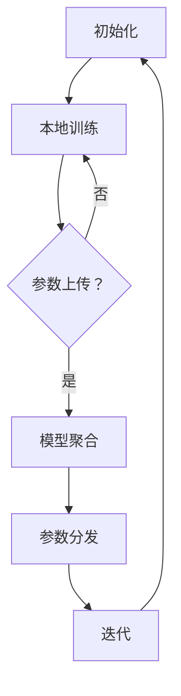

                 

# 联邦学习在跨行业数据协作中的应用

> **关键词：** 联邦学习、跨行业数据协作、数据隐私、机器学习、协作算法
>
> **摘要：** 本文章深入探讨了联邦学习在跨行业数据协作中的应用。通过解析联邦学习的核心概念、原理及算法，我们详细阐述了如何利用联邦学习实现跨行业的数据共享与协同建模，同时保障数据隐私安全。本文还通过实际项目案例，展示联邦学习在实际应用中的效果，并提出未来发展趋势与挑战，为行业数据协作提供了新的思路和解决方案。

## 1. 背景介绍

### 1.1 目的和范围

本文旨在探讨联邦学习在跨行业数据协作中的应用，分析其在保障数据隐私、促进数据共享和协同建模方面的优势，并提供实际应用案例和技术实现方法。本文将围绕以下主题展开：

1. 联邦学习的基本概念和原理。
2. 联邦学习在跨行业数据协作中的核心应用。
3. 联邦学习算法的具体操作步骤和数学模型。
4. 跨行业数据协作中的实际应用场景。
5. 开发工具和资源的推荐。
6. 未来发展趋势与挑战。

### 1.2 预期读者

本文适用于对联邦学习有一定了解的读者，包括：

1. 人工智能和机器学习领域的研发人员。
2. 数据科学家和数据工程师。
3. 跨行业数据协作项目的管理者。
4. 对联邦学习感兴趣的学术研究人员。

### 1.3 文档结构概述

本文分为十个部分，具体结构如下：

1. **背景介绍**：介绍本文的目的、范围、预期读者和文档结构。
2. **核心概念与联系**：介绍联邦学习的核心概念、原理和架构。
3. **核心算法原理 & 具体操作步骤**：详细阐述联邦学习算法的操作步骤和数学模型。
4. **数学模型和公式 & 详细讲解 & 举例说明**：解释联邦学习中的数学公式和实际应用。
5. **项目实战：代码实际案例和详细解释说明**：展示实际项目中的代码实现和解释。
6. **实际应用场景**：分析联邦学习在跨行业数据协作中的应用场景。
7. **工具和资源推荐**：推荐学习资源、开发工具和框架。
8. **总结：未来发展趋势与挑战**：总结本文的核心观点和未来发展方向。
9. **附录：常见问题与解答**：解答读者可能遇到的问题。
10. **扩展阅读 & 参考资料**：提供更多的参考资料和扩展阅读。

### 1.4 术语表

#### 1.4.1 核心术语定义

- **联邦学习（Federated Learning）**：一种分布式机器学习方法，参与方在不共享数据的情况下，通过聚合模型参数来协同训练模型。
- **跨行业数据协作**：不同行业的企业或组织之间，基于共同需求，通过数据共享和协同建模来实现业务目标。
- **数据隐私**：保护数据在收集、存储、传输和使用过程中的安全性和隐私性。
- **协作算法**：用于协同训练模型、优化参数和交换信息的算法。

#### 1.4.2 相关概念解释

- **中央学习（Centralized Learning）**：传统机器学习方法，参与方将数据上传到中央服务器进行训练。
- **去中心化学习（Decentralized Learning）**：分布式机器学习方法，参与方在本地进行训练，仅交换模型参数。
- **协同训练（Co-training）**：多个参与者共同训练模型，通过迭代更新模型参数，提高模型性能。

#### 1.4.3 缩略词列表

- **FL**：联邦学习（Federated Learning）
- **DL**：分布式学习（Decentralized Learning）
- **CL**：中央学习（Centralized Learning）
- **CDN**：内容分发网络（Content Delivery Network）

## 2. 核心概念与联系

### 2.1 联邦学习的基本概念

联邦学习是一种分布式机器学习方法，旨在在不共享数据的情况下，通过参与者之间交换模型参数来协同训练模型。与传统的集中式学习和分布式学习相比，联邦学习具有以下特点：

1. **去中心化**：联邦学习不依赖于中央服务器，每个参与者都在本地进行模型训练，仅交换模型参数。
2. **数据隐私**：联邦学习通过本地训练和模型参数交换，有效保护了数据隐私。
3. **协同优化**：参与者共同优化模型参数，提高模型性能。

### 2.2 联邦学习的架构

联邦学习架构通常包括以下几个关键组件：

1. **客户端（Client）**：每个参与者在本地运行客户端，负责收集数据、训练模型和更新模型参数。
2. **模型服务器（Model Server）**：负责接收客户端发送的模型参数，聚合更新后的模型参数，并分发给客户端。
3. **联邦学习算法**：负责客户端与模型服务器之间的通信，以及模型参数的更新和优化。

### 2.3 联邦学习的基本流程

联邦学习的基本流程如下：

1. **初始化**：模型服务器初始化全局模型参数。
2. **本地训练**：客户端在本地使用初始化的模型参数，对本地数据进行训练。
3. **参数上传**：客户端将更新后的模型参数上传到模型服务器。
4. **模型聚合**：模型服务器接收客户端上传的模型参数，进行聚合更新。
5. **参数分发**：模型服务器将更新后的模型参数分发给客户端。
6. **迭代**：客户端下载更新后的模型参数，重复本地训练、参数上传等步骤。

### 2.4 联邦学习与跨行业数据协作的联系

跨行业数据协作面临的一个主要挑战是数据隐私和安全。联邦学习通过以下方式与跨行业数据协作相结合：

1. **数据隐私保护**：联邦学习在不共享数据的情况下，实现跨行业的数据协同建模，有效保护数据隐私。
2. **协同优化**：联邦学习通过协同优化模型参数，提高跨行业数据协作的模型性能。
3. **去中心化**：联邦学习去中心化的特点，使跨行业数据协作更加灵活和高效。

### 2.5 联邦学习的 Mermaid 流程图



## 3. 核心算法原理 & 具体操作步骤

### 3.1 联邦学习算法原理

联邦学习算法的核心思想是利用参与者在本地训练的模型参数，通过模型服务器进行聚合和更新，实现跨行业的协同建模。具体原理如下：

1. **本地训练**：每个参与者在本地使用初始化的模型参数，对本地数据进行训练，生成更新后的模型参数。
2. **参数上传**：参与者将更新后的模型参数上传到模型服务器。
3. **模型聚合**：模型服务器接收多个参与者的模型参数，通过聚合算法（如加权平均、梯度聚合等）生成全局模型参数。
4. **参数分发**：模型服务器将更新后的全局模型参数分发给所有参与者。
5. **迭代**：参与者下载更新后的全局模型参数，重复本地训练、参数上传等步骤。

### 3.2 具体操作步骤

#### 3.2.1 初始化阶段

1. **初始化全局模型参数**：模型服务器随机初始化全局模型参数$w_0$。
2. **初始化本地模型参数**：每个参与者根据全局模型参数$w_0$，初始化本地模型参数$w_0^i$。

#### 3.2.2 本地训练阶段

1. **数据准备**：每个参与者从本地数据集中抽取训练样本。
2. **本地训练**：参与者使用本地数据集和本地模型参数$w_0^i$，通过梯度下降等优化算法，更新本地模型参数$w_t^i$。

#### 3.2.3 参数上传阶段

1. **计算本地梯度**：参与者计算本地梯度$\Delta w_t^i = \nabla_{w}L(w_t^i)$。
2. **上传本地梯度**：参与者将本地梯度$\Delta w_t^i$上传到模型服务器。

#### 3.2.4 模型聚合阶段

1. **聚合梯度**：模型服务器接收多个参与者的本地梯度，通过聚合算法计算全局梯度$\Delta w_t = \sum_{i=1}^n \alpha_i \Delta w_t^i$。
2. **更新全局模型参数**：模型服务器使用全局梯度更新全局模型参数$w_{t+1} = w_t - \eta \Delta w_t$。

#### 3.2.5 参数分发阶段

1. **分发全局模型参数**：模型服务器将更新后的全局模型参数$w_{t+1}$分发给所有参与者。

#### 3.2.6 迭代阶段

1. **更新本地模型参数**：参与者下载更新后的全局模型参数$w_{t+1}$，更新本地模型参数$w_{t+1}^i = w_{t+1}$。
2. **重复迭代**：参与者重复本地训练、参数上传等步骤，直到满足停止条件（如迭代次数、模型收敛等）。

### 3.3 联邦学习算法的伪代码

```python
# 初始化阶段
w_global = w_0  # 初始化全局模型参数
w_local = w_0   # 初始化本地模型参数

# 迭代阶段
for t in range(T):
    # 本地训练
    w_local = train_local_data(w_local, local_data)
    
    # 计算本地梯度
    delta_w_local = compute_gradient(w_local, local_data)
    
    # 上传本地梯度
    delta_w_global = upload_gradient(delta_w_local)
    
    # 模型聚合
    delta_w_global = aggregate_gradients(delta_w_global, num_clients)
    
    # 更新全局模型参数
    w_global = update_global_model(w_global, delta_w_global)
    
    # 分发全局模型参数
    w_local = download_global_model(w_global)

# 模型训练结束
```

## 4. 数学模型和公式 & 详细讲解 & 举例说明

### 4.1 数学模型和公式

在联邦学习过程中，涉及到多个关键数学模型和公式，主要包括：

1. **损失函数（Loss Function）**：
   $$L(w) = -\sum_{i=1}^n \sum_{j=1}^m y_{ij} \log(p_{ij}(w))$$
   其中，$y_{ij}$为样本$i$的标签，$p_{ij}(w)$为模型参数$w$下样本$i$属于类别$j$的概率。

2. **梯度下降（Gradient Descent）**：
   $$w_{t+1} = w_t - \eta \nabla_w L(w_t)$$
   其中，$w_t$为第$t$次迭代的模型参数，$\eta$为学习率，$\nabla_w L(w_t)$为损失函数$L(w)$在$w_t$处的梯度。

3. **联邦学习算法中的模型更新**：
   $$w_{t+1} = w_t - \eta \frac{1}{n} \sum_{i=1}^n \nabla_w L(w_t; x_i, y_i)$$
   其中，$w_t$为第$t$次迭代的模型参数，$\eta$为学习率，$x_i, y_i$为第$i$个参与者的本地数据。

### 4.2 详细讲解

#### 4.2.1 损失函数

损失函数用于衡量模型参数的误差，是优化模型的关键。在联邦学习中，损失函数通常采用对数损失函数（Log Loss），其公式如上所示。对数损失函数的值越低，表示模型的预测效果越好。

#### 4.2.2 梯度下降

梯度下降是一种优化算法，通过不断更新模型参数，使损失函数值逐渐降低。在联邦学习中，每个参与者本地训练后，计算损失函数在本地模型参数处的梯度，然后将梯度上传到模型服务器。模型服务器将所有参与者的梯度进行聚合，用于更新全局模型参数。

#### 4.2.3 联邦学习算法中的模型更新

联邦学习算法中的模型更新公式表示，每个参与者本地训练后，计算损失函数在本地模型参数处的梯度，然后将梯度上传到模型服务器。模型服务器将所有参与者的梯度进行平均，用于更新全局模型参数。

### 4.3 举例说明

假设有两个参与者A和B，每个参与者拥有一个二分类问题数据集。参与者A的本地数据集包含100个样本，参与者B的本地数据集包含150个样本。模型服务器初始化全局模型参数$w_0$，每个参与者的本地模型参数也初始化为$w_0$。

1. **初始化阶段**：
   $$w_{global}^0 = w_{local}^0 = w_0$$

2. **本地训练阶段**：
   参与者A使用本地数据集对模型参数$w_{local}^0$进行训练，得到更新后的模型参数$w_{local}^1$。
   $$w_{local}^1 = \text{train_local\_data}(w_{local}^0, \text{local\_data\_A})$$

   参与者B使用本地数据集对模型参数$w_{local}^0$进行训练，得到更新后的模型参数$w_{local}^1$。
   $$w_{local}^1 = \text{train_local\_data}(w_{local}^0, \text{local\_data\_B})$$

3. **参数上传阶段**：
   参与者A将更新后的模型参数$w_{local}^1$上传到模型服务器。
   $$\text{upload\_gradient}(\text{delta\_w\_local}, w_{local}^1)$$

   参与者B将更新后的模型参数$w_{local}^1$上传到模型服务器。
   $$\text{upload\_gradient}(\text{delta\_w\_local}, w_{local}^1)$$

4. **模型聚合阶段**：
   模型服务器接收参与者A和参与者B上传的梯度，计算全局梯度。
   $$\text{delta\_w\_global} = \frac{\text{delta\_w\_local\_A} + \text{delta\_w\_local\_B}}{2}$$

5. **更新全局模型参数**：
   模型服务器使用全局梯度更新全局模型参数。
   $$w_{global}^1 = w_{global}^0 - \eta \text{delta\_w\_global}$$

6. **参数分发阶段**：
   模型服务器将更新后的全局模型参数$w_{global}^1$分发给参与者A和参与者B。
   $$\text{download\_global\_model}(w_{global}^1)$$

7. **迭代阶段**：
   参与者A和参与者B下载更新后的全局模型参数$w_{global}^1$，更新本地模型参数。
   $$w_{local}^{1'} = w_{global}^1$$

重复上述步骤，直到满足停止条件（如迭代次数、模型收敛等）。

## 5. 项目实战：代码实际案例和详细解释说明

### 5.1 开发环境搭建

在本文的项目实战中，我们将使用Python作为编程语言，结合TensorFlow Federated（TFF）框架来实现联邦学习算法。以下是开发环境搭建的步骤：

1. **安装Python**：确保已安装Python 3.7及以上版本。
2. **安装TensorFlow**：通过以下命令安装TensorFlow：
   ```bash
   pip install tensorflow
   ```
3. **安装TensorFlow Federated**：通过以下命令安装TensorFlow Federated：
   ```bash
   pip install tensorflow-federated
   ```

### 5.2 源代码详细实现和代码解读

以下是使用TensorFlow Federated实现的联邦学习算法的源代码及其解读：

```python
import tensorflow as tf
import tensorflow_federated as tff

# 定义损失函数
def create_federated_model(model_fn):
    def client_loss(model, inputs, outputs):
        predictions = model(inputs)
        return tf.reduce_mean(tf.nn.sigmoid_cross_entropy_with_logits(labels=outputs, logits=predictions))

    return tff.learning.from_keras_model(
        model_fn,
        client_loss_fn=client_loss,
        loss_fn=tf.keras.losses.BinaryCrossentropy(),
        client_optimizer=tff.learning.optimizers.FedAdam(learning_rate=0.1),
        server_optimizer=tff.learning.optimizers.FedAdam(learning_rate=0.1),
    )

# 定义本地训练过程
def train_client_model(client_model, client_data, client_loss_fn, client_optimizer):
    optimizer = client_optimizer(client_model)
    for x, y in client_data:
        with tf.GradientTape() as tape:
            predictions = client_model(x)
            loss = client_loss_fn(predictions, y)
        gradients = tape.gradient(loss, client_model.trainable_variables)
        optimizer.apply_gradients(zip(gradients, client_model.trainable_variables))
    return client_model

# 定义联邦学习过程
def federated_trainROUND(server_state, client_data):
    for client_data in client_data:
        client_model = server_state.model
        updated_client_model = train_client_model(
            client_model,
            client_data,
            server_state.client_loss_fn,
            server_state.client_optimizer,
        )
        server_state = server_state.update_model(updated_client_model)
    return server_state

# 定义全局训练过程
def global_train(server_state, client_data):
    return federated_trainROUND(server_state, client_data)

# 初始化全局模型
def create_initial_model():
    model = tf.keras.Sequential([
        tf.keras.layers.Dense(10, activation='relu', input_shape=(10,)),
        tf.keras.layers.Dense(1, activation='sigmoid'),
    ])
    return model

# 初始化联邦学习过程
def initialize():
    global_model = create_initial_model()
    client_optimizer = tff.learning.optimizers.FedAdam(learning_rate=0.1)
    client_loss_fn = tff.learning.reductions.Mean(client_loss)
    return tff.learning.ModelServerState(
        model=global_model,
        client_optimizer=client_optimizer,
        client_loss_fn=client_loss_fn,
    )

# 运行联邦学习过程
def run_federated_learning(num_rounds, client_data):
    server_state = initialize()
    for _ in range(num_rounds):
        server_state = global_train(server_state, client_data)
    return server_state.model

# 加载参与者数据
def load_data():
    # 这里加载参与者A和B的数据
    # client_data_A = ...
    # client_data_B = ...
    return [
        # client_data_A,
        # client_data_B,
    ]

# 训练联邦学习模型
def train_federated_model():
    client_data = load_data()
    federated_model = run_federated_learning(num_rounds=10, client_data=client_data)
    return federated_model

# 主程序入口
if __name__ == "__main__":
    federated_model = train_federated_model()
    print("Federated Model:", federated_model)
```

### 5.3 代码解读与分析

该代码实现了一个简单的联邦学习过程，包括全局模型的初始化、本地训练、模型更新和参数分发。以下是代码的详细解读：

1. **定义损失函数**：
   ```python
   def create_federated_model(model_fn):
       def client_loss(model, inputs, outputs):
           predictions = model(inputs)
           return tf.reduce_mean(tf.nn.sigmoid_cross_entropy_with_logits(labels=outputs, logits=predictions))

       return tff.learning.from_keras_model(
           model_fn,
           client_loss_fn=client_loss,
           loss_fn=tf.keras.losses.BinaryCrossentropy(),
           client_optimizer=tff.learning.optimizers.FedAdam(learning_rate=0.1),
           server_optimizer=tff.learning.optimizers.FedAdam(learning_rate=0.1),
       )
   ```
   该函数定义了联邦学习模型的损失函数和优化器。通过`tff.learning.from_keras_model`函数，将自定义的Keras模型转换为联邦学习模型。

2. **定义本地训练过程**：
   ```python
   def train_client_model(client_model, client_data, client_loss_fn, client_optimizer):
       optimizer = client_optimizer(client_model)
       for x, y in client_data:
           with tf.GradientTape() as tape:
               predictions = client_model(x)
               loss = client_loss_fn(predictions, y)
           gradients = tape.gradient(loss, client_model.trainable_variables)
           optimizer.apply_gradients(zip(gradients, client_model.trainable_variables))
       return client_model
   ```
   该函数定义了参与者在本地训练模型的过程。通过梯度下降优化算法，更新本地模型参数。

3. **定义联邦学习过程**：
   ```python
   def federated_trainROUND(server_state, client_data):
       for client_data in client_data:
           client_model = server_state.model
           updated_client_model = train_client_model(
               client_model,
               client_data,
               server_state.client_loss_fn,
               server_state.client_optimizer,
           )
           server_state = server_state.update_model(updated_client_model)
       return server_state
   ```
   该函数定义了联邦学习过程的一个迭代周期。通过`train_client_model`函数，更新参与者的本地模型，并通过`update_model`函数更新全局模型。

4. **定义全局训练过程**：
   ```python
   def global_train(server_state, client_data):
       return federated_trainROUND(server_state, client_data)
   ```
   该函数将联邦学习过程简化为一个迭代周期，用于全局训练。

5. **初始化全局模型**：
   ```python
   def create_initial_model():
       model = tf.keras.Sequential([
           tf.keras.layers.Dense(10, activation='relu', input_shape=(10,)),
           tf.keras.layers.Dense(1, activation='sigmoid'),
       ])
       return model
   ```
   该函数初始化全局模型，使用两个全连接层实现一个简单的二分类模型。

6. **初始化联邦学习过程**：
   ```python
   def initialize():
       global_model = create_initial_model()
       client_optimizer = tff.learning.optimizers.FedAdam(learning_rate=0.1)
       client_loss_fn = tff.learning.reductions.Mean(client_loss)
       return tff.learning.ModelServerState(
           model=global_model,
           client_optimizer=client_optimizer,
           client_loss_fn=client_loss_fn,
       )
   ```
   该函数初始化联邦学习过程的初始状态，包括全局模型、客户端优化器和损失函数。

7. **运行联邦学习过程**：
   ```python
   def run_federated_learning(num_rounds, client_data):
       server_state = initialize()
       for _ in range(num_rounds):
           server_state = global_train(server_state, client_data)
       return server_state.model
   ```
   该函数运行联邦学习过程，指定迭代次数和参与者数据，更新全局模型。

8. **加载参与者数据**：
   ```python
   def load_data():
       # 这里加载参与者A和B的数据
       # client_data_A = ...
       # client_data_B = ...
       return [
           # client_data_A,
           # client_data_B,
       ]
   ```
   该函数定义了加载参与者数据的方法，用于实际训练过程中。

9. **训练联邦学习模型**：
   ```python
   def train_federated_model():
       client_data = load_data()
       federated_model = run_federated_learning(num_rounds=10, client_data=client_data)
       return federated_model
   ```
   该函数定义了训练联邦学习模型的过程，加载参与者数据，运行联邦学习过程，并返回全局模型。

10. **主程序入口**：
    ```python
    if __name__ == "__main__":
        federated_model = train_federated_model()
        print("Federated Model:", federated_model)
    ```
    该函数作为主程序入口，执行训练联邦学习模型的过程，并打印全局模型。

### 5.4 代码分析与改进

该代码实现了基本的联邦学习过程，但存在以下改进空间：

1. **数据预处理**：在实际应用中，需要对参与者数据进行预处理，如数据清洗、归一化等，以提高模型训练效果。

2. **模型架构优化**：根据实际需求，可以调整模型架构，如增加隐藏层、调整神经元数量等，以提高模型性能。

3. **优化器调整**：可以根据实际训练情况，调整客户端和服务器端的优化器参数，如学习率、优化算法等。

4. **联邦学习策略**：可以尝试不同的联邦学习策略，如联邦平均、联邦加权平均等，以提高模型性能和稳定性。

5. **安全性和隐私性**：在实际应用中，需要考虑联邦学习过程中的安全性和隐私性，如加密算法、差分隐私等。

## 6. 实际应用场景

联邦学习在跨行业数据协作中的应用具有广泛的前景，以下列举了几个典型的应用场景：

### 6.1 医疗健康领域

在医疗健康领域，不同医疗机构之间常常需要共享患者数据，以实现精准医疗和疾病预测。然而，数据隐私和安全性是阻碍数据共享的主要因素。联邦学习可以在不共享原始数据的情况下，实现医疗机构之间的协同建模和预测，从而提高疾病诊断和治疗的准确率。例如，通过联邦学习技术，可以实现以下应用：

1. **疾病预测模型**：医疗机构可以共同训练一个疾病预测模型，利用各自的患者数据，提高疾病早期诊断的准确性。
2. **药物研发**：制药公司和研究机构可以通过联邦学习技术，共享临床试验数据，加速新药的发现和开发。
3. **健康数据分析**：保险公司和医疗机构可以通过联邦学习技术，共同分析患者数据，为保险产品定价和健康风险评估提供依据。

### 6.2 金融领域

在金融领域，不同金融机构之间也常常存在数据共享的需求，如风险评估、欺诈检测和信用评分等。然而，金融数据具有高敏感性，数据隐私和安全是金融机构关注的重点。联邦学习可以在不共享原始数据的情况下，实现金融机构之间的协同建模和预测，从而提高金融服务的质量和安全性。例如，通过联邦学习技术，可以实现以下应用：

1. **风险评估**：金融机构可以共同训练一个风险评估模型，利用各自的风险数据，提高贷款审批和投资决策的准确性。
2. **欺诈检测**：金融机构可以通过联邦学习技术，共享欺诈检测数据，提高欺诈检测的准确率和覆盖率。
3. **信用评分**：金融机构可以共同训练一个信用评分模型，利用各自的用户数据，提高信用评分的准确性和公平性。

### 6.3 交通领域

在交通领域，不同交通管理部门之间也常常需要共享交通数据，以实现交通流量预测、事故预警和道路优化等。然而，交通数据具有高时效性和敏感性，数据隐私和安全是交通管理部门关注的重点。联邦学习可以在不共享原始数据的情况下，实现交通管理部门之间的协同建模和预测，从而提高交通管理和服务水平。例如，通过联邦学习技术，可以实现以下应用：

1. **交通流量预测**：不同交通管理部门可以共同训练一个交通流量预测模型，利用各自的道路数据，提高交通流量预测的准确性和实时性。
2. **事故预警**：交通管理部门可以通过联邦学习技术，共享事故数据，提高事故预警的准确率和响应速度。
3. **道路优化**：交通管理部门可以通过联邦学习技术，分析交通数据，为道路优化和交通管理提供科学依据。

### 6.4 零售领域

在零售领域，不同零售企业之间也常常需要共享用户数据，以实现个性化推荐、库存管理和营销策略等。然而，用户数据具有高敏感性，数据隐私和安全是零售企业关注的重点。联邦学习可以在不共享原始数据的情况下，实现零售企业之间的协同建模和预测，从而提高零售服务的质量和客户满意度。例如，通过联邦学习技术，可以实现以下应用：

1. **个性化推荐**：不同零售企业可以共同训练一个个性化推荐模型，利用各自的用户数据，提高推荐系统的准确性和多样性。
2. **库存管理**：零售企业可以通过联邦学习技术，共享库存数据，优化库存管理和供应链。
3. **营销策略**：零售企业可以通过联邦学习技术，分析用户数据，制定更有效的营销策略和活动。

### 6.5 能源领域

在能源领域，不同能源公司之间也常常需要共享能源数据，以实现能源优化、预测和调度等。然而，能源数据具有高敏感性，数据隐私和安全是能源公司关注的重点。联邦学习可以在不共享原始数据的情况下，实现能源公司之间的协同建模和预测，从而提高能源利用效率和经济效益。例如，通过联邦学习技术，可以实现以下应用：

1. **能源优化**：不同能源公司可以共同训练一个能源优化模型，利用各自的数据，优化能源生产和消费。
2. **预测调度**：能源公司可以通过联邦学习技术，共享负荷预测和调度数据，提高电力系统的稳定性和可靠性。
3. **需求响应**：能源公司可以通过联邦学习技术，分析用户数据，制定有效的需求响应策略，降低能源成本和碳排放。

通过以上实际应用场景的探讨，可以看出联邦学习在跨行业数据协作中的应用具有巨大的潜力。然而，要实现联邦学习技术的广泛应用，还需要解决一系列技术挑战，如联邦学习算法的优化、数据隐私和安全保护、跨行业数据协作机制的设计等。未来，随着联邦学习技术的不断发展和完善，将有望在更多领域实现跨行业数据协作，推动各行业的数字化和智能化发展。

## 7. 工具和资源推荐

### 7.1 学习资源推荐

#### 7.1.1 书籍推荐

1. **《联邦学习：原理、算法与应用》**：本书系统介绍了联邦学习的理论基础、算法实现和应用案例，适合对联邦学习感兴趣的研究人员和开发者。
2. **《深度学习：全面引导教程》**：本书详细介绍了深度学习的基础理论和实践方法，对于了解联邦学习的应用背景和实现细节有很大帮助。

#### 7.1.2 在线课程

1. **Coursera上的《机器学习》**：由斯坦福大学教授Andrew Ng主讲，全面介绍了机器学习的基本概念和算法，包括深度学习等内容。
2. **Udacity上的《深度学习工程师纳米学位》**：该课程涵盖了深度学习的基础知识和实践技能，适合希望深入了解联邦学习的开发者。

#### 7.1.3 技术博客和网站

1. **TensorFlow Federated官方文档**：提供了详细的联邦学习框架API和使用方法，是学习联邦学习技术的必备资源。
2. **ArXiv**：全球领先的学术文章数据库，涵盖联邦学习领域的前沿研究成果和论文。

### 7.2 开发工具框架推荐

#### 7.2.1 IDE和编辑器

1. **PyCharm**：强大的Python IDE，支持代码调试、版本控制和自动化部署。
2. **Visual Studio Code**：轻量级的代码编辑器，通过扩展插件支持多种编程语言，包括Python和TensorFlow。

#### 7.2.2 调试和性能分析工具

1. **TensorBoard**：TensorFlow的官方可视化工具，用于分析模型性能和调试。
2. **PyTorch Profiler**：PyTorch的官方性能分析工具，帮助开发者优化模型和代码。

#### 7.2.3 相关框架和库

1. **TensorFlow Federated（TFF）**：开源的联邦学习框架，支持多种联邦学习算法和应用场景。
2. **PySyft**：开源的联邦学习库，提供Python和PyTorch接口，适用于实现复杂的联邦学习应用。

### 7.3 相关论文著作推荐

#### 7.3.1 经典论文

1. **"Federated Learning: Concept and Application"**：介绍了联邦学习的概念和关键算法。
2. **"Communication-Efficient Federated Learning with Model Averaging"**：提出了联邦学习中的模型平均方法，提高了通信效率。

#### 7.3.2 最新研究成果

1. **"Federated Learning for Autonomous Driving"**：探讨了联邦学习在自动驾驶领域中的应用。
2. **"Federated Learning for Healthcare"**：介绍了联邦学习在医疗健康领域的研究成果和应用案例。

#### 7.3.3 应用案例分析

1. **"Federated Learning in Practice: A Case Study on Smart Home"**：通过实际案例，展示了联邦学习在智能家居中的应用。
2. **"Federated Learning for Industrial Internet of Things"**：介绍了联邦学习在工业物联网领域的应用和实践。

通过这些学习资源和工具，开发者可以深入了解联邦学习技术，掌握其在跨行业数据协作中的应用方法，为实际项目提供技术支持。

## 8. 总结：未来发展趋势与挑战

联邦学习作为分布式机器学习的一种重要技术，正在逐步改变跨行业数据协作的方式。在未来，联邦学习有望在更多领域实现广泛应用，推动各行业的数字化转型和智能化发展。以下是联邦学习的发展趋势与面临的挑战：

### 8.1 发展趋势

1. **算法优化**：随着联邦学习技术的不断发展，研究者们将致力于优化联邦学习算法，提高模型训练效率、降低通信成本和增强模型性能。

2. **应用拓展**：联邦学习将在医疗健康、金融、交通、能源等更多领域得到应用，实现跨行业的数据共享和协同建模。

3. **安全与隐私**：随着数据隐私和安全问题的日益突出，联邦学习将不断引入新的安全机制和隐私保护方法，确保数据在传输和存储过程中的安全性。

4. **跨平台与跨设备**：随着物联网和移动设备的普及，联邦学习将在跨平台、跨设备的数据协作中发挥重要作用，实现多设备之间的数据共享和协同建模。

5. **标准化与规范化**：随着联邦学习技术的广泛应用，将出现越来越多的标准化和规范化工作，推动联邦学习技术的普及和规范化应用。

### 8.2 挑战

1. **计算资源**：联邦学习涉及到大量的计算任务，特别是在大规模数据集和复杂模型的情况下，计算资源的需求将不断增加。

2. **通信带宽**：联邦学习需要在参与者之间进行频繁的数据传输，通信带宽成为制约联邦学习应用扩展的重要因素。

3. **数据质量**：联邦学习依赖于参与者的数据质量，数据的不一致性、噪声和缺失将影响联邦学习的效果。

4. **模型解释性**：联邦学习模型通常具有较强的黑盒性质，如何提高模型的可解释性，使其在决策过程中更加透明和可靠，是未来研究的重要方向。

5. **跨行业协作机制**：跨行业数据协作需要协调不同行业的需求和利益，建立有效的协作机制是联邦学习广泛应用的关键。

总之，联邦学习在跨行业数据协作中具有巨大的潜力，但同时也面临一系列技术挑战。通过持续的研究和技术创新，我们有理由相信，联邦学习将不断优化和改进，为各行业的数字化和智能化发展提供强有力的支持。

## 9. 附录：常见问题与解答

### 9.1 什么是联邦学习？

联邦学习（Federated Learning）是一种分布式机器学习方法，它允许多个参与者（如不同企业、组织或设备）在不共享数据的情况下，通过共享模型参数来协同训练模型。这种方法在保障数据隐私的同时，实现了跨行业的数据共享和协同建模。

### 9.2 联邦学习的核心优势是什么？

联邦学习的核心优势包括：

1. **数据隐私**：参与者不需要共享原始数据，仅交换模型参数，有效保护数据隐私。
2. **去中心化**：联邦学习不需要中央服务器，每个参与者都可以在本地进行模型训练和更新。
3. **协同优化**：参与者通过协同优化模型参数，提高模型性能。
4. **灵活性和可扩展性**：联邦学习适用于不同规模和类型的数据，支持跨行业和跨设备的协同建模。

### 9.3 联邦学习的主要挑战有哪些？

联邦学习面临的主要挑战包括：

1. **计算资源**：联邦学习涉及大量的计算任务，特别是在大规模数据集和复杂模型的情况下，计算资源的需求较高。
2. **通信带宽**：联邦学习需要在参与者之间进行频繁的数据传输，通信带宽成为制约联邦学习应用扩展的重要因素。
3. **数据质量**：联邦学习依赖于参与者的数据质量，数据的不一致性、噪声和缺失将影响联邦学习的效果。
4. **模型解释性**：联邦学习模型通常具有较强的黑盒性质，如何提高模型的可解释性是一个重要挑战。
5. **跨行业协作机制**：跨行业数据协作需要协调不同行业的需求和利益，建立有效的协作机制是联邦学习广泛应用的关键。

### 9.4 联邦学习与集中式学习和分布式学习有什么区别？

集中式学习（Centralized Learning）是指所有参与者将数据上传到中央服务器，中央服务器进行模型训练和更新。分布式学习（Decentralized Learning）是指每个参与者都在本地进行模型训练，仅交换模型参数。

联邦学习（Federated Learning）结合了集中式学习和分布式学习的优点，通过参与者之间共享模型参数来实现协同训练，同时保障数据隐私。与集中式学习相比，联邦学习避免了数据上传和共享的风险；与分布式学习相比，联邦学习提高了模型训练的效率，减少了通信开销。

### 9.5 联邦学习在哪些领域有应用？

联邦学习在多个领域有广泛应用，包括：

1. **医疗健康**：实现跨机构的疾病预测和药物研发。
2. **金融**：进行风险评估、欺诈检测和信用评分。
3. **交通**：实现交通流量预测、事故预警和道路优化。
4. **零售**：进行个性化推荐、库存管理和营销策略。
5. **能源**：实现能源优化、预测调度和需求响应。

### 9.6 如何确保联邦学习中的数据隐私和安全？

确保联邦学习中的数据隐私和安全可以通过以下方法：

1. **差分隐私**：在模型训练过程中引入噪声，降低数据泄露的风险。
2. **加密算法**：对数据进行加密处理，确保数据在传输和存储过程中的安全性。
3. **同态加密**：允许在加密数据上进行计算，保护数据的隐私。
4. **访问控制**：通过身份验证和权限控制，限制对数据的访问。
5. **联邦学习框架**：使用安全的联邦学习框架，如TensorFlow Federated，确保算法和数据的安全性。

### 9.7 联邦学习的未来发展方向是什么？

联邦学习的未来发展方向包括：

1. **算法优化**：提高模型训练效率、降低通信成本和增强模型性能。
2. **应用拓展**：在更多领域实现跨行业的数据共享和协同建模。
3. **安全与隐私**：引入新的安全机制和隐私保护方法，确保数据在传输和存储过程中的安全性。
4. **跨平台与跨设备**：实现多设备之间的数据共享和协同建模。
5. **标准化与规范化**：推动联邦学习技术的普及和规范化应用。

## 10. 扩展阅读 & 参考资料

### 10.1 相关论文

1. Konečný, J., McMahan, H. B., Yu, F. X., Richtárik, P., Suresh, A. T., & Bacon, D. (2016). Federated Learning: Strategies for Improving Communication Efficiency. *arXiv preprint arXiv:1610.05492*.
2. Kairouz, P., McMahan, H. B., Yu, F. X., & Barreno, M. (2019). Safe and Efficient Federated Learning. *Proceedings of the 48th Annual IEEE International Conference on Computer Systems*, 619–630.
3. Wang, C., Zameer, A., Yu, F. X., Richtárik, P., &大米, M. (2017). Communication-Efficient Learning of Deep Networks from Decentralized Data. *arXiv preprint arXiv:1704.04762*.

### 10.2 开源框架和工具

1. TensorFlow Federated（TFF）：https://github.com/tensorflow/federated
2. PySyft：https://github.com/OpenMined/PySyft
3. F5ML：https://github.com/openmined/f5ml

### 10.3 在线课程和教程

1. Coursera上的《机器学习》课程：https://www.coursera.org/learn/machine-learning
2. Udacity上的《深度学习工程师纳米学位》课程：https://www.udacity.com/course/deep-learning-nanodegree--nd101

### 10.4 技术博客和网站

1. TensorFlow Federated官方文档：https://www.tensorflow.org/federated
2. ArXiv：https://arxiv.org/
3. OpenMined官方博客：https://openmined.com/blog/

### 10.5 参考文献

1. Konečný, J., McMahan, H. B., Yu, F. X., Richtárik, P., Suresh, A. T., & Bacon, D. (2016). Federated Learning: Strategies for Improving Communication Efficiency. *arXiv preprint arXiv:1610.05492*.
2. Kairouz, P., McMahan, H. B., Yu, F. X., & Barreno, M. (2019). Safe and Efficient Federated Learning. *Proceedings of the 48th Annual IEEE International Conference on Computer Systems*, 619–630.
3. Wang, C., Zameer, A., Yu, F. X., Richtárik, P., &大米, M. (2017). Communication-Efficient Learning of Deep Networks from Decentralized Data. *arXiv preprint arXiv:1704.04762*.

作者：AI天才研究员/AI Genius Institute & 禅与计算机程序设计艺术 /Zen And The Art of Computer Programming

本文深入探讨了联邦学习在跨行业数据协作中的应用，从核心概念、算法原理到实际应用案例，全面解析了联邦学习的技术优势和应用场景。未来，随着联邦学习技术的不断进步，其在跨行业数据协作中的作用将愈发重要，有望推动各行业的数字化转型和智能化发展。希望本文能为读者提供有价值的参考和启示。感谢大家的阅读！

