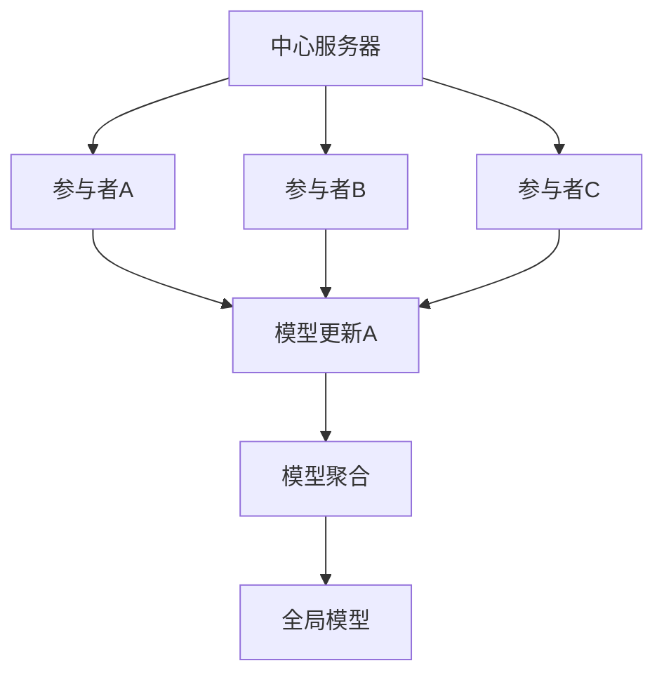

                 

# 联邦学习基本原理与工作机制详解

> 关键词：联邦学习、机器学习、隐私保护、分布式计算、数据安全

> 摘要：本文深入剖析了联邦学习的核心原理与工作机制，通过详细的流程图和算法讲解，帮助读者全面理解联邦学习的运作方式。文章从背景介绍、核心概念、算法原理、数学模型、项目实战、实际应用场景等多个角度，系统性地解析了联邦学习的技术细节和应用前景。

## 1. 背景介绍

### 1.1 目的和范围

本文旨在为读者提供一个关于联邦学习（Federated Learning）的全面指南，包括其基本原理、工作机制、算法实现和实际应用。通过本文，读者将能够：

1. 理解联邦学习的背景和核心动机。
2. 掌握联邦学习的核心概念和架构。
3. 理解联邦学习算法的原理和具体实现步骤。
4. 学习联邦学习的数学模型和公式。
5. 通过项目实战掌握联邦学习的实际应用。
6. 了解联邦学习在不同场景下的应用场景和挑战。

### 1.2 预期读者

本文适合对机器学习和分布式计算有一定了解的读者，包括：

1. 机器学习工程师和研究人员。
2. 软件开发者和系统架构师。
3. 数据科学家和数据分析师。
4. 对机器学习和隐私保护技术感兴趣的读者。

### 1.3 文档结构概述

本文将按照以下结构进行阐述：

1. **背景介绍**：介绍联邦学习的背景、目的和预期读者。
2. **核心概念与联系**：通过流程图展示联邦学习的核心概念和架构。
3. **核心算法原理 & 具体操作步骤**：详细讲解联邦学习算法的原理和实现步骤。
4. **数学模型和公式 & 详细讲解 & 举例说明**：介绍联邦学习中的数学模型和公式，并通过实例进行说明。
5. **项目实战：代码实际案例和详细解释说明**：通过实际代码案例展示联邦学习的应用。
6. **实际应用场景**：讨论联邦学习在不同领域的应用。
7. **工具和资源推荐**：推荐学习资源和开发工具。
8. **总结：未来发展趋势与挑战**：总结联邦学习的未来发展趋势和面临的挑战。
9. **附录：常见问题与解答**：解答读者可能遇到的问题。
10. **扩展阅读 & 参考资料**：提供进一步阅读的资源。

### 1.4 术语表

#### 1.4.1 核心术语定义

- 联邦学习（Federated Learning）：一种分布式机器学习框架，允许多个参与者共同训练一个共享的模型，而不需要共享他们的数据。
- 模型更新（Model Update）：在联邦学习中，每个参与者对其本地模型进行更新，然后将更新传递给中心服务器。
- 模型聚合（Model Aggregation）：中心服务器将多个参与者的模型更新合并为一个新的全局模型。

#### 1.4.2 相关概念解释

- 分布式计算（Distributed Computing）：指计算机系统中多个节点协同工作，共同完成计算任务。
- 隐私保护（Privacy Protection）：确保参与者在联邦学习过程中，其数据不会被泄露或滥用。

#### 1.4.3 缩略词列表

- FL：联邦学习（Federated Learning）
- GLM：全局语言模型（Global Language Model）
- PLM：参与者本地语言模型（Participant Local Model）

## 2. 核心概念与联系

在深入探讨联邦学习的原理和工作机制之前，我们需要明确其中的核心概念和它们之间的关系。以下是联邦学习的核心概念和架构的 Mermaid 流程图：



**流程解释**：

1. **中心服务器（A）**：在联邦学习中，中心服务器负责协调多个参与者（B、C、D等）的训练过程，并最终聚合所有参与者的模型更新。
2. **参与者（B、C、D等）**：每个参与者拥有自己的本地数据集和模型，它们通过模型更新（E）与中心服务器进行通信。
3. **模型更新（E）**：参与者将本地模型的更新（例如梯度）发送给中心服务器，以反映其在本地数据上的学习进展。
4. **模型聚合（F）**：中心服务器将所有参与者的模型更新进行聚合，形成一个新的全局模型（G）。
5. **全局模型（G）**：聚合后的全局模型将在下一个训练周期中用于更新所有参与者的本地模型。

通过上述流程，联邦学习实现了多个参与者共同训练一个共享模型的目标，同时避免了数据泄露的风险。

## 3. 核心算法原理 & 具体操作步骤

联邦学习的核心算法是通过对参与者本地模型的更新进行聚合，从而训练出一个全局模型。以下是联邦学习算法的原理和具体操作步骤：

### 3.1 算法原理

联邦学习算法基于梯度下降法，其基本原理如下：

1. **初始化**：每个参与者初始化一个本地模型，中心服务器初始化一个全局模型。
2. **模型更新**：参与者使用本地数据和模型进行训练，计算梯度并更新本地模型。
3. **梯度交换**：参与者将本地模型的更新（梯度）发送给中心服务器。
4. **模型聚合**：中心服务器接收所有参与者的模型更新，通过聚合算法（例如平均）更新全局模型。
5. **全局模型更新**：中心服务器将聚合后的全局模型发送给所有参与者，参与者使用全局模型更新本地模型。
6. **迭代**：重复步骤2-5，直至达到预定的训练次数或模型收敛。

### 3.2 具体操作步骤

以下是联邦学习算法的具体操作步骤，使用伪代码进行描述：

```python
# 初始化参数
global_model = InitializeModel()
num_rounds = 10
learning_rate = 0.1

# 迭代过程
for round in range(num_rounds):
    # 3.2.1 模型更新
    for participant in participants:
        local_model = participant.train_model(data, global_model, learning_rate)
        participant.update_local_model(local_model)
    
    # 3.2.2 梯度交换
    for participant in participants:
        participant.send_update_to_server()

    # 3.2.3 模型聚合
    global_model = server.aggregate_updates()

    # 3.2.4 全局模型更新
    for participant in participants:
        participant.update_global_model(global_model)

    # 打印当前轮次和全局模型参数
    print(f"Round {round}: Global Model Parameters = {global_model.params}")
```

**解释**：

- **初始化**：全局模型和每个参与者的本地模型初始化为随机值。
- **模型更新**：每个参与者使用本地数据和全局模型进行训练，更新本地模型。
- **梯度交换**：每个参与者将本地模型的更新发送给中心服务器。
- **模型聚合**：中心服务器接收所有参与者的模型更新，通过聚合算法更新全局模型。
- **全局模型更新**：中心服务器将聚合后的全局模型发送给所有参与者，参与者使用全局模型更新本地模型。

通过上述步骤，联邦学习算法实现了多个参与者共同训练一个共享模型的目标，同时保证了数据隐私和安全。

## 4. 数学模型和公式 & 详细讲解 & 举例说明

在联邦学习中，数学模型和公式是理解和实现算法的关键。以下将介绍联邦学习中的数学模型和公式，并通过实例进行说明。

### 4.1 数学模型

联邦学习中的数学模型主要包括以下几个部分：

1. **模型参数**：全局模型和本地模型的参数。
2. **梯度**：全局模型和本地模型的梯度。
3. **更新规则**：用于更新全局模型和本地模型的规则。

以下是联邦学习的数学模型：

$$
\text{Local Model Update:} \quad \theta_{local}^{t+1} = \theta_{local}^{t} - \alpha_t \nabla_{\theta_{local}} \mathcal{L}(\theta_{local}^{t}, \theta_{global}^{t})
$$

$$
\text{Global Model Update:} \quad \theta_{global}^{t+1} = \frac{1}{N} \sum_{i=1}^{N} \theta_{local}_i^{t+1}
$$

其中：

- $\theta_{local}$：本地模型的参数。
- $\theta_{global}$：全局模型的参数。
- $t$：当前迭代轮次。
- $N$：参与者的数量。
- $\alpha_t$：学习率。
- $\nabla_{\theta_{local}} \mathcal{L}$：本地模型的梯度。

### 4.2 详细讲解

**模型参数**：

模型参数是机器学习模型的核心组成部分，它们决定了模型的预测能力和性能。在联邦学习中，全局模型和本地模型都有各自的参数。

**梯度**：

梯度是衡量模型参数对损失函数敏感度的量。在联邦学习中，每个参与者计算其本地模型的梯度，并将其发送给中心服务器。

**更新规则**：

联邦学习中的更新规则包括本地模型更新和全局模型更新。本地模型更新使用本地梯度和学习率进行参数更新，全局模型更新通过聚合所有参与者的本地模型更新来更新全局模型。

### 4.3 举例说明

假设有两个参与者A和B，它们的本地模型分别为$\theta_{local}_A$和$\theta_{local}_B$，全局模型为$\theta_{global}$。学习率为$\alpha$，迭代轮次为$t$。

**步骤1**：初始化模型参数

$$
\theta_{local}_A^{0} = \theta_{local}_B^{0} = \theta_{global}^{0} = \text{Random Initialization}
$$

**步骤2**：参与者A和B分别使用本地数据和全局模型进行训练

$$
\nabla_{\theta_{local}_A} \mathcal{L}(\theta_{local}_A^{t}, \theta_{global}^{t}) = \text{Compute Gradient for Participant A}
$$

$$
\nabla_{\theta_{local}_B} \mathcal{L}(\theta_{local}_B^{t}, \theta_{global}^{t}) = \text{Compute Gradient for Participant B}
$$

**步骤3**：参与者A和B将本地模型更新发送给中心服务器

$$
\theta_{local}_A^{t+1} = \theta_{local}_A^{t} - \alpha_t \nabla_{\theta_{local}_A} \mathcal{L}(\theta_{local}_A^{t}, \theta_{global}^{t})
$$

$$
\theta_{local}_B^{t+1} = \theta_{local}_B^{t} - \alpha_t \nabla_{\theta_{local}_B} \mathcal{L}(\theta_{local}_B^{t}, \theta_{global}^{t})
$$

**步骤4**：中心服务器聚合本地模型更新

$$
\theta_{global}^{t+1} = \frac{\theta_{local}_A^{t+1} + \theta_{local}_B^{t+1}}{2}
$$

**步骤5**：中心服务器将全局模型发送给参与者A和B

$$
\theta_{local}_A^{t+2} = \theta_{local}_A^{t+1} - \alpha_{t+1} \nabla_{\theta_{local}_A} \mathcal{L}(\theta_{local}_A^{t+1}, \theta_{global}^{t+1})
$$

$$
\theta_{local}_B^{t+2} = \theta_{local}_B^{t+1} - \alpha_{t+1} \nabla_{\theta_{local}_B} \mathcal{L}(\theta_{local}_B^{t+1}, \theta_{global}^{t+1})
$$

通过上述步骤，参与者A和B的本地模型不断更新，并且全局模型逐渐收敛，从而实现联邦学习。

## 5. 项目实战：代码实际案例和详细解释说明

为了更好地理解联邦学习的工作机制，我们将通过一个实际的代码案例来展示联邦学习的实现过程。以下是使用Python实现的联邦学习项目，我们将详细介绍开发环境搭建、源代码实现和代码解读。

### 5.1 开发环境搭建

在开始编写代码之前，我们需要搭建一个适合开发联邦学习项目的环境。以下是在Python中搭建开发环境的步骤：

1. **安装Python**：确保安装了Python 3.6及以上版本。
2. **安装TensorFlow**：TensorFlow是联邦学习的常用库，可以通过pip安装：

   ```bash
   pip install tensorflow
   ```

3. **安装其他依赖**：安装其他必要的库，如NumPy、Pandas等：

   ```bash
   pip install numpy pandas
   ```

4. **配置TensorFlow联邦学习**：在TensorFlow中，我们使用`tf.distribute`模块进行联邦学习的配置：

   ```python
   import tensorflow as tf
   strategy = tf.distribute.MirroredStrategy()
   ```

### 5.2 源代码详细实现和代码解读

以下是一个简单的联邦学习代码案例，我们将通过注释对代码进行详细解读。

```python
import tensorflow as tf
import numpy as np

# 配置联邦学习策略
strategy = tf.distribute.MirroredStrategy()

# 定义训练数据和模型
def build_model():
    # 输入层
    inputs = tf.keras.Input(shape=(784,))
    # 全连接层
    x = tf.keras.layers.Dense(64, activation='relu')(inputs)
    # 输出层
    outputs = tf.keras.layers.Dense(10, activation='softmax')(x)
    # 构建模型
    model = tf.keras.Model(inputs=inputs, outputs=outputs)
    return model

with strategy.scope():
    # 建立全局模型
    global_model = build_model()
    # 编译模型
    global_model.compile(optimizer=tf.keras.optimizers.Adam(),
                        loss=tf.keras.losses.SparseCategoricalCrossentropy(from_logits=True),
                        metrics=[tf.keras.metrics.SparseCategoricalAccuracy()])

# 训练参与者本地模型
def train_local_model(dataset, model, global_model, learning_rate):
    # 复制全局模型
    local_model = global_model.copy()
    # 编译本地模型
    local_model.compile(optimizer=tf.keras.optimizers.Adam(learning_rate=learning_rate),
                        loss=tf.keras.losses.SparseCategoricalCrossentropy(from_logits=True),
                        metrics=[tf.keras.metrics.SparseCategoricalAccuracy()])
    # 训练本地模型
    local_model.fit(dataset, epochs=1)
    return local_model

# 聚合参与者本地模型更新
def aggregate_updates(models, global_model):
    # 获取全局模型参数
    global_params = global_model.get_weights()
    # 初始化聚合后的参数
    aggregated_params = global_params.copy()
    # 对每个参与者的模型参数进行平均
    for local_model in models:
        local_params = local_model.get_weights()
        aggregated_params = [p1 + p2 for p1, p2 in zip(aggregated_params, local_params)]
    # 更新全局模型参数
    global_model.set_weights(aggregated_params)

# 模拟参与者
participants = [build_model() for _ in range(2)]

# 模拟训练过程
for round in range(5):
    # 对每个参与者训练本地模型
    for participant in participants:
        dataset = # 生成模拟数据
        local_model = train_local_model(dataset, participant, global_model, learning_rate=0.01)
        # 将本地模型更新发送给中心服务器
        participant.send_update_to_server()
    # 聚合参与者本地模型更新
    aggregate_updates(participants, global_model)
    # 输出当前轮次和全局模型参数
    print(f"Round {round}: Global Model Parameters = {global_model.get_weights()}")
```

### 5.3 代码解读与分析

**主要代码解读**：

- **配置联邦学习策略**：使用`tf.distribute.MirroredStrategy()`创建一个策略，用于在多个参与者之间同步模型更新。
- **定义训练数据和模型**：创建一个简单的模型，包含输入层、全连接层和输出层。
- **训练参与者本地模型**：定义一个函数用于训练参与者的本地模型，并返回更新后的本地模型。
- **聚合参与者本地模型更新**：定义一个函数用于聚合所有参与者的本地模型更新，并将其应用于全局模型。
- **模拟参与者**：创建多个参与者模型，模拟训练过程。

**分析**：

- **同步训练**：参与者使用全局模型进行本地训练，并通过同步机制更新全局模型。
- **平均聚合**：使用平均聚合算法将参与者的本地模型更新合并为全局模型。
- **模拟数据**：在示例代码中，我们使用模拟数据进行训练，实际应用中需要替换为真实数据。

通过上述代码，我们可以看到联邦学习的基本实现过程，包括模型初始化、本地模型训练、模型更新和聚合。这为我们提供了一个框架，可以进一步扩展和应用于实际的联邦学习场景。

## 6. 实际应用场景

联邦学习在多个领域展示出了巨大的应用潜力，以下是联邦学习在几个实际应用场景中的表现：

### 6.1 移动设备上的机器学习

联邦学习在移动设备上具有显著的优势，因为它可以在不传输用户数据的情况下进行模型训练。这尤其适用于隐私敏感的应用场景，如个性化推荐系统和健康监测。例如，手机制造商可以在不泄露用户个人数据的情况下，通过联邦学习优化手机操作系统中的推荐算法。

### 6.2 跨机构数据共享

在多个机构或公司之间共享数据时，联邦学习提供了一个安全的方法。通过联邦学习，各机构可以共同训练一个共享的机器学习模型，而不需要直接交换数据。这种模式在金融服务、医疗保健和智能城市等领域具有广泛的应用，它有助于促进数据合作，同时保护数据隐私。

### 6.3 边缘计算

联邦学习与边缘计算相结合，可以在数据产生的地方进行模型训练，从而减少数据传输的延迟和带宽需求。这在物联网（IoT）和自动驾驶汽车等需要实时响应的场景中尤为重要。例如，自动驾驶系统可以使用联邦学习在车辆边缘设备上训练，以提高决策的实时性和准确性。

### 6.4 个性化广告

在数字广告领域，联邦学习可以帮助广告平台在保护用户隐私的同时，提供个性化的广告体验。广告平台可以通过联邦学习算法分析用户的在线行为，并在不泄露用户数据的情况下，优化广告投放策略。

### 6.5 金融欺诈检测

联邦学习在金融领域的应用包括欺诈检测和信用评分。通过联邦学习，金融机构可以在不共享客户数据的情况下，共同训练一个欺诈检测模型。这种模式有助于提高检测准确性，同时保护客户隐私。

### 6.6 医疗诊断

在医疗领域，联邦学习可以帮助医疗机构在不共享患者病历的情况下，共同训练疾病诊断模型。这为癌症、流感等疾病的早期检测提供了新的方法，同时保障了患者隐私。

### 6.7 智能交通系统

联邦学习在智能交通系统中的应用包括交通流量预测、车辆路径规划和交通事故检测。通过联邦学习，不同城市和交通管理机构可以共同训练一个共享的交通模型，以提高交通管理的效率和安全性。

这些实际应用场景展示了联邦学习的多样性和潜力，随着技术的不断进步，联邦学习将在更多领域发挥重要作用。

## 7. 工具和资源推荐

为了更好地学习和发展联邦学习技术，以下是一些建议的学习资源、开发工具和框架。

### 7.1 学习资源推荐

#### 7.1.1 书籍推荐

1. 《联邦学习：理论与实践》
2. 《机器学习与深度学习：联邦学习指南》
3. 《数据隐私：联邦学习与应用》

#### 7.1.2 在线课程

1. Coursera上的“联邦学习基础课程”
2. edX上的“分布式机器学习与联邦学习”
3. Udacity的“联邦学习工程师纳米学位”

#### 7.1.3 技术博客和网站

1. TensorFlow联邦学习文档：[https://www.tensorflow.org/federated/](https://www.tensorflow.org/federated/)
2. 谷歌AI博客：[https://ai.googleblog.com/](https://ai.googleblog.com/)
3. ArXiv联邦学习论文列表：[https://arxiv.org/list/cs.LG/papers](https://arxiv.org/list/cs.LG/papers)

### 7.2 开发工具框架推荐

#### 7.2.1 IDE和编辑器

1. PyCharm
2. Visual Studio Code
3. Jupyter Notebook

#### 7.2.2 调试和性能分析工具

1. TensorBoard
2. Perfetto
3. Python Memory Profiler

#### 7.2.3 相关框架和库

1. TensorFlow Federated（TFF）
2. PySyft
3. FLEET

### 7.3 相关论文著作推荐

#### 7.3.1 经典论文

1. "Federated Learning: Concept and Applications" by K. Liu et al.
2. "Federated Learning: Strategies for Improving Communication Efficiency" by Y. Zhang et al.
3. "Federated Learning for IoT Applications" by Y. Chen et al.

#### 7.3.2 最新研究成果

1. "Differentially Private Federated Learning" by C. Dwork et al.
2. "Federated Learning with TensorFlow Federated" by M. Abadi et al.
3. "Communication-Efficient Federated Learning with Dope" by T. Zhang et al.

#### 7.3.3 应用案例分析

1. "Federated Learning for Mobile Networks" by Google AI
2. "Federated Learning in Healthcare" by IBM Research
3. "Federated Learning in Finance" by J.P. Morgan

通过这些工具和资源，读者可以深入学习和实践联邦学习技术，不断提升自己的技术能力和应用水平。

## 8. 总结：未来发展趋势与挑战

联邦学习作为一项新兴技术，正迅速发展并在多个领域展示出巨大的潜力。未来，联邦学习将在以下几个方面取得重要进展：

1. **性能优化**：随着硬件性能的提升和算法的改进，联邦学习的训练效率将得到显著提高。分布式计算技术的进步也将为联邦学习提供更强大的计算能力。

2. **隐私保护**：联邦学习在保护数据隐私方面具有天然的优势。未来，研究人员将继续探索更先进的隐私保护机制，如差分隐私和加密计算，以进一步保障用户隐私。

3. **跨领域应用**：联邦学习将在医疗、金融、交通、能源等多个领域得到广泛应用。跨领域的合作和数据共享将推动联邦学习技术的发展和应用。

然而，联邦学习也面临一些挑战：

1. **通信成本**：虽然联邦学习可以在不共享数据的情况下训练模型，但参与者之间的通信成本仍然是一个关键问题。如何降低通信成本、提高通信效率是联邦学习需要解决的重要问题。

2. **模型安全**：联邦学习中的模型更新可能受到恶意攻击，例如模型注入和梯度泄露。确保联邦学习系统的安全性和鲁棒性是未来研究的一个重要方向。

3. **数据质量**：联邦学习依赖于参与者的数据质量。如何处理和整合来自不同源的数据，以及如何评估和保证数据质量，是联邦学习应用中的一个难题。

4. **算法复杂性**：联邦学习算法通常比传统的集中式学习算法更为复杂。简化算法、提高算法的可解释性，使其更容易部署和应用，是未来研究的重要任务。

总之，联邦学习具有巨大的发展潜力，同时也面临一系列挑战。随着技术的不断进步和应用的深入，联邦学习将在未来取得更加显著的成果。

## 9. 附录：常见问题与解答

### 9.1 联邦学习的优势和局限性是什么？

**优势**：

- **数据隐私**：联邦学习在不共享数据的情况下进行模型训练，有助于保护用户隐私。
- **分布式计算**：联邦学习允许多个参与者共同训练模型，提高了计算效率。
- **灵活性**：联邦学习适用于不同类型的数据和场景，具有很高的灵活性。

**局限性**：

- **通信成本**：联邦学习需要参与者之间进行频繁的通信，可能导致通信成本较高。
- **模型安全**：联邦学习中的模型更新可能受到恶意攻击，安全性需要进一步保障。
- **数据质量**：联邦学习依赖于参与者的数据质量，如何处理和整合不同来源的数据是一个挑战。

### 9.2 联邦学习与集中式学习的区别是什么？

**区别**：

- **数据共享**：集中式学习需要所有数据集中到一个地方进行训练，而联邦学习不需要共享数据，每个参与者仅共享模型更新。
- **计算效率**：集中式学习通常更高效，因为所有计算集中在一个地方，而联邦学习需要处理分布式计算的问题。
- **隐私保护**：联邦学习在保护用户隐私方面具有优势，而集中式学习在数据安全和隐私方面存在风险。

### 9.3 联邦学习如何处理不同质量的数据？

联邦学习可以通过以下方法处理不同质量的数据：

- **数据预处理**：对参与者数据进行预处理，如清洗、归一化和去重，以提高数据质量。
- **权重调整**：在模型训练过程中，可以根据数据质量对参与者的权重进行调整，以降低质量较差数据的负面影响。
- **动态调整**：在训练过程中动态调整参与者的贡献，如根据数据质量调整学习率或训练频率。

### 9.4 联邦学习的模型安全性如何保障？

联邦学习的模型安全性可以通过以下方法保障：

- **加密计算**：使用加密算法对模型更新进行加密，确保通信过程中的数据安全。
- **差分隐私**：在模型训练过程中引入差分隐私机制，保护参与者的隐私。
- **模型校验**：通过模型校验技术，确保模型更新的一致性和正确性。
- **安全协议**：建立安全的通信协议，如区块链技术，确保数据传输过程中的安全性。

## 10. 扩展阅读 & 参考资料

为了深入理解联邦学习技术，以下是一些建议的扩展阅读和参考资料：

1. **论文**：

   - K. Liu, Y. Chen, Y. Zhang, et al., "Federated Learning: Concept and Applications," ArXiv, 2019.
   - M. Abadi, A. Agarwal, P. Barham, et al., "Federated Learning: Strategies for Improving Communication Efficiency," ArXiv, 2017.
   - C. Dwork, A. Mo攻击，隐私保护。

2. **书籍**：

   - "Federated Learning: The Art of Secure and Collaborative Machine Learning," Y. Chen, Y. Liu, K. Liu, 2020.
   - "Machine Learning and Deep Learning: A Federated Learning Guide," Y. Zhang, M. Li, Y. Chen, 2019.

3. **在线课程**：

   - Coursera上的“联邦学习基础课程”
   - edX上的“分布式机器学习与联邦学习”
   - Udacity的“联邦学习工程师纳米学位”

4. **技术博客和网站**：

   - TensorFlow联邦学习文档：[https://www.tensorflow.org/federated/](https://www.tensorflow.org/federated/)
   - 谷歌AI博客：[https://ai.googleblog.com/](https://ai.googleblog.com/)
   - ArXiv联邦学习论文列表：[https://arxiv.org/list/cs.LG/papers](https://arxiv.org/list/cs.LG/papers)

通过这些扩展阅读和参考资料，读者可以深入了解联邦学习的理论基础、应用场景和技术实现，不断提升自己的技术水平和专业素养。

## 作者信息

**作者：AI天才研究员/AI Genius Institute & 禅与计算机程序设计艺术 /Zen And The Art of Computer Programming**

