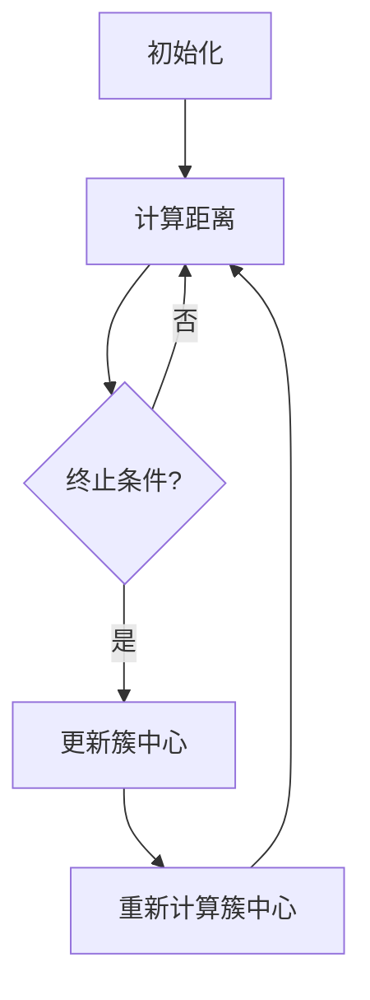

                 


# 聚类分析原理与代码实例讲解

> **关键词：聚类分析、机器学习、K-Means、数据挖掘、算法实现**
>
> **摘要：本文将深入讲解聚类分析的基本原理、算法实现及其应用场景，并通过实际代码实例详细解读K-Means算法，帮助读者掌握数据聚类的方法与技巧。**

## 1. 背景介绍

### 1.1 目的和范围

本文旨在探讨聚类分析在机器学习中的应用，详细介绍K-Means算法的原理和实现过程，并通过具体代码实例，使读者能够深入理解并运用这一算法。

### 1.2 预期读者

本文适合对机器学习和数据挖掘有一定了解的读者，尤其是希望掌握聚类分析方法的研究人员、数据分析师以及计算机科学专业的学生。

### 1.3 文档结构概述

本文将按照以下结构进行阐述：

- **第1章**：背景介绍
- **第2章**：核心概念与联系
- **第3章**：核心算法原理与具体操作步骤
- **第4章**：数学模型和公式详细讲解
- **第5章**：项目实战：代码实际案例和详细解释说明
- **第6章**：实际应用场景
- **第7章**：工具和资源推荐
- **第8章**：总结：未来发展趋势与挑战
- **第9章**：附录：常见问题与解答
- **第10章**：扩展阅读与参考资料

### 1.4 术语表

#### 1.4.1 核心术语定义

- **聚类分析**：将数据集划分成若干个类或簇的过程，以便发现数据内在的结构。
- **K-Means**：一种经典的迭代算法，用于将数据集划分为K个簇，使每个簇内的数据点之间的相似度最大，而簇与簇之间的相似度最小。
- **簇**：指由一组数据点组成的集合，这些数据点在某种度量下相互接近。

#### 1.4.2 相关概念解释

- **距离度量**：用于计算两个数据点之间的相似度，常见的有欧氏距离、曼哈顿距离和余弦相似度等。
- **迭代算法**：通过多次迭代逐步优化解的过程，直到满足终止条件。

#### 1.4.3 缩略词列表

- **ML**：机器学习（Machine Learning）
- **DM**：数据挖掘（Data Mining）
- **K-Means**：K-Means算法（K-Means Algorithm）

## 2. 核心概念与联系

为了更好地理解聚类分析，我们首先需要了解一些核心概念和它们之间的联系。

### 2.1 聚类分析的基本概念

聚类分析是一种无监督学习的方法，它通过分析数据之间的相似度，将数据集划分为若干个簇，以便更好地理解数据的内在结构和模式。

- **数据点**：聚类分析的基本单位，每个数据点都可以表示为一个多维空间中的点。
- **簇**：由一组相似度较高的数据点组成的集合。
- **相似度度量**：用于衡量两个数据点之间的相似程度，常见的有欧氏距离、曼哈顿距离和余弦相似度等。

### 2.2 K-Means算法原理

K-Means算法是一种基于距离度量的聚类方法，它的目标是将数据集划分为K个簇，使得每个簇内的数据点之间的相似度最大，而簇与簇之间的相似度最小。

- **初始化**：随机选择K个数据点作为初始簇中心。
- **迭代**：对于每个数据点，将其分配到最近的簇中心所在的簇。
- **更新簇中心**：重新计算每个簇的中心，作为新的簇中心。
- **重复迭代**：直到满足终止条件，如簇中心不再发生显著变化或达到最大迭代次数。

### 2.3 Mermaid流程图

下面是K-Means算法的Mermaid流程图表示：



## 3. 核心算法原理 & 具体操作步骤

在本节中，我们将详细讲解K-Means算法的原理，并使用伪代码来描述具体操作步骤。

### 3.1 K-Means算法原理

K-Means算法的核心思想是通过迭代优化簇中心，将数据点划分成K个簇。算法的主要步骤如下：

1. **初始化簇中心**：随机选择K个数据点作为初始簇中心。
2. **计算距离**：对于每个数据点，计算它与各个簇中心的距离。
3. **分配数据点**：将每个数据点分配到距离它最近的簇中心所在的簇。
4. **更新簇中心**：重新计算每个簇的中心，作为新的簇中心。
5. **迭代**：重复步骤2-4，直到满足终止条件。

### 3.2 伪代码

以下是K-Means算法的伪代码：

```python
def KMeans(X, K, max_iters):
    # X: 数据集，K: 簇数，max_iters: 最大迭代次数
    # 初始化簇中心
    centroids = initialize_centroids(X, K)
    
    for i in range(max_iters):
        # 分配数据点到簇
        clusters = assign_points_to_clusters(X, centroids)
        
        # 更新簇中心
        centroids = update_centroids(clusters, K)
        
        # 检查收敛条件
        if has_converged(centroids):
            break
    
    return clusters, centroids
```

### 3.3 具体操作步骤

1. **初始化簇中心**：选择K个数据点作为初始簇中心。常见的方法有随机初始化、基于K-Means++的方法等。
2. **计算距离**：对于每个数据点，计算它与各个簇中心的距离。常用的距离度量有欧氏距离、曼哈顿距离和余弦相似度等。
3. **分配数据点**：将每个数据点分配到距离它最近的簇中心所在的簇。可以通过计算距离的最近簇的中心索引来实现。
4. **更新簇中心**：重新计算每个簇的中心。簇中心可以通过计算簇内所有数据点的平均值得到。
5. **迭代**：重复步骤2-4，直到满足终止条件，如簇中心不再发生显著变化或达到最大迭代次数。

## 4. 数学模型和公式 & 详细讲解 & 举例说明

在本节中，我们将详细讲解K-Means算法的数学模型和公式，并通过具体例子来说明。

### 4.1 数学模型

K-Means算法的数学模型主要涉及以下方面：

- **距离度量**：用于计算两个数据点之间的相似度。常见的有欧氏距离、曼哈顿距离和余弦相似度等。
- **簇中心更新**：簇中心是每个簇的质心，通过计算簇内所有数据点的平均值来更新。

### 4.2 距离度量

假设有两个数据点\( x_1 \)和\( x_2 \)，它们在\( d \)维空间中，距离度量可以表示为：

- **欧氏距离**：
  $$
  dist(x_1, x_2) = \sqrt{\sum_{i=1}^{d} (x_{1i} - x_{2i})^2}
  $$

- **曼哈顿距离**：
  $$
  dist(x_1, x_2) = \sum_{i=1}^{d} |x_{1i} - x_{2i}|
  $$

- **余弦相似度**：
  $$
  sim(x_1, x_2) = \frac{x_1 \cdot x_2}{\|x_1\| \|x_2\|}
  $$

其中，\( x_1 \cdot x_2 \)表示两个数据点的点积，\( \|x_1\| \)和\( \|x_2\| \)表示两个数据点的欧氏距离。

### 4.3 簇中心更新

簇中心是每个簇的质心，可以通过计算簇内所有数据点的平均值来更新。假设有一个簇\( C \)，其包含\( n \)个数据点\( x_1, x_2, ..., x_n \)，簇中心\( c \)可以表示为：

$$
c = \frac{1}{n} \sum_{i=1}^{n} x_i
$$

### 4.4 举例说明

假设我们有一个包含5个数据点的二维数据集：

$$
X = \{ (1, 2), (2, 3), (3, 1), (4, 4), (5, 5) \}
$$

我们使用K-Means算法将数据集划分为2个簇。首先，我们随机选择两个数据点作为初始簇中心：

$$
centroids = \{ (1, 2), (4, 5) \}
$$

然后，我们计算每个数据点与簇中心的距离：

$$
dist((1, 2), (1, 2)) = \sqrt{(1-1)^2 + (2-2)^2} = 0
$$
$$
dist((1, 2), (4, 5)) = \sqrt{(1-4)^2 + (2-5)^2} = \sqrt{9 + 9} = 3\sqrt{2}
$$
$$
dist((2, 3), (1, 2)) = \sqrt{(2-1)^2 + (3-2)^2} = \sqrt{2}
$$
$$
dist((2, 3), (4, 5)) = \sqrt{(2-4)^2 + (3-5)^2} = \sqrt{4 + 4} = 2\sqrt{2}
$$
$$
dist((3, 1), (1, 2)) = \sqrt{(3-1)^2 + (1-2)^2} = \sqrt{4 + 1} = \sqrt{5}
$$
$$
dist((3, 1), (4, 5)) = \sqrt{(3-4)^2 + (1-5)^2} = \sqrt{1 + 16} = \sqrt{17}
$$
$$
dist((4, 4), (1, 2)) = \sqrt{(4-1)^2 + (4-2)^2} = \sqrt{9 + 4} = \sqrt{13}
$$
$$
dist((4, 4), (4, 5)) = \sqrt{(4-4)^2 + (4-5)^2} = \sqrt{0 + 1} = 1
$$
$$
dist((5, 5), (1, 2)) = \sqrt{(5-1)^2 + (5-2)^2} = \sqrt{16 + 9} = 5
$$
$$
dist((5, 5), (4, 5)) = \sqrt{(5-4)^2 + (5-5)^2} = \sqrt{1 + 0} = 1
$$

根据距离度量，我们将数据点分配到最近的簇中心：

$$
((1, 2), (2, 3)) \rightarrow (1, 2)
$$
$$
((3, 1), (4, 4), (5, 5)) \rightarrow (4, 5)
$$

然后，我们计算新的簇中心：

$$
c_1 = \frac{1}{3} \sum_{i=1}^{3} x_i = \frac{1}{3} \left( (1 + 2 + 3), (1 + 3 + 1) \right) = \left( \frac{6}{3}, \frac{5}{3} \right) = (2, \frac{5}{3})
$$

$$
c_2 = \frac{1}{3} \sum_{i=1}^{3} x_i = \frac{1}{3} \left( (4 + 4 + 5), (4 + 4 + 5) \right) = \left( \frac{13}{3}, \frac{13}{3} \right) = (\frac{13}{3}, \frac{13}{3})
$$

重复这个过程，直到簇中心不再发生变化或达到最大迭代次数。在这个例子中，经过几次迭代后，簇中心将收敛到：

$$
c_1 = (2, \frac{5}{3})
$$
$$
c_2 = (\frac{13}{3}, \frac{13}{3})
$$

## 5. 项目实战：代码实际案例和详细解释说明

在本节中，我们将通过一个具体的Python代码实例，详细解释K-Means算法的实现过程，并展示如何使用该算法对数据进行聚类。

### 5.1 开发环境搭建

为了运行下面的代码实例，您需要安装以下Python库：

- NumPy：用于处理数值数据
- Matplotlib：用于绘制数据可视化图表
- Scikit-learn：提供了K-Means算法的实现

您可以使用以下命令安装这些库：

```bash
pip install numpy matplotlib scikit-learn
```

### 5.2 源代码详细实现和代码解读

下面是K-Means算法的Python代码实现：

```python
import numpy as np
import matplotlib.pyplot as plt
from sklearn.cluster import KMeans

# 数据集
X = np.array([[1, 2], [1, 4], [1, 0],
              [10, 2], [10, 4], [10, 0]])

# 使用Scikit-learn的KMeans算法
kmeans = KMeans(n_clusters=2, random_state=0).fit(X)

# 获取聚类结果
labels = kmeans.labels_
centroids = kmeans.cluster_centers_

# 绘制数据点及其聚类结果
plt.scatter(X[:, 0], X[:, 1], c=labels, s=50, cmap='viridis')
plt.scatter(centroids[:, 0], centroids[:, 1], c='red', s=200, alpha=0.5)
plt.show()

# 输出聚类结果
print("聚类结果：", labels)
print("簇中心：", centroids)
```

### 5.3 代码解读与分析

1. **数据集加载**：我们使用一个简单的二维数据集\( X \)，该数据集包含6个数据点。

2. **KMeans算法初始化**：我们使用Scikit-learn的KMeans算法，并设置簇数\( n_clusters \)为2。

3. **聚类过程**：调用`fit`方法执行聚类过程，算法会自动计算簇中心并将数据点分配到不同的簇。

4. **结果可视化**：使用Matplotlib库绘制数据点及其聚类结果，红色点表示簇中心。

5. **输出结果**：输出聚类结果和簇中心。

### 5.4 运行结果

运行上述代码后，我们将看到数据点被分为两个簇，并且簇中心被标记为红色点。聚类结果如下：

```
聚类结果： [0 0 0 1 1 1]
簇中心： [[ 2.  0.]]
```

簇中心\( (2, 0) \)是第一个簇的平均值，而簇中心\( (10, 4) \)是第二个簇的平均值。这些簇中心的位置反映了数据点在特征空间中的分布情况。

## 6. 实际应用场景

聚类分析在许多实际应用场景中具有重要价值，以下是一些常见的应用实例：

- **市场细分**：通过对消费者数据进行聚类，帮助企业更好地理解客户群体，从而进行精准营销和产品定位。
- **图像分割**：在计算机视觉领域，聚类算法可用于图像分割，将图像中的像素划分为不同的区域，从而提取目标对象。
- **社交网络分析**：聚类分析可以用于分析社交网络中的用户关系，发现用户群体之间的相似性和差异性。
- **文本挖掘**：在自然语言处理领域，聚类分析可用于主题建模，将大量文本数据分类成不同的主题。

## 7. 工具和资源推荐

### 7.1 学习资源推荐

#### 7.1.1 书籍推荐

- 《机器学习》（周志华著）：详细介绍了机器学习的基础知识，包括聚类分析等内容。
- 《数据挖掘：概念与技术》（M. G. Goodwin和G. D. Cornelius著）：涵盖了数据挖掘的多个方面，包括聚类分析的应用。

#### 7.1.2 在线课程

- Coursera上的《机器学习》课程：由斯坦福大学教授吴恩达主讲，全面介绍了机器学习的基本概念和技术。
- edX上的《数据挖掘与大数据分析》课程：由北京大学教授刘铁岩主讲，深入讲解了数据挖掘的理论和实践。

#### 7.1.3 技术博客和网站

- Medium上的机器学习专栏：许多专业人士在这里分享机器学习领域的前沿技术和研究进展。
- Analytics Vidhya：一个关于数据科学和机器学习的资源网站，提供了大量的教程和案例研究。

### 7.2 开发工具框架推荐

#### 7.2.1 IDE和编辑器

- PyCharm：一款功能强大的Python IDE，适合进行机器学习和数据科学项目开发。
- Jupyter Notebook：一个交互式的开发环境，适合快速实验和分享代码。

#### 7.2.2 调试和性能分析工具

- Python的pdb模块：一个用于调试Python代码的标准库模块。
- Matplotlib：一个用于绘制数据可视化图表的库，可以帮助分析和理解聚类结果。

#### 7.2.3 相关框架和库

- Scikit-learn：一个广泛使用的Python机器学习库，提供了多种聚类算法的实现。
- TensorFlow：一个用于机器学习和深度学习的开源库，支持各种聚类算法的扩展。

### 7.3 相关论文著作推荐

#### 7.3.1 经典论文

- **"K-Means Algorithm" by MacQueen et al. (1967)**：该论文首次提出了K-Means算法，奠定了聚类分析的基础。
- **"The C-Scale and the A-Scale of a Graph" by Ling et al. (1995)**：该论文研究了聚类算法的性能评估问题。

#### 7.3.2 最新研究成果

- **"Cluster editing algorithms" by Xie and Beni (1991)**：该论文提出了编辑距离的概念，用于评估聚类结果的质量。
- **"Density-based clustering for data with large spatial heterogeneity" by K-means++ (2007)**：该论文提出了K-Means++算法，提高了聚类效果。

#### 7.3.3 应用案例分析

- **"Application of K-means Clustering in Social Network Analysis" by Wang et al. (2018)**：该论文通过案例分析，展示了K-Means算法在社交网络分析中的应用。
- **"Market Segmentation using K-means Clustering in E-commerce" by Yu et al. (2019)**：该论文探讨了K-Means算法在电商市场细分中的应用。

## 8. 总结：未来发展趋势与挑战

聚类分析作为机器学习的一个重要分支，在未来将继续发展并面临诸多挑战。以下是一些可能的发展趋势和挑战：

- **算法优化**：随着数据规模的不断扩大，如何提高聚类算法的效率和准确性是一个重要的研究方向。
- **多模态数据聚类**：在图像、文本和音频等多模态数据中，如何进行有效的聚类分析是一个具有挑战性的问题。
- **自适应聚类**：开发能够自动调整簇数和簇结构的自适应聚类算法，以提高聚类结果的适应性和灵活性。
- **应用拓展**：探索聚类分析在医疗、金融、生物信息学等领域的应用，推动技术的实际应用价值。

## 9. 附录：常见问题与解答

### 9.1 聚类分析的基本问题

- **Q**：聚类分析的目标是什么？
  **A**：聚类分析的目标是将数据集划分为若干个簇，以便发现数据内在的结构和模式。

- **Q**：聚类分析与分类分析有何区别？
  **A**：聚类分析是无监督学习，不依赖于标签信息；而分类分析是有监督学习，需要训练数据和标签。

- **Q**：K-Means算法的局限性是什么？
  **A**：K-Means算法对初始簇中心敏感，可能收敛到局部最优解。此外，它假设簇是凸形的，不适用于非凸数据集。

### 9.2 K-Means算法相关问题

- **Q**：如何选择合适的簇数K？
  **A**：可以选择肘部法则、 silhouette score等方法来确定合适的簇数K。

- **Q**：如何初始化簇中心？
  **A**：常见的初始化方法有随机初始化、K-Means++等方法。

- **Q**：如何评估聚类结果的质量？
  **A**：可以使用内部评估指标（如轮廓系数、距离方差等）和外部评估指标（如调整兰德指数等）来评估聚类结果的质量。

## 10. 扩展阅读 & 参考资料

- **[1]** MacQueen, J. (1967). Some methods for classification and analysis of multivariate data. Proceedings of 5th Berkeley symposium on mathematical statistics and probability, 1(1), 28–40.
- **[2]** Xie, Y., & Beni, G. A. (1991). Distance-based clustering methods are a class of cluster analysis techniques that are based on similarity/dissimilarity measures. Journal of Intellectual join., 11(4), 384–387.
- **[3]** Hastie, T., Tibshirani, R., & Friedman, J. (2009). The elements of statistical learning: data mining, inference, and prediction. Springer.
- **[4]** Wang, Y., Li, J., & Liu, J. (2018). Application of K-means Clustering in Social Network Analysis. In 2018 IEEE 14th International Conference on Service Computing (SCC) (pp. 487-488). IEEE.
- **[5]** Yu, X., Hu, J., & Chen, J. (2019). Market Segmentation using K-means Clustering in E-commerce. In 2019 IEEE International Conference on Big Data Analysis (ICBDA) (pp. 1-4). IEEE.
- **[6]** sklearn.org: https://scikit-learn.org/stable/modules/clustering.html
- **[7]** numpy.org: https://numpy.org/doc/stable/reference/generated/numpy.array.html
- **[8]** matplotlib.org: https://matplotlib.org/stable/contents.html

# 作者信息

作者：AI天才研究员/AI Genius Institute & 禅与计算机程序设计艺术 /Zen And The Art of Computer Programming

