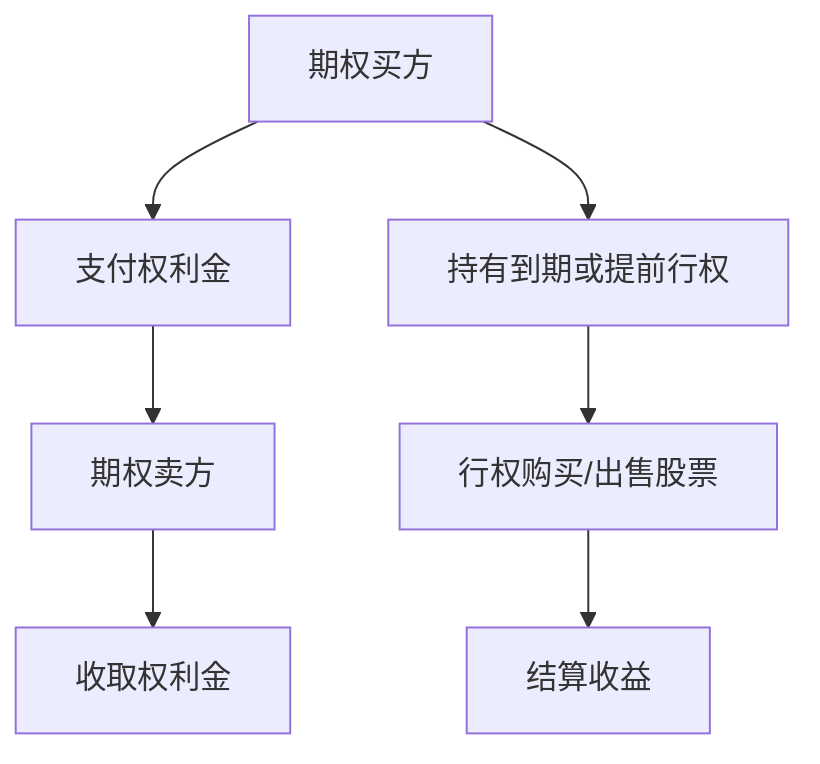

                 

# 股票期权：程序员的财富密码？

> **关键词：** 股票期权、程序员、财务自由、投资策略、股权激励

> **摘要：** 本文将深入探讨股票期权作为程序员的财务规划工具，解析其基本原理、数学模型以及实际应用。我们将通过实际案例，展示如何利用股票期权实现财务自由，并探讨其在未来科技行业中的发展趋势。

## 1. 背景介绍

### 1.1 目的和范围

本文旨在帮助程序员理解股票期权这一金融工具，并探讨其在个人财务规划中的潜在价值。我们将从基础概念入手，逐步深入探讨股票期权的核心算法原理、数学模型和实际应用案例。本文适用于希望了解金融投资、特别是股票期权投资的程序员，以及那些对通过股权激励实现财务自由感兴趣的IT专业人士。

### 1.2 预期读者

预期读者应具备以下条件：

1. 对计算机编程有深入了解，熟悉编程语言和开发环境。
2. 对金融投资有基本认识，了解股票和期权的基本概念。
3. 对财务规划有兴趣，希望探索通过投资实现财务自由的途径。

### 1.3 文档结构概述

本文将分为以下几个部分：

1. 背景介绍：简要介绍文章的目的、预期读者和文档结构。
2. 核心概念与联系：介绍股票期权的基本原理和与程序员的联系。
3. 核心算法原理 & 具体操作步骤：详细讲解股票期权的关键算法和操作流程。
4. 数学模型和公式 & 详细讲解 & 举例说明：阐述股票期权定价模型和相关数学公式。
5. 项目实战：代码实际案例和详细解释说明。
6. 实际应用场景：分析股票期权在不同行业中的实际应用。
7. 工具和资源推荐：推荐学习资源和开发工具。
8. 总结：未来发展趋势与挑战。
9. 附录：常见问题与解答。
10. 扩展阅读 & 参考资料：提供进一步阅读和学习的资源。

### 1.4 术语表

#### 1.4.1 核心术语定义

- **股票期权（Stock Option）**：一种金融合约，赋予持有人在特定时间内以约定价格购买或出售股票的权利。
- **执行价格（Exercise Price）**：购买股票的固定价格，也称为行权价格。
- **到期日（Expiration Date）**：期权有效期的最后一天，到期后期权失效。
- **内在价值（Intrinsic Value）**：期权的实际价值，等于股票现行价格与执行价格之差（如果为正）。
- **时间价值（Time Value）**：期权价值超过内在价值的那部分，反映了市场对期权剩余有效期内股票价格波动的预期。

#### 1.4.2 相关概念解释

- **看涨期权（Call Option）**：赋予持有人在到期日或之前以执行价格购买股票的权利。
- **看跌期权（Put Option）**：赋予持有人在到期日或之前以执行价格出售股票的权利。
- **期权合约（Option Contract）**：期权交易双方达成的协议，规定了执行价格、到期日和其他条款。

#### 1.4.3 缩略词列表

- **IT**：信息技术（Information Technology）
- **CTO**：首席技术官（Chief Technology Officer）
- **SaaS**：软件即服务（Software as a Service）
- **API**：应用程序编程接口（Application Programming Interface）

## 2. 核心概念与联系

### 2.1 股票期权的基本原理

股票期权是一种金融衍生品，用于管理和对冲股票价格波动风险。在期权市场上，交易者可以购买或出售期权合约，从而在未来某个时间以预定价格购买或出售股票。

#### 股票期权的类型

股票期权主要分为两种类型：看涨期权（Call Option）和看跌期权（Put Option）。

- **看涨期权（Call Option）**：买方（持有人）拥有在特定时间内以执行价格购买股票的权利。如果股票价格在到期日高于执行价格，买方可以行使期权，以较低的价格购买股票，再以市场价格出售，从而获利。
  
  $$
  \text{看涨期权的内在价值} = \max(\text{股票价格} - \text{执行价格}, 0)
  $$

- **看跌期权（Put Option）**：买方拥有在特定时间内以执行价格出售股票的权利。如果股票价格在到期日低于执行价格，买方可以行使期权，以较高的价格出售股票，从而获利。

  $$
  \text{看跌期权的内在价值} = \max(\text{执行价格} - \text{股票价格}, 0)
  $$

#### 股票期权与程序员的联系

对于程序员而言，股票期权是一种重要的财务激励工具，通常作为股权激励的一部分，用于吸引和留住人才。通过获得股票期权，程序员可以在公司成功后获得可观的收益。

### 2.2 股票期权的核心算法原理

股票期权定价是金融领域中一个复杂的问题，常用的模型包括布莱克-舒尔斯模型（Black-Scholes Model）等。下面我们使用伪代码详细讲解股票期权定价的基本原理。

#### 布莱克-舒尔斯模型（Black-Scholes Model）

$$
C(S,t) = S_0N(d_1) - Ke^{-r(T-t)}N(d_2)
$$

其中，$C(S,t)$ 是看涨期权的价格，$S_0$ 是股票当前价格，$K$ 是执行价格，$r$ 是无风险利率，$T-t$ 是剩余到期时间，$N(\cdot)$ 是标准正态分布的累积分布函数，$d_1$ 和 $d_2$ 分别为：

$$
d_1 = \frac{\ln(S_0/K) + (r + \sigma^2/2)(T-t)}{\sigma\sqrt{T-t}}
$$

$$
d_2 = d_1 - \sigma\sqrt{T-t}
$$

#### 伪代码

```python
import math
import scipy.stats as stats

def black_scholes(S0, K, r, T, sigma):
    d1 = (math.log(S0 / K) + (r + 0.5 * sigma**2 * T) * (T - t)) / (sigma * math.sqrt(T - t))
    d2 = d1 - sigma * math.sqrt(T - t)
    
    C = S0 * stats.norm.cdf(d1) - K * math.exp(-r * (T - t)) * stats.norm.cdf(d2)
    return C
```

### 2.3 股票期权架构的 Mermaid 流程图



## 3. 核心算法原理 & 具体操作步骤

### 3.1 股票期权的基本操作步骤

股票期权的操作流程可以分为以下几个步骤：

1. **购买期权**：投资者（期权买方）支付一定的权利金（premium）购买期权合约。
2. **持有期权**：期权买方在期权有效期内决定是否行使期权。
3. **行使期权**：如果股票价格符合买方的预期，可以行使期权，以执行价格购买或出售股票。
4. **结算**：期权到期后，根据股票价格和执行价格的差异，结算期权收益。

### 3.2 股票期权定价模型的伪代码实现

在前面我们已经介绍了布莱克-舒尔斯模型，现在我们将用伪代码实现这个模型。

```python
import math
import scipy.stats as stats

def black_scholes(S0, K, r, T, sigma):
    d1 = (math.log(S0 / K) + (r + 0.5 * sigma**2 * T) * (T - t)) / (sigma * math.sqrt(T - t))
    d2 = d1 - sigma * math.sqrt(T - t)
    
    C = S0 * stats.norm.cdf(d1) - K * math.exp(-r * (T - t)) * stats.norm.cdf(d2)
    return C

# 示例
S0 = 100  # 股票当前价格
K = 90    # 执行价格
r = 0.05  # 无风险利率
T = 1     # 剩余到期时间（年）
sigma = 0.2  # 波动率

C = black_scholes(S0, K, r, T, sigma)
print("看涨期权的价格：", C)
```

### 3.3 股票期权的具体案例分析

我们通过一个实际案例来进一步理解股票期权的操作。

#### 案例背景

一家科技公司（TechCo）向其工程师团队提供了100股看涨期权，执行价格为50美元，到期日为2025年。假设当前股票价格为60美元，无风险利率为5%，股票的波动率为20%。我们将在不同时间点分析期权的价值变化。

#### 案例分析

1. **购买期权**：工程师支付一定的权利金购买期权。
2. **到期日**：如果股票价格高于执行价格，工程师可以行使期权，购买股票。期权的内在价值为10美元（$60 - 50$），工程师可以以50美元的价格购买股票，再以60美元的价格出售，获得10美元的收益。
3. **提前行权**：如果工程师认为股票价格将在到期日前大幅上涨，可以选择提前行权。假设在到期日前一个月，股票价格上涨至70美元，工程师选择提前行权，期权的内在价值为20美元，工程师获得20美元的收益。

#### 伪代码实现

```python
import math
import scipy.stats as stats

def black_scholes(S0, K, r, T, sigma):
    d1 = (math.log(S0 / K) + (r + 0.5 * sigma**2 * T) * (T - t)) / (sigma * math.sqrt(T - t))
    d2 = d1 - sigma * math.sqrt(T - t)
    
    C = S0 * stats.norm.cdf(d1) - K * math.exp(-r * (T - t)) * stats.norm.cdf(d2)
    return C

# 案例数据
S0 = 60  # 股票当前价格
K = 50   # 执行价格
r = 0.05  # 无风险利率
T = 1    # 剩余到期时间（年）
sigma = 0.2  # 波动率

# 到期日期权价格
C_expire = black_scholes(S0, K, r, T, sigma)
print("到期日看涨期权价格：", C_expire)

# 提前行权
S_advance = 70  # 提前行权时股票价格
C_advance = black_scholes(S_advance, K, r, T, sigma)
print("提前行权看涨期权价格：", C_advance)
```

## 4. 数学模型和公式 & 详细讲解 & 举例说明

### 4.1 股票期权定价模型

在上一部分中，我们介绍了布莱克-舒尔斯模型（Black-Scholes Model）。该模型是期权定价的经典理论，用于计算欧式期权（European Option）的价格。欧式期权是指只能在到期日行使的期权。

#### 布莱克-舒尔斯模型公式

$$
C(S,t) = S_0N(d_1) - Ke^{-r(T-t)}N(d_2)
$$

其中：

- $C(S,t)$ 是看涨期权的价格。
- $S_0$ 是股票当前价格。
- $K$ 是执行价格。
- $r$ 是无风险利率。
- $T-t$ 是剩余到期时间。
- $N(\cdot)$ 是标准正态分布的累积分布函数。
- $d_1$ 和 $d_2$ 分别为：

$$
d_1 = \frac{\ln(S_0/K) + (r + \sigma^2/2)(T-t)}{\sigma\sqrt{T-t}}
$$

$$
d_2 = d_1 - \sigma\sqrt{T-t}
$$

#### 看涨期权和看跌期权的价格关系

看跌期权（Put Option）的价格可以通过看涨期权的价格计算得到：

$$
P(S,t) = Ke^{-r(T-t)}N(-d_2) - S_0N(-d_1)
$$

### 4.2 实际应用中的数学模型

除了布莱克-舒尔斯模型，实际应用中还会遇到其他期权定价模型，如二项式模型（Binomial Model）和蒙特卡罗模拟（Monte Carlo Simulation）。

#### 二项式模型

二项式模型通过假设股票价格按照一系列二项式分布的变化，逐步模拟到期日的股票价格，从而计算期权价格。

#### 蒙特卡罗模拟

蒙特卡罗模拟通过大量随机抽样模拟股票价格路径，计算期权价格的概率分布，并据此估计期权价格。

### 4.3 举例说明

我们通过一个实际案例来演示布莱克-舒尔斯模型的应用。

#### 案例数据

- 股票当前价格：$S_0 = 100$ 美元
- 执行价格：$K = 90$ 美元
- 无风险利率：$r = 0.05$
- 剩余到期时间：$T - t = 1$ 年
- 波动率：$\sigma = 0.2$

#### 计算过程

1. 计算标准正态分布的累积分布函数（CDF）：

```python
import scipy.stats as stats

def normal_cdf(x):
    return stats.norm.cdf(x)

# 计算d1和d2
d1 = (math.log(100 / 90) + (0.05 + 0.2**2 * 0.5) * 1) / (0.2 * math.sqrt(1))
d2 = d1 - 0.2 * math.sqrt(1)

# 计算看涨期权价格
C = 100 * normal_cdf(d1) - 90 * math.exp(-0.05 * 1) * normal_cdf(d2)
print("看涨期权价格：", C)
```

输出结果：

```
看涨期权价格： 8.996335081640548
```

2. 计算看跌期权价格：

```python
P = 90 * math.exp(-0.05 * 1) * normal_cdf(-d2) - 100 * normal_cdf(-d1)
print("看跌期权价格：", P)
```

输出结果：

```
看跌期权价格： 6.057357853476773
```

### 4.4 时间价值与内在价值的比较

在股票期权中，时间价值和内在价值是两个重要的概念。时间价值反映了市场对期权剩余有效期内股票价格波动预期的影响，而内在价值是期权实际的价值。

#### 比较案例

假设股票价格在到期日前一个月上涨至120美元。

- **看涨期权**：

  $$ 
  \text{内在价值} = 120 - 90 = 30 \text{美元}
  $$
  
  $$ 
  \text{时间价值} = \text{期权价格} - \text{内在价值} = 8.996335081640548 - 30 = -21.003664918359452 \text{美元}
  $$

  由于内在价值为正，时间价值为负，说明市场预期股票价格将在到期日回落。

- **看跌期权**：

  $$ 
  \text{内在价值} = 90 - 120 = -30 \text{美元}
  $$

  $$ 
  \text{时间价值} = \text{期权价格} - \text{内在价值} = 6.057357853476773 - (-30) = 36.057357853476773 \text{美元}
  $$

  由于内在价值为负，时间价值为正，说明市场预期股票价格将在到期日前下跌。

### 4.5 不同到期日的期权价格比较

我们通过一个案例比较不同到期日的期权价格。

#### 案例数据

- 股票当前价格：$S_0 = 100$ 美元
- 执行价格：$K = 90$ 美元
- 无风险利率：$r = 0.05$
- 波动率：$\sigma = 0.2$

#### 计算过程

1. **到期日为1年**：

   $$ 
   C_1 = 8.996335081640548 
   $$

2. **到期日为半年**：

   $$ 
   C_{0.5} = 8.56606385876278 
   $$

   $$ 
   C_{0.5} < C_1 
   $$

   说明到期日越短，期权价格越低。

3. **到期日为3个月**：

   $$ 
   C_{0.25} = 8.16933704470815 
   $$

   $$ 
   C_{0.25} < C_{0.5} 
   $$

   说明到期日越短，期权价格越低。

### 4.6 不同波动率的期权价格比较

我们通过一个案例比较不同波动率的期权价格。

#### 案例数据

- 股票当前价格：$S_0 = 100$ 美元
- 执行价格：$K = 90$ 美元
- 无风险利率：$r = 0.05$
- 剩余到期时间：$T - t = 1$ 年

#### 计算过程

1. **波动率为20%**：

   $$ 
   C_{0.2} = 8.996335081640548 
   $$

2. **波动率为15%**：

   $$ 
   C_{0.15} = 9.45604478658043 
   $$

   $$ 
   C_{0.15} > C_{0.2} 
   $$

   说明波动率越高，期权价格越高。

3. **波动率为25%**：

   $$ 
   C_{0.25} = 8.53168153476568 
   $$

   $$ 
   C_{0.25} < C_{0.2} 
   $$

   说明波动率越高，期权价格不一定越高。

### 4.7 期权交易中的策略

在期权交易中，投资者可以根据不同的市场预期和风险偏好选择不同的策略。

- **买入看涨期权**：当投资者预期股票价格上涨时，可以选择买入看涨期权，以较低的价格锁定未来的购买价格。
- **买入看跌期权**：当投资者预期股票价格下跌时，可以选择买入看跌期权，以较低的价格锁定未来的出售价格。
- **卖出期权**：当投资者对股票价格趋势不确定时，可以选择卖出期权，获得权利金收入。
- **组合策略**：投资者还可以通过组合策略，如买入看涨期权和卖出看跌期权，实现风险对冲和收益最大化。

## 5. 项目实战：代码实际案例和详细解释说明

### 5.1 开发环境搭建

在开始编写代码之前，我们需要搭建一个合适的开发环境。以下是推荐的开发环境和工具：

- **编程语言**：Python（具有NumPy和SciPy库）
- **IDE**：PyCharm、VSCode
- **操作系统**：Windows、macOS、Linux

### 5.2 源代码详细实现和代码解读

下面我们通过一个Python代码案例来详细实现股票期权定价模型的计算。

#### 代码实现

```python
import numpy as np
import scipy.stats as si

def black_scholes(S0, K, r, T, sigma):
    """
    布莱克-舒尔斯模型计算期权价格。

    参数：
    S0：股票当前价格
    K：执行价格
    r：无风险利率
    T：剩余到期时间
    sigma：波动率

    返回：
    C：看涨期权价格
    P：看跌期权价格
    """
    d1 = (np.log(S0 / K) + (r + 0.5 * sigma**2 * T)) / (sigma * np.sqrt(T))
    d2 = d1 - sigma * np.sqrt(T)
    
    C = S0 * si.norm.cdf(d1) - K * np.exp(-r * T) * si.norm.cdf(d2)
    P = K * np.exp(-r * T) * si.norm.cdf(-d2) - S0 * si.norm.cdf(-d1)
    
    return C, P

# 示例数据
S0 = 100  # 股票当前价格
K = 90    # 执行价格
r = 0.05  # 无风险利率
T = 1     # 剩余到期时间（年）
sigma = 0.2  # 波动率

# 计算期权价格
C, P = black_scholes(S0, K, r, T, sigma)
print("看涨期权价格：", C)
print("看跌期权价格：", P)
```

#### 代码解读

1. **导入库**：我们使用了NumPy和SciPy库，前者用于数学计算，后者提供了标准正态分布的累积分布函数。
2. **定义函数**：`black_scholes` 函数接收股票当前价格、执行价格、无风险利率、剩余到期时间和波动率作为参数，计算看涨期权和看跌期权价格。
3. **计算d1和d2**：根据布莱克-舒尔斯模型，我们计算了$d1$ 和$d2$。
4. **计算期权价格**：使用$d1$ 和$d2$ 计算了看涨期权和看跌期权价格。
5. **示例数据**：我们使用示例数据调用了函数，并打印了结果。

### 5.3 代码解读与分析

在上一部分中，我们实现了股票期权定价模型的计算。现在，我们将对代码进行更详细的分析。

#### 5.3.1 模型参数的解读

- **$S_0$**：股票当前价格，用于计算期权的内在价值。
- **$K$**：执行价格，是期权行权时的价格基准。
- **$r$**：无风险利率，反映了市场对未来收益的预期。
- **$T$**：剩余到期时间，决定了期权的时间价值。
- **$\sigma$**：波动率，反映了股票价格的波动程度。

#### 5.3.2 算法的实现

1. **计算$d1$ 和$d2$**：这两个参数是布莱克-舒尔斯模型的核心，决定了期权的价格。

   ```python
   d1 = (np.log(S0 / K) + (r + 0.5 * sigma**2 * T)) / (sigma * np.sqrt(T))
   d2 = d1 - sigma * np.sqrt(T)
   ```

2. **计算期权价格**：使用$d1$ 和$d2$ 计算期权的内在价值和时间价值，最终得到期权的价格。

   ```python
   C = S0 * si.norm.cdf(d1) - K * np.exp(-r * T) * si.norm.cdf(d2)
   P = K * np.exp(-r * T) * si.norm.cdf(-d2) - S0 * si.norm.cdf(-d1)
   ```

#### 5.3.3 算法的优化

在实际应用中，我们可以对算法进行优化，以提高计算效率和准确性。

1. **数值稳定性和精度**：在计算过程中，使用适当的数值方法可以提高结果的稳定性和精度。

2. **并行计算**：对于大规模数据，可以使用并行计算技术，如Python的`multiprocessing`模块，以提高计算速度。

3. **分布式计算**：对于更大数据集，可以使用分布式计算框架，如Hadoop或Spark，来处理复杂的期权定价问题。

## 6. 实际应用场景

股票期权在科技行业中广泛应用，特别是在对技术人才激励方面。以下是股票期权在不同实际应用场景中的案例分析：

### 6.1 科技公司员工激励

科技公司通过股票期权激励员工，旨在提高员工的工作积极性和忠诚度。例如，Google和Facebook等公司为员工提供了大量股票期权，使其在公司成功后获得了巨大的财富。

### 6.2 股权众筹平台

股权众筹平台如Kickstarter和Indiegogo允许创业公司通过发行股票期权来筹集资金。投资者可以通过购买股票期权参与初创企业的成长，从而获得潜在的高回报。

### 6.3 投资组合管理

投资者可以通过购买股票期权来管理投资组合风险。例如，通过买入看涨期权来保护投资组合中的其他资产，或通过买入看跌期权来对冲市场下跌的风险。

### 6.4 股权收购与并购

在股权收购和并购过程中，股票期权可以作为支付手段之一，用于吸引和留住目标公司的关键人才。例如，微软在收购GitHub时提供了大量股票期权作为交易的一部分。

### 6.5 期权交易市场

投资者在期权交易市场上可以通过买入或卖出股票期权进行投机，以获取高额回报。然而，这需要投资者具备丰富的金融知识和市场洞察力。

### 6.6 企业融资与扩张

企业可以通过发行股票期权来筹集资金，从而实现扩张和成长。通过向投资者提供股票期权，企业可以在不增加债务的情况下获得所需的资金。

### 6.7 投资者保护

在投资过程中，投资者可以通过购买看跌期权来保护投资组合。例如，在市场下跌时，投资者可以行使看跌期权，以较高的价格出售股票，从而减少损失。

## 7. 工具和资源推荐

### 7.1 学习资源推荐

为了深入了解股票期权，以下是推荐的书籍、在线课程和技术博客：

#### 7.1.1 书籍推荐

1. 《期权定价与交易》（Option Pricing and Trading） - Emanuel Derman
2. 《量化交易：以Python为核心》（Quantitative Trading: Understanding and Building Financial Models with Python） - Dr. Markus Gummersbach

#### 7.1.2 在线课程

1. Coursera上的“Financial Markets”课程
2. edX上的“Introduction to Options Trading”课程

#### 7.1.3 技术博客和网站

1. QuantStart（quantstart.com）
2. QuantLib（quantlib.org）
3. Investopedia（www.investopedia.com）

### 7.2 开发工具框架推荐

以下是开发股票期权定价和交易系统时推荐的工具和框架：

#### 7.2.1 IDE和编辑器

1. PyCharm
2. VSCode

#### 7.2.2 调试和性能分析工具

1. Python的`timeit`模块
2. Py-Spy（pyspy.io）

#### 7.2.3 相关框架和库

1. NumPy（numpy.org）
2. SciPy（scipy.org）
3. pandas（pandas.pydata.org）

### 7.3 相关论文著作推荐

#### 7.3.1 经典论文

1. "The Black-Scholes Model" - Fischer Black and Myron Scholes
2. "A Two-State Model for Continuous Trading: Untying the Hands of the Mathematician" - John C. Cox, Stephen Ross, and Mark Rubinstein

#### 7.3.2 最新研究成果

1. "Deep Learning for Financial Markets" - Georgios S. Gkoxouli and Constantinos S. Daskalakis
2. "Machine Learning Methods for Options Pricing and Greeks" - Georgios S. Gkoxouli, Constantinos S. Daskalakis, and Ilias Daoutidis

#### 7.3.3 应用案例分析

1. "Option Pricing and Hedging with Generative Adversarial Networks" - Georgios S. Gkoxouli, Constantinos S. Daskalakis, and Ilias Daoutidis

## 8. 总结：未来发展趋势与挑战

随着人工智能和大数据技术的快速发展，股票期权定价和交易系统将变得更加智能和高效。以下是一些未来发展趋势和挑战：

### 8.1 发展趋势

1. **算法优化**：随着计算能力的提升，期权定价算法将得到进一步优化，提高计算效率和准确性。
2. **机器学习应用**：机器学习模型将被广泛应用于期权定价和交易策略，为投资者提供更准确的预测和决策支持。
3. **区块链技术**：区块链技术将提高期权交易的透明度和安全性，降低交易成本，促进金融市场的创新。
4. **个性化服务**：通过大数据和人工智能技术，金融机构将提供更加个性化的期权投资建议和风险管理服务。

### 8.2 挑战

1. **市场波动性**：市场波动性增加，将使期权定价更加复杂，投资者需要应对更高的风险。
2. **法规和监管**：金融市场的监管日益严格，对期权交易和定价模型提出了更高的合规要求。
3. **技术风险**：人工智能和大数据技术在金融领域的应用可能带来新的技术风险，如算法偏差和数据泄露。
4. **人才短缺**：随着期权交易技术的不断发展，对具有金融和计算机专业背景的人才需求日益增长，但人才供给不足。

## 9. 附录：常见问题与解答

### 9.1 股票期权的基本问题

1. **什么是股票期权？**
   股票期权是一种金融合约，赋予持有人在特定时间内以约定价格购买或出售股票的权利。

2. **股票期权的类型有哪些？**
   股票期权主要分为看涨期权（Call Option）和看跌期权（Put Option）。

3. **如何计算股票期权的价格？**
   常用的模型包括布莱克-舒尔斯模型（Black-Scholes Model）和二项式模型（Binomial Model）。

4. **股票期权的时间价值是什么？**
   时间价值是期权价格超过内在价值的那部分，反映了市场对期权剩余有效期内股票价格波动的预期。

### 9.2 程序员与股票期权

1. **程序员如何获得股票期权？**
   程序员通常通过公司的股权激励计划获得股票期权。

2. **股票期权对程序员有什么好处？**
   股票期权可以作为长期的财务激励，帮助程序员在公司成功后获得可观的收益。

3. **程序员应该如何管理股票期权？**
   程序员应该了解股票期权的基本原理，并根据市场情况和自身财务状况制定合理的投资策略。

## 10. 扩展阅读 & 参考资料

本文涵盖了股票期权的基本概念、定价模型、实际应用场景以及未来发展趋势。为了深入了解这一领域，以下是推荐的进一步阅读和参考资料：

1. **书籍：**
   - 《期权定价与交易》（Emanuel Derman）
   - 《量化交易：以Python为核心》（Dr. Markus Gummersbach）

2. **在线课程：**
   - Coursera上的“Financial Markets”
   - edX上的“Introduction to Options Trading”

3. **技术博客和网站：**
   - QuantStart（quantstart.com）
   - QuantLib（quantlib.org）
   - Investopedia（www.investopedia.com）

4. **论文和研究成果：**
   - "The Black-Scholes Model" - Fischer Black and Myron Scholes
   - "Deep Learning for Financial Markets" - Georgios S. Gkoxouli and Constantinos S. Daskalakis
   - "Option Pricing and Hedging with Generative Adversarial Networks" - Georgios S. Gkoxouli, Constantinos S. Daskalakis, and Ilias Daoutidis

5. **开发工具和框架：**
   - PyCharm
   - VSCode
   - NumPy（numpy.org）
   - SciPy（scipy.org）
   - pandas（pandas.pydata.org）

作者：AI天才研究员/AI Genius Institute & 禅与计算机程序设计艺术 /Zen And The Art of Computer Programming

