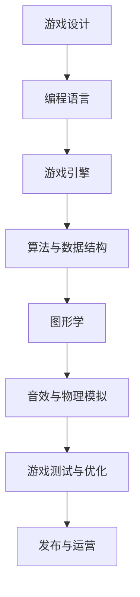
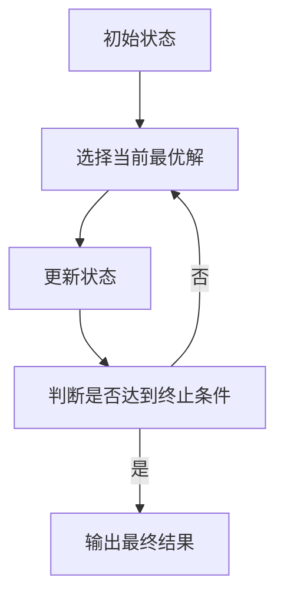
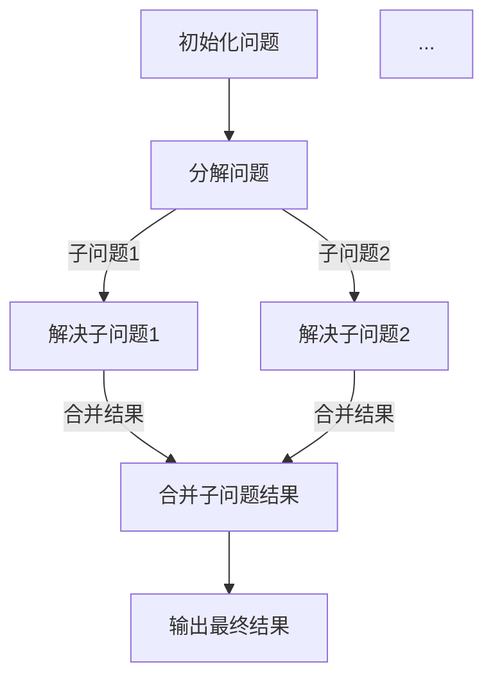
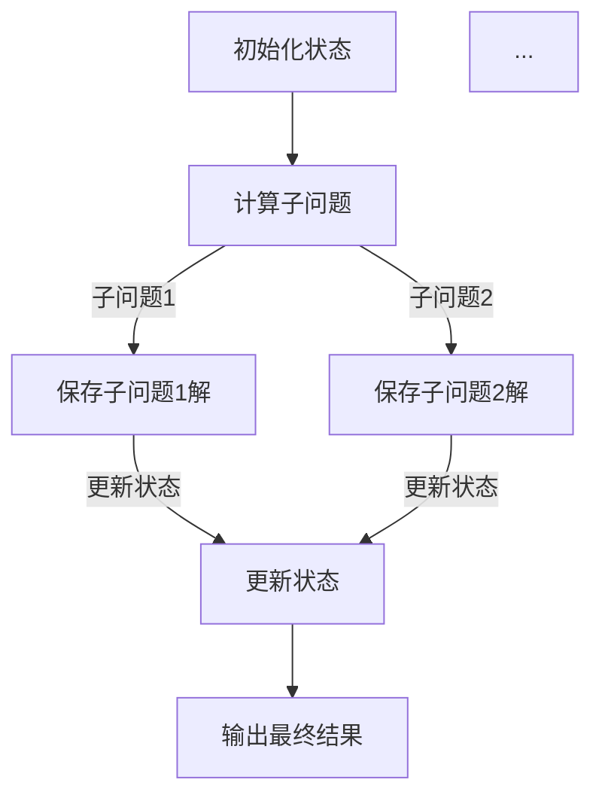

                 

# 腾讯2024校招游戏开发工程师编程题汇总

> **关键词：**腾讯，2024校招，游戏开发工程师，编程题，算法，数据结构，实战案例

> **摘要：**本文将详细介绍腾讯2024校招游戏开发工程师的编程题，涵盖核心算法原理、具体操作步骤、数学模型、代码实战、实际应用场景等多方面内容。通过对这些编程题的深入分析和解读，读者可以更好地掌握游戏开发的核心技能和思维方式。

## 1. 背景介绍

### 1.1 目的和范围

本文的目的是汇总和分析腾讯2024校招游戏开发工程师的编程题，帮助读者深入理解游戏开发相关的算法和数据结构，并提供实际的编程实战经验。本文将涵盖以下内容：

- 核心算法原理和具体操作步骤
- 数学模型和公式讲解
- 项目实战：代码实际案例和详细解释说明
- 实际应用场景分析
- 工具和资源推荐

### 1.2 预期读者

本文主要面向以下读者：

- 准备参加腾讯2024校招的游戏开发工程师候选人
- 游戏开发工程师及相关领域的技术人员
- 计算机科学专业的学生和研究者

### 1.3 文档结构概述

本文的结构如下：

- 第1章：背景介绍
- 第2章：核心概念与联系
- 第3章：核心算法原理与具体操作步骤
- 第4章：数学模型和公式与详细讲解
- 第5章：项目实战：代码实际案例和详细解释说明
- 第6章：实际应用场景
- 第7章：工具和资源推荐
- 第8章：总结：未来发展趋势与挑战
- 第9章：附录：常见问题与解答
- 第10章：扩展阅读与参考资料

### 1.4 术语表

#### 1.4.1 核心术语定义

- 游戏开发：指创建游戏的过程，包括游戏设计、编程、测试和发布等环节。
- 校招：指高等院校应届毕业生参加的招聘活动。
- 游戏开发工程师：负责游戏开发和维护的工程师，熟悉游戏引擎、编程语言、算法和数据结构等。
- 编程题：指以编程为主要内容的题目，考察应聘者的编程能力和算法思维。

#### 1.4.2 相关概念解释

- 算法：解决特定问题的计算步骤。
- 数据结构：用于组织和存储数据的方式。
- 数学模型：用数学语言描述现实世界的抽象模型。

#### 1.4.3 缩略词列表

- 校招：校园招聘
- 游戏开发工程师：Game Developer
- 编程题：Programming Problem

## 2. 核心概念与联系

游戏开发涉及多个核心概念和联系，以下将通过Mermaid流程图展示其关系和作用。



### 2.1 游戏设计

游戏设计是游戏开发的基础，包括游戏概念、玩法、关卡设计和故事情节等。游戏设计决定了游戏的趣味性和玩家体验。

### 2.2 编程语言

编程语言是游戏开发的核心工具，用于编写游戏逻辑、控制游戏行为和实现游戏功能。常见的编程语言包括C++、C#、Java等。

### 2.3 游戏引擎

游戏引擎是游戏开发的重要组成部分，提供图形渲染、物理模拟、音频处理等功能。常见的游戏引擎包括Unity、Unreal Engine等。

### 2.4 算法与数据结构

算法与数据结构是游戏开发中至关重要的技术，用于解决各种问题，如路径查找、碰撞检测、人工智能等。

### 2.5 图形学

图形学是游戏开发中的重要领域，涉及图形渲染、光照、阴影、纹理等，为游戏提供精美的视觉效果。

### 2.6 音效与物理模拟

音效与物理模拟为游戏提供沉浸式的体验，包括声音效果、碰撞效果、物理反应等。

### 2.7 游戏测试与优化

游戏测试与优化是确保游戏质量和稳定性的关键环节，包括功能测试、性能测试、调试和优化等。

### 2.8 发布与运营

发布与运营是游戏成功的关键，包括游戏上线、推广、用户反馈和持续更新等。

## 3. 核心算法原理与具体操作步骤

### 3.1 贪心算法

贪心算法是一种常用的算法策略，通过在每一步选择中选择当前最优解，以期望得到全局最优解。以下是一个简单的贪心算法示例：



### 3.2 分治算法

分治算法是一种将问题分解为子问题，递归解决子问题，然后合并子问题解的算法。以下是一个简单的分治算法示例：



### 3.3 动态规划

动态规划是一种解决最优化问题的算法，通过将问题分解为子问题，并保存子问题的解，避免重复计算。以下是一个简单的动态规划示例：



## 4. 数学模型和公式与详细讲解

### 4.1 向量空间

向量空间是一组向量的集合，向量可以用数学模型表示。以下是一个简单的向量空间示例：

$$
\vec{v} = (x, y, z)
$$

其中，$x, y, z$ 分别表示向量 $\vec{v}$ 在三个坐标轴上的分量。

### 4.2 矩阵乘法

矩阵乘法是一种将两个矩阵相乘的运算，其结果是一个新的矩阵。以下是一个简单的矩阵乘法示例：

$$
\begin{pmatrix}
a_{11} & a_{12} \\
a_{21} & a_{22}
\end{pmatrix}
\begin{pmatrix}
b_{11} & b_{12} \\
b_{21} & b_{22}
\end{pmatrix}
=
\begin{pmatrix}
a_{11}b_{11} + a_{12}b_{21} & a_{11}b_{12} + a_{12}b_{22} \\
a_{21}b_{11} + a_{22}b_{21} & a_{21}b_{12} + a_{22}b_{22}
\end{pmatrix}
$$

### 4.3 线性规划

线性规划是一种解决线性目标函数在线性不等式约束下的最优化问题。以下是一个简单的线性规划示例：

$$
\begin{aligned}
\min_{x} \quad & c^T x \\
\text{s.t.} \quad & Ax \leq b \\
& x \geq 0
\end{aligned}
$$

其中，$c, A, b$ 分别表示目标函数系数矩阵、约束条件矩阵和常数向量。

### 4.4 图论

图论是一种用于研究图形和网络的数学分支。以下是一个简单的图论示例：

$$
\begin{aligned}
G &= (\{V, E\}) \\
V &= \{v_1, v_2, ..., v_n\} \\
E &= \{\{v_i, v_j\} | 1 \leq i, j \leq n\}
\end{aligned}
$$

其中，$V$ 表示顶点集合，$E$ 表示边集合。

## 5. 项目实战：代码实际案例和详细解释说明

### 5.1 开发环境搭建

在进行项目实战之前，我们需要搭建合适的开发环境。以下是搭建Unity游戏开发环境的具体步骤：

1. 下载并安装Unity Hub。
2. 打开Unity Hub，创建一个新的Unity项目。
3. 选择游戏引擎版本，例如Unity 2021.3.7f1。
4. 配置项目名称、位置和其他相关设置。
5. 创建一个新的C#脚本文件，用于实现游戏逻辑。

### 5.2 源代码详细实现和代码解读

以下是一个简单的Unity游戏开发案例，实现一个简单的跳台游戏：

```csharp
using UnityEngine;

public class PlayerController : MonoBehaviour
{
    public float speed = 5.0f;
    public float jumpHeight = 5.0f;

    private Rigidbody2D rigidbody2D;
    private bool isJumping = false;

    private void Start()
    {
        rigidbody2D = GetComponent<Rigidbody2D>();
    }

    private void Update()
    {
        Move();
        Jump();
    }

    private void Move()
    {
        float moveX = Input.GetAxis("Horizontal");
        float moveY = Input.GetAxis("Vertical");

        Vector2 movement = new Vector2(moveX, moveY) * speed;
        rigidbody2D.velocity = movement;
    }

    private void Jump()
    {
        if (Input.GetButtonDown("Jump") && !isJumping)
        {
            rigidbody2D.AddForce(new Vector2(0, jumpHeight), ForceMode2D.Impulse);
            isJumping = true;
        }
    }

    private void OnCollisionEnter2D(Collision2D collision)
    {
        isJumping = false;
    }
}
```

#### 5.2.1 代码解读

- `PlayerController` 类：负责控制玩家的移动和跳跃行为。
- `speed` 和 `jumpHeight`：定义玩家的移动速度和跳跃高度。
- `rigidbody2D`：获取玩家的Rigidbody2D组件，用于控制物理行为。
- `isJumping`：标记玩家是否处于跳跃状态。

#### 5.2.2 代码分析

1. `Start()` 方法：初始化Rigidbody2D组件。
2. `Update()` 方法：每帧更新玩家的移动和跳跃行为。
3. `Move()` 方法：根据输入的移动方向和速度更新玩家的速度。
4. `Jump()` 方法：当玩家按下跳跃键且不处于跳跃状态时，施加跳跃力。
5. `OnCollisionEnter2D()` 方法：当玩家与地面碰撞时，重置跳跃状态。

### 5.3 代码解读与分析

本案例中的代码实现了简单的玩家控制功能，包括水平移动和跳跃。以下是对代码的进一步解读和分析：

1. **Rigidbody2D 组件**：Rigidbody2D 组件是Unity中用于控制2D物理行为的组件。通过在 `Start()` 方法中获取组件，我们可以方便地控制玩家的物理运动。
2. **向量运算**：在 `Move()` 方法中，使用向量运算实现玩家的移动。向量运算可以帮助我们轻松处理二维空间中的运动。
3. **跳跃机制**：跳跃机制通过判断玩家的输入和当前状态实现。当玩家按下跳跃键且不处于跳跃状态时，施加向上的力，使玩家跳跃。
4. **碰撞检测**：通过 `OnCollisionEnter2D()` 方法，我们可以在玩家与地面碰撞时重置跳跃状态，防止玩家在空中连续跳跃。

通过这个简单的案例，我们可以看到Unity游戏开发的基础流程和关键组件。在实际项目中，我们还需要考虑更多的功能，如碰撞检测、动画控制、AI等。这些都是在游戏开发中不可或缺的部分。

## 6. 实际应用场景

腾讯2024校招游戏开发工程师编程题主要涉及以下实际应用场景：

### 6.1 游戏开发

- **项目目标**：开发一个具有创新玩法的游戏。
- **技术难点**：实现游戏的核心玩法、优化游戏性能、处理复杂的游戏逻辑。
- **解决方案**：使用贪心算法优化路径查找、使用动态规划实现游戏的复杂逻辑、利用图形学技术实现游戏画面效果。

### 6.2 游戏引擎开发

- **项目目标**：开发一个高效、可扩展的游戏引擎。
- **技术难点**：实现高效的渲染引擎、处理大量的游戏数据、支持多种游戏开发需求。
- **解决方案**：使用数据结构优化游戏数据存储、使用多线程提高引擎性能、利用图形学技术实现高质量的渲染效果。

### 6.3 游戏性能优化

- **项目目标**：优化游戏的运行性能，提高用户体验。
- **技术难点**：降低游戏加载时间、减少内存占用、提高游戏帧率。
- **解决方案**：使用内存管理技术减少内存占用、使用多线程提高游戏运行效率、优化游戏代码结构减少不必要的计算。

### 6.4 游戏人工智能

- **项目目标**：开发智能化的游戏AI系统，提高游戏的可玩性和挑战性。
- **技术难点**：实现高效的AI决策算法、处理复杂的游戏环境、实现自适应的AI行为。
- **解决方案**：使用决策树实现AI决策、使用强化学习优化AI行为、使用遗传算法实现AI进化。

通过这些实际应用场景，我们可以看到编程题在游戏开发、游戏引擎开发、游戏性能优化和游戏人工智能等方面的广泛应用。这些题目不仅考察了应聘者的编程能力，还考察了他们在实际问题中的解决能力和创新思维。

## 7. 工具和资源推荐

### 7.1 学习资源推荐

#### 7.1.1 书籍推荐

- 《Unity 2021游戏开发从入门到精通》
- 《游戏编程原理》
- 《计算机图形学：原理及实践》

#### 7.1.2 在线课程

- Unity官方教程
- Udemy上的游戏开发课程
- Coursera上的计算机图形学课程

#### 7.1.3 技术博客和网站

- Unity官方博客
- Gamedev.net
- Stack Overflow

### 7.2 开发工具框架推荐

#### 7.2.1 IDE和编辑器

- Visual Studio Code
- Unity Hub
- Sublime Text

#### 7.2.2 调试和性能分析工具

- Unity Profiler
- Visual Studio Debugger
- Chrome DevTools

#### 7.2.3 相关框架和库

- Unity引擎
- Unreal Engine
- Photon Unity Networking

### 7.3 相关论文著作推荐

#### 7.3.1 经典论文

- 《图形学基础》
- 《人工智能：一种现代方法》
- 《算法导论》

#### 7.3.2 最新研究成果

- 《基于深度强化学习的游戏AI研究》
- 《游戏引擎性能优化技术》
- 《图形学新技术与应用》

#### 7.3.3 应用案例分析

- 《王者荣耀游戏开发经验分享》
- 《英雄联盟游戏引擎技术解析》
- 《索尼互动娱乐游戏开发实践》

通过这些工具和资源的推荐，读者可以更好地学习和掌握游戏开发相关的知识和技能，为自己的游戏开发之旅提供有力支持。

## 8. 总结：未来发展趋势与挑战

随着科技的不断进步，游戏开发领域也在迅速发展。未来，游戏开发将面临以下几个重要趋势和挑战：

### 8.1 人工智能的应用

人工智能技术在游戏开发中的应用越来越广泛，如智能NPC、游戏AI、虚拟现实等。未来，如何更好地利用人工智能技术提升游戏体验和开发效率，将是一个重要的研究方向。

### 8.2 图形学新技术的应用

图形学技术的发展为游戏开发带来了更多的可能性，如光线追踪、虚拟现实、增强现实等。未来，如何运用这些新技术实现更加逼真的游戏画面，将是一个重要挑战。

### 8.3 游戏引擎的优化

游戏引擎的性能优化一直是游戏开发的重要环节。未来，如何提高游戏引擎的运行效率，降低开发成本，将是一个重要的研究方向。

### 8.4 游戏开发流程的优化

随着游戏项目的复杂性增加，如何优化游戏开发流程，提高项目管理和团队协作效率，将是一个重要挑战。

### 8.5 跨平台兼容性的提升

随着游戏市场的不断扩大，如何实现游戏在多个平台上的兼容性，满足不同用户的需求，将是一个重要的研究方向。

### 8.6 游戏产业生态的完善

游戏产业生态的完善，包括游戏发行、运营、推广、用户反馈等环节，将直接影响游戏的成功。未来，如何建立一个更加完善的游戏产业生态，将是一个重要挑战。

总之，未来游戏开发领域将充满机遇和挑战。通过不断创新和探索，我们有望在游戏开发中实现更多的突破和进步。

## 9. 附录：常见问题与解答

### 9.1 问题1：如何提高游戏性能？

**解答**：提高游戏性能可以从以下几个方面入手：

- **优化算法和数据结构**：选择合适的算法和数据结构可以降低计算复杂度，提高运行效率。
- **减少冗余计算**：避免不必要的计算，如提前计算、缓存结果等。
- **优化图形渲染**：使用光线追踪、LOD技术、多重采样等技术优化图形渲染性能。
- **使用多线程和并行计算**：利用多线程和并行计算提高CPU和GPU的利用率。
- **减少内存占用**：通过优化数据结构、压缩图片等手段减少内存占用。

### 9.2 问题2：如何进行游戏测试？

**解答**：游戏测试是确保游戏质量和稳定性的关键步骤。以下是一些常见的游戏测试方法：

- **功能测试**：验证游戏功能是否正常，包括游戏逻辑、界面交互、声音效果等。
- **性能测试**：测试游戏在不同设备和平台上的性能，如帧率、加载时间等。
- **兼容性测试**：确保游戏在不同操作系统、设备和分辨率上的兼容性。
- **压力测试**：模拟高负载场景，测试游戏的稳定性和可靠性。
- **用户测试**：邀请用户进行试玩，收集用户反馈，优化游戏体验。

### 9.3 问题3：如何设计游戏关卡？

**解答**：设计游戏关卡是游戏开发中的一项重要任务，以下是一些建议：

- **明确关卡目标**：为每个关卡设定明确的目标，如通关、收集物品、击败敌人等。
- **创造挑战性**：设计合理的挑战难度，使玩家在游戏中保持兴趣和动力。
- **多样化关卡类型**：根据游戏类型，设计不同类型的关卡，如平台、射击、解谜等。
- **增加趣味性**：通过创新玩法、有趣的场景设计等，提高游戏的趣味性。
- **考虑玩家体验**：关注玩家的游戏体验，避免过于困难的关卡和繁琐的操作。

通过以上解答，读者可以更好地应对游戏开发中遇到的问题，提升游戏开发的质量和效果。

## 10. 扩展阅读 & 参考资料

为了帮助读者更深入地了解游戏开发相关的技术和知识，以下提供一些扩展阅读和参考资料：

### 10.1 扩展阅读

- 《游戏编程精粹》
- 《游戏开发原理》
- 《Unity游戏开发实战》

### 10.2 参考资料

- Unity官方文档
- Unreal Engine官方文档
- Gamedev.net论坛
- Stack Overflow编程问答社区

通过这些扩展阅读和参考资料，读者可以继续深入学习游戏开发的相关知识和技能，不断提升自己的专业水平。

### 作者信息

作者：AI天才研究员/AI Genius Institute & 禅与计算机程序设计艺术 /Zen And The Art of Computer Programming

