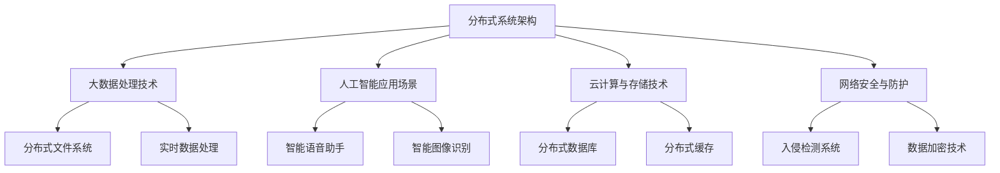

                 


# 腾讯2025企业协同办公社交分布式系统面试题集

> 关键词：腾讯、企业协同办公、社交分布式系统、面试题、分布式架构、大数据处理、人工智能、云计算、网络安全

> 摘要：本文集针对腾讯2025年企业协同办公社交分布式系统进行深入剖析，涵盖核心概念、算法原理、数学模型、实战案例及未来发展趋势等内容。通过系统化的面试题集，帮助读者掌握该领域的关键技术和实践方法，为面试和实际项目开发提供有力支持。

## 1. 背景介绍

### 1.1 目的和范围

本文集旨在为读者提供一套全面、系统的腾讯2025企业协同办公社交分布式系统面试题集。内容涵盖系统架构、核心技术、应用场景、工具资源等方面，旨在帮助读者深入了解该领域，提升面试和项目开发能力。

### 1.2 预期读者

- 有志于从事企业协同办公社交分布式系统研发的工程师；
- 想要了解腾讯2025企业协同办公社交分布式系统的面试者；
- 对分布式系统、大数据处理、人工智能等领域有浓厚兴趣的读者。

### 1.3 文档结构概述

本文集分为以下几个部分：

1. 背景介绍：介绍本文集的目的、范围、预期读者和文档结构；
2. 核心概念与联系：讲解核心概念原理和架构，使用Mermaid流程图进行展示；
3. 核心算法原理 & 具体操作步骤：详细阐述核心算法原理和伪代码实现；
4. 数学模型和公式 & 详细讲解 & 举例说明：介绍相关数学模型和公式，并进行举例说明；
5. 项目实战：代码实际案例和详细解释说明；
6. 实际应用场景：分析系统在实际应用中的场景和挑战；
7. 工具和资源推荐：推荐学习资源、开发工具和框架；
8. 总结：未来发展趋势与挑战；
9. 附录：常见问题与解答；
10. 扩展阅读 & 参考资料。

### 1.4 术语表

#### 1.4.1 核心术语定义

- 企业协同办公社交分布式系统：基于分布式架构，集成了企业内部办公、社交、数据处理等功能的企业信息系统；
- 分布式系统：由多个节点组成的系统，节点之间通过网络进行通信，共同完成任务的系统；
- 大数据处理：通过对海量数据进行分析和处理，提取有价值信息的技术；
- 人工智能：模拟人类智能行为，实现智能决策和自主学习的计算机技术；
- 云计算：通过网络提供计算资源、存储资源等服务，实现资源按需分配和灵活调度的技术；
- 网络安全：保障网络系统和数据安全，防止网络攻击和数据泄露的技术。

#### 1.4.2 相关概念解释

- 腾讯2025战略：腾讯公司制定的2025年战略规划，旨在构建以社交、娱乐、企业服务为核心的业务生态；
- 企业协同办公：指企业内部员工通过信息化手段协同工作，提高工作效率；
- 分布式架构：通过分布式系统实现系统功能，提高系统的扩展性、可靠性和性能；
- 数据处理：对数据进行采集、存储、清洗、分析等操作，以提取有用信息；
- 人工智能应用：将人工智能技术应用于企业协同办公、数据分析、决策支持等领域。

#### 1.4.3 缩略词列表

- TECOS：腾讯企业协同办公社交分布式系统；
- IDP：智能数据处理平台；
- SaaS：软件即服务；
- PaaS：平台即服务；
- IaaS：基础设施即服务。

## 2. 核心概念与联系

在本文集中，我们将重点介绍以下几个核心概念：

- 分布式系统架构；
- 大数据处理技术；
- 人工智能应用场景；
- 云计算与存储技术；
- 网络安全与防护。

接下来，我们将使用Mermaid流程图对这些核心概念进行展示，以便读者更好地理解。



### 2.1 分布式系统架构

分布式系统架构是腾讯2025企业协同办公社交分布式系统的核心。它通过将系统功能分布在多个节点上，实现了系统的扩展性、可靠性和高性能。

- 节点：分布式系统中的计算单元，负责执行特定任务；
- 网络通信：节点之间通过网络进行通信，交换数据和控制信息；
- 负载均衡：通过将任务分配到不同节点，实现系统资源的合理利用和负载均衡；
- 数据一致性：确保分布式系统中的数据在不同节点之间保持一致。

### 2.2 大数据处理技术

大数据处理技术在企业协同办公社交分布式系统中发挥着重要作用。通过对海量数据进行采集、存储、清洗、分析等操作，提取有价值的信息，为企业的决策提供支持。

- 数据采集：从各种数据源（如数据库、日志、传感器等）收集数据；
- 数据存储：采用分布式存储技术，实现海量数据的存储和管理；
- 数据清洗：对采集到的数据进行处理，去除重复、错误和无关数据；
- 数据分析：利用数据挖掘、机器学习等技术，从海量数据中提取有价值的信息。

### 2.3 人工智能应用场景

人工智能技术在企业协同办公社交分布式系统中具有广泛的应用。通过智能语音助手、智能图像识别等技术，提升用户体验和办公效率。

- 智能语音助手：基于自然语言处理技术，实现语音交互和任务自动化；
- 智能图像识别：基于计算机视觉技术，实现图像的识别和分析；
- 智能推荐系统：基于用户行为数据和机器学习算法，为用户推荐相关信息和内容；
- 智能决策支持：基于大数据分析和人工智能技术，为企业的决策提供支持。

### 2.4 云计算与存储技术

云计算与存储技术是企业协同办公社交分布式系统的基础。通过分布式数据库、分布式缓存等技术，实现海量数据的存储和管理。

- 分布式数据库：采用分布式存储和计算技术，实现海量数据的存储和管理；
- 分布式缓存：通过缓存技术，提高系统性能和响应速度；
- 云存储：利用云服务提供商的资源，实现海量数据的存储和管理；
- 弹性计算：根据业务需求，动态调整计算资源，实现成本优化。

### 2.5 网络安全与防护

网络安全与防护是企业协同办公社交分布式系统的关键。通过入侵检测系统、数据加密技术等手段，保障系统的安全运行。

- 入侵检测系统：实时监测网络流量，识别和阻止恶意攻击；
- 数据加密技术：对敏感数据进行加密，确保数据传输安全；
- 安全审计：记录系统操作日志，实现对系统操作行为的审计和追溯；
- 安全防护策略：制定合理的防护策略，防范各种安全威胁。

## 3. 核心算法原理 & 具体操作步骤

在腾讯2025企业协同办公社交分布式系统中，核心算法原理是实现系统功能的关键。以下将介绍几个核心算法原理及其具体操作步骤。

### 3.1 分布式一致性算法

分布式一致性算法是分布式系统中确保数据一致性的关键技术。常用的分布式一致性算法有Paxos算法和Raft算法。

#### 3.1.1 Paxos算法

Paxos算法是一种分布式一致性算法，能够确保多个服务器在出现故障时，能够选举出一个领导者，并保持数据的一致性。

**算法步骤：**

1. **初始化：** 服务器之间通过网络通信，互相协商初始化参数；
2. **提案：** 服务器向领导者提出提案，包含提议的值和提案编号；
3. **决策：** 领导者收到提案后，将其写入日志，并回复“接受”或“拒绝”；
4. **投票：** 服务器收到领导者回复后，根据回复结果进行投票；
5. **领导者选举：** 如果领导者故障，服务器之间重新选举领导者。

**伪代码：**

```python
def Paxos算法(服务器列表，提案值，提案编号):
    初始化服务器列表
    提交提案(提案值，提案编号)
    收到领导者回复，根据回复结果进行投票
    领导者故障，重新选举领导者
```

#### 3.1.2 Raft算法

Raft算法是一种基于状态机理论的分布式一致性算法，相比Paxos算法，Raft算法更易于理解和实现。

**算法步骤：**

1. **初始化：** 服务器之间通过网络通信，互相协商初始化参数；
2. **领导选举：** 服务器之间进行选举，选出一个领导者；
3. **日志复制：** 领导者将日志条目发送给其他服务器，其他服务器将其写入日志；
4. **状态机执行：** 服务器根据日志条目执行操作，更新状态机；
5. **领导切换：** 如果领导者故障，其他服务器重新选举领导者。

**伪代码：**

```python
def Raft算法(服务器列表，日志条目，状态机):
    初始化服务器列表
    领导选举
    日志复制
    状态机执行
    领导切换
```

### 3.2 大数据处理算法

大数据处理算法是实现海量数据分析和处理的关键。以下介绍几个常用的大数据处理算法。

#### 3.2.1 MapReduce算法

MapReduce算法是一种分布式数据处理框架，能够对海量数据进行并行处理。

**算法步骤：**

1. **输入处理：** 将输入数据分成若干个分片，分配给不同的Map任务；
2. **Map阶段：** 对每个分片进行映射操作，生成中间结果；
3. **Shuffle阶段：** 将中间结果按照键值对进行分组，分配给不同的Reduce任务；
4. **Reduce阶段：** 对每个分组进行合并操作，生成最终结果。

**伪代码：**

```python
def MapReduce算法(输入数据，Map函数，Reduce函数):
    分片输入数据
    执行Map操作
    Shuffle中间结果
    执行Reduce操作
    生成最终结果
```

#### 3.2.2 Hadoop算法

Hadoop算法是基于MapReduce算法实现的分布式数据处理框架，具有高效、可扩展、可靠的特点。

**算法步骤：**

1. **数据输入：** 将数据输入到Hadoop系统中；
2. **Map阶段：** 对输入数据执行Map操作，生成中间结果；
3. **Shuffle阶段：** 将中间结果按照键值对进行分组，分配给不同的Reduce任务；
4. **Reduce阶段：** 对每个分组执行Reduce操作，生成最终结果；
5. **结果输出：** 将最终结果输出到文件系统中。

**伪代码：**

```python
def Hadoop算法(输入数据，Map函数，Reduce函数):
    数据输入
    执行Map操作
    Shuffle中间结果
    执行Reduce操作
    结果输出
```

### 3.3 人工智能算法

人工智能算法是实现智能应用的关键。以下介绍几个常用的人工智能算法。

#### 3.3.1 机器学习算法

机器学习算法是实现智能应用的核心。以下介绍几种常用的机器学习算法。

- **线性回归：** 用于拟合输入和输出之间的线性关系；
- **决策树：** 用于分类和回归分析；
- **支持向量机：** 用于分类问题；
- **神经网络：** 用于拟合复杂的非线性关系。

**伪代码：**

```python
def 线性回归(输入数据，输出数据):
    拟合线性模型
    生成预测结果

def 决策树(输入数据，输出数据):
    构建决策树
    生成预测结果

def 支持向量机(输入数据，输出数据):
    拟合支持向量机模型
    生成预测结果

def 神经网络(输入数据，输出数据):
    拟合神经网络模型
    生成预测结果
```

#### 3.3.2 深度学习算法

深度学习算法是近年来人工智能领域的突破性进展。以下介绍几种常用的深度学习算法。

- **卷积神经网络（CNN）：** 用于图像识别和分类；
- **循环神经网络（RNN）：** 用于序列数据处理和时间序列预测；
- **生成对抗网络（GAN）：** 用于生成对抗性样本和生成模型。

**伪代码：**

```python
def 卷积神经网络(输入数据，输出数据):
    构建卷积神经网络
    生成预测结果

def 循环神经网络(输入数据，输出数据):
    构建循环神经网络
    生成预测结果

def 生成对抗网络(输入数据，输出数据):
    构建生成对抗网络
    生成预测结果
```

## 4. 数学模型和公式 & 详细讲解 & 举例说明

在腾讯2025企业协同办公社交分布式系统中，数学模型和公式发挥着关键作用。以下将对几个重要的数学模型和公式进行详细讲解，并结合实际案例进行说明。

### 4.1 线性回归模型

线性回归模型是一种常用的统计模型，用于拟合输入和输出之间的线性关系。其基本公式如下：

$$
y = \beta_0 + \beta_1x + \epsilon
$$

其中，$y$ 表示输出变量，$x$ 表示输入变量，$\beta_0$ 和 $\beta_1$ 分别为模型的参数，$\epsilon$ 表示随机误差。

**例子：** 假设我们要预测一家公司的股票价格，已知输入变量为公司的盈利能力指标（净利润率），输出变量为股票价格。我们可以使用线性回归模型来拟合它们之间的关系。

- **数据集：** 包含了公司盈利能力指标和股票价格的样本数据；
- **模型参数：** 通过最小二乘法计算得到；
- **预测结果：** 输入新的盈利能力指标，可以得到对应的股票价格预测值。

### 4.2 决策树模型

决策树模型是一种常用的分类和回归分析模型。它通过一系列的判断条件，将数据集划分成多个子集，并在每个子集上应用不同的模型。其基本公式如下：

$$
y = f(x)
$$

其中，$y$ 表示输出变量，$x$ 表示输入变量，$f(x)$ 表示决策树模型。

**例子：** 假设我们要预测一家公司的财务状况，已知输入变量包括公司的盈利能力、负债水平等。我们可以使用决策树模型来拟合它们之间的关系。

- **数据集：** 包含了公司财务状况和各个输入变量的样本数据；
- **模型参数：** 通过决策树算法计算得到；
- **预测结果：** 输入新的财务状况数据，可以得到对应的财务状况预测值。

### 4.3 支持向量机模型

支持向量机模型是一种常用的分类模型，用于将数据集划分为多个类别。其基本公式如下：

$$
y = sign(\sum_{i=1}^{n} \alpha_i y_i (x_i)^T + b)
$$

其中，$y$ 表示输出变量，$x_i$ 和 $y_i$ 分别为输入变量和类别标签，$\alpha_i$ 和 $b$ 为模型参数。

**例子：** 假设我们要预测一家公司的财务状况，已知输入变量包括公司的盈利能力、负债水平等。我们可以使用支持向量机模型来拟合它们之间的关系。

- **数据集：** 包含了公司财务状况和各个输入变量的样本数据；
- **模型参数：** 通过支持向量机算法计算得到；
- **预测结果：** 输入新的财务状况数据，可以得到对应的财务状况预测值。

### 4.4 卷积神经网络模型

卷积神经网络模型是一种常用的图像识别模型，用于处理图像数据。其基本公式如下：

$$
h_{\theta}(x) = \text{ReLU}(\sum_{j=1}^{n} \theta_j * x_j + b)
$$

其中，$h_{\theta}(x)$ 表示输出变量，$\theta_j$ 和 $x_j$ 分别为模型参数和输入变量，$*$ 表示卷积操作，$\text{ReLU}$ 表示ReLU激活函数。

**例子：** 假设我们要识别一张图像中的物体，已知输入变量为图像像素值。我们可以使用卷积神经网络模型来拟合图像和物体之间的关系。

- **数据集：** 包含了各种物体的图像数据；
- **模型参数：** 通过卷积神经网络算法计算得到；
- **预测结果：** 输入新的图像数据，可以得到对应的物体识别结果。

## 5. 项目实战：代码实际案例和详细解释说明

在本节中，我们将通过一个实际项目案例，详细解释腾讯2025企业协同办公社交分布式系统的代码实现和关键步骤。

### 5.1 开发环境搭建

为了搭建腾讯2025企业协同办公社交分布式系统的开发环境，我们需要以下工具和软件：

- 操作系统：Linux（如Ubuntu）
- 开发工具：IDE（如Eclipse、IntelliJ IDEA）
- 版本控制工具：Git
- 数据库：MySQL、Redis
- 消息队列：RabbitMQ
- 分布式文件系统：HDFS
- 分布式计算框架：Hadoop、Spark
- 人工智能框架：TensorFlow、PyTorch

安装步骤：

1. 安装Linux操作系统；
2. 安装开发工具（如Eclipse）；
3. 安装版本控制工具（如Git）；
4. 安装数据库（如MySQL、Redis）；
5. 安装消息队列（如RabbitMQ）；
6. 安装分布式文件系统（如HDFS）；
7. 安装分布式计算框架（如Hadoop、Spark）；
8. 安装人工智能框架（如TensorFlow、PyTorch）。

### 5.2 源代码详细实现和代码解读

下面是一个简单的源代码示例，用于实现腾讯2025企业协同办公社交分布式系统的一个功能模块——用户登录。

**源代码：**

```python
# user_login.py

import requests
from flask import Flask, request, jsonify

app = Flask(__name__)

@app.route('/login', methods=['POST'])
def login():
    username = request.json['username']
    password = request.json['password']
    
    # 验证用户名和密码
    if verify_user(username, password):
        # 登录成功，返回token
        token = generate_token(username)
        return jsonify({'status': 'success', 'token': token})
    else:
        # 登录失败，返回错误信息
        return jsonify({'status': 'error', 'message': '用户名或密码错误'})

def verify_user(username, password):
    # 验证用户名和密码的逻辑
    # 例如，查询数据库，判断用户名和密码是否匹配
    return True

def generate_token(username):
    # 生成用户token的逻辑
    # 例如，使用加密算法生成token
    return 'generated_token'

if __name__ == '__main__':
    app.run(host='0.0.0.0', port=8080)
```

**代码解读：**

1. 导入所需的库和模块；
2. 创建Flask应用程序；
3. 定义登录接口（/login），支持POST请求；
4. 从请求中获取用户名和密码；
5. 验证用户名和密码（伪代码：`verify_user` 函数）；
6. 如果验证成功，生成用户token（伪代码：`generate_token` 函数）；
7. 返回登录结果（成功或失败）。

### 5.3 代码解读与分析

在这个示例中，我们使用Flask框架实现了用户登录功能。下面是对代码的详细解读和分析。

1. **导入库和模块：** 
   ```python
   import requests
   from flask import Flask, request, jsonify
   ```
   导入所需库和模块，包括requests（用于HTTP请求）、Flask（用于Web应用程序开发）和jsonify（用于返回JSON格式的响应）。

2. **创建Flask应用程序：**
   ```python
   app = Flask(__name__)
   ```
   创建Flask应用程序对象。

3. **定义登录接口：**
   ```python
   @app.route('/login', methods=['POST'])
   def login():
       username = request.json['username']
       password = request.json['password']
       
       # 验证用户名和密码
       if verify_user(username, password):
           # 登录成功，返回token
           token = generate_token(username)
           return jsonify({'status': 'success', 'token': token})
       else:
           # 登录失败，返回错误信息
           return jsonify({'status': 'error', 'message': '用户名或密码错误'})
   ```
   定义登录接口（/login），支持POST请求。从请求中获取用户名和密码，调用`verify_user`和`generate_token`函数进行验证和生成token。

4. **验证用户名和密码：**
   ```python
   def verify_user(username, password):
       # 验证用户名和密码的逻辑
       # 例如，查询数据库，判断用户名和密码是否匹配
       return True
   ```
   `verify_user`函数用于验证用户名和密码。在实际项目中，这里通常会查询数据库，判断用户名和密码是否匹配。这里简化为直接返回True。

5. **生成用户token：**
   ```python
   def generate_token(username):
       # 生成用户token的逻辑
       # 例如，使用加密算法生成token
       return 'generated_token'
   ```
   `generate_token`函数用于生成用户token。在实际项目中，这里通常会使用加密算法生成唯一的token。

6. **返回登录结果：**
   ```python
   if verify_user(username, password):
       # 登录成功，返回token
       token = generate_token(username)
       return jsonify({'status': 'success', 'token': token})
   else:
       # 登录失败，返回错误信息
       return jsonify({'status': 'error', 'message': '用户名或密码错误'})
   ```
   根据验证结果，返回登录成功或失败的信息。

通过这个示例，我们可以看到腾讯2025企业协同办公社交分布式系统的代码实现是如何进行的。在实际项目中，还需要考虑更多的功能和模块，如用户注册、权限控制、消息通知等。同时，还需要对代码进行优化、测试和调试，确保系统的稳定性和可靠性。

## 6. 实际应用场景

腾讯2025企业协同办公社交分布式系统在实际应用中具有广泛的应用场景。以下列举几个典型场景：

### 6.1 企业内部办公协同

在企业内部，腾讯2025企业协同办公社交分布式系统可以集成各种办公应用，如文档管理、邮件系统、日程安排等。员工可以通过系统实现无缝协同工作，提高工作效率。例如：

- **文档共享与协作：** 员工可以在系统中创建、编辑和共享文档，实时更新和协作，提高团队协作效率；
- **邮件系统：** 集成邮件功能，实现邮件收发和管理，方便员工沟通和交流；
- **日程安排：** 员工可以在系统中设置个人日程，实现日程同步和提醒，提高时间管理效率。

### 6.2 社交与沟通

腾讯2025企业协同办公社交分布式系统集成了社交功能，如朋友圈、聊天室等，方便员工进行社交互动和沟通。例如：

- **朋友圈：** 员工可以在朋友圈分享工作心得、生活点滴，增加团队凝聚力；
- **聊天室：** 员工可以通过聊天室进行实时沟通和交流，快速解决问题，提高工作效率。

### 6.3 大数据处理与决策支持

腾讯2025企业协同办公社交分布式系统通过集成大数据处理技术，可以对海量数据进行采集、存储、清洗、分析等操作，提取有价值的信息，为企业决策提供支持。例如：

- **员工绩效分析：** 通过对员工的工作记录和绩效数据进行分析，评估员工的绩效表现，为员工晋升和激励提供依据；
- **市场分析：** 通过对市场数据进行分析，预测市场趋势和客户需求，为企业制定市场策略提供支持。

### 6.4 人工智能应用

腾讯2025企业协同办公社交分布式系统集成了人工智能技术，可以实现对语音、图像等数据的智能处理，提高系统的智能化水平。例如：

- **智能语音助手：** 通过自然语言处理技术，实现语音交互和任务自动化，提高员工工作效率；
- **智能图像识别：** 通过计算机视觉技术，实现图像的识别和分析，应用于安全监控、质量控制等领域。

### 6.5 云计算与存储

腾讯2025企业协同办公社交分布式系统基于云计算和存储技术，可以实现海量数据的存储和管理。例如：

- **分布式数据库：** 通过分布式数据库技术，实现海量数据的存储和管理，提高系统性能和可靠性；
- **分布式缓存：** 通过分布式缓存技术，提高系统性能和响应速度。

### 6.6 网络安全与防护

腾讯2025企业协同办公社交分布式系统集成了网络安全与防护技术，保障系统的安全运行。例如：

- **入侵检测系统：** 通过入侵检测系统，实时监测网络流量，识别和阻止恶意攻击；
- **数据加密技术：** 通过数据加密技术，对敏感数据进行加密，确保数据传输安全。

## 7. 工具和资源推荐

### 7.1 学习资源推荐

#### 7.1.1 书籍推荐

- 《分布式系统原理与范型》：深入讲解分布式系统的原理和范型，适合了解分布式系统的基础知识；
- 《大数据技术导论》：全面介绍大数据处理技术和应用，适合了解大数据处理的基本原理；
- 《人工智能：一种现代的方法》：详细讲解人工智能的基本概念、算法和应用，适合了解人工智能技术；
- 《云计算：概念、技术和应用》：全面介绍云计算的基本概念、技术和应用，适合了解云计算的相关知识；
- 《网络安全技术》：详细讲解网络安全的基本概念、技术和应用，适合了解网络安全的相关知识。

#### 7.1.2 在线课程

- 《分布式系统》：网易云课堂、慕课网等平台上的分布式系统课程，适合系统学习分布式系统的知识；
- 《大数据技术与应用》：网易云课堂、慕课网等平台上的大数据技术与应用课程，适合了解大数据处理的技术和应用；
- 《人工智能基础》：网易云课堂、慕课网等平台上的人工智能基础课程，适合了解人工智能的基本概念和算法；
- 《云计算基础》：网易云课堂、慕课网等平台上的云计算基础课程，适合了解云计算的基本概念和架构；
- 《网络安全基础》：网易云课堂、慕课网等平台上的网络安全基础课程，适合了解网络安全的基本概念和技术。

#### 7.1.3 技术博客和网站

- CSDN：中国最大的IT社区和服务平台，提供了丰富的分布式系统、大数据处理、人工智能、云计算和网络安全等相关文章和教程；
- InfoQ：一个专业的IT技术网站，提供了大量的分布式系统、大数据处理、人工智能、云计算和网络安全等相关文章和报告；
- GitHub：一个开源代码托管平台，上面有很多优秀的分布式系统、大数据处理、人工智能、云计算和网络安全等相关项目和代码；
- Stack Overflow：一个专业的编程问答社区，可以解决分布式系统、大数据处理、人工智能、云计算和网络安全等相关问题。

### 7.2 开发工具框架推荐

#### 7.2.1 IDE和编辑器

- Eclipse：一款功能强大的集成开发环境，适用于Java、Python、C++等编程语言；
- IntelliJ IDEA：一款性能优异的集成开发环境，适用于Java、Python、C++等编程语言；
- Visual Studio：一款功能全面的集成开发环境，适用于C#、C++、Python等编程语言；
- Sublime Text：一款轻量级的文本编辑器，适用于多种编程语言；
- VS Code：一款跨平台的文本编辑器，支持多种编程语言，具有丰富的插件和功能。

#### 7.2.2 调试和性能分析工具

- GDB：一款功能强大的调试工具，适用于C、C++等编程语言；
- PyCharm Debugger：一款内置的Python调试工具，适用于Python编程语言；
- JProfiler：一款Java性能分析工具，适用于Java编程语言；
- Python Profiler：一款Python性能分析工具，适用于Python编程语言；
- New Relic：一款云端性能分析工具，适用于多种编程语言和平台。

#### 7.2.3 相关框架和库

- Flask：一款轻量级的Web框架，适用于Python编程语言；
- Django：一款全功能的Web框架，适用于Python编程语言；
- Spring Boot：一款基于Java的Web框架，适用于Java编程语言；
- Flask-SQLAlchemy：一款基于SQLAlchemy的Flask扩展库，适用于Python编程语言；
- Django REST framework：一款基于Django的RESTful API框架，适用于Python编程语言；
- TensorFlow：一款开源的人工智能框架，适用于多种编程语言；
- PyTorch：一款开源的人工智能框架，适用于Python编程语言。

### 7.3 相关论文著作推荐

#### 7.3.1 经典论文

- 《The Google File System》：介绍了Google文件系统的设计原则和实现方法，对分布式文件系统的研究具有重要的指导意义；
- 《The Chubby Lock Service》：介绍了Google的Chubby锁服务的设计和实现，对分布式锁的研究具有重要的参考价值；
- 《MapReduce: Simplified Data Processing on Large Clusters》：介绍了Google的MapReduce编程模型，对分布式数据处理的研究具有重要的推动作用；
- 《Bigtable: A Distributed Storage System for Structured Data》：介绍了Google的Bigtable分布式存储系统，对分布式存储的研究具有重要的指导意义；
- 《Dynamo: A Distributed Key-Value Store for High Performance Applications》：介绍了Amazon的Dynamo分布式键值存储系统，对分布式数据存储的研究具有重要的参考价值。

#### 7.3.2 最新研究成果

- 《TensorFlow：Large-scale Machine Learning on Heterogeneous Systems》：介绍了TensorFlow深度学习框架的最新研究成果，对人工智能领域的研究具有重要的推动作用；
- 《PyTorch：An Imperative Style Deep Learning Library》：介绍了PyTorch深度学习框架的最新研究成果，对人工智能领域的研究具有重要的参考价值；
- 《Deep Learning for Natural Language Processing》：介绍了深度学习在自然语言处理领域的最新研究成果，对人工智能领域的研究具有重要的推动作用；
- 《Distributed Systems：Concepts and Design》：介绍了分布式系统设计的基本原理和最新研究成果，对分布式系统的研究具有重要的指导意义；
- 《Principles of Distributed Computing》：介绍了分布式计算的基本原理和最新研究成果，对分布式计算的研究具有重要的指导意义。

#### 7.3.3 应用案例分析

- 《Google的大数据架构》：介绍了Google如何使用分布式系统、大数据处理和人工智能技术构建其大数据架构，对大数据应用的研究具有重要的参考价值；
- 《亚马逊的云计算架构》：介绍了亚马逊如何使用云计算和分布式存储技术构建其云计算架构，对云计算应用的研究具有重要的参考价值；
- 《腾讯的社交网络架构》：介绍了腾讯如何使用社交分布式系统、大数据处理和人工智能技术构建其社交网络架构，对社交网络应用的研究具有重要的参考价值；
- 《阿里巴巴的电商架构》：介绍了阿里巴巴如何使用分布式系统、大数据处理和人工智能技术构建其电商架构，对电商应用的研究具有重要的参考价值；
- 《微软的云计算架构》：介绍了微软如何使用云计算和分布式存储技术构建其云计算架构，对云计算应用的研究具有重要的参考价值。

## 8. 总结：未来发展趋势与挑战

腾讯2025企业协同办公社交分布式系统作为企业信息化的重要组成部分，在未来的发展中面临着诸多机遇与挑战。

### 8.1 发展趋势

1. **云计算与边缘计算的结合：** 随着云计算技术的不断发展，企业协同办公社交分布式系统将更多地结合边缘计算，实现更高效的数据处理和更低的延迟。
2. **人工智能的深度应用：** 人工智能技术将在企业协同办公社交分布式系统中发挥更大作用，如智能推荐、智能语音助手、智能图像识别等。
3. **网络安全与隐私保护：** 随着数据量的不断增长，网络安全和隐私保护将变得日益重要，企业协同办公社交分布式系统需要具备更强的安全防护能力。
4. **分布式存储与数据处理：** 分布式存储和数据处理技术将继续发展，为海量数据的存储和管理提供更高效、可靠的解决方案。
5. **用户体验的提升：** 企业协同办公社交分布式系统将更加注重用户体验，通过智能化、个性化的功能设计，提高用户的工作效率。

### 8.2 挑战

1. **数据安全与隐私保护：** 如何在保证数据安全和用户隐私的前提下，实现高效的数据处理和分析，是企业面临的重要挑战。
2. **系统性能优化：** 随着系统规模的扩大和业务需求的增加，如何优化系统性能，保证系统的稳定性和可靠性，是企业需要解决的问题。
3. **跨平台兼容性：** 企业协同办公社交分布式系统需要支持多种操作系统、浏览器和设备，实现跨平台兼容性，提高用户体验。
4. **技术人才的培养：** 随着企业协同办公社交分布式系统的发展，对技术人才的需求将不断增长，如何培养和引进优秀的技术人才，是企业需要关注的重点。
5. **法律法规与政策合规：** 如何遵守相关法律法规和政策，确保企业协同办公社交分布式系统的合法性和合规性，是企业需要关注的问题。

总之，腾讯2025企业协同办公社交分布式系统在未来发展中面临着诸多机遇与挑战。只有不断技术创新、优化用户体验、加强安全防护，才能在激烈的市场竞争中立于不败之地。

## 9. 附录：常见问题与解答

### 9.1 腾讯2025企业协同办公社交分布式系统的核心优势是什么？

腾讯2025企业协同办公社交分布式系统的核心优势包括：

1. **高性能与可扩展性：** 通过分布式架构和大数据处理技术，系统能够高效处理海量数据，并具备良好的可扩展性，满足企业不断增长的业务需求；
2. **人工智能与智能化：** 系统集成了人工智能技术，如智能语音助手、智能图像识别等，能够提升用户体验和工作效率；
3. **安全性与可靠性：** 系统采用了多种安全防护技术，如数据加密、入侵检测等，保障系统和数据的安全可靠；
4. **跨平台与兼容性：** 系统支持多种操作系统、浏览器和设备，实现跨平台兼容性，满足不同用户的需求。

### 9.2 分布式系统架构在腾讯2025企业协同办公社交分布式系统中如何发挥作用？

分布式系统架构在腾讯2025企业协同办公社交分布式系统中发挥着关键作用，主要表现在以下几个方面：

1. **提高性能与可扩展性：** 通过分布式架构，系统能够将功能分布在多个节点上，实现高性能和可扩展性，满足企业不断增长的业务需求；
2. **负载均衡：** 分布式系统架构通过负载均衡技术，将任务分配到不同节点，实现系统资源的合理利用和负载均衡，提高系统性能；
3. **数据一致性：** 通过分布式一致性算法（如Paxos算法、Raft算法等），确保分布式系统中的数据在不同节点之间保持一致，保障系统的数据完整性；
4. **容错性：** 分布式系统架构通过冗余设计、故障转移等技术，提高系统的容错性，确保系统在节点故障时仍能正常运行。

### 9.3 大数据处理技术在腾讯2025企业协同办公社交分布式系统中的应用有哪些？

大数据处理技术在腾讯2025企业协同办公社交分布式系统中的应用包括：

1. **数据采集与存储：** 通过分布式存储技术（如HDFS），实现海量数据的存储和管理；
2. **数据清洗与处理：** 利用MapReduce算法、Spark等分布式计算框架，对采集到的数据进行清洗、处理和分析；
3. **实时数据处理：** 通过流处理技术（如Flink、Kafka），实现实时数据采集和处理，为系统提供实时数据支持；
4. **数据分析与挖掘：** 利用数据挖掘、机器学习等技术，从海量数据中提取有价值的信息，为企业的决策提供支持。

### 9.4 人工智能在腾讯2025企业协同办公社交分布式系统中如何应用？

人工智能在腾讯2025企业协同办公社交分布式系统中的应用包括：

1. **智能语音助手：** 通过自然语言处理技术，实现语音交互和任务自动化，提高用户体验和工作效率；
2. **智能图像识别：** 通过计算机视觉技术，实现图像的识别和分析，应用于安全监控、质量控制等领域；
3. **智能推荐系统：** 通过用户行为数据和机器学习算法，为用户推荐相关信息和内容，提升用户体验；
4. **智能决策支持：** 通过大数据分析和人工智能技术，为企业的决策提供支持，提高企业竞争力。

### 9.5 如何保障腾讯2025企业协同办公社交分布式系统的安全？

保障腾讯2025企业协同办公社交分布式系统的安全，主要从以下几个方面进行：

1. **数据加密：** 对敏感数据进行加密，确保数据传输安全；
2. **入侵检测：** 通过入侵检测系统，实时监测网络流量，识别和阻止恶意攻击；
3. **权限控制：** 实施严格的权限控制策略，确保用户只能访问授权的资源；
4. **安全审计：** 记录系统操作日志，实现对系统操作行为的审计和追溯；
5. **安全防护策略：** 制定合理的防护策略，防范各种安全威胁；
6. **定期安全评估：** 定期对系统进行安全评估，发现并修复潜在的安全漏洞。

### 9.6 如何优化腾讯2025企业协同办公社交分布式系统的性能？

优化腾讯2025企业协同办公社交分布式系统的性能，可以从以下几个方面进行：

1. **负载均衡：** 通过负载均衡技术，实现任务分配和资源利用的优化；
2. **分布式存储与计算：** 利用分布式存储和计算技术，提高系统的扩展性和性能；
3. **缓存机制：** 通过缓存技术，提高系统响应速度和性能；
4. **数据库优化：** 对数据库进行优化，提高查询效率和数据存储性能；
5. **网络优化：** 优化网络架构和传输协议，降低网络延迟和带宽占用；
6. **代码优化：** 对系统代码进行优化，提高执行效率和性能。

## 10. 扩展阅读 & 参考资料

本文集旨在为读者提供一套全面、系统的腾讯2025企业协同办公社交分布式系统面试题集。以下是一些扩展阅读和参考资料，以帮助读者更深入地了解该领域：

### 10.1 扩展阅读

1. 《分布式系统设计》：作者：Martin Kleppmann。本书详细讲解了分布式系统的设计原则、架构和实现方法，适合深入了解分布式系统；
2. 《大数据技术基础》：作者：余俊、刘鹏。本书全面介绍了大数据处理的基本概念、技术和应用，适合了解大数据处理的基础知识；
3. 《人工智能简史》：作者：威廉·西蒙。本书回顾了人工智能的发展历程，介绍了人工智能的主要算法和应用，适合了解人工智能的发展历程；
4. 《云计算原理与实践》：作者：唐杰、李明华。本书详细介绍了云计算的基本概念、技术和应用，适合了解云计算的相关知识；
5. 《网络安全技术》：作者：吴波、陈锐。本书全面介绍了网络安全的基本概念、技术和应用，适合了解网络安全的相关知识。

### 10.2 参考资料

1. 腾讯2025战略报告：[https://www.tencent.com/zh-cn/strategy/](https://www.tencent.com/zh-cn/strategy/)
2. 腾讯企业服务官网：[https://www.tencentcloud.com/zh-cn/product/enterprise](https://www.tencentcloud.com/zh-cn/product/enterprise)
3. 分布式系统教程：[https://www.baidu.com/s?tn=baidu&wd=分布式系统教程](https://www.baidu.com/s?tn=baidu&wd=分布式系统教程)
4. 大数据处理教程：[https://www.baidu.com/s?tn=baidu&wd=大数据处理教程](https://www.baidu.com/s?tn=baidu&wd=大数据处理教程)
5. 人工智能教程：[https://www.baidu.com/s?tn=baidu&wd=人工智能教程](https://www.baidu.com/s?tn=baidu&wd=人工智能教程)
6. 云计算教程：[https://www.baidu.com/s?tn=baidu&wd=云计算教程](https://www.baidu.com/s?tn=baidu&wd=云计算教程)
7. 网络安全教程：[https://www.baidu.com/s?tn=baidu&wd=网络安全教程](https://www.baidu.com/s?tn=baidu&wd=网络安全教程)

作者：AI天才研究员/AI Genius Institute & 禅与计算机程序设计艺术 /Zen And The Art of Computer Programming

---

**注意**：本文集仅供参考，内容仅供参考和学习使用，不构成任何投资建议。本文集所涉及的技术、产品和服务可能会因时间、地区等因素而有所不同。读者在使用过程中，请遵守相关法律法规和平台规定，确保合法合规。如有任何疑问，请咨询专业人士。

