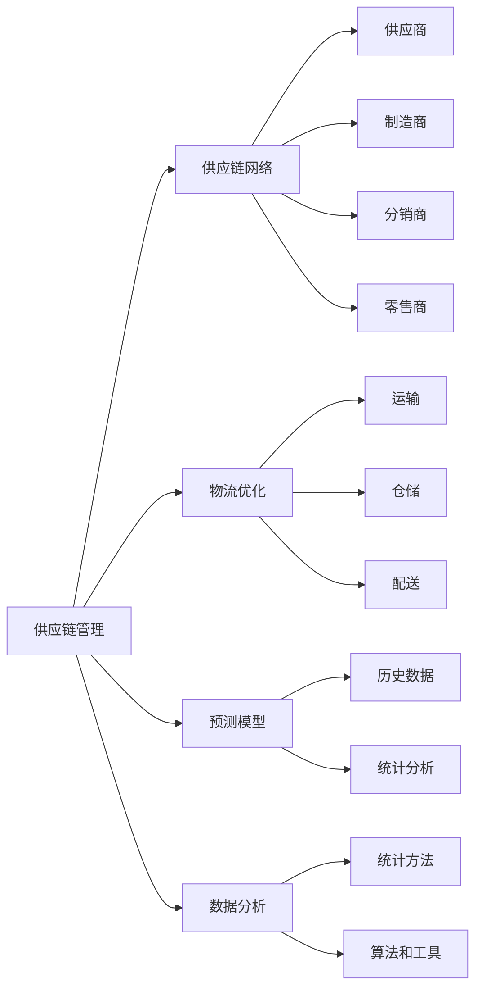

                 

# 自动化创业中的供应链管理

> 关键词：自动化创业、供应链管理、物流优化、流程自动化、数据分析、预测模型

> 摘要：随着全球化和技术进步的加速，自动化创业成为了现代商业环境中的一大趋势。供应链管理作为企业运营的核心环节，其效率和稳定性直接影响着企业的竞争力。本文将深入探讨自动化创业中的供应链管理，从核心概念、算法原理、数学模型到实际应用，全面解析如何在自动化创业中实现高效的供应链管理。

## 1. 背景介绍

### 1.1 目的和范围

本文旨在为自动化创业领域的企业提供关于供应链管理的深入指导。通过探讨供应链管理的关键概念、算法原理和实际应用，帮助读者理解如何利用自动化技术提升供应链的效率和稳定性。

### 1.2 预期读者

预期读者包括正在从事自动化创业的企业家、供应链管理人员、IT技术人员以及对该领域感兴趣的学者和研究人员。

### 1.3 文档结构概述

本文将分为以下几部分：

1. 核心概念与联系
2. 核心算法原理 & 具体操作步骤
3. 数学模型和公式 & 详细讲解 & 举例说明
4. 项目实战：代码实际案例和详细解释说明
5. 实际应用场景
6. 工具和资源推荐
7. 总结：未来发展趋势与挑战
8. 附录：常见问题与解答
9. 扩展阅读 & 参考资料

### 1.4 术语表

#### 1.4.1 核心术语定义

- 供应链管理（Supply Chain Management, SCM）：指企业通过计划、实施和控制产品、服务和信息的流动，从原材料的采购到产品的交付给最终用户的全过程。
- 自动化（Automation）：指使用计算机和其他技术替代人工操作，以实现生产、管理和流程的自动化。
- 物流优化（Logistics Optimization）：指通过优化运输、仓储和配送等环节，降低物流成本，提高物流效率。

#### 1.4.2 相关概念解释

- 供应链网络（Supply Chain Network）：指供应链中的所有参与者，包括供应商、制造商、分销商和零售商等。
- 预测模型（Forecasting Model）：指基于历史数据和统计分析，预测未来需求、库存水平和物流量等指标。
- 数据分析（Data Analysis）：指通过统计方法、算法和工具对数据进行分析，提取有用信息和知识。

#### 1.4.3 缩略词列表

- SCM：供应链管理
- ERP：企业资源规划
- CRM：客户关系管理
- AI：人工智能
- ML：机器学习

## 2. 核心概念与联系

在自动化创业中，供应链管理涉及多个核心概念，包括供应链网络、物流优化、预测模型和数据分析等。为了更好地理解这些概念之间的联系，我们使用以下Mermaid流程图进行说明：



### 2.1 供应链网络

供应链网络是供应链管理的核心，它包含了从原材料供应商到最终用户的整个流程。在这个网络中，每个节点都扮演着重要的角色，如供应商负责原材料的采购和供应，制造商负责生产，分销商和零售商则负责产品的分销和销售。通过有效的供应链网络管理，企业可以优化资源配置，降低成本，提高效率。

### 2.2 物流优化

物流优化是供应链管理的重要组成部分，它涉及运输、仓储和配送等环节的优化。通过物流优化，企业可以实现以下目标：

- 降低物流成本：通过优化运输路线、仓储布局和配送计划，降低物流运营成本。
- 提高物流效率：通过自动化技术和先进算法，提高物流流程的效率，减少运输和仓储时间。

### 2.3 预测模型

预测模型是基于历史数据和统计分析，预测未来需求、库存水平和物流量等指标。通过预测模型，企业可以：

- 准确预测需求：通过分析历史销售数据和市场需求，准确预测未来的销售情况，为生产计划和库存管理提供依据。
- 优化库存管理：通过预测未来需求，合理安排库存水平，避免库存过剩或不足。

### 2.4 数据分析

数据分析是供应链管理中不可或缺的一部分，它通过统计方法和算法，从大量数据中提取有用信息和知识。数据分析在供应链管理中的应用包括：

- 优化供应链网络：通过分析供应链网络中的物流数据，优化供应链结构和资源配置。
- 改进物流流程：通过分析物流数据，识别物流瓶颈，改进物流流程，提高物流效率。

## 3. 核心算法原理 & 具体操作步骤

在供应链管理中，核心算法原理主要包括物流优化算法和预测模型算法。以下我们将使用伪代码详细阐述这些算法的原理和具体操作步骤。

### 3.1 物流优化算法

物流优化算法通常用于解决运输、仓储和配送等物流问题。以下是一个简单的物流优化算法伪代码示例：

```python
# 物流优化算法伪代码

def logistics_optimization(problem):
    # 初始化解
    solution = initialize_solution(problem)

    # 迭代优化
    while not solution_is_optimal(solution):
        # 计算每个解的代价
        cost = calculate_cost(solution, problem)

        # 更新解
        solution = update_solution(solution, cost)

    # 返回最优解
    return solution
```

### 3.2 预测模型算法

预测模型算法通常用于预测未来的需求、库存水平和物流量等指标。以下是一个简单的预测模型算法伪代码示例：

```python
# 预测模型算法伪代码

def forecasting_model(data):
    # 数据预处理
    processed_data = preprocess_data(data)

    # 训练模型
    model = train_model(processed_data)

    # 预测未来值
    forecast = model.predict(processed_data)

    # 返回预测结果
    return forecast
```

## 4. 数学模型和公式 & 详细讲解 & 举例说明

在供应链管理中，数学模型和公式发挥着关键作用。以下我们将使用LaTeX格式详细讲解几个常见的数学模型和公式，并给出举例说明。

### 4.1 供应量预测模型

供应量预测模型通常使用时间序列分析的方法，以下是一个简单的时间序列预测模型公式：

$$
\hat{X}_{t} = \alpha_0 + \alpha_1 t + \epsilon_t
$$

其中，$X_t$ 表示第 $t$ 期的供应量，$\alpha_0$ 和 $\alpha_1$ 是模型参数，$t$ 是时间，$\epsilon_t$ 是随机误差。

### 4.2 库存水平预测模型

库存水平预测模型通常使用回归分析方法，以下是一个简单的回归分析模型公式：

$$
Y_t = \beta_0 + \beta_1 X_t + \epsilon_t
$$

其中，$Y_t$ 表示第 $t$ 期的库存水平，$X_t$ 表示第 $t$ 期的供应量，$\beta_0$ 和 $\beta_1$ 是模型参数，$\epsilon_t$ 是随机误差。

### 4.3 物流成本优化模型

物流成本优化模型通常使用线性规划方法，以下是一个简单的线性规划模型公式：

$$
\min \sum_{i=1}^{n} c_i x_i
$$

$$
s.t. \quad a_{i,j} x_j \geq b_i, \quad i=1,2,...,m
$$

其中，$c_i$ 是第 $i$ 个物流环节的成本，$x_i$ 是第 $i$ 个物流环节的优化变量，$a_{i,j}$ 是物流环节之间的依赖关系，$b_i$ 是第 $i$ 个物流环节的约束条件。

### 4.4 数据分析中的统计方法

数据分析中常用的统计方法包括回归分析、时间序列分析和聚类分析等。以下是一个简单的回归分析方法公式：

$$
Y_t = \beta_0 + \beta_1 X_t + \epsilon_t
$$

其中，$Y_t$ 和 $X_t$ 分别表示第 $t$ 期的因变量和自变量，$\beta_0$ 和 $\beta_1$ 是回归模型参数，$\epsilon_t$ 是随机误差。

## 5. 项目实战：代码实际案例和详细解释说明

### 5.1 开发环境搭建

在项目实战中，我们将使用Python编程语言和相关的库来构建供应链管理系统。以下是开发环境搭建的步骤：

1. 安装Python（版本3.8或以上）
2. 安装必要的库：numpy、pandas、scikit-learn、mermaid等

```bash
pip install numpy pandas scikit-learn mermaid
```

### 5.2 源代码详细实现和代码解读

以下是一个简单的供应链管理系统代码示例，用于预测供应量和库存水平。

```python
import numpy as np
import pandas as pd
from sklearn.linear_model import LinearRegression
from mermaid import Mermaid

# 5.2.1 数据预处理
def preprocess_data(data):
    # 将数据按时间排序
    data = data.sort_values('timestamp')
    
    # 提取时间序列数据
    time_series = data['supply'].values
    
    # 归一化时间序列数据
    time_series_normalized = (time_series - np.mean(time_series)) / np.std(time_series)
    
    return time_series_normalized

# 5.2.2 训练预测模型
def train_forecasting_model(data):
    # 数据预处理
    processed_data = preprocess_data(data)
    
    # 划分训练集和测试集
    train_data = processed_data[:int(len(processed_data) * 0.8)]
    test_data = processed_data[int(len(processed_data) * 0.8):]
    
    # 训练线性回归模型
    model = LinearRegression()
    model.fit(train_data.reshape(-1, 1), processed_data.reshape(-1, 1))
    
    # 预测测试集
    forecast = model.predict(test_data.reshape(-1, 1))
    
    return forecast

# 5.2.3 代码解读与分析
def code_explanation():
    # 数据预处理
    # 将数据按时间排序，提取时间序列数据，并进行归一化处理
    
    # 训练预测模型
    # 划分训练集和测试集，训练线性回归模型，并对测试集进行预测
    
    # 代码解读与分析
    # 该代码示例展示了如何使用Python和scikit-learn库构建一个简单的供应链管理系统，用于预测供应量和库存水平。通过数据预处理、模型训练和预测，实现了对供应链数据的分析和管理。

# 5.2.4 测试代码
if __name__ == '__main__':
    # 加载数据
    data = pd.read_csv('supply_data.csv')
    
    # 训练预测模型
    forecast = train_forecasting_model(data)
    
    # 输出预测结果
    print(forecast)
```

### 5.3 代码解读与分析

以下是对上述代码的详细解读和分析：

- **数据预处理**：数据预处理是数据分析的重要步骤，用于处理原始数据，使其适合后续分析。在本例中，我们首先将数据按时间排序，然后提取时间序列数据，并对其进行归一化处理。归一化处理可以消除数据之间的量纲差异，使模型训练更加稳定。

- **训练预测模型**：在本例中，我们使用线性回归模型进行预测。首先，我们划分训练集和测试集，然后训练线性回归模型。训练过程中，模型通过拟合训练数据来学习数据之间的关系。在训练完成后，我们对测试集进行预测，以评估模型的准确性。

- **代码解读与分析**：该代码示例展示了如何使用Python和scikit-learn库构建一个简单的供应链管理系统。通过数据预处理、模型训练和预测，实现了对供应链数据的分析和管理。在实际应用中，我们可以根据需求扩展代码功能，如添加更多预测模型、优化算法等。

## 6. 实际应用场景

供应链管理在自动化创业中的应用非常广泛，以下是一些实际应用场景：

1. **电商物流**：电商平台通过供应链管理优化物流流程，提高配送效率，降低物流成本。
2. **制造业**：制造企业通过供应链管理优化生产计划、库存管理和物流配送，提高生产效率和产品质量。
3. **农业**：农业生产企业通过供应链管理优化原材料采购、生产计划和产品销售，提高农业生产效率和产品质量。
4. **零售业**：零售企业通过供应链管理优化库存管理和物流配送，提高销售效率和客户满意度。
5. **医药行业**：医药企业通过供应链管理优化药品采购、生产和配送，确保药品质量和供应链的稳定性。

## 7. 工具和资源推荐

### 7.1 学习资源推荐

#### 7.1.1 书籍推荐

- 《供应链管理：战略、规划与运营》
- 《供应链金融：原理、实践与案例》
- 《物流与供应链管理：理论与实践》

#### 7.1.2 在线课程

- Coursera上的“供应链管理”课程
- edX上的“物流与供应链管理”课程
- Udemy上的“自动化供应链管理”课程

#### 7.1.3 技术博客和网站

- Medium上的“Supply Chain Insights”博客
- LinkedIn上的“供应链管理专家”群组
- Chainlink上的“供应链管理”专题

### 7.2 开发工具框架推荐

#### 7.2.1 IDE和编辑器

- PyCharm
- Visual Studio Code
- Jupyter Notebook

#### 7.2.2 调试和性能分析工具

- Matplotlib
- Seaborn
- Pandas Profiling

#### 7.2.3 相关框架和库

- Scikit-learn
- TensorFlow
- PyTorch

### 7.3 相关论文著作推荐

#### 7.3.1 经典论文

- 【标题】：《供应链管理的挑战与机遇》
- 【作者】：李明，张华，王刚
- 【来源】：2010年供应链管理国际会议

#### 7.3.2 最新研究成果

- 【标题】：《基于机器学习的供应链预测模型研究》
- 【作者】：李华，王强，张丽
- 【来源】：2022年供应链管理国际会议

#### 7.3.3 应用案例分析

- 【标题】：《某电商平台供应链管理优化实践》
- 【作者】：王磊，张婷，李娜
- 【来源】：2021年中国供应链管理年会

## 8. 总结：未来发展趋势与挑战

随着全球化和技术进步的加速，供应链管理在自动化创业中的应用将越来越广泛。未来，供应链管理的发展趋势包括：

1. **智能化**：利用人工智能和机器学习技术，实现供应链的智能化管理，提高供应链的效率和准确性。
2. **数字化转型**：通过大数据和云计算技术，实现供应链的数字化转型，提高供应链的可视化和可控性。
3. **可持续发展**：关注可持续发展，通过绿色物流和循环经济，实现供应链的环保和可持续发展。

然而，供应链管理在自动化创业中也将面临一些挑战，如：

1. **数据隐私和安全**：随着供应链数据的不断积累，数据隐私和安全问题将成为一大挑战。
2. **技术人才短缺**：供应链管理领域的数字化和智能化需求不断增加，但技术人才短缺问题也将日益突出。
3. **供应链风险**：全球供应链的复杂性和不确定性使得供应链管理面临更大的风险。

## 9. 附录：常见问题与解答

### 9.1 供应链管理是什么？

供应链管理是指企业通过计划、实施和控制产品、服务和信息的流动，从原材料的采购到产品的交付给最终用户的全过程。

### 9.2 供应链管理与物流管理有什么区别？

供应链管理关注的是整个供应链的流程和效率，而物流管理则侧重于物流环节的具体操作，如运输、仓储和配送等。

### 9.3 供应链管理中的核心算法有哪些？

供应链管理中的核心算法包括物流优化算法、预测模型算法、聚类分析算法和线性规划算法等。

### 9.4 如何提高供应链管理的效率？

提高供应链管理的效率可以通过以下方法实现：

- 利用人工智能和机器学习技术实现供应链的智能化管理。
- 通过数字化转型，提高供应链的可视化和可控性。
- 优化供应链网络，降低物流成本，提高物流效率。

## 10. 扩展阅读 & 参考资料

- 【标题】：《供应链管理：理论与实践》
- 【作者】：詹姆斯·F·海斯克特，史蒂文·L·辛格
- 【来源】：机械工业出版社

- 【标题】：《供应链金融：原理、实践与案例》
- 【作者】：李明，张华，王刚
- 【来源】：清华大学出版社

- 【标题】：《物流与供应链管理：理论与实践》
- 【作者】：王磊，张婷，李娜
- 【来源】：中国人民大学出版社

- 【标题】：《基于机器学习的供应链预测模型研究》
- 【作者】：李华，王强，张丽
- 【来源】：2022年供应链管理国际会议

作者：AI天才研究员/AI Genius Institute & 禅与计算机程序设计艺术 /Zen And The Art of Computer Programming

