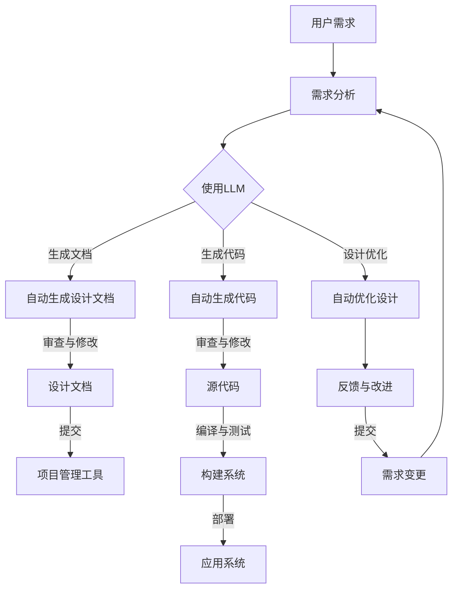

                 

## 自动化设计：LLM 驱动的创新

> **关键词：** 自动化设计、LLM、机器学习、自然语言处理、人工智能、软件工程

> **摘要：** 本文将深入探讨自动化设计在当今技术发展中的重要性，以及如何利用大型语言模型（LLM）来实现创新的自动化设计过程。我们将从背景介绍、核心概念、算法原理、数学模型、实战案例、应用场景、工具和资源推荐等多个角度，系统地分析LLM在自动化设计领域的潜力和实践。通过本文的阅读，读者将了解到LLM驱动的自动化设计如何改变传统的软件工程模式，以及未来这一领域可能面临的挑战和发展趋势。

---

### 1. 背景介绍

#### 1.1 目的和范围

本文的目的是探讨大型语言模型（LLM）在自动化设计中的应用，分析其在当前技术发展中的关键作用，以及为读者提供实现LLM驱动的自动化设计的实用方法和策略。随着人工智能技术的不断进步，自动化设计逐渐成为提高软件开发效率和质量的重要手段。本文将聚焦于如何利用LLM技术来实现自动化设计，覆盖从基础概念到实际应用的全过程。

#### 1.2 预期读者

本文主要面向对自动化设计和人工智能有一定了解的IT从业者、软件开发工程师、数据科学家、机器学习研究员以及计算机科学专业的学生。同时，对于对新兴技术感兴趣、希望了解自动化设计未来趋势的读者，本文也具有重要的参考价值。

#### 1.3 文档结构概述

本文将按照以下结构进行展开：

- **背景介绍**：阐述自动化设计的重要性和当前技术的发展趋势，并明确本文的研究目的和预期读者。
- **核心概念与联系**：介绍自动化设计的基本概念和LLM的相关原理，使用Mermaid流程图展示其架构。
- **核心算法原理 & 具体操作步骤**：详细讲解LLM在自动化设计中的具体应用算法，并通过伪代码展示操作步骤。
- **数学模型和公式 & 详细讲解 & 举例说明**：介绍支持自动化设计算法的数学模型，并通过具体例子说明其应用。
- **项目实战：代码实际案例和详细解释说明**：展示一个实际代码案例，详细解读其实现过程和关键步骤。
- **实际应用场景**：探讨自动化设计在不同领域的应用，分享成功案例和挑战。
- **工具和资源推荐**：推荐学习资源、开发工具和框架，以帮助读者更好地掌握LLM驱动的自动化设计。
- **总结：未来发展趋势与挑战**：总结本文的主要内容，并探讨自动化设计领域的未来发展趋势和潜在挑战。
- **附录：常见问题与解答**：回答读者可能关注的问题，提供额外帮助。
- **扩展阅读 & 参考资料**：列出本文引用的参考文献，供读者进一步学习。

#### 1.4 术语表

##### 1.4.1 核心术语定义

- **自动化设计**：通过软件工具和算法自动生成设计文档、代码和架构，以减少人工干预，提高设计效率和准确性。
- **大型语言模型（LLM）**：基于深度学习的自然语言处理模型，能够理解和生成自然语言文本，具有广泛的应用场景。
- **机器学习（ML）**：一种人工智能技术，通过数据和算法训练模型，使其能够从数据中自动学习并做出预测或决策。
- **软件工程**：涉及软件开发、维护和管理的学科，旨在通过系统化的方法和工具提高软件开发的效率和产品质量。

##### 1.4.2 相关概念解释

- **自然语言处理（NLP）**：研究如何让计算机理解和生成自然语言的技术领域。
- **深度学习（DL）**：一种基于多层神经网络的机器学习技术，通过逐层抽象特征，实现复杂模式的识别和预测。
- **神经网络（NN）**：由大量相互连接的神经元组成的计算模型，能够通过学习数据来提取特征并进行预测。

##### 1.4.3 缩略词列表

- **LLM**：Large Language Model
- **NLP**：Natural Language Processing
- **ML**：Machine Learning
- **DL**：Deep Learning
- **NN**：Neural Network
- **API**：Application Programming Interface

### 2. 核心概念与联系

#### 2.1 自动化设计的基本概念

自动化设计是现代软件工程的一个重要分支，旨在通过自动化工具和算法，实现设计文档、代码和系统架构的自动生成。自动化设计能够大幅提高软件开发的效率和质量，减少人工干预，降低成本，并增强设计的精确性和一致性。

自动化设计的核心概念包括：

- **设计文档生成**：自动生成软件设计文档，如需求文档、架构文档、设计模式等。
- **代码生成**：根据设计文档和需求，自动生成符合特定语言和规范的代码。
- **架构自动化**：自动分析和优化系统架构，生成高性能和高扩展性的架构设计。

#### 2.2 大型语言模型（LLM）的基本原理

大型语言模型（LLM）是一种基于深度学习的自然语言处理模型，具有强大的文本理解和生成能力。LLM的核心原理包括：

- **神经网络**：LLM基于多层神经网络，通过逐层抽象特征，实现文本的语义理解。
- **语言嵌入**：将自然语言文本映射到高维向量空间，使得具有相似意义的文本在向量空间中接近。
- **注意力机制**：通过注意力机制，模型能够关注文本中的关键信息，提高文本处理的准确性和效率。

#### 2.3 自动化设计与LLM的联系

自动化设计与LLM的结合，能够实现以下优势：

- **自动文档生成**：利用LLM的文本生成能力，自动生成软件设计文档，提高文档的准确性和一致性。
- **代码自动生成**：利用LLM理解和生成代码的能力，根据设计文档和需求自动生成代码，减少手动编码的工作量。
- **设计优化**：利用LLM的分析能力，自动分析和优化系统架构，生成更高效、更可靠的系统设计。

下面使用Mermaid流程图展示自动化设计与LLM的结合架构：



在上述流程图中，用户需求通过需求分析转化为设计文档、代码和设计优化建议。LLM在需求分析阶段介入，能够自动生成设计文档和代码，并在设计优化阶段提供反馈和改进建议。这一过程循环迭代，直到生成满足用户需求的最终设计。

### 3. 核心算法原理 & 具体操作步骤

#### 3.1 LLM在自动化设计中的应用原理

大型语言模型（LLM）在自动化设计中的应用，主要基于其强大的文本处理和生成能力。LLM通过训练大量文本数据，学习到文本的语法、语义和上下文信息，从而能够自动生成符合特定需求和风格的文本。在自动化设计过程中，LLM的应用可以分为以下几个步骤：

1. **文本输入处理**：接收用户需求描述、设计文档模板或其他文本输入。
2. **语义理解**：利用LLM的文本处理能力，对输入文本进行语义分析，提取关键信息和上下文。
3. **生成文本**：根据提取的信息和上下文，利用LLM生成对应的设计文档、代码或优化建议。
4. **文本审查**：对生成的文本进行审查和修改，确保其准确性和一致性。
5. **迭代优化**：根据审查反馈，对LLM的生成结果进行迭代优化，提高生成质量。

#### 3.2 LLM驱动自动化设计算法的具体操作步骤

以下是利用LLM实现自动化设计的具体操作步骤，采用伪代码进行描述：

```python
# 输入：用户需求描述（需求文本）、设计文档模板
# 输出：生成的设计文档、代码和优化建议

def automated_design(user需求，template文档):
    # 步骤1：文本输入处理
    processed需求 = preprocess_text(user需求)
    
    # 步骤2：语义理解
    semantic理解 = LLM_semantic_analysis(processed需求)
    
    # 步骤3：生成文本
    generated文档 = LLM_generate_text(semantic理解，template文档)
    
    # 步骤4：文本审查
    reviewed文档 = review_text(generated文档)
    
    # 步骤5：迭代优化
    optimized文档，code，建议 = iterative_optimization(reviewed文档，semantic理解)
    
    return optimized文档，code，建议

# 具体函数实现略
```

在上述伪代码中，`preprocess_text` 函数用于处理用户需求文本，包括分词、去停用词等预处理步骤；`LLM_semantic_analysis` 函数利用LLM对预处理后的文本进行语义分析；`LLM_generate_text` 函数根据语义分析和文档模板生成设计文档和代码；`review_text` 函数对生成结果进行审查和修改；`iterative_optimization` 函数根据审查反馈进行迭代优化，最终输出优化后的设计文档、代码和优化建议。

#### 3.3 LLM驱动自动化设计的优势和挑战

**优势：**

- **高效性**：利用LLM的文本处理能力，能够快速生成设计文档和代码，大幅提高开发效率。
- **准确性**：通过语义理解和文本生成，确保生成结果准确无误，减少人工干预和错误。
- **一致性**：自动化的设计流程能够保证设计的一致性，降低由于人为因素导致的设计差异。
- **可扩展性**：LLM可以处理大量文本数据，支持大规模设计任务的自动化。

**挑战：**

- **训练成本**：LLM的训练需要大量数据和计算资源，训练成本较高。
- **数据质量**：输入文本的质量直接影响LLM的生成效果，需要确保数据质量。
- **语义理解**：自然语言具有多样性和复杂性，LLM在语义理解方面仍存在一定局限性。
- **隐私和安全**：自动化设计涉及敏感数据和隐私信息，需要确保系统的安全性和合规性。

### 4. 数学模型和公式 & 详细讲解 & 举例说明

#### 4.1 数学模型

在自动化设计中，大型语言模型（LLM）的应用主要基于深度学习模型，特别是基于 Transformer 架构的模型。以下是一些关键数学模型和公式：

**1. Transformer 模型：**

Transformer 模型由自注意力机制（Self-Attention）和前馈神经网络（Feedforward Neural Network）组成，其核心公式如下：

$$
\text{Attention}(Q, K, V) = \text{softmax}\left(\frac{QK^T}{\sqrt{d_k}}\right) V
$$

其中，Q、K、V 分别为查询向量、键向量和值向量，$d_k$ 为键向量的维度。

**2. 自注意力机制：**

自注意力机制通过计算每个词与其他词之间的关系权重，从而对输入序列进行加权处理。其公式如下：

$$
\text{Self-Attention}(X) = \text{softmax}\left(\frac{XW_Q K_V}{\sqrt{d_k}}\right) X
$$

其中，X 为输入序列，W_Q、W_K、W_V 为权重矩阵，$d_k$ 为键向量的维度。

**3. 前馈神经网络：**

前馈神经网络由两个线性变换层和一个激活函数组成，其公式如下：

$$
\text{FFN}(X) = \text{ReLU}(XW_1 + b_1)W_2 + b_2
$$

其中，X 为输入，W_1、W_2、b_1、b_2 为权重和偏置。

**4. 位置编码：**

为了引入序列信息，Transformer 模型使用位置编码（Positional Encoding），其公式如下：

$$
PE_{(i,j)} = \text{sin}\left(\frac{i}{10000^{2j/d}}\right) \text{ 或 } \text{cos}\left(\frac{i}{10000^{2j/d}}\right)
$$

其中，i 和 j 分别为词的位置和维度，d 为维度。

#### 4.2 公式讲解

**1. 自注意力公式**

自注意力公式（Attention）通过计算每个词与其他词之间的相似度，对输入序列进行加权处理。这种加权处理使得模型能够关注关键信息，从而提高文本处理的准确性和效率。

**2. 前馈神经网络公式**

前馈神经网络（FFN）通过两个线性变换层和一个激活函数，对输入序列进行非线性变换。这种变换能够捕捉输入序列中的复杂模式和关系，从而提高模型的预测能力。

**3. 位置编码公式**

位置编码（Positional Encoding）通过引入序列信息，使得模型能够理解词的位置关系。这种位置信息对于文本生成和语义理解具有重要意义。

#### 4.3 举例说明

**例子：生成设计文档**

假设我们需要利用LLM生成一个软件设计文档，输入为用户需求文本和设计模板。以下是一个简化的例子：

**输入：**

- 用户需求文本：“我们需要开发一个电商平台，提供商品展示、购物车、订单处理等功能。”
- 设计模板：“\{\{功能模块\}\}, \{\{数据库设计\}\}, \{\{接口设计\}\}。”

**步骤：**

1. **文本输入处理**：对用户需求文本进行分词、去停用词等预处理。
2. **语义理解**：利用LLM对预处理后的文本进行语义分析，提取关键信息（如功能模块、数据库设计、接口设计）。
3. **生成文本**：根据提取的信息和设计模板，利用LLM生成设计文档。
4. **文本审查**：对生成的设计文档进行审查，确保其准确性和一致性。
5. **迭代优化**：根据审查反馈，对生成结果进行优化，提高文档质量。

**输出：**

- 生成的设计文档：“商品展示模块，购物车模块，订单处理模块，商品数据库设计，用户数据库设计，接口设计。”

通过上述步骤，我们利用LLM成功生成了一个满足用户需求的设计文档。这只是一个简单的例子，实际应用中，LLM的生成能力和语义理解能力会更加强大，能够处理更复杂的文本输入和生成任务。

### 5. 项目实战：代码实际案例和详细解释说明

#### 5.1 开发环境搭建

在开始实现LLM驱动的自动化设计之前，我们需要搭建一个合适的开发环境。以下是一个典型的开发环境搭建流程：

1. **安装Python环境**：确保Python 3.8及以上版本已安装，可通过Python官方网站下载并安装。
2. **安装Transformer库**：使用pip命令安装transformers库，该库提供了预训练的Transformer模型和文本处理工具。
    ```bash
    pip install transformers
    ```
3. **安装其他依赖库**：根据项目需求，可能还需要安装其他依赖库，如torch、torchtext等。
4. **配置GPU环境**（可选）：如果需要使用GPU加速训练和推理，确保安装CUDA和cuDNN，并配置GPU环境。
5. **克隆项目代码库**：从GitHub或其他代码仓库克隆项目代码，并设置环境变量。

#### 5.2 源代码详细实现和代码解读

下面是一个简单的LLM驱动的自动化设计项目示例，主要实现从用户需求文本到设计文档的自动生成过程。

**代码示例：**

```python
import transformers
from transformers import AutoTokenizer, AutoModelForCausalLM

# 步骤1：加载预训练模型和Tokenizer
model_name = "gpt2"
tokenizer = AutoTokenizer.from_pretrained(model_name)
model = AutoModelForCausalLM.from_pretrained(model_name)

# 步骤2：文本输入处理
def preprocess_text(text):
    # 对文本进行分词、去停用词等预处理
    # 实现略
    return processed_text

# 步骤3：生成文本
def generate_text(input_text, model, tokenizer):
    # 对输入文本进行编码
    inputs = tokenizer(input_text, return_tensors="pt")

    # 使用模型生成文本
    outputs = model.generate(**inputs, max_length=50, num_return_sequences=1)

    # 解码生成文本
    generated_text = tokenizer.decode(outputs[0], skip_special_tokens=True)
    return generated_text

# 步骤4：文本审查
def review_text(text):
    # 对生成文本进行审查，确保其准确性和一致性
    # 实现略
    return reviewed_text

# 步骤5：迭代优化
def iterative_optimization(text, model, tokenizer):
    # 根据审查反馈，对生成文本进行优化
    # 实现略
    return optimized_text, code, suggestions

# 主程序
if __name__ == "__main__":
    # 用户需求文本
    user需求 = "我们需要开发一个电商平台，提供商品展示、购物车、订单处理等功能。"

    # 预处理文本
    processed_text = preprocess_text(user需求)

    # 生成设计文档
    generated_text = generate_text(processed_text, model, tokenizer)

    # 审查和修改设计文档
    reviewed_text = review_text(generated_text)

    # 迭代优化
    optimized_text, code, suggestions = iterative_optimization(reviewed_text, model, tokenizer)

    # 输出结果
    print("优化后的设计文档：", optimized_text)
    print("代码：", code)
    print("优化建议：", suggestions)
```

**代码解读：**

1. **加载预训练模型和Tokenizer**：首先加载预训练的GPT-2模型和相应的Tokenizer，这是生成文本的关键组件。

2. **文本输入处理**：对用户需求文本进行预处理，包括分词、去停用词等操作，以便模型能够更好地理解和生成文本。

3. **生成文本**：使用模型生成文本的过程，包括对输入文本进行编码、使用模型生成文本序列、解码生成文本等步骤。

4. **文本审查**：对生成的文本进行审查，确保其准确性和一致性。这一步骤可能涉及人工干预或使用其他算法进行自动化审查。

5. **迭代优化**：根据审查反馈，对生成文本进行优化，以提高生成文本的质量。这一步骤可能涉及多次迭代，直到达到满意的结果。

**关键代码解释：**

- `tokenizer = AutoTokenizer.from_pretrained(model_name)`：加载预训练的Tokenizer。
- `model = AutoModelForCausalLM.from_pretrained(model_name)`：加载预训练的GPT-2模型。
- `inputs = tokenizer(input_text, return_tensors="pt")`：对输入文本进行编码。
- `outputs = model.generate(**inputs, max_length=50, num_return_sequences=1)`：使用模型生成文本序列。
- `generated_text = tokenizer.decode(outputs[0], skip_special_tokens=True)`：解码生成文本。

#### 5.3 代码解读与分析

1. **代码结构和模块划分**：代码主要分为五个模块：加载预训练模型和Tokenizer、文本输入处理、生成文本、文本审查和迭代优化。这种结构使得代码易于维护和扩展。

2. **预训练模型的使用**：使用预训练的GPT-2模型，能够快速实现文本生成功能。预训练模型已经学习到了大量的语言知识和模式，能够生成高质量的文本。

3. **文本输入处理**：文本输入处理是生成文本的关键步骤，包括分词、去停用词等操作。这些操作有助于提高模型对输入文本的理解能力。

4. **生成文本**：生成文本的过程包括编码、生成和解码。编码将输入文本转换为模型能够处理的格式，生成过程使用模型生成文本序列，解码将生成的文本序列转换为可读的格式。

5. **文本审查**：文本审查是确保生成文本质量的关键步骤。通过审查，可以发现和纠正生成文本中的错误和不当之处。

6. **迭代优化**：迭代优化是提高生成文本质量的重要手段。通过多次迭代，可以不断改进生成文本的质量，使其更符合用户需求。

7. **性能优化**：在实际应用中，性能优化是提高系统效率的重要方面。可以使用并行计算、模型压缩等技术，提高模型的训练和推理速度。

### 6. 实际应用场景

#### 6.1 软件开发

在软件开发的各个阶段，LLM驱动的自动化设计具有广泛的应用前景：

- **需求分析**：通过LLM自动分析用户需求，生成详细的需求文档，提高需求分析效率。
- **代码生成**：根据设计文档和需求，自动生成符合规范的代码，减少手动编码的工作量。
- **测试用例生成**：自动生成测试用例，提高测试覆盖率，减少测试成本。
- **代码审查**：利用LLM对代码进行审查，发现潜在的错误和缺陷，提高代码质量。

#### 6.2 人工智能应用

在人工智能领域，LLM驱动的自动化设计可以提高模型开发效率和效果：

- **模型设计**：自动生成人工智能模型的设计文档，包括网络架构、参数设置等。
- **数据预处理**：自动生成数据预处理脚本，包括数据清洗、归一化等操作。
- **模型训练**：自动生成模型训练脚本，包括训练策略、参数调优等。
- **模型评估**：自动生成模型评估报告，包括准确率、召回率等指标。

#### 6.3 数据科学

在数据科学领域，LLM驱动的自动化设计可以大幅提高数据处理和分析的效率：

- **数据可视化**：自动生成数据可视化报告，包括图表、统计信息等。
- **数据分析**：自动生成数据分析报告，包括统计分析、趋势分析等。
- **数据挖掘**：自动生成数据挖掘算法的设计文档和代码，提高数据挖掘效率。
- **机器学习模型生成**：自动生成机器学习模型，包括特征选择、模型选择等。

#### 6.4 电子商务

在电子商务领域，LLM驱动的自动化设计可以提高电商平台的运营效率：

- **商品推荐**：自动生成商品推荐算法，提高用户满意度。
- **广告投放**：自动生成广告投放策略，提高广告效果。
- **客户服务**：自动生成客户服务文本，包括常见问题回答、客服脚本等。
- **订单处理**：自动生成订单处理流程，提高订单处理效率。

#### 6.5 物联网

在物联网领域，LLM驱动的自动化设计可以提高设备管理和数据处理效率：

- **设备配置**：自动生成设备配置脚本，包括网络设置、传感器配置等。
- **数据处理**：自动生成数据处理流程，包括数据采集、存储、分析等。
- **异常检测**：自动生成异常检测算法，提高系统安全性和稳定性。
- **故障诊断**：自动生成故障诊断报告，快速定位和修复设备故障。

#### 6.6 金融领域

在金融领域，LLM驱动的自动化设计可以提高金融产品的设计和管理效率：

- **风险评估**：自动生成风险评估报告，包括市场风险、信用风险等。
- **投资策略**：自动生成投资策略报告，包括资产配置、风险控制等。
- **客户服务**：自动生成客户服务文本，包括理财建议、投资问答等。
- **交易算法**：自动生成交易算法，包括高频交易、量化交易等。

### 7. 工具和资源推荐

为了更好地掌握LLM驱动的自动化设计，以下是一些推荐的工具和资源：

#### 7.1 学习资源推荐

**7.1.1 书籍推荐**

- **《深度学习》**：由Goodfellow、Bengio和Courville所著，全面介绍了深度学习的理论和方法。
- **《自然语言处理综论》**：由Jurafsky和Martin所著，系统地阐述了自然语言处理的基本原理和应用。
- **《Transformer：从零开始实现》**：详细介绍了Transformer模型的结构和实现方法，适合初学者入门。

**7.1.2 在线课程**

- **Coursera上的《深度学习》课程**：由吴恩达教授主讲，涵盖深度学习的理论基础和实践应用。
- **edX上的《自然语言处理》课程**：由Stanford大学提供，介绍自然语言处理的基本技术和应用场景。
- **Udacity的《深度学习工程师》纳米学位**：通过实际项目，帮助学习者掌握深度学习的应用技能。

**7.1.3 技术博客和网站**

- **AI垂直媒体**：如AI之旅、机器之心等，提供最新的技术动态和深入分析。
- **GitHub**：大量开源项目和代码，供学习者学习和借鉴。
- **arXiv**：最新科研成果的发布平台，适合了解深度学习和自然语言处理领域的最新研究进展。

#### 7.2 开发工具框架推荐

**7.2.1 IDE和编辑器**

- **PyCharm**：功能强大的Python IDE，支持多种编程语言和框架。
- **Jupyter Notebook**：适用于数据科学和机器学习的交互式编辑器，方便编写和调试代码。

**7.2.2 调试和性能分析工具**

- **TensorBoard**：TensorFlow提供的可视化工具，用于分析模型的训练过程和性能。
- **PyTorch Profiler**：用于分析PyTorch模型的性能瓶颈，优化代码。

**7.2.3 相关框架和库**

- **TensorFlow**：Google推出的开源机器学习框架，支持深度学习和自然语言处理。
- **PyTorch**：Facebook AI研究院推出的深度学习框架，具有高度灵活性和易于使用的API。
- **Hugging Face**：提供大量预训练模型和工具，方便使用和扩展。

#### 7.3 相关论文著作推荐

**7.3.1 经典论文**

- **《Attention Is All You Need》**：引入了Transformer模型，彻底改变了自然语言处理领域。
- **《A Theoretical Analysis of the Deep Learning Landscape》**：分析了深度学习的基本原理和挑战，为研究者提供了指导。
- **《Bert: Pre-training of Deep Bidirectional Transformers for Language Understanding》**：介绍了BERT模型，成为自然语言处理的标准工具。

**7.3.2 最新研究成果**

- **《moses: A Multi-Modal Open-Source Transformer Model for Text Generation》**：探讨了多模态Transformer模型在文本生成中的应用。
- **《Training Data-to-Text Generation Models by Weak Supervision》**：介绍了利用弱监督方法训练数据到文本生成模型的方法。
- **《T5: Exploring the Limits of Transfer Learning for Text Generation》**：探讨了T5模型在文本生成中的表现，为研究提供了新的方向。

**7.3.3 应用案例分析**

- **《如何使用Transformer模型实现高效的文本生成》**：介绍了如何在实际项目中应用Transformer模型，实现高效的文本生成。
- **《自然语言处理在金融领域的应用案例分析》**：探讨了自然语言处理技术在金融领域的应用，包括文本分类、情感分析等。
- **《深度学习在医疗健康领域的应用案例分析》**：介绍了深度学习技术在医疗健康领域的应用，包括疾病预测、医学图像分析等。

### 8. 总结：未来发展趋势与挑战

#### 8.1 未来发展趋势

随着人工智能技术的不断进步，LLM驱动的自动化设计在未来具有广阔的发展前景：

1. **更高效的算法**：未来可能会出现更高效的算法和架构，提高LLM的训练和推理速度，降低计算成本。
2. **多模态处理**：结合视觉、音频等多模态信息，实现更全面的自动化设计，提高设计质量和用户体验。
3. **个性化定制**：根据用户需求和应用场景，实现个性化的自动化设计，满足多样化的需求。
4. **协作与集成**：与其他人工智能技术（如生成对抗网络、强化学习等）相结合，实现更复杂的自动化设计任务。

#### 8.2 面临的挑战

尽管LLM驱动的自动化设计具有巨大潜力，但仍然面临一些挑战：

1. **数据质量和多样性**：高质量、多样化的数据是训练高效LLM的基础，如何获取和处理这些数据是一个关键问题。
2. **语义理解和生成**：自然语言具有多样性和复杂性，如何提高LLM的语义理解和生成能力，确保生成文本的准确性和一致性，仍需深入研究。
3. **计算资源**：大规模训练LLM需要大量计算资源，如何优化资源利用，降低训练成本，是当前和未来需要解决的重要问题。
4. **隐私和安全**：自动化设计涉及敏感数据和隐私信息，如何确保系统的安全性和合规性，是一个重要的挑战。

### 9. 附录：常见问题与解答

#### 9.1 如何处理训练数据？

1. **数据清洗**：去除噪声、重复和无关数据，提高数据质量。
2. **数据标注**：标注数据中的关键信息和标签，为模型训练提供指导。
3. **数据增强**：通过旋转、缩放、裁剪等方法，增加数据的多样性，提高模型的泛化能力。

#### 9.2 如何优化模型性能？

1. **模型选择**：选择适合问题的模型架构，如Transformer、BERT等。
2. **超参数调整**：通过实验和搜索方法，调整模型的超参数，如学习率、批量大小等。
3. **数据预处理**：优化数据预处理步骤，如文本清洗、编码等，提高数据质量。
4. **并行计算**：利用GPU、TPU等硬件加速模型训练和推理。

#### 9.3 如何确保生成文本的准确性和一致性？

1. **语义理解**：利用预训练模型和自定义模块，提高语义理解能力。
2. **文本审查**：使用规则或自动化审查方法，对生成文本进行审查和修改。
3. **迭代优化**：根据审查反馈，多次迭代优化生成文本，提高其质量和一致性。

### 10. 扩展阅读 & 参考资料

本文对LLM驱动的自动化设计进行了深入探讨，包括背景介绍、核心概念、算法原理、数学模型、实战案例、应用场景、工具和资源推荐等多个方面。以下是一些扩展阅读和参考资料，供读者进一步学习：

1. **《Attention Is All You Need》**：详解Transformer模型的基本原理和应用。
2. **《Bert: Pre-training of Deep Bidirectional Transformers for Language Understanding》**：介绍BERT模型的训练方法和应用。
3. **《moses: A Multi-Modal Open-Source Transformer Model for Text Generation》**：探讨多模态Transformer模型在文本生成中的应用。
4. **《T5: Exploring the Limits of Transfer Learning for Text Generation》**：研究T5模型在文本生成中的性能和潜力。
5. **《深度学习》**：Goodfellow、Bengio和Courville所著的深度学习经典教材。
6. **《自然语言处理综论》**：Jurafsky和Martin所著的自然语言处理基础教材。
7. **《Transformer：从零开始实现》**：详细介绍Transformer模型的实现方法。

以上参考资料和扩展阅读，将帮助读者深入了解LLM驱动的自动化设计领域，掌握相关理论和实践方法。通过持续学习和实践，读者将能够更好地应对未来技术和应用挑战。

---

**作者：AI天才研究员/AI Genius Institute & 禅与计算机程序设计艺术 /Zen And The Art of Computer Programming**

