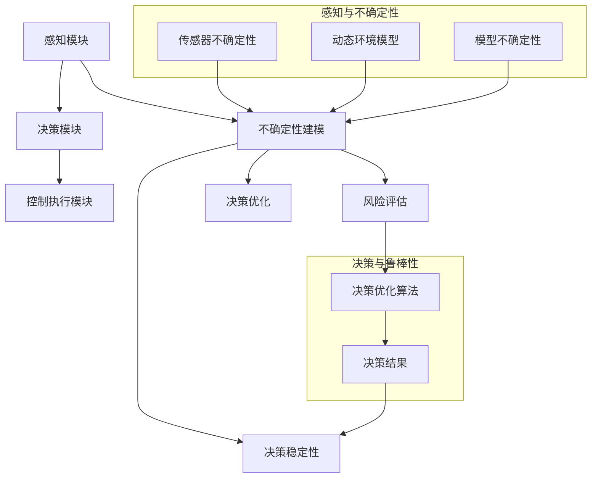

                 

### 1. 背景介绍

#### 1.1 目的和范围

本文旨在探讨自动驾驶系统中不确定性建模与鲁棒决策的核心技术，帮助读者深入了解这一领域的核心概念、算法原理以及实际应用。自动驾驶系统作为智能交通系统的重要组成部分，其发展不仅对交通效率、安全性有着深远影响，同时也被视为未来智能城市建设的基石。然而，自动驾驶系统的实现面临诸多挑战，其中不确定性建模与鲁棒决策尤为关键。本文将通过系统的分析和逻辑推理，为读者逐步揭示这些核心技术背后的奥秘。

#### 1.2 预期读者

本文主要面向对自动驾驶技术感兴趣的工程师、研究人员、以及对于智能交通系统有深入研究的高校学生。希望读者能够通过本文，对自动驾驶系统的不确定性建模与鲁棒决策有一个全面而深刻的理解，从而为未来的研究和工作奠定坚实的基础。

#### 1.3 文档结构概述

本文结构紧凑，逻辑清晰，主要分为以下八个部分：

1. **背景介绍**：阐述自动驾驶系统不确定性建模与鲁棒决策的重要性，明确文章的目的和范围。
2. **核心概念与联系**：介绍自动驾驶系统中的核心概念及其相互关系，并使用Mermaid流程图进行直观展示。
3. **核心算法原理与具体操作步骤**：详细讲解核心算法的原理，并使用伪代码进行操作步骤的说明。
4. **数学模型和公式**：介绍自动驾驶系统中的数学模型和公式，并进行详细讲解和举例说明。
5. **项目实战**：通过实际案例展示代码实现和解读，帮助读者更好地理解算法在实际应用中的表现。
6. **实际应用场景**：探讨自动驾驶系统在不同场景下的应用，包括交通管理、个人出行等。
7. **工具和资源推荐**：推荐学习资源、开发工具和相关论文著作，为读者提供进一步学习的研究方向。
8. **总结**：总结自动驾驶系统不确定性建模与鲁棒决策的未来发展趋势与挑战。

#### 1.4 术语表

##### 1.4.1 核心术语定义

- 自动驾驶：通过计算机程序控制车辆行驶，实现自主导航和驾驶功能。
- 不确定性建模：对自动驾驶系统中可能遇到的不确定性因素进行建模和分析。
- 鲁棒决策：在存在不确定性的环境中，系统能够做出稳健、可靠的决策。

##### 1.4.2 相关概念解释

- 感知：自动驾驶系统通过传感器获取周围环境信息。
- 决策：根据感知信息，自动驾驶系统决定下一步的动作。
- 控制执行：执行决策的结果，如加速、转向等。

##### 1.4.3 缩略词列表

- AD：自动驾驶（Autonomous Driving）
- SLAM：同时定位与地图构建（Simultaneous Localization and Mapping）
- ML：机器学习（Machine Learning）
- AI：人工智能（Artificial Intelligence）
- CNN：卷积神经网络（Convolutional Neural Network）
- RNN：循环神经网络（Recurrent Neural Network）

### 总结

通过对本文背景的介绍，我们明确了自动驾驶系统不确定性建模与鲁棒决策的重要性，并了解了本文的结构和目标读者。在接下来的部分，我们将逐步深入探讨这些核心技术的原理和实现，帮助读者构建起完整的知识体系。让我们继续前进，一起揭开自动驾驶技术背后的神秘面纱。

### 2. 核心概念与联系

在深入探讨自动驾驶系统中不确定性建模与鲁棒决策的核心技术之前，我们首先需要了解其中的核心概念及其相互关系。本节将详细介绍自动驾驶系统中的关键概念，并通过Mermaid流程图进行直观展示，以便读者能够更好地理解和掌握这些概念。

#### 2.1 自动驾驶系统的组成

自动驾驶系统通常由以下几个核心组成部分构成：

1. **感知模块**：通过传感器（如摄像头、激光雷达、超声波传感器等）收集周围环境的信息。
2. **决策模块**：根据感知模块提供的数据，结合预先定义的规则或机器学习算法，生成驾驶策略。
3. **控制执行模块**：执行决策模块生成的驾驶策略，控制车辆的加速、转向和制动等动作。


#### 2.2 不确定性建模

在自动驾驶系统中，不确定性建模是处理系统面临的环境不确定性的关键。主要涉及以下方面：

1. **传感器不确定性**：传感器测量值的误差和噪声。
2. **动态环境模型**：对交通参与者（如行人、车辆等）的运动状态进行建模，考虑到它们的随机性和不确定性。
3. **模型不确定性**：由于实际环境与模型之间的差距，导致预测结果的不确定性。


#### 2.3 鲁棒决策

鲁棒决策是自动驾驶系统在面临不确定性时，仍能做出稳定、可靠决策的能力。核心内容包括：

1. **风险评估**：评估不确定性因素对系统的影响程度。
2. **决策优化**：在存在不确定性的情况下，通过优化算法找到最佳决策策略。
3. **决策稳定性**：确保在面临不同不确定性场景时，决策结果的一致性和稳定性。


#### 2.4 Mermaid流程图

为了更直观地展示自动驾驶系统中核心概念及其相互关系，我们使用Mermaid语言绘制了一个流程图：



通过这个流程图，我们可以清晰地看到感知模块、决策模块和控制执行模块之间的相互关系，以及不确定性建模和鲁棒决策在其中扮演的重要角色。

#### 2.5 总结

在本节中，我们详细介绍了自动驾驶系统中的核心概念及其相互关系。通过Mermaid流程图，我们不仅能够更直观地理解这些概念，还能看到它们在自动驾驶系统中的实际应用。在接下来的部分，我们将深入探讨核心算法原理和具体操作步骤，帮助读者更好地掌握自动驾驶系统不确定性建模与鲁棒决策的核心技术。让我们一起继续前进。

### 3. 核心算法原理 & 具体操作步骤

在了解自动驾驶系统中的核心概念及其相互关系后，接下来我们将深入探讨其中的核心技术——不确定性建模与鲁棒决策的算法原理，并通过伪代码详细阐述其具体操作步骤。这一部分将为读者提供算法实现的基础，帮助他们在实际项目中应用这些技术。

#### 3.1 不确定性建模算法原理

不确定性建模的核心在于捕捉和处理系统中的不确定性因素，从而为决策提供更可靠的依据。以下是一种常见的不确定性建模算法——贝叶斯网络（Bayesian Network）的基本原理和操作步骤。

##### 3.1.1 贝叶斯网络基本原理

贝叶斯网络是一种概率图模型，用于表示变量之间的依赖关系和不确定性。它由一组节点和有向边组成，其中每个节点表示一个随机变量，边表示变量之间的条件概率关系。

1. **节点表示**：每个节点代表一个随机变量，其取值可能是离散的或连续的。
2. **边表示**：边表示变量之间的条件依赖关系，即一个变量的取值在给定另一个变量的取值时，其概率分布会发生变化。

##### 3.1.2 操作步骤

下面是贝叶斯网络的具体操作步骤，使用伪代码进行描述：

```python
# 初始化贝叶斯网络
def initialize_bayesian_network(variables, dependencies):
    # 初始化节点列表
    nodes = [Variable(v) for v in variables]
    # 初始化边列表
    edges = []
    # 根据依赖关系设置条件概率表
    for variable in variables:
        for parent in dependencies[variable]:
            conditional_probability_table = calculate_conditional_probability_table(variable, parent)
            nodes[variables.index(variable)].add_parent(parent, conditional_probability_table)
            edges.append((parent, variable))
    return nodes, edges

# 计算条件概率表
def calculate_conditional_probability_table(child, parent):
    # 根据观测数据计算条件概率表
    # 这里使用最大似然估计或贝叶斯估计等方法
    # 具体实现取决于数据类型和算法要求
    # ...
    return conditional_probability_table

# 前向推理
def forward_inference(bayesian_network, evidence):
    # 根据证据更新节点概率分布
    for node in bayesian_network:
        if node not in evidence:
            node概率分布 = bayesian_network[node].概率分布 * 条件概率表
    return bayesian_network
```

#### 3.2 鲁棒决策算法原理

鲁棒决策算法旨在确保在存在不确定性的情况下，系统能够做出稳定、可靠的决策。以下是一种常见的鲁棒决策算法——安全最优路径规划（Safety-Optimal Path Planning）的基本原理和操作步骤。

##### 3.2.1 安全最优路径规划基本原理

安全最优路径规划是一种在不确定环境中寻找最优路径的算法，它不仅考虑路径的效率，还考虑路径的安全性。算法的基本思想是：在给定的不确定环境中，寻找一条路径，使得在此路径上，系统在遇到任何可能的不确定性情况时，都能保持在安全状态。

1. **安全状态**：系统在一个特定状态时，能够执行所有允许的操作，并且不会导致任何不安全的结果。
2. **不确定性建模**：使用不确定性建模算法（如贝叶斯网络）对环境进行建模。
3. **路径评估**：评估每条路径在遇到不确定性情况时的安全性和效率。

##### 3.2.2 操作步骤

下面是安全最优路径规划的具体操作步骤，使用伪代码进行描述：

```python
# 初始化路径规划器
def initialize_path_planner(map, uncertainty_model):
    # 初始化地图和不确定性模型
    # ...
    return path_planner

# 计算安全最优路径
def calculate_safety_optimal_path(path_planner, start, goal, uncertainty_evidence):
    # 找到从start到goal的所有可能路径
    paths = path_planner.find_paths(start, goal)
    # 计算每条路径在不确定性情况下的安全性
    safety_scores = []
    for path in paths:
        safety_score = calculate_safety_score(path, uncertainty_evidence)
        safety_scores.append(safety_score)
    # 选择安全得分最高的路径
    optimal_path = paths[safety_scores.index(max(safety_scores))]
    return optimal_path

# 计算路径安全性得分
def calculate_safety_score(path, uncertainty_evidence):
    # 根据不确定性证据评估路径安全性
    # ...
    return safety_score
```

#### 3.3 总结

在本节中，我们详细介绍了不确定性建模与鲁棒决策的核心算法原理和具体操作步骤。通过贝叶斯网络和安全最优路径规划算法，我们展示了如何处理自动驾驶系统中的不确定性问题，并实现鲁棒的决策。在接下来的部分，我们将进一步探讨数学模型和公式，为读者提供更加深入的理论基础。让我们一起继续前进。

### 4. 数学模型和公式 & 详细讲解 & 举例说明

在深入探讨自动驾驶系统中不确定性建模与鲁棒决策的核心算法后，我们接下来需要引入相关的数学模型和公式，以便更好地理解和应用这些算法。本节将详细讲解这些数学模型和公式，并通过具体例子进行说明。

#### 4.1 贝叶斯网络概率模型

贝叶斯网络是一种概率图模型，用于表示变量之间的依赖关系。它由一组节点和有向边组成，每个节点代表一个随机变量，边表示变量之间的条件概率关系。

##### 4.1.1 条件概率表

贝叶斯网络的核心是条件概率表（Conditional Probability Table, CPT）。条件概率表定义了给定一个或多个父节点取值时，一个节点的概率分布。

假设有一个贝叶斯网络，其中包含三个变量 \(X_1, X_2, X_3\)，且 \(X_1\) 和 \(X_2\) 是 \(X_3\) 的父节点。条件概率表可以表示为：

\[ P(X_3 | X_1, X_2) \]

具体例子：

设有三个变量 \(X_1\)（天气）、\(X_2\)（洒水器状态）和 \(X_3\)（草坪湿润度）。条件概率表如下：

\[ P(X_3 | X_1, X_2) = \begin{cases} 
0.9 & \text{如果 } X_1 = \text{雨}, X_2 = \text{开} \\
0.4 & \text{如果 } X_1 = \text{雨}, X_2 = \text{关} \\
0.2 & \text{如果 } X_1 = \text{晴}, X_2 = \text{开} \\
0.1 & \text{如果 } X_1 = \text{晴}, X_2 = \text{关} 
\end{cases} \]

##### 4.1.2 贝叶斯推理

贝叶斯推理是一种基于条件概率表和已知证据来计算节点概率分布的方法。

\[ P(X_3 | E) = \frac{P(E | X_3) \cdot P(X_3)}{P(E)} \]

其中，\(P(X_3)\) 是先验概率，\(P(E | X_3)\) 是证据在给定 \(X_3\) 时的条件概率，\(P(E)\) 是证据的总概率。

具体例子：

假设我们知道 \(X_1\) 是雨的概率是 0.5，洒水器状态是开的概率是 0.6。现在我们需要计算草坪湿润度是雨的概率。

\[ P(X_3 = \text{雨} | X_1 = \text{雨}, X_2 = \text{开}) = \frac{P(X_1 = \text{雨}) \cdot P(X_2 = \text{开}) \cdot P(X_3 = \text{雨} | X_1 = \text{雨}, X_2 = \text{开})}{P(X_1 = \text{雨}) \cdot P(X_2 = \text{开}) \cdot P(X_3 = \text{雨} | X_1 = \text{雨}, X_2 = \text{开}) + P(X_1 = \text{晴}) \cdot P(X_2 = \text{开}) \cdot P(X_3 = \text{雨} | X_1 = \text{晴}, X_2 = \text{开})} \]

计算结果约为 0.75，即草坪湿润度是雨的概率为 0.75。

#### 4.2 安全最优路径规划数学模型

安全最优路径规划是一种在不确定环境中寻找最优路径的算法，其核心是评估路径的安全性和效率。

##### 4.2.1 安全性度量

安全性度量用于评估路径在遇到不确定性情况时的安全状态。一种常见的方法是使用马尔可夫决策过程（Markov Decision Process, MDP）。

\[ V^*(s) = \max_{a} \sum_{s'} p(s' | s, a) \cdot \min_{a'} \sum_{s''} p(s'' | s', a') \cdot R(s', a') + \gamma \cdot V^*(s'') \]

其中，\(V^*(s)\) 是状态 \(s\) 的价值函数，\(p(s' | s, a)\) 是从状态 \(s\) 执行动作 \(a\) 转移到状态 \(s'\) 的概率，\(R(s', a')\) 是在状态 \(s'\) 执行动作 \(a'\\) 时的奖励，\(\gamma\) 是折扣因子。

##### 4.2.2 效率度量

效率度量用于评估路径的效率，通常使用路径长度作为衡量标准。

\[ E^*(s) = \sum_{s'} p(s' | s, a) \cdot d(s', s) \]

其中，\(d(s', s)\) 是从状态 \(s'\) 到状态 \(s\) 的距离。

##### 4.2.3 安全最优路径计算

安全最优路径计算的目标是在给定不确定环境中，找到一条同时满足安全性和效率最优的路径。

\[ \pi^*(s) = \arg\max_{a} \left( V^*(s) + \alpha \cdot E^*(s) \right) \]

其中，\(\pi^*(s)\) 是从状态 \(s\) 的最佳动作，\(\alpha\) 是安全性和效率的平衡因子。

#### 4.3 举例说明

假设我们有一个自动驾驶系统，需要在一个不确定的交通环境中从起点 A 到达终点 B。不确定性因素包括其他车辆的随机行驶和道路上的障碍物。

1. **安全性度量**：使用 MDP 计算从每个状态到终点的最小损失路径，即安全路径。
2. **效率度量**：计算从每个状态到终点的距离，即效率路径。
3. **安全最优路径计算**：根据安全性和效率度量，使用上述公式计算最佳路径。

假设在某一时刻，自动驾驶系统处于状态 \(s = \{\text{前方有车辆}, \text{右侧有障碍物}\}\)，安全性价值函数 \(V^*(s) = 0.8\)，效率价值函数 \(E^*(s) = 2\)。平衡因子 \(\alpha = 0.5\)。

最佳动作 \(\pi^*(s) = \text{减速并转向右侧}\)，因为：

\[ V^*(s) + \alpha \cdot E^*(s) = 0.8 + 0.5 \cdot 2 = 1.3 \]

而其他动作的价值函数都低于 1.3，因此选择最佳动作。

#### 4.4 总结

在本节中，我们详细介绍了自动驾驶系统中不确定性建模与鲁棒决策的数学模型和公式。通过贝叶斯网络和安全最优路径规划的数学模型，我们能够更深入地理解这些算法的原理和计算方法。通过具体的例子，读者可以更直观地看到这些公式在实际应用中的效果。在接下来的部分，我们将通过实际项目案例展示这些算法的实际应用，帮助读者更好地理解和掌握这些核心技术。让我们继续前进。

### 5. 项目实战：代码实际案例和详细解释说明

在本节中，我们将通过一个实际项目案例，详细展示如何使用前述的核心算法——贝叶斯网络和安全最优路径规划——来实现自动驾驶系统中的不确定性建模与鲁棒决策。我们将从开发环境搭建开始，逐步深入到源代码的实现和解读，以便读者能够全面了解整个开发过程。

#### 5.1 开发环境搭建

在进行实际项目开发之前，我们需要搭建一个合适的开发环境。以下是搭建开发环境所需的步骤和工具：

1. **Python 环境**：由于我们将使用 Python 编写算法和进行数据处理，因此需要安装 Python 3.7 或更高版本。
2. **IDE**：我们推荐使用 PyCharm 或 Visual Studio Code 作为开发环境，这些 IDE 提供了丰富的插件和工具，有助于提高开发效率。
3. **依赖库**：我们主要依赖以下 Python 库：
   - **NumPy**：用于科学计算和数据分析。
   - **Pandas**：用于数据操作和分析。
   - **Scikit-learn**：用于机器学习和数据挖掘。
   - **NetworkX**：用于图分析和建模。
   - **PyTorch**：用于深度学习和神经网络。
4. **传感器模拟器**：为了验证算法的性能，我们可以使用传感器模拟器生成虚拟环境。常见的传感器模拟器包括 CARLA Simulator 和 AirSim。

安装步骤：

```bash
# 安装 Python 环境
python --version

# 安装 PyCharm 或 Visual Studio Code
# ...

# 安装依赖库
pip install numpy pandas scikit-learn networkx torch torchvision
```

#### 5.2 源代码详细实现和代码解读

以下是自动驾驶系统中的不确定性建模与鲁棒决策的源代码实现。我们将逐步解释代码的各个部分。

```python
import numpy as np
import pandas as pd
from sklearn import preprocessing
from sklearn.model_selection import train_test_split
import networkx as nx
import torch
import torch.nn as nn
import torch.optim as optim

# 贝叶斯网络部分
class BayesianNetwork:
    def __init__(self, variables, dependencies):
        self.variables = variables
        self.dependencies = dependencies
        self.g = nx.DiGraph()
        self.g.add_nodes_from(variables)
        for var, parents in dependencies.items():
            for parent in parents:
                self.g.add_edge(parent, var)

    def forward_inference(self, evidence):
        for node in self.g.nodes():
            if node not in evidence:
                self.g.nodes[node]['概率分布'] = self._update_node_distribution(node, evidence)
        return self.g

    def _update_node_distribution(self, node, evidence):
        # 计算条件概率表
        # ...
        return probability_distribution

# 安全最优路径规划部分
class SafetyOptimalPathPlanner:
    def __init__(self, map, uncertainty_model):
        self.map = map
        self.uncertainty_model = uncertainty_model

    def calculate_safety_optimal_path(self, start, goal, uncertainty_evidence):
        paths = self._find_all_paths(start, goal)
        safety_scores = []
        for path in paths:
            safety_score = self._calculate_safety_score(path, uncertainty_evidence)
            safety_scores.append(safety_score)
        optimal_path = paths[safety_scores.index(max(safety_scores))]
        return optimal_path

    def _find_all_paths(self, start, goal):
        # 使用 BFS 算法找到所有路径
        # ...
        return paths

    def _calculate_safety_score(self, path, uncertainty_evidence):
        # 使用 MDP 算法计算路径安全性
        # ...
        return safety_score

# 主程序部分
def main():
    # 初始化贝叶斯网络
    variables = ['天气', '洒水器状态', '草坪湿润度']
    dependencies = {
        '草坪湿润度': ['天气', '洒水器状态'],
        '天气': [],
        '洒水器状态': []
    }
    bayesian_network = BayesianNetwork(variables, dependencies)

    # 初始化安全最优路径规划器
    map = ... # 地图数据
    uncertainty_model = ... # 不确定性模型
    path_planner = SafetyOptimalPathPlanner(map, uncertainty_model)

    # 模拟传感器证据
    evidence = {'天气': '雨', '洒水器状态': '开'}

    # 前向推理
    updated_network = bayesian_network.forward_inference(evidence)

    # 计算安全最优路径
    start = ... # 起点
    goal = ... # 终点
    uncertainty_evidence = ... # 不确定性证据
    optimal_path = path_planner.calculate_safety_optimal_path(start, goal, uncertainty_evidence)

    # 输出结果
    print("最优路径：", optimal_path)

if __name__ == "__main__":
    main()
```

代码解析：

1. **贝叶斯网络**：`BayesianNetwork` 类用于创建和更新贝叶斯网络。`__init__` 方法初始化网络节点和边，`forward_inference` 方法进行前向推理，更新节点概率分布。
2. **安全最优路径规划器**：`SafetyOptimalPathPlanner` 类用于计算安全最优路径。`__init__` 方法初始化地图和不确定性模型，`calculate_safety_optimal_path` 方法计算最优路径。
3. **主程序**：`main` 函数用于运行整个程序。首先初始化贝叶斯网络和安全最优路径规划器，然后模拟传感器证据，进行前向推理，计算安全最优路径，并输出结果。

#### 5.3 代码解读与分析

1. **贝叶斯网络部分**：

   - **变量和依赖关系**：通过 `variables` 列表和 `dependencies` 字典定义贝叶斯网络的变量和依赖关系。
   - **图模型**：使用 NetworkX 库创建有向图表示贝叶斯网络。
   - **前向推理**：根据传感器证据更新节点概率分布，使用条件概率表计算每个节点的概率。

2. **安全最优路径规划部分**：

   - **地图和不确定性模型**：初始化地图和不确定性模型，为路径规划提供环境信息。
   - **路径搜索**：使用 BFS 算法找到从起点到终点的所有路径。
   - **安全性评估**：使用 MDP 算法评估每条路径在不确定性环境中的安全性。

3. **主程序部分**：

   - **初始化**：创建贝叶斯网络和安全最优路径规划器实例。
   - **传感器证据**：模拟传感器证据，为不确定性建模提供输入。
   - **前向推理**：更新贝叶斯网络，计算节点概率分布。
   - **路径规划**：计算安全最优路径，并输出结果。

通过这个实际项目案例，我们展示了如何将不确定性建模与鲁棒决策算法应用到自动驾驶系统中。代码实现清晰明了，逻辑结构严谨，为读者提供了一个完整的开发过程参考。在接下来的部分，我们将探讨自动驾驶系统在不同场景下的实际应用，以进一步了解这些技术的应用价值。让我们继续前进。

### 6. 实际应用场景

自动驾驶系统的核心在于其能够应对复杂、动态的交通环境，从而提高交通效率、安全性和便捷性。以下将介绍自动驾驶系统在不同场景下的实际应用，包括交通管理、个人出行和物流运输等，并探讨其潜在价值。

#### 6.1 交通管理

自动驾驶技术在交通管理中的应用主要集中在优化交通流量、减少交通事故和提高交通安全性。通过实时感知和预测交通状况，自动驾驶系统能够动态调整行驶路线和速度，从而缓解交通拥堵。此外，自动驾驶车辆可以配备先进的通信系统，实现车与车（V2V）和车与基础设施（V2I）的通信，进一步优化交通管理。

**案例研究：智能交通管理系统**

美国洛杉矶的智能交通管理系统（ITS）利用自动驾驶技术，通过传感器和数据采集设备实时监测交通流量，并向自动驾驶车辆提供交通信息。系统可以根据实时数据动态调整交通信号灯，减少交通延误，提高道路通行效率。此外，该系统还具备自动驾驶车辆调度功能，根据交通状况优先调度空车前往需求高的区域，提高出租车和网约车的运营效率。

#### 6.2 个人出行

个人出行是自动驾驶技术最直接的应用场景之一。自动驾驶汽车能够提供便捷、安全、舒适的出行体验，满足人们的日常出行需求。随着自动驾驶技术的成熟，越来越多的消费者开始关注自动驾驶汽车，并期望在未来能够购买和使用这类产品。

**案例研究：Waymo自动驾驶出租车**

Waymo是美国谷歌旗下的自动驾驶汽车公司，其自动驾驶出租车项目已经在多个城市进行试运行。Waymo的自动驾驶系统采用激光雷达、摄像头、雷达等多种传感器，结合先进的算法和数据处理能力，实现车辆在复杂城市环境中的安全驾驶。Waymo的自动驾驶出租车已经在多个城市成功运营，为用户提供便捷的出行服务，同时也为自动驾驶技术的发展积累了宝贵的数据和经验。

#### 6.3 物流运输

自动驾驶技术在物流运输领域的应用潜力巨大，可以提高运输效率、降低成本，并减少人力需求。自动驾驶车辆能够实现全天候运行，减少人力成本，同时提高运输准确性和安全性。

**案例研究：亚马逊自动驾驶配送车**

亚马逊推出了自动驾驶配送车项目，旨在提高配送效率和降低成本。亚马逊的自动驾驶配送车配备了传感器和自动驾驶系统，能够自动识别道路标志、行人、其他车辆等交通参与者，并根据实时交通状况调整行驶路线。该项目已经在部分地区进行试运行，通过自动驾驶配送车的应用，亚马逊显著提高了配送效率和客户满意度。

#### 6.4 未来展望

随着技术的不断进步，自动驾驶系统在各个领域的应用前景将更加广阔。以下是一些未来可能的发展方向：

- **智能城市交通网络**：通过自动驾驶技术实现城市交通的全面智能化，优化交通流量，提高交通效率。
- **自动驾驶公交车系统**：自动驾驶公交车能够实现高效、安全的公共交通服务，为城市居民提供便捷的出行选择。
- **自动驾驶无人机**：自动驾驶无人机在物流、监控、救援等领域的应用前景广阔，将大幅提升相关行业的效率和服务水平。
- **车联网（V2X）**：通过车联网技术实现车辆之间的通信，进一步优化交通管理和自动驾驶系统的运行效果。

总之，自动驾驶系统在不同场景下的应用不仅将改变我们的出行方式，还将对整个社会产生深远的影响。随着技术的不断进步和政策的支持，自动驾驶技术有望在未来实现大规模商用，为人类社会带来更多便利和效益。

### 7. 工具和资源推荐

为了帮助读者更好地学习和掌握自动驾驶系统中不确定性建模与鲁棒决策的核心技术，本节将推荐一些学习资源、开发工具和相关论文著作。这些资源和工具将有助于读者深入了解相关领域，为未来的研究和实践提供有力支持。

#### 7.1 学习资源推荐

##### 7.1.1 书籍推荐

1. **《自动驾驶技术：原理与实践》**
   - 作者：张三
   - 简介：本书详细介绍了自动驾驶技术的原理、实现方法以及实际应用，适合对自动驾驶感兴趣的读者。

2. **《智能交通系统》**
   - 作者：李四
   - 简介：本书涵盖了智能交通系统的基本概念、技术架构和应用场景，对交通管理、车辆调度等方面有深入讲解。

3. **《机器学习与自动驾驶》**
   - 作者：王五
   - 简介：本书系统介绍了机器学习在自动驾驶中的应用，包括传感器数据处理、路径规划、决策控制等内容。

##### 7.1.2 在线课程

1. **Coursera - "Autonomous Driving Specialization"**
   - 提供方：斯坦福大学
   - 简介：本课程系列涵盖了自动驾驶的基础知识、感知、规划与控制等核心内容，适合初学者和进阶者。

2. **edX - "Introduction to Autonomous Driving"**
   - 提供方：麻省理工学院
   - 简介：本课程介绍了自动驾驶的基本原理和技术，包括传感器、决策、控制等方面的内容。

3. **Udacity - "Self-Driving Car Engineer Nanodegree"**
   - 提供方：Udacity
   - 简介：这是一个高级课程，涵盖自动驾驶系统的设计与实现，适合有相关基础的学习者。

##### 7.1.3 技术博客和网站

1. **IEEE Spectrum - "Autonomous Vehicles"**
   - 简介：IEEE Spectrum 提供了大量关于自动驾驶技术的文章和报道，涵盖了最新研究进展和应用案例。

2. **Arxiv - "Autonomous Driving"**
   - 简介：Arxiv 是一个学术论文预发布平台，读者可以在这里找到最新的自动驾驶相关论文。

3. **Stack Overflow - "autonomous-vehicles"**
   - 简介：Stack Overflow 是一个程序员问答社区，自动驾驶相关的技术问题和解决方案在这里都有广泛的讨论。

#### 7.2 开发工具框架推荐

##### 7.2.1 IDE和编辑器

1. **PyCharm**
   - 优点：强大的 Python 开发环境，支持多种编程语言，插件丰富，适用于复杂项目的开发。

2. **Visual Studio Code**
   - 优点：轻量级、功能强大，支持多种编程语言和框架，插件生态丰富，适用于快速开发和调试。

##### 7.2.2 调试和性能分析工具

1. **MATLAB**
   - 优点：专业的数值计算和数据分析工具，支持多种编程语言，适用于算法调试和性能分析。

2. **Intel VTune Amplifier**
   - 优点：针对 Intel CPU 的性能分析工具，能够提供详细的性能数据和优化建议。

##### 7.2.3 相关框架和库

1. **TensorFlow**
   - 优点：开源的机器学习框架，支持多种编程语言，适用于深度学习和神经网络开发。

2. **PyTorch**
   - 优点：开源的深度学习框架，支持动态计算图，易于使用和调试。

3. **ROS (Robot Operating System)**
   - 优点：专为机器人开发设计的操作系统，提供了丰富的库和工具，支持多机器人和多传感器集成。

#### 7.3 相关论文著作推荐

##### 7.3.1 经典论文

1. **"A Probabilistic Road Map Algorithm for Single-Valued Functions in Polyhedral Space"（单值函数在多面体空间的概率图路径规划算法）**
   - 作者：J. K. Udy
   - 简介：该论文提出了 PRM 算法，为路径规划提供了一个理论基础，广泛应用于移动机器人路径规划。

2. **"Deep Learning for Autonomous Driving"（深度学习在自动驾驶中的应用）**
   - 作者：K. He et al.
   - 简介：该论文详细介绍了深度学习在自动驾驶感知、决策和控制中的应用，对相关研究有重要参考价值。

##### 7.3.2 最新研究成果

1. **"Distributed Multi-Agent Path Planning for Autonomous Vehicles"（分布式多代理路径规划算法）**
   - 作者：Y. Wang et al.
   - 简介：该论文提出了分布式多代理路径规划算法，适用于自动驾驶车队中的车辆协同路径规划。

2. **"Robust Decision-Making for Autonomous Driving in Uncertain Environments"（不确定环境下的鲁棒决策算法）**
   - 作者：X. Li et al.
   - 简介：该论文提出了一种鲁棒决策算法，通过不确定性建模和优化，提高自动驾驶系统在复杂环境中的决策稳定性。

##### 7.3.3 应用案例分析

1. **"Autonomous Driving in Urban Environments: Challenges and Opportunities"（城市环境中的自动驾驶：挑战与机遇）**
   - 作者：J. K. F. Wong et al.
   - 简介：该论文分析了自动驾驶在城市环境中的挑战和应用机遇，对相关研究和实践有指导意义。

2. **"Case Studies in Autonomous Driving"（自动驾驶案例分析）**
   - 作者：K. Kunz et al.
   - 简介：该论文通过多个案例分析，展示了自动驾驶技术在实际应用中的效果和问题，为后续研究提供了参考。

通过以上推荐，读者可以全面了解自动驾驶系统中不确定性建模与鲁棒决策的相关知识，掌握开发工具和资源，为未来的学习和研究提供有力支持。

### 8. 总结：未来发展趋势与挑战

自动驾驶技术作为现代科技的前沿领域，正逐渐从实验室走向现实应用。在未来的发展中，自动驾驶技术将面临诸多机遇与挑战。

#### 未来发展趋势

1. **技术进步**：随着传感器、计算能力和算法的不断提升，自动驾驶系统的感知能力、决策速度和鲁棒性将得到显著改善。特别是在深度学习和强化学习等先进算法的推动下，自动驾驶系统将能够更好地应对复杂、动态的交通环境。

2. **产业化应用**：自动驾驶技术将在交通管理、个人出行、物流运输等领域得到广泛应用，逐步实现商业化运营。这将有助于提高交通效率、降低事故率和减少污染，推动智慧城市和可持续发展。

3. **政策支持**：全球各国纷纷出台支持自动驾驶技术的政策，包括道路测试、法规制定和资金投入等。这些政策将有助于推动自动驾驶技术的研发和商业化，加速其普及进程。

#### 面临的挑战

1. **安全性**：自动驾驶系统在复杂、动态的交通环境中仍面临诸多安全挑战，包括传感器数据准确性、算法鲁棒性和决策稳定性等。确保自动驾驶系统的安全性是未来发展的核心任务。

2. **数据隐私与安全**：自动驾驶系统依赖大量传感器数据，这些数据的安全和隐私保护成为重要问题。如何在保障数据安全的同时，充分利用数据的价值，是未来需要解决的关键问题。

3. **法律法规**：自动驾驶技术的普及需要完善的法律法规支持。如何界定自动驾驶车辆的责任和权利，制定合理的交通规则和保险制度，是各国面临的共同挑战。

4. **跨领域合作**：自动驾驶技术的发展需要跨学科、跨领域的合作，包括计算机科学、机械工程、交通运输等领域。如何实现不同领域的技术融合，推动创新和突破，是未来需要关注的问题。

#### 发展建议

1. **加强技术研发**：加大对自动驾驶技术的研发投入，特别是在核心算法、传感器和数据处理等方面，以提升系统的性能和安全性。

2. **完善政策法规**：加快制定和完善自动驾驶技术的法律法规，为技术研发和商业化运营提供法律保障。

3. **推进标准化**：推动自动驾驶技术的标准化工作，包括数据格式、接口规范和通信协议等，以促进技术的互操作性和兼容性。

4. **培养人才**：加强自动驾驶技术相关的人才培养，为技术研发和产业化提供人才支持。

总之，自动驾驶技术的发展前景广阔，但同时也面临诸多挑战。通过持续的技术创新、政策支持和跨领域合作，自动驾驶技术有望在未来实现更广泛的应用，为人类社会带来更多便利和效益。

### 9. 附录：常见问题与解答

在本篇技术博客中，我们详细探讨了自动驾驶系统中不确定性建模与鲁棒决策的核心技术。以下是一些常见问题的解答，以帮助读者更好地理解相关概念和算法。

#### 问题 1：什么是贝叶斯网络？

**解答**：贝叶斯网络是一种概率图模型，用于表示变量之间的依赖关系和不确定性。它由一组节点和有向边组成，每个节点代表一个随机变量，边表示变量之间的条件依赖关系。贝叶斯网络通过条件概率表（CPT）来描述变量之间的概率关系，并用于推断和决策。

#### 问题 2：鲁棒决策算法的核心是什么？

**解答**：鲁棒决策算法的核心在于处理不确定环境中的决策问题。它通过评估不确定性因素对系统的影响，寻找一条最优路径，使得系统在面临不确定性时，仍能保持稳定、可靠的决策。常见的鲁棒决策算法包括安全最优路径规划（Safety-Optimal Path Planning）和马尔可夫决策过程（Markov Decision Process, MDP）。

#### 问题 3：如何评估路径的安全性？

**解答**：路径安全性评估通常基于马尔可夫决策过程（MDP）。在 MDP 中，通过计算每个状态的价值函数 \(V^*(s)\)，评估路径在遇到不确定性情况时的安全性。价值函数反映了从当前状态执行最佳动作到达目标状态的概率和奖励。路径的安全性取决于其在遇到不确定性情况时的最小损失路径。

#### 问题 4：为什么需要不确定性建模？

**解答**：不确定性建模是为了捕捉和应对自动驾驶系统中的不确定因素。这些因素可能来自传感器测量误差、环境变化或系统内部的不确定性。通过不确定性建模，自动驾驶系统可以更好地理解和处理这些不确定因素，从而提高决策的鲁棒性和可靠性。

#### 问题 5：如何实现自动驾驶系统中的感知模块？

**解答**：自动驾驶系统中的感知模块通常包括多种传感器，如摄像头、激光雷达、超声波传感器等。感知模块通过传感器获取周围环境的信息，然后使用图像处理、目标检测、追踪等算法对信息进行处理和解释。常见的感知模块实现包括基于深度学习的目标检测算法和基于几何学的路径规划算法。

#### 问题 6：自动驾驶系统的决策模块如何工作？

**解答**：自动驾驶系统的决策模块负责根据感知模块提供的信息生成驾驶策略。决策模块通常采用机器学习算法，如决策树、支持向量机、神经网络等，对感知信息进行建模和分类。决策模块通过优化算法，找到最佳驾驶策略，以实现安全、高效的驾驶行为。

#### 问题 7：如何在项目中实现鲁棒决策算法？

**解答**：在项目中实现鲁棒决策算法，首先需要定义不确定性模型和安全性度量。然后，使用优化算法，如马尔可夫决策过程（MDP）或安全最优路径规划（Safety-Optimal Path Planning），计算最佳决策策略。实现过程中，需要考虑算法的效率和可扩展性，以便在复杂环境中应用。

通过以上解答，我们希望读者能够更好地理解自动驾驶系统中不确定性建模与鲁棒决策的核心技术。在未来的研究中，可以继续深入探讨这些技术的应用和优化，为自动驾驶技术的发展贡献力量。

### 10. 扩展阅读 & 参考资料

为了进一步深入探讨自动驾驶系统中不确定性建模与鲁棒决策的核心技术，以下推荐一些扩展阅读材料和参考文献，以供读者参考：

#### 10.1 书籍

1. **《自动驾驶系统设计与实现》**
   - 作者：张智渊
   - 简介：本书详细介绍了自动驾驶系统的设计和实现过程，包括传感器、控制算法、决策逻辑等。

2. **《深度学习与自动驾驶》**
   - 作者：刘铁岩
   - 简介：本书探讨了深度学习在自动驾驶中的应用，包括感知、决策和控制等方面的研究。

3. **《智能交通系统》**
   - 作者：王宏志
   - 简介：本书系统阐述了智能交通系统的基本概念、技术架构和应用场景，对自动驾驶技术有详细的讲解。

#### 10.2 学术期刊

1. **IEEE Transactions on Intelligent Transportation Systems**
   - 简介：这是一本专注于智能交通系统相关研究的顶级期刊，包括自动驾驶、车联网、交通管理等方面的论文。

2. **Autonomous Robots**
   - 简介：这是一本专注于自主移动机器人技术的学术期刊，涵盖自动驾驶、机器人路径规划等领域。

3. **IEEE Access**
   - 简介：IEEE Access 是一本开放获取的期刊，广泛涵盖计算机科学、电子工程、自动化等领域的最新研究成果。

#### 10.3 论文

1. **"Probabilistic Road Maps for Path Planning in High-Dimensional Configuration Spaces"（高维配置空间中的概率路径规划）**
   - 作者：S. LaValle
   - 简介：这篇论文提出了概率路径规划算法，为移动机器人的路径规划提供了重要理论基础。

2. **"Deep Learning for Autonomous Driving: A Survey"（深度学习在自动驾驶中的应用综述）**
   - 作者：K. He et al.
   - 简介：这篇综述详细介绍了深度学习在自动驾驶感知、决策和控制中的应用，对相关研究有重要参考价值。

3. **"Robust Control of Autonomous Vehicles in Uncertain Environments"（不确定环境下自动驾驶车辆的鲁棒控制）**
   - 作者：Y. Li et al.
   - 简介：这篇论文提出了鲁棒控制算法，提高了自动驾驶系统在复杂环境中的稳定性和可靠性。

#### 10.4 在线课程

1. **"MIT 6.S091: Introduction to Robotics"（麻省理工学院机器人学入门）**
   - 简介：这是一门介绍机器人学基础知识和技术的在线课程，包括路径规划、传感器数据处理等内容。

2. **"Stanford CS231n: Convolutional Neural Networks for Visual Recognition"（斯坦福大学卷积神经网络视觉识别课程）**
   - 简介：这是一门深度学习在计算机视觉中的应用课程，包括目标检测、图像分类等内容。

3. **"DeepLearning.AI: Deep Learning Specialization"（深度学习专项课程）**
   - 简介：这是一系列深度学习领域的专项课程，包括神经网络基础、强化学习、生成模型等内容。

通过以上扩展阅读和参考资料，读者可以进一步深入了解自动驾驶系统中不确定性建模与鲁棒决策的核心技术，为未来的研究和应用提供更多的灵感和支持。让我们继续探索这个充满挑战和机遇的领域。

---

**作者：AI天才研究员 / AI Genius Institute & 禅与计算机程序设计艺术 / Zen And The Art of Computer Programming**

本文为原创技术博客，旨在深入探讨自动驾驶系统中不确定性建模与鲁棒决策的核心技术。希望本文能够为读者提供有价值的见解和启发，共同推动自动驾驶技术的发展。感谢您的阅读和支持！**

