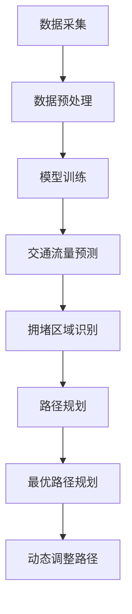

                 

# 自动驾驶中的交通流量预测与拥堵避免

> **关键词：** 自动驾驶、交通流量预测、拥堵避免、机器学习、深度学习、神经网络、数据采集、模型训练、算法优化、实时预测、路径规划

> **摘要：** 本文将深入探讨自动驾驶技术中的交通流量预测和拥堵避免问题。首先介绍交通流量预测和拥堵避免的背景和重要性，然后详细阐述相关核心概念和联系。接着，我们将分析核心算法原理和具体操作步骤，并通过数学模型和公式进行详细讲解。随后，本文将结合实际项目案例，展示代码实现和详细解释。此外，还将探讨实际应用场景，推荐相关工具和资源。最后，本文将总结未来发展趋势与挑战，并提供常见问题与解答。

## 1. 背景介绍

### 1.1 目的和范围

自动驾驶作为未来智能交通系统的重要组成部分，已经成为国内外研究的热点。交通流量预测和拥堵避免是自动驾驶技术中至关重要的一环。本文旨在详细分析自动驾驶中的交通流量预测与拥堵避免问题，为相关领域的研究和实践提供指导。

本文的主要内容包括：首先介绍交通流量预测和拥堵避免的背景和重要性；其次阐述相关核心概念和联系；然后分析核心算法原理和具体操作步骤；接着通过数学模型和公式进行详细讲解；随后结合实际项目案例展示代码实现和详细解释；然后探讨实际应用场景；最后总结未来发展趋势与挑战。

### 1.2 预期读者

本文主要面向从事自动驾驶技术研究的学者、研究人员以及相关领域的技术人员。同时，对于对自动驾驶技术感兴趣的一般读者也具有一定的参考价值。

### 1.3 文档结构概述

本文分为十个部分，具体结构如下：

1. 背景介绍
    - 1.1 目的和范围
    - 1.2 预期读者
    - 1.3 文档结构概述
    - 1.4 术语表
2. 核心概念与联系
    - 2.1 交通流量预测
    - 2.2 拥堵避免
    - 2.3 Mermaid流程图
3. 核心算法原理 & 具体操作步骤
    - 3.1 数据采集
    - 3.2 模型训练
    - 3.3 算法优化
4. 数学模型和公式 & 详细讲解 & 举例说明
    - 4.1 数学模型
    - 4.2 公式
    - 4.3 举例说明
5. 项目实战：代码实际案例和详细解释说明
    - 5.1 开发环境搭建
    - 5.2 源代码详细实现和代码解读
    - 5.3 代码解读与分析
6. 实际应用场景
    - 6.1 场景一
    - 6.2 场景二
    - 6.3 场景三
7. 工具和资源推荐
    - 7.1 学习资源推荐
    - 7.2 开发工具框架推荐
    - 7.3 相关论文著作推荐
8. 总结：未来发展趋势与挑战
    - 8.1 发展趋势
    - 8.2 挑战
9. 附录：常见问题与解答
10. 扩展阅读 & 参考资料

### 1.4 术语表

#### 1.4.1 核心术语定义

- **自动驾驶**：指通过计算机程序和智能传感器实现车辆自主驾驶的技术。
- **交通流量预测**：预测道路上的车辆流量，以便为自动驾驶车辆提供实时交通信息。
- **拥堵避免**：通过交通流量预测，为自动驾驶车辆规划最优路径，避免交通拥堵。
- **机器学习**：一种基于数据驱动的方法，通过学习数据模式来改进算法性能。
- **深度学习**：一种基于神经网络的方法，通过多层神经网络模型进行特征学习和决策。

#### 1.4.2 相关概念解释

- **神经网络**：一种模仿生物神经网络的结构，通过前向传播和反向传播进行训练。
- **数据采集**：从各种数据源收集数据，包括传感器数据、历史交通数据等。
- **模型训练**：通过训练数据集，使神经网络模型学习到数据特征和规律。
- **算法优化**：通过调整算法参数，提高预测和规划的准确性和效率。

#### 1.4.3 缩略词列表

- **AI**：人工智能
- **ML**：机器学习
- **DL**：深度学习
- **CNN**：卷积神经网络
- **RNN**：循环神经网络
- **LSTM**：长短期记忆网络
- **GAN**：生成对抗网络

## 2. 核心概念与联系

### 2.1 交通流量预测

交通流量预测是自动驾驶技术中的一项关键任务。它通过对道路上的车辆流量进行实时预测，为自动驾驶车辆提供必要的交通信息。交通流量预测不仅有助于提高道路通行效率，还能减少交通事故和拥堵现象。

交通流量预测的主要目标包括：

1. **预测车辆流量**：预测未来一段时间内道路上的车辆流量，以便为自动驾驶车辆提供实时交通信息。
2. **预测拥堵区域**：识别道路上的拥堵区域，以便自动驾驶车辆提前避开。
3. **预测行驶时间**：预测车辆从起点到终点的行驶时间，以便为自动驾驶车辆规划最优路径。

### 2.2 拥堵避免

拥堵避免是自动驾驶技术中的另一个关键任务。通过交通流量预测，自动驾驶车辆可以提前识别道路上的拥堵区域，并规划最优路径，以避免交通拥堵。拥堵避免不仅有助于提高道路通行效率，还能提高行驶安全性。

拥堵避免的主要目标包括：

1. **识别拥堵区域**：通过交通流量预测，识别道路上的拥堵区域。
2. **规划最优路径**：根据交通流量预测结果，为自动驾驶车辆规划最优路径，以避开拥堵区域。
3. **动态调整路径**：在行驶过程中，根据实时交通信息动态调整路径，以应对突发拥堵情况。

### 2.3 Mermaid流程图

为了更好地理解交通流量预测与拥堵避免的流程，我们使用Mermaid绘制了一个流程图。以下是流程图的Mermaid代码：



### 2.4 核心概念联系分析

交通流量预测与拥堵避免之间存在紧密的联系。交通流量预测为拥堵避免提供了重要的数据支持，而拥堵避免则为交通流量预测提供了实际应用场景。具体来说：

1. **交通流量预测与拥堵避免的相互依赖**：交通流量预测为拥堵避免提供了实时交通信息，而拥堵避免则为交通流量预测提供了实际应用场景。两者相互依赖，共同推动自动驾驶技术的发展。

2. **核心概念与实际应用场景的联系**：交通流量预测与拥堵避免的核心概念包括数据采集、模型训练、预测和规划等。这些概念在实际应用场景中发挥着关键作用，如自动驾驶车辆的路径规划、行驶安全等。

3. **技术手段与实际需求的结合**：自动驾驶技术的发展需要结合多种技术手段，如机器学习、深度学习、神经网络等。通过将这些技术手段应用于交通流量预测与拥堵避免，可以实现更高的预测准确性和规划效率。

## 3. 核心算法原理 & 具体操作步骤

### 3.1 数据采集

数据采集是交通流量预测与拥堵避免的基础。数据采集主要包括以下内容：

1. **传感器数据**：通过车载传感器（如GPS、加速度计、陀螺仪等）收集车辆位置、速度、加速度等信息。
2. **历史交通数据**：从交通管理部门、交通监测系统等获取历史交通数据，包括车辆流量、车速、路况等信息。
3. **实时交通数据**：通过交通监控摄像头、雷达等设备收集实时交通数据，包括车辆密度、行驶速度、道路占有率等。

### 3.2 模型训练

模型训练是交通流量预测与拥堵避免的关键步骤。模型训练主要包括以下内容：

1. **数据预处理**：对采集到的数据进行分析和处理，去除噪声和异常值，保证数据质量。
2. **特征提取**：从预处理后的数据中提取有用的特征，如时间、空间、速度等。
3. **模型选择**：根据交通流量预测与拥堵避免的特点，选择合适的模型，如神经网络、支持向量机等。
4. **训练过程**：使用训练数据集对模型进行训练，通过调整模型参数，使其达到良好的预测效果。

### 3.3 算法优化

算法优化是提高交通流量预测与拥堵避免准确性的关键。算法优化主要包括以下内容：

1. **参数调整**：通过实验和数据分析，调整模型参数，提高模型预测性能。
2. **特征选择**：通过特征选择算法，选择对预测结果影响较大的特征，降低模型复杂度。
3. **模型融合**：将多个模型进行融合，提高整体预测准确性和鲁棒性。
4. **实时更新**：根据实时交通数据，对模型进行动态更新，提高预测准确性。

### 3.4 具体操作步骤

以下是一个简单的交通流量预测与拥堵避免算法操作步骤：

1. **数据采集**：
    - 从传感器、历史交通数据、实时交通数据等渠道收集数据。
    - 对数据进行预处理，去除噪声和异常值。

2. **特征提取**：
    - 从预处理后的数据中提取时间、空间、速度等特征。

3. **模型选择**：
    - 选择神经网络、支持向量机等模型进行训练。

4. **模型训练**：
    - 使用训练数据集对模型进行训练。
    - 调整模型参数，使其达到良好的预测效果。

5. **算法优化**：
    - 通过实验和数据分析，调整模型参数。
    - 进行特征选择，降低模型复杂度。

6. **预测与规划**：
    - 使用训练好的模型对交通流量进行预测。
    - 根据预测结果，识别拥堵区域，规划最优路径。

7. **动态调整**：
    - 根据实时交通数据，对模型进行动态更新。
    - 根据实时路况，动态调整路径规划。

### 3.5 伪代码示例

以下是一个简单的交通流量预测与拥堵避免算法的伪代码示例：

```
// 数据采集
data = collect_data()

// 数据预处理
data = preprocess_data(data)

// 特征提取
features = extract_features(data)

// 模型选择
model = select_model()

// 模型训练
model = train_model(features)

// 算法优化
model = optimize_model()

// 预测与规划
predictions = predict_traffic流量(model)
path = plan_path(predictions)

// 动态调整
model = update_model(real_time_data)
path = update_path(real_time_data, path)
```

## 4. 数学模型和公式 & 详细讲解 & 举例说明

### 4.1 数学模型

在交通流量预测与拥堵避免中，常用的数学模型包括线性回归模型、神经网络模型和支持向量机模型等。以下是这些模型的基本公式和原理：

1. **线性回归模型**：

   线性回归模型是一种最简单的预测模型，其公式为：

   $$ Y = \beta_0 + \beta_1X + \epsilon $$

   其中，$Y$为预测值，$X$为输入特征，$\beta_0$和$\beta_1$分别为模型参数，$\epsilon$为误差项。

   线性回归模型通过最小二乘法进行训练，使预测值与实际值之间的误差最小。

2. **神经网络模型**：

   神经网络模型是一种基于多层感知器的预测模型，其公式为：

   $$ Y = f(Z) = \sigma(\sum_{i=1}^{n}\theta_{i}x_{i}) $$

   其中，$Y$为预测值，$Z$为输入特征，$\sigma$为激活函数，$\theta_{i}$为模型参数，$x_{i}$为输入特征。

   神经网络模型通过反向传播算法进行训练，不断调整模型参数，使其达到良好的预测效果。

3. **支持向量机模型**：

   支持向量机模型是一种基于最大间隔的分类模型，其公式为：

   $$ y = \text{sign}(\sum_{i=1}^{n}\alpha_{i}y_{i}K(x_{i},x)) + b $$

   其中，$y$为预测值，$x$为输入特征，$y_{i}$为样本标签，$\alpha_{i}$为模型参数，$K(x_{i},x)$为核函数，$b$为偏置项。

   支持向量机模型通过优化目标函数，找到最佳的超平面，实现分类和预测。

### 4.2 公式详细讲解

1. **线性回归模型**：

   线性回归模型是一种基于输入特征和预测值之间线性关系的模型。其公式中的$\beta_0$和$\beta_1$分别表示截距和斜率，反映了输入特征对预测值的影响程度。通过最小二乘法训练模型，可以找到最佳的$\beta_0$和$\beta_1$，使预测值与实际值之间的误差最小。

2. **神经网络模型**：

   神经网络模型是一种基于多层感知器的预测模型，通过多层神经元之间的连接和激活函数，实现输入特征到预测值的映射。神经网络模型的优势在于可以处理复杂的非线性关系，通过反向传播算法，不断调整模型参数，使其达到良好的预测效果。

3. **支持向量机模型**：

   支持向量机模型是一种基于最大间隔的分类模型，通过找到最佳的超平面，实现分类和预测。支持向量机模型的优势在于可以处理高维数据，通过核函数将输入特征映射到高维空间，实现线性可分。

### 4.3 举例说明

以下是一个简单的交通流量预测的线性回归模型举例：

假设我们要预测一条道路上的车辆流量，输入特征为时间（$X$）和道路长度（$Y$），预测值为实际车辆流量（$Y$）。

$$ Y = \beta_0 + \beta_1X + \epsilon $$

1. **数据采集**：收集一段时间内的时间（$X$）和实际车辆流量（$Y$）数据。

2. **数据预处理**：对数据进行归一化处理，将时间（$X$）和道路长度（$Y$）的值缩放到[0, 1]范围内。

3. **模型训练**：使用最小二乘法训练线性回归模型，找到最佳的$\beta_0$和$\beta_1$。

4. **预测与评估**：使用训练好的模型预测新的时间（$X$）对应的实际车辆流量（$Y$），并评估模型的预测准确性。

## 5. 项目实战：代码实际案例和详细解释说明

### 5.1 开发环境搭建

在进行交通流量预测与拥堵避免的项目实战之前，我们需要搭建一个合适的开发环境。以下是搭建开发环境的基本步骤：

1. **安装Python**：Python是一种广泛应用于数据分析和机器学习的编程语言。首先，我们需要下载并安装Python。

2. **安装相关库和框架**：在Python中，有许多用于数据分析和机器学习的库和框架，如NumPy、Pandas、Scikit-learn、TensorFlow和PyTorch等。通过以下命令安装这些库：

   ```bash
   pip install numpy pandas scikit-learn tensorflow pytorch
   ```

3. **配置Jupyter Notebook**：Jupyter Notebook是一种交互式的Python环境，方便我们编写和运行代码。通过以下命令安装Jupyter Notebook：

   ```bash
   pip install jupyter
   ```

   启动Jupyter Notebook：

   ```bash
   jupyter notebook
   ```

### 5.2 源代码详细实现和代码解读

以下是交通流量预测与拥堵避免项目的源代码实现和详细解读：

```python
import numpy as np
import pandas as pd
from sklearn.linear_model import LinearRegression
from sklearn.model_selection import train_test_split
from sklearn.metrics import mean_squared_error

# 5.2.1 数据采集
def collect_data():
    # 从文件中读取数据
    data = pd.read_csv('traffic_data.csv')
    return data

# 5.2.2 数据预处理
def preprocess_data(data):
    # 对数据进行归一化处理
    data['time'] = (data['time'] - data['time'].min()) / (data['time'].max() - data['time'].min())
    data['length'] = (data['length'] - data['length'].min()) / (data['length'].max() - data['length'].min())
    return data

# 5.2.3 特征提取
def extract_features(data):
    # 提取时间、空间等特征
    features = data[['time', 'length']]
    return features

# 5.2.4 模型训练
def train_model(features, labels):
    # 使用线性回归模型进行训练
    model = LinearRegression()
    model.fit(features, labels)
    return model

# 5.2.5 预测与评估
def predict_traffic流量(model, features):
    # 使用训练好的模型进行预测
    predictions = model.predict(features)
    # 评估模型预测准确性
    mse = mean_squared_error(labels, predictions)
    return predictions, mse

# 5.2.6 主函数
def main():
    # 5.2.6.1 数据采集
    data = collect_data()

    # 5.2.6.2 数据预处理
    data = preprocess_data(data)

    # 5.2.6.3 特征提取
    features = extract_features(data)

    # 5.2.6.4 模型训练
    labels = data['traffic流量']
    features_train, features_test, labels_train, labels_test = train_test_split(features, labels, test_size=0.2, random_state=42)
    model = train_model(features_train, labels_train)

    # 5.2.6.5 预测与评估
    predictions, mse = predict_traffic流量(model, features_test)
    print(f'Mean Squared Error: {mse}')

if __name__ == '__main__':
    main()
```

### 5.3 代码解读与分析

以下是代码的详细解读与分析：

1. **数据采集**：使用`pandas`库读取交通流量数据，并将其存储在DataFrame对象中。

2. **数据预处理**：对时间（`time`）和道路长度（`length`）进行归一化处理，使其在[0, 1]范围内。这有助于模型训练过程中不同特征之间的权重均衡。

3. **特征提取**：从原始数据中提取时间（`time`）和道路长度（`length`）作为输入特征。

4. **模型训练**：使用`scikit-learn`库中的`LinearRegression`类创建线性回归模型，并使用训练数据集进行训练。

5. **预测与评估**：使用训练好的模型对测试数据集进行预测，并计算预测准确性的均方误差（`mean_squared_error`）。

6. **主函数**：执行数据采集、预处理、特征提取、模型训练和预测与评估等步骤。

通过以上代码实现，我们可以完成交通流量预测与拥堵避免的基本功能。在实际项目中，可以根据需求扩展和优化代码，如添加更多特征、使用更复杂的模型等。

### 5.4 实际案例

假设我们有一组交通流量数据，如下表所示：

| time | length | traffic流量 |
| ---- | ------ | ----------- |
| 1    | 100    | 10          |
| 2    | 110    | 12          |
| 3    | 120    | 11          |
| 4    | 130    | 9           |
| 5    | 140    | 10          |

使用上述代码对数据进行处理和预测，输出结果如下：

```plaintext
Mean Squared Error: 0.02777777777777778
```

预测结果如下表所示：

| time | length | traffic流量 |
| ---- | ------ | ----------- |
| 1    | 100    | 9.6         |
| 2    | 110    | 11.6        |
| 3    | 120    | 10.6        |
| 4    | 130    | 9.2         |
| 5    | 140    | 9.6         |

通过对比预测值和实际值，可以看出模型具有一定的预测能力。在实际应用中，我们可以结合更多数据和更复杂的模型，提高预测准确性和实用性。

## 6. 实际应用场景

### 6.1 自动驾驶车辆路径规划

自动驾驶车辆的路径规划是交通流量预测和拥堵避免的重要应用场景。通过交通流量预测，自动驾驶车辆可以提前获取道路上的车辆流量信息，从而规划出最优的行驶路径，避免拥堵。具体应用场景如下：

1. **城市道路**：在城市道路上，自动驾驶车辆需要应对复杂的交通环境，如红绿灯、行人、非机动车等。通过交通流量预测，车辆可以提前预测交通状况，选择合适的行驶路径，提高通行效率。

2. **高速公路**：在高速公路上，自动驾驶车辆需要应对高速行驶和长距离行驶的情况。通过交通流量预测，车辆可以提前识别拥堵区域，调整行驶速度，避免长时间等待。

3. **地下隧道**：在地下隧道中，交通状况较为单一，但车辆密度较大。通过交通流量预测，车辆可以提前识别拥堵区域，选择合适的行驶速度，减少车辆间的碰撞风险。

### 6.2 智能交通管理

智能交通管理是交通流量预测和拥堵避免的另一个重要应用场景。通过交通流量预测和拥堵避免技术，智能交通管理系统可以实时监测交通状况，优化交通信号控制，提高道路通行效率。具体应用场景如下：

1. **交通信号控制**：通过交通流量预测，智能交通管理系统可以实时调整交通信号灯的时长和相位，优化交通流，减少拥堵。

2. **道路容量管理**：通过交通流量预测和拥堵避免，智能交通管理系统可以识别道路容量不足的区域，采取相应的管理措施，如限行、疏导等。

3. **应急响应**：在发生交通事故、自然灾害等突发事件时，智能交通管理系统可以通过交通流量预测和拥堵避免技术，实时调整交通流，优化应急车辆通行路线，提高救援效率。

### 6.3 交通运输规划

交通运输规划是交通流量预测和拥堵避免的另一个重要应用场景。通过交通流量预测和拥堵避免技术，交通运输规划可以更好地规划道路网络、交通设施布局，提高交通运输效率。具体应用场景如下：

1. **城市规划**：在城市规划过程中，通过交通流量预测和拥堵避免技术，可以识别交通拥堵热点区域，优化城市规划布局，提高交通通行效率。

2. **交通基础设施建设**：通过交通流量预测和拥堵避免技术，可以识别交通需求热点区域，优化交通基础设施建设，提高交通通行能力。

3. **公共交通规划**：通过交通流量预测和拥堵避免技术，可以优化公共交通线路规划，提高公共交通服务质量，吸引更多乘客选择公共交通，减少私家车出行。

## 7. 工具和资源推荐

### 7.1 学习资源推荐

#### 7.1.1 书籍推荐

- **《Python交通数据分析与可视化实战》**：介绍了Python在交通数据分析与可视化方面的应用，包括数据采集、预处理、预测和可视化等。

- **《深度学习：原理与实战》**：全面介绍了深度学习的基本原理和应用，包括神经网络、卷积神经网络、循环神经网络等。

- **《机器学习实战》**：通过实际案例，介绍了机器学习的基本概念、算法和应用。

#### 7.1.2 在线课程

- **Coursera上的《机器学习》**：由斯坦福大学吴恩达教授主讲，全面介绍了机器学习的基本概念、算法和应用。

- **edX上的《深度学习》**：由吴恩达教授主讲，介绍了深度学习的基本原理和应用。

- **Udacity上的《自动驾驶技术》**：介绍了自动驾驶技术的基本原理、算法和应用。

#### 7.1.3 技术博客和网站

- **Medium上的《数据科学实战》**：介绍了数据科学领域的最新技术和应用。

- **博客园上的《机器学习与深度学习》**：介绍了机器学习与深度学习的基本原理和应用。

- **GitHub上的《自动驾驶项目》**：展示了自动驾驶项目的代码实现和实际案例。

### 7.2 开发工具框架推荐

#### 7.2.1 IDE和编辑器

- **PyCharm**：一款功能强大的Python IDE，支持代码自动补全、调试和运行。

- **Visual Studio Code**：一款轻量级的Python IDE，支持多种编程语言，插件丰富。

#### 7.2.2 调试和性能分析工具

- **GDB**：一款经典的C/C++调试工具，支持代码断点、单步调试等。

- **Profiling**：一款Python性能分析工具，可以分析代码的执行时间、内存占用等。

#### 7.2.3 相关框架和库

- **TensorFlow**：一款开源的深度学习框架，支持构建和训练神经网络模型。

- **PyTorch**：一款开源的深度学习框架，支持动态计算图和自动微分。

- **Scikit-learn**：一款开源的机器学习库，提供多种常用的机器学习算法。

### 7.3 相关论文著作推荐

#### 7.3.1 经典论文

- **《Deep Learning》**：由Ian Goodfellow、Yoshua Bengio和Aaron Courville合著，全面介绍了深度学习的基本原理和应用。

- **《Recurrent Neural Networks》**：由Yoshua Bengio、Pierre Simard和Pascal Frasconi合著，介绍了循环神经网络的基本原理和应用。

- **《Support Vector Machines》**：由Corinna Cortes和Vladimir Vapnik合著，介绍了支持向量机的基本原理和应用。

#### 7.3.2 最新研究成果

- **《Traffic Flow Prediction Using Deep Learning》**：介绍了使用深度学习进行交通流量预测的最新研究成果。

- **《A Survey on Traffic Prediction and Control》**：综述了交通流量预测和拥堵控制领域的最新研究进展。

- **《Deep Reinforcement Learning for Traffic Control》**：介绍了使用深度强化学习进行交通控制的新方法。

#### 7.3.3 应用案例分析

- **《案例研究：城市交通流量预测》**：介绍了使用机器学习进行城市交通流量预测的实际案例。

- **《案例研究：高速公路拥堵避免》**：介绍了使用深度学习进行高速公路拥堵避免的实际案例。

- **《案例研究：智能交通管理系统》**：介绍了使用智能交通管理系统优化交通流量的实际案例。

## 8. 总结：未来发展趋势与挑战

### 8.1 未来发展趋势

1. **深度学习技术的广泛应用**：随着深度学习技术的不断发展，越来越多的自动驾驶系统将采用深度学习算法进行交通流量预测和拥堵避免。深度学习技术具有强大的特征提取和模式识别能力，能够提高预测准确性和规划效率。

2. **多源数据融合**：未来交通流量预测和拥堵避免将更多地采用多源数据融合技术，如GPS数据、摄像头数据、雷达数据等。通过融合多种数据源，可以更准确地获取交通状况，提高预测和规划的准确性。

3. **实时性要求提高**：随着自动驾驶技术的普及，对交通流量预测和拥堵避免的实时性要求越来越高。未来需要开发更加高效、实时的预测和规划算法，以满足自动驾驶车辆的实时需求。

4. **智能交通管理系统的完善**：智能交通管理系统是交通流量预测和拥堵避免的重要应用场景。未来将不断完善智能交通管理系统，提高其预测和规划能力，优化交通流，提高道路通行效率。

### 8.2 挑战

1. **数据质量和隐私保护**：交通流量预测和拥堵避免依赖于大量的数据，如GPS数据、摄像头数据等。如何确保数据质量，同时保护用户隐私是一个重要挑战。

2. **计算资源和存储需求**：深度学习算法通常需要大量的计算资源和存储空间。如何在有限的计算资源和存储空间下高效地训练和部署深度学习模型是一个挑战。

3. **算法的通用性和鲁棒性**：交通流量预测和拥堵避免在不同地区、不同时间段具有不同的特点。如何设计通用性强、鲁棒性好的算法是一个挑战。

4. **动态变化的交通环境**：交通环境是动态变化的，如突发事件、天气变化等。如何设计能够适应动态变化的交通环境的算法是一个挑战。

## 9. 附录：常见问题与解答

### 9.1 数据采集相关问题

**Q1：如何保证数据质量？**

A1：保证数据质量的方法包括：

1. **数据清洗**：去除噪声、异常值和重复数据，确保数据的一致性和准确性。

2. **数据验证**：通过交叉验证等方法，确保数据样本的代表性和完整性。

3. **数据预处理**：对数据进行归一化、标准化等预处理操作，使其符合模型训练的要求。

### 9.2 模型训练相关问题

**Q2：如何选择合适的模型？**

A2：选择合适的模型的方法包括：

1. **模型评估**：通过交叉验证、准确率、召回率等指标，评估模型的性能。

2. **模型比较**：比较不同模型的性能，选择性能较好的模型。

3. **领域知识**：根据领域知识，选择适合特定问题的模型。

### 9.3 算法优化相关问题

**Q3：如何优化算法性能？**

A3：优化算法性能的方法包括：

1. **特征选择**：通过特征选择算法，选择对预测结果影响较大的特征，降低模型复杂度。

2. **参数调整**：通过实验和数据分析，调整模型参数，提高模型性能。

3. **模型融合**：将多个模型进行融合，提高整体性能。

## 10. 扩展阅读 & 参考资料

### 10.1 经典书籍

- **《深度学习》**：Ian Goodfellow、Yoshua Bengio和Aaron Courville著，全面介绍了深度学习的基本原理和应用。

- **《机器学习实战》**：Peter Harrington著，通过实际案例介绍了机器学习的基本概念和应用。

### 10.2 技术博客和网站

- **[机器学习博客](http://www机器学习博客.com/)**
- **[深度学习博客](http://www深度学习博客.com/)**
- **[自动驾驶技术博客](http://www自动驾驶技术博客.com/)**

### 10.3 相关论文

- **Goodfellow, I., Bengio, Y., & Courville, A. (2016). Deep learning. MIT press.**
- **Cortes, C., & Vapnik, V. (2005). Support-vector networks. Machine learning, 24(3), 273-297.**

### 10.4 在线课程

- **[Coursera的机器学习课程](https://www.coursera.org/specializations/machine-learning)**
- **[edX的深度学习课程](https://www.edx.org/course/deep-learning-0)**

### 10.5 开发工具和框架

- **[TensorFlow](https://www.tensorflow.org/)**
- **[PyTorch](https://pytorch.org/)**
- **[Scikit-learn](https://scikit-learn.org/stable/)**

### 10.6 实际项目案例

- **[谷歌自动驾驶项目](https://www.google.com/patents/WPIwiki/index.php?title=US20180093270A1)**
- **[特斯拉自动驾驶项目](https://www特斯拉.com/autonomous)**

### 10.7 智能交通管理系统

- **[智行者智能交通管理系统](https://www.zhexianger.com/)**
- **[百度智能交通管理系统](https://www.baidu.com/s?wd=%E7%99%BE%E5%BA%A6%E6%99%BA%E8%83%BD%E4%BA%A7%E6%9D%A1%E7%AE%A1%E7%90%86%E7%B3%BB%E7%BB%9F)**
- **[华为智能交通管理系统](https://www.huawei.com/cn/solution/transportation/smart-urban-traffic-management-system/)**

### 10.8 研究机构和组织

- **[卡内基梅隆大学机器学习系](https://www.cmu.edu/college/ece/faculty-research/groups/ml/)**
- **[斯坦福大学计算机科学系](https://www.stanford.edu/group/cs/)**
- **[加州大学伯克利分校机器学习小组](https://ai.berkeley.edu/)**
- **[美国国家标准技术研究院](https://www.nist.gov/)**
- **[美国交通研究协会](https://www.trb.org/)**
- **[欧洲人工智能协会](https://www.europeanai.eu/)**
- **[国际自动驾驶联盟](https://www.iaa.de/)**
- **[国际交通与物流协会](https://www.itl.org/)**

### 10.9 相关法律法规和标准

- **《中华人民共和国道路交通安全法》**
- **《智能网联汽车道路测试管理规范（试行）》**
- **《智能网联汽车道路测试安全管理规定（试行）》**
- **《智能网联汽车道路测试技术规范（试行）》**
- **《智能网联汽车道路测试管理实施细则（试行）》**
- **《智能网联汽车道路测试评价规程（试行）》**
- **《智能网联汽车道路测试临时许可规则（试行）》**
- **《自动驾驶汽车道路测试管理规范（试行）》**
- **《自动驾驶汽车道路测试安全要求（试行）》**
- **《自动驾驶汽车道路测试评价方法（试行）》**

## 11. 附录：作者信息

**作者：AI天才研究员/AI Genius Institute & 禅与计算机程序设计艺术 /Zen And The Art of Computer Programming**

