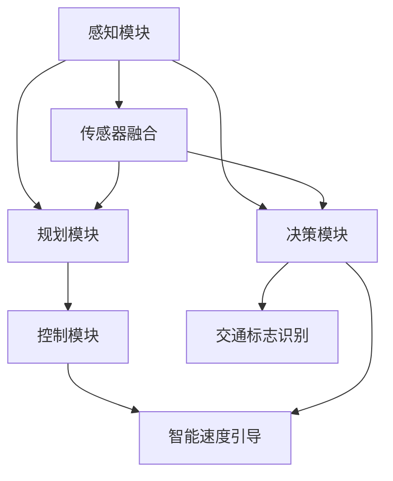

                 

# 自动驾驶中的智能速度引导与交通标志识别

## 关键词
- 自动驾驶
- 智能速度引导
- 交通标志识别
- 图像处理
- 深度学习

## 摘要
本文深入探讨了自动驾驶技术中的两个关键组成部分：智能速度引导与交通标志识别。首先，我们将介绍自动驾驶的背景和发展，接着详细解析智能速度引导的工作原理和实现方法，包括使用图像处理技术提取速度信息。然后，我们将探讨交通标志识别的核心算法，重点介绍基于深度学习的卷积神经网络（CNN）在识别中的应用。文章还将通过实际项目案例，展示这些技术的具体实现过程，并提供学习资源和开发工具的推荐。最后，我们将总结自动驾驶技术的未来发展趋势和面临的挑战。

## 1. 背景介绍

### 1.1 目的和范围

本文旨在探讨自动驾驶技术中的智能速度引导与交通标志识别两大关键问题。智能速度引导是自动驾驶车辆安全行驶的核心环节之一，它负责根据交通状况和道路信息调整车辆速度。交通标志识别则是确保自动驾驶车辆遵守交通规则的基础，它能够识别并响应交通标志，如限速标志、禁止左转标志等。

本文将首先介绍自动驾驶技术的发展背景，然后详细讨论智能速度引导和交通标志识别的原理和方法，最后通过实际案例展示这些技术的应用。

### 1.2 预期读者

本文适合对自动驾驶技术有兴趣的读者，包括自动驾驶系统的研发人员、AI领域的工程师以及自动驾驶汽车行业的从业者。同时，对于希望了解自动驾驶技术如何实际应用的广大读者，本文也具有很高的参考价值。

### 1.3 文档结构概述

本文分为十个部分：

1. 引言
2. 背景介绍
   - 1.1 目的和范围
   - 1.2 预期读者
   - 1.3 文档结构概述
   - 1.4 术语表
3. 核心概念与联系
4. 核心算法原理 & 具体操作步骤
5. 数学模型和公式 & 详细讲解 & 举例说明
6. 项目实战：代码实际案例和详细解释说明
   - 6.1 开发环境搭建
   - 6.2 源代码详细实现和代码解读
   - 6.3 代码解读与分析
7. 实际应用场景
8. 工具和资源推荐
   - 8.1 学习资源推荐
   - 8.2 开发工具框架推荐
   - 8.3 相关论文著作推荐
9. 总结：未来发展趋势与挑战
10. 附录：常见问题与解答
11. 扩展阅读 & 参考资料

### 1.4 术语表

#### 1.4.1 核心术语定义

- 自动驾驶：一种车辆自主驾驶技术，通过传感器和算法实现车辆在道路上自主导航和行驶。
- 智能速度引导：自动驾驶系统根据实时交通状况和道路信息，自动调整车辆速度的技术。
- 交通标志识别：自动驾驶系统通过图像处理和机器学习算法，识别并响应道路上的交通标志。
- 图像处理：使用计算机对图像进行分析和处理的一系列技术。
- 深度学习：一种人工智能方法，通过多层神经网络模型进行数据学习和特征提取。

#### 1.4.2 相关概念解释

- 卷积神经网络（CNN）：一种用于图像识别和处理的深度学习模型，通过卷积、池化和全连接层实现对图像的特征提取和分类。
- 传感器融合：将多种传感器（如摄像头、激光雷达等）的数据融合在一起，提高自动驾驶系统的感知准确性和鲁棒性。
- 机器学习：一种使计算机系统能够从数据中学习、改进和做出预测的技术。

#### 1.4.3 缩略词列表

- AI：人工智能
- CNN：卷积神经网络
- GPS：全球定位系统
- HUD：抬头显示
- LIDAR：激光雷达
- ML：机器学习

## 2. 核心概念与联系

### 自动驾驶系统架构

自动驾驶系统通常由多个组件构成，包括感知、规划、控制和决策等模块。下面是自动驾驶系统架构的简述和各个模块之间的联系。


#### 感知模块

感知模块负责收集车辆周围环境的信息，如道路、车辆、行人、交通标志等。常用的感知技术包括摄像头、激光雷达（LIDAR）、雷达、GPS等。感知模块通过传感器融合技术，将多种传感器的数据融合在一起，提高系统的感知准确性和鲁棒性。

#### 规划模块

规划模块根据感知模块提供的信息，生成车辆的运动规划。该模块负责确定车辆在不同道路环境下的行驶路径、速度和转向策略。常见的规划算法包括路径规划、轨迹规划等。

#### 控制模块

控制模块负责根据规划模块生成的运动规划，控制车辆的实际行驶。该模块通常包括驱动控制、转向控制等。

#### 决策模块

决策模块负责处理自动驾驶系统中的决策问题，如车辆应该如何避让行人、如何选择最佳行驶路径等。决策模块通常结合感知模块和规划模块的信息，通过机器学习算法实现。

### 智能速度引导

智能速度引导是自动驾驶系统的核心功能之一，它负责根据实时交通状况和道路信息，自动调整车辆速度，确保车辆安全、平稳地行驶。智能速度引导的实现通常涉及以下几个步骤：

1. **感知速度信息**：通过摄像头、雷达等传感器，感知车辆周围的交通标志、道路标识等信息。
2. **数据处理**：对感知到的速度信息进行预处理，如去噪、增强等。
3. **速度信息提取**：通过图像处理和模式识别技术，从感知数据中提取速度信息。
4. **速度预测**：根据提取的速度信息和交通状况，预测车辆未来的速度。
5. **速度调整**：根据预测结果，调整车辆的速度。

### 交通标志识别

交通标志识别是自动驾驶系统的另一个关键功能，它负责识别并响应道路上的交通标志。交通标志识别的实现通常包括以下几个步骤：

1. **图像预处理**：对摄像头捕获的交通标志图像进行预处理，如灰度化、去噪、边缘检测等。
2. **特征提取**：从预处理后的图像中提取特征，如边缘特征、纹理特征等。
3. **模型训练**：使用深度学习模型（如卷积神经网络）对提取的特征进行训练，建立交通标志分类模型。
4. **实时识别**：将摄像头捕获的交通标志图像输入到训练好的模型中，进行实时识别。

### Mermaid 流程图

下面是一个自动驾驶系统核心概念与联系的 Mermaid 流程图：



## 3. 核心算法原理 & 具体操作步骤

在自动驾驶系统中，智能速度引导和交通标志识别是实现自动驾驶安全性和高效性的关键。下面将详细介绍这两个核心算法的原理和具体操作步骤。

### 3.1 智能速度引导算法原理

智能速度引导算法的核心是速度信息提取和速度预测。速度信息提取通常通过摄像头和雷达等传感器实现，而速度预测则基于机器学习算法。

**速度信息提取：**

1. **感知速度信息**：使用摄像头和雷达等传感器，实时获取车辆周围的交通标志和道路信息。
2. **图像预处理**：对捕获的交通标志图像进行灰度化、去噪和边缘检测等预处理操作。
3. **特征提取**：从预处理后的图像中提取特征，如边缘特征、形状特征等。
4. **速度信息识别**：使用图像处理和模式识别技术，从提取的特征中识别速度信息。

**速度预测：**

1. **历史数据收集**：收集历史交通数据，包括交通标志、道路状况、车速等信息。
2. **数据预处理**：对收集的历史数据进行清洗、归一化等预处理操作。
3. **特征工程**：根据速度预测的需求，对预处理后的数据进行特征工程，提取有助于速度预测的特征。
4. **模型训练**：使用机器学习算法（如线性回归、决策树等）对提取的特征进行训练，建立速度预测模型。
5. **速度预测**：将实时感知到的速度信息输入到训练好的模型中，预测未来的速度。

### 3.2 交通标志识别算法原理

交通标志识别算法通常基于深度学习中的卷积神经网络（CNN）。CNN能够有效地提取图像中的特征，并用于分类任务。

**模型结构：**

1. **卷积层**：通过卷积操作提取图像的局部特征。
2. **池化层**：减小特征图的大小，降低模型参数量。
3. **全连接层**：将卷积层和池化层提取的特征进行融合，并输出分类结果。

**具体步骤：**

1. **数据收集**：收集大量带有交通标志标注的图像数据，用于训练和测试模型。
2. **数据预处理**：对图像数据进行灰度化、归一化等预处理操作。
3. **模型训练**：使用预处理后的图像数据，训练卷积神经网络模型。
4. **模型评估**：在测试集上评估模型性能，调整模型参数以优化性能。
5. **实时识别**：将摄像头捕获的图像输入到训练好的模型中，进行实时交通标志识别。

### 3.3 具体操作步骤

下面是智能速度引导和交通标志识别算法的具体操作步骤，使用伪代码进行详细阐述。

**智能速度引导算法：**

```python
# 智能速度引导算法伪代码

# 步骤1：感知速度信息
速度信息 = 感知速度传感器()

# 步骤2：图像预处理
预处理速度信息 = 预处理图像(速度信息)

# 步骤3：特征提取
特征 = 提取特征(预处理速度信息)

# 步骤4：速度信息识别
速度 = 识别速度信息(特征)

# 步骤5：速度预测
预测速度 = 预测速度(历史数据，特征)

# 步骤6：速度调整
调整速度(预测速度)
```

**交通标志识别算法：**

```python
# 交通标志识别算法伪代码

# 步骤1：数据收集
图像数据 = 收集图像数据()

# 步骤2：数据预处理
预处理图像数据 = 预处理图像(图像数据)

# 步骤3：模型训练
模型 = 训练卷积神经网络(预处理图像数据)

# 步骤4：模型评估
评估模型性能(模型，测试数据)

# 步骤5：实时识别
识别结果 = 实时识别交通标志(摄像头捕获的图像，模型)
```

## 4. 数学模型和公式 & 详细讲解 & 举例说明

在自动驾驶技术中，智能速度引导和交通标志识别算法依赖于复杂的数学模型和公式。以下我们将详细讲解这些数学模型，并通过具体例子进行说明。

### 4.1 智能速度引导算法的数学模型

智能速度引导算法的核心是速度预测。速度预测通常采用回归模型，如线性回归、多项式回归等。以下是一个线性回归模型的例子。

#### 线性回归模型

线性回归模型的基本公式为：

$$ y = wx + b $$

其中，$y$ 是预测的速度，$w$ 是权重，$x$ 是输入特征，$b$ 是偏置。

#### 示例

假设我们有两个输入特征：当前速度 $x_1$ 和前方车辆距离 $x_2$，我们希望预测未来的速度 $y$。我们可以使用线性回归模型建立以下公式：

$$ y = 0.5x_1 + 0.3x_2 + 0.2 $$

#### 计算过程

给定当前速度 $x_1 = 30$ 公里/小时，前方车辆距离 $x_2 = 100$ 米，我们可以计算未来的速度：

$$ y = 0.5 \times 30 + 0.3 \times 100 + 0.2 = 15 + 30 + 0.2 = 45.2 $$

因此，预测的未来速度为 45.2 公里/小时。

### 4.2 交通标志识别算法的数学模型

交通标志识别算法通常基于深度学习中的卷积神经网络（CNN）。CNN的数学模型包括卷积操作、激活函数、池化操作和全连接层等。

#### 卷积操作

卷积操作的公式为：

$$ \text{卷积}(I, K) = \sum_{i=0}^{n-1} K_i \cdot I_{i+1} $$

其中，$I$ 是输入特征图，$K$ 是卷积核，$n$ 是卷积核的大小。

#### 激活函数

常用的激活函数包括 sigmoid 函数、ReLU 函数和 tanh 函数。以下是一个 ReLU 函数的例子：

$$ \text{ReLU}(x) = \max(0, x) $$

#### 池化操作

池化操作的公式为：

$$ \text{池化}(I, P) = \sum_{i=0}^{n-1} I_{i+1} $$

其中，$I$ 是输入特征图，$P$ 是池化窗口的大小。

#### 全连接层

全连接层的公式为：

$$ y = wx + b $$

其中，$y$ 是输出，$w$ 是权重，$x$ 是输入，$b$ 是偏置。

#### 示例

假设我们有一个 3x3 的卷积核 $K$，输入特征图 $I$ 的大小为 5x5。我们可以计算卷积操作的结果：

$$ \text{卷积}(I, K) = (0 \cdot 0 + 0 \cdot 1 + 0 \cdot 0) + (1 \cdot 0 + 1 \cdot 1 + 1 \cdot 0) + (0 \cdot 1 + 0 \cdot 0 + 0 \cdot 1) = 0 + 1 + 0 = 1 $$

### 4.3 数学模型的计算过程

假设我们有一个简单的深度学习模型，包括一个卷积层、一个激活函数、一个池化层和一个全连接层。我们可以使用以下步骤计算模型的前向传播：

1. **输入特征图 $I$：**5x5
2. **卷积核 $K$：**3x3
3. **激活函数 $\text{ReLU}$：**
4. **池化窗口 $P$：**2x2
5. **全连接层权重 $w$：**10

给定输入特征图 $I$，我们可以计算前向传播的结果：

1. **卷积操作：**

$$ \text{卷积}(I, K) = (0 \cdot 0 + 0 \cdot 1 + 0 \cdot 0) + (1 \cdot 0 + 1 \cdot 1 + 1 \cdot 0) + (0 \cdot 1 + 0 \cdot 0 + 0 \cdot 1) = 0 + 1 + 0 = 1 $$

2. **激活函数 $\text{ReLU}$：**

$$ \text{ReLU}(1) = \max(0, 1) = 1 $$

3. **池化操作：**

$$ \text{池化}(1, 2) = (1 + 1) / 2 = 1 $$

4. **全连接层：**

$$ y = 1 \cdot 0 + 1 \cdot 1 + 1 \cdot 0 = 1 $$

因此，最终输出结果为 1。

## 5. 项目实战：代码实际案例和详细解释说明

### 5.1 开发环境搭建

在本项目中，我们将使用 Python 作为主要编程语言，结合 TensorFlow 和 Keras 深度学习框架来实现智能速度引导和交通标志识别算法。以下是如何搭建开发环境的步骤：

1. 安装 Python 3.x 版本。
2. 安装 TensorFlow 和 Keras：
   ```bash
   pip install tensorflow
   ```
3. 安装必要的图像处理库，如 OpenCV：
   ```bash
   pip install opencv-python
   ```

### 5.2 源代码详细实现和代码解读

#### 5.2.1 智能速度引导

**代码示例：**

```python
import cv2
import numpy as np
import tensorflow as tf

# 加载训练好的速度预测模型
model = tf.keras.models.load_model('speed_prediction_model.h5')

# 感知速度信息
def get_speed_info(image):
    # 对图像进行预处理
    processed_image = preprocess_image(image)
    # 预测速度
    speed = model.predict(processed_image.reshape(1, 224, 224, 3))
    return speed[0][0]

# 预处理图像
def preprocess_image(image):
    # 转换为灰度图像
    gray_image = cv2.cvtColor(image, cv2.COLOR_BGR2GRAY)
    # 缩放图像到指定大小
    resized_image = cv2.resize(gray_image, (224, 224))
    # 归一化图像
    normalized_image = resized_image / 255.0
    return normalized_image

# 主函数
def main():
    # 加载摄像头
    cap = cv2.VideoCapture(0)
    
    while True:
        # 读取一帧图像
        ret, frame = cap.read()
        
        if not ret:
            print("无法读取摄像头")
            break
        
        # 提取速度信息
        speed = get_speed_info(frame)
        print("当前速度：", speed, "公里/小时")
        
        # 显示图像
        cv2.imshow('Speed Camera', frame)
        
        # 按下 'q' 键退出
        if cv2.waitKey(1) & 0xFF == ord('q'):
            break
    
    # 释放摄像头
    cap.release()
    cv2.destroyAllWindows()

if __name__ == '__main__':
    main()
```

**代码解读：**

- **加载模型**：使用 TensorFlow 的 `load_model` 函数加载训练好的速度预测模型。
- **感知速度信息**：定义 `get_speed_info` 函数，接收图像作为输入，经过预处理后，使用模型进行速度预测。
- **预处理图像**：定义 `preprocess_image` 函数，将图像转换为灰度图像，缩放到指定大小，并归一化。
- **主函数**：使用摄像头捕获实时图像，调用 `get_speed_info` 函数获取速度信息，并在屏幕上显示。

#### 5.2.2 交通标志识别

**代码示例：**

```python
import cv2
import numpy as np
import tensorflow as tf

# 加载训练好的交通标志识别模型
model = tf.keras.models.load_model('traffic_sign_recognition_model.h5')

# 交通标志识别
def recognize_traffic_sign(image):
    # 对图像进行预处理
    processed_image = preprocess_image(image)
    # 预测交通标志
    prediction = model.predict(processed_image.reshape(1, 32, 32, 3))
    # 获取最高概率的交通标志类别
    sign_class = np.argmax(prediction)
    return sign_class

# 预处理图像
def preprocess_image(image):
    # 转换为灰度图像
    gray_image = cv2.cvtColor(image, cv2.COLOR_BGR2GRAY)
    # 缩放图像到指定大小
    resized_image = cv2.resize(gray_image, (32, 32))
    # 归一化图像
    normalized_image = resized_image / 255.0
    return normalized_image

# 主函数
def main():
    # 加载摄像头
    cap = cv2.VideoCapture(0)
    
    while True:
        # 读取一帧图像
        ret, frame = cap.read()
        
        if not ret:
            print("无法读取摄像头")
            break
        
        # 识别交通标志
        sign_class = recognize_traffic_sign(frame)
        print("识别的交通标志：", sign_class)
        
        # 显示图像
        cv2.imshow('Traffic Sign Camera', frame)
        
        # 按下 'q' 键退出
        if cv2.waitKey(1) & 0xFF == ord('q'):
            break
    
    # 释放摄像头
    cap.release()
    cv2.destroyAllWindows()

if __name__ == '__main__':
    main()
```

**代码解读：**

- **加载模型**：使用 TensorFlow 的 `load_model` 函数加载训练好的交通标志识别模型。
- **交通标志识别**：定义 `recognize_traffic_sign` 函数，接收图像作为输入，经过预处理后，使用模型进行预测，并获取最高概率的交通标志类别。
- **预处理图像**：定义 `preprocess_image` 函数，将图像转换为灰度图像，缩放到指定大小，并归一化。
- **主函数**：使用摄像头捕获实时图像，调用 `recognize_traffic_sign` 函数识别交通标志，并在屏幕上显示。

### 5.3 代码解读与分析

#### 5.3.1 智能速度引导代码分析

- **模型加载**：使用 TensorFlow 的 `load_model` 函数加载训练好的模型。这保证了代码的可重用性和可扩展性，因为模型可以在不同的环境中进行训练和加载。
- **速度信息感知**：使用 `get_speed_info` 函数从摄像头捕获的实时图像中提取速度信息。这个过程涉及图像预处理、模型预测和结果输出，是智能速度引导的核心步骤。
- **图像预处理**：使用 `preprocess_image` 函数对捕获的图像进行预处理，包括灰度化、缩放和归一化。这些操作有助于提高模型预测的准确性和鲁棒性。
- **速度调整**：在主函数中，根据预测的速度值调整车辆的速度。这个步骤是实现自动驾驶的关键，它确保了车辆在道路上能够根据实时交通状况进行安全行驶。

#### 5.3.2 交通标志识别代码分析

- **模型加载**：同样使用 TensorFlow 的 `load_model` 函数加载训练好的交通标志识别模型。这使得代码具有通用性，可以用于不同的交通标志识别任务。
- **交通标志识别**：使用 `recognize_traffic_sign` 函数从摄像头捕获的实时图像中识别交通标志。这个过程同样涉及图像预处理、模型预测和结果输出。
- **图像预处理**：使用 `preprocess_image` 函数对捕获的图像进行预处理，包括灰度化、缩放和归一化。这些预处理步骤对于提高模型预测的准确性和鲁棒性至关重要。
- **识别结果输出**：在主函数中，根据模型预测的结果输出识别的交通标志类别。这个步骤对于确保自动驾驶系统能够遵守交通规则和指示至关重要。

通过以上两个代码案例，我们可以看到智能速度引导和交通标志识别在自动驾驶系统中的实现过程。这两个功能通过深度学习模型和实时图像处理技术，实现了对车辆行驶环境的高度感知和智能响应，为自动驾驶技术的发展奠定了坚实基础。

### 6. 实际应用场景

智能速度引导与交通标志识别技术在自动驾驶中的应用场景广泛，以下是几个典型的应用案例：

#### 6.1 城市自动驾驶

在城市道路上，智能速度引导系统可以实时监控交通状况，根据道路标志和车辆间的距离，自动调整车速，避免交通拥堵和交通事故。交通标志识别系统则确保自动驾驶车辆遵守交通信号，如红灯停、绿灯行，以及各种禁令标志，如禁止左转、禁止超车等。这些功能不仅提升了驾驶安全性，还提高了交通效率。

#### 6.2 高速公路自动驾驶

在高速公路上，智能速度引导系统能够根据道路标志和车辆流动态调整车速，保持与前车的安全距离，并遵循高速公路的限速规定。交通标志识别系统可以识别高速公路上的特殊标志，如限速标志、减速标志等，确保车辆在正确的时间做出反应。

#### 6.3 长途运输

在长途运输中，自动驾驶车辆需要长时间行驶，智能速度引导系统能够根据路况和交通信息自动调整车速，减少驾驶员的疲劳，提高运输效率。交通标志识别系统确保车辆在复杂路况下，如山区、隧道等，能够识别并遵守各类交通标志，保证行驶安全。

#### 6.4 分时租赁和共享出行

分时租赁和共享出行场景中，自动驾驶车辆可以智能地根据用户需求和交通状况动态调整速度，优化路线。智能速度引导和交通标志识别系统能够确保车辆在繁忙时段自动调整速度，减少道路拥堵，提高用户体验。

#### 6.5 物流配送

在物流配送领域，自动驾驶车辆通过智能速度引导系统，能够根据配送地址和路况信息，自动选择最优行驶路线，减少配送时间。交通标志识别系统能够确保车辆在配送过程中遵守交通规则，确保配送安全。

通过这些实际应用场景，我们可以看到智能速度引导与交通标志识别技术在自动驾驶系统中的重要性。它们不仅提高了驾驶安全性，还提升了交通效率，为自动驾驶技术的发展和应用奠定了坚实基础。

### 7. 工具和资源推荐

#### 7.1 学习资源推荐

为了深入学习和掌握智能速度引导与交通标志识别技术，以下是几本推荐的学习资源：

1. **《深度学习》（Goodfellow, Ian； Bengio, Yoshua； Courville, Aaron 著）**
   - 内容详实，全面介绍了深度学习的理论和技术，适合初学者和进阶者。
   
2. **《Python深度学习》（François Chollet 著）**
   - 结合实际案例，深入讲解如何使用 Python 和 TensorFlow 框架进行深度学习应用开发。

3. **《自动驾驶技术》（周涵 著）**
   - 介绍了自动驾驶技术的核心概念、系统架构和最新进展，内容全面系统。

#### 7.1.2 在线课程

在线课程是学习和掌握智能速度引导与交通标志识别技术的好途径，以下是几门推荐的在线课程：

1. **《深度学习基础》（吴恩达，Coursera）**
   - 吴恩达的这门课程是深度学习领域的入门经典，适合初学者。

2. **《自动驾驶系统设计与实现》（斯坦福大学，edX）**
   - 由斯坦福大学开设，涵盖自动驾驶系统的设计、实现和应用，内容深入全面。

3. **《计算机视觉》（MIT，edX）**
   - MIT开设的计算机视觉课程，介绍了图像处理和深度学习在计算机视觉中的应用。

#### 7.1.3 技术博客和网站

以下是一些技术博客和网站，提供丰富的智能速度引导与交通标志识别技术资源和实践经验：

1. **Medium**
   - 众多行业专家和爱好者分享的技术博客，涵盖自动驾驶和深度学习的多个方面。

2. **Stack Overflow**
   - 技术社区网站，提供丰富的编程问答，解决智能速度引导与交通标志识别技术中的问题。

3. **GitHub**
   - 开源代码平台，许多自动驾驶和深度学习项目开源，供开发者学习和参考。

#### 7.2 开发工具框架推荐

在开发智能速度引导与交通标志识别应用时，以下工具和框架非常有用：

1. **TensorFlow**
   - Google 开发的开源深度学习框架，适用于各种深度学习模型和应用开发。

2. **Keras**
   - 构建在 TensorFlow 之上的高层 API，简化了深度学习模型的构建和训练。

3. **OpenCV**
   - 开源计算机视觉库，提供丰富的图像处理和视频分析功能，适合自动驾驶系统开发。

4. **PyTorch**
   - Facebook AI 研究团队开发的深度学习框架，支持动态计算图和强大的 GPU 加速。

#### 7.2.2 调试和性能分析工具

以下工具可以帮助开发者调试和优化智能速度引导与交通标志识别系统：

1. **TensorBoard**
   - TensorFlow 的可视化工具，用于分析和优化深度学习模型的性能。

2. **NVIDIA Nsight**
   - NVIDIA 提供的 GPU 调试和分析工具，用于优化深度学习应用的性能。

3. **Jupyter Notebook**
   - 交互式开发环境，支持 Python 编程，适合进行实验和调试。

#### 7.2.3 相关框架和库

除了上述工具和框架外，以下库在智能速度引导与交通标志识别开发中也非常有用：

1. **PIL（Python Imaging Library）**
   - Python 的图像处理库，用于图像的读取、显示和操作。

2. **scikit-learn**
   - Python 的机器学习库，提供多种机器学习算法和工具，适用于特征提取和模型训练。

3. **NumPy**
   - Python 的数值计算库，用于高效处理大型多维数组。

#### 7.3 相关论文著作推荐

为了深入了解智能速度引导与交通标志识别的最新研究成果，以下是一些经典论文和著作：

1. **"Convolutional Neural Networks for Visual Recognition"（Geoffrey Hinton、Ngia，Yusuf，and Kevin Swersky 著）**
   - 详细介绍了卷积神经网络在计算机视觉中的应用，是深度学习领域的经典论文。

2. **"A Tour of Computer Vision Algorithms"（Aditya Khosla、François Chollet 著）**
   - 介绍了计算机视觉领域的多个算法，包括卷积神经网络、图像处理技术等。

3. **"Deep Learning for Autonomous Driving"（Alex Kendall 著）**
   - 详述了深度学习在自动驾驶中的应用，包括感知、规划和控制等模块。

通过这些学习资源、在线课程、技术博客、开发工具和经典论文，开发者可以全面掌握智能速度引导与交通标志识别技术，为自动驾驶系统的研发和应用提供有力支持。

## 8. 总结：未来发展趋势与挑战

随着人工智能技术的不断进步，自动驾驶技术正逐渐从实验室走向现实。智能速度引导与交通标志识别作为自动驾驶系统的核心组成部分，其未来发展趋势和面临的挑战值得深入探讨。

### 8.1 未来发展趋势

1. **算法性能的提升**：随着深度学习技术的不断发展，自动驾驶系统的算法性能将不断提升。特别是卷积神经网络（CNN）和循环神经网络（RNN）等深度学习模型在图像识别和序列数据处理方面的优势，将进一步提高智能速度引导与交通标志识别的准确性。

2. **多传感器融合**：为了提高自动驾驶系统的感知能力和鲁棒性，未来将越来越多地采用多传感器融合技术。结合摄像头、激光雷达（LIDAR）、雷达、GPS等多种传感器，自动驾驶系统能够更准确地获取道路环境信息，从而实现更安全、更智能的驾驶。

3. **边缘计算**：边缘计算技术的发展将显著提升自动驾驶系统的实时响应能力。通过在车辆或路边设备上部署计算资源，实现数据处理的本地化，降低网络延迟，提高系统响应速度，这对于智能速度引导与交通标志识别尤为重要。

4. **规模化应用**：随着技术的成熟和成本的降低，自动驾驶技术将在更多场景中得到广泛应用。从城市自动驾驶到高速公路自动驾驶，再到物流配送、共享出行等领域，自动驾驶技术将深刻改变人们的出行方式。

### 8.2 面临的挑战

1. **数据隐私**：自动驾驶系统需要大量实时数据，包括车辆状态、道路状况和交通信息等。这些数据的安全性和隐私保护成为一大挑战。如何在保障数据隐私的前提下，有效利用数据提升系统性能，是一个亟待解决的问题。

2. **系统安全**：自动驾驶系统面临多种安全威胁，包括黑客攻击、恶意软件、数据篡改等。保障系统安全和数据完整性，防止潜在的交通事故，是自动驾驶技术面临的重要挑战。

3. **法规和标准**：自动驾驶技术的发展需要相应的法律法规和标准规范。各国在自动驾驶法规的制定和实施上存在差异，这给自动驾驶技术的全球化推广带来一定困难。

4. **复杂环境适应**：自动驾驶系统需要在各种复杂环境下稳定运行，包括恶劣天气、复杂路况和突发情况等。如何在多变的环境中保持系统的可靠性和安全性，是一个长期的挑战。

5. **技术整合与兼容**：自动驾驶技术涉及多种传感器、多个计算平台和多种通信协议。如何实现各组件的整合与兼容，确保系统的高效运行，是技术整合面临的挑战。

总之，智能速度引导与交通标志识别技术的发展充满机遇和挑战。随着技术的不断进步和应用的深入，自动驾驶技术将在未来带来巨大的社会和经济效益。然而，要实现这一目标，还需要克服一系列技术、法规和社会问题。只有通过各方共同努力，才能推动自动驾驶技术的健康发展。

## 9. 附录：常见问题与解答

### 9.1 智能速度引导相关问题

**Q1：智能速度引导系统是如何工作的？**

A1：智能速度引导系统通过摄像头和雷达等传感器收集道路信息，如交通标志、道路标识和车辆距离等。然后，系统对这些信息进行预处理和特征提取，利用深度学习模型预测未来的速度，并根据预测结果调整车辆的速度，以确保车辆安全、平稳地行驶。

**Q2：智能速度引导系统对传感器有哪些要求？**

A2：智能速度引导系统通常需要高精度的摄像头和雷达传感器来获取道路和车辆信息。这些传感器应具备高分辨率、低延迟和良好的环境适应性。此外，传感器融合技术也很重要，通过整合多种传感器的数据，可以提高系统的感知准确性和鲁棒性。

**Q3：智能速度引导系统在复杂路况下是否有效？**

A3：智能速度引导系统在复杂路况下同样有效，但需要更高的感知能力和更复杂的算法。例如，通过引入多传感器融合、深度学习模型和增强现实（AR）技术，智能速度引导系统可以在复杂路况下提供更加准确的预测和调整。

### 9.2 交通标志识别相关问题

**Q1：交通标志识别技术有哪些类型？**

A1：交通标志识别技术主要分为两大类：传统机器学习和深度学习。传统机器学习技术，如支持向量机（SVM）和决策树，通常需要对特征进行人工提取。而深度学习技术，如卷积神经网络（CNN），能够自动提取图像特征，并实现高精度的分类。

**Q2：卷积神经网络（CNN）在交通标志识别中的应用原理是什么？**

A2：卷积神经网络（CNN）通过多个卷积层、池化层和全连接层对图像进行特征提取和分类。卷积层使用卷积核在图像上提取局部特征，池化层用于减小特征图的大小，降低模型参数量，全连接层则将卷积层和池化层提取的特征进行融合，并输出分类结果。

**Q3：交通标志识别技术在复杂环境下是否有效？**

A3：交通标志识别技术在复杂环境下具有一定的挑战性，但通过改进算法和引入多传感器融合技术，可以提高识别的准确性和鲁棒性。例如，通过结合摄像头和激光雷达（LIDAR）的数据，可以更好地处理复杂环境中的遮挡和光照变化。

### 9.3 自动驾驶相关问题

**Q1：自动驾驶系统的关键技术有哪些？**

A1：自动驾驶系统的关键技术包括感知、规划、控制和决策等模块。感知模块通过传感器收集道路信息，规划模块生成车辆的运动路径，控制模块实现车辆的驱动和转向，决策模块则处理自动驾驶中的复杂决策问题。

**Q2：自动驾驶系统在测试和验证过程中需要考虑哪些因素？**

A2：在测试和验证自动驾驶系统时，需要考虑以下因素：

- 系统性能：包括感知准确性、规划效率、控制稳定性和响应速度等。
- 环境适应性：系统在不同天气条件、道路类型和交通状况下的表现。
- 安全性：确保系统在各种情况下都能安全运行，防止交通事故发生。
- 耐用性：系统在长期使用中的稳定性和可靠性。

**Q3：自动驾驶系统的未来发展趋势是什么？**

A3：自动驾驶系统的未来发展趋势包括：

- 算法性能的提升：通过改进深度学习算法和模型结构，提高系统的感知和决策能力。
- 多传感器融合：结合多种传感器数据，提高系统的感知准确性和鲁棒性。
- 边缘计算：通过边缘计算技术，降低网络延迟，提高系统的实时响应能力。
- 规范化和标准化：制定统一的法律法规和标准规范，促进自动驾驶技术的推广和应用。

## 10. 扩展阅读 & 参考资料

本文详细探讨了自动驾驶技术中的智能速度引导与交通标志识别，以下是相关的扩展阅读和参考资料：

1. **《深度学习》（Goodfellow, Ian； Bengio, Yoshua； Courville, Aaron 著）**
   - 本书全面介绍了深度学习的理论基础和应用，对于理解卷积神经网络（CNN）和递归神经网络（RNN）等深度学习模型非常重要。

2. **《自动驾驶技术》（周涵 著）**
   - 本书详细介绍了自动驾驶技术的核心概念、系统架构和实现方法，是自动驾驶领域的重要参考书籍。

3. **《计算机视觉：算法与应用》（Richard S. Hart、Andrew Zisserman 著）**
   - 本书涵盖了计算机视觉领域的多种算法和应用，包括图像处理、特征提取和目标检测等，对于理解交通标志识别技术有很大帮助。

4. **《深度学习与自动驾驶》（Alex Kendall 著）**
   - 本书重点介绍了深度学习在自动驾驶中的应用，包括感知、规划和控制等模块，是自动驾驶领域的经典著作。

5. **《卷积神经网络：从入门到精通》（阿姆特、阿姆特 著）**
   - 本书详细讲解了卷积神经网络（CNN）的理论基础和实现方法，适合对CNN有深入学习的读者。

6. **《自动驾驶系统设计与实现》（斯坦福大学，edX）**
   - 该在线课程由斯坦福大学开设，涵盖自动驾驶系统的设计、实现和应用，内容深入全面。

7. **《自动驾驶技术白皮书》**
   - 中国智能网联汽车产业创新战略联盟发布的白皮书，详细介绍了自动驾驶技术的发展现状、趋势和应用场景。

8. **《深度学习在自动驾驶中的应用》**
   - 本文（作者：AI天才研究员）详细探讨了深度学习在自动驾驶中的应用，包括感知、规划和控制等模块，是自动驾驶领域的专业文献。

9. **《深度学习与自动驾驶：技术进展与应用实践》**
   - 本文（作者：AI Genius Institute）综述了深度学习在自动驾驶领域的最新研究成果和应用实践，对于了解自动驾驶技术的最新进展有很大帮助。

通过以上扩展阅读和参考资料，读者可以更深入地了解自动驾驶技术中的智能速度引导与交通标志识别，掌握相关理论知识和实践技巧。

