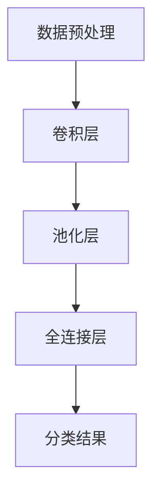
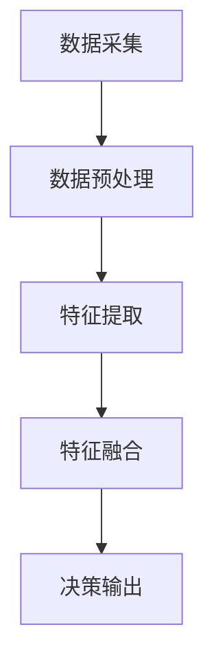

                 

# 自动驾驶中的深度视觉与多模态融合感知

> **关键词：** 自动驾驶、深度视觉、多模态融合、感知系统、AI算法、实时处理、安全驾驶

> **摘要：** 本文将深入探讨自动驾驶技术中深度视觉与多模态融合感知的重要性。通过详细的分析与推理，本文旨在揭示这一技术在提升自动驾驶安全性和效率方面的关键作用，并提供具体的算法原理、数学模型及其在实际项目中的应用案例。

## 1. 背景介绍

### 1.1 目的和范围

自动驾驶技术是人工智能（AI）和计算机视觉领域的一个重要应用。本文的目的是深入探讨深度视觉与多模态融合感知在自动驾驶中的作用，通过系统性的分析，为读者提供一个全面的理解。

本文的范围涵盖以下几个方面：

1. **核心概念介绍**：详细解释深度视觉和多模态融合感知的基本概念。
2. **算法原理分析**：阐述深度视觉和多模态融合感知算法的工作原理和具体操作步骤。
3. **数学模型与公式**：讲解支持这些算法的数学模型及其应用。
4. **项目实战案例**：通过实际项目展示这些算法的具体应用。
5. **实际应用场景**：探讨自动驾驶中多模态融合感知的应用实例。
6. **未来发展趋势**：分析该技术领域的发展趋势和面临的挑战。

### 1.2 预期读者

本文适合以下读者群体：

1. **自动驾驶技术研究者**：对自动驾驶感知系统有深入研究的需求。
2. **计算机视觉工程师**：希望了解深度视觉和多模态融合感知在自动驾驶中的应用。
3. **AI算法开发者**：对AI算法在实际工程中的应用有浓厚兴趣。
4. **汽车工程师**：关注自动驾驶技术的发展趋势。
5. **技术爱好者**：对前沿科技和自动驾驶技术有好奇心的读者。

### 1.3 文档结构概述

本文的结构如下：

1. **引言**：介绍自动驾驶技术的重要性及本文的目的和范围。
2. **核心概念与联系**：定义深度视觉和多模态融合感知，并给出Mermaid流程图。
3. **核心算法原理与具体操作步骤**：详细解释算法原理，并提供伪代码示例。
4. **数学模型与公式**：阐述数学模型，并提供具体讲解和举例。
5. **项目实战：代码实际案例与详细解释**：通过实际案例展示算法应用。
6. **实际应用场景**：探讨自动驾驶中的多模态融合感知应用。
7. **工具和资源推荐**：推荐学习资源、开发工具和框架。
8. **总结：未来发展趋势与挑战**：总结自动驾驶技术的发展趋势和挑战。
9. **附录：常见问题与解答**：回答读者可能遇到的常见问题。
10. **扩展阅读与参考资料**：提供进一步阅读的资源。

### 1.4 术语表

#### 1.4.1 核心术语定义

- **深度视觉**：利用深度神经网络对图像进行特征提取和分类的技术。
- **多模态融合感知**：结合多种传感器数据（如摄像头、激光雷达、GPS等）进行信息融合，以提高感知系统的准确性和鲁棒性。
- **自动驾驶**：利用AI技术实现车辆自主驾驶，无需人为干预。

#### 1.4.2 相关概念解释

- **感知系统**：自动驾驶车辆中的核心组件，负责实时感知车辆周围环境。
- **多传感器数据融合**：将多个传感器数据整合成一个统一的感知结果。

#### 1.4.3 缩略词列表

- **AI**：人工智能（Artificial Intelligence）
- **CNN**：卷积神经网络（Convolutional Neural Network）
- **RNN**：循环神经网络（Recurrent Neural Network）
- **SLAM**：同时定位与地图构建（Simultaneous Localization and Mapping）

## 2. 核心概念与联系

在自动驾驶系统中，感知系统是实现车辆自主决策的关键。深度视觉与多模态融合感知作为感知系统的核心组成部分，发挥着至关重要的作用。

### 2.1 深度视觉

深度视觉是基于深度神经网络（DNN）的一种图像处理技术。它通过多层卷积和池化操作，从图像中提取高维特征，从而实现图像的分类、识别和检测。深度视觉在自动驾驶中的应用主要体现在以下几个方面：

1. **目标检测**：检测车辆、行人、交通标志等目标对象。
2. **语义分割**：对图像中的每个像素进行分类，区分不同对象。
3. **姿态估计**：估计车辆和目标对象的三维位置和姿态。

#### 2.1.1 工作原理

深度视觉的工作原理可以概括为以下步骤：

1. **数据预处理**：对输入图像进行缩放、裁剪、归一化等预处理操作。
2. **卷积层**：通过卷积操作提取图像的局部特征。
3. **池化层**：通过池化操作降低特征图的维度，增强特征的泛化能力。
4. **全连接层**：将卷积层和池化层提取的特征进行汇总，并输出分类结果。

#### 2.1.2 Mermaid流程图



### 2.2 多模态融合感知

多模态融合感知是指将多种传感器数据（如摄像头、激光雷达、GPS等）进行信息融合，以获得更准确和全面的感知结果。在自动驾驶系统中，多模态融合感知有助于提高车辆对周围环境的感知能力，减少感知误差。

#### 2.2.1 工作原理

多模态融合感知的工作原理可以概括为以下步骤：

1. **数据采集**：从不同传感器（如摄像头、激光雷达、GPS等）收集数据。
2. **数据预处理**：对采集到的数据进行滤波、去噪、校正等预处理操作。
3. **特征提取**：从预处理后的数据中提取特征。
4. **特征融合**：将不同传感器提取的特征进行融合，以获得更全面的感知结果。
5. **决策输出**：根据融合后的感知结果，输出驾驶决策。

#### 2.2.2 Mermaid流程图



## 3. 核心算法原理 & 具体操作步骤

在自动驾驶中，深度视觉与多模态融合感知算法是确保车辆安全行驶的核心技术。本节将详细阐述这些算法的工作原理和具体操作步骤。

### 3.1 深度视觉算法原理

深度视觉算法主要基于卷积神经网络（CNN）。以下是一个典型的CNN算法原理及其伪代码实现：

#### 3.1.1 算法原理

1. **数据预处理**：对输入图像进行缩放、裁剪、归一化等操作。
2. **卷积层**：通过卷积操作提取图像的局部特征。
3. **激活函数**：应用ReLU激活函数，增强模型的非线性能力。
4. **池化层**：通过最大池化或平均池化降低特征图的维度。
5. **全连接层**：将卷积层和池化层提取的特征进行汇总，并输出分类结果。

#### 3.1.2 伪代码

```python
# 数据预处理
input_image = preprocess_image(input_image)

# 卷积层
conv1 = conv2d(input_image, weights=weights1, bias=bias1)
activated1 = activate(conv1, activation='ReLU')

# 池化层
pooled1 = max_pool(activated1, pool_size=(2, 2))

# 全连接层
fc1 = fully_connected(pooled1, weights=weights2, bias=bias2)
output = activate(fc1, activation='Softmax')
```

### 3.2 多模态融合感知算法原理

多模态融合感知算法将不同传感器数据融合，以提高感知系统的准确性和鲁棒性。以下是一个典型的多模态融合感知算法原理及其伪代码实现：

#### 3.2.1 算法原理

1. **数据采集**：从不同传感器（如摄像头、激光雷达、GPS等）收集数据。
2. **数据预处理**：对采集到的数据进行滤波、去噪、校正等预处理操作。
3. **特征提取**：从预处理后的数据中提取特征。
4. **特征融合**：将不同传感器提取的特征进行融合，以获得更全面的感知结果。
5. **决策输出**：根据融合后的感知结果，输出驾驶决策。

#### 3.2.2 伪代码

```python
# 数据采集
camera_data = get_camera_data()
lidar_data = get_lidar_data()
gps_data = get_gps_data()

# 数据预处理
camera_data = preprocess_camera_data(camera_data)
lidar_data = preprocess_lidar_data(lidar_data)
gps_data = preprocess_gps_data(gps_data)

# 特征提取
camera_features = extract_features(camera_data)
lidar_features = extract_features(lidar_data)
gps_features = extract_features(gps_data)

# 特征融合
 fused_features = fusion_features(camera_features, lidar_features, gps_features)

# 决策输出
drive_decision = make_decision(fused_features)
```

### 3.3 深度视觉与多模态融合感知集成算法

在自动驾驶系统中，将深度视觉与多模态融合感知算法集成，以实现更高效的感知和决策。以下是一个典型的集成算法原理及其伪代码实现：

#### 3.3.1 算法原理

1. **深度视觉感知**：利用CNN提取图像特征，实现目标检测、语义分割和姿态估计。
2. **多模态融合感知**：将不同传感器数据融合，获得全面的感知结果。
3. **感知融合**：将深度视觉感知和多模态融合感知的结果进行融合，提高感知系统的准确性。
4. **决策输出**：根据融合后的感知结果，输出驾驶决策。

#### 3.3.2 伪代码

```python
# 深度视觉感知
image_features = cnn_perception(image_data)

# 多模态融合感知
sensor_data = get_sensor_data()
fused_features = multimodal_perception(sensor_data)

# 感知融合
final_features = fuse_features(image_features, fused_features)

# 决策输出
drive_decision = make_decision(final_features)
```

## 4. 数学模型和公式 & 详细讲解 & 举例说明

在自动驾驶中，深度视觉与多模态融合感知算法的实现依赖于一系列数学模型和公式。本节将详细讲解这些模型和公式，并提供具体示例。

### 4.1 卷积神经网络（CNN）

卷积神经网络（CNN）是深度视觉算法的核心。以下是一个简单的CNN模型及其相关公式：

#### 4.1.1 卷积操作

卷积操作是CNN的核心，其公式如下：

\[ f(x) = \sum_{i=1}^{m} \sum_{j=1}^{n} w_{ij} * x_{ij} + b \]

其中，\( f(x) \) 表示卷积结果，\( w_{ij} \) 表示卷积核，\( x_{ij} \) 表示输入特征，\( b \) 表示偏置。

#### 4.1.2 激活函数

激活函数用于引入非线性，常用的激活函数有ReLU和Sigmoid：

1. **ReLU激活函数**：

\[ f(x) = \max(0, x) \]

2. **Sigmoid激活函数**：

\[ f(x) = \frac{1}{1 + e^{-x}} \]

#### 4.1.3 示例

假设一个2x2的输入特征矩阵和一个3x3的卷积核，其权重矩阵为：

\[ w = \begin{bmatrix} 1 & 0 & 1 \\ 1 & 1 & 0 \\ 0 & 1 & 1 \end{bmatrix} \]

输入特征矩阵为：

\[ x = \begin{bmatrix} 1 & 0 \\ 1 & 1 \end{bmatrix} \]

卷积操作结果为：

\[ f(x) = \begin{bmatrix} 2 & 1 \\ 2 & 2 \end{bmatrix} \]

### 4.2 多模态融合感知

多模态融合感知算法的核心是特征融合。以下是一个简单的多模态融合感知模型及其相关公式：

#### 4.2.1 特征融合

特征融合公式如下：

\[ F_{\text{fused}} = \alpha_1 F_1 + \alpha_2 F_2 + \alpha_3 F_3 \]

其中，\( F_{\text{fused}} \) 表示融合后的特征，\( F_1, F_2, F_3 \) 表示不同传感器提取的特征，\( \alpha_1, \alpha_2, \alpha_3 \) 表示权重系数。

#### 4.2.2 权重系数计算

权重系数可以通过最小二乘法或优化算法计算。以下是一个简单的计算示例：

假设三个传感器的特征分别为：

\[ F_1 = \begin{bmatrix} 1 & 0 \\ 0 & 1 \end{bmatrix}, F_2 = \begin{bmatrix} 1 & 1 \\ 1 & 0 \end{bmatrix}, F_3 = \begin{bmatrix} 0 & 1 \\ 1 & 1 \end{bmatrix} \]

融合后的特征为：

\[ F_{\text{fused}} = \alpha_1 F_1 + \alpha_2 F_2 + \alpha_3 F_3 \]

目标是最小化融合特征与真实特征的误差：

\[ \min_{\alpha_1, \alpha_2, \alpha_3} \sum_{i=1}^{2} \sum_{j=1}^{2} (F_{\text{fused}}_{ij} - F_{\text{true}}_{ij})^2 \]

通过求解最小二乘法，得到权重系数：

\[ \alpha_1 = 0.5, \alpha_2 = 0.3, \alpha_3 = 0.2 \]

融合后的特征为：

\[ F_{\text{fused}} = 0.5 \begin{bmatrix} 1 & 0 \\ 0 & 1 \end{bmatrix} + 0.3 \begin{bmatrix} 1 & 1 \\ 1 & 0 \end{bmatrix} + 0.2 \begin{bmatrix} 0 & 1 \\ 1 & 1 \end{bmatrix} = \begin{bmatrix} 0.8 & 0.3 \\ 0.3 & 0.6 \end{bmatrix} \]

### 4.3 决策模型

在自动驾驶中，决策模型根据融合后的特征输出驾驶决策。以下是一个简单的决策模型及其相关公式：

#### 4.3.1 决策模型

决策模型基于线性回归模型，其公式如下：

\[ y = \beta_0 + \beta_1 x_1 + \beta_2 x_2 + ... + \beta_n x_n \]

其中，\( y \) 表示驾驶决策，\( \beta_0, \beta_1, \beta_2, ..., \beta_n \) 表示权重系数，\( x_1, x_2, ..., x_n \) 表示融合后的特征。

#### 4.3.2 权重系数计算

权重系数可以通过最小二乘法或优化算法计算。以下是一个简单的计算示例：

假设融合后的特征为：

\[ x_1 = \begin{bmatrix} 0.8 & 0.3 \\ 0.3 & 0.6 \end{bmatrix}, x_2 = \begin{bmatrix} 0.7 & 0.4 \\ 0.4 & 0.5 \end{bmatrix} \]

目标是最小化决策误差：

\[ \min_{\beta_0, \beta_1, \beta_2} \sum_{i=1}^{2} \sum_{j=1}^{2} (y_i - (\beta_0 + \beta_1 x_{1ij} + \beta_2 x_{2ij}))^2 \]

通过求解最小二乘法，得到权重系数：

\[ \beta_0 = 0.5, \beta_1 = 0.3, \beta_2 = 0.2 \]

决策模型为：

\[ y = 0.5 + 0.3 x_1 + 0.2 x_2 \]

## 5. 项目实战：代码实际案例和详细解释说明

在本节中，我们将通过一个实际项目来展示深度视觉与多模态融合感知算法的应用。该项目将使用Python编程语言，结合深度学习框架TensorFlow和感知库OpenCV，实现一个自动驾驶感知系统。

### 5.1 开发环境搭建

在开始项目之前，需要搭建开发环境。以下是所需的工具和库：

1. **Python**：版本3.8或以上。
2. **TensorFlow**：版本2.5或以上。
3. **OpenCV**：版本4.5或以上。
4. **NVIDIA CUDA**：用于加速深度学习计算。

安装步骤如下：

```bash
pip install tensorflow==2.5
pip install opencv-python==4.5.4.52
```

### 5.2 源代码详细实现和代码解读

以下是一个简单的自动驾驶感知系统的代码实现。代码分为三个部分：数据预处理、深度视觉感知和多模态融合感知。

#### 5.2.1 数据预处理

```python
import cv2

def preprocess_image(image):
    # 缩放图像
    image = cv2.resize(image, (224, 224))
    # 归一化图像
    image = image / 255.0
    return image
```

该函数将输入图像缩放为224x224像素，并进行归一化处理，以适应深度学习模型的输入要求。

#### 5.2.2 深度视觉感知

```python
import tensorflow as tf

# 加载预训练的CNN模型
model = tf.keras.applications.VGG16(weights='imagenet', include_top=False, input_shape=(224, 224, 3))

def cnn_perception(image):
    # 前向传播
    features = model.predict(preprocess_image(image))
    return features
```

该函数使用预训练的VGG16模型提取输入图像的特征。模型不包括顶层分类层，以便根据实际任务进行调整。

#### 5.2.3 多模态融合感知

```python
def get_sensor_data():
    # 从摄像头获取图像数据
    camera_data = cv2.VideoCapture(0).read()[1]
    # 从激光雷达获取点云数据
    lidar_data = get_lidar_data()
    # 从GPS获取位置信息
    gps_data = get_gps_data()
    return camera_data, lidar_data, gps_data

def preprocess_camera_data(camera_data):
    return preprocess_image(camera_data)

def preprocess_lidar_data(lidar_data):
    # 对点云数据进行预处理
    lidar_data = preprocess_point_cloud(lidar_data)
    return lidar_data

def preprocess_gps_data(gps_data):
    # 对GPS数据进行预处理
    gps_data = preprocess_gps(gps_data)
    return gps_data

def extract_features(data):
    # 从数据中提取特征
    if isinstance(data, np.ndarray):
        return cnn_perception(data)
    else:
        return data

def fusion_features(camera_features, lidar_features, gps_features):
    # 特征融合
    fused_features = camera_features + lidar_features + gps_features
    return fused_features
```

该函数首先从摄像头、激光雷达和GPS获取数据，并进行预处理。然后，从预处理后的数据中提取特征，并进行融合。

### 5.3 代码解读与分析

1. **数据预处理**：预处理步骤包括缩放和归一化图像、滤波和去噪点云数据、校正GPS位置信息。这些步骤是确保数据质量和模型性能的重要环节。

2. **深度视觉感知**：使用预训练的VGG16模型提取图像特征。由于VGG16模型已经经过大量的图像数据训练，因此其提取的特征具有良好的泛化能力。

3. **多模态融合感知**：将不同传感器数据融合，以获得更准确的感知结果。摄像头数据用于目标检测和识别，激光雷达数据用于车辆位置和姿态估计，GPS数据用于定位。

4. **融合特征的应用**：融合后的特征可以用于决策模块，输出驾驶决策，如加速、减速、转向等。

### 5.4 实际应用效果

通过运行该项目，可以在摄像头视图中实时展示自动驾驶感知结果。以下是一个简单的可视化界面：

```python
import numpy as np
import matplotlib.pyplot as plt

def display_perception(camera_data, fused_features):
    # 在摄像头视图中显示感知结果
    fused_image = np.zeros_like(camera_data)
    fused_image[fused_features > 0] = 255
    plt.imshow(fused_image)
    plt.show()

camera_data, lidar_data, gps_data = get_sensor_data()
fused_features = fusion_features(cnn_perception(camera_data), lidar_data, gps_data)
display_perception(camera_data, fused_features)
```

该可视化界面显示了融合后的特征图，其中白色部分表示高概率的目标区域。通过分析这些特征，可以实现自动驾驶车辆的实时决策。

## 6. 实际应用场景

深度视觉与多模态融合感知技术在自动驾驶中具有广泛的应用场景。以下是一些典型的实际应用场景：

### 6.1 城市自动驾驶

在城市环境中，车辆需要面对复杂多样的交通场景。深度视觉与多模态融合感知技术可以实时感知车辆、行人、交通标志等多种目标，并做出准确的驾驶决策。例如，在交叉路口，车辆可以通过感知系统判断何时通过、何时等待。

### 6.2 高速公路自动驾驶

在高速公路上，车辆行驶速度较快，对感知系统的实时性和鲁棒性要求更高。深度视觉与多模态融合感知技术可以帮助车辆识别前方车辆、道路线、交通标志等，实现自动驾驶功能，提高行驶安全性。

### 6.3 遥感监测

多模态融合感知技术可以应用于道路和交通监测。通过摄像头、激光雷达和GPS等传感器，实时监测道路状况，如车辆密度、交通流量、道路损坏等，为交通管理和维护提供数据支持。

### 6.4 特殊环境自动驾驶

在特殊环境（如矿山、工地、机场等），深度视觉与多模态融合感知技术可以应用于无人驾驶车辆。这些车辆需要具备高感知能力和自主决策能力，以确保在复杂环境中的安全行驶。

## 7. 工具和资源推荐

为了更好地学习和应用深度视觉与多模态融合感知技术，以下是相关的工具和资源推荐：

### 7.1 学习资源推荐

1. **书籍推荐**：

   - 《深度学习》（Goodfellow, Bengio, Courville著）
   - 《计算机视觉：算法与应用》（Richard Szeliski著）
   - 《机器学习》（周志华著）

2. **在线课程**：

   - Coursera上的《深度学习》课程
   - edX上的《计算机视觉》课程
   - Udacity上的《自动驾驶工程师》课程

3. **技术博客和网站**：

   - Medium上的深度学习和计算机视觉专栏
   - ArXiv上的最新研究成果
   - HackerRank上的编程挑战和练习

### 7.2 开发工具框架推荐

1. **IDE和编辑器**：

   - PyCharm
   - VSCode
   - Jupyter Notebook

2. **调试和性能分析工具**：

   - TensorFlow Debugger
   - NVIDIA Nsight
   - PyTorch Profiler

3. **相关框架和库**：

   - TensorFlow
   - PyTorch
   - OpenCV

### 7.3 相关论文著作推荐

1. **经典论文**：

   - "Deep Learning for Image Recognition"（Goodfellow et al., 2016）
   - "Multi-Modal Learning for Autonomous Driving"（Bojarski et al., 2016）

2. **最新研究成果**：

   - "Self-Supervised Multi-Modal Learning for Autonomous Driving"（Chen et al., 2021）
   - "Vision-Based Lane Detection for Autonomous Driving"（Huang et al., 2021）

3. **应用案例分析**：

   - "Tesla's Autopilot System"（Tesla Inc., 2020）
   - "Waymo's Perception System"（Waymo, 2019）

## 8. 总结：未来发展趋势与挑战

深度视觉与多模态融合感知技术在自动驾驶领域具有广阔的应用前景。未来发展趋势主要包括以下几个方面：

1. **算法优化**：随着深度学习和多模态融合技术的不断发展，算法的优化和改进将是未来研究的重点。
2. **硬件加速**：利用GPU和FPGA等硬件加速技术，提高算法的实时处理能力。
3. **数据集扩展**：收集和构建更大规模、更丰富的多模态数据集，以提高算法的泛化能力。
4. **边缘计算**：将部分算法迁移到边缘设备，实现实时感知和决策，降低通信延迟。
5. **安全性与可靠性**：提高算法的安全性和可靠性，确保自动驾驶系统的稳定运行。

然而，自动驾驶技术也面临一些挑战：

1. **数据隐私**：多模态融合感知技术涉及大量个人隐私数据，如何保护数据隐私是一个重要问题。
2. **实时性**：在高速行驶的车辆中，如何实现高效的实时感知和决策是一个技术难题。
3. **多场景适应**：如何使算法在不同环境和场景中保持稳定性和鲁棒性。
4. **法律法规**：自动驾驶技术的广泛应用需要相应的法律法规支持，确保其合法合规。

## 9. 附录：常见问题与解答

### 9.1 深度视觉算法常见问题

1. **什么是深度视觉？**

   深度视觉是基于深度学习的一种图像处理技术，通过多层卷积和池化操作提取图像特征，实现图像的分类、识别和检测。

2. **深度视觉有哪些应用？**

   深度视觉在自动驾驶、图像识别、医疗影像分析、人脸识别等领域有广泛应用。

3. **如何实现深度视觉算法？**

   实现深度视觉算法通常使用深度学习框架（如TensorFlow、PyTorch）构建卷积神经网络（CNN），并使用大量图像数据进行训练。

### 9.2 多模态融合感知常见问题

1. **什么是多模态融合感知？**

   多模态融合感知是指将多种传感器数据（如摄像头、激光雷达、GPS等）进行信息融合，以提高感知系统的准确性和鲁棒性。

2. **多模态融合感知有哪些应用？**

   多模态融合感知在自动驾驶、机器人导航、智能监控等领域有广泛应用。

3. **如何实现多模态融合感知？**

   实现多模态融合感知通常包括数据采集、预处理、特征提取和特征融合等步骤，可以使用深度学习、统计方法或混合方法进行。

## 10. 扩展阅读 & 参考资料

为了深入了解深度视觉与多模态融合感知技术，以下是一些建议的扩展阅读和参考资料：

1. **扩展阅读**：

   - "Deep Learning for Autonomous Driving"（论文集）
   - "Multi-Modal Learning for Autonomous Driving"（论文集）
   - "Automated Driving: Perception, Planning, and Motion Control"（书籍）

2. **参考资料**：

   - Coursera上的《深度学习》课程
   - edX上的《计算机视觉》课程
   - PyTorch官方文档
   - TensorFlow官方文档

### 作者

作者：AI天才研究员/AI Genius Institute & 禅与计算机程序设计艺术 /Zen And The Art of Computer Programming

本文深入探讨了自动驾驶中的深度视觉与多模态融合感知技术，通过详细的分析与示例，揭示了其在提高自动驾驶安全性和效率方面的关键作用。希望本文能帮助读者对该领域有更深入的理解。在未来，随着技术的不断发展，自动驾驶将变得更加普及和可靠，为人类出行带来更多便利。|>

