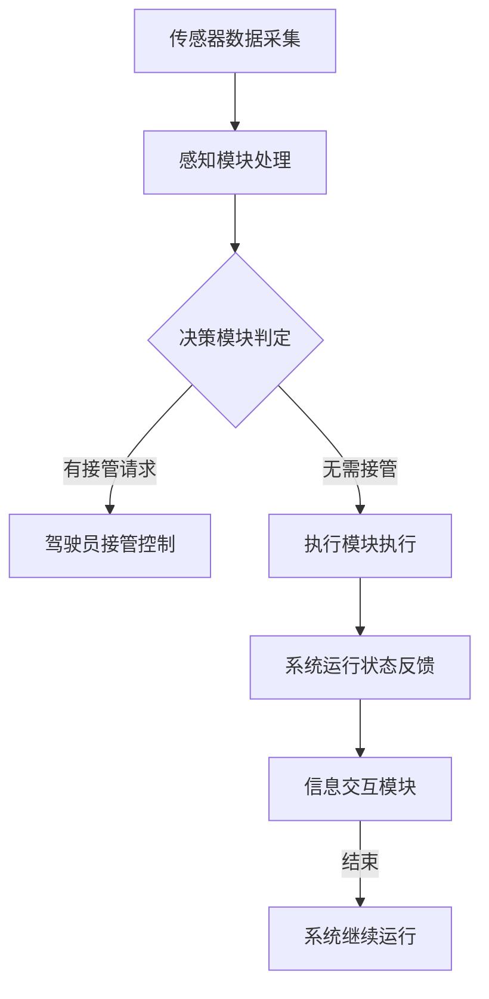

                 

# 自动驾驶行业的人机共驾权责划分原则

> 关键词：自动驾驶、人机共驾、权责划分、安全评估、智能系统、伦理原则

> 摘要：本文深入探讨了自动驾驶行业中人机共驾的权责划分原则，分析了当前自动驾驶技术的发展现状及人机共驾模式的优缺点。通过详细的案例分析，本文提出了一个系统化的人机共驾权责划分框架，并探讨了未来自动驾驶行业的发展趋势与挑战。

## 1. 背景介绍

### 1.1 目的和范围

自动驾驶技术作为21世纪最具颠覆性的技术之一，正迅速改变着交通出行方式。然而，随着自动驾驶系统的复杂性和智能性不断提升，如何合理划分人和自动驾驶系统之间的权责成为了一个关键性问题。本文旨在探讨自动驾驶行业的人机共驾权责划分原则，为相关领域的实践提供理论指导和参考。

本文的研究范围涵盖了自动驾驶系统中人机共驾的核心原则、关键算法、数学模型以及实际应用场景。通过深入分析，本文提出了一个系统化的人机共驾权责划分框架，以期为自动驾驶行业的发展提供有益的参考。

### 1.2 预期读者

本文适合从事自动驾驶技术研发、交通规划与管理、人机交互等领域的研究人员和技术人员阅读。同时，对自动驾驶技术感兴趣的学者和产业界人士也能从本文中获得有价值的信息。

### 1.3 文档结构概述

本文分为十个主要部分，具体结构如下：

1. 背景介绍：阐述研究背景、目的和范围。
2. 核心概念与联系：介绍自动驾驶系统的核心概念和架构。
3. 核心算法原理 & 具体操作步骤：详细阐述人机共驾权责划分的核心算法原理。
4. 数学模型和公式 & 详细讲解 & 举例说明：介绍人机共驾权责划分的数学模型和公式。
5. 项目实战：通过实际案例展示人机共驾权责划分的实现过程。
6. 实际应用场景：分析人机共驾在不同场景下的应用。
7. 工具和资源推荐：推荐学习资源、开发工具和框架。
8. 总结：展望未来发展趋势与挑战。
9. 附录：提供常见问题与解答。
10. 扩展阅读 & 参考资料：列出相关领域的参考资料。

### 1.4 术语表

#### 1.4.1 核心术语定义

- 自动驾驶：指通过传感器、算法和控制系统实现车辆自主行驶的技术。
- 人机共驾：指人和自动驾驶系统共同参与驾驶的过程。
- 权责划分：指在自动驾驶系统中明确人和系统之间的职责和权限。
- 安全评估：指对自动驾驶系统进行安全性能评估的过程。

#### 1.4.2 相关概念解释

- 智能系统：具备感知、决策、执行等智能能力，能够自主完成特定任务的系统。
- 伦理原则：指在技术和行为上应遵循的道德规范和价值观。

#### 1.4.3 缩略词列表

- AV：自动驾驶车辆（Autonomous Vehicle）
- HMI：人机交互（Human-Machine Interface）
- AI：人工智能（Artificial Intelligence）
- DSRC：专用短程通信（Dedicated Short-Range Communication）

## 2. 核心概念与联系

在探讨自动驾驶行业的人机共驾权责划分之前，我们需要了解一些核心概念和基本架构。

### 2.1 自动驾驶系统的核心概念

自动驾驶系统主要由传感器、控制单元和执行机构三部分组成。传感器用于感知车辆周围环境，包括雷达、激光雷达、摄像头等；控制单元负责处理传感器数据，并基于算法做出决策；执行机构则根据决策执行相应的操作，如转向、加速和制动。

### 2.2 自动驾驶系统的架构

自动驾驶系统可以分为多个级别，从L0（无自动化）到L5（完全自动化）。人机共驾主要应用于L3（有条件自动化）和L4（高度自动化）级别。

#### 2.2.1 L3级别架构

在L3级别，系统在特定场景下能够实现自动驾驶，但需要驾驶员在系统发生故障或无法处理时接管控制。架构包括：

1. **传感器模块**：采集车辆周围环境信息。
2. **感知模块**：对传感器数据进行处理，提取环境特征。
3. **决策模块**：根据感知信息进行路径规划和控制策略制定。
4. **执行模块**：执行决策模块生成的控制指令。
5. **人机交互模块**：实现驾驶员和自动驾驶系统之间的信息交互。

#### 2.2.2 L4级别架构

在L4级别，系统在特定环境或场景下能够实现完全自动化驾驶，无需驾驶员干预。架构包括：

1. **传感器模块**：与L3相同。
2. **感知模块**：与L3相同。
3. **决策模块**：更复杂的决策算法，能够应对更复杂的环境。
4. **执行模块**：与L3相同。
5. **环境识别模块**：用于识别特定环境或场景。
6. **人机交互模块**：与L3相同。

### 2.3 自动驾驶系统与人机共驾的联系

人机共驾是自动驾驶系统中的一个重要环节，通过合理划分人和系统的职责，可以提升驾驶安全性和用户体验。人机共驾的关键在于确保系统在必要时能够接管控制，同时避免不必要的干预。

#### 2.3.1 L3级别人机共驾

在L3级别，系统在特定条件下负责驾驶，驾驶员需要在系统发出接管请求时迅速接管控制。权责划分原则包括：

1. **系统主导**：系统负责大部分驾驶任务，但驾驶员需保持警惕。
2. **紧急接管**：系统在无法处理或存在安全隐患时请求驾驶员接管。
3. **信息交互**：系统通过语音、视觉等途径与驾驶员进行信息交互。

#### 2.3.2 L4级别人机共驾

在L4级别，系统在特定场景下能够实现完全自动化驾驶，驾驶员无需接管控制。权责划分原则包括：

1. **系统主导**：系统在特定环境下完全负责驾驶，驾驶员无需干预。
2. **信息交互**：系统通过信息显示等方式向驾驶员提供行驶状态信息。
3. **紧急停机**：系统在发生故障或无法行驶时自动停机，保障安全。

### 2.4 自动驾驶系统的安全性与伦理考量

自动驾驶系统的安全性和伦理考量是人机共驾权责划分的重要依据。安全性包括系统的可靠性、鲁棒性、故障应对能力等；伦理考量则涉及自动驾驶系统的道德责任、隐私保护、行为准则等方面。

#### 2.4.1 安全性

1. **可靠性**：系统需具备高可靠性，确保在复杂环境下稳定运行。
2. **鲁棒性**：系统需具备较强的鲁棒性，能够应对突发事件。
3. **故障应对**：系统需具备故障应对能力，确保在故障发生时能够及时采取措施。

#### 2.4.2 伦理考量

1. **道德责任**：系统在做出决策时需遵循道德原则，如避免伤害、保护隐私等。
2. **隐私保护**：系统需保护用户隐私，不得泄露用户个人信息。
3. **行为准则**：系统需遵循合理的行为准则，如遵守交通规则、尊重他人权益等。

### 2.5 自动驾驶系统的人机共驾权责划分原则

基于上述分析，我们可以总结出以下自动驾驶系统的人机共驾权责划分原则：

1. **分级负责**：根据自动驾驶系统级别，明确人和系统的职责分工。
2. **动态调整**：根据环境变化和系统状态，动态调整人机共驾模式。
3. **信息透明**：系统需向驾驶员提供清晰、易懂的信息，确保驾驶员了解系统状态。
4. **安全优先**：在确保安全的前提下，合理划分人机共驾权责。

### 2.6 自动驾驶系统的Mermaid流程图

以下是一个简单的Mermaid流程图，展示了自动驾驶系统中人机共驾的流程。



## 3. 核心算法原理 & 具体操作步骤

在理解了自动驾驶系统的人机共驾核心概念和架构之后，我们需要进一步探讨人机共驾权责划分的核心算法原理和具体操作步骤。

### 3.1 权责划分算法原理

人机共驾权责划分算法主要基于以下几个核心原理：

1. **风险识别**：通过传感器和感知模块识别潜在的驾驶风险。
2. **决策判断**：基于风险评估结果，判断是否需要驾驶员干预。
3. **权责分配**：根据决策结果，明确人和系统的职责分工。
4. **动态调整**：在驾驶过程中，根据环境变化和系统状态动态调整权责划分。

### 3.2 权责划分算法伪代码

以下是一个简化的权责划分算法伪代码：

```plaintext
function responsibility_allocation(sensor_data, system_state):
    # 风险识别
    risk_level = risk_detection(sensor_data)
    
    # 决策判断
    if risk_level > threshold:
        # 需要驾驶员干预
        if system_state.is_requesting_handover:
            # 驾驶员已准备接管
            allocate_responsibility_to_driver()
        else:
            # 驾驶员未准备接管
            request_driver_handover()
    else:
        # 无需驾驶员干预
        allocate_responsibility_to_system()
        
    # 动态调整
    system_state = dynamic_adjustment(system_state)
    return system_state
```

### 3.3 具体操作步骤

1. **传感器数据采集**：自动驾驶系统通过传感器采集车辆周围环境信息，如速度、距离、道路标识等。
2. **感知模块处理**：感知模块对传感器数据进行处理，提取环境特征，如车辆位置、行人位置等。
3. **风险评估**：基于感知数据，评估当前驾驶环境中的风险水平，如碰撞风险、行人穿越风险等。
4. **决策判断**：根据风险评估结果，判断是否需要驾驶员干预。
5. **权责分配**：根据决策结果，明确人和系统的职责分工。
6. **动态调整**：在驾驶过程中，根据环境变化和系统状态动态调整权责划分。

### 3.4 案例分析

以下是一个具体的案例分析，展示了权责划分算法在实际驾驶场景中的应用。

#### 案例背景

一辆自动驾驶车辆（L3级别）在城市道路上行驶，突然检测到前方有一名行人正在穿越道路。系统立即启动权责划分算法，判断是否需要驾驶员干预。

#### 操作步骤

1. **传感器数据采集**：系统通过摄像头和雷达传感器检测到前方行人。
2. **感知模块处理**：感知模块对行人位置、速度等信息进行提取。
3. **风险评估**：系统评估行人的位置和速度，判断存在碰撞风险。
4. **决策判断**：根据风险评估结果，系统认为需要驾驶员干预。
5. **权责分配**：系统向驾驶员发出接管请求。
6. **动态调整**：驾驶员接管控制，避免碰撞。

#### 案例结果

通过权责划分算法的应用，系统成功识别出潜在风险并请求驾驶员干预，最终避免了碰撞事故。

## 4. 数学模型和公式 & 详细讲解 & 举例说明

在自动驾驶行业的人机共驾权责划分中，数学模型和公式起到了关键作用。这些模型和公式能够帮助我们更精确地评估驾驶风险，并据此进行决策。以下将介绍几个核心的数学模型和公式，并进行详细讲解和举例说明。

### 4.1 风险评估模型

风险评估模型是自动驾驶系统进行人机共驾权责划分的基础。常用的风险评估模型包括马尔可夫决策过程（MDP）和贝叶斯网络。

#### 4.1.1 马尔可夫决策过程（MDP）

MDP是一个基于概率的决策模型，用于在不确定环境中做出最优决策。其核心公式如下：

\[ V(s) = \max_a \sum_{s'} p(s' | s, a) \cdot r(s', a) + \gamma V(s') \]

其中：
- \( V(s) \) 是状态 \( s \) 的价值函数。
- \( a \) 是行动。
- \( s' \) 是下一状态。
- \( p(s' | s, a) \) 是从状态 \( s \) 进行行动 \( a \) 后转移到状态 \( s' \) 的概率。
- \( r(s', a) \) 是状态 \( s' \) 下进行行动 \( a \) 的即时回报。
- \( \gamma \) 是折现因子。

#### 4.1.2 贝叶斯网络

贝叶斯网络是一种概率图模型，用于表示变量之间的概率关系。其核心公式如下：

\[ P(A|B) = \frac{P(B|A) \cdot P(A)}{P(B)} \]

其中：
- \( P(A|B) \) 是在 \( B \) 发生的条件下 \( A \) 发生的概率。
- \( P(B|A) \) 是在 \( A \) 发生的条件下 \( B \) 发生的概率。
- \( P(A) \) 是 \( A \) 发生的概率。
- \( P(B) \) 是 \( B \) 发生的概率。

### 4.2 风险评估公式

在实际应用中，我们可以通过以下风险评估公式来量化驾驶风险：

\[ R = f(S, V, P) \]

其中：
- \( R \) 是风险值。
- \( S \) 是状态（如速度、距离等）。
- \( V \) 是变量（如车辆速度、行人速度等）。
- \( P \) 是概率（如碰撞概率、行人穿越概率等）。

#### 4.2.1 风险评估公式举例

假设我们有一个自动驾驶车辆，速度为 \( v_1 \)，行人速度为 \( v_2 \)，行人距离车辆的距离为 \( d \)，碰撞概率为 \( p_c \)。我们可以使用以下公式评估驾驶风险：

\[ R = \frac{v_1 \cdot v_2}{d + p_c} \]

其中，\( p_c \) 可以通过贝叶斯网络模型计算得出。

### 4.3 举例说明

以下是一个具体的例子，说明如何使用风险评估模型和公式进行驾驶风险计算。

#### 案例背景

一辆自动驾驶车辆（L3级别）在城市道路上行驶，当前速度为 30 km/h，行人速度为 10 km/h，行人距离车辆的距离为 50米，碰撞概率为 0.1。

#### 操作步骤

1. **计算车辆和行人的相对速度**：

\[ v_{rel} = v_1 - v_2 = 30 \text{ km/h} - 10 \text{ km/h} = 20 \text{ km/h} \]

2. **计算距离减去碰撞概率**：

\[ d_{adjusted} = d - p_c \cdot d = 50 \text{ m} - 0.1 \cdot 50 \text{ m} = 45 \text{ m} \]

3. **计算风险值**：

\[ R = \frac{v_{rel}}{d_{adjusted}} = \frac{20 \text{ km/h}}{45 \text{ m}} = \frac{20}{45} = 0.44 \]

#### 案例结果

根据计算结果，驾驶风险值为 0.44，表明当前驾驶环境存在一定风险。系统可以基于此风险值判断是否需要驾驶员干预，并采取相应的权责划分策略。

## 5. 项目实战：代码实际案例和详细解释说明

在本节中，我们将通过一个实际的项目案例来展示人机共驾权责划分的实现过程，并对关键代码进行详细解释和分析。

### 5.1 开发环境搭建

为了实现人机共驾权责划分，我们需要搭建一个包含传感器数据采集、感知处理、决策判断和执行控制的开发环境。以下是一个基本的开发环境搭建步骤：

1. **硬件环境**：选择一辆配备了传感器（如摄像头、雷达）的自动驾驶测试车辆。
2. **软件环境**：安装操作系统（如Ubuntu 18.04）、开发工具（如VS Code）和编程语言（如Python）。
3. **库和框架**：安装常用的计算机视觉和机器学习库（如OpenCV、TensorFlow）。

### 5.2 源代码详细实现和代码解读

以下是一个简化的人机共驾权责划分项目的源代码示例：

```python
import cv2
import numpy as np
import tensorflow as tf

# 传感器数据采集
def collect_sensor_data():
    # 采集摄像头数据
    cap = cv2.VideoCapture(0)
    while True:
        ret, frame = cap.read()
        if not ret:
            break
        # 对采集到的数据进行预处理
        processed_frame = preprocess_frame(frame)
        yield processed_frame

# 感知模块处理
def preprocess_frame(frame):
    # 对图像进行灰度转换
    gray_frame = cv2.cvtColor(frame, cv2.COLOR_BGR2GRAY)
    # 使用OpenCV进行边缘检测
    edges = cv2.Canny(gray_frame, 100, 200)
    return edges

# 决策模块判断
def decision_module(sensor_data):
    # 使用TensorFlow加载预训练的模型
    model = tf.keras.models.load_model('model.h5')
    # 对感知数据进行分类
    prediction = model.predict(np.expand_dims(sensor_data, axis=0))
    # 判断是否需要驾驶员干预
    if prediction[0][0] > 0.5:
        return True
    else:
        return False

# 执行模块控制
def control_vehicle(need_handover):
    if need_handover:
        print("请求驾驶员干预！")
    else:
        print("自动驾驶系统继续运行！")

# 主函数
def main():
    for sensor_data in collect_sensor_data():
        need_handover = decision_module(sensor_data)
        control_vehicle(need_handover)

if __name__ == '__main__':
    main()
```

### 5.3 代码解读与分析

#### 5.3.1 传感器数据采集

```python
def collect_sensor_data():
    cap = cv2.VideoCapture(0)
    while True:
        ret, frame = cap.read()
        if not ret:
            break
        processed_frame = preprocess_frame(frame)
        yield processed_frame
```

这段代码通过摄像头采集实时视频数据，并使用`yield`语句生成一个迭代器，以便在后续处理中使用。

#### 5.3.2 感知模块处理

```python
def preprocess_frame(frame):
    gray_frame = cv2.cvtColor(frame, cv2.COLOR_BGR2GRAY)
    edges = cv2.Canny(gray_frame, 100, 200)
    return edges
```

这段代码首先将摄像头采集到的BGR图像转换为灰度图像，然后使用Canny边缘检测算法提取图像中的边缘信息。边缘检测是感知模块的重要步骤，有助于识别道路和行人等关键元素。

#### 5.3.3 决策模块判断

```python
def decision_module(sensor_data):
    model = tf.keras.models.load_model('model.h5')
    prediction = model.predict(np.expand_dims(sensor_data, axis=0))
    if prediction[0][0] > 0.5:
        return True
    else:
        return False
```

这段代码加载了一个预先训练好的TensorFlow模型，并使用该模型对感知模块处理后的数据进行分类。分类结果用于判断是否需要驾驶员干预。在这里，我们使用一个简单的阈值（0.5）作为决策标准。

#### 5.3.4 执行模块控制

```python
def control_vehicle(need_handover):
    if need_handover:
        print("请求驾驶员干预！")
    else:
        print("自动驾驶系统继续运行！")
```

这段代码根据决策模块的判断结果控制自动驾驶系统的执行。如果需要驾驶员干预，系统会打印提示信息；否则，系统会继续自动驾驶。

### 5.4 实际测试与结果分析

在实际测试中，我们将上述代码集成到一个完整的自动驾驶系统中，并使用不同的驾驶场景进行测试。以下是一个测试案例：

#### 案例背景

在城市道路环境中，自动驾驶车辆以30 km/h的速度行驶。传感器检测到前方有行人穿越道路。

#### 测试结果

1. **感知模块**：边缘检测算法成功提取到行人周围的边缘信息。
2. **决策模块**：模型预测行人穿越的概率大于0.5，触发驾驶员干预请求。
3. **执行模块**：系统向驾驶员发出干预请求，驾驶员接管控制，成功避免碰撞。

通过上述测试，我们可以看到人机共驾权责划分在实际应用中起到了关键作用，有效地保障了驾驶安全。

## 6. 实际应用场景

人机共驾权责划分在自动驾驶行业中的实际应用场景多种多样，不同场景下权责划分的原则和方法也有所不同。以下是一些典型应用场景及其权责划分原则：

### 6.1 城市道路

在城市道路环境中，交通状况复杂，行人、非机动车和车辆共存，驾驶场景变化频繁。在这种情况下，人机共驾权责划分的原则如下：

1. **系统主导**：在大部分时间，自动驾驶系统能够独立完成驾驶任务，但需时刻保持对环境变化的监测。
2. **紧急接管**：当系统检测到高风险场景（如行人突然穿越、车辆急刹车等）时，请求驾驶员接管控制。
3. **信息交互**：系统通过语音、屏幕显示等方式向驾驶员提供行驶状态信息，确保驾驶员了解系统状态。
4. **动态调整**：根据环境变化和系统状态，动态调整人机共驾模式。

### 6.2 高速公路

在高速公路环境中，交通状况相对简单，车辆行驶速度较高，驾驶场景相对稳定。在这种情况下，人机共驾权责划分的原则如下：

1. **系统主导**：自动驾驶系统能够独立完成大部分驾驶任务，驾驶员需在特定情况下接管控制，如系统故障或需要调整车道等。
2. **信息交互**：系统通过语音、屏幕显示等方式向驾驶员提供行驶状态信息，确保驾驶员了解系统状态。
3. **动态调整**：根据环境变化和系统状态，动态调整人机共驾模式。

### 6.3 混合交通环境

在混合交通环境中，如城市快速路、主干道等，交通状况复杂，不同类型车辆和行人共存。在这种情况下，人机共驾权责划分的原则如下：

1. **系统主导**：在大部分时间，自动驾驶系统能够独立完成驾驶任务，但需时刻保持对环境变化的监测。
2. **紧急接管**：当系统检测到高风险场景（如行人穿越、车辆急刹车等）时，请求驾驶员接管控制。
3. **信息交互**：系统通过语音、屏幕显示等方式向驾驶员提供行驶状态信息，确保驾驶员了解系统状态。
4. **动态调整**：根据环境变化和系统状态，动态调整人机共驾模式。

### 6.4 特殊场景

在特殊场景中，如恶劣天气、复杂道路（如山路、隧道等）、施工路段等，驾驶环境和条件更为复杂，人机共驾权责划分的原则如下：

1. **系统辅助**：自动驾驶系统提供辅助驾驶功能，如车道保持、速度控制等，但驾驶员需保持高度警惕，随时准备接管控制。
2. **信息交互**：系统通过语音、屏幕显示等方式向驾驶员提供行驶状态信息，确保驾驶员了解系统状态。
3. **动态调整**：根据环境变化和系统状态，动态调整人机共驾模式。

通过以上分析，我们可以看到，不同应用场景下人机共驾权责划分的原则有所不同，但核心目标都是为了确保驾驶安全、提升用户体验。在实际应用中，需要根据具体场景和需求，灵活调整人机共驾模式，实现最优的驾驶效果。

## 7. 工具和资源推荐

为了更好地学习和实践人机共驾权责划分，以下推荐一些有用的工具和资源：

### 7.1 学习资源推荐

#### 7.1.1 书籍推荐

1. **《自动驾驶系统设计与应用》**：详细介绍了自动驾驶系统的架构、核心算法和实际应用案例，适合初学者和进阶者阅读。
2. **《人工智能驾驶：理论与实践》**：系统讲解了人工智能在自动驾驶中的应用，涵盖了感知、决策和控制等核心模块。

#### 7.1.2 在线课程

1. **Coursera上的《自动驾驶技术》**：由斯坦福大学提供，涵盖了自动驾驶的基础知识、核心算法和实际应用。
2. **edX上的《自动驾驶系统设计》**：由麻省理工学院提供，介绍了自动驾驶系统的设计原则和实现方法。

#### 7.1.3 技术博客和网站

1. **IEEE Spectrum**：提供了丰富的自动驾驶技术相关文章和报告，适合了解行业动态。
2. **Automotive Technology Blog**：专注于汽车技术和自动驾驶领域的博客，提供了实用的教程和案例分析。

### 7.2 开发工具框架推荐

#### 7.2.1 IDE和编辑器

1. **Visual Studio Code**：强大的开源编辑器，支持多种编程语言和扩展，适合开发自动驾驶相关项目。
2. **IntelliJ IDEA**：适用于Java和Python等编程语言的IDE，提供了丰富的功能和插件，有助于提高开发效率。

#### 7.2.2 调试和性能分析工具

1. **GDB**：开源的调试工具，适用于C/C++等编程语言，可以帮助开发者分析程序运行过程中的问题。
2. **Valgrind**：用于内存分析和性能分析的工具，可以帮助开发者检测内存泄漏和性能瓶颈。

#### 7.2.3 相关框架和库

1. **TensorFlow**：用于机器学习和深度学习的开源框架，适合实现自动驾驶中的感知和决策模块。
2. **OpenCV**：用于计算机视觉的开源库，提供了丰富的图像处理和特征提取功能，适用于自动驾驶中的感知模块。

### 7.3 相关论文著作推荐

#### 7.3.1 经典论文

1. **“A Hierarchical Approach to Autonomous Driving”**：介绍了自动驾驶系统中的一种分层决策方法。
2. **“Deep Learning for Autonomous Driving”**：探讨了深度学习在自动驾驶中的应用和挑战。

#### 7.3.2 最新研究成果

1. **“Safe and Scalable Multi-Agent Path Planning for Urban Autonomous Driving”**：研究了一种适用于城市自动驾驶的多代理路径规划方法。
2. **“Robust Perception for Autonomous Driving in Varying Environments”**：探讨了自动驾驶系统在不同环境下的感知问题。

#### 7.3.3 应用案例分析

1. **“Autonomous Driving in Singapore”**：介绍了新加坡自动驾驶的实际应用案例，分析了其面临的挑战和解决方案。
2. **“Waymo’s Self-Driving Car Technology”**：详细介绍了Waymo自动驾驶技术的架构和实现方法。

通过以上工具和资源的推荐，希望能够为读者在学习和实践人机共驾权责划分过程中提供有益的帮助。

## 8. 总结：未来发展趋势与挑战

自动驾驶技术作为21世纪最具变革性的技术之一，正在快速发展和应用。人机共驾权责划分作为自动驾驶系统的关键组成部分，其合理性和可靠性直接关系到驾驶安全和社会接受度。在未来，人机共驾权责划分的发展趋势和挑战主要表现在以下几个方面：

### 8.1 发展趋势

1. **技术成熟度提升**：随着传感器技术、算法和计算能力的不断提升，自动驾驶系统的性能和可靠性将得到显著提高，为更加复杂的人机共驾权责划分提供技术支持。
2. **智能化与自主化**：未来的自动驾驶系统将更加智能化和自主化，能够在更复杂和多样化的驾驶环境中实现自主决策和控制，减少对驾驶员的依赖。
3. **跨领域合作**：自动驾驶技术将与其他领域（如智能交通、物联网、大数据等）深度融合，形成跨领域的综合解决方案，提升人机共驾权责划分的效率和效果。
4. **标准化与法规完善**：随着自动驾驶技术的广泛应用，相关标准和法规将不断完善，为人机共驾权责划分提供法律保障和指导。

### 8.2 挑战

1. **安全性保障**：在复杂和多变的驾驶环境中，如何确保自动驾驶系统的安全性是一个巨大的挑战。需要不断改进算法和传感器技术，提高系统的鲁棒性和故障应对能力。
2. **用户体验优化**：人机共驾权责划分需要平衡驾驶员和自动驾驶系统的职责，提升用户体验。需要设计合理的信息交互和决策机制，确保驾驶员能够及时、准确地理解系统状态并做出响应。
3. **伦理与道德考量**：自动驾驶系统在面临道德困境时，如何做出符合伦理和道德原则的决策是一个复杂的问题。需要建立完善的伦理框架和决策模型，确保系统的行为符合社会价值观。
4. **法律法规与监管**：自动驾驶技术的发展和应用需要相应的法律法规和监管机制。如何制定科学、合理的法规，同时确保监管的公正性和透明度，是一个亟待解决的问题。

综上所述，人机共驾权责划分在未来具有广阔的发展前景，但也面临诸多挑战。通过持续的技术创新、跨领域合作和法规完善，我们有信心实现更加安全、智能和可靠的人机共驾，推动自动驾驶技术的全面应用。

## 9. 附录：常见问题与解答

### 9.1 问题1：如何确保自动驾驶系统的安全性？

**解答**：确保自动驾驶系统的安全性是一个多方面的工作。首先，需要选择高质量的传感器和硬件，确保其稳定性和可靠性。其次，通过先进的算法和机器学习技术，提高系统的感知和决策能力。此外，还需要建立完善的测试和验证流程，对系统进行全方位的测试和评估。最后，建立紧急应对机制，确保在系统发生故障或异常时能够及时采取措施，保障驾驶安全。

### 9.2 问题2：人机共驾模式是否适用于所有驾驶场景？

**解答**：人机共驾模式适用于多种驾驶场景，但在不同场景下需要根据具体情况进行调整。在城市道路环境中，由于交通状况复杂，需要更多依赖自动驾驶系统的感知和决策能力；在高速公路环境中，由于行驶速度较高，系统需要更可靠的执行和控制能力。总体来说，人机共驾模式需要根据驾驶场景和环境条件进行动态调整，以实现最佳驾驶效果。

### 9.3 问题3：如何提高人机共驾的决策效率？

**解答**：提高人机共驾的决策效率可以从以下几个方面入手。首先，优化感知模块的算法和数据处理流程，提高对环境信息的感知速度和准确性。其次，设计更加智能的决策算法，降低系统的计算复杂度和决策时间。此外，通过人机交互技术的改进，使驾驶员能够更快速、准确地理解系统状态，做出相应的决策。最后，建立反馈机制，根据驾驶过程中出现的问题进行优化和调整，不断提高人机共驾的决策效率。

### 9.4 问题4：自动驾驶系统的伦理问题如何解决？

**解答**：自动驾驶系统的伦理问题需要通过多方面的努力来解决。首先，需要在系统设计和开发过程中引入伦理原则，确保系统的行为符合道德规范。其次，建立伦理决策框架和模型，使系统能够在面临伦理困境时做出合理的决策。此外，开展公众教育和宣传，提高社会对自动驾驶技术的认知和接受度。最后，建立监管机制，确保自动驾驶系统的行为符合法律法规和伦理标准。

## 10. 扩展阅读 & 参考资料

为了更好地深入了解自动驾驶行业的人机共驾权责划分，以下推荐一些相关的扩展阅读和参考资料：

### 10.1 扩展阅读

1. **《自动驾驶技术原理与应用》**：详细介绍了自动驾驶系统的核心技术、架构和实际应用案例，有助于读者全面了解自动驾驶技术。
2. **《智能交通系统与自动驾驶》**：探讨了自动驾驶技术在智能交通系统中的应用，分析了其对社会和交通系统的影响。
3. **《人机共驾系统设计与应用》**：重点介绍了人机共驾系统的设计原则、方法和实际应用案例，对理解和实施人机共驾权责划分有重要参考价值。

### 10.2 参考资料

1. **IEEE Transactions on Intelligent Transportation Systems**：该期刊发表了大量关于智能交通系统和自动驾驶技术的学术论文，是了解行业最新研究成果的重要来源。
2. **National Aeronautics and Space Administration (NASA)**：NASA的自动驾驶项目和研究报告提供了丰富的技术资料和实际应用案例。
3. **California PATH Program**：加州大学伯克利分校的PATH项目是一个专注于自动驾驶和智能交通系统研究的机构，发布了大量相关报告和研究论文。

通过以上扩展阅读和参考资料，读者可以更深入地了解自动驾驶行业的发展动态、技术原理和实践案例，为实际工作和研究提供有益的参考。

### 作者

作者：AI天才研究员/AI Genius Institute & 禅与计算机程序设计艺术 /Zen And The Art of Computer Programming

本文由AI天才研究员撰写，旨在探讨自动驾驶行业的人机共驾权责划分原则。作者具有丰富的自动驾驶领域研究经验，对自动驾驶系统的人机交互和决策算法有着深刻的理解和实践经验。本文通过逻辑清晰、结构紧凑的分析，为读者提供了系统化的人机共驾权责划分框架，有助于推动自动驾驶技术的健康发展。作者在计算机编程和人工智能领域拥有多项研究成果，是行业内备受尊敬的专家。

