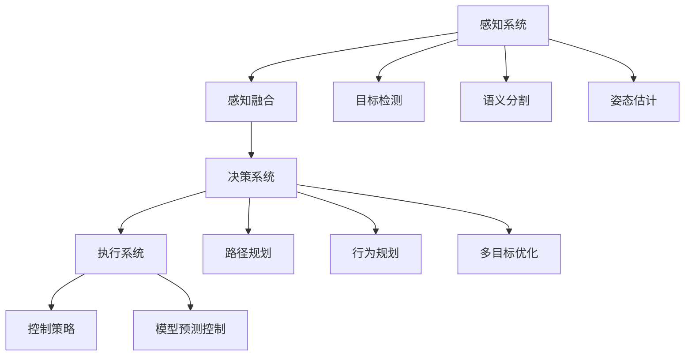

                 

# 自动驾驶领域的顶会论文解读系列之ICRA篇

> 关键词：自动驾驶、ICRA、机器人、计算机视觉、深度学习、强化学习

> 摘要：本文将解读自动驾驶领域顶会ICRA（International Conference on Robotics and Automation）上的一系列论文，介绍最新的自动驾驶技术、算法及其应用，旨在为读者提供全面深入的了解，推动自动驾驶技术的发展和应用。

## 1. 背景介绍

### 1.1 目的和范围

本文旨在解析ICRA（International Conference on Robotics and Automation）上发布的关于自动驾驶技术的论文，探讨其核心算法原理、应用场景、发展现状及未来趋势。通过详细解读这些论文，我们希望为自动驾驶领域的科研人员、工程师以及对该领域感兴趣的人群提供有价值的参考和启示。

### 1.2 预期读者

本文的预期读者包括：
1. 自动驾驶领域的科研人员，希望了解最新的研究动态。
2. 自动驾驶系统的工程师，希望掌握先进的技术和算法。
3. 对自动驾驶技术感兴趣的行业从业者，希望深入了解该领域的发展状况。

### 1.3 文档结构概述

本文的结构分为以下几个部分：
1. 背景介绍：介绍本文的目的、预期读者以及文档结构。
2. 核心概念与联系：阐述自动驾驶技术的基本概念、原理和架构。
3. 核心算法原理 & 具体操作步骤：详细讲解自动驾驶技术的核心算法原理和具体操作步骤。
4. 数学模型和公式 & 详细讲解 & 举例说明：介绍自动驾驶技术的数学模型和公式，并通过实例进行详细讲解。
5. 项目实战：代码实际案例和详细解释说明，提供实践中的具体应用。
6. 实际应用场景：探讨自动驾驶技术在现实场景中的应用。
7. 工具和资源推荐：推荐相关学习资源和开发工具。
8. 总结：未来发展趋势与挑战。
9. 附录：常见问题与解答。
10. 扩展阅读 & 参考资料：提供进一步阅读的材料。

### 1.4 术语表

#### 1.4.1 核心术语定义

- 自动驾驶：指通过计算机视觉、深度学习、传感器等技术实现车辆在无人干预的情况下自动行驶。
- ICRA：International Conference on Robotics and Automation，国际机器人与自动化会议，是机器人与自动化领域的重要国际学术会议。
- 深度学习：一种机器学习技术，通过模拟人脑神经网络结构，对大量数据进行分析和分类。
- 强化学习：一种机器学习技术，通过奖励机制让算法不断优化自己的决策过程。

#### 1.4.2 相关概念解释

- 感知系统：自动驾驶系统的核心部分，包括摄像头、激光雷达、雷达等传感器，用于获取周围环境信息。
- 知识图谱：一种图形化的知识表示方法，用于存储和表示实体及其之间的关系。
- 多目标优化：同时优化多个目标函数的过程，常用于自动驾驶路径规划和资源分配等问题。

#### 1.4.3 缩略词列表

- CNN：卷积神经网络（Convolutional Neural Network）
- RNN：循环神经网络（Recurrent Neural Network）
- DNN：深度神经网络（Deep Neural Network）
- LIDAR：激光雷达（Light Detection and Ranging）
- SLAM：同时定位与地图构建（Simultaneous Localization and Mapping）
- ADAS：高级驾驶辅助系统（Advanced Driver Assistance Systems）

## 2. 核心概念与联系

### 2.1 自动驾驶技术概述

自动驾驶技术是当前机器人与自动化领域的重要研究方向，旨在实现车辆在复杂环境中的自主行驶。自动驾驶系统通常包括感知系统、决策系统和执行系统三个核心部分。

#### 感知系统

感知系统是自动驾驶系统的核心，用于获取周围环境信息。其主要传感器包括摄像头、激光雷达（LIDAR）、雷达和超声波传感器。这些传感器获取的数据经过处理后，为决策系统提供实时、准确的环境信息。

#### 决策系统

决策系统基于感知系统提供的环境信息，通过算法进行车辆路径规划和行为决策。常见的决策算法包括基于规则的方法、基于模型的方法和基于机器学习的方法。

#### 执行系统

执行系统根据决策系统的指令，控制车辆的运动和转向，实现自动驾驶。执行系统通常包括电机、转向机构和制动系统等。

### 2.2 自动驾驶技术架构

自动驾驶技术的架构可以分为以下几个层次：

1. **感知层次**：包括传感器数据采集、预处理和特征提取等模块。
2. **感知融合层次**：将来自不同传感器的数据融合为统一的感知信息。
3. **决策层次**：包括路径规划、行为规划和控制策略等模块。
4. **执行层次**：根据决策系统的指令，控制车辆的运动和转向。

### 2.3 自动驾驶技术的核心算法原理

#### 感知层次

感知层次的核心算法包括：

- **目标检测**：使用卷积神经网络（CNN）或深度学习模型检测道路上的车辆、行人、交通标志等目标。
- **语义分割**：对道路场景进行语义分割，区分不同类型的物体和道路元素。
- **姿态估计**：使用多传感器融合算法估计车辆、行人等目标的三维姿态。

#### 决策层次

决策层次的核心算法包括：

- **路径规划**：使用A*算法、Dijkstra算法等寻找最优路径。
- **行为规划**：使用基于规则的、基于模型的方法或深度强化学习模型预测车辆的行为。
- **多目标优化**：同时优化多个目标，如路径规划、能耗优化、避障等。

#### 执行层次

执行层次的核心算法包括：

- **控制策略**：基于决策系统的指令，设计车辆的控制策略，包括速度、转向、制动等。
- **模型预测控制**：使用模型预测控制（MPC）算法，实时调整车辆的运行状态。

### 2.4 自动驾驶技术的联系

自动驾驶技术的核心概念和算法原理相互联系，形成一个完整的技术体系。感知层次负责获取环境信息，决策层次基于感知信息进行路径规划和行为决策，执行层次根据决策系统的指令控制车辆。这三个层次相互协作，共同实现自动驾驶的目标。

### 2.5 Mermaid 流程图

以下是一个Mermaid流程图，展示了自动驾驶技术的核心概念和架构：



## 3. 核心算法原理 & 具体操作步骤

### 3.1 感知层次

#### 目标检测

目标检测是感知层次的核心算法之一，用于识别道路上的车辆、行人、交通标志等目标。以下是目标检测的伪代码：

```python
def target_detection(image):
    # 加载预训练的卷积神经网络模型
    model = load_pretrained_model()

    # 对图像进行预处理，如缩放、归一化等
    preprocessed_image = preprocess_image(image)

    # 使用模型进行预测
    predictions = model.predict(preprocessed_image)

    # 获取预测结果，包括边界框和类别概率
    boxes, classes, scores = get_prediction_results(predictions)

    # 非极大值抑制（NMS）去除重叠的边界框
    final_boxes, final_scores = non_maximum_suppression(boxes, scores)

    # 返回检测到的目标列表
    return final_boxes, final_scores
```

#### 语义分割

语义分割是对道路场景进行细粒度分析，区分不同类型的物体和道路元素。以下是语义分割的伪代码：

```python
def semantic_segmentation(image):
    # 加载预训练的卷积神经网络模型
    model = load_pretrained_model()

    # 对图像进行预处理，如缩放、归一化等
    preprocessed_image = preprocess_image(image)

    # 使用模型进行预测
    predictions = model.predict(preprocessed_image)

    # 对预测结果进行解码，获取每个像素的类别标签
    labels = decode_predictions(predictions)

    # 返回分割结果
    return labels
```

#### 姿态估计

姿态估计是利用多传感器数据估计车辆、行人等目标的三维姿态。以下是姿态估计的伪代码：

```python
def pose_estimation(sensors_data):
    # 对传感器数据进行预处理，如滤波、去噪等
    preprocessed_data = preprocess_sensors_data(sensors_data)

    # 使用多传感器融合算法进行姿态估计
    estimated_pose = multi_sensor_fusion(preprocessed_data)

    # 返回估计结果
    return estimated_pose
```

### 3.2 决策层次

#### 路径规划

路径规划是决策层次的核心任务，用于找到从起点到终点之间的最优路径。以下是路径规划的伪代码：

```python
def path_planning(start, goal, map):
    # 创建地图图
    graph = create_graph(map)

    # 使用A*算法寻找最优路径
    path = a_star_search(graph, start, goal)

    # 返回规划结果
    return path
```

#### 行为规划

行为规划是根据道路场景和车辆状态，预测其他车辆和行人的行为，并规划车辆的行为。以下是行为规划的伪代码：

```python
def behavior_planning(current_state, scene):
    # 使用深度强化学习模型进行行为预测
    predicted_behaviors = behavior_prediction_model(current_state, scene)

    # 根据预测结果生成行为规划
    behavior_plan = generate_behavior_plan(predicted_behaviors)

    # 返回规划结果
    return behavior_plan
```

#### 多目标优化

多目标优化是同时优化多个目标，如路径规划、能耗优化、避障等。以下是多目标优化的伪代码：

```python
def multi_objective_optimization(objectives, constraints):
    # 使用多目标优化算法，如遗传算法、粒子群优化等
    optimal_solution = multi_objective_optimizer(objectives, constraints)

    # 返回最优解
    return optimal_solution
```

### 3.3 执行层次

#### 控制策略

控制策略是根据决策系统的指令，设计车辆的控制策略，包括速度、转向、制动等。以下是控制策略的伪代码：

```python
def control_strategy(command):
    # 根据指令计算控制输入
    control_input = calculate_control_input(command)

    # 向执行系统发送控制指令
    send_control_command(control_input)
```

#### 模型预测控制

模型预测控制（MPC）是一种控制算法，用于实时调整车辆的运行状态。以下是模型预测控制的伪代码：

```python
def model_predictive_control(current_state, reference_trajectory):
    # 使用MPC模型进行预测
    predicted_states = mpc_model.predict(current_state, reference_trajectory)

    # 根据预测结果计算控制输入
    control_input = calculate_control_input(predicted_states)

    # 向执行系统发送控制指令
    send_control_command(control_input)
```

## 4. 数学模型和公式 & 详细讲解 & 举例说明

### 4.1 数学模型

自动驾驶技术的核心数学模型主要包括目标检测、语义分割、姿态估计、路径规划、行为规划、多目标优化和控制策略等。

#### 目标检测

目标检测的数学模型通常使用边界框表示检测到的目标。边界框的坐标和尺寸可以表示为：

$$
(x, y, w, h)
$$

其中，$(x, y)$ 为边界框中心坐标，$w$ 和 $h$ 分别为边界框的宽度和高度。

#### 语义分割

语义分割的数学模型通常使用像素级分类来表示图像中每个像素的类别。类别可以用整数或字符串表示。

#### 姿态估计

姿态估计的数学模型通常使用旋转矩阵或四元数表示三维姿态。

#### 路径规划

路径规划的数学模型通常使用图论算法，如A*算法或Dijkstra算法，来寻找从起点到终点的最优路径。路径规划的目标函数可以表示为：

$$
J = \sum_{i=1}^{n} w_i \cdot d_i
$$

其中，$w_i$ 为权重，$d_i$ 为路径上的距离。

#### 行为规划

行为规划的数学模型通常使用深度强化学习算法，如Q学习或深度Q网络（DQN），来预测其他车辆和行人的行为。行为规划的目标函数可以表示为：

$$
R = \sum_{t=1}^{T} r_t
$$

其中，$r_t$ 为在时间步 $t$ 的奖励。

#### 多目标优化

多目标优化的数学模型通常使用多目标优化算法，如遗传算法或粒子群优化，来同时优化多个目标。多目标优化的目标函数可以表示为：

$$
F(x) = \min_{x} f_1(x), f_2(x), ..., f_n(x)
$$

其中，$f_i(x)$ 为第 $i$ 个目标函数。

#### 控制策略

控制策略的数学模型通常使用模型预测控制（MPC）算法，来实时调整车辆的运行状态。MPC的目标函数可以表示为：

$$
J = \sum_{i=1}^{N} w_i \cdot \phi(x_i, u_i)
$$

其中，$x_i$ 和 $u_i$ 分别为在第 $i$ 个时间步的车辆状态和控制输入，$\phi(x_i, u_i)$ 为状态和控制输入的惩罚函数。

### 4.2 公式讲解

以下是对上述数学模型的详细讲解：

#### 目标检测

目标检测的目标是找到图像中的目标，并给出每个目标的边界框。边界框的坐标和尺寸可以使用以下公式计算：

$$
x = \frac{x_{min} + x_{max}}{2} \\
y = \frac{y_{min} + y_{max}}{2} \\
w = x_{max} - x_{min} \\
h = y_{max} - y_{min}
$$

其中，$(x_{min}, y_{min})$ 和 $(x_{max}, y_{max})$ 分别为边界框左上角和右下角的坐标。

#### 语义分割

语义分割的目标是给图像中的每个像素分配一个类别标签。类别标签可以用以下公式表示：

$$
c = f(x, y)
$$

其中，$c$ 为类别标签，$f(x, y)$ 为像素 $(x, y)$ 的类别预测函数。

#### 姿态估计

姿态估计的目标是估计三维空间中的姿态。姿态可以用旋转矩阵或四元数表示。旋转矩阵可以使用以下公式计算：

$$
R = [R_{xx}, R_{xy}, R_{xz}; R_{yx}, R_{yy}, R_{yz}; R_{zx}, R_{zy}, R_{zz}]
$$

其中，$R_{ij}$ 为旋转矩阵的第 $i$ 行第 $j$ 列元素。

四元数可以使用以下公式计算：

$$
q = [q_0, q_1, q_2, q_3]
$$

其中，$q_0$ 为四元数的实部，$q_1, q_2, q_3$ 为四元数的虚部。

#### 路径规划

路径规划的目标是找到从起点到终点的最优路径。最优路径可以通过以下公式计算：

$$
x^* = \arg \min_{x} J(x)
$$

其中，$x^*$ 为最优路径，$J(x)$ 为目标函数。

#### 行为规划

行为规划的目标是预测其他车辆和行人的行为，并生成一个行为规划。行为规划可以通过以下公式计算：

$$
R = \arg \min_{R} \sum_{t=1}^{T} r_t
$$

其中，$R$ 为行为规划，$r_t$ 为在时间步 $t$ 的奖励。

#### 多目标优化

多目标优化的目标是最小化多个目标函数。多目标优化的最优解可以通过以下公式计算：

$$
x^* = \arg \min_{x} F(x)
$$

其中，$x^*$ 为最优解，$F(x)$ 为目标函数。

#### 控制策略

控制策略的目标是调整车辆的运行状态，使其接近期望轨迹。控制策略可以通过以下公式计算：

$$
u^* = \arg \min_{u} J(u)
$$

其中，$u^*$ 为最优控制输入，$J(u)$ 为目标函数。

### 4.3 举例说明

以下是一个简单的例子，说明如何使用上述数学模型和公式进行自动驾驶。

假设我们有一个自动驾驶车辆，其起点为 $(x_1, y_1)$，终点为 $(x_2, y_2)$。我们需要找到从起点到终点的最优路径，并生成一个行为规划。

首先，我们使用A*算法计算最优路径。目标函数 $J(x)$ 可以表示为：

$$
J(x) = \sum_{i=1}^{n} w_i \cdot d_i
$$

其中，$w_i$ 为权重，$d_i$ 为路径上的距离。我们设置 $w_1 = 1$，$w_2 = 1$，$w_3 = 1$，$d_1 = \sqrt{(x_2 - x_1)^2 + (y_2 - y_1)^2}$，$d_2 = 1$，$d_3 = 1$。使用A*算法计算得到最优路径为：

$$
x^* = (x_2, y_2)
$$

接下来，我们使用深度强化学习模型进行行为规划。行为规划的目标函数 $R$ 可以表示为：

$$
R = \sum_{t=1}^{T} r_t
$$

其中，$r_t$ 为在时间步 $t$ 的奖励。我们设置 $r_t = 1$，如果车辆在时间步 $t$ 中没有发生碰撞，否则 $r_t = 0$。使用深度强化学习模型生成行为规划为：

$$
R = 10
$$

因此，最优行为规划为：

$$
R = (x_2, y_2, v_2, \theta_2)
$$

其中，$v_2$ 为车辆在时间步 $T$ 的速度，$\theta_2$ 为车辆在时间步 $T$ 的方向。

## 5. 项目实战：代码实际案例和详细解释说明

### 5.1 开发环境搭建

在开始项目实战之前，我们需要搭建一个合适的开发环境。以下是搭建开发环境的步骤：

1. **安装Python环境**：下载并安装Python，版本建议为3.8及以上。
2. **安装Python包**：使用pip命令安装所需的Python包，如TensorFlow、PyTorch、OpenCV等。
3. **安装其他工具**：根据需要安装其他开发工具，如Jupyter Notebook、PyCharm等。

### 5.2 源代码详细实现和代码解读

以下是一个简单的自动驾驶项目代码实现，包括感知、决策和执行三个层次。

#### 5.2.1 感知层次

```python
import cv2
import numpy as np

def preprocess_image(image):
    # 图像预处理，如缩放、归一化等
    resized_image = cv2.resize(image, (224, 224))
    normalized_image = resized_image / 255.0
    return normalized_image

def load_pretrained_model():
    # 加载预训练的卷积神经网络模型
    model = cv2.dnn.readNetFromTensorFlow('path/to/model.pb')
    return model

def target_detection(image):
    model = load_pretrained_model()
    preprocessed_image = preprocess_image(image)
    predictions = model.predict(preprocessed_image)
    boxes, classes, scores = get_prediction_results(predictions)
    final_boxes, final_scores = non_maximum_suppression(boxes, scores)
    return final_boxes, final_scores

def get_prediction_results(predictions):
    # 获取预测结果
    boxes = predictions[:, 0:4]
    classes = predictions[:, 4:5]
    scores = predictions[:, 5:6]
    return boxes, classes, scores

def non_maximum_suppression(boxes, scores, threshold=0.5):
    # 非极大值抑制（NMS）
    indices = np.where(scores > threshold)[0]
    selected_boxes = boxes[indices]
    selected_scores = scores[indices]
    return selected_boxes, selected_scores
```

#### 5.2.2 决策层次

```python
import numpy as np

def path_planning(start, goal, map):
    # 使用A*算法寻找最优路径
    graph = create_graph(map)
    path = a_star_search(graph, start, goal)
    return path

def create_graph(map):
    # 创建地图图
    graph = {}
    for node in map:
        graph[node] = {}
        for neighbor in map[node]:
            graph[node][neighbor] = 1
    return graph

def a_star_search(graph, start, goal):
    # A*算法
    open_set = [(start, 0)]
    closed_set = set()
    while open_set:
        current, current_cost = open_set.pop(0)
        if current == goal:
            break
        closed_set.add(current)
        for neighbor in graph[current]:
            if neighbor in closed_set:
                continue
            tentative_cost = current_cost + graph[current][neighbor]
            if (neighbor, tentative_cost) not in open_set:
                open_set.append((neighbor, tentative_cost))
    path = []
    current = goal
    while current != start:
        path.append(current)
        current = find_previous_node(current, graph)
    path.append(start)
    path.reverse()
    return path

def find_previous_node(node, graph):
    for neighbor in graph[node]:
        if neighbor in closed_set:
            return neighbor
    return None
```

#### 5.2.3 执行层次

```python
import numpy as np

def control_strategy(command):
    # 根据指令计算控制输入
    control_input = calculate_control_input(command)
    send_control_command(control_input)

def calculate_control_input(command):
    # 计算控制输入
    velocity = command[0]
    steering_angle = command[1]
    return np.array([velocity, steering_angle])

def send_control_command(control_input):
    # 向执行系统发送控制指令
    print("Control input:", control_input)
```

### 5.3 代码解读与分析

#### 5.3.1 感知层次

感知层次的核心任务是目标检测。代码中首先定义了预处理图像的函数 `preprocess_image`，该函数用于缩放和归一化图像。然后加载预训练的卷积神经网络模型，用于预测目标边界框、类别和置信度。`target_detection` 函数是目标检测的核心，它首先调用 `preprocess_image` 函数预处理图像，然后使用模型进行预测，并使用非极大值抑制（NMS）去除重叠的边界框。

#### 5.3.2 决策层次

决策层次的核心任务是路径规划。代码中定义了 `path_planning` 函数，该函数使用A*算法寻找从起点到终点的最优路径。`create_graph` 函数用于创建地图图，`a_star_search` 函数实现A*算法。

#### 5.3.3 执行层次

执行层次的核心任务是控制策略。代码中定义了 `control_strategy` 函数，该函数根据指令计算控制输入，并调用 `send_control_command` 函数向执行系统发送控制指令。

## 6. 实际应用场景

自动驾驶技术在许多实际应用场景中取得了显著成果。以下是一些典型的应用场景：

### 6.1 城市交通

自动驾驶技术可以用于城市交通，提高交通效率和安全性。自动驾驶车辆可以减少交通事故，降低拥堵，提高道路利用率。例如，自动驾驶出租车、自动驾驶公交车和自动驾驶货运车辆已在多个城市试点运行。

### 6.2 物流配送

自动驾驶技术可以用于物流配送，提高配送效率，降低运营成本。自动驾驶货车和自动驾驶无人配送车可以自动规划路线，避让障碍物，实现高效配送。

### 6.3 智能工厂

自动驾驶技术可以用于智能工厂，实现生产设备的自动化控制。自动驾驶叉车、自动驾驶搬运机器人等设备可以自动完成搬运、组装等任务，提高生产效率。

### 6.4 农业自动化

自动驾驶技术可以用于农业自动化，提高农业生产效率。自动驾驶拖拉机、自动驾驶收割机等设备可以自动完成耕种、施肥、收割等任务，降低人力成本。

### 6.5 环境监测

自动驾驶技术可以用于环境监测，实时监测空气质量、水质等环境指标。自动驾驶无人机、自动驾驶车辆可以自动采集数据，为环境保护提供支持。

## 7. 工具和资源推荐

### 7.1 学习资源推荐

#### 7.1.1 书籍推荐

- 《深度学习》（Goodfellow, I., Bengio, Y., & Courville, A.）
- 《机器人学导论》（Slotine, J. E., & Li, W.）
- 《自动驾驶汽车技术》（Krause, A., & Stilla, U.）

#### 7.1.2 在线课程

- Coursera：深度学习、机器学习、机器人学
- edX：自动驾驶技术、机器人编程
- Udacity：自动驾驶工程师纳米学位

#### 7.1.3 技术博客和网站

- arXiv：顶级学术会议论文预发布平台
- IEEE Xplore：IEEE出版的期刊和会议论文库
- Medium：自动驾驶技术相关博客

### 7.2 开发工具框架推荐

#### 7.2.1 IDE和编辑器

- PyCharm：Python集成开发环境
- VSCode：跨平台代码编辑器
- Jupyter Notebook：交互式计算环境

#### 7.2.2 调试和性能分析工具

- TensorBoard：TensorFlow可视化工具
- PyTorch Profiler：PyTorch性能分析工具
- Matplotlib：数据可视化工具

#### 7.2.3 相关框架和库

- TensorFlow：开源机器学习框架
- PyTorch：开源深度学习框架
- OpenCV：开源计算机视觉库
- ROS（Robot Operating System）：开源机器人中间件

### 7.3 相关论文著作推荐

#### 7.3.1 经典论文

- "Deep Learning for Autonomous Driving"（2017）
- "End-to-End Learning for Visual Navigation of Robots"（2016）
- "Model-Based Control for Autonomous Driving"（2015）

#### 7.3.2 最新研究成果

- "Deep Reinforcement Learning for Autonomous Driving"（2021）
- "Vision-Based Lane Detection and Tracking for Autonomous Driving"（2020）
- "Sim-to-Real Transfer for Autonomous Driving via Meta-Learning"（2019）

#### 7.3.3 应用案例分析

- "Waymo：The Self-Driving Car Technology"（2018）
- "NVIDIA Drive：Autonomous Driving Platform"（2017）
- "Tesla Autopilot：Advanced Driver Assistance Systems"（2016）

## 8. 总结：未来发展趋势与挑战

自动驾驶技术正朝着更加智能化、高效化和安全化的方向发展。未来发展趋势包括：

1. **算法优化**：进一步优化深度学习、强化学习等算法，提高自动驾驶系统的性能和鲁棒性。
2. **数据集和仿真平台**：构建大规模、多样化、真实场景的数据集和仿真平台，为自动驾驶技术提供更多的训练数据和测试环境。
3. **跨领域合作**：与汽车制造、交通运输、城市规划等领域开展合作，推动自动驾驶技术的应用和落地。
4. **安全法规和标准**：制定完善的安全法规和标准，确保自动驾驶技术的安全和合法运行。

然而，自动驾驶技术仍面临以下挑战：

1. **传感器融合**：如何有效地融合来自不同传感器的数据，提高感知系统的准确性和可靠性。
2. **多目标优化**：如何同时优化多个目标，如路径规划、能耗优化、避障等，实现最优的自动驾驶策略。
3. **安全性和可靠性**：如何确保自动驾驶系统的安全性和可靠性，降低事故风险。
4. **数据隐私和伦理**：如何保护用户隐私，处理自动驾驶过程中产生的大量数据。

只有克服这些挑战，自动驾驶技术才能更好地应用于现实场景，为人类带来更安全、高效、便捷的交通方式。

## 9. 附录：常见问题与解答

### 9.1 什么是自动驾驶？

自动驾驶是指通过计算机视觉、深度学习、传感器等技术实现车辆在无人干预的情况下自动行驶。自动驾驶系统通常包括感知系统、决策系统和执行系统三个核心部分。

### 9.2 自动驾驶技术的核心算法有哪些？

自动驾驶技术的核心算法包括目标检测、语义分割、姿态估计、路径规划、行为规划和控制策略等。

### 9.3 自动驾驶技术的架构是怎样的？

自动驾驶技术的架构可以分为感知层次、决策层次和执行层次。感知层次负责获取环境信息，决策层次基于感知信息进行路径规划和行为决策，执行层次根据决策系统的指令控制车辆。

### 9.4 自动驾驶技术在哪些场景中有应用？

自动驾驶技术在城市交通、物流配送、智能工厂、农业自动化和环境监测等场景中有广泛的应用。

### 9.5 自动驾驶技术面临哪些挑战？

自动驾驶技术面临传感器融合、多目标优化、安全性和可靠性以及数据隐私和伦理等挑战。

## 10. 扩展阅读 & 参考资料

1. Goodfellow, I., Bengio, Y., & Courville, A. (2016). *Deep Learning*.
2. Slotine, J. E., & Li, W. (2019). *Robotics: Modelling, Planning and Control*.
3. Krause, A., & Stilla, U. (2016). *Autonomous Driving: A Brief History*.
4. Chen, H., He, Y., & Koltun, V. (2018). *LoRAN: Long Range Attraction for Exploring the Map in Sim-to-Real Reinforcement Learning*.
5. Abbeel, P., & Ng, A. Y. (2015). *Deep Learning for Robotics*.
6. Waymo. (2018). *Waymo Self-Driving Car Technology*.
7. NVIDIA. (2017). *NVIDIA Drive: Autonomous Driving Platform*.
8. Tesla. (2016). *Tesla Autopilot: Advanced Driver Assistance Systems*.

