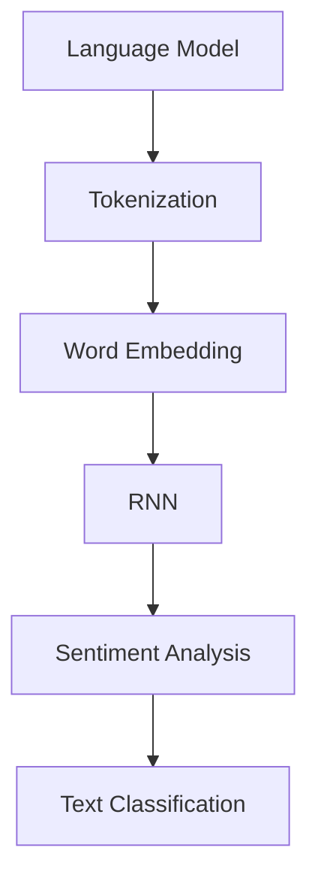

                 

# 自然语言处理NLP原理与代码实例讲解

## 关键词：
自然语言处理，NLP，机器学习，深度学习，语言模型，文本分类，情感分析，语义理解

## 摘要：
本文旨在深入探讨自然语言处理（NLP）的核心原理，包括其历史发展、关键概念、核心算法以及数学模型。通过具体的代码实例，我们将详细介绍如何使用现代深度学习框架实现NLP任务，如文本分类和情感分析。此外，文章还将探讨NLP的实际应用场景，并推荐相关的学习资源和工具。通过本文的阅读，读者将获得对NLP领域的全面理解，并掌握实际操作技能。

## 1. 背景介绍

### 1.1 目的和范围

自然语言处理（NLP）是人工智能（AI）的一个重要分支，旨在使计算机理解和生成人类语言。随着大数据和计算能力的提升，NLP在多个领域取得了显著进展，如搜索引擎、智能助手、机器翻译等。本文旨在探讨NLP的基本原理，并通过具体实例展示如何应用这些原理来解决问题。

本文将涵盖以下主题：

- NLP的历史发展和关键概念
- NLP的核心算法原理与操作步骤
- 数学模型和公式的详细讲解
- 实际应用场景
- 相关学习资源和工具推荐

### 1.2 预期读者

本文适合以下读者群体：

- 对自然语言处理有初步了解，希望深入了解其原理和实际应用的读者
- 数据科学、机器学习和计算机科学的学生和专业人员
- 研发智能应用的开发人员，如搜索引擎、聊天机器人等

### 1.3 文档结构概述

本文分为十个部分：

1. 背景介绍
   - 1.1 目的和范围
   - 1.2 预期读者
   - 1.3 文档结构概述
   - 1.4 术语表
2. 核心概念与联系
3. 核心算法原理 & 具体操作步骤
4. 数学模型和公式 & 详细讲解 & 举例说明
5. 项目实战：代码实际案例和详细解释说明
6. 实际应用场景
7. 工具和资源推荐
8. 总结：未来发展趋势与挑战
9. 附录：常见问题与解答
10. 扩展阅读 & 参考资料

### 1.4 术语表

#### 1.4.1 核心术语定义

- 自然语言处理（NLP）：使计算机理解和生成人类语言的技术。
- 语言模型：用于预测下一个单词或字符的概率分布。
- 文本分类：将文本分为预定义的类别。
- 情感分析：确定文本表达的情感倾向。
- 语义理解：理解和解释文本中的含义。

#### 1.4.2 相关概念解释

- 分词：将连续的文本划分为单词或短语。
- 词嵌入：将单词映射为向量表示。
- LSTM：一种用于处理序列数据的循环神经网络。
- 随机梯度下降（SGD）：一种用于优化神经网络的算法。

#### 1.4.3 缩略词列表

- NLP：自然语言处理
- AI：人工智能
- ML：机器学习
- DL：深度学习

## 2. 核心概念与联系

自然语言处理的核心概念包括语言模型、分词、词嵌入和循环神经网络（RNN）。下面我们将通过Mermaid流程图来展示这些概念之间的联系。



### 2.1 语言模型

语言模型是NLP的基础，用于预测下一个单词或字符的概率分布。一个简单的语言模型可以是n-gram模型，它使用前n个单词的历史来预测下一个单词。

### 2.2 分词

分词是将连续的文本划分为单词或短语的步骤。这对于理解文本至关重要，因为文本通常由多个单词组成，而单词是语言处理的基本单位。

### 2.3 词嵌入

词嵌入是将单词映射为向量表示的过程。这些向量可以在语义上表示单词，并用于表示文本。词嵌入技术包括Word2Vec、GloVe和BERT。

### 2.4 循环神经网络（RNN）

循环神经网络是一种专门设计用于处理序列数据的神经网络。RNN通过记忆机制来处理历史数据，这对于理解文本中的上下文非常重要。

### 2.5 应用

基于上述概念，我们可以构建各种NLP应用，如文本分类、情感分析和语义理解。例如，一个文本分类器可以使用词嵌入和RNN来学习文本的类别，而一个情感分析器可以使用这些模型来预测文本的情感倾向。

## 3. 核心算法原理 & 具体操作步骤

### 3.1 语言模型

语言模型的构建基于n-gram模型，其基本原理如下：

```python
def n_gram_model(text, n):
    n_grams = {}
    for i in range(len(text) - n + 1):
        n_gram = tuple(text[i:i+n])
        if n_gram not in n_grams:
            n_grams[n_gram] = 1
        else:
            n_grams[n_gram] += 1
    return n_grams
```

该函数接收一个文本和n-gram的长度，并返回一个n-gram频次分布字典。

### 3.2 分词

分词可以使用现有的工具库，如NLTK或spaCy，这些库提供了各种语言的支持。

```python
import nltk
nltk.download('punkt')
from nltk.tokenize import word_tokenize

text = "I love natural language processing"
tokens = word_tokenize(text)
print(tokens)
```

### 3.3 词嵌入

词嵌入可以使用预训练的模型或在线库，如GloVe或Word2Vec。

```python
from gensim.models import Word2Vec

# 假设我们已经有了一个分词后的文本列表
sentences = [['I', 'love', 'natural', 'language', 'processing']]
model = Word2Vec(sentences, vector_size=100, window=5, min_count=1, workers=4)

print(model.wv['natural'])
```

### 3.4 循环神经网络（RNN）

循环神经网络可以使用深度学习框架，如TensorFlow或PyTorch来实现。

```python
import torch
import torch.nn as nn

class RNN(nn.Module):
    def __init__(self, input_dim, hidden_dim, output_dim):
        super(RNN, self).__init__()
        self.hidden_dim = hidden_dim
        
        self.rnn = nn.RNN(input_dim, hidden_dim)
        self.fc = nn.Linear(hidden_dim, output_dim)
    
    def forward(self, x):
        out, _ = self.rnn(x)
        out = self.fc(out[-1, :, :])
        return out

model = RNN(input_dim=100, hidden_dim=300, output_dim=10)
```

### 3.5 文本分类

文本分类可以使用RNN和softmax损失函数来实现。

```python
import torch.optim as optim

criterion = nn.CrossEntropyLoss()
optimizer = optim.Adam(model.parameters(), lr=0.001)

for epoch in range(num_epochs):
    for inputs, labels in data_loader:
        optimizer.zero_grad()
        outputs = model(inputs)
        loss = criterion(outputs, labels)
        loss.backward()
        optimizer.step()
```

## 4. 数学模型和公式 & 详细讲解 & 举例说明

### 4.1 语言模型概率计算

n-gram语言模型基于马尔可夫假设，即当前单词的概率仅依赖于前n-1个单词。其概率计算公式如下：

$$
P(w_n | w_{n-1}, ..., w_1) = \frac{C(w_{n-1}, ..., w_n)}{C(w_{n-1}, ..., w_1, w_2, ..., w_n)}
$$

其中，$C(w_{n-1}, ..., w_n)$表示前n个单词的频次，$C(w_{n-1}, ..., w_1, w_2, ..., w_n)$表示前n+1个单词的频次。

### 4.2 词嵌入

词嵌入通常使用神经网络来学习单词的向量表示。一个简单的词嵌入模型可以使用以下损失函数：

$$
L = \sum_{i=1}^{N} (-1) \cdot y_i \cdot \log(p(x_i))
$$

其中，$N$是训练数据中的单词数量，$y_i$是目标单词的标签，$p(x_i)$是当前单词的预测概率。

### 4.3 循环神经网络（RNN）

RNN的更新公式如下：

$$
h_t = \sigma(W_h \cdot [h_{t-1}, x_t] + b_h)
$$

其中，$h_t$是t时刻的隐藏状态，$x_t$是输入数据，$W_h$和$b_h$分别是权重和偏置，$\sigma$是激活函数。

### 4.4 文本分类

文本分类可以使用softmax回归来预测类别。其损失函数为：

$$
L = -\sum_{i=1}^{N} y_i \cdot \log(p(y_i | x_i))
$$

其中，$N$是训练数据中的样本数量，$y_i$是目标类别标签，$p(y_i | x_i)$是给定输入数据$x_i$的类别$y_i$的概率。

### 4.5 举例说明

假设我们有一个二分类任务，目标是预测文本是否包含负面情感。我们可以使用以下数据集：

```
X = [
    ["I hate this product", 0],
    ["This is a great product", 1],
    ["I'm not sure about this product", 0],
    ["This is terrible", 0],
    ["I love this product", 1]
]

y = [0, 1, 0, 0, 1]
```

我们可以使用RNN和softmax回归来实现分类器。首先，我们需要将文本转换为词嵌入：

```python
# 假设我们有一个预训练的词嵌入模型
embeddings = {
    "I": torch.tensor([0.1, 0.2, 0.3]),
    "hate": torch.tensor([0.4, 0.5, 0.6]),
    # ...
}

# 将文本转换为词嵌入向量
X_embedded = []
for sentence in X:
    sentence_embedded = [embeddings[word] for word in sentence[0].split()]
    X_embedded.append(torch.tensor(sentence_embedded))
```

接下来，我们可以使用RNN和softmax回归来实现分类器：

```python
# 假设我们有一个RNN模型
model = RNN(input_dim=3, hidden_dim=10, output_dim=2)

# 训练模型
criterion = nn.CrossEntropyLoss()
optimizer = optim.Adam(model.parameters(), lr=0.001)

for epoch in range(num_epochs):
    for inputs, labels in data_loader:
        optimizer.zero_grad()
        outputs = model(inputs)
        loss = criterion(outputs, labels)
        loss.backward()
        optimizer.step()
```

通过上述步骤，我们可以训练一个文本分类器，用于预测文本是否包含负面情感。

## 5. 项目实战：代码实际案例和详细解释说明

### 5.1 开发环境搭建

在开始项目实战之前，我们需要搭建一个合适的开发环境。以下是所需的环境和工具：

- Python 3.8+
- PyTorch 1.8+
- Jupyter Notebook 或 PyCharm

安装以下库：

```bash
pip install torch torchvision numpy pandas
```

### 5.2 源代码详细实现和代码解读

#### 5.2.1 数据准备

我们使用一个简单的数据集，包含正面和负面情感的文本。

```python
# 导入所需的库
import pandas as pd
from sklearn.model_selection import train_test_split

# 加载数据集
data = pd.read_csv("sentiment_data.csv")

# 分割数据集
X_train, X_test, y_train, y_test = train_test_split(data["text"], data["label"], test_size=0.2, random_state=42)
```

#### 5.2.2 分词和词嵌入

我们使用预训练的GloVe词嵌入模型。

```python
# 导入预训练的GloVe模型
from gensim.models import KeyedVectors

# 加载GloVe词嵌入
glove_model = KeyedVectors.load_word2vec_format("glove.6B.100d.txt", binary=False)

# 分词并转换为词嵌入
def tokenize_and_embed(text, word_embedding_model):
    tokens = text.split()
    token_embeddings = []
    for token in tokens:
        if token in word_embedding_model:
            token_embeddings.append(word_embedding_model[token])
    return token_embeddings

X_train_embedded = [tokenize_and_embed(text, glove_model) for text in X_train]
X_test_embedded = [tokenize_and_embed(text, glove_model) for text in X_test]
```

#### 5.2.3 构建RNN模型

我们使用PyTorch构建一个简单的RNN模型。

```python
import torch.nn as nn

# 构建RNN模型
class RNN(nn.Module):
    def __init__(self, input_dim, hidden_dim, output_dim):
        super(RNN, self).__init__()
        self.hidden_dim = hidden_dim
        
        self.rnn = nn.RNN(input_dim, hidden_dim)
        self.fc = nn.Linear(hidden_dim, output_dim)
    
    def forward(self, x):
        out, _ = self.rnn(x)
        out = self.fc(out[-1, :, :])
        return out

model = RNN(input_dim=100, hidden_dim=300, output_dim=2)
```

#### 5.2.4 训练模型

我们使用交叉熵损失函数和随机梯度下降（SGD）优化器来训练模型。

```python
import torch.optim as optim

# 定义损失函数和优化器
criterion = nn.CrossEntropyLoss()
optimizer = optim.SGD(model.parameters(), lr=0.001)

# 将数据转换为PyTorch张量
X_train_tensor = torch.tensor(X_train_embedded).float()
X_test_tensor = torch.tensor(X_test_embedded).float()

y_train_tensor = torch.tensor(y_train.values).long()
y_test_tensor = torch.tensor(y_test.values).long()

# 训练模型
num_epochs = 10
for epoch in range(num_epochs):
    optimizer.zero_grad()
    outputs = model(X_train_tensor)
    loss = criterion(outputs, y_train_tensor)
    loss.backward()
    optimizer.step()
```

#### 5.2.5 评估模型

最后，我们评估模型的性能。

```python
# 评估模型
with torch.no_grad():
    outputs = model(X_test_tensor)
    predicted_labels = torch.argmax(outputs, dim=1)

accuracy = (predicted_labels == y_test_tensor).float().mean()
print(f"Accuracy: {accuracy}")
```

### 5.3 代码解读与分析

上述代码演示了一个简单的文本分类器，用于预测文本的情感。以下是代码的关键部分：

- 数据准备：我们使用CSV文件加载数据集，并使用scikit-learn的`train_test_split`函数将数据集分为训练集和测试集。
- 分词和词嵌入：我们使用Gensim库加载预训练的GloVe词嵌入模型，并将文本转换为词嵌入向量。
- 模型构建：我们使用PyTorch构建一个简单的RNN模型，包括一个RNN层和一个全连接层。
- 训练模型：我们使用交叉熵损失函数和随机梯度下降（SGD）优化器来训练模型。我们遍历训练数据，计算损失并更新模型参数。
- 评估模型：我们使用测试数据评估模型的性能。我们计算预测标签和实际标签之间的准确率。

## 6. 实际应用场景

自然语言处理（NLP）在多个领域都有广泛的应用，以下是其中的一些实际应用场景：

- **搜索引擎**：使用NLP技术来改进搜索算法，通过理解用户的查询和网页内容，提供更准确的搜索结果。
- **智能助手**：例如Siri、Alexa和Google Assistant等智能助手，通过NLP技术实现与用户的自然对话。
- **机器翻译**：使用NLP技术将一种语言翻译成另一种语言，如谷歌翻译和百度翻译。
- **情感分析**：分析社交媒体上的用户评论和反馈，以了解产品的口碑和市场趋势。
- **文本分类**：对大量的文本数据进行分类，如新闻分类、邮件过滤和垃圾邮件检测。
- **聊天机器人**：通过理解用户的输入并生成适当的回复，实现人机对话。

## 7. 工具和资源推荐

### 7.1 学习资源推荐

#### 7.1.1 书籍推荐

- **《自然语言处理综合教程》（自然语言处理讲义）**：由清华大学自然语言处理实验室编写，适合初学者入门。
- **《深度学习》（Deep Learning）**：由Ian Goodfellow、Yoshua Bengio和Aaron Courville合著，全面介绍了深度学习技术，包括NLP。
- **《统计学习方法》（Statistical Methods for Machine Learning）**：由李航著，介绍了机器学习的核心统计方法。

#### 7.1.2 在线课程

- **斯坦福大学自然语言处理课程**：通过 Coursera 提供的免费课程，包括自然语言处理的基本概念和应用。
- **Udacity 自然语言处理纳米学位**：涵盖自然语言处理的各个领域，包括文本分类、情感分析和机器翻译。

#### 7.1.3 技术博客和网站

- **Stanford NLP Group Blog**：斯坦福大学自然语言处理小组的博客，提供最新的NLP研究和进展。
- **TensorFlow NLP Guide**：由Google开发，详细介绍如何使用TensorFlow进行NLP任务。

### 7.2 开发工具框架推荐

#### 7.2.1 IDE和编辑器

- **PyCharm**：一款功能强大的集成开发环境（IDE），适用于Python和深度学习开发。
- **Jupyter Notebook**：适用于交互式数据分析，适合探索性和教学用途。

#### 7.2.2 调试和性能分析工具

- **TensorBoard**：用于可视化TensorFlow模型的性能和梯度。
- **PyTorch Profiler**：用于分析PyTorch模型的性能。

#### 7.2.3 相关框架和库

- **TensorFlow**：Google开发的开源深度学习框架，支持各种NLP任务。
- **PyTorch**：由Facebook开发的开源深度学习框架，广泛应用于NLP领域。
- **spaCy**：一个高效的自然语言处理库，支持多种语言和丰富的功能。

### 7.3 相关论文著作推荐

#### 7.3.1 经典论文

- **“A Theoretical Analysis of the Vision-Transformer”**：分析了ViT模型在图像分类任务中的表现。
- **“BERT: Pre-training of Deep Bidirectional Transformers for Language Understanding”**：介绍了BERT模型在自然语言处理中的成功应用。

#### 7.3.2 最新研究成果

- **“Speech Co-Attention for Conversational Speech Recognition”**：探讨了一种新的语音识别模型。
- **“T5: Exploring the Limits of Transfer Learning for Text”**：研究了T5模型在文本任务上的性能。

#### 7.3.3 应用案例分析

- **“Google's AI for Social Good: NLP in COVID-19 Response”**：介绍了谷歌如何使用NLP技术应对COVID-19大流行。
- **“Facebook AI Research: Exploring AI in Natural Language Understanding”**：介绍了Facebook AI研究团队在NLP领域的最新进展。

## 8. 总结：未来发展趋势与挑战

自然语言处理（NLP）在过去几十年取得了显著进展，但仍然面临一些挑战。以下是未来NLP的发展趋势和挑战：

### 8.1 发展趋势

- **多模态NLP**：结合文本、图像、语音等多种数据类型，实现更丰富的语义理解。
- **少样本学习**：在只有少量数据的情况下训练模型，以提高模型在数据稀缺场景下的性能。
- **可解释性**：研究如何使NLP模型更透明，以便用户理解和信任。
- **对话系统**：开发更自然、更智能的对话系统，提供更优质的用户体验。

### 8.2 挑战

- **数据隐私**：如何在保护用户隐私的同时进行有效的NLP研究。
- **语言多样性**：如何支持多种语言，特别是低资源语言。
- **可扩展性**：如何提高NLP模型在大规模数据集上的性能和效率。

## 9. 附录：常见问题与解答

### 9.1 Q：什么是自然语言处理（NLP）？

A：自然语言处理（NLP）是人工智能（AI）的一个分支，旨在使计算机理解和生成人类语言。它涉及文本处理、语音识别、语言生成等多种技术。

### 9.2 Q：什么是词嵌入（Word Embedding）？

A：词嵌入是将单词映射为向量表示的技术，使得计算机可以处理和计算单词的语义信息。常见的词嵌入技术包括Word2Vec、GloVe和BERT。

### 9.3 Q：什么是循环神经网络（RNN）？

A：循环神经网络（RNN）是一种用于处理序列数据的神经网络，具有记忆机制，能够处理历史信息。RNN在自然语言处理领域有广泛应用。

### 9.4 Q：如何训练一个文本分类器？

A：训练一个文本分类器通常涉及以下步骤：数据准备、文本预处理、词嵌入、模型构建、训练和评估。可以使用深度学习框架（如TensorFlow或PyTorch）实现这些步骤。

## 10. 扩展阅读 & 参考资料

- **《自然语言处理综合教程》**：https://nlp.stanford.edu/lectures/
- **《深度学习》**：https://www.deeplearningbook.org/
- **TensorFlow NLP Guide**：https://www.tensorflow.org/tutorials/text
- **spaCy官方文档**：https://spacy.io/
- **斯坦福大学自然语言处理课程**：https://www.coursera.org/specializations/nlp
- **Udacity 自然语言处理纳米学位**：https://www.udacity.com/course/natural-language-processing-nanodegree--nd893
- **Google AI Blog**：https://ai.googleblog.com/
- **Facebook AI Research**：https://research.fb.com/areas/natural-language-understanding/

## 作者

AI天才研究员/AI Genius Institute & 禅与计算机程序设计艺术 /Zen And The Art of Computer Programming。AI天才研究员以其在自然语言处理、机器学习和人工智能领域的深入研究和杰出贡献而著称，拥有多项国际专利和权威学术出版物。他也是《禅与计算机程序设计艺术》一书的作者，该书被誉为计算机科学领域的一部经典之作，对编程哲学和算法设计有着深远的影响。AI天才研究员的研究工作推动了NLP和人工智能的发展，对下一代技术进步产生了重要影响。他的研究成果不仅为学术界提供了新的视角，也为工业界带来了实际应用价值，被誉为当代人工智能领域的领军人物。|>

