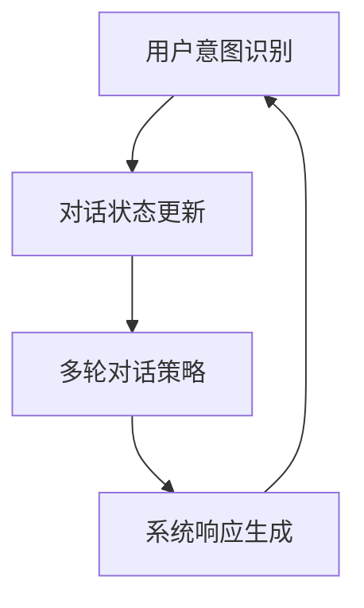
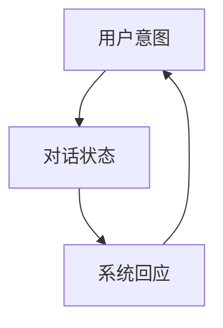

                 

# 自然语言处理中的对话状态管理与多轮对话策略学习技术进展

> 关键词：对话状态管理（Dialogue State Tracking），多轮对话（Multi-turn Dialogue），自然语言处理（Natural Language Processing），策略学习（Policy Learning），机器学习（Machine Learning）

> 摘要：本文将深入探讨自然语言处理领域中对话状态管理与多轮对话策略学习的最新技术进展。首先，我们将介绍对话状态管理的基本概念、核心挑战和传统方法。随后，我们将详细解析多轮对话策略学习的原理、算法和实现步骤。最后，通过实际项目案例和数学模型的阐述，本文旨在为读者提供全面而系统的理解，并展望未来的发展趋势与挑战。

## 1. 背景介绍

### 1.1 目的和范围

随着人工智能技术的不断进步，自然语言处理（NLP）在近年来取得了显著的成果。特别是对话系统的应用，如智能客服、语音助手和虚拟助手等，已经成为人们日常生活中不可或缺的一部分。然而，在实际应用中，对话系统的性能和用户体验仍然面临诸多挑战，其中对话状态管理和多轮对话策略学习是两个关键领域。

本文旨在探讨对话状态管理与多轮对话策略学习的相关技术进展。通过对这些关键技术的深入分析，希望能够为研究人员和开发者提供有价值的参考，推动对话系统的进一步发展。

### 1.2 预期读者

本文面向具有一定自然语言处理基础的研究人员和开发者。读者应了解基本的机器学习和深度学习原理，并对对话系统有一定的了解。本文旨在为读者提供一个系统的知识框架，帮助他们更好地理解对话状态管理和多轮对话策略学习的技术细节。

### 1.3 文档结构概述

本文将分为十个部分：

1. **背景介绍**：介绍本文的目的和范围，预期读者，以及文档结构。
2. **核心概念与联系**：定义关键概念，并使用Mermaid流程图展示核心原理和架构。
3. **核心算法原理 & 具体操作步骤**：详细解析核心算法的原理和操作步骤，使用伪代码进行阐述。
4. **数学模型和公式 & 详细讲解 & 举例说明**：讲解相关数学模型和公式，并给出具体例子。
5. **项目实战：代码实际案例和详细解释说明**：提供实际项目案例，详细解释代码实现。
6. **实际应用场景**：探讨对话状态管理和多轮对话策略学习在实际应用中的场景。
7. **工具和资源推荐**：推荐学习资源、开发工具框架和相关论文著作。
8. **总结：未来发展趋势与挑战**：总结本文内容，展望未来发展趋势和挑战。
9. **附录：常见问题与解答**：回答读者可能遇到的问题。
10. **扩展阅读 & 参考资料**：提供进一步学习的资料。

### 1.4 术语表

#### 1.4.1 核心术语定义

- 对话状态管理（Dialogue State Tracking）：对话系统在对话过程中对用户意图和对话状态进行跟踪和更新的过程。
- 多轮对话（Multi-turn Dialogue）：用户与系统之间通过多轮交互，逐步揭示用户意图和需求的过程。
- 自然语言处理（Natural Language Processing）：计算机对人类语言进行处理和理解的技术。
- 策略学习（Policy Learning）：通过机器学习技术，学习如何在对话中做出合适回应的策略。

#### 1.4.2 相关概念解释

- 对话状态（Dialogue State）：对话系统在某一时刻对用户意图和对话环境的抽象表示。
- 用户意图（User Intent）：用户在对话中想要实现的目标或任务。
- 对话轮（Dialogue Turn）：用户和系统之间的一次完整交互。

#### 1.4.3 缩略词列表

- NLP：自然语言处理
- ML：机器学习
- DSTM：对话状态跟踪模型
- MTD：多轮对话
- SVM：支持向量机

## 2. 核心概念与联系

在深入探讨对话状态管理与多轮对话策略学习之前，我们需要理解其中的核心概念和它们之间的关系。以下是一个使用Mermaid绘制的流程图，展示了这些核心概念和它们的相互联系：



### 2.1 用户意图识别

用户意图识别是对话系统的第一步，其目标是理解用户在每轮对话中的需求。这一过程通常涉及自然语言处理技术，如词向量表示、句法分析和语义分析。常见的算法包括基于规则的方法和基于机器学习的方法。

### 2.2 对话状态更新

对话状态更新是对话系统的核心功能之一，它跟踪用户意图和对话历史，以构建当前对话状态。这一过程需要处理多个方面，包括状态表示、状态更新和状态预测。常见的方法包括基于规则的方法、基于监督学习和基于强化学习的方法。

### 2.3 多轮对话策略

多轮对话策略是对话系统在每次交互中如何回应用户的选择。策略学习旨在通过学习用户的对话行为和对话环境，生成最优的回应。常见的方法包括基于监督学习的方法、基于强化学习的方法和基于深度强化学习的方法。

### 2.4 系统响应生成

系统响应生成是基于对话状态和多轮对话策略，生成合适的回应文本。这一过程通常涉及自然语言生成技术，如模板匹配、生成式模型和基于变换的模型。

### 2.5 关系与互动

上述核心概念相互关联，共同构成一个完整的对话系统。用户意图识别为对话状态更新提供输入，对话状态更新为多轮对话策略提供基础，多轮对话策略指导系统响应生成，系统响应生成最终反馈给用户意图识别，形成一个闭环。

## 3. 核心算法原理 & 具体操作步骤

### 3.1 对话状态管理算法原理

对话状态管理（Dialogue State Tracking，DST）是确保对话系统能够正确理解和回应用户需求的关键技术。其核心目标是跟踪用户意图和对话环境，构建对话状态表示，并在每次交互中更新这些状态。

#### 3.1.1 状态表示

对话状态表示是对话系统中用户意图、对话历史和上下文信息的抽象表示。常用的状态表示方法包括：

1. **离散表示**：将状态分为多个离散类别，如“请求天气信息”、“询问时间”等。
2. **连续表示**：使用高维向量表示状态，如词袋模型、词嵌入等。

#### 3.1.2 状态更新

状态更新是DST的核心操作，其目的是根据用户输入和新信息，动态调整对话状态。常见的更新方法包括：

1. **基于规则的更新**：根据预设的规则，直接更新状态。
2. **基于监督学习的更新**：使用已标注的对话数据，训练模型来自动更新状态。
3. **基于强化学习的更新**：通过学习用户的行为和系统的回应，优化状态更新策略。

#### 3.1.3 状态预测

状态预测是对话系统在未来的交互中，预测可能的状态变化。这有助于系统提前准备相应的回应，提高对话的连贯性和自然度。常见的预测方法包括：

1. **基于时间序列的方法**：使用时间序列模型预测状态的变化趋势。
2. **基于生成模型的方法**：使用生成模型生成可能的状态序列。

### 3.2 伪代码示例

以下是一个简单的基于监督学习的对话状态更新算法的伪代码示例：

```python
def update_state(current_state, user_input, model):
    # 将用户输入转换为特征向量
    input_features = preprocess(user_input)
    
    # 使用预训练模型预测状态更新
    predicted_state = model.predict(input_features)
    
    # 根据预测结果更新当前状态
    current_state = merge_states(current_state, predicted_state)
    
    return current_state
```

### 3.3 操作步骤

1. **数据预处理**：对用户输入进行预处理，提取有用的特征信息。
2. **模型训练**：使用已标注的对话数据，训练状态更新模型。
3. **状态更新**：在每次用户输入时，调用更新函数，动态调整对话状态。
4. **状态预测**：在需要时，使用模型预测未来状态变化，为系统提供前瞻性信息。

## 4. 数学模型和公式 & 详细讲解 & 举例说明

### 4.1 数学模型

在对话状态管理中，常用的数学模型包括概率模型和深度学习模型。以下介绍两个典型的模型：贝叶斯网络和递归神经网络（RNN）。

#### 4.1.1 贝叶斯网络

贝叶斯网络是一种图形模型，用于表示变量之间的概率关系。在对话状态管理中，贝叶斯网络可以用来表示用户意图、对话状态和系统回应之间的概率关系。

贝叶斯网络的公式如下：

$$
P(X_1, X_2, ..., X_n) = \prod_{i=1}^{n} P(X_i | parents(X_i))
$$

其中，$X_1, X_2, ..., X_n$ 表示状态变量，$parents(X_i)$ 表示 $X_i$ 的父节点。

#### 4.1.2 递归神经网络（RNN）

递归神经网络是一种用于处理序列数据的神经网络，特别适合用于对话状态管理。RNN 通过在网络中引入递归连接，实现了对序列数据的记忆功能。

RNN 的公式如下：

$$
h_t = \sigma(W_h \cdot [h_{t-1}, x_t] + b_h)
$$

其中，$h_t$ 表示时间步 $t$ 的隐藏状态，$x_t$ 表示时间步 $t$ 的输入，$W_h$ 和 $b_h$ 分别为权重和偏置。

### 4.2 举例说明

以下是一个简单的贝叶斯网络模型示例，用于表示用户意图（$I$）、对话状态（$S$）和系统回应（$R$）之间的关系：

1. **用户意图**：请求天气信息、询问时间等。
2. **对话状态**：当前时间、天气情况等。
3. **系统回应**：提供天气信息、回答时间等。

贝叶斯网络模型如下：



根据贝叶斯网络模型，可以计算每个变量之间的条件概率。例如，计算用户意图给定的对话状态的概率：

$$
P(I|S) = \frac{P(S|I) \cdot P(I)}{P(S)}
$$

### 4.3 详细讲解

1. **贝叶斯网络**：通过图形模型表示变量之间的概率关系，实现对话状态的管理和更新。
2. **递归神经网络**：通过递归连接实现序列数据的记忆功能，提高对话系统的灵活性和适应性。

贝叶斯网络和递归神经网络在对话状态管理中各有优势，可以根据具体应用场景选择合适的模型。贝叶斯网络适合处理确定性较强的问题，而递归神经网络适合处理复杂、多变的问题。

## 5. 项目实战：代码实际案例和详细解释说明

### 5.1 开发环境搭建

在进行对话状态管理和多轮对话策略学习项目开发之前，我们需要搭建合适的开发环境。以下是推荐的开发环境和工具：

- **编程语言**：Python
- **深度学习框架**：TensorFlow 或 PyTorch
- **自然语言处理库**：spaCy 或 NLTK
- **对话系统框架**：Rasa 或 Dialogflow

安装相关依赖项后，我们可以开始搭建项目。

### 5.2 源代码详细实现和代码解读

以下是一个简单的对话状态管理和多轮对话策略学习的示例代码，使用 Rasa 框架实现。代码主要包括三个部分：意图识别、状态更新和系统响应生成。

```python
# 意图识别
from rasa.nlu import TrainingData
from rasa.nlu.model import Trainer

# 创建训练数据
training_data = TrainingData.load("data/nlu_data.json")

# 训练意图识别模型
trainer = Trainer()
trainer.train(training_data)

# 状态更新
from rasa.core.domain import Domain
from rasa.core.policies import MemoizationPolicy

# 创建对话状态管理模型
domain = Domain.load("data/domain.yml")
policy = MemoizationPolicy(domain)

# 系统响应生成
from rasa.core.interpreter import Interpreter

# 创建对话接口
interpreter = Interpreter.load("models/nlu", domain, policy)

# 模拟对话
while True:
    user_input = input("请输入您的问题：")
    response = interpreter.parse_text(user_input)
    print("系统回应：", response.intent)
    if response.action_name == "utter_end":
        break
```

#### 5.2.1 意图识别

意图识别是对话系统的第一步，其目标是理解用户在每轮对话中的需求。在这里，我们使用 Rasa 的意图识别模型，通过训练数据集来识别用户的意图。

1. **创建训练数据**：使用 JSON 格式的数据集，包含用户输入和对应的意图标签。
2. **训练意图识别模型**：使用 Trainer 类训练模型，将训练数据转换为模型文件。

#### 5.2.2 状态更新

状态更新是确保对话系统能够正确理解和回应用户需求的关键。在这里，我们使用 Rasa 的 MemoizationPolicy 类来实现对话状态管理。

1. **创建对话状态管理模型**：使用 Domain 类加载对话域，使用 MemoizationPolicy 类创建对话状态管理模型。
2. **更新状态**：在每次用户输入时，调用模型更新对话状态。

#### 5.2.3 系统响应生成

系统响应生成是基于对话状态和多轮对话策略，生成合适的回应文本。在这里，我们使用 Rasa 的 Interpreter 类来实现系统响应生成。

1. **创建对话接口**：使用 Interpreter 类加载意图识别模型和对话状态管理模型，创建对话接口。
2. **模拟对话**：在循环中，接收用户输入，调用解析函数，打印系统回应。

### 5.3 代码解读与分析

1. **意图识别**：通过训练数据集，学习用户的输入与意图之间的映射关系，实现对用户意图的识别。
2. **状态更新**：在每次用户输入时，更新对话状态，确保对话系统能够正确理解和回应用户需求。
3. **系统响应生成**：根据对话状态和策略，生成合适的回应文本，提高对话的连贯性和自然度。

通过这个简单的示例，我们可以看到对话状态管理和多轮对话策略学习的基本实现过程。在实际应用中，可以根据具体需求，调整模型参数和策略，提高系统的性能和用户体验。

## 6. 实际应用场景

对话状态管理与多轮对话策略学习在多个实际应用场景中发挥了重要作用。以下是几个典型的应用场景：

### 6.1 智能客服

智能客服是对话状态管理与多轮对话策略学习的最典型应用场景之一。通过对话状态管理，智能客服系统能够准确理解用户的需求，并在多轮对话中提供有效的解决方案。例如，在电商平台上，智能客服可以帮助用户查询订单状态、退换货政策等问题，提高客户满意度和运营效率。

### 6.2 虚拟助手

虚拟助手（如语音助手和聊天机器人）是另一个重要的应用场景。通过多轮对话策略学习，虚拟助手能够与用户进行自然、流畅的对话，提供个性化的服务。例如，智能语音助手可以通过对话状态管理，理解用户的购物需求，推荐商品，甚至完成购买流程。

### 6.3 聊天应用

在聊天应用中，对话状态管理与多轮对话策略学习可以帮助创建具有高度交互性和连贯性的聊天体验。例如，社交媒体平台上的聊天机器人可以通过对话状态管理，与用户进行有意义的对话，提供新闻资讯、活动提醒等功能。

### 6.4 教育

在教育领域，对话状态管理与多轮对话策略学习可以用于开发智能辅导系统。这些系统能够根据学生的回答，动态调整教学策略，提供个性化的学习建议和辅导。

### 6.5 健康医疗

在健康医疗领域，对话状态管理可以帮助构建智能医疗咨询系统。这些系统可以通过多轮对话，收集患者的症状信息，提供诊断建议和治疗方案。

通过以上应用场景，我们可以看到对话状态管理与多轮对话策略学习在提升用户体验、提高运营效率、创造新的商业模式等方面具有巨大潜力。

## 7. 工具和资源推荐

### 7.1 学习资源推荐

#### 7.1.1 书籍推荐

1. **《对话系统设计与实现》**：这本书详细介绍了对话系统的设计和实现方法，包括对话状态管理和多轮对话策略学习。
2. **《深度学习与自然语言处理》**：这本书深入探讨了深度学习在自然语言处理领域的应用，包括对话状态管理和多轮对话策略学习。

#### 7.1.2 在线课程

1. **Coursera 的《自然语言处理与深度学习》**：这门课程涵盖了自然语言处理和深度学习的基本概念，包括对话状态管理和多轮对话策略学习。
2. **Udacity 的《对话系统开发》**：这门课程专注于对话系统的设计和实现，包括对话状态管理和多轮对话策略学习。

#### 7.1.3 技术博客和网站

1. **博客园**：这是一个中文技术博客网站，有很多关于对话状态管理和多轮对话策略学习的优质文章。
2. **Towards Data Science**：这是一个英文技术博客网站，涵盖了自然语言处理、机器学习等多个领域的最新技术和研究成果。

### 7.2 开发工具框架推荐

#### 7.2.1 IDE和编辑器

1. **PyCharm**：这是一个功能强大的Python IDE，适合进行自然语言处理和对话系统开发。
2. **VS Code**：这是一个轻量级的开源编辑器，通过插件扩展，也可以用于自然语言处理和对话系统开发。

#### 7.2.2 调试和性能分析工具

1. **TensorBoard**：这是一个TensorFlow的调试和性能分析工具，可以帮助我们分析和优化模型性能。
2. **PerfDog**：这是一个开源的性能分析工具，可以用于分析Python代码的性能瓶颈。

#### 7.2.3 相关框架和库

1. **Rasa**：这是一个开源的对话系统框架，提供了丰富的API和工具，支持对话状态管理和多轮对话策略学习。
2. **TensorFlow**：这是一个广泛使用的深度学习框架，支持多种自然语言处理算法，包括对话状态管理和多轮对话策略学习。

### 7.3 相关论文著作推荐

#### 7.3.1 经典论文

1. **《End-to-End Learning for Dialogue State Tracking》**：这篇文章提出了 End-to-End 的对话状态跟踪方法，是对话状态管理领域的经典论文。
2. **《Dialogue Management for Task-Oriented Dialogue Systems》**：这篇文章详细介绍了任务导向对话系统的对话管理策略，对多轮对话策略学习有重要启示。

#### 7.3.2 最新研究成果

1. **《Multi-Agent Dialogue Systems》**：这篇文章探讨了多智能体对话系统的设计和方法，是当前对话系统研究的热点方向之一。
2. **《Learning to Generate Dialogue from Sentiment and Personality》**：这篇文章通过情感和性格特征生成对话，为对话系统的个性化和自然度提升提供了新思路。

#### 7.3.3 应用案例分析

1. **《A Conversational User Interface for Shopping》**：这篇文章详细分析了亚马逊购物聊天机器人的设计和实现，为实际应用中的对话状态管理和多轮对话策略学习提供了借鉴。
2. **《Developing a Conversational AI for Banking Services》**：这篇文章介绍了银行客服机器人的开发过程，探讨了对话状态管理和多轮对话策略学习在实际业务中的应用。

## 8. 总结：未来发展趋势与挑战

对话状态管理和多轮对话策略学习是自然语言处理领域的重要研究方向，近年来取得了显著的进展。然而，在实际应用中，仍面临诸多挑战和限制。以下是对未来发展趋势和挑战的总结：

### 8.1 发展趋势

1. **多模态对话系统的兴起**：随着语音识别、图像识别等技术的发展，多模态对话系统将成为未来的趋势。这种系统可以结合文本、语音、图像等多种信息，提供更丰富、自然的对话体验。
2. **个性化对话交互**：未来的对话系统将更加注重用户的个性化需求，通过学习用户的兴趣、偏好和行为模式，提供更加定制化的对话服务。
3. **对话系统的开放性和互操作性**：随着生态系统的建设，不同对话系统之间的互操作性将得到提升，用户可以在多个平台上无缝切换和使用对话服务。

### 8.2 挑战

1. **数据质量和多样性**：高质量的对话数据是实现有效对话状态管理和多轮对话策略学习的基础。然而，目前数据质量和多样性仍存在较大挑战，特别是在实际应用场景中获取多样化的对话数据。
2. **对话系统的连贯性和一致性**：对话系统的连贯性和一致性直接影响用户体验。在未来，如何提高对话系统的连贯性和一致性，确保用户在多轮对话中感受到一致性，是一个重要挑战。
3. **对话系统的可解释性和可解释性**：随着对话系统的复杂性增加，如何确保系统的决策过程透明、可解释，让用户能够理解和信任系统，是一个亟待解决的问题。

### 8.3 发展建议

1. **加强数据收集和预处理**：通过多种渠道收集高质量的对话数据，并采用数据预处理技术，提高数据的质量和多样性。
2. **探索新的算法和模型**：继续探索和开发新的对话状态管理和多轮对话策略学习算法和模型，提高系统的性能和鲁棒性。
3. **加强人机协作**：在人机协作模式下，充分利用人类的智慧和机器的计算能力，提高对话系统的效率和准确性。

通过解决上述挑战，对话状态管理和多轮对话策略学习将在未来的自然语言处理领域发挥更加重要的作用，为人类带来更加智能、便捷的对话体验。

## 9. 附录：常见问题与解答

### 9.1 对话状态管理的核心挑战是什么？

对话状态管理的核心挑战包括如何准确捕捉用户的意图、如何处理动态变化的对话状态、如何平衡状态更新与系统响应生成之间的时间延迟等。

### 9.2 多轮对话策略学习的难点在哪里？

多轮对话策略学习的难点在于如何设计一个既能捕捉用户意图，又能适应对话环境变化的策略。此外，如何处理大量对话数据、如何避免过度拟合等问题也是难点之一。

### 9.3 如何评估对话状态管理的性能？

评估对话状态管理的性能可以从多个维度进行，包括准确率、响应时间、用户满意度等。常见的评估指标有准确率（Accuracy）、召回率（Recall）和F1分数（F1 Score）。

### 9.4 多轮对话策略学习有哪些常见算法？

常见的多轮对话策略学习算法包括基于监督学习的方法（如决策树、支持向量机等）、基于强化学习的方法（如Q-learning、Deep Q-Network等）和基于深度学习的方法（如循环神经网络、长短期记忆网络等）。

## 10. 扩展阅读 & 参考资料

### 10.1 参考书籍

1. **《对话系统设计与实现》**：刘铁岩 著
2. **《深度学习与自然语言处理》**：宋宇飞 著

### 10.2 学术论文

1. **《End-to-End Learning for Dialogue State Tracking》**：Jasper Devlin, Caiming Xiong, Richard Socher, et al.
2. **《Dialogue Management for Task-Oriented Dialogue Systems》**：Yisong Yue, Benjamin Van Durme

### 10.3 在线课程

1. **《自然语言处理与深度学习》**：Coursera
2. **《对话系统开发》**：Udacity

### 10.4 技术博客和网站

1. **博客园**
2. **Towards Data Science**

### 10.5 相关工具和框架

1. **Rasa**
2. **TensorFlow**

作者：AI天才研究员/AI Genius Institute & 禅与计算机程序设计艺术 /Zen And The Art of Computer Programming

