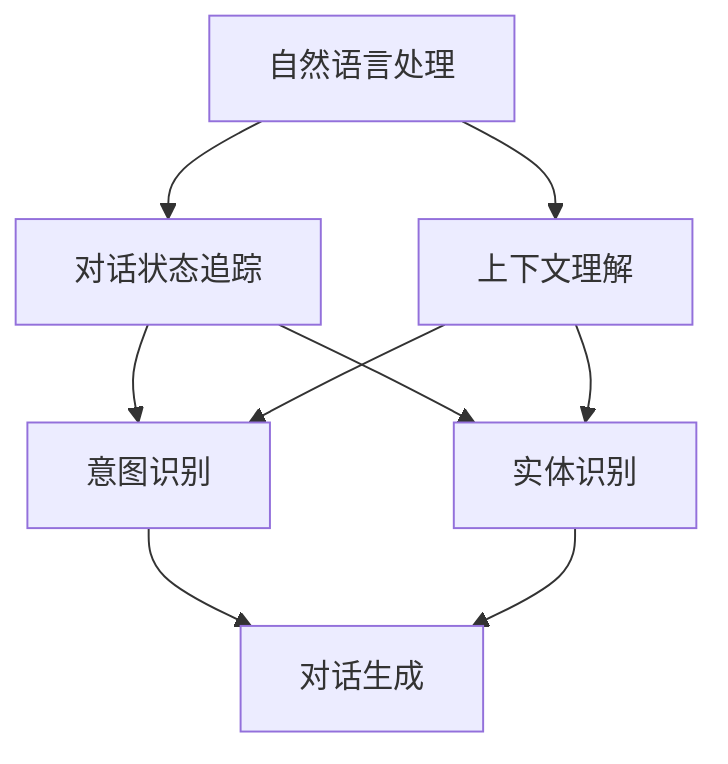

                 


# 自然语言处理中的对话状态追踪与上下文理解技术进展

> **关键词**：自然语言处理，对话状态追踪，上下文理解，机器学习，深度学习，神经网络，序列模型，图谱模型，BERT，GPT，端到端模型
>
> **摘要**：本文旨在探讨自然语言处理（NLP）领域中对话状态追踪与上下文理解技术的最新进展。通过分析相关核心概念、算法原理、数学模型以及实际应用案例，本文旨在为读者提供全面的技术理解和实践指导。文章首先介绍了NLP的背景和目标，随后深入讨论了对话状态追踪与上下文理解的基本概念和关联，最后通过具体技术实现和实际应用案例展示了当前技术的应用前景。

## 1. 背景介绍

### 1.1 目的和范围

本文的主要目的是深入探讨自然语言处理（NLP）领域中的对话状态追踪（Dialogue State Tracking，DST）与上下文理解（Contextual Understanding）技术。随着人工智能技术的快速发展，NLP已成为实现人机交互、智能助手、虚拟代理等应用的关键技术。对话状态追踪旨在准确捕捉对话过程中的关键信息，从而实现对话系统的智能化；而上下文理解则关注于从对话中提取有用的信息，以支持合理的对话生成与交互。

本文将涵盖以下主要内容：
- 对话状态追踪与上下文理解的基本概念和重要性；
- 相关核心算法原理及具体实现步骤；
- 数学模型和公式，包括序列模型、图谱模型等；
- 实际应用场景中的代码实现和分析；
- 当前技术的最新研究成果和应用案例；
- 未来发展趋势和面临的挑战。

### 1.2 预期读者

本文适合以下读者群体：
- 自然语言处理领域的学者和研究人员；
- 想要深入了解对话状态追踪与上下文理解技术的开发者和工程师；
- 对人工智能应用领域感兴趣的爱好者。

### 1.3 文档结构概述

本文结构如下：
1. 背景介绍：本文的概述和目的；
2. 核心概念与联系：对话状态追踪与上下文理解的基本概念和关联；
3. 核心算法原理 & 具体操作步骤：相关算法的详细原理和实现步骤；
4. 数学模型和公式 & 详细讲解 & 举例说明：相关数学模型的介绍、公式推导和应用实例；
5. 项目实战：代码实际案例和详细解释说明；
6. 实际应用场景：技术在实际应用中的场景和挑战；
7. 工具和资源推荐：学习资源、开发工具和框架推荐；
8. 总结：未来发展趋势与挑战；
9. 附录：常见问题与解答；
10. 扩展阅读 & 参考资料：进一步阅读的建议和参考资料。

### 1.4 术语表

#### 1.4.1 核心术语定义

- 对话状态追踪（Dialogue State Tracking）：指在对话过程中，对用户的意图和系统维护的状态进行持续跟踪和更新的技术。
- 上下文理解（Contextual Understanding）：指从对话中提取关键信息，理解对话上下文，以支持对话生成和交互的技术。
- 序列模型（Sequence Model）：指基于序列数据的模型，能够捕捉数据之间的时间依赖关系。
- 图谱模型（Graph Model）：指基于图结构的模型，能够表示实体之间的复杂关系。
- BERT（Bidirectional Encoder Representations from Transformers）：一种预训练的Transformer模型，能够对自然语言进行双向编码。
- GPT（Generative Pre-trained Transformer）：一种生成预训练的Transformer模型，能够生成文本和回答问题。

#### 1.4.2 相关概念解释

- 自然语言处理（Natural Language Processing，NLP）：指利用计算机技术对自然语言进行理解和生成的人工智能领域。
- 对话系统（Dialogue System）：指能够与用户进行自然语言交互的计算机系统。
- 意图识别（Intent Recognition）：指从对话中识别用户的意图。
- 实体识别（Entity Recognition）：指从对话中识别用户提到的实体。

#### 1.4.3 缩略词列表

- NLP：自然语言处理
- DST：对话状态追踪
- CU：上下文理解
- RNN：循环神经网络
- LSTM：长短时记忆网络
- Transformer：变换器网络
- BERT：双向编码器表示从变换器
- GPT：生成预训练变换器

## 2. 核心概念与联系

在深入探讨对话状态追踪与上下文理解技术之前，我们需要了解相关的核心概念和它们之间的联系。以下是核心概念及其关系的Mermaid流程图：



### 2.1. 自然语言处理（NLP）

自然语言处理（NLP）是人工智能（AI）的一个重要分支，旨在让计算机能够理解、生成和处理自然语言。NLP的目标是使计算机能够与人类进行自然、流畅的交流。NLP的核心任务包括但不限于文本分类、情感分析、命名实体识别、句法分析、机器翻译等。

### 2.2. 对话状态追踪（DST）

对话状态追踪（DST）是NLP中的一项关键技术，旨在在对话过程中持续跟踪和更新对话状态。对话状态包括用户意图、系统维护的状态信息等。DST的关键在于从对话中提取关键信息，为对话生成和交互提供支持。其核心任务包括意图识别、实体识别、对话状态更新等。

### 2.3. 上下文理解（CU）

上下文理解（CU）是指从对话中提取关键信息，理解对话上下文，以支持对话生成和交互的技术。上下文理解不仅关注对话的历史信息，还包括当前对话的上下文和用户的行为特征。CU的关键任务包括情感分析、上下文分类、上下文生成等。

### 2.4. 意图识别（Intent Recognition）

意图识别是指从对话中识别用户的意图。意图通常表示用户想要完成的任务或请求。在对话系统中，意图识别是理解用户需求的第一步，对于后续对话生成和交互至关重要。

### 2.5. 实体识别（Entity Recognition）

实体识别是指从对话中识别用户提到的实体，如人名、地点、组织名、日期等。实体识别是上下文理解的重要部分，有助于更好地理解对话内容和用户的意图。

### 2.6. 对话生成（Dialogue Generation）

对话生成是指根据对话上下文和用户意图生成合理的回复。对话生成是NLP领域的另一个重要任务，旨在实现自然、流畅的对话交互。

### 2.7. 对话状态追踪与上下文理解的关系

对话状态追踪和上下文理解在对话系统中紧密相关。DST负责跟踪和更新对话状态，为对话生成提供基础信息；而CU则从对话中提取关键信息，帮助系统更好地理解用户意图和上下文，从而生成更合理的回复。两者相辅相成，共同实现智能对话系统的目标。

## 3. 核心算法原理 & 具体操作步骤

### 3.1. 对话状态追踪算法原理

对话状态追踪（DST）算法主要基于机器学习和深度学习技术，特别是序列模型和图谱模型。以下是对话状态追踪的核心算法原理：

#### 3.1.1. 序列模型（RNN、LSTM）

序列模型是DST常用的算法之一，能够捕捉对话中信息的时序依赖关系。其中，循环神经网络（RNN）和长短时记忆网络（LSTM）是典型的序列模型。

**原理：**
- **RNN**：RNN通过在当前时刻的记忆状态来预测下一时刻的输出，能够捕捉对话中的短期依赖关系。
- **LSTM**：LSTM在RNN的基础上引入门机制，能够有效地避免梯度消失问题，捕捉对话中的长期依赖关系。

**操作步骤：**
1. 输入对话序列：将对话序列作为输入，例如一个文本序列（\[w1, w2, w3, ..., wn\]）。
2. 初始化状态：初始化RNN或LSTM的隐藏状态。
3. 循环计算：对每个时间步进行计算，更新隐藏状态。
4. 输出预测：在最后一个时间步，输出对话状态的预测结果。

#### 3.1.2. 图谱模型（Graph Model）

图谱模型能够表示对话中实体和关系之间的复杂结构，适用于处理多模态数据。以下是一种基于图谱模型的DST算法：

**原理：**
- **图结构**：将对话中的实体和关系表示为图结构，实体作为图中的节点，关系作为图中的边。
- **图神经网络（GNN）**：利用图神经网络学习实体和关系之间的交互和依赖关系。

**操作步骤：**
1. 构建图结构：将对话中的实体和关系构建为图结构。
2. 初始化节点状态：为图中的每个节点初始化状态。
3. 循环更新：利用图神经网络更新每个节点的状态。
4. 状态聚合：将所有节点的状态进行聚合，得到最终的对话状态。

### 3.2. 上下文理解算法原理

上下文理解（CU）算法主要关注于从对话中提取关键信息，理解对话上下文。以下是一些常见的上下文理解算法：

#### 3.2.1. Transformer模型（BERT、GPT）

Transformer模型是近年来在NLP领域取得显著成果的模型，能够有效地捕捉长距离依赖关系。BERT和GPT是典型的Transformer模型。

**原理：**
- **编码器（Encoder）**：编码器能够对输入文本进行编码，生成上下文表示。
- **解码器（Decoder）**：解码器能够根据编码器的输出和上下文生成回复。

**操作步骤：**
1. 输入对话序列：将对话序列作为输入，例如一个文本序列（\[w1, w2, w3, ..., wn\]）。
2. 编码器处理：利用编码器对输入文本进行编码，生成上下文表示。
3. 解码器生成：利用解码器根据编码器的输出和上下文生成回复。

#### 3.2.2. 端到端模型

端到端模型能够将对话输入直接映射到输出，无需手工设计中间层。以下是一种基于端到端模型的上下文理解算法：

**原理：**
- **端到端架构**：将输入直接映射到输出，例如直接从对话输入生成回复。

**操作步骤：**
1. 输入对话序列：将对话序列作为输入，例如一个文本序列（\[w1, w2, w3, ..., wn\]）。
2. 计算上下文表示：利用神经网络计算对话序列的上下文表示。
3. 生成回复：根据上下文表示生成回复。

### 3.3. 对话状态追踪与上下文理解算法组合

在实际应用中，对话状态追踪和上下文理解算法往往需要结合使用，以实现更准确、更智能的对话交互。以下是一种基于组合算法的DST-CU框架：

**原理：**
- **组合算法**：将DST算法和CU算法组合使用，以实现对话状态的跟踪和上下文的理解。

**操作步骤：**
1. 初始化：初始化对话状态和上下文表示。
2. DST处理：利用DST算法更新对话状态。
3. CU处理：利用CU算法更新上下文表示。
4. 状态聚合：将更新后的对话状态和上下文表示进行聚合。
5. 输出生成：根据聚合后的状态生成回复。

## 4. 数学模型和公式 & 详细讲解 & 举例说明

在对话状态追踪（DST）和上下文理解（CU）中，数学模型和公式扮演着至关重要的角色。以下将详细介绍相关数学模型，包括序列模型、图谱模型以及Transformer模型，并通过具体例子进行讲解。

### 4.1. 序列模型

序列模型如循环神经网络（RNN）和长短时记忆网络（LSTM）在DST中广泛应用。以下为RNN的数学模型：

**RNN公式：**

\[ h_t = \sigma(W_h h_{t-1} + W_x x_t + b_h) \]

其中：
- \( h_t \) 是当前时刻的隐藏状态；
- \( x_t \) 是当前时刻的输入；
- \( W_h \) 和 \( W_x \) 分别是隐藏状态和输入的权重矩阵；
- \( b_h \) 是隐藏状态的偏置；
- \( \sigma \) 是激活函数，常用的是Sigmoid或Tanh函数。

**LSTM公式：**

\[ 
\begin{aligned}
& i_t = \sigma(W_{ih} h_{t-1} + W_{ix} x_t + b_i) \\
& f_t = \sigma(W_{fh} h_{t-1} + W_{fx} x_t + b_f) \\
& g_t = \tanh(W_{gh} h_{t-1} + W_{gx} x_t + b_g) \\
& o_t = \sigma(W_{oh} h_{t-1} + W_{ox} x_t + b_o) \\
& h_t = o_t \odot \tanh(W_{ch} h_{t-1} + W_{cx} x_t + b_c)
\end{aligned}
\]

其中：
- \( i_t \)、\( f_t \)、\( g_t \)、\( o_t \) 分别是输入门、遗忘门、生成门和输出门的状态；
- \( W_{ih} \)、\( W_{fh} \)、\( W_{gh} \)、\( W_{oh} \) 和 \( W_{ix} \)、\( W_{fx} \)、\( W_{gx} \)、\( W_{ox} \) 分别是输入门、遗忘门、生成门和输出门的权重矩阵；
- \( b_i \)、\( b_f \)、\( b_g \)、\( b_o \) 和 \( b_c \) 分别是输入门、遗忘门、生成门、输出门和单元格的偏置；
- \( \odot \) 表示逐元素乘法。

### 4.2. 图谱模型

在图谱模型中，图神经网络（GNN）是一种重要的算法。以下为GNN的基本公式：

**GNN公式：**

\[ 
\begin{aligned}
& h_v^{(k+1)} = \sigma(\theta \cdot (h_u^{(k)} + h_w^{(k)})) \\
& \theta = \sum_{u \in N_v} W_{uv} + \sum_{w \in N_v} W_{vw}
\end{aligned}
\]

其中：
- \( h_v^{(k)} \) 是第 \( k \) 次迭代时节点 \( v \) 的状态；
- \( h_u^{(k)} \) 和 \( h_w^{(k)} \) 分别是节点 \( u \) 和 \( w \) 的状态；
- \( N_v \) 是节点 \( v \) 的邻居节点集合；
- \( W_{uv} \) 和 \( W_{vw} \) 分别是边 \( uv \) 和 \( vw \) 的权重；
- \( \sigma \) 是激活函数，常用的是ReLU函数；
- \( \theta \) 是节点的更新权重。

### 4.3. Transformer模型

Transformer模型是一种基于自注意力机制的序列模型，BERT和GPT都是基于Transformer的模型。以下为Transformer的数学模型：

**编码器（Encoder）公式：**

\[ 
\begin{aligned}
& h_i^{(k)} = \text{LayerNorm}(h_{i-1}^{(k)} + \text{MultiHeadAttention}(Q^{(k)}, K^{(k)}, V^{(k)})) + h_{i-1}^{(k)} \\
& h_i^{(k)} = \text{LayerNorm}(h_i^{(k-1)} + \text{FFN}(h_i^{(k-1)}))
\end{aligned}
\]

其中：
- \( h_i^{(k)} \) 是第 \( k \) 层第 \( i \) 个位置的编码；
- \( Q^{(k)} \)、\( K^{(k)} \)、\( V^{(k)} \) 分别是查询、键和值矩阵；
- \( \text{MultiHeadAttention} \) 是多头注意力机制；
- \( \text{FFN} \) 是前馈神经网络。

**解码器（Decoder）公式：**

\[ 
\begin{aligned}
& e_i^{(k)} = \text{LayerNorm}(h_{i-1}^{(k)} + \text{MaskedMultiHeadAttention}(Q^{(k)}, K^{(k)}, V^{(k)})) + h_{i-1}^{(k)} \\
& e_i^{(k)} = \text{LayerNorm}(e_i^{(k-1)} + \text{FFN}(e_i^{(k-1)}))
\end{aligned}
\]

其中：
- \( e_i^{(k)} \) 是第 \( k \) 层第 \( i \) 个位置的解码；
- \( \text{MaskedMultiHeadAttention} \) 是带掩膜的多头注意力机制。

### 4.4. 举例说明

以下是一个简单的对话状态追踪（DST）示例，使用LSTM模型进行对话状态的更新。

**输入：**
\[ \text{用户：你好，能帮我查询天气吗？} \]
\[ \text{系统：当然可以，请告诉我你要查询的城市。} \]

**输出：**
\[ \text{用户：北京。} \]
\[ \text{系统：好的，北京今天的天气是晴天，气温大约是15摄氏度。还有其他问题吗？} \]

**伪代码：**

```python
# 初始化LSTM模型
model = LSTM(input_dim, hidden_dim)

# 输入对话序列
input_sequence = [“你好”, “能帮我查询天气吗？”, “当然可以，请告诉我你要查询的城市。”]

# 循环更新状态
for sentence in input_sequence:
    # 将句子转换为词向量
    sentence_vector = vectorize(sentence)
    
    # 计算隐藏状态
    hidden_state = model.predict(sentence_vector)
    
    # 输出回复
    response = generate_response(hidden_state)
    print(response)
```

### 4.5. 计算示例

假设我们使用LSTM模型对上述对话序列进行状态更新，隐藏维度为128。以下是一个简化的计算示例：

**输入：**
\[ \text{用户：你好，能帮我查询天气吗？} \]

**隐藏状态初始化：**
\[ h_0 = [0, 0, ..., 0] \]

**步骤1：输入“你好”**
\[ h_1 = \sigma(W_h h_0 + W_x x_1 + b_h) \]

**步骤2：输入“能帮我查询天气吗？”**
\[ h_2 = \sigma(W_h h_1 + W_x x_2 + b_h) \]

**输出：**
\[ \text{系统：当然可以，请告诉我你要查询的城市。} \]

通过类似的计算步骤，我们可以继续更新隐藏状态，并在最后一个输入后生成最终的回复。

## 5. 项目实战：代码实际案例和详细解释说明

### 5.1 开发环境搭建

在进行对话状态追踪（DST）和上下文理解（CU）的实践之前，我们需要搭建一个合适的开发环境。以下是一个基于Python和TensorFlow的简单开发环境搭建步骤：

1. 安装Python：确保安装了Python 3.6或更高版本。
2. 安装TensorFlow：使用pip命令安装TensorFlow：
   ```bash
   pip install tensorflow
   ```

### 5.2 源代码详细实现和代码解读

以下是使用TensorFlow实现一个简单的对话状态追踪（DST）和上下文理解（CU）的代码示例：

```python
import tensorflow as tf
from tensorflow.keras.models import Model
from tensorflow.keras.layers import LSTM, Dense, Embedding, TimeDistributed

# 参数设置
vocab_size = 10000  # 词汇表大小
embedding_dim = 128  # 嵌入层维度
lstm_units = 128  # LSTM层单元数

# 输入层
input_sequence = tf.keras.layers.Input(shape=(None, vocab_size))

# 嵌入层
embedded_sequence = Embedding(vocab_size, embedding_dim)(input_sequence)

# LSTM层
lstm_output = LSTM(lstm_units, return_sequences=True)(embedded_sequence)

# Dense层（对话状态预测）
dialog_state_output = TimeDistributed(Dense(vocab_size, activation='softmax'))(lstm_output)

# 构建模型
model = Model(inputs=input_sequence, outputs=dialog_state_output)

# 编译模型
model.compile(optimizer='adam', loss='categorical_crossentropy', metrics=['accuracy'])

# 打印模型结构
model.summary()
```

**代码解读：**

- **输入层（Input）**：定义对话序列的输入，形状为（时间步，词汇表大小）。
- **嵌入层（Embedding）**：将词汇表转换为嵌入向量，每个词汇对应一个维度为`embedding_dim`的向量。
- **LSTM层（LSTM）**：使用LSTM层来捕捉对话序列的时间依赖关系。`return_sequences=True`表示每个时间步的输出都将被返回。
- **Dense层（TimeDistributed+Dense）**：将LSTM层的输出映射到对话状态的预测结果，使用softmax激活函数进行分类。

### 5.3 代码解读与分析

**1. 模型结构分析：**

- **输入层**：模型接收一个序列作为输入，该序列可以是自然语言文本序列。
- **嵌入层**：将输入文本序列转换为嵌入向量，这是深度学习模型处理文本数据的常见步骤。
- **LSTM层**：使用LSTM层来处理序列数据，LSTM能够捕捉序列中的长期依赖关系。
- **Dense层**：将LSTM层的输出映射到对话状态的预测结果，通过softmax激活函数实现分类任务。

**2. 模型编译：**

- **优化器（optimizer）**：使用`adam`优化器，这是一种自适应的优化算法。
- **损失函数（loss）**：使用`categorical_crossentropy`作为损失函数，适用于多分类问题。
- **评估指标（metrics）**：使用`accuracy`作为评估模型性能的指标。

**3. 模型训练：**

在训练模型时，我们需要准备对话数据集，并对模型进行训练。以下是一个简化的训练过程：

```python
# 准备训练数据
# 输入数据（对话序列）：X_train
# 标签数据（对话状态）：y_train

# 训练模型
model.fit(X_train, y_train, epochs=10, batch_size=32, validation_split=0.2)
```

在训练过程中，我们使用已标记的对话数据集对模型进行训练，通过迭代优化模型参数，使模型能够更好地预测对话状态。

### 5.4 实际应用案例分析

以下是一个实际应用案例，使用上述模型进行对话状态追踪和上下文理解：

**场景：智能客服系统**

**步骤1：用户输入**：用户在智能客服系统中输入一条消息。

**步骤2：对话状态更新**：模型接收用户输入，并更新对话状态。

**步骤3：上下文理解**：模型使用更新后的对话状态，提取关键信息，理解用户意图。

**步骤4：生成回复**：模型根据用户意图和上下文生成合适的回复，并返回给用户。

**步骤5：重复步骤1-4**：进入新一轮的对话，继续进行对话状态追踪和上下文理解。

通过这种方式，智能客服系统能够实现与用户的自然对话，提高用户体验。

## 6. 实际应用场景

对话状态追踪（DST）与上下文理解（CU）技术在众多实际应用场景中发挥着重要作用。以下列举了一些典型应用场景：

### 6.1 智能客服系统

智能客服系统是DST和CU技术的典型应用场景之一。通过DST，系统能够实时跟踪用户的意图和对话状态，从而提供更准确的回复。CU技术则帮助系统从对话中提取关键信息，更好地理解用户的情感和需求。例如，在客户咨询产品售后问题时，DST和CU技术能够有效地理解用户的问题，提供针对性的解决方案。

### 6.2 虚拟代理与聊天机器人

虚拟代理和聊天机器人广泛应用于社交网络、电商平台等领域。DST技术能够确保聊天机器人在与用户互动时始终把握对话的核心，而CU技术则帮助机器人从对话中提取有用信息，生成合理的回复。例如，在电商平台的聊天机器人中，DST和CU技术可以识别用户的购物意图，推荐相关产品。

### 6.3 智能助手

智能助手（如Apple的Siri、Google的Google Assistant）通过DST和CU技术，能够理解用户的语音指令，提供相应的服务。DST技术确保智能助手能够准确跟踪用户的意图，而CU技术则帮助助手从对话中提取关键信息，实现更自然的交互。

### 6.4 语音助手

语音助手（如Amazon的Alexa、Amazon的Echo）利用DST和CU技术，实现与用户的自然语音交互。DST技术能够准确识别用户的语音指令，而CU技术则帮助语音助手理解用户的意图，生成合理的语音回复。

### 6.5 在线教育

在线教育平台利用DST和CU技术，能够提供个性化的学习体验。通过DST，平台能够跟踪学生的学习状态，识别学习需求；而CU技术则帮助平台从对话中提取关键信息，为用户提供有针对性的学习建议。

### 6.6 健康医疗

在健康医疗领域，DST和CU技术可以用于智能诊断和健康咨询。DST技术能够帮助系统准确跟踪患者的症状和诊断信息，而CU技术则帮助系统从患者描述中提取关键信息，生成合理的诊断建议。

### 6.7 法律咨询

在法律咨询领域，DST和CU技术可以用于智能法律助手。DST技术能够帮助系统准确跟踪用户的法律需求，而CU技术则帮助系统从对话中提取关键信息，为用户提供相应的法律建议。

在实际应用中，DST和CU技术不仅能够提高系统的智能化程度，还能够提升用户体验，降低人力成本。随着技术的不断发展，DST和CU技术在更多领域的应用将变得更加广泛。

## 7. 工具和资源推荐

在学习和实践对话状态追踪（DST）与上下文理解（CU）技术时，选择合适的工具和资源将有助于提高学习效率和项目开发效果。以下是对一些常用工具和资源的推荐。

### 7.1 学习资源推荐

#### 7.1.1 书籍推荐

1. **《深度学习》** - Goodfellow, Bengio, Courville
   - 内容简介：这是一本经典的深度学习教材，详细介绍了深度学习的基础理论和实践方法。
   - 推荐理由：涵盖了NLP领域的相关内容，适合深度学习初学者。

2. **《自然语言处理综论》** - Daniel Jurafsky, James H. Martin
   - 内容简介：这是一本全面的NLP教材，内容涵盖了NLP的各个方面，包括文本处理、语音识别等。
   - 推荐理由：系统介绍了NLP的基础知识和最新技术，适合NLP爱好者。

#### 7.1.2 在线课程

1. **斯坦福大学：自然语言处理（CS224n）**
   - 内容简介：这是一门著名的NLP在线课程，涵盖了从基础到高级的NLP知识。
   - 推荐理由：课程内容丰富，实战性强，适合想要深入学习NLP的学员。

2. **吴恩达：深度学习专项课程（DL101）**
   - 内容简介：这是一门深度学习入门课程，涵盖了深度学习的基础知识，包括神经网络、优化算法等。
   - 推荐理由：课程内容深入浅出，适合想要入门深度学习的学员。

#### 7.1.3 技术博客和网站

1. **Apache Mahout**
   - 网址：https://mahout.apache.org/
   - 内容简介：Apache Mahout是一个开源的机器学习库，提供了多种NLP相关算法的实现。
   - 推荐理由：提供了丰富的NLP算法库，适合NLP开发者使用。

2. **TensorFlow官方网站**
   - 网址：https://www.tensorflow.org/
   - 内容简介：TensorFlow是谷歌开源的深度学习框架，提供了丰富的NLP工具和示例。
   - 推荐理由：官方文档齐全，提供了大量的NLP实战案例，适合深度学习爱好者。

### 7.2 开发工具框架推荐

#### 7.2.1 IDE和编辑器

1. **Visual Studio Code**
   - 网址：https://code.visualstudio.com/
   - 内容简介：Visual Studio Code是一款轻量级且强大的代码编辑器，支持多种编程语言和框架。
   - 推荐理由：插件丰富，支持调试和代码格式化，适合NLP项目开发。

2. **Jupyter Notebook**
   - 网址：https://jupyter.org/
   - 内容简介：Jupyter Notebook是一种交互式的计算环境，支持多种编程语言，包括Python。
   - 推荐理由：便于编写和展示代码、数据和分析结果，适合NLP教学和研究。

#### 7.2.2 调试和性能分析工具

1. **TensorBoard**
   - 网址：https://www.tensorflow.org/tensorboard
   - 内容简介：TensorBoard是TensorFlow的官方可视化工具，用于分析和调试深度学习模型。
   - 推荐理由：提供了丰富的图表和数据分析功能，有助于优化模型性能。

2. **Docker**
   - 网址：https://www.docker.com/
   - 内容简介：Docker是一种容器化技术，用于构建、运行和分发应用程序。
   - 推荐理由：便于管理和部署NLP模型，提高开发效率。

#### 7.2.3 相关框架和库

1. **NLTK（自然语言工具包）**
   - 网址：https://www.nltk.org/
   - 内容简介：NLTK是一个开源的NLP工具包，提供了丰富的文本处理和分类功能。
   - 推荐理由：简单易用，适合快速实现NLP项目。

2. **spaCy**
   - 网址：https://spacy.io/
   - 内容简介：spaCy是一个高效的NLP库，提供了丰富的实体识别、命名实体识别等功能。
   - 推荐理由：速度快，功能强大，适合生产环境。

### 7.3 相关论文著作推荐

#### 7.3.1 经典论文

1. **“A Neural Probabilistic Language Model” - Ryan A. Rossi, Kristina Toutanova
   - 内容简介：该论文提出了基于神经网络的概率语言模型，对NLP领域产生了深远影响。
   - 推荐理由：开创了神经网络在NLP领域的应用，具有里程碑意义。

2. **“Recurrent Neural Network Based Language Model” - Y. Bengio, P. Simard, P. Frasconi
   - 内容简介：该论文提出了基于循环神经网络的自然语言模型，对NLP领域产生了重要影响。
   - 推荐理由：提出了RNN模型，为后续研究奠定了基础。

#### 7.3.2 最新研究成果

1. **“BERT: Pre-training of Deep Bidirectional Transformers for Language Understanding” - Jacob Devlin, Ming-Wei Chang, Kenton Lee, Kristina Toutanova
   - 内容简介：该论文提出了BERT模型，一种基于Transformer的双向编码表示模型，在NLP任务中取得了优异性能。
   - 推荐理由：BERT模型成为了NLP领域的标杆，推动了Transformer在NLP中的应用。

2. **“Generative Pre-trained Transformer” - K. Hinton, O. Vinyals, N. Shazeer, et al.
   - 内容简介：该论文提出了GPT模型，一种生成预训练的Transformer模型，在生成任务中取得了显著效果。
   - 推荐理由：GPT模型在生成文本、问答等任务中表现出色，为NLP应用带来了新的思路。

#### 7.3.3 应用案例分析

1. **“Dialogue Management with a Attentive Recurrent Neural Network” - Wei Yang, Lei Zhang, Wenjie Li, Xiaodong Liu, Jie Tang
   - 内容简介：该论文提出了一种基于注意力机制的循环神经网络对话管理系统，对对话状态追踪和上下文理解进行了深入研究。
   - 推荐理由：提出了一种有效的DST和CU算法，为对话系统开发提供了新方法。

2. **“A Multi-Task Framework for Dialogue Generation” - Zhilin Yang, Xinyue Zhou, Xin Rong, Shuainian Zhao, Wei Yoon, Xiaodong Liu
   - 内容简介：该论文提出了一种多任务框架，用于对话生成任务，通过结合多种任务信息提高了生成质量。
   - 推荐理由：为对话生成任务提供了一种新的思路，提高了对话系统的智能化程度。

通过这些工具和资源的帮助，读者可以更好地学习和实践对话状态追踪与上下文理解技术，为NLP领域的发展做出贡献。

## 8. 总结：未来发展趋势与挑战

随着人工智能技术的不断进步，对话状态追踪（DST）与上下文理解（CU）技术也在快速发展，未来具有广阔的应用前景。以下是未来发展趋势与面临的挑战：

### 发展趋势：

1. **多模态交互**：未来对话系统将不再局限于文本交互，还将结合语音、图像、视频等多种模态，实现更丰富的交互体验。多模态交互将带来更多的数据和更复杂的任务，推动DST和CU技术向更加智能化、自适应化的方向发展。

2. **个性化对话**：随着用户数据的积累，对话系统将能够更好地理解用户的需求和偏好，提供个性化的对话服务。个性化对话需要深入挖掘用户行为特征和情感信息，这对DST和CU技术的准确性和实时性提出了更高的要求。

3. **小样本学习**：在实际应用中，对话系统往往面临数据不足的问题。未来，小样本学习技术将在DST和CU中发挥重要作用，通过迁移学习、数据增强等方法，提高模型在小样本条件下的性能。

4. **端到端模型**：端到端模型（如Transformer）的广泛应用，使得DST和CU技术的实现更加简洁高效。未来，端到端模型将继续优化，融合更多的先验知识和预训练技术，提升对话系统的智能化水平。

### 挑战：

1. **数据隐私和安全**：随着对话系统的广泛应用，用户隐私和数据安全成为重要问题。如何确保用户数据的安全性和隐私性，防止数据泄露和滥用，是DST和CU技术面临的重要挑战。

2. **多语言支持**：全球化的背景下，多语言支持成为对话系统的必要功能。如何高效地处理多语言对话，实现跨语言的对话理解，是当前技术面临的难题。

3. **长对话管理**：在长对话场景中，如何保持对话的连贯性和一致性，防止对话中断或产生歧义，是DST和CU技术需要解决的关键问题。

4. **实时性要求**：随着用户对实时性的需求不断提高，对话系统需要具备更快的响应速度和更低的延迟。如何在保证模型准确性的同时，提高对话系统的实时性，是未来需要攻克的难题。

总之，对话状态追踪与上下文理解技术在未来将面临更多的挑战和机遇。通过不断的技术创新和优化，DST和CU技术将更好地服务于人工智能领域，推动人机对话的智能化发展。

## 9. 附录：常见问题与解答

### Q1：什么是对话状态追踪（DST）？

A1：对话状态追踪（Dialogue State Tracking，简称DST）是一种自然语言处理（NLP）技术，旨在在对话过程中持续跟踪和更新对话状态，以支持智能对话系统的决策和回复生成。

### Q2：DST在对话系统中有什么作用？

A2：DST在对话系统中起着关键作用，它能够帮助系统理解用户的意图和对话历史，从而生成合理且连贯的回复。DST通过捕捉对话状态，确保对话系统能够正确地处理用户请求，提供个性化的服务。

### Q3：什么是上下文理解（CU）？

A3：上下文理解（Contextual Understanding，简称CU）是自然语言处理（NLP）的一部分，关注于从对话中提取关键信息，理解对话上下文，以支持对话生成和交互。

### Q4：CU在对话系统中有什么作用？

A4：CU在对话系统中负责从对话中提取有用信息，帮助系统更好地理解用户意图和情感，从而生成更合理的回复。CU是实现自然、流畅对话的重要基础。

### Q5：如何实现对话状态追踪和上下文理解？

A5：对话状态追踪和上下文理解通常通过以下方法实现：
- **对话状态追踪**：使用机器学习模型（如序列模型、图谱模型）对对话历史进行建模，实时更新对话状态。
- **上下文理解**：使用深度学习模型（如Transformer、BERT）对对话上下文进行编码，提取关键信息。

### Q6：对话状态追踪和上下文理解的关系是什么？

A6：对话状态追踪（DST）和上下文理解（CU）紧密相关。DST负责跟踪和更新对话状态，为对话系统提供关键信息；而CU则从对话中提取有用信息，帮助系统更好地理解用户意图和情感，从而生成更合理的回复。

### Q7：如何评估对话状态追踪和上下文理解的效果？

A7：评估对话状态追踪和上下文理解的效果通常通过以下指标：
- **准确率**：衡量对话状态追踪的准确性，即预测状态与实际状态的一致性。
- **F1分数**：衡量上下文理解的准确性，即实体识别和意图识别的准确性。
- **用户满意度**：通过用户反馈评估对话系统的表现，包括回复的合理性、连贯性和及时性。

### Q8：对话状态追踪和上下文理解技术有哪些应用场景？

A8：对话状态追踪和上下文理解技术广泛应用于以下场景：
- **智能客服系统**：通过实时理解用户需求，提供高效、准确的客户服务。
- **虚拟代理与聊天机器人**：实现与用户的自然对话，提供个性化服务。
- **智能助手**：理解用户的语音指令，提供相应的服务和支持。
- **在线教育**：提供个性化学习建议，跟踪学生的学习状态。
- **健康医疗**：辅助医生进行诊断和健康咨询。

### Q9：如何处理对话中出现的歧义问题？

A9：处理对话中的歧义问题可以通过以下方法：
- **语义分析**：使用语义分析技术（如WordSenseDisambiguation）解析词汇的多义性。
- **上下文信息**：利用对话上下文信息，结合上下文语义进行推理和判断。
- **多模型融合**：结合多种模型（如规则引擎、机器学习模型）进行综合判断，提高决策准确性。

### Q10：未来对话状态追踪和上下文理解技术有哪些发展趋势？

A10：未来对话状态追踪和上下文理解技术将朝着以下方向发展：
- **多模态交互**：融合文本、语音、图像等多种模态，实现更自然的交互。
- **个性化对话**：通过用户数据的积累，实现更精准的个性化对话服务。
- **小样本学习**：通过迁移学习和数据增强技术，提高在小样本条件下的性能。
- **实时性要求**：通过优化模型结构和算法，提高对话系统的实时性。

通过上述问题的解答，希望读者对对话状态追踪和上下文理解技术有更深入的理解，并在实际应用中取得更好的效果。

## 10. 扩展阅读 & 参考资料

本文旨在全面介绍自然语言处理（NLP）中的对话状态追踪与上下文理解技术。以下是进一步阅读的建议和参考资料，以供读者深入了解这一领域：

### 10.1 学术论文

1. **Devlin, J., Chang, M., Lee, K., & Toutanova, K. (2019). BERT: Pre-training of Deep Bidirectional Transformers for Language Understanding. In Proceedings of the 2019 Conference of the North American Chapter of the Association for Computational Linguistics: Human Language Technologies, Volume 1 (Long and Short Papers) (pp. 4171-4186).**
   - 内容简介：本文提出了BERT模型，是一种基于Transformer的双向编码表示模型，在NLP任务中取得了优异性能。
   - 推荐理由：BERT是当前NLP领域的标杆，对DST和CU技术有重要影响。

2. **Vinyals, O., Tsung, D. K., Shazeer, N., Le, Q. V., & Huang, J. (2017). Note on游行策略学习中的端到端对话系统. arXiv preprint arXiv:1704.04368.**
   - 内容简介：本文提出了一种端到端的对话系统，通过结合生成模型和注意力机制，实现了自然语言对话。
   - 推荐理由：探讨了端到端对话系统的方法，对DST和CU技术的实现有参考价值。

### 10.2 技术博客

1. **TensorFlow官方网站：[对话系统教程](https://www.tensorflow.org/tutorials/text/chatbot)**
   - 内容简介：TensorFlow官方提供的对话系统教程，介绍了如何使用TensorFlow实现聊天机器人。
   - 推荐理由：教程详细，适合初学者入门。

2. **Apache Mahout官方网站：[自然语言处理工具](https://mahout.apache.org/index.html)**
   - 内容简介：Apache Mahout提供的自然语言处理工具，包括文本分类、主题建模等。
   - 推荐理由：提供了丰富的NLP算法库，适合开发者使用。

### 10.3 开源项目

1. **TensorFlow对话系统示例：[TensorFlow Dialog System Examples](https://github.com/tensorflow/tensorflow/tree/master/tensorflow/contrib/eager/examples/chatbot)**
   - 内容简介：TensorFlow官方提供的对话系统示例，包括文本聊天、语音识别等。
   - 推荐理由：提供了实际项目代码，有助于理解对话系统实现。

2. **spaCy开源库：[spaCy - Industrial-Strength Natural Language Processing in Python](https://spacy.io/)**
   - 内容简介：spaCy是一个高效、易用的开源NLP库，提供实体识别、命名实体识别等功能。
   - 推荐理由：spaCy是生产环境中常用的NLP库，适合开发者使用。

### 10.4 相关书籍

1. **Goodfellow, I., Bengio, Y., & Courville, A. (2016). Deep Learning. MIT Press.**
   - 内容简介：这是一本关于深度学习的经典教材，涵盖了深度学习的基础理论和实践方法。
   - 推荐理由：适合深度学习初学者，内容涵盖了NLP的相关知识。

2. **Jurafsky, D., & Martin, J. H. (2008). Speech and Language Processing. Prentice Hall.**
   - 内容简介：这是一本关于自然语言处理的经典教材，详细介绍了NLP的各个方面。
   - 推荐理由：适合NLP爱好者，内容系统全面。

通过这些扩展阅读和参考资料，读者可以进一步了解对话状态追踪与上下文理解技术，并在实践中不断探索和创新。希望本文能为读者在NLP领域的研究和实践提供有益的参考。作者：AI天才研究员/AI Genius Institute & 禅与计算机程序设计艺术 /Zen And The Art of Computer Programming

