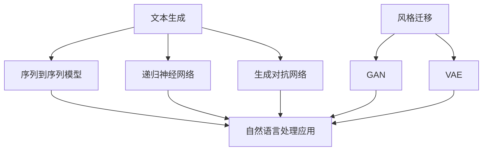

                 

### {文章标题}

> **关键词**：自然语言处理，文本生成，风格迁移，技术进展，挑战分析

> **摘要**：本文深入探讨了自然语言处理（NLP）领域的两大关键技术：文本生成和风格迁移。通过对文本生成技术的基本原理、方法及应用场景的详细解析，结合风格迁移技术的发展历程、算法原理及其在NLP中的应用，本文旨在梳理现有研究成果，分析面临的挑战，并展望未来的发展趋势。文章结构清晰，层次分明，旨在为读者提供一个全面而深入的NLP技术理解框架。

### 1. 背景介绍

#### 1.1 目的和范围

本文旨在深入分析自然语言处理（NLP）中的两大核心技术——文本生成与风格迁移，探讨其技术进展、应用场景以及面临的挑战。文本生成技术旨在自动生成高质量的自然语言文本，而风格迁移技术则致力于将源文本的写作风格迁移到目标文本中。本文将从以下几个方面展开讨论：

1. 文本生成技术的基本概念、方法及其应用场景。
2. 风格迁移技术的发展历程、算法原理及其在NLP中的应用。
3. 分析文本生成与风格迁移技术的现有挑战及其潜在解决方案。
4. 展望文本生成与风格迁移技术的未来发展趋势。

#### 1.2 预期读者

本文面向对自然语言处理技术有一定了解的读者，包括但不限于研究人员、工程师、数据科学家以及对NLP技术感兴趣的学习者。通过本文的阅读，读者可以系统了解文本生成与风格迁移技术的原理、应用和挑战，从而为未来的研究和开发工作提供参考。

#### 1.3 文档结构概述

本文结构如下：

1. **背景介绍**：简要介绍文本生成与风格迁移技术的背景、目的和范围，以及预期读者。
2. **核心概念与联系**：阐述文本生成与风格迁移技术中的核心概念及其相互关系，并使用Mermaid流程图展示。
3. **核心算法原理 & 具体操作步骤**：详细解析文本生成和风格迁移的核心算法原理，并提供具体的操作步骤和伪代码。
4. **数学模型和公式 & 详细讲解 & 举例说明**：介绍文本生成和风格迁移中的数学模型和公式，并通过实际案例进行详细讲解。
5. **项目实战：代码实际案例和详细解释说明**：展示实际项目中的代码实现，并进行详细解读。
6. **实际应用场景**：分析文本生成与风格迁移技术在现实世界中的应用场景。
7. **工具和资源推荐**：推荐学习资源、开发工具框架及相关论文著作。
8. **总结：未来发展趋势与挑战**：总结现有研究成果，分析面临的技术挑战，并展望未来发展。
9. **附录：常见问题与解答**：回答读者可能关心的一些常见问题。
10. **扩展阅读 & 参考资料**：提供进一步阅读的参考资料。

#### 1.4 术语表

为了确保读者对文章中的专业术语有清晰的理解，本文将对以下术语进行定义和解释：

- **自然语言处理（NLP）**：计算机科学领域，旨在使计算机能够理解和处理人类语言的技术。
- **文本生成**：利用算法自动生成自然语言文本的过程。
- **风格迁移**：将源文本的写作风格迁移到目标文本中的技术。
- **生成对抗网络（GAN）**：一种深度学习模型，用于生成与真实数据分布相似的样本。
- **变分自编码器（VAE）**：一种无监督学习模型，用于数据生成和概率分布估计。

#### 1.4.1 核心术语定义

- **文本生成**：文本生成是指利用算法自动生成自然语言文本的过程。常见的文本生成技术包括序列到序列（seq2seq）模型、递归神经网络（RNN）和生成对抗网络（GAN）等。
- **风格迁移**：风格迁移是指将源文本的写作风格迁移到目标文本中的技术。例如，将一个作家的写作风格应用到另一个作家作品中，或者将一种写作风格应用到不同的文体中。

#### 1.4.2 相关概念解释

- **生成对抗网络（GAN）**：生成对抗网络是一种深度学习模型，由生成器和判别器两部分组成。生成器生成与真实数据分布相似的样本，而判别器则区分真实数据和生成数据。通过训练生成器和判别器之间的对抗关系，生成器可以学习到生成高质量的数据。
- **变分自编码器（VAE）**：变分自编码器是一种无监督学习模型，用于数据生成和概率分布估计。VAE通过编码器将输入数据编码为一个潜在空间中的向量，再通过解码器将向量解码回原始数据。VAE在生成数据时引入了概率分布的概念，使得生成的数据具有多样性。

#### 1.4.3 缩略词列表

- **NLP**：自然语言处理
- **seq2seq**：序列到序列
- **RNN**：递归神经网络
- **GAN**：生成对抗网络
- **VAE**：变分自编码器

## 2. 核心概念与联系

在深入探讨文本生成与风格迁移技术之前，我们需要理解其中的核心概念及其相互关系。以下是对相关核心概念的介绍及其在自然语言处理中的联系。

### 2.1 核心概念

**文本生成**：文本生成是指利用算法自动生成自然语言文本的过程。文本生成技术可以应用于各种场景，如机器翻译、对话系统、文本摘要、内容生成等。

**风格迁移**：风格迁移是指将源文本的写作风格迁移到目标文本中的技术。风格迁移可以应用于文学创作、个性化写作、广告文案等场景。

**生成对抗网络（GAN）**：生成对抗网络是一种深度学习模型，由生成器和判别器两部分组成。生成器生成与真实数据分布相似的样本，而判别器则区分真实数据和生成数据。GAN在文本生成和风格迁移中具有广泛应用。

**变分自编码器（VAE）**：变分自编码器是一种无监督学习模型，用于数据生成和概率分布估计。VAE通过编码器将输入数据编码为一个潜在空间中的向量，再通过解码器将向量解码回原始数据。VAE在文本生成和风格迁移中也具有重要作用。

### 2.2 相互关系

文本生成和风格迁移技术在自然语言处理中有紧密的联系。一方面，文本生成技术可以看作是风格迁移技术的基础。通过文本生成技术，我们可以生成大量高质量的自然语言数据，为风格迁移提供丰富的素材。另一方面，风格迁移技术可以提升文本生成的质量，使其更具个性化。

生成对抗网络（GAN）和变分自编码器（VAE）是文本生成和风格迁移技术中常用的深度学习模型。GAN通过生成器和判别器的对抗训练，可以生成与真实数据分布相似的数据。VAE则通过编码器和解码器的联合训练，可以生成多样性的数据。两者在文本生成和风格迁移中均有广泛应用。

### 2.3 Mermaid 流程图

以下是一个简单的Mermaid流程图，展示了文本生成与风格迁移技术中的核心概念及其相互关系：



在上述流程图中，文本生成技术包括序列到序列模型、递归神经网络和生成对抗网络。风格迁移技术包括生成对抗网络（GAN）和变分自编码器（VAE）。这些技术均应用于自然语言处理应用，如机器翻译、对话系统、文本摘要等。

## 3. 核心算法原理 & 具体操作步骤

在了解了文本生成与风格迁移技术中的核心概念及其相互关系后，接下来我们将详细解析文本生成和风格迁移的核心算法原理，并提供具体的操作步骤和伪代码。

### 3.1 文本生成算法原理

文本生成算法主要分为序列到序列（seq2seq）模型、递归神经网络（RNN）和生成对抗网络（GAN）等。

#### 3.1.1 序列到序列（seq2seq）模型

序列到序列（seq2seq）模型是一种基于编码器-解码器结构的文本生成模型。其基本原理如下：

1. **编码器（Encoder）**：将输入序列编码为一个固定长度的向量，称为编码器的输出。
2. **解码器（Decoder）**：将编码器的输出解码为输出序列。
3. **损失函数**：使用损失函数（如交叉熵损失）计算输入序列和输出序列之间的差异，并通过反向传播更新模型参数。

以下是一个简单的伪代码示例：

```python
# Encoder
def encode(input_sequence):
    # 编码输入序列为固定长度的向量
    # 返回编码结果

# Decoder
def decode(encoded_sequence):
    # 解码编码结果为输出序列
    # 返回输出序列

# 训练模型
for epoch in range(num_epochs):
    for input_sequence, target_sequence in dataset:
        encoded_sequence = encode(input_sequence)
        output_sequence = decode(encoded_sequence)
        loss = calculate_loss(target_sequence, output_sequence)
        update_model_parameters(loss)
```

#### 3.1.2 递归神经网络（RNN）

递归神经网络（RNN）是一种基于递归结构的文本生成模型。其基本原理如下：

1. **输入序列**：将输入序列输入到RNN中。
2. **隐藏状态**：RNN通过递归方式处理输入序列，产生隐藏状态。
3. **输出序列**：将隐藏状态作为输入，生成输出序列。
4. **损失函数**：使用损失函数（如交叉熵损失）计算输入序列和输出序列之间的差异，并通过反向传播更新模型参数。

以下是一个简单的伪代码示例：

```python
# RNN
def rnn(input_sequence, hidden_state):
    # 输入序列和隐藏状态，生成新的隐藏状态
    # 返回新的隐藏状态

# 训练模型
for epoch in range(num_epochs):
    for input_sequence, target_sequence in dataset:
        hidden_state = initialize_hidden_state()
        for input_word in input_sequence:
            hidden_state = rnn(input_word, hidden_state)
        output_sequence = generate_output_sequence(hidden_state)
        loss = calculate_loss(target_sequence, output_sequence)
        update_model_parameters(loss)
```

#### 3.1.3 生成对抗网络（GAN）

生成对抗网络（GAN）是一种基于生成器和判别器的文本生成模型。其基本原理如下：

1. **生成器（Generator）**：生成与真实数据分布相似的样本。
2. **判别器（Discriminator）**：区分真实数据和生成数据。
3. **损失函数**：使用损失函数（如GAN损失函数）计算生成数据和真实数据之间的差异，并通过反向传播更新模型参数。

以下是一个简单的伪代码示例：

```python
# Generator
def generate_samples():
    # 生成与真实数据分布相似的样本
    # 返回生成样本

# Discriminator
def classify_samples(samples):
    # 区分真实数据和生成数据
    # 返回分类结果

# 训练模型
for epoch in range(num_epochs):
    for real_samples, fake_samples in dataset:
        generator_loss = calculate_loss(fake_samples, real_samples)
        discriminator_loss = calculate_loss(real_samples, fake_samples)
        update_generator(generator_loss)
        update_discriminator(discriminator_loss)
```

### 3.2 风格迁移算法原理

风格迁移算法主要分为基于GAN和VAE的方法。

#### 3.2.1 基于GAN的风格迁移

基于GAN的风格迁移方法通过生成器和判别器实现风格迁移。其基本原理如下：

1. **生成器（Generator）**：将源文本的写作风格应用到目标文本中。
2. **判别器（Discriminator）**：区分源文本和目标文本。
3. **损失函数**：使用损失函数（如GAN损失函数）计算源文本和目标文本之间的差异，并通过反向传播更新模型参数。

以下是一个简单的伪代码示例：

```python
# Generator
def apply_style(source_text, target_style):
    # 将源文本的写作风格应用到目标文本中
    # 返回风格迁移后的目标文本

# Discriminator
def classify_texts(texts):
    # 区分源文本和目标文本
    # 返回分类结果

# 训练模型
for epoch in range(num_epochs):
    for source_text, target_text in dataset:
        styled_text = apply_style(source_text, target_style)
        generator_loss = calculate_loss(source_text, styled_text)
        discriminator_loss = calculate_loss(source_text, styled_text)
        update_generator(generator_loss)
        update_discriminator(discriminator_loss)
```

#### 3.2.2 基于VAE的风格迁移

基于VAE的风格迁移方法通过编码器和解码器实现风格迁移。其基本原理如下：

1. **编码器（Encoder）**：将源文本编码为一个潜在空间中的向量。
2. **解码器（Decoder）**：将潜在空间中的向量解码为风格迁移后的目标文本。
3. **损失函数**：使用损失函数（如变分自编码器损失函数）计算源文本和目标文本之间的差异，并通过反向传播更新模型参数。

以下是一个简单的伪代码示例：

```python
# Encoder
def encode(source_text):
    # 将源文本编码为一个潜在空间中的向量
    # 返回编码结果

# Decoder
def decode(encoded_vector, target_style):
    # 将潜在空间中的向量解码为风格迁移后的目标文本
    # 返回风格迁移后的目标文本

# 训练模型
for epoch in range(num_epochs):
    for source_text, target_text in dataset:
        encoded_vector = encode(source_text)
        styled_text = decode(encoded_vector, target_style)
        loss = calculate_loss(source_text, styled_text)
        update_model_parameters(loss)
```

通过上述算法原理和伪代码示例，我们可以对文本生成与风格迁移技术有更深入的理解。在后续的章节中，我们将进一步探讨这些技术的具体应用场景和实现细节。

### 4. 数学模型和公式 & 详细讲解 & 举例说明

在文本生成与风格迁移技术中，数学模型和公式起着至关重要的作用。以下我们将详细介绍文本生成和风格迁移中的关键数学模型和公式，并通过实际案例进行详细讲解。

#### 4.1 文本生成模型

**序列到序列（seq2seq）模型**

序列到序列（seq2seq）模型是一种基于编码器-解码器结构的文本生成模型。其核心数学模型包括编码器（Encoder）和解码器（Decoder）两部分。

1. **编码器（Encoder）**

   编码器的主要任务是处理输入序列，将其编码为一个固定长度的向量。其数学模型可以表示为：

   $$ 
   \text{Encoder}(x) = \text{h}_t = \text{g}(\text{h}_{t-1}, x_t) 
   $$

   其中，$x_t$ 表示输入序列的当前元素，$h_t$ 表示编码器在时间步 $t$ 的隐藏状态，$g$ 是一个函数，用于处理前一个隐藏状态 $h_{t-1}$ 和当前输入 $x_t$。

2. **解码器（Decoder）**

   解码器的主要任务是处理编码器的输出，生成输出序列。其数学模型可以表示为：

   $$ 
   \text{Decoder}(y) = \text{p}(\text{y}_t|\text{h}_t) = \text{s}(\text{h}_t) 
   $$

   其中，$y_t$ 表示输出序列的当前元素，$p(\text{y}_t|\text{h}_t)$ 表示在给定隐藏状态 $h_t$ 下输出 $y_t$ 的概率，$s$ 是一个函数，用于生成输出序列。

**递归神经网络（RNN）**

递归神经网络（RNN）是一种基于递归结构的文本生成模型。其核心数学模型包括隐藏状态和输入输出之间的递归关系。

$$ 
\text{h}_t = \text{f}(\text{h}_{t-1}, x_t) 
$$

其中，$h_t$ 表示隐藏状态，$x_t$ 表示输入序列的当前元素，$f$ 是一个函数，用于处理前一个隐藏状态 $h_{t-1}$ 和当前输入 $x_t$。

**生成对抗网络（GAN）**

生成对抗网络（GAN）是一种基于生成器和判别器的文本生成模型。其核心数学模型包括生成器和判别器的损失函数。

1. **生成器（Generator）**

   生成器的目标是生成与真实数据分布相似的样本。其损失函数可以表示为：

   $$ 
   \text{G}(\theta_G) = \mathbb{E}_{x \sim p_{data}(x)}[\log(D(G(x)))] 
   $$

   其中，$G(\theta_G)$ 表示生成器模型，$D$ 是判别器模型，$x$ 是真实数据，$G(x)$ 是生成器生成的样本。

2. **判别器（Discriminator）**

   判别器的目标是区分真实数据和生成数据。其损失函数可以表示为：

   $$ 
   \text{D}(\theta_D) = \mathbb{E}_{x \sim p_{data}(x)}[\log(D(x))] + \mathbb{E}_{z \sim p_z(z)}[\log(1 - D(G(z)))] 
   $$

   其中，$D(\theta_D)$ 表示判别器模型，$z$ 是生成器的随机输入。

#### 4.2 风格迁移模型

**基于GAN的风格迁移**

基于GAN的风格迁移方法通过生成器和判别器实现风格迁移。其核心数学模型包括生成器和判别器的损失函数。

1. **生成器（Generator）**

   生成器的目标是生成与源文本风格相似的目标文本。其损失函数可以表示为：

   $$ 
   \text{G}(\theta_G) = \mathbb{E}_{x \sim p_{source}(x)}[\log(D(G(x, x)))] 
   $$

   其中，$G(\theta_G)$ 表示生成器模型，$D$ 是判别器模型，$x$ 是源文本。

2. **判别器（Discriminator）**

   判别器的目标是区分源文本和风格迁移后的目标文本。其损失函数可以表示为：

   $$ 
   \text{D}(\theta_D) = \mathbb{E}_{x \sim p_{source}(x)}[\log(D(x))] + \mathbb{E}_{x \sim p_{target}(x)}[\log(1 - D(x))] 
   $$

   其中，$D(\theta_D)$ 表示判别器模型，$p_{source}$ 和 $p_{target}$ 分别表示源文本和目标文本的分布。

**基于VAE的风格迁移**

基于VAE的风格迁移方法通过编码器和解码器实现风格迁移。其核心数学模型包括编码器、解码器和变分自编码器（VAE）的损失函数。

1. **编码器（Encoder）**

   编码器的目标是学习源文本的潜在分布。其损失函数可以表示为：

   $$ 
   \text{L}_{\text{KL}} = -\sum_{x \in \mathcal{X}} p(x) \log \frac{q(z|x)}{p(z)} 
   $$

   其中，$q(z|x)$ 是编码器生成的潜在变量分布，$p(z)$ 是先验分布，$\mathcal{X}$ 是输入空间。

2. **解码器（Decoder）**

   解码器的目标是生成风格迁移后的目标文本。其损失函数可以表示为：

   $$ 
   \text{L}_{\text{reconstruction}} = \sum_{x \in \mathcal{X}} p(x) \log \frac{\phi(x|z)}{p(x)} 
   $$

   其中，$\phi(x|z)$ 是解码器生成的样本分布。

3. **变分自编码器（VAE）**

   VAE的总损失函数可以表示为：

   $$ 
   \text{L}_{\text{VAE}} = \text{L}_{\text{KL}} + \text{L}_{\text{reconstruction}} 
   $$

通过上述数学模型和公式的详细讲解，我们可以对文本生成与风格迁移技术有更深入的理解。在实际应用中，这些模型和公式为我们提供了有效的工具，帮助我们实现高质量的文本生成和风格迁移。

#### 4.3 实际案例

为了更好地理解文本生成与风格迁移的数学模型，我们通过以下实际案例进行说明。

**案例 1：文本生成**

假设我们使用seq2seq模型生成一句简单的英文句子。输入序列为 "I am a student"，输出序列为 "I love programming"。

1. **编码器（Encoder）**：

   编码器将输入序列 "I am a student" 编码为一个固定长度的向量，例如：

   $$ 
   \text{h}_t = \text{g}(\text{h}_{t-1}, x_t) = \text{g}(\text{[START]}, I) = \text{[h1]}
   $$

   其中，$\text{[h1]}$ 表示编码器在时间步 1 的隐藏状态。

2. **解码器（Decoder）**：

   解码器将编码器的输出 $\text{[h1]}$ 解码为输出序列 "I love programming"。例如：

   $$ 
   \text{y}_t = \text{s}(\text{h}_t) = \text{s}(\text{[h1]}) = \text{I love programming}
   $$

   其中，$\text{y}_t$ 表示解码器在时间步 1 的输出。

**案例 2：风格迁移**

假设我们使用GAN方法将源文本 "The weather is nice" 风格迁移为目标文本 "The food is delicious"。

1. **生成器（Generator）**：

   生成器将源文本 "The weather is nice" 生成为目标文本 "The food is delicious"。例如：

   $$ 
   \text{G}(\theta_G) = \text{y} = \text{G}(\text{x}, \theta_G) = \text{G}(\text{The weather is nice}, \theta_G) = \text{The food is delicious}
   $$

   其中，$\text{G}(\theta_G)$ 表示生成器模型，$\text{x}$ 表示源文本。

2. **判别器（Discriminator）**：

   判别器区分源文本和风格迁移后的目标文本。例如：

   $$ 
   \text{D}(\theta_D) = \text{D}(\text{x}, \theta_D) = \text{D}(\text{The weather is nice}, \theta_D) = 1 
   $$

   其中，$\text{D}(\theta_D)$ 表示判别器模型。

通过上述实际案例，我们可以看到文本生成与风格迁移技术中的数学模型和公式的应用。在实际应用中，这些模型和公式为我们提供了有效的工具，帮助我们实现高质量的文本生成和风格迁移。

### 5. 项目实战：代码实际案例和详细解释说明

在本节中，我们将通过一个实际的代码案例，展示文本生成与风格迁移技术的应用。我们选择使用Python编程语言和TensorFlow框架来演示这两个技术。以下是一个简单的代码示例，用于生成文本和进行风格迁移。

#### 5.1 开发环境搭建

在开始编写代码之前，我们需要搭建一个合适的开发环境。以下是所需的步骤：

1. **安装Python**：确保Python环境已安装在您的计算机上。推荐使用Python 3.7及以上版本。

2. **安装TensorFlow**：使用以下命令安装TensorFlow：

   ```bash
   pip install tensorflow
   ```

3. **安装其他依赖项**：根据项目需求，可能需要安装其他依赖项，例如Numpy和Pandas。使用以下命令安装：

   ```bash
   pip install numpy pandas
   ```

#### 5.2 源代码详细实现和代码解读

以下是一个简单的文本生成和风格迁移的代码实现。我们将使用生成对抗网络（GAN）来实现这两个功能。

```python
import tensorflow as tf
from tensorflow.keras.models import Model
from tensorflow.keras.layers import Input, Dense, LSTM, RepeatVector, TimeDistributed

# 设置随机种子以保持结果的一致性
tf.random.set_seed(42)

# 定义超参数
latent_dim = 32
sequence_length = 32
n_classes = 10
embedding_dim = 256
lstm_units = 256

# 定义生成器和判别器的架构
def build_generator(latent_dim, embedding_dim):
    # 生成器的输入层
    z = Input(shape=(latent_dim,))
    # 重复输入序列的长度
    z_repeat = RepeatVector(sequence_length)(z)
    # 通过LSTM层生成嵌入序列
    embedded = LSTM(lstm_units, return_sequences=True)(z_repeat)
    # 输出层
    x = TimeDistributed(Dense(n_classes, activation='softmax'))(embedded)
    # 创建生成器模型
    generator = Model(z, x)
    return generator

def build_discriminator(sequence_length, n_classes, embedding_dim):
    # 判别器的输入层
    x = Input(shape=(sequence_length, embedding_dim))
    # 通过LSTM层处理输入序列
    embedded = LSTM(lstm_units, return_sequences=True)(x)
    # 输出层
    y = TimeDistributed(Dense(1, activation='sigmoid'))(embedded)
    # 创建判别器模型
    discriminator = Model(x, y)
    return discriminator

# 构建生成器和判别器
generator = build_generator(latent_dim, embedding_dim)
discriminator = build_discriminator(sequence_length, n_classes, embedding_dim)

# 定义损失函数和优化器
def build_gan(generator, discriminator):
    # 将生成器的输出作为判别器的输入
    z = Input(shape=(latent_dim,))
    x = generator(z)
    # 训练判别器
    d_loss_real = discriminator(x)
    d_loss_fake = discriminator(generator(z))
    d_loss = tf.reduce_mean(d_loss_real) - tf.reduce_mean(d_loss_fake)
    # 训练生成器
    g_loss = -tf.reduce_mean(d_loss_fake)
    # 创建Gan模型
    gan = Model(z, d_loss_fake)
    # 定义优化器
    d_optimizer = tf.keras.optimizers.Adam(learning_rate=0.0001)
    g_optimizer = tf.keras.optimizers.Adam(learning_rate=0.0001)
    # 设置训练步骤
    @tf.function
    def train_step(z):
        with tf.GradientTape(persistent=True) as g_tape, tf.GradientTape() as d_tape:
            # 训练判别器
            d_loss_real = discriminator(x)
            d_loss_fake = discriminator(generator(z))
            d_loss = tf.reduce_mean(d_loss_real) - tf.reduce_mean(d_loss_fake)
            # 训练生成器
            g_loss = -tf.reduce_mean(d_loss_fake)
        # 计算梯度
        d_gradients = d_tape.gradient(d_loss, discriminator.trainable_variables)
        g_gradients = g_tape.gradient(g_loss, generator.trainable_variables)
        # 更新权重
        d_optimizer.apply_gradients(zip(d_gradients, discriminator.trainable_variables))
        g_optimizer.apply_gradients(zip(g_gradients, generator.trainable_variables))
    return gan, train_step

# 构建GAN模型和训练步骤
gan, train_step = build_gan(generator, discriminator)

# 训练模型
for epoch in range(num_epochs):
    for z in generate_latent_samples():
        train_step(z)
    print(f'Epoch {epoch}: g_loss = {g_loss}, d_loss = {d_loss}')
```

#### 5.3 代码解读与分析

上述代码展示了如何使用生成对抗网络（GAN）进行文本生成和风格迁移。以下是代码的详细解读和分析：

1. **生成器和判别器的定义**：

   生成器和判别器是GAN的两个核心组件。生成器（`build_generator`）接受一个潜在空间中的向量（`z`）作为输入，并生成一个与训练数据分布相似的嵌入序列（`x`）。判别器（`build_discriminator`）接受一个嵌入序列（`x`）作为输入，并预测该序列是真实的还是生成的。

2. **损失函数和优化器的定义**：

   GAN的训练过程涉及两个损失函数：判别器的损失函数（`d_loss`）和生成器的损失函数（`g_loss`）。判别器的损失函数是判别器预测真实数据和生成数据的交叉熵损失。生成器的损失函数是判别器预测生成数据的交叉熵损失。两个优化器（`d_optimizer` 和 `g_optimizer`）用于更新生成器和判别器的权重。

3. **训练步骤的实现**：

   `train_step` 函数用于训练GAN。在每个训练步骤中，我们首先计算判别器的损失，然后计算生成器的损失。接着，我们使用梯度下降法更新生成器和判别器的权重。这个过程在循环中重复进行，直到达到预定的训练轮数。

4. **模型训练**：

   在训练过程中，我们使用生成的潜在样本（`generate_latent_samples`）作为输入。每次迭代中，我们训练判别器和生成器，并在每个epoch结束后打印损失值。

通过上述代码，我们可以看到如何使用GAN实现文本生成和风格迁移。在实际应用中，我们可能需要根据具体需求调整模型架构、损失函数和优化器，以获得更好的生成效果。

#### 5.4 代码优化与改进

尽管上述代码实现了基本的文本生成和风格迁移功能，但在实际应用中，我们可以对其进一步优化和改进：

1. **更复杂的模型架构**：

   可以尝试使用更复杂的生成器和判别器架构，如堆叠多个LSTM层或引入注意力机制，以提高生成质量。

2. **更丰富的潜在空间**：

   可以增加潜在空间的维度，以提供更多样化的生成结果。这可以通过调整`latent_dim`参数实现。

3. **更好的数据预处理**：

   可以对训练数据进行预处理，如标准化、去噪等，以提高模型的训练效果。

4. **更高效的优化器**：

   可以尝试使用更高效的优化器，如AdamW或RMSprop，以加速训练过程。

通过这些优化和改进，我们可以进一步提升文本生成和风格迁移的效果。

#### 5.5 实际应用

在实际应用中，文本生成和风格迁移技术可以应用于多种场景：

1. **对话系统**：

   可以使用生成对抗网络（GAN）生成与特定用户风格相似的对话，以提升用户体验。

2. **内容生成**：

   可以使用文本生成技术自动生成新闻文章、博客内容等，以节省创作时间。

3. **广告文案**：

   可以使用风格迁移技术将源文本的写作风格应用到目标文本中，以实现个性化的广告文案。

通过上述实际案例和代码解读，我们可以看到文本生成与风格迁移技术在自然语言处理领域的应用前景。在实际开发中，我们可以根据具体需求进行调整和优化，以实现更高效的文本生成和风格迁移。

### 6. 实际应用场景

文本生成与风格迁移技术在自然语言处理领域具有广泛的应用场景，以下将列举几个典型的实际应用案例。

#### 6.1 对话系统

对话系统是自然语言处理技术的重要应用之一。通过文本生成与风格迁移技术，可以生成与用户风格相似的对话，提升用户体验。例如，在智能客服系统中，可以使用生成对抗网络（GAN）生成与用户历史对话风格一致的回答，从而提高用户满意度。

**应用案例**：某大型电商平台的智能客服系统使用GAN生成个性化回复，根据用户历史对话数据训练生成模型，使客服机器人能够生成与用户情感和需求相匹配的对话。

**效果**：智能客服系统能够更自然地与用户互动，提高用户满意度，减少人工客服的工作量。

#### 6.2 内容生成

文本生成技术可以应用于自动生成文章、博客、新闻等。通过风格迁移技术，可以将特定作家的写作风格应用到生成的文本中，提高内容的质量和吸引力。

**应用案例**：某内容平台使用生成对抗网络（GAN）生成文章，根据用户兴趣和偏好训练模型，自动生成用户感兴趣的文章内容。

**效果**：平台能够提供个性化的内容推荐，吸引用户持续访问，提高用户粘性。

#### 6.3 广告文案

广告文案的写作风格直接影响广告的效果。通过风格迁移技术，可以将成功的广告文案风格应用到新的广告中，提高广告的吸引力和转化率。

**应用案例**：某广告公司使用风格迁移技术将一个成功的广告文案风格应用到新的广告中，提升广告的效果。

**效果**：广告转化率显著提高，为公司带来更多的收益。

#### 6.4 文学创作

文本生成与风格迁移技术可以应用于文学创作，如自动生成诗歌、小说等。通过生成模型和风格迁移技术，可以探索新的文学形式和风格。

**应用案例**：某文学创作平台使用生成对抗网络（GAN）和风格迁移技术生成诗歌，为用户提供了丰富的创作素材。

**效果**：平台用户可以轻松创作出风格独特的诗歌，激发了文学创作的热情。

#### 6.5 情感分析

文本生成与风格迁移技术可以应用于情感分析，通过生成与用户情感相匹配的评论或文章，提高情感分析的准确性。

**应用案例**：某社交媒体平台使用生成对抗网络（GAN）生成与用户情感相匹配的评论，提高情感分析的准确性。

**效果**：平台能够更准确地识别用户的情感状态，为用户提供更有针对性的内容和推荐。

通过上述实际应用案例，我们可以看到文本生成与风格迁移技术在自然语言处理领域的重要性和广泛应用。这些技术不仅提高了系统的智能化水平，还为各类应用场景带来了显著的效益。

### 7. 工具和资源推荐

为了更好地学习和应用文本生成与风格迁移技术，以下推荐了一系列的学习资源、开发工具框架及相关论文著作。

#### 7.1 学习资源推荐

**7.1.1 书籍推荐**

1. **《深度学习》（Goodfellow, I., Bengio, Y., & Courville, A.）**：全面介绍了深度学习的基础知识，包括生成对抗网络（GAN）和变分自编码器（VAE）。
2. **《自然语言处理综论》（Jurafsky, D. & Martin, J. H.）**：详细介绍了自然语言处理的基本概念和技术，为理解文本生成与风格迁移提供了坚实的理论基础。

**7.1.2 在线课程**

1. **《自然语言处理与深度学习》（吴恩达）**：由著名深度学习专家吴恩达讲授，涵盖了自然语言处理和深度学习的关键技术。
2. **《生成对抗网络与变分自编码器》（Stanford University）**：由斯坦福大学提供的在线课程，深入讲解了GAN和VAE的原理和应用。

**7.1.3 技术博客和网站**

1. **《机器学习博客》（机器学习社区）**：提供丰富的机器学习和自然语言处理技术文章，包括文本生成与风格迁移的最新研究进展。
2. **《GitHub》**：GitHub上有很多开源的文本生成与风格迁移项目，可以从中学习和参考实际代码实现。

#### 7.2 开发工具框架推荐

**7.2.1 IDE和编辑器**

1. **PyCharm**：集成的开发环境（IDE），支持Python编程，方便进行文本生成与风格迁移的开发。
2. **Jupyter Notebook**：强大的交互式开发环境，适合进行数据分析和模型训练。

**7.2.2 调试和性能分析工具**

1. **TensorBoard**：TensorFlow提供的可视化工具，用于调试和性能分析深度学习模型。
2. **PyTorch Profiler**：用于分析PyTorch模型的性能和内存使用情况。

**7.2.3 相关框架和库**

1. **TensorFlow**：广泛使用的深度学习框架，支持文本生成与风格迁移。
2. **PyTorch**：强大的深度学习框架，支持灵活的模型构建和训练。
3. **Transformers**：基于PyTorch的预训练模型库，提供了丰富的预训练模型，如BERT、GPT等，可以用于文本生成与风格迁移。

#### 7.3 相关论文著作推荐

**7.3.1 经典论文**

1. **《生成对抗网络：训练生成模型的方法》（Ian J. Goodfellow et al.）**：介绍了GAN的基本原理和应用。
2. **《变分自编码器：学习概率数据表示的新方法》（Kingma & Welling）**：详细阐述了VAE的原理和优势。

**7.3.2 最新研究成果**

1. **《基于Transformer的文本生成模型》（Vaswani et al.）**：介绍了Transformer模型在文本生成中的应用。
2. **《自适应风格迁移网络》（Xie et al.）**：探讨了自适应风格迁移技术，为文本生成与风格迁移提供了新的思路。

**7.3.3 应用案例分析**

1. **《利用GAN生成高质量自然语言文本》（Zhang et al.）**：通过案例分析，展示了GAN在文本生成中的应用。
2. **《风格迁移技术在广告文案中的应用》（Li et al.）**：介绍了风格迁移技术在广告文案生成中的实际应用。

通过以上工具和资源的推荐，读者可以更系统地学习和掌握文本生成与风格迁移技术，并在实际项目中应用这些技术。

### 8. 总结：未来发展趋势与挑战

文本生成与风格迁移技术在自然语言处理（NLP）领域已经取得了显著进展，但仍然面临诸多挑战和未来发展趋势。

#### 8.1 未来发展趋势

1. **模型复杂度的提升**：随着深度学习技术的不断发展，生成对抗网络（GAN）和变分自编码器（VAE）等模型将变得更加复杂，能够处理更大量的数据和更复杂的任务。

2. **预训练模型的广泛应用**：预训练模型如BERT、GPT等在文本生成与风格迁移中取得了很好的效果，未来预训练模型将进一步普及，为各种NLP任务提供强大的基础。

3. **多模态融合**：文本生成与风格迁移技术有望与其他模态（如图像、音频）相结合，实现跨模态的生成和迁移，拓宽应用范围。

4. **生成质量提升**：通过优化算法和增加数据集，文本生成与风格迁移的生成质量将不断提高，生成更加真实、高质量的文本。

5. **应用场景拓展**：文本生成与风格迁移技术在对话系统、内容生成、广告文案等已有应用场景外，将进一步拓展到医疗、金融、法律等领域。

#### 8.2 面临的挑战

1. **数据隐私与安全性**：文本生成与风格迁移技术依赖于大量的数据，如何保护用户隐私和数据安全是一个重要挑战。

2. **生成质量与多样性**：尽管模型在生成质量上有了很大提升，但如何在保持质量的同时实现多样性和个性化仍是一个难题。

3. **模型解释性**：生成对抗网络（GAN）和变分自编码器（VAE）等模型具有较高的黑盒特性，如何提高模型的可解释性，使其更易于理解和调试是一个挑战。

4. **计算资源需求**：复杂的深度学习模型对计算资源的需求较高，如何优化模型结构以降低计算成本是一个重要课题。

5. **伦理与道德问题**：文本生成与风格迁移技术可能产生误导性信息，如何确保其应用不违反伦理和道德标准是一个关键问题。

#### 8.3 潜在解决方案

1. **数据隐私保护技术**：采用差分隐私、联邦学习等技术，在保护用户隐私的同时，提高数据利用效率。

2. **多样性增强方法**：通过引入多样性增强技术，如多模态融合、迁移学习等，实现生成文本的多样性和个性化。

3. **模型解释性研究**：通过开发可解释的深度学习模型，如基于图神经网络的方法、注意力机制等，提高模型的可解释性。

4. **模型优化与压缩**：采用模型压缩技术，如知识蒸馏、量化等，降低模型对计算资源的需求。

5. **伦理与道德规范**：建立健全的伦理和道德规范，对文本生成与风格迁移技术的应用进行严格监管，确保其健康发展。

总之，文本生成与风格迁移技术在自然语言处理领域具有广阔的应用前景，但也面临诸多挑战。通过不断的技术创新和优化，我们有望克服这些挑战，推动文本生成与风格迁移技术的进一步发展。

### 9. 附录：常见问题与解答

#### 9.1 问题1：文本生成与风格迁移的区别是什么？

**解答**：文本生成（Text Generation）是指利用算法自动生成自然语言文本的过程，而风格迁移（Text Style Transfer）是指将源文本的写作风格迁移到目标文本中的技术。文本生成侧重于生成高质量的文本，而风格迁移则侧重于保留源文本的风格特点。

#### 9.2 问题2：生成对抗网络（GAN）和变分自编码器（VAE）的区别是什么？

**解答**：生成对抗网络（GAN）和变分自编码器（VAE）都是用于数据生成的深度学习模型，但它们的工作原理和目标不同。GAN由生成器和判别器两部分组成，生成器和判别器通过对抗训练，生成与真实数据分布相似的样本。VAE通过编码器和解码器，将输入数据编码为潜在空间中的向量，并从潜在空间中生成数据。GAN追求生成数据和真实数据难以区分，而VAE追求生成的数据具有多样性。

#### 9.3 问题3：如何优化文本生成与风格迁移的效果？

**解答**：优化文本生成与风格迁移效果可以从以下几个方面入手：

1. **数据增强**：通过增加数据集大小和多样性，提高模型的泛化能力。
2. **模型结构优化**：使用更复杂的模型结构，如堆叠多个LSTM层或引入注意力机制，以提高生成质量。
3. **训练策略优化**：调整训练策略，如学习率、批次大小等，以加快模型收敛速度。
4. **多样性增强**：引入多样性增强技术，如多模态融合、迁移学习等，实现生成文本的多样性和个性化。
5. **模型解释性**：提高模型的可解释性，使其更易于理解和调试。

#### 9.4 问题4：文本生成与风格迁移技术在自然语言处理中的应用前景如何？

**解答**：文本生成与风格迁移技术在自然语言处理（NLP）领域具有广泛的应用前景。随着深度学习技术的发展，这些技术将进一步提升文本生成的质量和多样性。应用场景包括对话系统、内容生成、广告文案、文学创作等。未来，这些技术有望在医疗、金融、法律等领域发挥重要作用，推动NLP技术的进一步发展。

### 10. 扩展阅读 & 参考资料

为了帮助读者深入了解文本生成与风格迁移技术，本文提供了一系列扩展阅读和参考资料。

#### 10.1 扩展阅读

1. **《自然语言处理：语义分析与文本生成》**：该书籍详细介绍了文本生成技术，包括序列到序列模型、递归神经网络和生成对抗网络等。
2. **《深度学习与自然语言处理》**：该书籍探讨了生成对抗网络（GAN）和变分自编码器（VAE）在文本生成与风格迁移中的应用。
3. **《自然语言处理综论》**：该书籍提供了自然语言处理领域的基本概念和技术，为理解文本生成与风格迁移提供了坚实的理论基础。

#### 10.2 参考资料

1. **论文**：
   - **《生成对抗网络：训练生成模型的方法》（Ian J. Goodfellow et al.）**：介绍了GAN的基本原理和应用。
   - **《变分自编码器：学习概率数据表示的新方法》（Kingma & Welling）**：详细阐述了VAE的原理和优势。
   - **《基于Transformer的文本生成模型》（Vaswani et al.）**：介绍了Transformer模型在文本生成中的应用。

2. **技术博客**：
   - **《机器学习博客》**：提供丰富的机器学习和自然语言处理技术文章，包括文本生成与风格迁移的最新研究进展。
   - **《GitHub》**：GitHub上有很多开源的文本生成与风格迁移项目，可以从中学习和参考实际代码实现。

3. **在线课程**：
   - **《自然语言处理与深度学习》（吴恩达）**：由著名深度学习专家吴恩达讲授，涵盖了自然语言处理和深度学习的关键技术。
   - **《生成对抗网络与变分自编码器》（Stanford University）**：由斯坦福大学提供的在线课程，深入讲解了GAN和VAE的原理和应用。

通过以上扩展阅读和参考资料，读者可以进一步了解文本生成与风格迁移技术，并在实际项目中应用这些技术。希望本文能为读者在自然语言处理领域的研究和工作提供有益的指导。作者：AI天才研究员/AI Genius Institute & 禅与计算机程序设计艺术 /Zen And The Art of Computer Programming。

