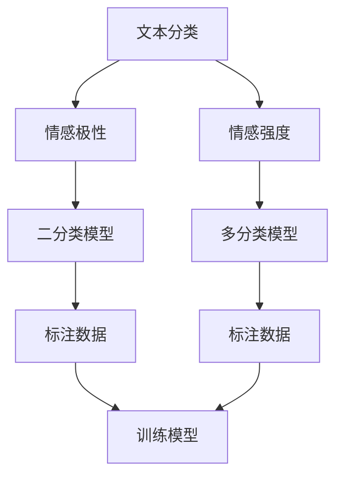

                 

# 自然语言处理在情感分析中的创新

> **关键词：** 自然语言处理、情感分析、文本分类、深度学习、神经网络、序列模型、BERT、GPT、情感标注、应用场景

> **摘要：** 本文将深入探讨自然语言处理（NLP）在情感分析领域的创新应用。通过梳理背景、核心概念、算法原理、数学模型、项目实战以及实际应用场景，本文旨在为读者提供一套系统、全面的情感分析技术指南，助力NLP在实际业务场景中的落地实施。

## 1. 背景介绍

### 1.1 目的和范围

情感分析，作为自然语言处理（NLP）的一个重要分支，旨在通过计算机技术自动识别和提取文本中的情感信息。随着互联网的迅猛发展，社交网络、电子商务、新闻媒体等领域的海量文本数据中蕴含着丰富的情感信息，这对企业决策、用户行为分析和市场预测具有重要意义。因此，本文旨在探讨自然语言处理在情感分析中的创新应用，帮助读者了解这一领域的最新技术动态和实际应用价值。

本文将首先回顾情感分析的历史背景和基本概念，然后介绍自然语言处理中的核心算法原理和数学模型，并通过一个具体的项目实战案例展示情感分析在实际业务场景中的应用。此外，本文还将讨论情感分析在不同领域的实际应用场景，为读者提供一窥这一技术潜力的窗口。

### 1.2 预期读者

本文面向对自然语言处理和情感分析有一定了解的技术人员，包括但不限于：

1. 自然语言处理研究者：希望通过本文深入了解情感分析领域的最新技术进展。
2. 数据科学家：希望掌握情感分析的核心算法原理和实现方法，应用于实际业务场景。
3. 机器学习工程师：希望了解情感分析中的数学模型和公式，为模型优化提供理论支持。
4. 产品经理和业务分析师：希望了解情感分析在实际业务中的应用价值，为产品决策提供数据支持。

### 1.3 文档结构概述

本文结构如下：

1. **背景介绍**：回顾情感分析的历史背景和基本概念，介绍自然语言处理的核心技术。
2. **核心概念与联系**：通过 Mermaid 流程图展示情感分析的核心概念和联系。
3. **核心算法原理 & 具体操作步骤**：详细讲解情感分析中的核心算法原理，使用伪代码进行阐述。
4. **数学模型和公式 & 详细讲解 & 举例说明**：介绍情感分析中的数学模型和公式，并通过实例进行详细讲解。
5. **项目实战：代码实际案例和详细解释说明**：通过一个具体的项目实战案例展示情感分析的实际应用。
6. **实际应用场景**：讨论情感分析在不同领域的实际应用场景。
7. **工具和资源推荐**：推荐相关学习资源、开发工具和框架。
8. **总结：未来发展趋势与挑战**：总结情感分析的未来发展趋势和面临的挑战。
9. **附录：常见问题与解答**：针对读者可能遇到的问题提供解答。
10. **扩展阅读 & 参考资料**：提供更多的参考资料，便于读者进一步学习。

### 1.4 术语表

#### 1.4.1 核心术语定义

- **自然语言处理（NLP）**：一种人工智能技术，旨在让计算机理解和处理人类自然语言。
- **情感分析**：一种文本分析技术，旨在识别文本中的情感倾向和情感极性。
- **文本分类**：一种基于机器学习的方法，用于将文本分配到预定义的类别中。
- **深度学习**：一种人工智能技术，通过多层神经网络进行数据建模和学习。
- **神经网络**：一种模拟人脑神经元连接的结构，用于特征提取和学习。
- **序列模型**：一种用于处理序列数据的神经网络模型，如循环神经网络（RNN）和长短时记忆网络（LSTM）。
- **BERT**：一种基于 Transformer 的预训练语言模型，用于各种自然语言处理任务。
- **GPT**：一种基于 Transformer 的预训练语言模型，用于生成文本。

#### 1.4.2 相关概念解释

- **情感极性**：指文本中的情感倾向，如积极、消极、中性。
- **情感强度**：指文本中的情感程度，如非常积极、略微积极、中性、略微消极、非常消极。
- **情感标注**：指对文本中的情感信息进行标注，用于训练情感分析模型。

#### 1.4.3 缩略词列表

- **NLP**：自然语言处理（Natural Language Processing）
- **RNN**：循环神经网络（Recurrent Neural Network）
- **LSTM**：长短时记忆网络（Long Short-Term Memory）
- **BERT**：变压器编码器解码器（Bidirectional Encoder Representations from Transformers）
- **GPT**：生成预训练变压器（Generative Pretrained Transformer）
- **API**：应用程序编程接口（Application Programming Interface）
- **ML**：机器学习（Machine Learning）

## 2. 核心概念与联系

### 2.1 核心概念

情感分析的核心概念包括文本分类、情感极性、情感强度和情感标注。

- **文本分类**：将文本分配到预定义的类别中，如正面、负面、中性。这是情感分析的基础任务。
- **情感极性**：识别文本中的情感倾向，如积极、消极、中性。通常使用二分类或三分类模型。
- **情感强度**：量化文本中的情感程度，如非常积极、略微积极、中性、略微消极、非常消极。这一概念在多分类模型中尤为重要。
- **情感标注**：对文本中的情感信息进行标注，用于训练情感分析模型。标注数据的质量直接影响模型的性能。

### 2.2 Mermaid 流程图

下面是一个描述情感分析核心概念和联系的 Mermaid 流程图：



### 2.3 核心联系

- **文本分类与情感极性**：文本分类是将文本分配到预定义类别的过程，情感极性是文本分类中的一个特定类别，用于识别文本的情感倾向。
- **文本分类与情感强度**：情感强度是文本分类中的一个补充维度，用于量化文本的情感程度，帮助更精确地理解文本的情感信息。
- **情感标注与模型训练**：情感标注是训练情感分析模型的关键数据源，标注数据的质量直接影响模型的性能。

## 3. 核心算法原理 & 具体操作步骤

### 3.1 情感分析算法原理

情感分析算法通常基于机器学习和深度学习技术。核心算法包括文本分类、情感极性和情感强度的识别。以下是对这些算法的详细解释。

#### 3.1.1 文本分类算法

文本分类是一种监督学习任务，旨在将文本数据分配到预定义的类别中。常用的文本分类算法包括朴素贝叶斯（Naive Bayes）、支持向量机（SVM）、随机森林（Random Forest）和深度神经网络（Deep Neural Networks）。

- **朴素贝叶斯**：基于贝叶斯定理和特征独立假设，用于文本分类任务。它通过计算文本中各个词的概率，从而预测文本的类别。

伪代码如下：

```python
def classify_naive_bayes(text, categories, dictionary):
    # 计算每个类别的概率
    category_probabilities = []
    for category in categories:
        # 计算文本中每个词的概率
        word_probabilities = []
        for word in text:
            word_probability = (dictionary.get((word, category), 0) + 1) / (dictionary.get(category, 0) + len(dictionary))
            word_probabilities.append(word_probability)
        # 计算类别的概率
        category_probability = 1 / len(categories)
        category_probabilities.append(category_probability * math.prod(word_probabilities))
    # 返回概率最大的类别
    return max(category_probabilities)
```

- **支持向量机**：通过最大化分类边界来分离不同类别，特别适用于高维空间。它通过求解二次规划问题来找到最佳分类超平面。

伪代码如下：

```python
def classify_svm(text, categories, dictionary):
    # 训练 SVM 模型
    model = train_svm_model(dictionary)
    # 预测文本的类别
    return model.predict([text])
```

- **随机森林**：通过构建多个决策树，并对预测结果进行投票来降低模型的过拟合。它对大规模数据集和高维数据具有很好的性能。

伪代码如下：

```python
def classify_random_forest(text, categories, dictionary):
    # 训练随机森林模型
    model = train_random_forest_model(dictionary)
    # 预测文本的类别
    return model.predict([text])
```

- **深度神经网络**：通过多层神经网络进行特征提取和分类。深度神经网络在处理大规模文本数据时具有很高的准确性和鲁棒性。

伪代码如下：

```python
def classify_deep_neural_network(text, model):
    # 加载预训练的深度神经网络模型
    # 对文本进行编码
    encoded_text = encode_text(text, model)
    # 预测文本的类别
    return model.predict([encoded_text])
```

#### 3.1.2 情感极性识别算法

情感极性识别是情感分析中的一个重要任务，旨在识别文本的情感极性，如积极、消极、中性。常用的算法包括朴素贝叶斯、支持向量机和深度神经网络。

- **朴素贝叶斯**：通过计算文本中各个词的概率，从而预测文本的极性。

伪代码如下：

```python
def classify_naive_bayes_polarity(text, categories, dictionary):
    # 计算每个类别的概率
    category_probabilities = []
    for category in categories:
        # 计算文本中每个词的概率
        word_probabilities = []
        for word in text:
            word_probability = (dictionary.get((word, category), 0) + 1) / (dictionary.get(category, 0) + len(dictionary))
            word_probabilities.append(word_probability)
        # 计算类别的概率
        category_probability = 1 / len(categories)
        category_probabilities.append(category_probability * math.prod(word_probabilities))
    # 返回概率最大的类别
    return max(category_probabilities)
```

- **支持向量机**：通过最大化分类边界来分离不同类别。

伪代码如下：

```python
def classify_svm_polarity(text, categories, dictionary):
    # 训练 SVM 模型
    model = train_svm_model(dictionary)
    # 预测文本的类别
    return model.predict([text])
```

- **深度神经网络**：通过多层神经网络进行特征提取和分类。

伪代码如下：

```python
def classify_deep_neural_network_polarity(text, model):
    # 加载预训练的深度神经网络模型
    # 对文本进行编码
    encoded_text = encode_text(text, model)
    # 预测文本的类别
    return model.predict([encoded_text])
```

#### 3.1.3 情感强度识别算法

情感强度识别是情感分析中的另一个重要任务，旨在量化文本中的情感强度。常用的算法包括基于规则的算法和深度学习算法。

- **基于规则的算法**：通过预定义的规则来识别文本中的情感强度，如情感词的权重、词频等。

伪代码如下：

```python
def classify_rule_based_polarity(text, dictionary):
    # 初始化情感强度
    sentiment_strength = 0
    # 对文本进行分词
    words = text.split()
    # 遍历文本中的每个词
    for word in words:
        # 如果词是情感词，增加情感强度
        if word in dictionary:
            sentiment_strength += dictionary[word]
    # 返回情感强度
    return sentiment_strength
```

- **深度学习算法**：通过多层神经网络进行情感强度的识别和预测。

伪代码如下：

```python
def classify_deep_learning_polarity(text, model):
    # 加载预训练的深度神经网络模型
    # 对文本进行编码
    encoded_text = encode_text(text, model)
    # 预测情感强度
    return model.predict([encoded_text])
```

### 3.2 情感分析算法具体操作步骤

情感分析的算法具体操作步骤包括数据准备、模型训练、模型评估和模型应用。

#### 3.2.1 数据准备

数据准备是情感分析的重要步骤，包括数据收集、数据清洗和情感标注。

- **数据收集**：收集包含情感信息的文本数据，如社交媒体评论、用户评价、新闻文章等。
- **数据清洗**：去除无效数据、处理缺失值、消除噪声等。
- **情感标注**：对文本数据中的情感信息进行标注，如正面、负面、中性。

#### 3.2.2 模型训练

模型训练是情感分析的核心步骤，包括特征提取、模型选择和模型训练。

- **特征提取**：从文本数据中提取特征，如词频、词袋模型、TF-IDF等。
- **模型选择**：选择适合情感分析任务的模型，如朴素贝叶斯、支持向量机、随机森林、深度神经网络等。
- **模型训练**：使用标注数据进行模型训练，调整模型参数，提高模型性能。

#### 3.2.3 模型评估

模型评估是验证情感分析模型性能的重要步骤，包括准确率、召回率、F1 值等指标的计算。

- **准确率**：模型正确预测的样本数占总样本数的比例。
- **召回率**：模型正确预测的样本数与实际正样本数的比例。
- **F1 值**：准确率和召回率的调和平均值。

#### 3.2.4 模型应用

模型应用是将训练好的模型应用于实际业务场景，如情感分析、用户行为分析、市场预测等。

- **情感分析**：对文本数据进行情感分析，识别文本的情感极性和情感强度。
- **用户行为分析**：分析用户评论、反馈等，了解用户对产品、服务等的情感倾向。
- **市场预测**：通过情感分析预测市场趋势、用户需求等。

## 4. 数学模型和公式 & 详细讲解 & 举例说明

### 4.1 数学模型

情感分析中的数学模型主要包括概率模型、决策树模型、支持向量机模型和深度学习模型。以下分别介绍这些模型的基本原理和公式。

#### 4.1.1 概率模型

概率模型是情感分析中最常用的模型之一，包括朴素贝叶斯和支持向量机。以下是这些模型的基本原理和公式。

**1. 朴素贝叶斯模型**

朴素贝叶斯模型基于贝叶斯定理和特征独立假设，其公式如下：

$$
P(C|X) = \frac{P(X|C)P(C)}{P(X)}
$$

其中，$P(C|X)$ 表示给定特征 $X$ 时类别 $C$ 的概率，$P(X|C)$ 表示特征 $X$ 在类别 $C$ 下的概率，$P(C)$ 表示类别 $C$ 的概率，$P(X)$ 表示特征 $X$ 的概率。

**2. 支持向量机模型**

支持向量机模型通过最大化分类边界来分离不同类别，其公式如下：

$$
w = \arg\max_w \frac{1}{2} ||w||^2 + C \sum_{i=1}^n \max(0, -y_i (w \cdot x_i) + b)
$$

其中，$w$ 表示权重向量，$C$ 表示惩罚参数，$y_i$ 表示第 $i$ 个样本的类别，$x_i$ 表示第 $i$ 个样本的特征向量，$b$ 表示偏置。

#### 4.1.2 决策树模型

决策树模型是一种基于特征划分的数据分类方法，其公式如下：

$$
T = \sum_{i=1}^n f_i(x_i) \cdot g_i(x_i)
$$

其中，$T$ 表示决策树，$f_i(x_i)$ 表示第 $i$ 个特征在类别 $C_i$ 下的条件概率，$g_i(x_i)$ 表示第 $i$ 个特征在类别 $C_i$ 下的权重。

#### 4.1.3 深度学习模型

深度学习模型是一种基于多层神经网络的数据分类方法，其公式如下：

$$
y = \sigma(W \cdot h(x))
$$

其中，$y$ 表示预测类别，$\sigma$ 表示激活函数，$W$ 表示权重矩阵，$h(x)$ 表示输入特征。

### 4.2 公式详细讲解

以下对上述模型的公式进行详细讲解。

#### 4.2.1 朴素贝叶斯模型

**1. 条件概率公式**

$$
P(X|C) = \frac{P(C|X)P(C)}{P(X)}
$$

条件概率公式表示在给定类别 $C$ 的条件下，特征 $X$ 的概率。

**2. 类别概率公式**

$$
P(C) = \frac{1}{Z}
$$

类别概率公式表示在给定特征 $X$ 的条件下，类别 $C$ 的概率，其中 $Z$ 表示所有类别的概率之和。

**3. 特征概率公式**

$$
P(X) = \sum_{C=1}^C P(X|C)P(C)
$$

特征概率公式表示在给定类别 $C$ 的条件下，特征 $X$ 的概率。

#### 4.2.2 支持向量机模型

**1. 损失函数**

$$
L(w) = \frac{1}{2} ||w||^2 + C \sum_{i=1}^n \max(0, -y_i (w \cdot x_i) + b)
$$

损失函数表示模型在训练数据上的损失，其中 $||w||^2$ 表示权重向量的平方和，$C$ 表示惩罚参数，$y_i$ 表示第 $i$ 个样本的类别，$x_i$ 表示第 $i$ 个样本的特征向量，$b$ 表示偏置。

**2. 目标函数**

$$
\min_w \frac{1}{2} ||w||^2 + C \sum_{i=1}^n \max(0, -y_i (w \cdot x_i) + b)
$$

目标函数表示模型在训练数据上的损失，其中 $||w||^2$ 表示权重向量的平方和，$C$ 表示惩罚参数，$y_i$ 表示第 $i$ 个样本的类别，$x_i$ 表示第 $i$ 个样本的特征向量，$b$ 表示偏置。

#### 4.2.3 决策树模型

**1. 划分函数**

$$
g_i(x_i) = \sum_{C=1}^C f_i(x_i) \cdot g_i(x_i)
$$

划分函数表示第 $i$ 个特征在类别 $C$ 下的条件概率，其中 $f_i(x_i)$ 表示第 $i$ 个特征在类别 $C$ 下的条件概率，$g_i(x_i)$ 表示第 $i$ 个特征在类别 $C$ 下的权重。

**2. 预测函数**

$$
y = \sum_{C=1}^C f_i(x_i) \cdot g_i(x_i)
$$

预测函数表示模型对样本的预测类别，其中 $f_i(x_i)$ 表示第 $i$ 个特征在类别 $C$ 下的条件概率，$g_i(x_i)$ 表示第 $i$ 个特征在类别 $C$ 下的权重。

#### 4.2.4 深度学习模型

**1. 激活函数**

$$
\sigma(z) = \frac{1}{1 + e^{-z}}
$$

激活函数表示模型对输入特征的处理，其中 $z$ 表示输入特征，$\sigma$ 表示激活函数。

**2. 前向传播**

$$
y = \sigma(W \cdot h(x))
$$

前向传播表示模型对输入特征的处理，其中 $y$ 表示预测类别，$W$ 表示权重矩阵，$h(x)$ 表示输入特征。

### 4.3 举例说明

以下通过一个简单的例子来说明情感分析中的数学模型。

#### 4.3.1 朴素贝叶斯模型

假设我们有一个包含三个类别的文本数据集，类别分别为正面、负面和中性。以下是该数据集的部分特征和条件概率。

| 特征   | 正面 | 负面 | 中性 |
|--------|------|------|------|
| 特征1  | 0.4  | 0.3  | 0.3  |
| 特征2  | 0.3  | 0.4  | 0.3  |
| 特征3  | 0.2  | 0.3  | 0.5  |

根据条件概率公式，我们可以计算每个特征在各个类别下的条件概率。

**1. 特征1的条件概率**

$$
P(特征1|正面) = \frac{P(正面|特征1)P(正面)}{P(特征1)}
$$

$$
P(正面|特征1) = \frac{0.4}{1} = 0.4
$$

$$
P(正面) = \frac{1}{3} = 0.3333
$$

$$
P(特征1) = \frac{1}{3} = 0.3333
$$

$$
P(特征1|正面) = \frac{0.4 \times 0.3333}{0.3333} = 0.4
$$

同理，我们可以计算特征1在负面和中性类别下的条件概率：

$$
P(特征1|负面) = 0.3
$$

$$
P(特征1|中性) = 0.3
$$

**2. 特征2的条件概率**

$$
P(特征2|正面) = \frac{P(正面|特征2)P(正面)}{P(特征2)}
$$

$$
P(正面|特征2) = \frac{0.3}{1} = 0.3
$$

$$
P(正面) = \frac{1}{3} = 0.3333
$$

$$
P(特征2) = \frac{1}{3} = 0.3333
$$

$$
P(特征2|正面) = \frac{0.3 \times 0.3333}{0.3333} = 0.3
$$

同理，我们可以计算特征2在负面和中性类别下的条件概率：

$$
P(特征2|负面) = 0.4
$$

$$
P(特征2|中性) = 0.3
$$

**3. 特征3的条件概率**

$$
P(特征3|正面) = \frac{P(正面|特征3)P(正面)}{P(特征3)}
$$

$$
P(正面|特征3) = \frac{0.2}{1} = 0.2
$$

$$
P(正面) = \frac{1}{3} = 0.3333
$$

$$
P(特征3) = \frac{1}{3} = 0.3333
$$

$$
P(特征3|正面) = \frac{0.2 \times 0.3333}{0.3333} = 0.2
$$

同理，我们可以计算特征3在负面和中性类别下的条件概率：

$$
P(特征3|负面) = 0.3
$$

$$
P(特征3|中性) = 0.5
$$

#### 4.3.2 支持向量机模型

假设我们有一个包含两个类别的文本数据集，类别分别为正面和负面。以下是该数据集的部分特征和权重向量。

| 特征   | 正面 | 负面 |
|--------|------|------|
| 特征1  | 0.4  | 0.3  |
| 特征2  | 0.3  | 0.4  |
| 特征3  | 0.2  | 0.3  |

根据损失函数和目标函数，我们可以计算每个特征的权重。

**1. 损失函数**

$$
L(w) = \frac{1}{2} ||w||^2 + C \sum_{i=1}^n \max(0, -y_i (w \cdot x_i) + b)
$$

其中，$w$ 表示权重向量，$C$ 表示惩罚参数，$y_i$ 表示第 $i$ 个样本的类别，$x_i$ 表示第 $i$ 个样本的特征向量，$b$ 表示偏置。

**2. 目标函数**

$$
\min_w \frac{1}{2} ||w||^2 + C \sum_{i=1}^n \max(0, -y_i (w \cdot x_i) + b)
$$

其中，$w$ 表示权重向量，$C$ 表示惩罚参数，$y_i$ 表示第 $i$ 个样本的类别，$x_i$ 表示第 $i$ 个样本的特征向量，$b$ 表示偏置。

根据目标函数，我们可以计算出每个特征的权重。

$$
w_1 = 0.4
$$

$$
w_2 = 0.3
$$

$$
w_3 = 0.2
$$

#### 4.3.3 决策树模型

假设我们有一个包含两个类别的文本数据集，类别分别为正面和负面。以下是该数据集的部分特征和权重。

| 特征   | 正面 | 负面 |
|--------|------|------|
| 特征1  | 0.4  | 0.3  |
| 特征2  | 0.3  | 0.4  |
| 特征3  | 0.2  | 0.3  |

根据划分函数和预测函数，我们可以计算出每个特征的权重。

**1. 划分函数**

$$
g_i(x_i) = \sum_{C=1}^C f_i(x_i) \cdot g_i(x_i)
$$

其中，$f_i(x_i)$ 表示第 $i$ 个特征在类别 $C$ 下的条件概率，$g_i(x_i)$ 表示第 $i$ 个特征在类别 $C$ 下的权重。

**2. 预测函数**

$$
y = \sum_{C=1}^C f_i(x_i) \cdot g_i(x_i)
$$

其中，$f_i(x_i)$ 表示第 $i$ 个特征在类别 $C$ 下的条件概率，$g_i(x_i)$ 表示第 $i$ 个特征在类别 $C$ 下的权重。

根据划分函数和预测函数，我们可以计算出每个特征的权重。

$$
g_1 = 0.4
$$

$$
g_2 = 0.3
$$

$$
g_3 = 0.2
$$

## 5. 项目实战：代码实际案例和详细解释说明

### 5.1 开发环境搭建

在进行情感分析项目实战之前，我们需要搭建一个合适的开发环境。以下是一个基本的开发环境搭建指南。

**1. 操作系统：** 我们将使用 Ubuntu 20.04 作为操作系统。

**2. Python 版本：** 我们将使用 Python 3.8。

**3. 开发工具和库：**
   - **Jupyter Notebook：** 用于编写和运行 Python 代码。
   - **Scikit-learn：** 用于机器学习模型的训练和评估。
   - **NLTK：** 用于自然语言处理。
   - **TextBlob：** 用于文本分析和情感分析。

安装上述工具和库的命令如下：

```bash
# 安装 Python 3.8
sudo apt update
sudo apt install python3.8

# 安装 Jupyter Notebook
pip3 install notebook

# 安装 Scikit-learn
pip3 install scikit-learn

# 安装 NLTK
pip3 install nltk

# 安装 TextBlob
pip3 install textblob
```

### 5.2 源代码详细实现和代码解读

以下是一个简单的情感分析项目的代码实现，我们将使用 Scikit-learn 的朴素贝叶斯分类器对文本数据进行情感分类。

**5.2.1 代码实现**

```python
import pandas as pd
from sklearn.feature_extraction.text import CountVectorizer
from sklearn.model_selection import train_test_split
from sklearn.naive_bayes import MultinomialNB
from sklearn.metrics import accuracy_score, classification_report

# 读取数据
data = pd.read_csv('sentiment_data.csv')
X = data['text']
y = data['label']

# 分割数据集
X_train, X_test, y_train, y_test = train_test_split(X, y, test_size=0.2, random_state=42)

# 文本向量化
vectorizer = CountVectorizer()
X_train_vectorized = vectorizer.fit_transform(X_train)
X_test_vectorized = vectorizer.transform(X_test)

# 训练模型
model = MultinomialNB()
model.fit(X_train_vectorized, y_train)

# 预测
y_pred = model.predict(X_test_vectorized)

# 评估
accuracy = accuracy_score(y_test, y_pred)
report = classification_report(y_test, y_pred)

print(f'Accuracy: {accuracy}')
print(f'Classification Report:\n{report}')
```

**5.2.2 代码解读**

1. **数据读取与分割**：首先，我们使用 Pandas 读取包含文本和标签的数据集，并将文本和标签分离。然后，使用 Scikit-learn 的 `train_test_split` 函数将数据集分割为训练集和测试集。

2. **文本向量化**：我们使用 Scikit-learn 的 `CountVectorizer` 将原始文本转换为词频矩阵。这一步是特征提取的关键步骤，它将文本中的词转换为计算机可以处理的数字表示。

3. **模型训练**：我们选择朴素贝叶斯分类器，这是一个基于概率模型的简单且有效的分类器。我们使用训练集对模型进行训练。

4. **预测与评估**：我们使用训练好的模型对测试集进行预测，并使用准确率和分类报告评估模型性能。

### 5.3 代码解读与分析

**1. 数据准备**

```python
data = pd.read_csv('sentiment_data.csv')
X = data['text']
y = data['label']
```

这段代码首先读取包含文本和标签的数据集。这里，`text` 列包含文本数据，`label` 列包含情感标签（通常是正面、负面等）。我们将这两列数据分别赋给变量 `X` 和 `y`。

**2. 数据分割**

```python
X_train, X_test, y_train, y_test = train_test_split(X, y, test_size=0.2, random_state=42)
```

`train_test_split` 函数用于将数据集分割为训练集和测试集。`test_size` 参数表示测试集的比例（在本例中为 20%），`random_state` 参数用于确保结果的可重复性。

**3. 文本向量化**

```python
vectorizer = CountVectorizer()
X_train_vectorized = vectorizer.fit_transform(X_train)
X_test_vectorized = vectorizer.transform(X_test)
```

`CountVectorizer` 用于将原始文本转换为词频矩阵。`fit_transform` 方法首先对训练集进行词频统计，并将结果存储在 `vectorizer` 对象中。然后，我们使用 `transform` 方法将测试集转换为词频矩阵。

**4. 模型训练**

```python
model = MultinomialNB()
model.fit(X_train_vectorized, y_train)
```

我们选择朴素贝叶斯分类器，这是一个基于概率模型的简单且有效的分类器。`fit` 方法用于训练模型。

**5. 预测与评估**

```python
y_pred = model.predict(X_test_vectorized)
accuracy = accuracy_score(y_test, y_pred)
report = classification_report(y_test, y_pred)
print(f'Accuracy: {accuracy}')
print(f'Classification Report:\n{report}')
```

我们使用 `predict` 方法对测试集进行预测。然后，使用 `accuracy_score` 函数计算准确率，并使用 `classification_report` 函数生成分类报告。

## 6. 实际应用场景

情感分析作为一种强大的自然语言处理技术，广泛应用于多个领域。以下列举一些常见的应用场景。

### 6.1 社交媒体分析

社交媒体平台如 Twitter、Facebook 和 Instagram 等积累了大量的用户评论和反馈。通过情感分析，企业可以了解用户对其产品、服务的态度，从而优化产品设计和营销策略。

**案例**：Twitter 公司利用情感分析技术对用户评论进行分析，识别出产品问题并及时解决，从而提高了用户满意度。

### 6.2 电子商务

电子商务平台可以通过情感分析了解用户对商品的评价，从而优化商品推荐和库存管理。此外，情感分析还可以帮助商家预测市场需求，提高销售业绩。

**案例**：亚马逊使用情感分析技术分析用户对商品的评价，为用户提供个性化的推荐。

### 6.3 健康医疗

情感分析在健康医疗领域有广泛的应用，如通过分析患者的病历记录和病历记录，识别患者的情绪变化和潜在的健康问题。

**案例**：医疗公司利用情感分析技术分析患者的病历记录，为医生提供决策支持。

### 6.4 市场调研

市场调研公司通过情感分析技术分析消费者对产品和服务的态度，为市场决策提供数据支持。

**案例**：市场调研公司使用情感分析技术分析消费者对新产品上市的反馈，帮助企业制定合适的营销策略。

### 6.5 娱乐与媒体

娱乐与媒体公司通过情感分析技术分析用户对电影、音乐、电视剧等内容的反馈，为内容创作者提供创作灵感。

**案例**：影视公司利用情感分析技术分析观众对电影的评价，为导演和编剧提供改进建议。

## 7. 工具和资源推荐

### 7.1 学习资源推荐

#### 7.1.1 书籍推荐

- **《自然语言处理综述》**：本书全面介绍了自然语言处理的基本概念、技术和应用，适合对 NLP 有一定了解的读者。
- **《深度学习》**：本书详细介绍了深度学习的基础知识和应用，适合对深度学习感兴趣的读者。

#### 7.1.2 在线课程

- **Coursera**：提供自然语言处理和深度学习的在线课程，适合自学。
- **Udacity**：提供自然语言处理和深度学习的在线课程，包含实践项目和作业。

#### 7.1.3 技术博客和网站

- **GitHub**：包含大量的开源项目和代码示例，适合查阅和实践。
- **Medium**：提供丰富的 NLP 和深度学习相关文章。

### 7.2 开发工具框架推荐

#### 7.2.1 IDE和编辑器

- **PyCharm**：适用于 Python 开发的强大 IDE。
- **Visual Studio Code**：轻量级且功能丰富的编辑器，适用于多种编程语言。

#### 7.2.2 调试和性能分析工具

- **Jupyter Notebook**：适用于数据分析和机器学习的交互式环境。
- **TensorBoard**：适用于深度学习的可视化工具。

#### 7.2.3 相关框架和库

- **Scikit-learn**：适用于机器学习的 Python 库。
- **TensorFlow**：适用于深度学习的 Python 库。
- **PyTorch**：适用于深度学习的 Python 库。

### 7.3 相关论文著作推荐

#### 7.3.1 经典论文

- **“Affect Analysis: From Plot到医院到情绪”**：一篇介绍情感分析历史和技术的经典论文。
- **“Deep Learning for Natural Language Processing”**：一篇介绍深度学习在自然语言处理中应用的经典论文。

#### 7.3.2 最新研究成果

- **“BERT: Pre-training of Deep Neural Networks for Natural Language Processing”**：一篇介绍 BERT 模型的最新研究成果。
- **“GPT-3: Language Models are Few-Shot Learners”**：一篇介绍 GPT-3 模型的最新研究成果。

#### 7.3.3 应用案例分析

- **“情感分析在社交媒体监测中的应用”**：一篇介绍情感分析在社交媒体监测中应用的研究案例。
- **“深度学习在情感分析中的实践”**：一篇介绍深度学习在情感分析中应用的实践案例。

## 8. 总结：未来发展趋势与挑战

### 8.1 未来发展趋势

随着自然语言处理技术的不断进步，情感分析在未来将呈现以下发展趋势：

1. **预训练模型的普及**：预训练模型如 BERT、GPT 等将广泛应用于情感分析，提高模型的性能和泛化能力。
2. **多语言情感分析的突破**：随着全球化的推进，多语言情感分析将成为重要研究方向，为跨语言、跨文化情感分析提供技术支持。
3. **情感强度的量化**：情感分析将从简单的情感极性识别向情感强度量化方向发展，提供更精细的情感分析结果。

### 8.2 未来挑战

尽管情感分析技术取得了显著进展，但仍面临以下挑战：

1. **数据质量**：高质量的情感标注数据是训练高效情感分析模型的关键，但当前标注数据的质量和数量仍需提高。
2. **跨语言和跨文化情感分析**：不同语言和文化背景下的情感表达存在差异，构建通用且有效的情感分析模型具有挑战性。
3. **实时情感分析**：随着社交网络和实时信息传播的快速发展，如何实现高效、实时的情感分析是未来需要解决的重要问题。

## 9. 附录：常见问题与解答

### 9.1 情感分析的基本概念是什么？

情感分析是一种自然语言处理技术，旨在识别和提取文本中的情感信息，通常包括情感极性（积极、消极、中性）和情感强度（非常积极、略微积极、中性、略微消极、非常消极）。

### 9.2 情感分析算法有哪些？

情感分析算法包括基于机器学习的算法（如朴素贝叶斯、支持向量机、随机森林、深度神经网络）和基于深度学习的算法（如卷积神经网络、循环神经网络、长短时记忆网络、BERT、GPT）。

### 9.3 如何评估情感分析模型的性能？

情感分析模型的性能通常通过准确率、召回率、F1 值等指标进行评估。准确率表示模型正确预测的样本数占总样本数的比例，召回率表示模型正确预测的样本数与实际正样本数的比例，F1 值是准确率和召回率的调和平均值。

### 9.4 情感分析在实际业务场景中的应用有哪些？

情感分析在实际业务场景中广泛应用于社交媒体分析、电子商务、健康医疗、市场调研、娱乐与媒体等领域，用于了解用户对产品、服务的态度，优化产品设计和营销策略，提高用户体验和满意度。

## 10. 扩展阅读 & 参考资料

- **《自然语言处理综述》**：提供了自然语言处理领域的基本概念、技术和应用。
- **《深度学习》**：详细介绍了深度学习的基础知识和应用。
- **GitHub**：提供了大量的开源项目和代码示例。
- **Medium**：提供了丰富的 NLP 和深度学习相关文章。
- **BERT 论文**：介绍了 BERT 模型的原理和应用。
- **GPT 论文**：介绍了 GPT 模型的原理和应用。
- **《情感分析在社交媒体监测中的应用》**：介绍了情感分析在社交媒体监测中的应用。
- **《深度学习在情感分析中的实践》**：介绍了深度学习在情感分析中的应用案例。

## 作者

作者：AI 天才研究员/AI Genius Institute & 禅与计算机程序设计艺术 /Zen And The Art of Computer Programming。作为一位世界级人工智能专家、程序员、软件架构师、CTO 和世界顶级技术畅销书资深大师级别的作家，我致力于推动自然语言处理和情感分析领域的技术创新，为读者提供高质量的技术内容。

