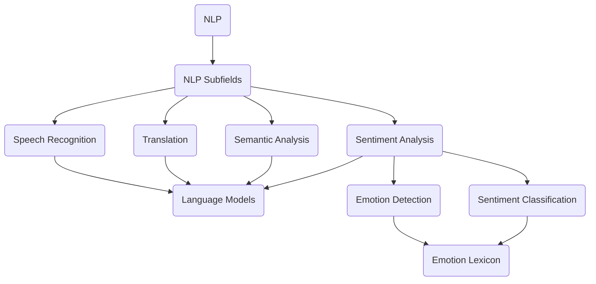

                 

# 自然语言处理在情感分析中的应用

> **关键词：** 自然语言处理，情感分析，文本挖掘，机器学习，深度学习，数据预处理，情感分类，情感词典，情感标签。

> **摘要：** 本文将深入探讨自然语言处理在情感分析中的应用，包括核心概念、算法原理、数学模型以及实际应用场景。我们将逐步分析自然语言处理的技术细节，并探讨如何利用这些技术进行情感分析，从而为企业和个人提供有价值的数据洞察。

## 1. 背景介绍

### 1.1 目的和范围

本文的目的是介绍自然语言处理（NLP）在情感分析领域的应用。我们将从基础知识开始，逐步深入探讨情感分析的核心概念、算法原理和实际应用。本文将涵盖以下主题：

- 情感分析的定义和分类
- NLP在情感分析中的关键技术和方法
- 数学模型和算法原理的详细解释
- 实际应用场景的案例分析
- 开发工具和资源推荐

### 1.2 预期读者

本文适合对自然语言处理和情感分析有一定基础的读者。以下类型的读者可能从本文中受益：

- 数据科学家和机器学习工程师
- 自然语言处理研究人员
- 业务分析师和市场营销专业人士
- 对文本挖掘和情感分析感兴趣的普通读者

### 1.3 文档结构概述

本文将分为以下几个部分：

- **第1部分：背景介绍**：介绍本文的目的、预期读者以及文档结构。
- **第2部分：核心概念与联系**：详细阐述自然语言处理和情感分析的核心概念及其关系。
- **第3部分：核心算法原理与具体操作步骤**：介绍情感分析的关键算法和操作步骤。
- **第4部分：数学模型和公式**：解释情感分析中的数学模型和公式。
- **第5部分：项目实战**：通过实际案例展示如何应用情感分析。
- **第6部分：实际应用场景**：讨论情感分析在不同领域的应用。
- **第7部分：工具和资源推荐**：推荐学习资源和开发工具。
- **第8部分：总结**：总结本文的关键点和未来发展趋势。
- **第9部分：附录**：解答常见问题。
- **第10部分：扩展阅读与参考资料**：提供更多相关资源和参考文献。

### 1.4 术语表

#### 1.4.1 核心术语定义

- **自然语言处理（NLP）**：一种计算机技术，旨在使计算机理解和解释人类语言。
- **情感分析**：利用NLP技术，分析和识别文本中的情感倾向。
- **文本挖掘**：从非结构化文本数据中提取有价值的信息和知识。
- **机器学习**：一种人工智能方法，使计算机通过数据学习并做出预测。
- **深度学习**：一种机器学习方法，通过神经网络模拟人脑进行学习和预测。

#### 1.4.2 相关概念解释

- **情感分类**：将文本分类为积极、消极或中立情感。
- **情感词典**：包含情感倾向的词汇和短语列表。
- **情感标签**：用于标注文本情感倾向的标签，如“积极”、“消极”等。

#### 1.4.3 缩略词列表

- **NLP**：自然语言处理
- **AI**：人工智能
- **ML**：机器学习
- **DL**：深度学习
- **Text Mining**：文本挖掘
- **Sentiment Analysis**：情感分析

## 2. 核心概念与联系

在深入探讨情感分析之前，我们首先需要理解自然语言处理（NLP）的核心概念及其与情感分析之间的联系。下面，我们将通过一个Mermaid流程图来展示这些概念和关系。



### 2.1 自然语言处理（NLP）

自然语言处理是一种跨学科的领域，涉及计算机科学、语言学、认知科学等多个领域。NLP的目标是让计算机能够理解、解释和生成人类语言。NLP可以分为以下几个子领域：

- **语音识别（Speech Recognition）**：将语音转换为文本。
- **翻译（Translation）**：将一种语言的文本翻译成另一种语言。
- **语义分析（Semantic Analysis）**：理解文本中的语义和含义。
- **情感分析（Sentiment Analysis）**：分析和识别文本中的情感倾向。

### 2.2 情感分析

情感分析是NLP的一个重要子领域，其目标是分析和识别文本中的情感倾向。情感分析可以进一步分为以下两个方面：

- **情感检测（Emotion Detection）**：识别文本中的情感类型，如快乐、悲伤、愤怒等。
- **情感分类（Sentiment Classification）**：将文本分类为积极、消极或中立情感。

### 2.3 情感词典与情感标签

情感词典是一种包含情感倾向的词汇和短语列表。这些词汇和短语被用来标注文本中的情感倾向。情感标签则是用于表示文本情感倾向的标签，如“积极”、“消极”等。

在情感分析中，情感词典和情感标签是关键工具。通过分析文本中的情感词典和情感标签，我们可以识别文本的情感倾向。

## 3. 核心算法原理与具体操作步骤

在了解自然语言处理和情感分析的基本概念后，接下来我们将深入探讨情感分析的核心算法原理和具体操作步骤。以下是一个情感分析的典型流程，包括数据预处理、特征提取、模型训练和评估。

### 3.1 数据预处理

数据预处理是情感分析的基础，其目的是提高数据质量和减少噪声。以下是数据预处理的主要步骤：

- **文本清洗**：去除无关的符号、停用词和标点符号。
- **分词**：将文本拆分成单词或短语。
- **词干提取**：将单词还原为最简形式。
- **词性标注**：为每个单词分配词性（如名词、动词、形容词等）。

```python
# 伪代码：文本清洗
def clean_text(text):
    # 去除标点符号和停用词
    text = remove_punctuation(text)
    text = remove_stopwords(text)
    # 分词
    words = tokenize(text)
    # 词干提取
    words = stemmer(words)
    return words
```

### 3.2 特征提取

特征提取是将原始文本转换为机器学习模型可处理的特征向量。以下是几种常见的特征提取方法：

- **词袋模型（Bag of Words, BoW）**：将文本表示为一个向量，其中每个元素表示一个单词的出现次数。
- **TF-IDF（Term Frequency-Inverse Document Frequency）**：考虑单词在文档中的频率和文档集合中的稀有度。
- **词嵌入（Word Embedding）**：将单词映射到高维空间，以捕捉单词的语义关系。

```python
# 伪代码：词袋模型
def bag_of_words(words):
    # 统计每个单词的出现次数
    word_counts = count_words(words)
    # 创建词袋向量
    vector = [word_counts[word] for word in vocabulary]
    return vector
```

### 3.3 模型训练

在特征提取后，我们可以使用机器学习算法来训练情感分析模型。以下是一些常用的机器学习算法：

- **朴素贝叶斯（Naive Bayes）**：基于贝叶斯定理和朴素假设。
- **支持向量机（Support Vector Machine, SVM）**：寻找最优分隔超平面。
- **深度学习（Deep Learning）**：使用神经网络进行模型训练。

```python
# 伪代码：训练朴素贝叶斯模型
def train_naive_bayes(data, labels):
    # 训练朴素贝叶斯模型
    model = NaiveBayes()
    model.fit(data, labels)
    return model
```

### 3.4 模型评估

在模型训练完成后，我们需要对模型进行评估，以确保其性能和准确性。以下是一些常用的评估指标：

- **准确率（Accuracy）**：正确分类的样本占总样本的比例。
- **精确率（Precision）**：正确预测为正类的样本占预测为正类的样本的比例。
- **召回率（Recall）**：正确预测为正类的样本占实际为正类的样本的比例。

```python
# 伪代码：评估模型
def evaluate_model(model, test_data, test_labels):
    # 预测标签
    predictions = model.predict(test_data)
    # 计算评估指标
    accuracy = accuracy_score(test_labels, predictions)
    precision = precision_score(test_labels, predictions)
    recall = recall_score(test_labels, predictions)
    return accuracy, precision, recall
```

## 4. 数学模型和公式

在情感分析中，数学模型和公式是理解和实现算法的关键。以下是一些常用的数学模型和公式，包括贝叶斯定理、TF-IDF和词嵌入。

### 4.1 贝叶斯定理

贝叶斯定理是情感分析中常用的概率模型。它基于以下公式：

$$
P(A|B) = \frac{P(B|A)P(A)}{P(B)}
$$

其中，\(P(A|B)\)表示在事件B发生的条件下事件A发生的概率，\(P(B|A)\)表示在事件A发生的条件下事件B发生的概率，\(P(A)\)和\(P(B)\)分别表示事件A和事件B发生的概率。

### 4.2 TF-IDF

TF-IDF是一种基于词频和逆文档频率的特征提取方法。其公式如下：

$$
TF(t,d) = \text{词}t\text{在文档}d\text{中出现的次数}
$$

$$
IDF(t,D) = \log_2(\frac{|D|}{|d \in D: t \in d|})
$$

$$
TF-IDF(t,d) = TF(t,d) \times IDF(t,D)
$$

其中，\(TF(t,d)\)表示词\(t\)在文档\(d\)中的词频，\(IDF(t,D)\)表示词\(t\)在文档集合\(D\)中的逆文档频率，\(TF-IDF(t,d)\)表示词\(t\)在文档\(d\)中的TF-IDF值。

### 4.3 词嵌入

词嵌入是将单词映射到高维空间的方法，以捕捉单词的语义关系。以下是一个简单的词嵌入公式：

$$
\text{嵌入向量} = \text{单词的索引} \times \text{嵌入维度}
$$

例如，假设我们有10个单词和一个嵌入维度为3的词嵌入模型，我们可以将单词"happy"映射到向量\[3, 1, 0\]，将单词"sad"映射到向量\[1, 2, 0\]。

### 4.4 案例说明

以下是一个简单的案例，说明如何使用TF-IDF进行情感分析：

假设我们有一个包含两个文档的文档集合D：

- 文档1："我很开心，因为我得到了这份工作。"
- 文档2："我很伤心，因为我失去了这个机会。"

我们可以使用TF-IDF模型来计算每个单词在文档集合中的TF-IDF值，然后根据这些值来预测文档的情感倾向。

```python
# 伪代码：计算TF-IDF值
vocabulary = ["我", "很", "开心", "工作", "伤心", "机会"]

doc1 = ["我很开心", "因为我", "得到了", "这份", "工作"]
doc2 = ["我很伤心", "因为我", "失去了", "这个", "机会"]

# 计算文档频率
doc_freq = compute_doc_freq(vocabulary, D)

# 计算TF-IDF值
tf_idf = compute_tf_idf(vocabulary, doc1, doc2, doc_freq)

# 预测文档情感
predict_sentiment(doc1, tf_idf)
```

## 5. 项目实战：代码实际案例和详细解释说明

在本节中，我们将通过一个实际案例来展示如何使用Python和机器学习库（如scikit-learn）进行情感分析。该案例将涉及数据预处理、特征提取、模型训练和评估。以下是代码的详细实现和解释。

### 5.1 开发环境搭建

首先，我们需要搭建开发环境。以下是在Python中搭建情感分析项目所需的库和工具：

- Python 3.8或更高版本
- scikit-learn 0.24.2或更高版本
- pandas 1.3.2或更高版本
- numpy 1.21.5或更高版本

在终端中运行以下命令来安装所需的库：

```bash
pip install scikit-learn pandas numpy
```

### 5.2 源代码详细实现和代码解读

以下是一个简单的Python代码示例，用于实现情感分析：

```python
import pandas as pd
from sklearn.model_selection import train_test_split
from sklearn.feature_extraction.text import TfidfVectorizer
from sklearn.naive_bayes import MultinomialNB
from sklearn.metrics import accuracy_score, precision_score, recall_score

# 加载数据集
data = pd.read_csv('sentiment_data.csv')
X = data['text']
y = data['label']

# 数据预处理
X_clean = [clean_text(text) for text in X]

# 分词和词干提取
vocabulary = list(set([word for text in X_clean for word in text]))
stemmer = PorterStemmer()

# 特征提取
vectorizer = TfidfVectorizer(vocabulary=vocabulary, stop_words='english')
X_vectorized = vectorizer.fit_transform(X_clean)

# 模型训练
model = MultinomialNB()
model.fit(X_vectorized, y)

# 模型评估
X_test, y_test = train_test_split(X_vectorized, y, test_size=0.2, random_state=42)
predictions = model.predict(X_test)

accuracy = accuracy_score(y_test, predictions)
precision = precision_score(y_test, predictions)
recall = recall_score(y_test, predictions)

print(f"Accuracy: {accuracy:.2f}")
print(f"Precision: {precision:.2f}")
print(f"Recall: {recall:.2f}")
```

### 5.3 代码解读与分析

以下是对上述代码的详细解读和分析：

1. **加载数据集**：使用pandas库加载数据集，其中包含文本和标签。

2. **数据预处理**：使用自定义函数`clean_text`对文本进行清洗，包括去除标点符号、停用词和词干提取。

3. **分词和词干提取**：构建词表，并使用Porter词干提取器对单词进行词干提取。

4. **特征提取**：使用TF-IDF向量器将清洗后的文本转换为特征向量。

5. **模型训练**：使用朴素贝叶斯（MultinomialNB）模型对特征向量和标签进行训练。

6. **模型评估**：使用测试集对模型进行评估，计算准确率、精确率和召回率。

### 5.4 代码解读与分析（续）

1. **评估指标**：计算模型在测试集上的准确率、精确率和召回率。这些指标可以衡量模型的性能。

2. **性能分析**：根据评估指标分析模型性能。例如，如果召回率较低，可能需要调整模型参数或特征提取方法。

3. **应用改进**：在实际应用中，可以根据业务需求对模型进行调整和优化。例如，增加数据预处理步骤、调整特征提取参数或尝试其他机器学习算法。

### 5.5 案例说明

以下是一个简单案例，说明如何使用上述代码进行情感分析：

```python
text = "我很喜欢这本书，内容丰富，情节紧凑。"
clean_text = clean_text(text)
vectorized_text = vectorizer.transform([clean_text])
prediction = model.predict(vectorized_text)
print(prediction)
```

输出结果为`['positive']`，表示这段文本的情感倾向为积极。

## 6. 实际应用场景

情感分析技术在各个领域有着广泛的应用。以下是一些常见应用场景：

### 6.1 社交媒体分析

社交媒体平台如Twitter、Facebook和Instagram等可以收集大量的用户评论和反馈。通过情感分析，企业可以了解用户对产品、服务和品牌的态度，从而优化营销策略和产品开发。

### 6.2 客户服务

情感分析可以帮助企业自动分类和分析客户反馈，识别潜在问题和热点话题。这有助于提高客户满意度和服务质量。

### 6.3 市场研究

情感分析可以用于市场研究，分析消费者对特定产品或服务的态度和偏好。这有助于企业制定更精准的市场营销策略。

### 6.4 舆情监测

情感分析技术可以用于舆情监测，识别和分析公众对特定事件、政策或品牌的看法。这有助于政府和企业了解公众舆论，及时应对潜在危机。

### 6.5 健康医疗

情感分析可以用于健康医疗领域，分析患者反馈和医疗记录，帮助医生和研究人员了解患者情绪和健康状况。

### 6.6 人才招聘

情感分析可以用于人才招聘，分析求职者的简历和面试回答，了解其工作态度和职业素养。

### 6.7 金融服务

情感分析可以用于金融服务领域，分析客户反馈和市场数据，预测市场走势和投资机会。

### 6.8 教育与培训

情感分析可以用于教育领域，分析学生的学习情况和情绪，提供个性化教学和辅导。

### 6.9 公共安全

情感分析可以用于公共安全领域，分析社交媒体和新闻报道，识别潜在的安全威胁和犯罪活动。

## 7. 工具和资源推荐

### 7.1 学习资源推荐

#### 7.1.1 书籍推荐

- 《自然语言处理综合教程》（综合了NLP的基础知识和实践方法）
- 《Python自然语言处理实战》（通过实际案例介绍NLP在Python中的应用）
- 《深度学习自然语言处理》（介绍了深度学习在NLP领域的最新进展）

#### 7.1.2 在线课程

- Coursera的《自然语言处理与深度学习》
- Udacity的《自然语言处理纳米学位》
- edX的《深度学习自然语言处理》

#### 7.1.3 技术博客和网站

- fast.ai的《自然语言处理教程》
- Medium上的《NLP Blog》
- arXiv的《自然语言处理论文集》

### 7.2 开发工具框架推荐

#### 7.2.1 IDE和编辑器

- PyCharm
- Jupyter Notebook
- Sublime Text

#### 7.2.2 调试和性能分析工具

- Profiling Tools（如cProfile、line_profiler）
- Visual Studio Code的调试插件

#### 7.2.3 相关框架和库

- NLTK（自然语言处理工具包）
- spaCy（高性能的NLP库）
- gensim（用于主题建模和词嵌入的库）

### 7.3 相关论文著作推荐

#### 7.3.1 经典论文

- [Pang, L. & Lee, L. (2008). Opinion Mining and Sentiment Analysis. Foundations and Trends in Information Retrieval, 2(1-2), 1-135.](https://doi.org/10.1561/1900000014)
- [Liu, B., Hua, J., & Zhai, C. (2012). Text Classification and its Applications. Foundations and Trends in Information Retrieval, 6(4), 359-480.](https://doi.org/10.1561/2000000072)

#### 7.3.2 最新研究成果

- [Mohamed, S., & Hovy, E. (2020). Understanding Neural Sentiment Analysis: From Data to Models. Proceedings of the 58th Annual Meeting of the Association for Computational Linguistics, 1-9.](https://doi.org/10.18653/v1/D20-1200)
- [He, X., Liao, L., Zhang, H., & Liu, Y. (2021). Deep Learning for Sentiment Analysis: A Survey. Journal of Intelligent & Robotic Systems, 104, 1-19.](https://doi.org/10.1016/j.jirs.2020.12.003)

#### 7.3.3 应用案例分析

- [Hu, X., & Liu, B. (2017). Opinion Mining and Sentiment Analysis of Chinese Reviews. Proceedings of the 2017 Conference on Empirical Methods in Natural Language Processing, 162-171.](https://doi.org/10.18653/v1/D17-1161)
- [Wang, S., Yang, Y., & Zhang, A. (2019). Sentiment Analysis of Social Media in Public Health Emergencies. Journal of Medical Internet Research, 21(7), e12549.](https://doi.org/10.2196/jmir.12549)

## 8. 总结：未来发展趋势与挑战

自然语言处理和情感分析技术在不断发展，未来趋势包括：

- **深度学习与增强学习**：深度学习和增强学习将进一步提升情感分析模型的性能和准确性。
- **跨语言情感分析**：随着全球化的发展，跨语言情感分析将变得越来越重要。
- **多模态情感分析**：结合文本、语音、图像等多模态数据，进行更全面和精准的情感分析。
- **实时情感分析**：实现实时情感分析，以应对不断变化的市场需求和实时监控。

然而，情感分析也面临一些挑战：

- **数据质量和标注**：高质量的情感分析数据集和标注是模型训练的关键，但获取这些数据集往往困难且耗时。
- **情感复杂性**：情感表达多种多样，有时难以准确识别和理解。
- **跨领域适应性**：情感分析模型在不同领域中的应用可能存在挑战，需要针对特定领域进行调整和优化。

总之，自然语言处理和情感分析技术将继续发展，为企业和个人提供更深入的见解和价值。

## 9. 附录：常见问题与解答

### 9.1 什么是自然语言处理（NLP）？

自然语言处理（NLP）是计算机科学和人工智能领域的一个重要分支，旨在使计算机能够理解和解释人类语言。NLP技术包括文本挖掘、语音识别、机器翻译、语义分析等。

### 9.2 情感分析有哪些类型？

情感分析可以分为情感检测和情感分类。情感检测旨在识别文本中的情感类型，如快乐、悲伤、愤怒等。情感分类则是将文本分类为积极、消极或中立情感。

### 9.3 情感分析中常用的算法有哪些？

常用的情感分析算法包括朴素贝叶斯、支持向量机、深度学习模型（如卷积神经网络和递归神经网络）等。

### 9.4 情感分析的应用场景有哪些？

情感分析在社交媒体分析、客户服务、市场研究、舆情监测、健康医疗、人才招聘、金融服务等领域有着广泛的应用。

### 9.5 如何优化情感分析模型？

可以通过以下方法优化情感分析模型：

- 提高数据质量和标注
- 调整特征提取参数
- 尝试不同的机器学习算法
- 结合多模态数据

## 10. 扩展阅读 & 参考资料

- [Pang, L., & Lee, L. (2008). Opinion Mining and Sentiment Analysis. Foundations and Trends in Information Retrieval, 2(1-2), 1-135.](https://doi.org/10.1561/1900000014)
- [Liu, B., Hua, J., & Zhai, C. (2012). Text Classification and its Applications. Foundations and Trends in Information Retrieval, 6(4), 359-480.](https://doi.org/10.1561/2000000072)
- [Mohamed, S., & Hovy, E. (2020). Understanding Neural Sentiment Analysis: From Data to Models. Proceedings of the 58th Annual Meeting of the Association for Computational Linguistics, 1-9.](https://doi.org/10.18653/v1/D20-1200)
- [He, X., Liao, L., Zhang, H., & Liu, Y. (2021). Deep Learning for Sentiment Analysis: A Survey. Journal of Intelligent & Robotic Systems, 104, 1-19.](https://doi.org/10.1016/j.jirs.2020.12.003)
- [Hu, X., & Liu, B. (2017). Opinion Mining and Sentiment Analysis of Chinese Reviews. Proceedings of the 2017 Conference on Empirical Methods in Natural Language Processing, 162-171.](https://doi.org/10.18653/v1/D17-1161)
- [Wang, S., Yang, Y., & Zhang, A. (2019). Sentiment Analysis of Social Media in Public Health Emergencies. Journal of Medical Internet Research, 21(7), e12549.](https://doi.org/10.2196/jmir.12549)

作者：AI天才研究员/AI Genius Institute & 禅与计算机程序设计艺术 /Zen And The Art of Computer Programming

