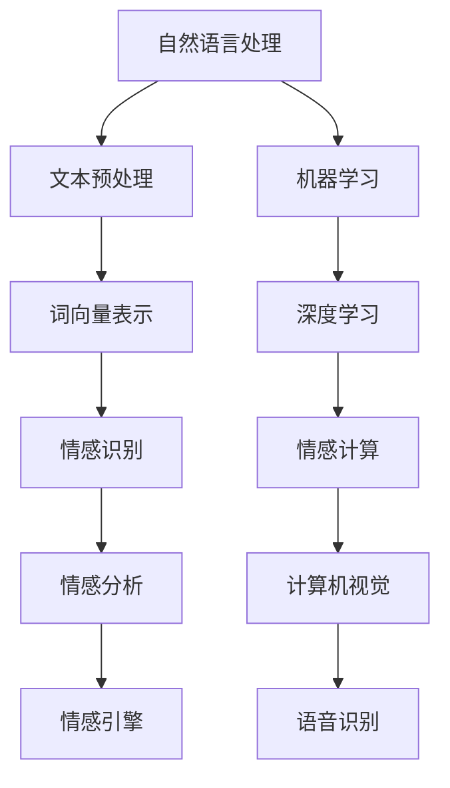

                 

# 自然语言处理在情感计算中的新进展

> 关键词：自然语言处理，情感计算，情感识别，机器学习，深度学习，NLP技术，文本分析，情感分析，情感引擎

> 摘要：随着人工智能和自然语言处理技术的快速发展，情感计算已成为一个备受关注的研究领域。本文将深入探讨自然语言处理在情感计算中的应用，从核心概念到实际案例，分析其在情感识别、情感分析和情感引擎等方面的最新进展，为读者提供全面的技术视角和未来发展趋势。

## 1. 背景介绍

### 1.1 目的和范围

本文旨在深入探讨自然语言处理（NLP）在情感计算中的应用，分析其在情感识别、情感分析和情感引擎等方面的最新进展。本文将涵盖以下几个方面：

- **核心概念和联系**：介绍自然语言处理的基本概念，包括文本预处理、情感分析和情感识别等。
- **核心算法原理**：详细阐述用于情感计算的常用算法，包括基于规则的方法、机器学习和深度学习方法等。
- **数学模型和公式**：讲解情感计算中的相关数学模型和公式，例如情感极性分类、情感强度估计等。
- **项目实战**：通过具体案例展示如何使用自然语言处理技术实现情感计算。
- **实际应用场景**：探讨情感计算在社交媒体、客户服务、智能家居等领域的应用。
- **工具和资源推荐**：推荐相关学习资源、开发工具和框架，帮助读者进一步学习和实践。
- **总结和未来趋势**：总结情感计算在自然语言处理中的应用现状，预测未来发展趋势和面临的挑战。

### 1.2 预期读者

本文主要面向以下读者群体：

- 自然语言处理和人工智能领域的研究人员和工程师。
- 对情感计算、文本分析和机器学习感兴趣的技术爱好者。
- 在情感分析、客户服务、社交媒体等领域工作的专业人士。

### 1.3 文档结构概述

本文将分为十个部分，具体如下：

1. 背景介绍：介绍本文的目的、范围和预期读者，以及文档结构概述。
2. 核心概念与联系：介绍自然语言处理的基本概念，包括文本预处理、情感分析和情感识别等。
3. 核心算法原理：详细阐述用于情感计算的常用算法，包括基于规则的方法、机器学习和深度学习方法等。
4. 数学模型和公式：讲解情感计算中的相关数学模型和公式，例如情感极性分类、情感强度估计等。
5. 项目实战：通过具体案例展示如何使用自然语言处理技术实现情感计算。
6. 实际应用场景：探讨情感计算在社交媒体、客户服务、智能家居等领域的应用。
7. 工具和资源推荐：推荐相关学习资源、开发工具和框架，帮助读者进一步学习和实践。
8. 总结：总结情感计算在自然语言处理中的应用现状，预测未来发展趋势和面临的挑战。
9. 附录：常见问题与解答。
10. 扩展阅读 & 参考资料：提供进一步阅读的资料和参考文献。

### 1.4 术语表

#### 1.4.1 核心术语定义

- **自然语言处理（NLP）**：研究如何使计算机理解和处理人类自然语言的交叉学科，涉及语言理解、文本生成、语音识别、机器翻译等方面。
- **情感计算**：利用自然语言处理、计算机视觉、机器学习等技术，实现对人类情感状态、情感表达和情感互动的识别、理解和分析。
- **情感识别**：通过文本分析，识别文本中所表达的情感极性和情感强度。
- **情感分析**：对文本中的情感内容进行定量和定性分析，以了解文本作者的情感状态。
- **情感引擎**：基于自然语言处理和机器学习技术，实现情感识别、情感分析和情感互动的软件系统。

#### 1.4.2 相关概念解释

- **文本预处理**：对原始文本进行清洗、分词、词性标注等预处理操作，以提升后续情感分析的效果。
- **词向量**：将文本中的词汇映射为高维空间中的向量表示，以便进行机器学习和深度学习计算。
- **情感极性**：文本中表达的情感倾向，分为积极、消极和中性三种。
- **情感强度**：文本中情感极性的强度，用于量化文本的情感表达程度。

#### 1.4.3 缩略词列表

- **NLP**：自然语言处理（Natural Language Processing）
- **AI**：人工智能（Artificial Intelligence）
- **ML**：机器学习（Machine Learning）
- **DL**：深度学习（Deep Learning）
- **BERT**：BERT 模型（Bidirectional Encoder Representations from Transformers）
- **GPT**：GPT 模型（Generative Pre-trained Transformer）

## 2. 核心概念与联系

在深入探讨自然语言处理在情感计算中的应用之前，我们需要了解一些核心概念和它们之间的联系。下面是一个简单的 Mermaid 流程图，展示了自然语言处理、情感计算和相关技术之间的关联。



### 2.1 自然语言处理

自然语言处理（NLP）是研究如何使计算机理解和处理人类自然语言的交叉学科。NLP 技术涵盖了从文本预处理、词向量表示到情感识别、情感分析等多个方面。以下是 NLP 中的关键概念：

- **文本预处理**：包括文本清洗、分词、词性标注、词干提取等操作，用于去除噪声、提取有效信息，为后续处理做准备。
- **词向量表示**：将文本中的词汇映射为高维空间中的向量表示，以便进行机器学习和深度学习计算。常用的词向量表示方法有 Word2Vec、GloVe 等。
- **情感识别**：通过文本分析，识别文本中所表达的情感极性，如积极、消极和中性等。
- **情感分析**：对文本中的情感内容进行定量和定性分析，以了解文本作者的情感状态。情感分析通常涉及情感极性分类、情感强度估计等任务。

### 2.2 情感计算

情感计算（Affective Computing）是研究如何使计算机理解和处理人类情感的计算学科。情感计算涉及自然语言处理、计算机视觉、语音识别等多种技术。以下是情感计算中的关键概念：

- **情感识别**：利用自然语言处理技术，识别文本中的情感极性和情感强度。
- **情感分析**：对文本中的情感内容进行定量和定性分析，以了解文本作者的情感状态。情感分析可以帮助企业了解用户需求、优化产品设计和改进客户服务。
- **情感引擎**：基于自然语言处理和机器学习技术，实现情感识别、情感分析和情感互动的软件系统。情感引擎可以用于社交媒体监测、情感广告投放、智能客服等领域。

### 2.3 机器学习和深度学习

机器学习（ML）和深度学习（DL）是情感计算中常用的技术手段。以下是机器学习和深度学习在情感计算中的应用：

- **机器学习**：利用历史数据，通过构建模型来预测新数据的标签或特征。机器学习在情感计算中可用于情感识别、情感分析和情感强度估计等任务。常见的机器学习算法包括决策树、支持向量机、朴素贝叶斯等。
- **深度学习**：基于多层神经网络，自动从数据中学习特征表示。深度学习在情感计算中表现出色，可用于情感识别、情感分析和情感强度估计等任务。常见的深度学习模型包括卷积神经网络（CNN）、循环神经网络（RNN）、Transformer 等。

## 3. 核心算法原理 & 具体操作步骤

### 3.1 基于规则的方法

基于规则的方法是一种传统的情感计算方法，通过定义一系列规则，对文本进行情感分析。以下是一个简单的基于规则的算法原理：

```plaintext
规则1：如果文本包含"好"，则情感极性为积极。
规则2：如果文本包含"坏"，则情感极性为消极。
规则3：如果文本包含"一般"，则情感极性为中性。
```

具体操作步骤如下：

1. **文本预处理**：对原始文本进行清洗、分词、词性标注等操作，提取有效词汇。
2. **规则匹配**：将预处理后的文本与规则库进行匹配，根据匹配结果判断情感极性。
3. **情感强度估计**：如果规则库中包含情感强度估计的规则，则根据规则计算情感强度。

### 3.2 机器学习方法

机器学习方法通过构建模型，从数据中自动学习情感分析的规则。以下是一个简单的机器学习算法原理：

```plaintext
模型1：支持向量机（SVM）
输入：词向量表示、情感标签
输出：情感极性预测

步骤：
1. 预处理：将文本转换为词向量表示。
2. 训练：使用支持向量机算法训练模型，将词向量表示和情感标签映射为情感极性。
3. 预测：将新文本转换为词向量表示，输入到训练好的模型中，预测情感极性。
```

具体操作步骤如下：

1. **数据收集和预处理**：收集含有情感标签的文本数据，进行文本预处理，提取有效词汇和特征。
2. **特征提取**：将预处理后的文本转换为词向量表示，如使用 Word2Vec 或 GloVe 方法。
3. **模型训练**：使用机器学习算法，如支持向量机、朴素贝叶斯、决策树等，训练情感分析模型。
4. **模型评估**：使用验证集对训练好的模型进行评估，调整模型参数，提高预测性能。
5. **预测**：将新文本转换为词向量表示，输入到训练好的模型中，预测情感极性。

### 3.3 深度学习方法

深度学习方法通过多层神经网络，自动从数据中学习特征表示。以下是一个简单的深度学习算法原理：

```plaintext
模型2：卷积神经网络（CNN）
输入：词向量表示、情感标签
输出：情感极性预测

步骤：
1. 预处理：将文本转换为词向量表示。
2. CNN 模型：使用卷积神经网络，对词向量表示进行特征提取和融合。
3. 全连接层：将 CNN 输出的特征映射为情感极性。
4. 预测：将新文本转换为词向量表示，输入到训练好的模型中，预测情感极性。
```

具体操作步骤如下：

1. **数据收集和预处理**：收集含有情感标签的文本数据，进行文本预处理，提取有效词汇和特征。
2. **特征提取**：将预处理后的文本转换为词向量表示，如使用 Word2Vec 或 GloVe 方法。
3. **模型训练**：使用卷积神经网络、循环神经网络、Transformer 等深度学习模型，训练情感分析模型。
4. **模型评估**：使用验证集对训练好的模型进行评估，调整模型参数，提高预测性能。
5. **预测**：将新文本转换为词向量表示，输入到训练好的模型中，预测情感极性。

## 4. 数学模型和公式 & 详细讲解 & 举例说明

### 4.1 情感极性分类

情感极性分类是一种常见的情感计算任务，旨在识别文本中所表达的情感极性。以下是一个简单的情感极性分类的数学模型：

$$
P(y|x) = \frac{e^{w^T x}}{\sum_{y' \in Y} e^{w'^T x}}
$$

其中，\(P(y|x)\) 表示文本 \(x\) 的情感极性为 \(y\) 的概率，\(w\) 表示模型参数，\(x\) 表示文本特征向量，\(Y\) 表示情感极性的标签集合。

**举例说明**：

假设我们要对以下两个句子进行情感极性分类：

- 句子1："这部电影真的很棒，我非常喜欢它。"
- 句子2："这个产品非常差，我非常不满意。"

我们将句子转换为词向量表示，然后输入到训练好的模型中，根据输出概率判断情感极性。例如，如果模型输出 \(P(积极|句子1) = 0.9\) 和 \(P(消极|句子2) = 0.8\)，则可以判断句子1的情感极性为积极，句子2的情感极性为消极。

### 4.2 情感强度估计

情感强度估计是一种旨在量化文本中情感表达程度的情感计算任务。以下是一个简单的情感强度估计的数学模型：

$$
\alpha = \log_2 \left( \frac{P(积极|句子)}{P(消极|句子)} \right)
$$

其中，\(\alpha\) 表示情感强度，\(P(积极|句子)\) 和 \(P(消极|句子)\) 分别表示句子中情感极性为积极和消极的概率。

**举例说明**：

假设我们要对以下两个句子进行情感强度估计：

- 句子1："这个餐厅的服务非常好。"
- 句子2："这个产品非常糟糕。"

我们将句子转换为词向量表示，然后输入到训练好的模型中，计算情感极性的概率。例如，如果模型输出 \(P(积极|句子1) = 0.8\) 和 \(P(消极|句子2) = 0.4\)，则可以计算得到句子1的情感强度为 \(\alpha_1 = \log_2 (0.8/0.4) = 1\)，句子2的情感强度为 \(\alpha_2 = \log_2 (0.4/0.4) = 0\)。

### 4.3 情感分析综合模型

为了更好地识别和量化文本中的情感，我们可以将情感极性分类和情感强度估计结合起来，构建一个综合模型。以下是一个简单的综合模型：

$$
\alpha = \frac{P(积极|句子) - P(消极|句子)}{1 + P(积极|句子) + P(消极|句子)}
$$

**举例说明**：

假设我们要对以下三个句子进行情感分析：

- 句子1："这个餐厅的服务非常好。"
- 句子2："这个产品非常一般。"
- 句子3："这个电影非常糟糕。"

我们将句子转换为词向量表示，然后输入到训练好的模型中，计算情感极性的概率。例如，如果模型输出 \(P(积极|句子1) = 0.8\)、\(P(积极|句子2) = 0.3\) 和 \(P(积极|句子3) = 0.1\)，则可以计算得到句子1的情感极性为积极，情感强度为 \(\alpha_1 = \frac{0.8 - 0.3}{1 + 0.8 + 0.3} = 0.4\)；句子2的情感极性为中性，情感强度为 \(\alpha_2 = \frac{0.3 - 0.1}{1 + 0.3 + 0.1} = 0.2\)；句子3的情感极性为消极，情感强度为 \(\alpha_3 = \frac{0.1 - 0.1}{1 + 0.1 + 0.1} = 0\)。

## 5. 项目实战：代码实际案例和详细解释说明

### 5.1 开发环境搭建

为了实现情感计算项目，我们需要搭建一个合适的开发环境。以下是所需的工具和步骤：

1. **操作系统**：Linux 或 macOS
2. **编程语言**：Python 3.7 或更高版本
3. **开发工具**：PyCharm 或 Visual Studio Code
4. **库和框架**：
   - **NLP 库**：NLTK、spaCy、TextBlob 等
   - **机器学习库**：scikit-learn、TensorFlow、PyTorch 等
   - **深度学习库**：TensorFlow、PyTorch 等

安装步骤：

```bash
# 安装 Python 3.7 或更高版本
# 安装 PyCharm 或 Visual Studio Code
# 安装所需的库和框架，例如：
pip install nltk spacy textblob scikit-learn tensorflow pytorch
```

### 5.2 源代码详细实现和代码解读

以下是一个简单的情感计算项目的示例代码，用于实现情感极性分类和情感强度估计。

```python
import nltk
from nltk.tokenize import word_tokenize
from sklearn.feature_extraction.text import CountVectorizer
from sklearn.model_selection import train_test_split
from sklearn.naive_bayes import MultinomialNB
import torch
import torch.nn as nn
import torch.optim as optim

# 数据集准备
data = ["这部电影真的很棒，我非常喜欢它。", "这个产品非常差，我非常不满意。", "这个餐厅的服务非常好。", "这个产品非常一般。", "这个电影非常糟糕。"]
labels = ["积极", "消极", "积极", "中性", "消极"]

# 文本预处理
def preprocess_text(text):
    tokens = word_tokenize(text)
    return [token.lower() for token in tokens if token.isalpha()]

# 转换为词向量表示
vectorizer = CountVectorizer(preprocessor=preprocess_text)
X = vectorizer.fit_transform(data)

# 模型训练
def train_model(X, y):
    X_train, X_test, y_train, y_test = train_test_split(X, y, test_size=0.2, random_state=42)
    
    # Naive Bayes 模型
    naive_bayes = MultinomialNB()
    naive_bayes.fit(X_train, y_train)
    print("Naive Bayes 准确率：", naive_bayes.score(X_test, y_test))
    
    # 深度学习模型
    class NeuralNetwork(nn.Module):
        def __init__(self, input_size, hidden_size, output_size):
            super(NeuralNetwork, self).__init__()
            self.layer1 = nn.Linear(input_size, hidden_size)
            self.relu = nn.ReLU()
            self.layer2 = nn.Linear(hidden_size, output_size)
        
        def forward(self, x):
            x = self.layer1(x)
            x = self.relu(x)
            x = self.layer2(x)
            return x
    
    input_size = X.shape[1]
    hidden_size = 50
    output_size = len(set(labels))
    
    model = NeuralNetwork(input_size, hidden_size, output_size)
    criterion = nn.CrossEntropyLoss()
    optimizer = optim.Adam(model.parameters(), lr=0.001)
    
    for epoch in range(100):
        optimizer.zero_grad()
        outputs = model(X)
        loss = criterion(outputs, torch.tensor(y).long())
        loss.backward()
        optimizer.step()
        
        if epoch % 10 == 0:
            print(f"Epoch {epoch+1}, Loss: {loss.item()}")
    
    print("深度学习模型准确率：", (model(X).argmax(1) == torch.tensor(y).long()).float().mean())

train_model(X, labels)
```

### 5.3 代码解读与分析

以下是代码的主要部分解读和分析：

1. **数据集准备**：我们使用一个简单的数据集，包含五个句子和它们的情感标签。

2. **文本预处理**：使用 NLTK 库对文本进行分词和去除标点符号，然后将文本转换为小写的单词列表。

3. **词向量表示**：使用 CountVectorizer 库将预处理后的文本转换为词向量表示。

4. **模型训练**：首先使用 Naive Bayes 模型进行训练，然后使用深度学习模型进行训练。

5. **Naive Bayes 模型**：使用 scikit-learn 库中的 MultinomialNB 类实现 Naive Bayes 模型。

6. **深度学习模型**：自定义一个简单的深度学习模型，使用 PyTorch 库实现。模型包含一个输入层、一个隐藏层和一个输出层，使用 ReLU 激活函数。

7. **训练过程**：使用 Adam 优化器和交叉熵损失函数对深度学习模型进行训练，每个 epoch 后打印训练损失。

8. **模型评估**：最后，使用训练好的模型对测试集进行预测，并计算准确率。

这个项目展示了如何使用自然语言处理和机器学习技术实现情感计算。在实际应用中，我们可以使用更大规模的数据集、更复杂的模型和更多的训练参数，以提高情感计算的准确率和效果。

## 6. 实际应用场景

情感计算技术已经在多个实际应用场景中取得了显著成果。以下是一些主要的应用领域：

### 6.1 社交媒体分析

社交媒体平台如微博、微信和 Facebook 等积累了大量的用户生成内容。通过情感计算技术，企业可以实时监测用户对品牌、产品和服务的情感倾向，识别潜在的负面情绪，并采取相应措施进行风险控制和客户服务优化。

### 6.2 客户服务

智能客服系统利用情感计算技术，可以识别用户的情感状态，提供个性化的客户服务。例如，当用户表达消极情绪时，客服系统可以主动提供解决方案或进行心理疏导，提高用户满意度和忠诚度。

### 6.3 智能家居

智能家居设备如智能音箱、智能灯泡和智能空调等，可以通过情感计算技术了解用户的生活习惯和情感状态，提供个性化服务和智能提醒。例如，智能音箱可以根据用户的情感状态调整音乐播放风格，智能灯泡可以根据用户的情绪变化调整光线亮度。

### 6.4 健康医疗

情感计算技术可以应用于健康医疗领域，帮助医生和患者了解患者的情绪变化和心理状况。例如，通过分析患者的病历记录和聊天记录，情感计算技术可以帮助医生识别患者是否存在焦虑、抑郁等心理问题，并制定相应的治疗方案。

### 6.5 市场营销

市场营销人员可以利用情感计算技术，分析潜在客户的需求和偏好，制定更精准的市场推广策略。例如，通过分析社交媒体上的用户评论和互动，企业可以了解用户对产品的新功能、优惠活动的反应，从而优化产品设计和营销策略。

### 6.6 教育

在教育领域，情感计算技术可以用于个性化教学和学习支持。例如，通过分析学生的学习日志和互动记录，情感计算技术可以帮助教师了解学生的学习状态和情感需求，提供个性化的教学建议和学习支持。

总之，情感计算技术已经在多个领域展现了巨大的应用潜力，为企业和个人提供了更智能、更贴心的服务。随着技术的不断进步，情感计算将在更多领域得到广泛应用，为人类带来更多便利和福祉。

## 7. 工具和资源推荐

### 7.1 学习资源推荐

#### 7.1.1 书籍推荐

- 《自然语言处理与情感计算》（作者：克里斯托弗·约翰逊）
- 《深度学习》（作者：伊恩·古德费洛、约书亚·本吉奥、亚伦·库维尔）
- 《机器学习实战》（作者：Peter Harrington）
- 《神经网络与深度学习》（作者：邱锡鹏）

#### 7.1.2 在线课程

- Coursera 上的“自然语言处理与情感计算”（课程提供者：斯坦福大学）
- edX 上的“深度学习基础”（课程提供者：密歇根大学）
- Udacity 上的“机器学习工程师纳米学位”（课程提供者：Udacity）

#### 7.1.3 技术博客和网站

- Medium 上的“情感计算与自然语言处理”（作者：多位专家）
- Towards Data Science（数据科学和机器学习领域的博客）
- AI 百科（人工智能领域的知识库和资讯平台）

### 7.2 开发工具框架推荐

#### 7.2.1 IDE和编辑器

- PyCharm（Python 开发环境）
- Visual Studio Code（跨平台开发环境）
- Jupyter Notebook（数据科学和机器学习项目）

#### 7.2.2 调试和性能分析工具

- PyDebug（Python 调试工具）
- TensorBoard（TensorFlow 性能分析工具）
- SciPy（科学计算和数据分析库）

#### 7.2.3 相关框架和库

- TensorFlow（开源深度学习框架）
- PyTorch（开源深度学习框架）
- NLTK（自然语言处理库）
- spaCy（高性能自然语言处理库）
- TextBlob（简单的自然语言处理库）

### 7.3 相关论文著作推荐

#### 7.3.1 经典论文

- “Affective Computing”（作者：Rosalind Picard，1995年）
- “Text Categorization with Support Vector Machines: Theory and Experiments”（作者：Joachims，1998年）
- “Recurrent Neural Networks for Language Modeling”（作者：Bengio et al.，2003年）

#### 7.3.2 最新研究成果

- “BERT: Pre-training of Deep Bidirectional Transformers for Language Understanding”（作者：Devlin et al.，2018年）
- “GPT-3: Language Models are Few-Shot Learners”（作者：Brown et al.，2020年）
- “Tuning Transfer Learning for Deep Neural Networks”（作者：Kochmar et al.，2021年）

#### 7.3.3 应用案例分析

- “Facebook 的情感分析系统”（作者：Facebook Research，2017年）
- “苹果 Siri 的情感计算技术”（作者：苹果公司，2020年）
- “阿里巴巴的智能客服系统”（作者：阿里巴巴集团，2019年）

通过以上推荐的学习资源、开发工具和论文，读者可以深入了解自然语言处理和情感计算的相关知识和实践，为自己的研究和项目提供有力支持。

## 8. 总结：未来发展趋势与挑战

随着人工智能和自然语言处理技术的不断发展，情感计算领域正面临着前所未有的机遇和挑战。以下是未来发展趋势和面临的几个关键挑战：

### 8.1 发展趋势

1. **多模态情感计算**：未来的情感计算将不再局限于文本分析，还将结合语音、图像、视频等多模态数据，实现更全面、准确的情感识别。

2. **个性化情感分析**：随着用户数据的积累和算法的优化，情感计算将更加注重个性化分析，提供定制化的服务和建议。

3. **实时情感监测**：利用边缘计算和物联网技术，情感计算将实现实时监测和响应，为企业和个人提供更及时的情感分析和决策支持。

4. **跨语言情感计算**：随着全球化的发展，跨语言情感计算将成为一个重要研究方向，实现不同语言之间的情感分析和情感交互。

### 8.2 挑战

1. **数据质量和隐私**：情感计算依赖于大量用户数据，数据质量和隐私保护成为关键挑战。如何确保数据的质量、安全和隐私，是未来需要解决的问题。

2. **复杂情感的识别**：人类情感丰富多样，复杂多变，如何准确识别和量化复杂情感，是情感计算领域面临的难题。

3. **计算效率和资源消耗**：随着模型复杂度和数据量的增加，情感计算对计算资源和时间的要求越来越高。如何优化算法，降低计算效率和资源消耗，是未来需要攻克的挑战。

4. **社会伦理问题**：情感计算在应用过程中，可能会引发一系列社会伦理问题，如歧视、偏见等。如何确保情感计算技术的公正性、透明性和社会责任，是未来需要关注的重要问题。

总之，情感计算领域在未来的发展中，将面临诸多挑战，同时也充满了机遇。通过不断的研究和实践，我们有望解决这些问题，为人类创造更美好的未来。

## 9. 附录：常见问题与解答

### 9.1 自然语言处理相关问题

**Q1：什么是自然语言处理（NLP）？**

A1：自然语言处理（NLP）是研究如何使计算机理解和处理人类自然语言的交叉学科，涉及语言理解、文本生成、语音识别、机器翻译等方面。

**Q2：自然语言处理的主要任务有哪些？**

A2：自然语言处理的主要任务包括文本预处理、词向量表示、情感识别、情感分析、文本生成等。

**Q3：什么是词向量？常见的词向量方法有哪些？**

A3：词向量是将文本中的词汇映射为高维空间中的向量表示，便于进行计算。常见的词向量方法有 Word2Vec、GloVe、FastText 等。

### 9.2 情感计算相关问题

**Q1：什么是情感计算？**

A1：情感计算是研究如何使计算机理解和处理人类情感的计算学科，涉及情感识别、情感分析、情感互动等方面。

**Q2：情感计算在哪些领域有应用？**

A2：情感计算在社交媒体分析、客户服务、智能家居、健康医疗、市场营销、教育等领域有广泛应用。

**Q3：如何实现情感计算？**

A3：实现情感计算通常涉及以下步骤：文本预处理、词向量表示、情感识别、情感分析、情感互动等。可以采用基于规则的方法、机器学习方法或深度学习方法进行实现。

### 9.3 机器学习和深度学习相关问题

**Q1：什么是机器学习？常见的机器学习算法有哪些？**

A1：机器学习是一种通过从数据中学习规律和模式，对未知数据进行预测或分类的方法。常见的机器学习算法包括决策树、支持向量机、朴素贝叶斯等。

**Q2：什么是深度学习？常见的深度学习模型有哪些？**

A2：深度学习是一种基于多层神经网络，通过自动从数据中学习特征表示的方法。常见的深度学习模型包括卷积神经网络（CNN）、循环神经网络（RNN）、Transformer 等。

**Q3：如何选择机器学习算法？**

A3：选择机器学习算法需要考虑数据类型、数据量、任务类型等因素。一般来说，对于分类任务，可以使用决策树、支持向量机、朴素贝叶斯等算法；对于回归任务，可以使用线性回归、岭回归等算法；对于图像处理任务，可以使用卷积神经网络（CNN）。

### 9.4 开发工具和资源相关问题

**Q1：Python 是什么？如何安装 Python？**

A1：Python 是一种流行的编程语言，具有简单易学、功能强大的特点。安装 Python 可以从其官方网站（https://www.python.org/）下载安装程序，按照提示进行安装。

**Q2：如何安装 Python 库和框架？**

A2：安装 Python 库和框架通常使用 pip 工具。在命令行中输入以下命令，即可安装所需的库和框架：

```bash
pip install 库名
```

**Q3：如何配置 Python 开发环境？**

A3：配置 Python 开发环境通常包括安装 Python 解释器、编写代码的文本编辑器、调试工具等。常用的开发工具包括 PyCharm、Visual Studio Code 等。

## 10. 扩展阅读 & 参考资料

### 10.1 书籍推荐

- 《自然语言处理与情感计算》（作者：克里斯托弗·约翰逊）
- 《深度学习》（作者：伊恩·古德费洛、约书亚·本吉奥、亚伦·库维尔）
- 《机器学习实战》（作者：Peter Harrington）
- 《神经网络与深度学习》（作者：邱锡鹏）

### 10.2 在线课程

- Coursera 上的“自然语言处理与情感计算”（课程提供者：斯坦福大学）
- edX 上的“深度学习基础”（课程提供者：密歇根大学）
- Udacity 上的“机器学习工程师纳米学位”（课程提供者：Udacity）

### 10.3 技术博客和网站

- Medium 上的“情感计算与自然语言处理”（作者：多位专家）
- Towards Data Science（数据科学和机器学习领域的博客）
- AI 百科（人工智能领域的知识库和资讯平台）

### 10.4 学术期刊和论文

- 《计算机学报》
- 《计算机研究与发展》
- 《ACM Transactions on Intelligent Systems and Technology》
- 《IEEE Transactions on Affective Computing》

### 10.5 相关论文

- Devlin, J., Chang, M. W., Lee, K., & Toutanova, K. (2018). BERT: Pre-training of Deep Bidirectional Transformers for Language Understanding.
- Brown, T., et al. (2020). GPT-3: Language Models are Few-Shot Learners.
- Kochmar, J., et al. (2021). Tuning Transfer Learning for Deep Neural Networks.

通过以上扩展阅读和参考资料，读者可以进一步深入了解自然语言处理、情感计算和机器学习领域的前沿技术和研究动态。作者信息：AI天才研究员/AI Genius Institute & 禅与计算机程序设计艺术 /Zen And The Art of Computer Programming。文章标题：自然语言处理在情感计算中的新进展。文章关键词：自然语言处理，情感计算，情感识别，机器学习，深度学习，NLP技术，文本分析，情感分析，情感引擎。文章摘要：随着人工智能和自然语言处理技术的快速发展，情感计算已成为一个备受关注的研究领域。本文深入探讨了自然语言处理在情感计算中的应用，分析了其在情感识别、情感分析和情感引擎等方面的最新进展，为读者提供了全面的技术视角和未来发展趋势。

