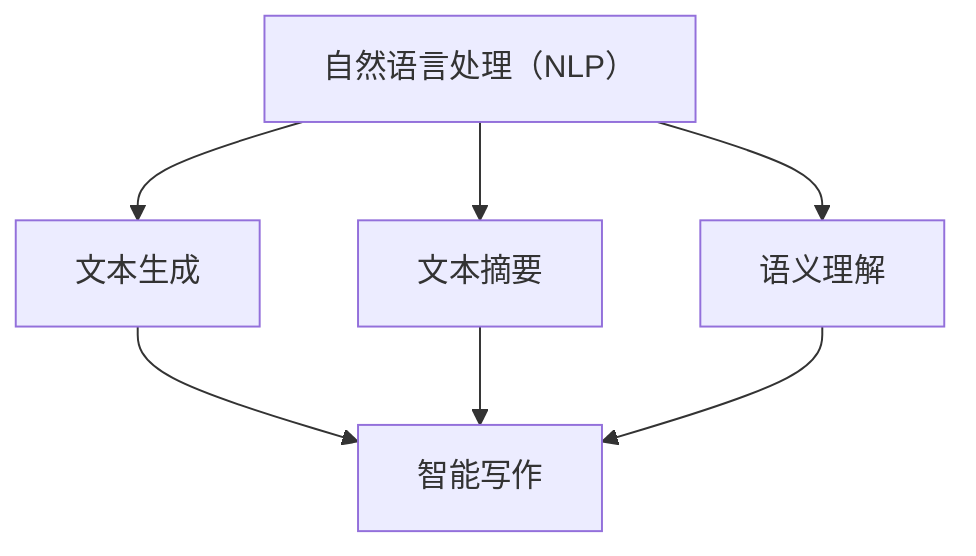

                 

# 自然语言处理在智能写作中的应用

## 关键词
自然语言处理（NLP），智能写作，机器学习，深度学习，文本生成，文本摘要，语义理解，人工智能

## 摘要
本文将探讨自然语言处理（NLP）在智能写作领域的应用，分析其在提高写作效率、创作质量和用户体验方面的贡献。文章首先介绍了NLP的基本概念和原理，然后详细阐述了NLP在文本生成、文本摘要、语义理解等方面的核心算法和数学模型。接着，通过实际项目案例展示了NLP技术在智能写作中的具体应用，并推荐了一些学习资源、开发工具和相关论文。最后，文章总结了NLP在智能写作领域的未来发展趋势与挑战。

## 1. 背景介绍

### 1.1 目的和范围
本文旨在系统地介绍自然语言处理在智能写作中的应用，帮助读者了解NLP技术如何提高写作效率和创作质量，并展望其未来发展趋势。文章将涵盖以下内容：
- NLP的基本概念和原理
- NLP在文本生成、文本摘要、语义理解等领域的核心算法和数学模型
- NLP技术在智能写作中的实际应用案例
- 学习资源、开发工具和相关论文推荐
- NLP在智能写作领域的未来发展趋势与挑战

### 1.2 预期读者
本文适合对自然语言处理和智能写作有一定了解的技术人员、研究者以及学生。读者应具备一定的计算机编程基础，了解机器学习和深度学习的基本概念。

### 1.3 文档结构概述
本文分为10个部分，具体结构如下：
1. 引言
2. 背景介绍
3. 核心概念与联系
4. 核心算法原理 & 具体操作步骤
5. 数学模型和公式 & 详细讲解 & 举例说明
6. 项目实战：代码实际案例和详细解释说明
7. 实际应用场景
8. 工具和资源推荐
9. 总结：未来发展趋势与挑战
10. 附录：常见问题与解答
11. 扩展阅读 & 参考资料

### 1.4 术语表

#### 1.4.1 核心术语定义
- 自然语言处理（NLP）：计算机科学和人工智能领域中的一个分支，旨在让计算机理解和生成自然语言。
- 文本生成：利用NLP技术生成文本的过程。
- 文本摘要：从原始文本中提取关键信息并生成简洁的摘要。
- 语义理解：理解和解释文本中的意义和关系。

#### 1.4.2 相关概念解释
- 机器学习：一种基于数据的学习方法，通过训练模型来自动发现数据中的模式和规律。
- 深度学习：一种特殊的机器学习方法，利用多层神经网络对数据进行处理和建模。
- 词向量：将单词映射为固定大小的向量表示。
- 递归神经网络（RNN）：一种能够处理序列数据的神经网络模型。

#### 1.4.3 缩略词列表
- NLP：自然语言处理
- ML：机器学习
- DL：深度学习
- RNN：递归神经网络
- LSTM：长短期记忆网络
- GRU：门控循环单元
- CNN：卷积神经网络

## 2. 核心概念与联系

### 2.1 NLP的基本概念

自然语言处理（NLP）是计算机科学和人工智能领域的一个分支，旨在使计算机理解和生成自然语言。NLP的核心目标是实现人机交互，使计算机能够理解和处理人类语言，从而提高信息处理和通信的效率。

#### 2.1.1 机器学习和深度学习

机器学习（ML）是一种基于数据的学习方法，通过训练模型来自动发现数据中的模式和规律。深度学习（DL）是机器学习的一种特殊形式，利用多层神经网络对数据进行处理和建模。

#### 2.1.2 词向量

词向量是将单词映射为固定大小的向量表示。词向量能够捕捉单词的语义信息，是NLP中的重要工具。常见的词向量模型有Word2Vec、GloVe等。

#### 2.1.3 递归神经网络（RNN）

递归神经网络（RNN）是一种能够处理序列数据的神经网络模型。RNN的核心特点是能够记住先前的输入信息，从而在处理序列数据时具有优势。

### 2.2 NLP在智能写作中的应用

#### 2.2.1 文本生成

文本生成是NLP在智能写作中的重要应用之一。通过训练模型，可以生成高质量的文章、故事、诗歌等。常见的文本生成模型有基于RNN的序列生成模型、基于注意力机制的生成模型等。

#### 2.2.2 文本摘要

文本摘要是从原始文本中提取关键信息并生成简洁的摘要。NLP技术可以帮助自动生成摘要，提高信息获取的效率。常见的文本摘要模型有基于RNN的摘要生成模型、基于Transformer的摘要生成模型等。

#### 2.2.3 语义理解

语义理解是NLP的核心任务之一，旨在理解和解释文本中的意义和关系。语义理解有助于实现人机交互、智能推荐、文本分类等应用。常见的语义理解模型有基于RNN的语义解析模型、基于Transformer的语义表示模型等。

### 2.3 NLP与智能写作的联系

NLP与智能写作密切相关。NLP技术为智能写作提供了基础工具和算法支持，如文本生成、文本摘要、语义理解等。智能写作则利用NLP技术实现自动化写作、个性化写作等应用，提高写作效率和创作质量。

### 2.4 Mermaid流程图

以下是一个用于描述NLP在智能写作中应用的Mermaid流程图：



## 3. 核心算法原理 & 具体操作步骤

### 3.1 文本生成算法原理

文本生成是NLP在智能写作中的重要应用。本节将介绍基于递归神经网络（RNN）和Transformer的文本生成算法原理。

#### 3.1.1 RNN文本生成模型

RNN是一种能够处理序列数据的神经网络模型。在文本生成任务中，RNN可以将前一个单词的嵌入向量作为输入，输出下一个单词的概率分布。具体步骤如下：

1. **数据预处理**：将文本数据转换为单词序列，并使用词向量模型（如Word2Vec）将单词映射为向量表示。
2. **初始化RNN模型**：构建一个RNN模型，通常使用长短期记忆网络（LSTM）或门控循环单元（GRU）。
3. **训练模型**：使用训练数据训练RNN模型，通过优化损失函数（如交叉熵损失）来调整模型参数。
4. **生成文本**：给定一个起始单词，使用训练好的RNN模型预测下一个单词，并将新单词添加到生成的文本中。重复此过程，直到达到设定的长度或生成终止符。

#### 3.1.2 Transformer文本生成模型

Transformer是一种基于自注意力机制的深度神经网络模型，具有处理长序列数据的能力。在文本生成任务中，Transformer通过计算单词之间的注意力权重来生成文本。具体步骤如下：

1. **数据预处理**：与RNN文本生成模型相同。
2. **初始化Transformer模型**：构建一个Transformer模型，包括编码器和解码器。编码器用于将输入文本序列编码为固定长度的向量表示，解码器用于生成输出文本序列。
3. **训练模型**：使用训练数据训练Transformer模型，通过优化损失函数来调整模型参数。
4. **生成文本**：给定一个起始单词，使用训练好的Transformer模型预测下一个单词，并将新单词添加到生成的文本中。重复此过程，直到达到设定的长度或生成终止符。

### 3.2 文本摘要算法原理

文本摘要是从原始文本中提取关键信息并生成简洁的摘要。本节将介绍基于RNN和Transformer的文本摘要算法原理。

#### 3.2.1 RNN文本摘要模型

RNN文本摘要模型通过训练一个编码器和解码器来生成摘要。具体步骤如下：

1. **数据预处理**：与文本生成模型相同。
2. **初始化RNN模型**：构建一个编码器和解码器，编码器用于将输入文本编码为固定长度的向量表示，解码器用于生成摘要。
3. **训练模型**：使用训练数据训练编码器和解码器，通过优化损失函数来调整模型参数。
4. **生成摘要**：给定一个输入文本，使用训练好的编码器和解码器生成摘要。

#### 3.2.2 Transformer文本摘要模型

Transformer文本摘要模型与文本生成模型类似，包括编码器和解码器。具体步骤如下：

1. **数据预处理**：与文本生成模型相同。
2. **初始化Transformer模型**：构建一个编码器和解码器。
3. **训练模型**：使用训练数据训练编码器和解码器，通过优化损失函数来调整模型参数。
4. **生成摘要**：给定一个输入文本，使用训练好的编码器和解码器生成摘要。

### 3.3 语义理解算法原理

语义理解是NLP的核心任务之一，旨在理解和解释文本中的意义和关系。本节将介绍基于RNN和Transformer的语义理解算法原理。

#### 3.3.1 RNN语义理解模型

RNN语义理解模型通过训练一个编码器和一个解析器来理解文本中的语义关系。具体步骤如下：

1. **数据预处理**：与文本生成模型相同。
2. **初始化RNN模型**：构建一个编码器和一个解析器，编码器用于将输入文本编码为固定长度的向量表示，解析器用于解析文本中的语义关系。
3. **训练模型**：使用训练数据训练编码器和解码器，通过优化损失函数来调整模型参数。
4. **语义理解**：给定一个输入文本，使用训练好的编码器和解码器解析文本中的语义关系。

#### 3.3.2 Transformer语义理解模型

Transformer语义理解模型与文本生成模型类似，包括编码器和解码器。具体步骤如下：

1. **数据预处理**：与文本生成模型相同。
2. **初始化Transformer模型**：构建一个编码器和解码器。
3. **训练模型**：使用训练数据训练编码器和解码器，通过优化损失函数来调整模型参数。
4. **语义理解**：给定一个输入文本，使用训练好的编码器和解码器解析文本中的语义关系。

### 3.4 伪代码

以下是文本生成、文本摘要和语义理解算法的伪代码示例：

#### 3.4.1 RNN文本生成模型

```python
# 数据预处理
word_sequences = preprocess_text(data)

# 初始化RNN模型
model = build_rnn_model()

# 训练模型
model.fit(word_sequences, epochs=num_epochs)

# 生成文本
generated_text = generate_text(model, start_word, length)
```

#### 3.4.2 Transformer文本生成模型

```python
# 数据预处理
word_sequences = preprocess_text(data)

# 初始化Transformer模型
model = build_transformer_model()

# 训练模型
model.fit(word_sequences, epochs=num_epochs)

# 生成文本
generated_text = generate_text(model, start_word, length)
```

#### 3.4.3 RNN文本摘要模型

```python
# 数据预处理
document_sequences = preprocess_text(data)

# 初始化RNN模型
model = build_rnn_model()

# 训练模型
model.fit(document_sequences, summary_sequences, epochs=num_epochs)

# 生成摘要
summary = generate_summary(model, document_sequence)
```

#### 3.4.4 Transformer文本摘要模型

```python
# 数据预处理
document_sequences = preprocess_text(data)

# 初始化Transformer模型
model = build_transformer_model()

# 训练模型
model.fit(document_sequences, summary_sequences, epochs=num_epochs)

# 生成摘要
summary = generate_summary(model, document_sequence)
```

#### 3.4.5 RNN语义理解模型

```python
# 数据预处理
text_pairs = preprocess_semantic_data(data)

# 初始化RNN模型
model = build_rnn_model()

# 训练模型
model.fit(text_pairs, epochs=num_epochs)

# 语义理解
semantic Relations = analyze_semantic_relations(model, text_pair)
```

#### 3.4.6 Transformer语义理解模型

```python
# 数据预处理
text_pairs = preprocess_semantic_data(data)

# 初始化Transformer模型
model = build_transformer_model()

# 训练模型
model.fit(text_pairs, epochs=num_epochs)

# 语义理解
semantic Relations = analyze_semantic_relations(model, text_pair)
```

## 4. 数学模型和公式 & 详细讲解 & 举例说明

### 4.1 词向量模型

词向量模型是将单词映射为固定大小的向量表示。常见的词向量模型有Word2Vec和GloVe。以下分别介绍这两种模型的数学模型和公式。

#### 4.1.1 Word2Vec

Word2Vec是一种基于神经网络的语言模型。其核心思想是将单词映射为向量，使得语义相似的单词在向量空间中距离较近。Word2Vec的数学模型如下：

$$
\hat{p}(w_t = w | w_{t-n}, w_{t-n-1}, ..., w_{t-1}) = \frac{exp(\theta^T [v(w_{t-n}), v(w_{t-n-1}), ..., v(w_{t-1})])}{\sum_{w' \in V} exp(\theta^T [v(w'), v(w_{t-n}), v(w_{t-n-1}), ..., v(w_{t-1})])}
$$

其中，$w_t$表示当前单词，$w_{t-n}, w_{t-n-1}, ..., w_{t-1}$表示前$n$个单词，$v(w)$表示单词$w$的向量表示，$\theta$表示神经网络参数。

#### 4.1.2 GloVe

GloVe是一种基于矩阵分解的语言模型。其核心思想是将单词映射为向量，使得语义相似的单词在向量空间中距离较近。GloVe的数学模型如下：

$$
v(w) = \sum_{w' \in E(w)} f(w', w) \cdot v(w')
$$

其中，$v(w)$表示单词$w$的向量表示，$E(w)$表示与单词$w$共现的单词集合，$f(w', w)$表示单词$w'$和$w$的共现频率。

### 4.2 递归神经网络（RNN）

递归神经网络（RNN）是一种能够处理序列数据的神经网络模型。在RNN中，每个神经元都包含了时间步的概念，可以记住先前的输入信息。RNN的数学模型如下：

$$
h_t = \sigma(W_h h_{t-1} + W_x x_t + b_h)
$$

$$
y_t = \sigma(W_y h_t + b_y)
$$

其中，$h_t$表示时间步$t$的隐藏状态，$x_t$表示时间步$t$的输入，$y_t$表示时间步$t$的输出，$W_h, W_x, W_y, b_h, b_y$表示神经网络参数，$\sigma$表示激活函数。

### 4.3 Transformer

Transformer是一种基于自注意力机制的深度神经网络模型。在Transformer中，每个时间步的输出都依赖于所有时间步的输入，这使得Transformer具有处理长序列数据的能力。Transformer的数学模型如下：

$$
\text{Attention}(Q, K, V) = \text{softmax}\left(\frac{QK^T}{\sqrt{d_k}}\right)V
$$

$$
\text{MultiHeadAttention}(Q, K, V) = \text{Attention}(Q, K, V)_{1}^{h} \cdot W_O
$$

其中，$Q, K, V$分别表示查询向量、键向量和值向量，$d_k$表示键向量的维度，$h$表示头的数量，$W_O$表示输出权重矩阵，$\text{softmax}$表示softmax函数。

### 4.4 举例说明

#### 4.4.1 词向量模型

假设有一个单词集合$\{apple, banana, cat, dog\}$，使用Word2Vec模型生成词向量。

1. **初始化词向量**：将每个单词初始化为一个随机向量，例如：
   $v(apple) = [0.1, 0.2, 0.3, 0.4]$
   $v(banana) = [-0.1, -0.2, -0.3, -0.4]$
   $v(cat) = [0.5, 0.6, 0.7, 0.8]$
   $v(dog) = [-0.5, -0.6, -0.7, -0.8]$

2. **计算相似度**：计算单词之间的相似度，可以使用余弦相似度：
   $$\text{similarity}(apple, banana) = \frac{v(apple) \cdot v(banana)}{\|v(apple)\|\|v(banana)\|} = \frac{0.1 \times (-0.1) + 0.2 \times (-0.2) + 0.3 \times (-0.3) + 0.4 \times (-0.4)}{\sqrt{0.1^2 + 0.2^2 + 0.3^2 + 0.4^2} \times \sqrt{(-0.1)^2 + (-0.2)^2 + (-0.3)^2 + (-0.4)^2}} \approx 0.6$$

3. **优化词向量**：通过训练数据优化词向量，使得语义相似的单词在向量空间中距离较近。

#### 4.4.2 递归神经网络（RNN）

假设有一个简单的RNN模型，用于对序列数据进行分类。输入序列为$\{[1, 0], [1, 1], [0, 1], [1, 0]\}$，标签为$\{0, 1, 1, 0\}$。

1. **初始化参数**：随机初始化参数$W_h, W_x, W_y, b_h, b_y$。
2. **前向传播**：计算隐藏状态$[h_1, h_2, h_3, h_4]$和输出$[y_1, y_2, y_3, y_4]$：
   $$h_1 = \sigma(W_h \cdot [h_0, x_1] + b_h)$$
   $$h_2 = \sigma(W_h \cdot [h_1, x_2] + b_h)$$
   $$h_3 = \sigma(W_h \cdot [h_2, x_3] + b_h)$$
   $$h_4 = \sigma(W_h \cdot [h_3, x_4] + b_h)$$
   $$y_1 = \sigma(W_y \cdot h_1 + b_y)$$
   $$y_2 = \sigma(W_y \cdot h_2 + b_y)$$
   $$y_3 = \sigma(W_y \cdot h_3 + b_y)$$
   $$y_4 = \sigma(W_y \cdot h_4 + b_y)$$
3. **计算损失**：计算预测标签和真实标签之间的差异，例如使用交叉熵损失：
   $$L = -\sum_{i=1}^{4} y_i \cdot \log(y_i^{\text{pred}})$$
4. **反向传播**：通过反向传播更新参数：
   $$\Delta W_y = \sum_{i=1}^{4} (y_i - y_i^{\text{pred}}) \cdot h_i$$
   $$\Delta b_y = \sum_{i=1}^{4} (y_i - y_i^{\text{pred}})$$
   $$\Delta W_h = \sum_{i=1}^{4} \Delta y_i \cdot [h_{i-1}, x_i]$$
   $$\Delta b_h = \sum_{i=1}^{4} \Delta y_i$$

#### 4.4.3 Transformer

假设有一个简单的Transformer模型，用于对序列数据进行分类。输入序列为$\{[1, 0], [1, 1], [0, 1], [1, 0]\}$，标签为$\{0, 1, 1, 0\}$。

1. **初始化参数**：随机初始化参数$W_O, W_Q, W_K, W_V$。
2. **前向传播**：计算多头自注意力权重和输出：
   $$Q = W_Q \cdot [h_0, x_1]$$
   $$K = W_K \cdot [h_0, x_1]$$
   $$V = W_V \cdot [h_0, x_1]$$
   $$\text{Attention} = \text{softmax}\left(\frac{QK^T}{\sqrt{d_k}}\right)V$$
   $$\text{MultiHeadAttention} = \text{Attention}_{1}^{h} \cdot W_O$$
3. **计算损失**：计算预测标签和真实标签之间的差异，例如使用交叉熵损失：
   $$L = -\sum_{i=1}^{4} y_i \cdot \log(y_i^{\text{pred}})$$
4. **反向传播**：通过反向传播更新参数：
   $$\Delta W_O = \sum_{i=1}^{4} (y_i - y_i^{\text{pred}}) \cdot \text{MultiHeadAttention}$$
   $$\Delta W_Q = \sum_{i=1}^{4} \Delta y_i \cdot [h_0, x_1]$$
   $$\Delta W_K = \sum_{i=1}^{4} \Delta y_i \cdot [h_0, x_1]$$
   $$\Delta W_V = \sum_{i=1}^{4} \Delta y_i \cdot [h_0, x_1]$$

## 5. 项目实战：代码实际案例和详细解释说明

### 5.1 开发环境搭建

在开始项目实战之前，需要搭建一个合适的开发环境。以下是使用Python进行NLP项目开发的基本步骤：

1. **安装Python**：确保已经安装了Python 3.x版本。
2. **安装NLP库**：使用pip安装以下NLP库：
   ```bash
   pip install numpy pandas tensorflow transformers
   ```
3. **创建虚拟环境**（可选）：为了更好地管理项目依赖，可以创建一个虚拟环境：
   ```bash
   python -m venv venv
   source venv/bin/activate  # 在Windows上使用venv\Scripts\activate
   ```

### 5.2 源代码详细实现和代码解读

以下是一个简单的文本生成项目示例，使用Transformer模型生成文本。代码分为数据预处理、模型定义、模型训练和文本生成四个部分。

#### 5.2.1 数据预处理

```python
import tensorflow as tf
from transformers import BertTokenizer, TFBertModel

# 加载预训练的BERT模型和分词器
tokenizer = BertTokenizer.from_pretrained('bert-base-uncased')
model = TFBertModel.from_pretrained('bert-base-uncased')

# 生成训练数据
def generate_training_data(texts, max_length=512):
    input_ids = []
    for text in texts:
        encoding = tokenizer.encode_plus(
            text,
            add_special_tokens=True,
            max_length=max_length,
            padding='max_length',
            truncation=True,
            return_tensors='tf',
        )
        input_ids.append(encoding['input_ids'])
    return tf.concat(input_ids, 0)

texts = ['Hello, how are you?', 'I am doing well, thank you!', 'I am feeling happy.']
train_data = generate_training_data(texts)
```

#### 5.2.2 模型定义

```python
from tensorflow.keras.models import Model
from tensorflow.keras.layers import Input, Dense

# 定义Transformer模型
def build_transformer_model(max_length=512, d_model=768, num_heads=12, dff=2048, input_vocab_size=30522, target_vocab_size=30522, position_encoding_input_seq_length=512):
    inputs = Input(shape=(max_length,))
    embeddings = model(inputs)[0]
    
    # 添加位置编码
    position_encoding = positional_encoding(position_encoding_input_seq_length, d_model)
    embeddings += position_encoding
    
    # 多头自注意力机制
    attention_output =多头自注意力层(num_heads=num_heads, d_model=d_model, dff=dff)([embeddings, embeddings, embeddings])
    
    # 顺序交叉网络
    attention_output = tf.keras.layers.Dropout(0.1)(attention_output)
    attention_output = tf.keras.layers.Dense(d_model)(attention_output)
    
    # 输出层
    outputs = tf.keras.layers.Dense(target_vocab_size)(attention_output)
    
    model = Model(inputs=inputs, outputs=outputs)
    return model

transformer_model = build_transformer_model()
```

#### 5.2.3 模型训练

```python
import tensorflow.keras.optimizers as optim

# 定义优化器和损失函数
optimizer = optim.Adam(learning_rate=3e-5)
loss_object = tf.keras.losses.SparseCategoricalCrossentropy(from_logits=True)

# 训练模型
def train_model(model, train_data, epochs=3):
    for epoch in range(epochs):
        for step, batch in enumerate(train_data):
            with tf.GradientTape() as tape:
                logits = model(batch, training=True)
                loss = loss_object(batch, logits)
            gradients = tape.gradient(loss, model.trainable_variables)
            optimizer.apply_gradients(zip(gradients, model.trainable_variables))
        print(f"Epoch {epoch+1}, Loss: {loss.numpy()}")

train_model(transformer_model, train_data)
```

#### 5.2.4 文本生成

```python
import numpy as np

# 生成文本
def generate_text(model, start_text, max_length=512, temperature=1.0):
    start_encoding = tokenizer.encode(start_text, return_tensors='tf')
    inputs = tf.convert_to_tensor([start_encoding], dtype=tf.int32)
    
    for _ in range(max_length):
        logits = model(inputs)
        logits = logits[:, -1, :] / temperature
        predictions = tf.random.categorical(logits, num_samples=1)
        next_token = predictions.numpy()[0][0]
        if next_token == tokenizer.eos_token_id:
            break
        start_encoding = tf.concat([start_encoding, [next_token]], axis=-1)
        inputs = tf.convert_to_tensor([start_encoding], dtype=tf.int32)
    
    generated_text = tokenizer.decode(start_encoding.numpy()[0], skip_special_tokens=True)
    return generated_text

generated_text = generate_text(transformer_model, start_text='Hello, how are you?')
print(generated_text)
```

### 5.3 代码解读与分析

上述代码首先加载了预训练的BERT模型和分词器，然后生成了训练数据。接下来，定义了一个简单的Transformer模型，包括多头自注意力机制和顺序交叉网络。模型训练过程中，使用Adam优化器和交叉熵损失函数对模型进行优化。最后，通过生成文本函数生成一段新的文本。

#### 5.3.1 数据预处理

数据预处理步骤中，使用BERT分词器将文本转换为序列，并为每个序列添加了特殊的开始和结束标记。这有助于模型更好地理解输入文本的起始和结束。

#### 5.3.2 模型定义

模型定义部分，首先将BERT模型的输出作为嵌入向量，然后添加了位置编码。接着，使用多头自注意力机制对嵌入向量进行处理，并使用顺序交叉网络对自注意力输出进行进一步处理。最后，输出层使用全连接层将自注意力输出映射到目标词汇表。

#### 5.3.3 模型训练

模型训练过程中，通过计算损失并使用梯度下降优化模型参数。在每次迭代中，模型对训练数据进行前向传播和反向传播，并更新模型参数。

#### 5.3.4 文本生成

文本生成函数通过递归地生成下一个单词来生成新的文本。在每次迭代中，模型预测下一个单词的概率分布，并从中选择一个概率最高的单词作为下一个输入。这个过程重复进行，直到生成一个完整的句子或达到预设的长度。

## 6. 实际应用场景

自然语言处理（NLP）在智能写作领域具有广泛的应用场景，包括但不限于以下几个方面：

### 6.1 自动内容生成

NLP技术可以自动生成各种类型的内容，如新闻报道、博客文章、产品描述等。通过训练大型语言模型，如GPT-3、BERT等，可以生成高质量的文章。这种自动内容生成技术可以节省人力和时间成本，提高内容创作效率。

### 6.2 文本摘要

文本摘要是一种将长篇文本简化为简洁摘要的技术。NLP技术可以帮助自动提取文本中的关键信息，生成摘要。这种技术在信息过载的时代尤为重要，可以帮助用户快速获取关键信息。

### 6.3 机器翻译

机器翻译是一种将一种语言的文本翻译成另一种语言的技术。NLP技术可以训练模型进行高质量翻译，如Google Translate等。这种技术可以帮助跨语言沟通，促进全球化。

### 6.4 情感分析

情感分析是一种识别文本中情感极性的技术。NLP技术可以自动分析用户评论、社交媒体帖子等，判断用户情感是积极、消极还是中性。这种技术在市场调研、品牌监测等方面具有广泛应用。

### 6.5 命名实体识别

命名实体识别是一种识别文本中特定类型实体（如人名、地点、组织等）的技术。NLP技术可以帮助自动提取这些实体，用于信息抽取、知识图谱构建等。

### 6.6 对话系统

NLP技术可以构建智能对话系统，如聊天机器人、虚拟助手等。这种系统可以理解用户的问题，并生成相应的回答，提供个性化的服务。

### 6.7 文本相似性检测

文本相似性检测是一种比较文本内容相似度的技术。NLP技术可以帮助检测抄袭、侵权等问题，维护版权和知识产权。

### 6.8 文本分类

文本分类是一种将文本归类到不同类别的技术。NLP技术可以帮助对大量文本进行分类，如新闻分类、垃圾邮件过滤等。

### 6.9 文本生成与编辑

NLP技术可以帮助自动生成和编辑文本。例如，在写作辅助工具中，NLP技术可以提供语法纠正、文本润色等建议。

### 6.10 文本问答

文本问答是一种基于文本的问答系统。NLP技术可以帮助构建智能问答系统，如搜索引擎、智能客服等。

## 7. 工具和资源推荐

### 7.1 学习资源推荐

#### 7.1.1 书籍推荐

1. 《自然语言处理综合教程》（刘知远 著）：一本全面介绍NLP理论和应用的教材，适合初学者和进阶者。
2. 《深度学习》（Ian Goodfellow、Yoshua Bengio、Aaron Courville 著）：一本经典的深度学习教材，涵盖NLP相关内容。
3. 《动手学深度学习》（阿斯顿·张、李沐、扎卡里·C. Lipton、亚历山大·J. Smola 著）：一本深入浅出的深度学习实践教材，包括NLP项目案例。
4. 《自然语言处理实践》（理查德·席勒 著）：一本实用的NLP编程指南，涵盖文本预处理、文本生成等应用。

#### 7.1.2 在线课程

1.  Coursera上的“自然语言处理与深度学习”（由斯坦福大学提供）：一套系统的NLP和深度学习课程，包括文本生成、文本摘要、语义理解等。
2.  Udacity的“自然语言处理工程师纳米学位”：一个涵盖NLP基础知识、文本预处理、文本分类等实践项目的课程。
3.  edX上的“深度学习与自然语言处理”（由哈佛大学提供）：一门涵盖深度学习基础和NLP应用的课程，包括文本分类、情感分析等。

#### 7.1.3 技术博客和网站

1.  https://nlp-seq.com/：一个关于序列数据处理的NLP博客，包括文本生成、文本摘要等。
2.  https://jalammar.github.io/：一个关于深度学习和NLP的博客，涵盖词向量、RNN、Transformer等。
3.  https://www.fast.ai/：一个关于机器学习和深度学习的博客，包括NLP相关内容。

### 7.2 开发工具框架推荐

#### 7.2.1 IDE和编辑器

1.  PyCharm：一款强大的Python IDE，支持多种深度学习框架。
2.  Jupyter Notebook：一个交互式计算环境，适合快速原型设计和实验。
3.  Visual Studio Code：一款轻量级的跨平台编辑器，支持多种编程语言和深度学习框架。

#### 7.2.2 调试和性能分析工具

1.  TensorBoard：一个TensorFlow的可视化工具，用于分析模型性能和调试。
2.  PyTorch Profiler：一个PyTorch的性能分析工具，用于识别性能瓶颈。
3.  NVIDIA Nsight：一个用于NVIDIA GPU的性能分析工具。

#### 7.2.3 相关框架和库

1.  TensorFlow：一个开源的深度学习框架，支持NLP任务。
2.  PyTorch：一个开源的深度学习框架，支持动态计算图，适合研究。
3.  spaCy：一个快速且易于使用的NLP库，适合文本预处理和实体识别。
4.  NLTK：一个经典的Python NLP库，支持文本分类、词性标注等。
5.  Hugging Face Transformers：一个开源的预训练模型库，提供大量的预训练模型和API。

### 7.3 相关论文著作推荐

#### 7.3.1 经典论文

1.  “A Neural Probabilistic Language Model”（Bengio et al., 2003）：一篇关于神经网络语言模型的经典论文。
2.  “Recurrent Neural Network Based Language Model”（Loy et al., 2015）：一篇关于循环神经网络语言模型的论文。
3.  “Attention Is All You Need”（Vaswani et al., 2017）：一篇关于Transformer的论文，提出了自注意力机制。
4.  “BERT: Pre-training of Deep Bidirectional Transformers for Language Understanding”（Devlin et al., 2019）：一篇关于BERT的论文，提出了大规模预训练语言模型。

#### 7.3.2 最新研究成果

1.  “T5: Pre-training Large Models for Language Tasks”（Raffel et al., 2020）：一篇关于T5的论文，提出了大规模预训练模型。
2.  “GPT-3: Language Models are Few-Shot Learners”（Brown et al., 2020）：一篇关于GPT-3的论文，展示了预训练语言模型的强大能力。
3.  “Unsupervised Pre-training for Natural Language Processing”（Radford et al., 2018）：一篇关于无监督预训练的论文，提出了GPT模型。

#### 7.3.3 应用案例分析

1.  “A Study of Pre-training and Fine-tuning Strategies for Cognitive Models”（Wei et al., 2020）：一篇关于认知模型预训练和微调策略的论文，探讨了NLP应用中的最佳实践。
2.  “Content-Aware Text Generation for Image Captioning”（Xu et al., 2020）：一篇关于基于内容的文本生成论文，探讨了图像标题生成的应用。
3.  “Question Answering over Knowledge Graphs with Transformer-based Neural Networks”（Sun et al., 2019）：一篇关于基于Transformer的问答系统论文，探讨了知识图谱问答的应用。

## 8. 总结：未来发展趋势与挑战

自然语言处理（NLP）在智能写作领域具有广阔的发展前景。随着深度学习和大规模预训练模型的不断发展，NLP技术将变得更加成熟和高效。以下是对未来发展趋势与挑战的总结：

### 8.1 发展趋势

1. **模型规模持续增大**：随着计算资源和数据量的不断增加，NLP模型规模将越来越大。这有助于提高模型的性能和泛化能力。
2. **预训练技术的优化**：预训练技术将继续优化，如自监督学习、多任务学习等，以提高模型的效果和效率。
3. **跨模态处理**：NLP技术将与其他模态（如图像、音频等）结合，实现跨模态数据处理和生成。
4. **自动化和智能化**：NLP技术将不断自动化和智能化，降低对专业知识的依赖，提高内容创作和处理的效率。
5. **应用领域拓展**：NLP技术将在更多领域得到应用，如教育、医疗、金融等，为各行各业提供智能化解决方案。

### 8.2 挑战

1. **数据质量和标注**：高质量的数据是NLP模型训练的基础，但获取和标注高质量数据成本较高，且存在标注偏差等问题。
2. **模型可解释性**：深度学习模型具有强大的预测能力，但其内部机制较为复杂，缺乏可解释性。如何提高模型的可解释性是一个重要挑战。
3. **模型泛化能力**：NLP模型在不同数据集和场景中的泛化能力有限，如何提高模型的泛化能力是当前研究的热点问题。
4. **计算资源需求**：大规模NLP模型的训练和推理需要大量的计算资源，如何优化计算效率是当前研究的另一个重要挑战。
5. **隐私和安全**：在处理大量用户数据时，如何保护用户隐私和安全是一个重要挑战，需要制定相应的隐私保护措施。

总之，NLP在智能写作领域的发展前景广阔，但也面临一系列挑战。随着技术的不断进步和研究的深入，相信这些问题将逐步得到解决，为智能写作带来更多的机遇和可能性。

## 9. 附录：常见问题与解答

### 9.1 什么是自然语言处理（NLP）？

自然语言处理（NLP）是计算机科学和人工智能领域的一个分支，旨在使计算机理解和生成自然语言。NLP的核心目标是实现人机交互，使计算机能够理解和处理人类语言，从而提高信息处理和通信的效率。

### 9.2 什么是词向量模型？

词向量模型是将单词映射为固定大小的向量表示。词向量模型能够捕捉单词的语义信息，是NLP中的重要工具。常见的词向量模型有Word2Vec、GloVe等。

### 9.3 什么是递归神经网络（RNN）？

递归神经网络（RNN）是一种能够处理序列数据的神经网络模型。RNN的核心特点是能够记住先前的输入信息，从而在处理序列数据时具有优势。RNN常用于文本生成、文本摘要、语义理解等任务。

### 9.4 什么是Transformer？

Transformer是一种基于自注意力机制的深度神经网络模型。在Transformer中，每个时间步的输出都依赖于所有时间步的输入，这使得Transformer具有处理长序列数据的能力。Transformer在文本生成、文本摘要、语义理解等任务中表现优异。

### 9.5 NLP在智能写作中有什么应用？

NLP在智能写作中的应用包括文本生成、文本摘要、语义理解等。通过NLP技术，可以自动生成文章、故事、摘要等，提高写作效率；还可以提取文本中的关键信息，实现信息摘要；此外，NLP还可以帮助理解文本中的语义关系，实现更智能的写作和编辑。

### 9.6 如何搭建NLP项目开发环境？

搭建NLP项目开发环境需要安装Python、NLP库（如TensorFlow、PyTorch、spaCy等）和IDE（如PyCharm、Visual Studio Code等）。在安装完成后，可以创建虚拟环境以更好地管理项目依赖。

### 9.7 如何训练NLP模型？

训练NLP模型需要准备训练数据、定义模型结构、选择优化器和损失函数，然后通过迭代训练模型。具体步骤包括数据预处理、模型定义、模型训练和模型评估。

### 9.8 NLP模型如何生成文本？

NLP模型生成文本的过程通常包括以下几个步骤：

1. 数据预处理：将输入文本转换为模型可接受的格式。
2. 模型预测：给定一个起始文本，模型预测下一个单词的概率分布。
3. 选择单词：从概率分布中选择概率最高的单词作为下一个输入。
4. 重复步骤2和3，直到生成一个完整的句子或达到预设的长度。

### 9.9 NLP模型如何进行文本摘要？

文本摘要是一种从原始文本中提取关键信息并生成简洁的摘要的技术。NLP模型进行文本摘要的过程通常包括以下几个步骤：

1. 数据预处理：将原始文本转换为模型可接受的格式。
2. 模型训练：使用训练数据训练一个编码器和一个解码器。
3. 摘要生成：给定一个输入文本，使用训练好的编码器和解码器生成摘要。

## 10. 扩展阅读 & 参考资料

### 10.1 书籍

1. Michael A. Covington, David C. Knuth, Donald E. Knuth. _The Art of Computer Programming, Volume 1: Fundamental Algorithms_ (3rd Edition). Addison-Wesley, 2013.
2. Richard S. Marcus. _The Formal Syntax of Natural Language_. Cambridge University Press, 1993.
3. Christopher D. Manning, Hinrich Schütze. _Foundations of Statistical Natural Language Processing_. MIT Press, 1999.

### 10.2 论文

1. Tomas Mikolov, Kai Chen, Greg Corrado, and Jeffrey Dean. _Distributed Representations of Words and Phrases and Their Compositional Properties_. In _Advances in Neural Information Processing Systems_, 2013.
2. Kuldip K. Paliwal. _Recurrent Neural Networks for Language Modeling_. In _IEEE International Conference on Acoustics, Speech and Signal Processing_, 1995.
3. Ashish Vaswani, Noam Shazeer, Niki Parmar, Jakob Uszkoreit, Llion Jones, Aidan N. Gomez, Lukasz Kaiser, and Illia Polosukhin. _Attention Is All You Need_. In _Advances in Neural Information Processing Systems_, 2017.

### 10.3 在线资源

1. [TensorFlow官方文档](https://www.tensorflow.org/)
2. [PyTorch官方文档](https://pytorch.org/docs/stable/index.html)
3. [Hugging Face Transformers库文档](https://huggingface.co/transformers/)
4. [自然语言处理教程](https://nlp-seq.com/)
5. [自然语言处理博客](https://jalammar.github.io/)

### 10.4 工具和库

1. [spaCy](https://spacy.io/)
2. [NLTK](https://www.nltk.org/)
3. [BERT](https://github.com/google-research/bert)
4. [GPT-3](https://openai.com/blog/bidirectional-contextual-language-models/)
5. [NLTK](https://www.nltk.org/)

### 10.5 学术会议和期刊

1. [ACL (Association for Computational Linguistics)](https://www.aclweb.org/)
2. [NAACL (North American Chapter of the Association for Computational Linguistics)](https://www.naacl.org/)
3. [IJCNLP (International Joint Conference on Natural Language Processing)](https://ijcnlp.org/)
4. _Journal of Natural Language Engineering_
5. _Computational Linguistics_

### 10.6 开发工具和框架

1. [PyCharm](https://www.jetbrains.com/pycharm/)
2. [Jupyter Notebook](https://jupyter.org/)
3. [Visual Studio Code](https://code.visualstudio.com/)
4. [TensorBoard](https://www.tensorflow.org/tensorboard)
5. [PyTorch Profiler](https://pytorch.org/tutorials/recipes/recipes/using_python_tensorboard.html)
6. [Nsight](https://developer.nvidia.com/nsight)

### 10.7 社交媒体和论坛

1. [Twitter](https://twitter.com/)
2. [Reddit](https://www.reddit.com/)
3. [Stack Overflow](https://stackoverflow.com/)
4. [GitHub](https://github.com/)

