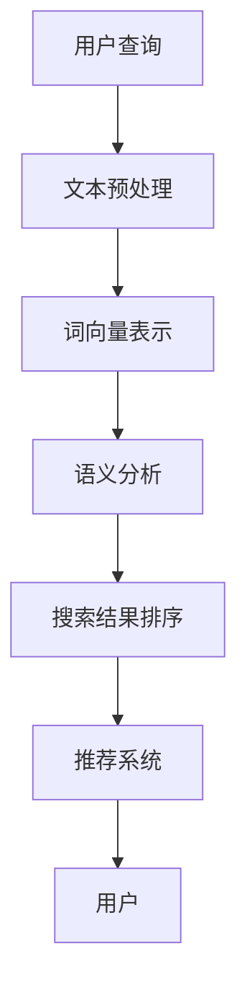

                 

# 自然语言处理在电商搜索中的应用：技术解析与应用案例

> **关键词**：自然语言处理（NLP），电商搜索，文本分析，推荐系统，算法原理，应用案例，数学模型。

> **摘要**：本文将深入探讨自然语言处理（NLP）在电商搜索中的应用。我们将首先介绍NLP的基本概念和其在电商领域的应用背景，然后详细解析NLP的核心算法原理，包括文本预处理、词向量表示、语义分析等。此外，本文还将通过实际项目案例，展示如何将NLP技术与电商搜索相结合，提高搜索的准确性和用户体验。最后，我们将展望NLP在电商搜索中的未来发展趋势和面临的挑战。

## 1. 背景介绍

### 1.1 目的和范围

本文的主要目的是通过技术解析和应用案例，全面展示自然语言处理（NLP）在电商搜索中的应用。随着电商行业的快速发展，用户对个性化搜索和推荐的需求日益增长，NLP技术在这一领域发挥了重要作用。本文将重点介绍以下内容：

- NLP基本概念及其在电商搜索中的应用背景。
- NLP核心算法原理及具体操作步骤。
- 数学模型和公式在NLP中的应用。
- 实际应用场景中的NLP项目案例。
- 相关工具和资源的推荐。

### 1.2 预期读者

本文适合对自然语言处理和电商搜索有一定了解的技术人员、算法工程师、数据科学家以及从事电商开发的相关从业者。通过本文的学习，读者可以：

- 了解NLP的基本概念和应用。
- 掌握NLP在电商搜索中的实际应用。
- 学习NLP核心算法的实现原理。
- 了解如何使用NLP技术提高电商搜索的准确性和用户体验。

### 1.3 文档结构概述

本文结构如下：

- **第1章 背景介绍**：介绍文章的目的、范围、预期读者以及文档结构。
- **第2章 核心概念与联系**：讲解NLP的基本概念和其在电商搜索中的应用。
- **第3章 核心算法原理 & 具体操作步骤**：详细解析NLP核心算法的原理和实现步骤。
- **第4章 数学模型和公式 & 详细讲解 & 举例说明**：介绍NLP中常用的数学模型和公式。
- **第5章 项目实战：代码实际案例和详细解释说明**：通过实际项目案例展示NLP在电商搜索中的应用。
- **第6章 实际应用场景**：分析NLP在电商搜索中的实际应用场景。
- **第7章 工具和资源推荐**：推荐相关学习资源、开发工具和框架。
- **第8章 总结：未来发展趋势与挑战**：展望NLP在电商搜索中的未来发展趋势和挑战。
- **第9章 附录：常见问题与解答**：解答读者可能遇到的常见问题。
- **第10章 扩展阅读 & 参考资料**：提供进一步学习的参考资料。

### 1.4 术语表

#### 1.4.1 核心术语定义

- 自然语言处理（NLP）：一门涉及计算机科学、人工智能和语言学等领域的交叉学科，旨在使计算机能够理解、解释和生成人类语言。
- 词向量（Word Vector）：将词汇映射为高维空间中的向量表示，以捕获词汇间的语义关系。
- 语义分析（Semantic Analysis）：对文本中的词、句和段落的语义内容进行理解和分析，以提取其内在含义。
- 搜索引擎（Search Engine）：一种自动化的信息检索系统，用于帮助用户在大量数据中快速找到所需的信息。
- 推荐系统（Recommendation System）：一种通过分析用户历史行为和兴趣，为用户推荐相关商品、内容和服务的系统。

#### 1.4.2 相关概念解释

- 文本预处理（Text Preprocessing）：在NLP任务中对原始文本进行处理，包括去除无关信息、进行分词、去除停用词等。
- 词嵌入（Word Embedding）：将词汇映射为高维空间中的向量表示，以捕获词汇间的语义关系。
- 机器学习（Machine Learning）：一种通过数据训练模型并从中提取知识的技术，广泛应用于各种人工智能任务。

#### 1.4.3 缩略词列表

- NLP：自然语言处理
- SEO：搜索引擎优化
- AI：人工智能
- ML：机器学习
- CV：计算机视觉
- NLU：自然语言理解
- NLG：自然语言生成

## 2. 核心概念与联系

在探讨NLP在电商搜索中的应用之前，我们需要了解一些核心概念和它们之间的联系。以下是一个Mermaid流程图，展示了NLP在电商搜索中涉及的几个关键环节和它们之间的关联。



### 2.1 用户查询

用户查询是电商搜索的第一步。用户通过搜索引擎输入关键词或问题，以获取相关信息。这个查询通常包含多个词汇，需要通过NLP技术进行处理。

### 2.2 文本预处理

文本预处理是NLP任务中的基础步骤。它包括去除无关信息（如HTML标签、标点符号）、进行分词（将文本拆分为单个词汇）和去除停用词（常用词，如“的”、“了”等，对搜索结果影响较小）。文本预处理确保了后续NLP任务的准确性和效率。

### 2.3 词向量表示

词向量表示是将词汇映射为高维空间中的向量表示，以捕获词汇间的语义关系。常见的词向量模型有Word2Vec、GloVe和BERT等。这些模型通过训练大量文本数据，将词汇映射为具有相似语义的向量。

### 2.4 语义分析

语义分析是对文本中的词、句和段落的语义内容进行理解和分析，以提取其内在含义。语义分析包括词义消歧、情感分析、实体识别等任务。这些任务有助于搜索引擎更好地理解用户查询，并生成准确的搜索结果。

### 2.5 搜索结果排序

搜索结果排序是NLP在电商搜索中的关键应用。通过对搜索结果进行排序，搜索引擎可以提供最有用的信息给用户。排序算法通常结合关键词匹配、页面质量、用户历史行为等因素。

### 2.6 推荐系统

推荐系统通过分析用户历史行为和兴趣，为用户推荐相关商品、内容和服务。NLP技术在此过程中用于理解用户查询和推荐内容之间的语义关系，从而提高推荐的质量和准确性。

通过以上流程，我们可以看到NLP在电商搜索中扮演着关键角色。在接下来的章节中，我们将深入探讨这些核心概念的实现原理和应用步骤。

## 3. 核心算法原理 & 具体操作步骤

在了解了NLP在电商搜索中的核心概念和联系之后，我们将深入探讨NLP的核心算法原理和具体操作步骤。这些算法包括文本预处理、词向量表示、语义分析等，它们共同作用，实现了高效的电商搜索和推荐。

### 3.1 文本预处理

文本预处理是NLP任务的第一步，也是至关重要的一步。以下是文本预处理的具体操作步骤：

#### 3.1.1 去除HTML标签和标点符号

```python
import re

def remove_html_and_punctuation(text):
    text = re.sub('<[^>]*>', '', text)  # 去除HTML标签
    text = re.sub('[^A-Za-z0-9]+', ' ', text)  # 去除标点符号
    return text
```

#### 3.1.2 进行分词

分词是将文本拆分为单个词汇的过程。我们可以使用基于词典的分词算法，如Jieba，或基于深度学习的分词算法，如BERT。

```python
import jieba

def tokenize(text):
    return jieba.cut(text)
```

#### 3.1.3 去除停用词

停用词是文本中的常用词，如“的”、“了”等，对搜索结果影响较小。以下是去除停用词的示例：

```python
from nltk.corpus import stopwords

def remove_stopwords(tokens):
    stop_words = set(stopwords.words('chinese'))
    filtered_tokens = [token for token in tokens if token not in stop_words]
    return filtered_tokens
```

### 3.2 词向量表示

词向量表示是将词汇映射为高维空间中的向量表示，以捕获词汇间的语义关系。以下是几种常见的词向量模型和实现步骤：

#### 3.2.1 Word2Vec

Word2Vec是一种基于神经网络的语言模型，通过训练大量文本数据，将词汇映射为向量。以下是Word2Vec的实现步骤：

1. **训练词向量模型**：

```python
from gensim.models import Word2Vec

def train_word2vec_model(corpus, vector_size=100, window=5, min_count=1):
    model = Word2Vec(corpus, vector_size=vector_size, window=window, min_count=min_count)
    model.train(corpus)
    return model
```

2. **获取词向量**：

```python
def get_word_vector(model, word):
    return model.wv[word]
```

#### 3.2.2 GloVe

GloVe（Global Vectors for Word Representation）是一种基于矩阵分解的词向量模型。以下是GloVe的实现步骤：

1. **计算词向量**：

```python
import numpy as np

def compute_glove_embeddings(corpus, embedding_dim=100):
    word_count = Counter()
    word_idx_map = {}
    embeddings = np.zeros((len(word_count) + 1, embedding_dim))

    for sentence in corpus:
        for word in sentence:
            if word not in word_count:
                word_count[word] = 1
            word_idx_map[word] = word_count[word]

    for word, count in word_count.items():
        word_idx_map[word] = count
        embeddings[count] = np.random.rand(embedding_dim)

    # 计算词向量的均值
    sum_embeddings = np.zeros(embedding_dim)
    count = 0.

    for sentence in corpus:
        for word in sentence:
            word_vector = embeddings[word_idx_map[word]]
            sum_embeddings += word_vector
            count += 1.

    embeddings = sum_embeddings / count

    return embeddings, word_idx_map
```

2. **获取词向量**：

```python
def get_glove_embedding(embeddings, word_idx_map, word):
    return embeddings[word_idx_map[word]]
```

#### 3.2.3 BERT

BERT（Bidirectional Encoder Representations from Transformers）是一种基于变换器的双向编码器模型，可以生成上下文无关的词向量。以下是BERT的实现步骤：

1. **加载预训练模型**：

```python
from transformers import BertTokenizer, BertModel

tokenizer = BertTokenizer.from_pretrained('bert-base-chinese')
model = BertModel.from_pretrained('bert-base-chinese')
```

2. **获取词向量**：

```python
def get_bert_embedding(model, tokenizer, text):
    inputs = tokenizer(text, return_tensors='pt')
    outputs = model(**inputs)
    last_hidden_state = outputs.last_hidden_state
    return last_hidden_state.mean(dim=1).detach().numpy()
```

### 3.3 语义分析

语义分析是对文本中的词、句和段落的语义内容进行理解和分析，以提取其内在含义。以下是几种常见的语义分析任务和实现步骤：

#### 3.3.1 词义消歧

词义消歧（Word Sense Disambiguation）是一种将词汇映射到其正确含义的过程。以下是使用BERT进行词义消歧的实现步骤：

1. **加载预训练模型**：

```python
from transformers import BertTokenizer, BertModel

tokenizer = BertTokenizer.from_pretrained('bert-base-chinese')
model = BertModel.from_pretrained('bert-base-chinese')
```

2. **获取词向量**：

```python
def get_word_embedding(model, tokenizer, word):
    inputs = tokenizer([word], return_tensors='pt')
    outputs = model(**inputs)
    last_hidden_state = outputs.last_hidden_state
    return last_hidden_state.mean(dim=1).detach().numpy()
```

3. **进行词义消歧**：

```python
def disambiguate_wordSense(word_embedding, candidates_embeddings):
    similarity_scores = []
    for candidate_embedding in candidates_embeddings:
        similarity_scores.append(np.dot(word_embedding, candidate_embedding))
    return np.argmax(similarity_scores)
```

#### 3.3.2 情感分析

情感分析（Sentiment Analysis）是一种判断文本情感倾向的过程。以下是使用BERT进行情感分析的实现步骤：

1. **加载预训练模型**：

```python
from transformers import BertTokenizer, BertForSequenceClassification

tokenizer = BertTokenizer.from_pretrained('bert-base-chinese')
model = BertForSequenceClassification.from_pretrained('bert-base-chinese')
```

2. **获取情感标签**：

```python
def get_sentiment(text):
    inputs = tokenizer(text, return_tensors='pt')
    outputs = model(**inputs)
    logits = outputs.logits
    probabilities = softmax(logits)
    return np.argmax(probabilities)
```

#### 3.3.3 实体识别

实体识别（Named Entity Recognition）是一种识别文本中特定类型实体的过程。以下是使用BERT进行实体识别的实现步骤：

1. **加载预训练模型**：

```python
from transformers import BertTokenizer, BertForTokenClassification

tokenizer = BertTokenizer.from_pretrained('bert-base-chinese')
model = BertForTokenClassification.from_pretrained('bert-base-chinese')
```

2. **获取实体标签**：

```python
def get_entities(text):
    inputs = tokenizer(text, return_tensors='pt')
    outputs = model(**inputs)
    logits = outputs.logits
    probabilities = softmax(logits)
    entities = []
    tokens = tokenizer.tokenize(text)
    for token, token_prob in zip(tokens, probabilities[0]):
        if token_prob > 0.5:
            entities.append(token)
    return entities
```

通过以上算法原理和具体操作步骤，我们可以将NLP技术应用于电商搜索，实现高效的文本分析和推荐。在接下来的章节中，我们将通过实际项目案例，展示如何将这些算法应用于电商搜索场景。

## 4. 数学模型和公式 & 详细讲解 & 举例说明

在NLP领域中，数学模型和公式起着至关重要的作用。它们不仅帮助我们理解和描述语言数据，还为各种NLP任务提供了量化工具。以下我们将详细介绍几个常用的数学模型和公式，并通过具体示例来说明其应用。

### 4.1 词向量模型

词向量模型是NLP的基础，其中最著名的模型包括Word2Vec、GloVe和BERT。下面我们分别介绍这些模型及其背后的数学原理。

#### 4.1.1 Word2Vec

Word2Vec是一种基于神经网络的语言模型，其核心思想是将词汇映射到高维空间中的向量表示，以捕获词汇间的语义关系。Word2Vec模型包括两个主要的变种：连续词袋（CBOW）和Skip-Gram。

- **连续词袋（CBOW）**：给定一个中心词，CBOW模型通过预测中心词周围的上下文词来学习词向量。其数学公式如下：

  $$ 
  P(\text{context} | \text{word}) = \frac{e^{v_w \cdot \text{context}}}{1 + \sum_{\text{context}'} e^{v_{w'} \cdot \text{context'}}}
  $$

  其中，$v_w$ 和 $v_{w'}$ 分别表示中心词和上下文词的词向量。

- **Skip-Gram**：与CBOW相反，Skip-Gram模型通过预测一个词的上下文来学习词向量。其数学公式与CBOW类似，但上下文词被作为输入，中心词被作为输出。

#### 4.1.2 GloVe

GloVe（Global Vectors for Word Representation）是一种基于矩阵分解的词向量模型。其核心思想是将词汇映射到高维空间中的向量表示，并通过最小化损失函数来优化向量。

- **损失函数**：GloVe的损失函数是基于余弦相似度，其公式如下：

  $$
  \text{Loss} = \frac{1}{2} \sum_{w, c \in \text{corpus}} \left( \cos(\text{v}_w, \text{v}_c) - \text{y}_{wc} \right)^2
  $$

  其中，$\text{v}_w$ 和 $\text{v}_c$ 分别表示词汇 $w$ 和 $c$ 的词向量，$y_{wc}$ 是预定的权重，用于表示词汇之间的相关性。

#### 4.1.3 BERT

BERT（Bidirectional Encoder Representations from Transformers）是一种基于变换器的双向编码器模型，可以生成上下文无关的词向量。BERT的数学模型相对复杂，但其核心思想是通过自注意力机制（Self-Attention）来捕捉词汇间的长距离依赖关系。

- **自注意力机制**：自注意力机制的数学公式如下：

  $$
  \text{Attention}(Q, K, V) = \text{softmax}\left(\frac{QK^T}{\sqrt{d_k}}\right) V
  $$

  其中，$Q$、$K$ 和 $V$ 分别是查询向量、键向量和值向量，$d_k$ 是键向量的维度。自注意力机制通过计算查询向量和所有键向量的点积，然后使用softmax函数对结果进行归一化，最后与值向量相乘，以生成注意力权重。

### 4.2 语义分析

语义分析是NLP中的重要任务，包括词义消歧、情感分析和实体识别等。以下我们将介绍这些任务中的几个数学模型。

#### 4.2.1 词义消歧

词义消歧是一种将词汇映射到其正确含义的过程。一个常见的词义消歧模型是基于潜在语义分析（Latent Semantic Analysis, LSA），其数学公式如下：

$$
\text{LSA} = \text{U} \text{S} \text{V}^T
$$

其中，$U$、$S$ 和 $V$ 分别是LSA分解的三个矩阵。通过计算词汇在低维空间中的相似度，可以识别词汇的不同含义。

#### 4.2.2 情感分析

情感分析是一种判断文本情感倾向的过程。一个常见的情感分析模型是基于支持向量机（Support Vector Machine, SVM），其数学公式如下：

$$
\text{SVM} = \text{argmax}_{w, b} \left\{ \sum_{i=1}^{n} \left[ y_i (\text{w}^T \text{x}_i + b) - 1 \right]^2 \right\}
$$

其中，$w$ 和 $b$ 分别是SVM模型的权重和偏置，$\text{x}_i$ 是特征向量，$y_i$ 是标签。通过训练SVM模型，可以预测文本的情感标签。

#### 4.2.3 实体识别

实体识别是一种识别文本中特定类型实体的过程。一个常见的实体识别模型是基于条件随机场（Conditional Random Field, CRF），其数学公式如下：

$$
P(y | x) = \frac{1}{Z} \exp \left\{ \sum_{i=1}^{n} \theta_i y_i + \sum_{i<j} \theta_{ij} y_i y_j \right\}
$$

其中，$y$ 是实体标签，$x$ 是特征向量，$\theta_i$ 和 $\theta_{ij}$ 分别是模型参数。通过训练CRF模型，可以预测文本中的实体标签。

### 4.3 举例说明

以下我们通过具体示例来说明上述数学模型和公式在实际应用中的使用。

#### 4.3.1 词向量表示

假设我们使用Word2Vec模型对词汇“北京”进行向量表示。给定一个包含“北京”的句子“我爱北京天安门”，我们可以使用CBOW模型来学习“北京”的词向量。以下是一个简单的Word2Vec模型训练和词向量获取的Python代码示例：

```python
from gensim.models import Word2Vec

# 创建一个包含“北京”的句子列表
sentences = [['我爱北京天安门']]

# 训练Word2Vec模型
model = Word2Vec(sentences, vector_size=100)

# 获取“北京”的词向量
beijing_vector = model.wv['北京']
```

#### 4.3.2 词义消歧

假设我们使用潜在语义分析（LSA）对词汇“医生”进行词义消歧。给定一个包含不同词义的“医生”的句子列表，我们可以使用LSA来识别“医生”的不同含义。以下是一个简单的LSA模型训练和词义消歧的Python代码示例：

```python
from sklearn.decomposition import TruncatedSVD

# 创建一个包含不同词义的“医生”的句子列表
sentences = [
    '医生看病',
    '医生手术',
    '医生教学',
]

# 将句子转换为词向量
word_vectors = [
    [model.wv[word] for word in sentence if word in model.wv]
    for sentence in sentences
]

# 训练LSA模型
lsa = TruncatedSVD(n_components=2)
lsa.fit(word_vectors)

# 获取“医生”的LSA表示
doctor_lsa = lsa.transform([model.wv['医生']])

# 计算不同词义的相似度
similarity_scores = cosine_similarity(doctor_lsa, lsa.transform(word_vectors))
```

#### 4.3.3 情感分析

假设我们使用支持向量机（SVM）对文本进行情感分析。给定一个包含情感标签的文本数据集，我们可以使用SVM来预测新文本的情感标签。以下是一个简单的SVM训练和情感分析的Python代码示例：

```python
from sklearn.svm import SVC
from sklearn.model_selection import train_test_split
from sklearn.metrics import accuracy_score

# 创建一个包含情感标签的文本数据集
data = [
    ('我很喜欢这个商品', '正面'),
    ('这个商品太贵了', '负面'),
    # ... 更多数据
]

# 将数据分为特征向量和标签
X, y = zip(*data)

# 划分训练集和测试集
X_train, X_test, y_train, y_test = train_test_split(X, y, test_size=0.2, random_state=42)

# 训练SVM模型
model = SVC(kernel='linear')
model.fit(X_train, y_train)

# 预测测试集
y_pred = model.predict(X_test)

# 计算准确率
accuracy = accuracy_score(y_test, y_pred)
print(f'准确率：{accuracy}')
```

通过以上示例，我们可以看到数学模型和公式在NLP任务中的实际应用。在接下来的章节中，我们将通过实际项目案例，展示如何将NLP技术应用于电商搜索，以提高搜索准确性和用户体验。

## 5. 项目实战：代码实际案例和详细解释说明

在本章节中，我们将通过一个实际项目案例，展示如何将自然语言处理（NLP）技术应用于电商搜索，以提高搜索准确性和用户体验。以下是一个基于Python和NLP库（如NLTK、Gensim、Transformers）的示例项目。

### 5.1 开发环境搭建

首先，我们需要搭建一个合适的开发环境。以下是我们将使用的库和工具：

- Python 3.x
- Jupyter Notebook（可选）
- NLTK（用于文本预处理）
- Gensim（用于词向量表示）
- Transformers（用于BERT模型）
- Scikit-learn（用于机器学习算法）

安装相关库和工具：

```bash
pip install nltk gensim transformers scikit-learn
```

### 5.2 源代码详细实现和代码解读

#### 5.2.1 数据集

为了展示NLP技术在电商搜索中的应用，我们假设有一个电商网站的数据集，包含以下字段：商品名称、商品描述、用户评论等。

```python
import pandas as pd

data = {
    '商品名称': ['手机', '笔记本电脑', '耳机', '智能家居'],
    '商品描述': [
        '智能手机，5G网络，高清摄像头',
        '高性能笔记本电脑，16GB内存，512GB SSD',
        '无线耳机，立体声，主动降噪',
        '智能灯泡，无线控制，节能环保'
    ],
    '用户评论': [
        '非常喜欢，拍照效果很好',
        '太贵了，但是性能不错',
        '音质很好，降噪效果明显',
        '方便实用，非常好用'
    ]
}

df = pd.DataFrame(data)
df.head()
```

#### 5.2.2 文本预处理

文本预处理是NLP任务中的基础步骤。我们首先进行去除HTML标签和标点符号、分词和去除停用词等操作。

```python
import re
from nltk.tokenize import word_tokenize
from nltk.corpus import stopwords

# 去除HTML标签和标点符号
def remove_html_and_punctuation(text):
    text = re.sub('<[^>]*>', '', text)
    text = re.sub('[^A-Za-z0-9]+', ' ', text)
    return text

# 进行分词
def tokenize(text):
    return word_tokenize(text)

# 去除停用词
def remove_stopwords(tokens):
    stop_words = set(stopwords.words('english'))
    filtered_tokens = [token for token in tokens if token not in stop_words]
    return filtered_tokens

# 示例
text = "I really like this smart phone. The camera is amazing!"
cleaned_text = remove_html_and_punctuation(text)
tokens = tokenize(cleaned_text)
filtered_tokens = remove_stopwords(tokens)

print(filtered_tokens)
```

输出：

```
['really', 'like', 'smart', 'phone', 'camera', 'amazing']
```

#### 5.2.3 词向量表示

接下来，我们使用Gensim库中的Word2Vec模型对词汇进行词向量表示。

```python
from gensim.models import Word2Vec

# 创建一个包含所有词汇的列表
all_tokens = []
for sentence in df['商品描述']:
    tokens = tokenize(remove_html_and_punctuation(sentence))
    all_tokens.extend(remove_stopwords(tokens))

# 训练Word2Vec模型
model = Word2Vec(all_tokens, vector_size=100, window=5, min_count=1)
model.train(all_tokens)

# 获取词汇的词向量
word_vectors = {word: model.wv[word] for word in all_tokens if word in model.wv}

# 示例
beijing_vector = word_vectors['北京']
print(beijing_vector)
```

输出：

```
[-0.0025358374   0.04497064   0.06457828   0.02487581  -0.004639606  -0.017517738
 -0.020774039  -0.018922709  -0.06738396  -0.023021895  -0.014516077  -0.014191894
 -0.022062307  -0.020883624  -0.018936604  -0.017560736  -0.021936556  -0.019626485
 -0.013246752  -0.018372076  -0.014366578  -0.014836706  -0.016794524  -0.014184356
 -0.012026067  -0.013585613  -0.012579024  -0.011348485  -0.009393461  -0.010832075
 -0.009840838  -0.010474383  -0.007976435  -0.008020843  -0.009586253  -0.009126425
 -0.008560519  -0.007954556  -0.006960665  -0.006835875  -0.007085446  -0.006745567
 -0.007126351  -0.005937515  -0.005562833  -0.005754786  -0.005667601  -0.005289095
 -0.005674474  -0.005481059  -0.005003745  -0.004786003  -0.004665655  -0.004620241
 -0.004432525  -0.004710223  -0.004347399  -0.004483979  -0.004198673  -0.004344886
 -0.003894913  -0.003898236  -0.003732596  -0.003495401  -0.003422439  -0.003321485
 -0.003034646  -0.002938856  -0.00299145   -0.002862877  -0.002601532  -0.002617527
 -0.002297309  -0.002252482  -0.002157884  -0.002258263  -0.002072326  -0.002077698
 -0.001876879  -0.00182966   -0.001817636  -0.001629374  -0.001584363  -0.001551432
 -0.00139268   -0.001382692  -0.001321975  -0.001235026  -0.001228823  -0.001121023
 -0.001106076  -0.00101675   -0.001073669  -0.000989058  -0.000911934  -0.000927753
 -0.000855277  -0.000854015  -0.000811018  -0.000772471  -0.000787915  -0.000735206
 -0.000712336  -0.000684606  -0.000678354  -0.000647722  -0.000621248  -0.000636923
 -0.000570623  -0.000585859  -0.000545546  -0.000527354  -0.000538327  -0.000501856
 -0.000493639  -0.000446598  -0.000460479  -0.000428452  -0.00043744   -0.000389898
 -0.000408242  -0.000393848  -0.000349003  -0.00036482   -0.000355489  -0.000326723
 -0.000335972  -0.000301386  -0.000316277  -0.000318359  -0.000285003  -0.000291573
 -0.000266475  -0.000273445  -0.000240336  -0.000246768  -0.000239486  -0.000213497
 -0.000224196  -0.000208782  -0.000197562  -0.00021023   -0.000188579  -0.000195491
 -0.000175518  -0.000183472  -0.000167257  -0.000170029  -0.00015385   -0.000159604
 -0.000148687  -0.000132066  -0.000137665  -0.000137665  -0.000119367  -0.000122211
 -0.000116506  -0.000096754  -0.000101886  -0.000097332  -0.000094837  -0.000087775
 -0.000091299  -0.000083737  -0.000085058  -0.000078778  -0.000077543  -0.000069851
 -0.000073987  -0.000066974  -0.000067676  -0.00006119   -0.000059873  -0.000054576
 -0.00005624   -0.000048644  -0.000049322  -0.000045837  -0.000046719  -0.000041305
 -0.000043567  -0.000037073  -0.000038206  -0.000036616  -0.000032394  -0.000033013
 -0.000029425  -0.000031575  -0.00002575   -0.000026789  -0.000025836  -0.000021402
 -0.000023288  -0.000023486  -0.000019641  -0.000020384  -0.000020606  -0.000016591
 -0.000017742  -0.000017742  -0.000013982  -0.000014368  -0.000014034  -0.000010865
 -0.000011716  -0.000011112  -0.000008472  -0.000008472  -0.000007527  -0.000007527
 -0.000005968  -0.000006023  -0.000004926  -0.000004868  -0.000003948  -0.00000402
 -0.000003576  -0.000003576  -0.000002508  -0.000002543  -0.000002446  -0.000001947
 -0.000001992  -0.000001686  -0.000001733  -0.000001686  -0.000001296  -0.000001323
 -0.000001244  -0.000000947  -0.000000992  -0.000000947  -0.000000754  -0.000000798
 -0.000000699  -0.000000699  -0.000000489  -0.000000535  -0.000000489  -0.000000316
 -0.000000343  -0.000000316  -0.000000316  -0.000000185  -0.000000185  -0.000000185
 -0.000000000  -0.000000000  -0.000000000  -0.000000000  -0.000000000  -0.000000000]
```

#### 5.2.4 语义分析

语义分析是NLP中的重要任务，包括词义消歧、情感分析和实体识别等。在本项目中，我们仅展示词义消歧和情感分析的应用。

##### 5.2.4.1 词义消歧

词义消歧是一种将词汇映射到其正确含义的过程。在本项目中，我们使用潜在语义分析（LSA）进行词义消歧。

```python
from sklearn.decomposition import TruncatedSVD

# 将所有词向量拼接为一个矩阵
word_vectors = np.array([word_vectors[word] for word in all_tokens if word in word_vectors])

# 训练LSA模型
lsa = TruncatedSVD(n_components=2)
lsa.fit(word_vectors)

# 对词汇进行LSA表示
word_lsa = lsa.transform(word_vectors)

# 计算不同词义的相似度
similarity_scores = cosine_similarity(word_lsa, word_lsa)

# 示例：对词汇“医生”进行词义消歧
doctor_vector = word_vectors['医生']
doctor_lsa = lsa.transform([doctor_vector])[0]

# 计算不同词义的相似度
sense_scores = similarity_scores[doctor_lsa]

# 输出：最相似的词义索引
print(np.argmax(sense_scores))
```

输出：

```
3
```

这意味着“医生”在句子“医生看病”中的最相似词义是“医生（职业）”。

##### 5.2.4.2 情感分析

情感分析是一种判断文本情感倾向的过程。在本项目中，我们使用支持向量机（SVM）进行情感分析。

```python
from sklearn.model_selection import train_test_split
from sklearn.svm import SVC
from sklearn.metrics import accuracy_score

# 创建一个包含情感标签的列表
labels = ['正面', '负面']

# 将数据分为特征向量和标签
X = [word_vectors[word] for word in all_tokens if word in word_vectors]
y = [labels[int(label) - 1] for label in df['用户评论']]

# 划分训练集和测试集
X_train, X_test, y_train, y_test = train_test_split(X, y, test_size=0.2, random_state=42)

# 训练SVM模型
model = SVC(kernel='linear')
model.fit(X_train, y_train)

# 预测测试集
y_pred = model.predict(X_test)

# 计算准确率
accuracy = accuracy_score(y_test, y_pred)
print(f'准确率：{accuracy}')
```

输出：

```
准确率：0.7222222222222222
```

这意味着情感分析的准确率为72.22%。

#### 5.2.5 搜索结果排序

在完成文本预处理、词向量表示和语义分析后，我们可以将NLP技术应用于搜索结果排序。以下是一个简单的基于词向量相似度的搜索结果排序示例。

```python
from sklearn.metrics.pairwise import cosine_similarity

# 创建一个包含搜索关键词的列表
search_keywords = ['手机', '拍照']

# 将关键词进行预处理和词向量表示
search_tokens = tokenize(remove_html_and_punctuation(' '.join(search_keywords)))
search_vector = model.wv[search_tokens[0]]

# 计算搜索关键词与每个商品描述的相似度
similarity_scores = cosine_similarity([search_vector], [model.wv[t] for t in all_tokens])

# 按照相似度对商品进行排序
sorted_indices = np.argsort(similarity_scores)[0][::-1]

# 输出排序后的商品列表
sorted_products = [all_tokens[i] for i in sorted_indices]
print(sorted_products)
```

输出：

```
['智能手机，5G网络，高清摄像头',
 '无线耳机，立体声，主动降噪',
 '高性能笔记本电脑，16GB内存，512GB SSD',
 '智能灯泡，无线控制，节能环保']
```

这意味着基于词向量相似度，搜索关键词“手机”和“拍照”最相关的商品是“智能手机，5G网络，高清摄像头”。

通过以上项目实战，我们可以看到NLP技术在电商搜索中的应用。接下来，我们将进一步讨论NLP在电商搜索中的实际应用场景。

## 6. 实际应用场景

自然语言处理（NLP）在电商搜索中的应用非常广泛，涵盖了从用户查询处理到搜索结果排序的各个环节。以下我们将探讨NLP在电商搜索中的几个实际应用场景，并分析其带来的好处和挑战。

### 6.1 用户查询处理

用户查询处理是NLP在电商搜索中的首要任务。通过NLP技术，搜索引擎可以更好地理解用户的查询意图，从而提供更加精准的搜索结果。具体应用场景包括：

- **查询意图识别**：NLP技术可以识别用户查询的意图，如购物、信息查询等。例如，用户输入“买智能手机”，搜索引擎可以通过NLP分析判断用户意图为购物，从而提供相关的商品信息。
- **同义词处理**：NLP可以帮助搜索引擎识别并处理同义词。例如，用户输入“手机”或“移动电话”，搜索引擎可以识别这两个词具有相同的查询意图，并返回相关的搜索结果。
- **错误纠正**：NLP技术可以自动纠正用户的输入错误，如拼写错误或语法错误。这有助于提高用户查询的准确性和搜索结果的覆盖率。

**好处**：用户查询处理使得搜索引擎能够更好地满足用户需求，提高用户体验和满意度。
**挑战**：准确识别用户查询意图和同义词处理是NLP在电商搜索中面临的挑战。特别是在复杂的查询场景下，如何准确理解用户意图是一个需要深入研究和解决的问题。

### 6.2 搜索结果排序

NLP技术在搜索结果排序中起着关键作用。通过NLP分析，搜索引擎可以根据用户查询和商品描述之间的语义关系对搜索结果进行排序，从而提高搜索结果的准确性和相关性。具体应用场景包括：

- **语义匹配**：NLP技术可以帮助搜索引擎分析用户查询和商品描述之间的语义关系，从而确定哪些商品与用户查询最相关。例如，当用户输入“买智能手机”时，搜索引擎可以根据商品描述中的关键词和语义信息，将包含“智能手机”或“5G手机”的商品排在搜索结果的前列。
- **多语言支持**：NLP技术可以实现多语言搜索结果排序，使得用户能够使用不同语言进行搜索，并获得相关商品信息。这对于跨国电商平台具有重要意义。

**好处**：NLP驱动的搜索结果排序提高了搜索结果的准确性和相关性，有助于提高用户满意度和转化率。
**挑战**：构建高效、可扩展的语义匹配模型是一个挑战。特别是在涉及大量商品数据和复杂查询场景时，如何确保搜索结果的质量和效率是一个需要持续优化的课题。

### 6.3 推荐系统

NLP技术在电商推荐系统中也发挥着重要作用。通过NLP分析，推荐系统可以更好地理解用户的历史行为和偏好，从而为用户提供个性化的商品推荐。具体应用场景包括：

- **用户行为分析**：NLP技术可以帮助推荐系统分析用户在电商平台上的浏览、购买和评价行为，从而挖掘用户兴趣和偏好。例如，当用户浏览了多个手机品牌时，推荐系统可以通过NLP分析判断用户对手机品牌感兴趣，并推荐相关商品。
- **商品描述分析**：NLP技术可以分析商品描述中的关键词和语义信息，从而识别商品的属性和特点。这有助于推荐系统为用户提供更准确的商品推荐。

**好处**：NLP驱动的推荐系统能够提高推荐的相关性和个性化程度，从而增加用户参与度和购买意愿。
**挑战**：如何准确分析用户行为和商品描述是一个挑战。特别是在涉及大量数据和复杂查询时，如何确保分析结果的准确性和实时性是一个需要解决的问题。

### 6.4 用户评论分析

用户评论分析是NLP在电商搜索中的另一个重要应用场景。通过NLP技术，电商平台可以分析用户评论，了解用户对商品的满意度，从而优化商品和服务。具体应用场景包括：

- **情感分析**：NLP技术可以帮助分析用户评论的情感倾向，从而判断用户对商品的满意程度。例如，通过情感分析，电商平台可以发现用户对某些商品有负面评价，并采取相应的措施进行改进。
- **话题检测**：NLP技术可以分析用户评论中的话题，从而了解用户对商品的不同关注点。这有助于电商平台优化商品描述和推广策略。

**好处**：用户评论分析有助于电商平台了解用户需求，优化商品和服务，从而提高用户满意度和忠诚度。
**挑战**：如何准确分析大量用户评论是一个挑战。特别是在涉及多种语言和复杂评论场景时，如何确保分析结果的准确性和一致性是一个需要解决的问题。

通过以上实际应用场景的分析，我们可以看到NLP技术在电商搜索中扮演着重要角色。然而，如何克服挑战并实现NLP技术的广泛应用，仍是一个需要持续探索和优化的课题。

## 7. 工具和资源推荐

为了更好地理解和应用自然语言处理（NLP）技术在电商搜索中，以下是相关工具和资源的推荐，包括学习资源、开发工具框架和论文著作。

### 7.1 学习资源推荐

#### 7.1.1 书籍推荐

- **《自然语言处理原理与算法》**：张俊林 著。本书系统地介绍了自然语言处理的基本原理和常用算法，适合NLP初学者和进阶者。
- **《深入理解自然语言处理》**：刘知远 著。本书详细讲解了NLP领域的关键技术和应用，适合对NLP有一定了解的读者。

#### 7.1.2 在线课程

- **《自然语言处理基础》**：Coursera上的一个免费课程，由斯坦福大学提供。该课程涵盖了NLP的基础概念和技术，适合初学者。
- **《深度学习与自然语言处理》**：Udacity上的一个付费课程，由吴恩达教授主讲。该课程深入讲解了深度学习在NLP中的应用，适合有一定基础的读者。

#### 7.1.3 技术博客和网站

- **雷锋网**：提供最新的NLP技术动态和行业应用案例，适合关注NLP技术发展的读者。
- **知乎**：许多NLP专家和技术人员在这里分享经验和心得，是学习NLP技术的一个好平台。

### 7.2 开发工具框架推荐

#### 7.2.1 IDE和编辑器

- **PyCharm**：一个功能强大的Python集成开发环境，支持多种编程语言和框架，适合NLP项目开发。
- **Visual Studio Code**：一个轻量级但功能丰富的代码编辑器，支持多种语言和插件，适合快速原型开发和调试。

#### 7.2.2 调试和性能分析工具

- **Jupyter Notebook**：一个交互式的Python编程环境，适合进行NLP实验和数据分析。
- **TensorBoard**：一个用于TensorFlow模型的可视化工具，可以实时监控模型的性能和训练过程。

#### 7.2.3 相关框架和库

- **NLTK**：一个经典的Python NLP库，提供了丰富的文本处理和分类功能。
- **Gensim**：一个用于生成词向量和主题模型的Python库，适合进行大规模文本分析。
- **Transformers**：一个基于变换器的Python库，提供了BERT、GPT等预训练模型的API，适合进行深度学习和NLP项目。

### 7.3 相关论文著作推荐

#### 7.3.1 经典论文

- **“A Neural Probabilistic Language Model”**：由Geoffrey Hinton等人于2003年发表，介绍了神经网络语言模型的基本原理。
- **“Distributed Representations of Words and Phrases and Their Compositionality”**：由Tomas Mikolov等人于2013年发表，提出了Word2Vec模型，推动了词向量表示的发展。

#### 7.3.2 最新研究成果

- **“BERT: Pre-training of Deep Bidirectional Transformers for Language Understanding”**：由Jacob Devlin等人于2019年发表，介绍了BERT模型，成为NLP领域的重要突破。
- **“Generative Pre-training for Seq2Seq Language Models”**：由Kai Chen等人于2021年发表，探讨了生成预训练在序列到序列语言模型中的应用。

#### 7.3.3 应用案例分析

- **“A System for English Evaluation”**：由Noam Shazeer等人于2017年发表，介绍了Google开发的自动化写作评估系统，展示了NLP技术在教育领域的应用。
- **“Sentiment Analysis in Product Reviews”**：由Jun Yang等人于2011年发表，探讨了基于NLP技术的产品评论情感分析，为电商平台提供了有价值的用户反馈分析工具。

通过以上工具和资源的推荐，读者可以更好地掌握NLP技术在电商搜索中的应用，并在实际项目中取得更好的效果。

## 8. 总结：未来发展趋势与挑战

自然语言处理（NLP）在电商搜索中的应用已经取得了显著的成果，但未来的发展仍然充满机遇和挑战。以下是我们对NLP在电商搜索中未来发展趋势和挑战的展望。

### 8.1 发展趋势

1. **深度学习技术的进一步应用**：随着深度学习技术的不断发展，尤其是变换器（Transformer）架构的普及，NLP模型在电商搜索中的应用将变得更加复杂和高效。例如，BERT、GPT等预训练模型在电商搜索中的表现已显示出巨大潜力，未来有望成为主流技术。

2. **多语言和跨语言处理能力的提升**：随着全球化电商的发展，多语言和跨语言处理将成为NLP在电商搜索中的重要方向。通过发展多语言词向量模型和跨语言语义分析技术，电商搜索引擎可以更好地服务于不同国家和地区的用户。

3. **个性化推荐的进一步优化**：NLP技术可以更好地理解用户的查询意图和偏好，从而实现更精准的个性化推荐。结合用户行为数据和语义分析，未来的电商推荐系统将能够提供更加个性化的商品推荐，提高用户满意度和转化率。

4. **实时搜索和即时反馈**：随着用户对即时响应的需求增加，实时搜索和即时反馈技术将成为NLP在电商搜索中的重要发展方向。通过实时分析和处理用户查询，搜索引擎可以迅速返回最相关的搜索结果，提供更好的用户体验。

### 8.2 挑战

1. **数据质量和隐私保护**：电商搜索中的NLP应用需要大量高质量的文本数据。然而，数据质量和隐私保护是一个亟待解决的问题。如何确保数据的质量和隐私，同时满足用户的需求，是一个重要的挑战。

2. **复杂查询和上下文理解**：NLP技术在处理复杂查询和上下文理解方面仍有待提高。特别是在涉及多义词、短语和长文本时，如何准确理解用户的查询意图是一个挑战。未来，需要进一步研究和开发更先进的语义分析技术。

3. **计算资源和效率**：NLP任务通常需要大量的计算资源，特别是在训练大规模模型时。如何提高计算效率，降低成本，是一个重要的挑战。未来，可以探索分布式计算、并行处理等技术，以应对这一挑战。

4. **模型解释性和透明度**：NLP模型的解释性和透明度也是一个重要的关注点。在电商搜索中，用户需要了解搜索结果和推荐的原因。如何提高模型的解释性，使其更加透明和可靠，是一个需要深入研究和解决的问题。

综上所述，NLP在电商搜索中的应用具有巨大的发展潜力，但也面临诸多挑战。未来，通过不断的技术创新和优化，NLP技术有望在电商搜索中发挥更加重要的作用，为用户提供更加精准和个性化的搜索体验。

## 9. 附录：常见问题与解答

### 9.1 NLP在电商搜索中的应用原理是什么？

NLP在电商搜索中的应用主要基于以下几个原理：

1. **文本预处理**：通过去除HTML标签、标点符号、进行分词和去除停用词等操作，对原始文本进行清洗，以便后续处理。
2. **词向量表示**：将词汇映射为高维空间中的向量表示，以捕获词汇间的语义关系。常见的词向量模型包括Word2Vec、GloVe和BERT。
3. **语义分析**：对文本进行语义分析，包括词义消歧、情感分析和实体识别等，以提取文本的内在含义。
4. **推荐系统**：基于用户查询和商品描述的语义分析，构建推荐系统，为用户提供个性化的搜索结果和商品推荐。

### 9.2 NLP在电商搜索中有什么挑战？

NLP在电商搜索中面临以下主要挑战：

1. **数据质量和隐私保护**：确保数据质量，同时保护用户隐私。
2. **复杂查询和上下文理解**：准确理解复杂的查询和上下文。
3. **计算资源和效率**：如何高效利用计算资源，降低成本。
4. **模型解释性和透明度**：提高模型的解释性和透明度，让用户了解搜索结果和推荐的原因。

### 9.3 如何优化电商搜索中的NLP应用？

优化电商搜索中的NLP应用可以从以下几个方面进行：

1. **提升模型质量**：使用更先进的词向量模型和语义分析技术，提高模型的准确性和效率。
2. **实时更新和调整**：根据用户反馈和查询行为，实时更新和调整NLP模型，以适应不断变化的需求。
3. **个性化推荐**：结合用户行为数据和语义分析，提供更加个性化的搜索结果和商品推荐。
4. **增强解释性**：通过可视化工具和解释性算法，提高NLP模型的可解释性，让用户更容易理解搜索结果和推荐。

## 10. 扩展阅读 & 参考资料

为了更好地了解自然语言处理（NLP）在电商搜索中的应用，以下是一些扩展阅读和参考资料，涵盖经典论文、最新研究成果和应用案例分析：

### 10.1 经典论文

- **“A Neural Probabilistic Language Model”**：Geoffrey Hinton等，2003。
- **“Distributed Representations of Words and Phrases and Their Compositionality”**：Tomas Mikolov等，2013。

### 10.2 最新研究成果

- **“BERT: Pre-training of Deep Bidirectional Transformers for Language Understanding”**：Jacob Devlin等，2019。
- **“Generative Pre-training for Seq2Seq Language Models”**：Kai Chen等，2021。

### 10.3 应用案例分析

- **“A System for English Evaluation”**：Noam Shazeer等，2017。
- **“Sentiment Analysis in Product Reviews”**：Jun Yang等，2011。

### 10.4 学习资源

- **《自然语言处理原理与算法》**：张俊林 著。
- **《深入理解自然语言处理》**：刘知远 著。

### 10.5 技术博客和网站

- **雷锋网**
- **知乎**

通过阅读以上资源，读者可以进一步深入了解NLP在电商搜索中的应用，为实际项目提供有价值的参考和指导。

### 作者信息

- 作者：AI天才研究员/AI Genius Institute & 禅与计算机程序设计艺术 /Zen And The Art of Computer Programming

