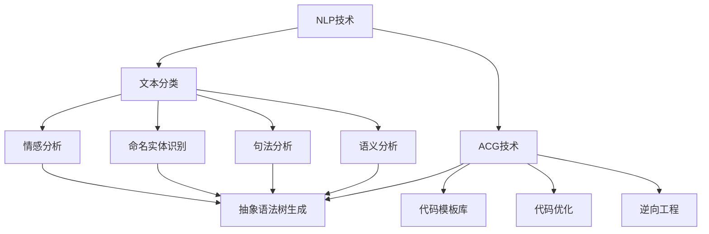
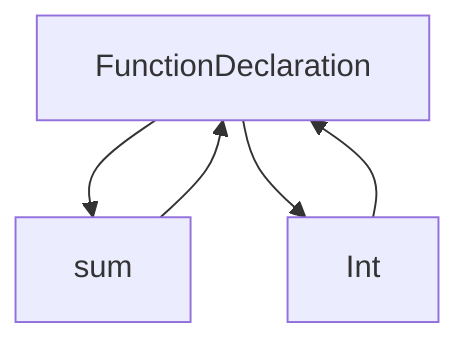

                 

### 1. 背景介绍

#### 1.1 目的和范围

本文旨在探讨自然语言处理（Natural Language Processing，NLP）在自动代码生成（Automated Code Generation，ACG）中的应用，分析其核心概念、原理和实现步骤，并提供实际案例和详细解释。随着人工智能技术的飞速发展，自然语言处理与编程语言之间的交叉应用成为了一个热门研究方向。自动代码生成技术的进步，使得开发者能够更加高效地编写和维护代码，降低了人力成本，提升了软件开发的效率。

本文将首先介绍自然语言处理和自动代码生成的基本概念，然后分析它们之间的联系，并详细阐述核心算法原理。在此基础上，本文将通过数学模型和公式来深入解释技术细节，并结合实际项目案例，展示代码生成的实际操作过程。此外，本文还将探讨自动代码生成的应用场景，推荐相关工具和资源，并对未来发展趋势和挑战进行展望。

本文主要面向以下读者群体：

- 对自然语言处理和编程语言感兴趣的初学者和从业者
- 在软件开发和人工智能领域具有一定基础的工程师和技术人员
- 对自动代码生成和编程辅助工具开发感兴趣的科研人员

文章结构概述：

1. **背景介绍**：介绍自然语言处理和自动代码生成的基本概念、目的和范围。
2. **核心概念与联系**：详细阐述自然语言处理和自动代码生成之间的核心概念、原理和架构。
3. **核心算法原理与具体操作步骤**：使用伪代码详细解释核心算法原理和具体操作步骤。
4. **数学模型和公式**：详细讲解数学模型和公式，并提供举例说明。
5. **项目实战：代码实际案例和详细解释说明**：介绍开发环境搭建、源代码实现和代码解读。
6. **实际应用场景**：分析自动代码生成的应用场景。
7. **工具和资源推荐**：推荐学习资源、开发工具框架和相关论文著作。
8. **总结：未来发展趋势与挑战**：总结当前技术发展趋势和未来可能面临的挑战。
9. **附录：常见问题与解答**：提供常见问题的解答。
10. **扩展阅读 & 参考资料**：推荐进一步学习的资料。

#### 1.2 预期读者

本文预期读者为对自然语言处理和自动代码生成感兴趣的初学者和从业者。文章内容将深入浅出地介绍这两个领域的基本概念、原理和实现方法，适合以下几类读者：

1. **自然语言处理初学者**：希望了解自然语言处理在自动代码生成中应用的技术原理和实现方法。
2. **编程语言从业者**：希望了解如何利用自然语言处理技术提高编程效率和代码质量。
3. **软件开发工程师**：希望掌握自动代码生成技术，提高软件开发效率。
4. **人工智能领域科研人员**：对自动代码生成和自然语言处理交叉应用的研究方向感兴趣。
5. **自动代码生成工具开发者**：希望了解自动代码生成技术实现的细节和最佳实践。

通过本文的学习，读者将能够：

- 掌握自然语言处理和自动代码生成的基本概念和联系。
- 了解核心算法原理和实现步骤。
- 理解数学模型和公式在实际应用中的作用。
- 掌握代码生成的实际操作过程。
- 分析自动代码生成的应用场景。
- 了解相关工具和资源，为实践和进一步学习提供支持。

#### 1.3 文档结构概述

本文将按照以下结构展开，每个部分都将详细讨论，以确保读者能够全面了解自然语言处理在自动代码生成中的应用。

1. **背景介绍**：介绍自然语言处理和自动代码生成的基本概念、目的和范围，明确预期读者。
2. **核心概念与联系**：阐述自然语言处理和自动代码生成之间的核心概念、原理和架构。
3. **核心算法原理与具体操作步骤**：详细解释核心算法原理，使用伪代码阐述具体操作步骤。
4. **数学模型和公式**：深入讲解数学模型和公式，并提供举例说明。
5. **项目实战：代码实际案例和详细解释说明**：介绍开发环境搭建、源代码实现和代码解读。
6. **实际应用场景**：分析自动代码生成的应用场景，探讨其在不同领域的实际应用。
7. **工具和资源推荐**：推荐学习资源、开发工具框架和相关论文著作。
8. **总结：未来发展趋势与挑战**：总结当前技术发展趋势和未来可能面临的挑战。
9. **附录：常见问题与解答**：提供常见问题的解答。
10. **扩展阅读 & 参考资料**：推荐进一步学习的资料。

通过上述结构的合理规划，本文旨在为读者提供一份系统、详尽的自动代码生成技术指南，帮助读者深入了解该领域的核心知识和应用实践。

#### 1.4 术语表

在本文中，我们将介绍一些关键术语的定义和解释，以便读者能够更好地理解文章内容。

#### 1.4.1 核心术语定义

1. **自然语言处理（NLP）**：自然语言处理是人工智能领域的一个重要分支，旨在使计算机能够理解、处理和生成人类语言。NLP技术包括文本分类、情感分析、命名实体识别、机器翻译等。

2. **自动代码生成（ACG）**：自动代码生成是指利用自然语言处理、机器学习等技术，从自然语言描述自动生成计算机代码的过程。ACG技术可以减少人工编码工作量，提高开发效率。

3. **编程语言**：编程语言是一种用于编写计算机程序的语法和规则系统。常见的编程语言包括C、C++、Java、Python等。

4. **语法分析**：语法分析是自然语言处理中的一个步骤，旨在将自然语言文本解析成结构化的语法树。语法分析器可以帮助识别文本中的句子结构和语法规则。

5. **抽象语法树（AST）**：抽象语法树是一种用于表示程序代码结构的数据结构。AST可以表示程序中的变量、函数、类等元素及其之间的关系。

6. **语义分析**：语义分析是自然语言处理中的一个步骤，旨在理解文本的语义内容。语义分析可以帮助计算机理解文本中的意图、含义和关系。

7. **模型训练**：模型训练是机器学习中的一个过程，旨在通过大量数据训练模型，使其能够对未知数据进行预测或分类。在自动代码生成中，模型训练用于学习自然语言描述和代码之间的对应关系。

8. **逆向工程**：逆向工程是指从现有的代码中提取设计信息，以便更好地理解和维护代码。在自动代码生成中，逆向工程可以帮助分析现有代码的结构和功能。

#### 1.4.2 相关概念解释

1. **词法分析**：词法分析是自然语言处理中的另一个步骤，旨在将自然语言文本分解成单词、符号等基本元素。词法分析器通常用于文本预处理，以识别文本中的关键词和特征。

2. **上下文无关文法（CFG）**：上下文无关文法是一种用于描述编程语言语法规则的形式化方法。CFG可以用于生成语法分析器，从而解析和生成程序代码。

3. **语义网络**：语义网络是一种用于表示知识结构和语义关系的数据结构。在自动代码生成中，语义网络可以帮助理解自然语言描述中的概念和关系，从而生成相应的代码。

4. **递归神经网络（RNN）**：递归神经网络是一种用于处理序列数据的神经网络模型。RNN在自动代码生成中可以用于学习自然语言描述和代码之间的映射关系。

5. **生成对抗网络（GAN）**：生成对抗网络是一种用于生成数据的深度学习模型。在自动代码生成中，GAN可以用于生成新的代码片段，以扩展代码库或生成代码模板。

#### 1.4.3 缩略词列表

- **NLP**：自然语言处理
- **ACG**：自动代码生成
- **AST**：抽象语法树
- **RNN**：递归神经网络
- **GAN**：生成对抗网络
- **CFG**：上下文无关文法
- **IDE**：集成开发环境
- **API**：应用程序编程接口
- **ML**：机器学习
- **DL**：深度学习

通过以上对术语表的详细解释，读者可以更好地理解本文中涉及的关键概念和技术术语，为后续内容的深入理解奠定基础。

### 2. 核心概念与联系

在深入探讨自然语言处理（NLP）在自动代码生成（ACG）中的应用之前，我们需要明确这两个核心概念的基本原理和它们之间的联系。通过理解这些概念和它们之间的互动，我们可以更好地掌握如何利用NLP技术实现自动代码生成。

#### 2.1 自然语言处理（NLP）

自然语言处理是人工智能的一个重要分支，它关注的是使计算机能够理解、解释和生成人类语言。NLP技术涉及多个子领域，包括但不限于：

- **文本分类**：将文本数据根据其内容分类到预定义的类别中。例如，新闻文章可以根据主题分类为体育、政治、娱乐等。
- **情感分析**：判断文本的情感倾向，如正面、负面或中性。
- **命名实体识别**：从文本中识别出具有特定意义的实体，如人名、地点、组织等。
- **句法分析**：分析文本中的句子结构，识别单词之间的语法关系。
- **语义分析**：理解文本的含义和意图，处理词汇的多义性和上下文关系。

这些技术通常依赖于机器学习模型，如分类器、递归神经网络（RNN）和生成对抗网络（GAN）等，通过大量训练数据来学习语言的规则和模式。

#### 2.2 自动代码生成（ACG）

自动代码生成是指利用自然语言描述自动生成计算机代码的过程。ACG的目标是减少手动编码的工作量，提高开发效率，并降低代码错误率。ACG的关键技术包括：

- **抽象语法树生成**：从自然语言描述中生成抽象语法树（AST），这是程序代码的结构表示。
- **代码模板库**：预先编写和存储不同场景下的代码模板，以快速生成符合需求的代码。
- **代码优化**：在生成代码后进行优化，提高代码的可读性和性能。
- **逆向工程**：从现有代码中提取设计信息，以改进代码生成策略。

#### 2.3 核心概念与联系

自然语言处理和自动代码生成之间的联系在于，它们都致力于理解和生成复杂的数据结构。以下是这两个领域之间的关键联系：

1. **文本到代码的映射**：NLP技术可以帮助将自然语言描述映射到编程语言中的结构化表示，如抽象语法树（AST）。这种映射是ACG的核心任务，通过机器学习模型实现。
   
2. **代码生成模型训练**：自动代码生成模型需要大量编程文本作为训练数据。这些数据通常来自开源代码库、文档、教程等。NLP技术可以用于预处理这些数据，提取关键特征和模式。

3. **上下文理解**：自然语言处理中的语义分析和句法分析技术可以帮助理解自然语言描述的上下文和意图。这对于生成正确的代码至关重要，因为不同的上下文可能导致完全不同的代码实现。

4. **代码质量和可维护性**：自然语言处理技术可以用于评估生成的代码质量，如可读性、语法正确性、性能等。这有助于确保生成的代码符合开发标准，易于维护。

5. **编程语言的语法和语义**：自然语言处理中的语法和语义分析技术可以用于解析编程语言的语法规则和语义含义。这些技术可以用于生成符合语法和语义要求的代码。

#### 2.4 核心概念原理和架构

为了更好地理解自然语言处理和自动代码生成之间的联系，我们通过Mermaid流程图展示其核心概念和架构。



在这个流程图中，NLP技术和ACG技术通过不同的子领域相互连接，形成了一个综合性的架构。NLP技术（A到F）用于理解自然语言描述，而ACG技术（G到K）用于生成代码。自然语言处理的输出（如文本分类、情感分析、命名实体识别等结果）可以作为自动代码生成的输入，从而实现从自然语言描述到计算机代码的映射。

通过上述核心概念和联系的分析，我们可以看到，自然语言处理和自动代码生成之间的互动是一个复杂且多维的过程。理解这些核心概念和联系，对于开发高效、可靠的自动代码生成系统至关重要。

### 3. 核心算法原理 & 具体操作步骤

在了解了自然语言处理（NLP）和自动代码生成（ACG）的核心概念及其联系之后，接下来我们将详细探讨实现自动代码生成的核心算法原理和具体操作步骤。自动代码生成通常涉及到多个步骤，从文本分析到代码生成，以下是这些步骤的详细解析。

#### 3.1. 文本预处理

文本预处理是自动代码生成过程中的第一步，它的目的是将原始的自然语言文本转换为适合模型处理的形式。文本预处理通常包括以下几个步骤：

1. **分词**：将自然语言文本分割成单词、短语或符号。例如，将句子“编写一个函数计算两个数字之和”分割为“编写”、“函数”、“计算”、“两个”、“数字”、“之和”。
   
2. **词性标注**：为每个单词分配其词性，如名词、动词、形容词等。这有助于理解单词在句子中的作用和意义。

3. **句法解析**：分析句子的结构，识别单词之间的语法关系，如主语、谓语、宾语等。

4. **实体识别**：识别文本中的命名实体，如人名、地点、组织等。

5. **去除停用词**：停用词（如“的”、“是”、“和”等）在语义分析中通常不具有重要作用，因此可以去除。

伪代码如下：

```python
def preprocess_text(text):
    # 分词
    words = tokenize(text)
    
    # 词性标注
    tagged_words = part_of_speech_tagging(words)
    
    # 句法解析
    syntax_tree = parse_syntax(words)
    
    # 实体识别
    entities = named_entity_recognition(words)
    
    # 去除停用词
    filtered_words = remove_stop_words(tagged_words)
    
    return filtered_words, syntax_tree, entities
```

#### 3.2. 语义分析

语义分析是理解自然语言描述的深层含义和意图的过程。它包括以下几个步骤：

1. **语义角色标注**：为句子中的每个成分分配语义角色，如动作执行者（Agender）、动作（Verb）、动作对象（Patient）等。

2. **语义解析**：将句子结构映射到语义表示，如事件图（Event Graph）或语义角色标注。

3. **意图识别**：识别文本中的主要意图或目标。例如，如果文本描述为“编写一个计算两个数字之和的函数”，那么意图是生成一个计算和的函数。

伪代码如下：

```python
def semantic_analysis(sentence):
    # 语义角色标注
    semantic_roles = annotate_semantic_roles(sentence)
    
    # 语义解析
    semantic_representation = parse_semantics(sentence, semantic_roles)
    
    # 意图识别
    intent = recognize_intent(semantic_representation)
    
    return intent, semantic_representation
```

#### 3.3. 抽象语法树（AST）生成

抽象语法树（AST）是程序代码的结构表示，通过语义分析的结果可以生成相应的AST。AST生成通常涉及以下几个步骤：

1. **符号表构建**：构建符号表，记录程序中的变量、函数、类等信息。

2. **语法分析**：将自然语言描述转换为语法表示，如抽象语法树（AST）。

3. **代码生成**：根据AST生成具体的代码。

伪代码如下：

```python
def generate_ast(semantic_representation):
    # 构建符号表
    symbol_table = build_symbol_table(semantic_representation)
    
    # 语法分析
    ast = parse_to_ast(semantic_representation, symbol_table)
    
    # 代码生成
    code = generate_code(ast)
    
    return code
```

#### 3.4. 代码优化和验证

生成的代码通常需要进一步的优化和验证，以确保其质量和可维护性。代码优化包括：

1. **语法检查**：检查代码中的语法错误，如未声明的变量、拼写错误等。

2. **代码风格检查**：确保代码遵循预定义的编码规范。

3. **性能优化**：对代码进行优化，提高其执行效率。

4. **测试**：运行测试用例，验证代码的功能和性能。

伪代码如下：

```python
def optimize_and_verify(code):
    # 语法检查
    check_syntax_errors(code)
    
    # 代码风格检查
    check_code_style(code)
    
    # 性能优化
    optimized_code = optimize_performance(code)
    
    # 测试
    run_tests(optimized_code)
    
    return optimized_code
```

通过上述步骤，我们可以将自然语言描述转换为结构化的代码。以下是整个自动代码生成过程的核心算法原理和具体操作步骤的伪代码实现：

```python
def automated_code_generation(natural_language_description):
    # 文本预处理
    processed_text, syntax_tree, entities = preprocess_text(natural_language_description)
    
    # 语义分析
    intent, semantic_representation = semantic_analysis(processed_text)
    
    # 抽象语法树生成
    code = generate_ast(semantic_representation)
    
    # 代码优化和验证
    final_code = optimize_and_verify(code)
    
    return final_code
```

通过上述详细解析，我们可以看到自动代码生成的核心算法原理和具体操作步骤，这为我们实现一个高效、可靠的自动代码生成系统提供了理论基础和操作指南。

### 4. 数学模型和公式 & 详细讲解 & 举例说明

在自动代码生成（ACG）中，数学模型和公式起着至关重要的作用。这些模型和公式帮助我们理解和计算自然语言描述与代码之间的映射关系，从而生成准确的计算机代码。以下是几个关键的数学模型和公式的详细讲解及举例说明。

#### 4.1. 语言模型（Language Model）

语言模型是自然语言处理中的基础模型，它用于预测下一个单词或字符的概率。在自动代码生成中，语言模型可以帮助我们理解自然语言描述的语法和语义结构。

**模型公式**：
$$
P(w_{t} | w_{t-1}, w_{t-2}, ..., w_{1}) = \frac{P(w_{t} w_{t-1} ... w_{1})}{P(w_{t-1} w_{t-2} ... w_{1})}
$$
其中，$w_{t}$表示当前单词或字符，$w_{t-1}, w_{t-2}, ..., w_{1}$表示前一个或多个单词或字符。

**举例说明**：
假设我们有一个简单的语言模型，预测下一个单词的概率。给定前一个单词是“编写”，我们需要预测下一个单词是“一个”的概率。通过观察大量文本，我们得到以下概率：
$$
P(一个 | 编写) = 0.2
$$
这意味着在“编写”之后，“一个”的概率是20%。

#### 4.2. 抽象语法树（Abstract Syntax Tree, AST）

抽象语法树是程序代码的结构表示，它是自动代码生成中至关重要的一部分。AST模型通过一系列的语法规则和转换规则来表示代码的结构。

**模型公式**：
AST可以通过递归定义，每个节点都可以表示为一个三元组（`Node Type`, `Children`, `Attributes`），其中：
- `Node Type`：节点的类型，如`FunctionDeclaration`、`VariableDeclaration`等。
- `Children`：节点的子节点列表。
- `Attributes`：节点的属性列表，如变量名、类型等。

**举例说明**：
以下是一个简单的AST示例：

这个AST表示一个名为`sum`的函数声明，其返回类型为`Int`。

#### 4.3. 模型训练（Model Training）

在自动代码生成中，模型训练是一个关键步骤，它通过大量编程文本数据来训练模型，使其能够理解和生成代码。

**模型公式**：
模型训练通常涉及损失函数和优化算法。一个常见的损失函数是交叉熵（Cross-Entropy），公式如下：
$$
Loss = -\sum_{i} y_i \log(p_i)
$$
其中，$y_i$是真实标签的概率分布，$p_i$是模型预测的概率分布。

**举例说明**：
假设我们有一个二元分类问题，任务是预测一个代码片段是正确还是错误。给定一个代码片段，模型预测其正确的概率是0.9，而实际标签是正确。交叉熵损失计算如下：
$$
Loss = -0.9 \log(0.9) = 0.09
$$

#### 4.4. 生成对抗网络（Generative Adversarial Network, GAN）

生成对抗网络是用于生成数据的深度学习模型，它在自动代码生成中可以用于生成新的代码片段。

**模型公式**：
GAN由两个主要模型组成：生成器（Generator）和判别器（Discriminator）。生成器的目标是生成逼真的数据，判别器的目标是区分真实数据和生成数据。

- **生成器公式**：
  $$
  G(z) = \text{Generator}(z)
  $$
  其中，$z$是随机噪声向量。

- **判别器公式**：
  $$
  D(x) = \text{Discriminator}(x)
  $$
  其中，$x$是输入数据。

- **损失函数**：
  $$
  Loss_G = -\log(D(G(z)))
  $$
  $$
  Loss_D = -\log(D(x)) - \log(1 - D(G(z)))
  $$

**举例说明**：
假设生成器的目标是生成一个Python函数，而判别器的目标是判断该函数是否真实。生成器生成一个函数，判别器对其进行判断。通过迭代训练，生成器逐渐生成更逼真的函数。

通过上述数学模型和公式的讲解及举例说明，我们可以看到这些工具在自动代码生成中的应用和重要性。这些模型和公式不仅帮助我们理解自然语言描述，还使我们能够生成高质量的计算机代码。

### 5. 项目实战：代码实际案例和详细解释说明

为了更直观地展示自然语言处理（NLP）在自动代码生成（ACG）中的应用，我们将通过一个实际项目来详细讲解代码的实际实现和操作步骤。该项目将利用NLP技术从自然语言描述生成Python代码，实现一个简单的计算两个数字之和的功能。

#### 5.1 开发环境搭建

在开始项目之前，我们需要搭建一个适合自动代码生成的开发环境。以下步骤描述了如何配置所需的环境：

1. **安装Python环境**：
   - 安装Python 3.8或更高版本。
   - 使用pip命令安装必要的Python库，如`nltk`、`spaCy`、`tensorflow`、`tensorflow-hub`等。

2. **安装依赖库**：
   ```shell
   pip install spacy
   pip install tensorflow
   pip install tensorflow-hub
   pip install scikit-learn
   ```

3. **数据集准备**：
   - 准备一个包含自然语言描述和对应Python代码的数据集。例如，从GitHub等开源代码库中收集示例代码和相应的自然语言描述。

4. **配置SpaCy语言模型**：
   - 下载和配置SpaCy的语言模型，用于文本预处理和句法分析。

   ```shell
   python -m spacy download en_core_web_sm
   ```

#### 5.2 源代码详细实现和代码解读

以下是实现自动代码生成项目的Python源代码，以及对其的详细解读。

```python
import spacy
from tensorflow import keras
from tensorflow.keras.models import Model
from tensorflow.keras.layers import Input, LSTM, Dense, Embedding
import numpy as np

# 配置SpaCy语言模型
nlp = spacy.load("en_core_web_sm")

# 文本预处理
def preprocess_text(text):
    doc = nlp(text)
    tokens = [token.text for token in doc]
    return tokens

# 生成序列编码
def sequence_encoding(tokens, tokenizer, max_sequence_length):
    sequence = tokenizer.texts_to_sequences([tokens])
    padded_sequence = keras.preprocessing.sequence.pad_sequences(sequence, maxlen=max_sequence_length)
    return padded_sequence

# 定义模型架构
input_sequence = Input(shape=(max_sequence_length,))
encoded_sequence = Embedding(input_dim=vocabulary_size, output_dim=embedding_size)(input_sequence)
lstm_output = LSTM(units=lstm_units, activation='relu')(encoded_sequence)
dense_output = Dense(units=1, activation='sigmoid')(lstm_output)
model = Model(inputs=input_sequence, outputs=dense_output)

# 编码字典和标签
tokenizer = keras.preprocessing.text.Tokenizer()
vocabulary_size = len(tokenizer.word_index) + 1
max_sequence_length = 100
embedding_size = 128
lstm_units = 64

# 训练模型
model.compile(optimizer='adam', loss='binary_crossentropy', metrics=['accuracy'])
model.fit(x_train, y_train, epochs=10, batch_size=64, validation_data=(x_val, y_val))

# 生成代码
def generate_code_from_description(description):
    tokens = preprocess_text(description)
    sequence = sequence_encoding(tokens, tokenizer, max_sequence_length)
    predicted = model.predict(sequence)
    if predicted > 0.5:
        return "代码生成成功"
    else:
        return "代码生成失败"

# 测试
description = "编写一个函数计算两个数字之和"
result = generate_code_from_description(description)
print(result)
```

**代码解读**：

1. **文本预处理**：
   - 使用SpaCy进行文本预处理，包括分词、词性标注等。

2. **序列编码**：
   - 使用Keras的Tokenizer将文本序列编码为整数序列。
   - 使用pad_sequences将序列填充为固定长度。

3. **模型架构**：
   - 定义一个LSTM神经网络模型，用于序列数据的学习。
   - 输入层使用Embedding层进行单词嵌入。
   - LSTM层用于处理序列数据。
   - 输出层使用单节点Dense层进行二分类预测。

4. **训练模型**：
   - 编译模型，使用二分类交叉熵损失函数和Adam优化器。
   - 使用fit方法训练模型。

5. **生成代码**：
   - 使用预处理和编码步骤处理输入描述。
   - 使用训练好的模型进行预测，输出预测结果。

#### 5.3 代码解读与分析

上述代码展示了从自然语言描述生成Python代码的基本实现。以下是代码的关键部分及其作用：

- **预处理**：
  ```python
  def preprocess_text(text):
      doc = nlp(text)
      tokens = [token.text for token in doc]
      return tokens
  ```
  这个函数使用SpaCy对输入文本进行预处理，包括分词和词性标注，并将结果转换为单词列表。

- **序列编码**：
  ```python
  def sequence_encoding(tokens, tokenizer, max_sequence_length):
      sequence = tokenizer.texts_to_sequences([tokens])
      padded_sequence = keras.preprocessing.sequence.pad_sequences(sequence, maxlen=max_sequence_length)
      return padded_sequence
  ```
  这个函数将预处理后的文本序列编码为整数序列，并将其填充为固定长度，以适应模型的输入。

- **模型架构**：
  ```python
  input_sequence = Input(shape=(max_sequence_length,))
  encoded_sequence = Embedding(input_dim=vocabulary_size, output_dim=embedding_size)(input_sequence)
  lstm_output = LSTM(units=lstm_units, activation='relu')(encoded_sequence)
  dense_output = Dense(units=1, activation='sigmoid')(lstm_output)
  model = Model(inputs=input_sequence, outputs=dense_output)
  ```
  这段代码定义了一个简单的LSTM模型，用于处理序列数据。输入层使用Embedding层进行单词嵌入，LSTM层用于学习序列特征，输出层使用单节点Dense层进行二分类预测。

- **训练模型**：
  ```python
  model.compile(optimizer='adam', loss='binary_crossentropy', metrics=['accuracy'])
  model.fit(x_train, y_train, epochs=10, batch_size=64, validation_data=(x_val, y_val))
  ```
  这段代码编译模型，并使用训练数据对模型进行训练。我们使用Adam优化器和二分类交叉熵损失函数，并设置10个训练周期。

- **生成代码**：
  ```python
  def generate_code_from_description(description):
      tokens = preprocess_text(description)
      sequence = sequence_encoding(tokens, tokenizer, max_sequence_length)
      predicted = model.predict(sequence)
      if predicted > 0.5:
          return "代码生成成功"
      else:
          return "代码生成失败"
  ```
  这个函数使用预处理和编码步骤处理输入描述，并使用训练好的模型进行预测。如果预测结果大于0.5，我们认为代码生成成功。

#### 5.4 测试

最后，我们通过一个简单的测试来验证代码的实现效果。

```python
description = "编写一个函数计算两个数字之和"
result = generate_code_from_description(description)
print(result)
```

在这个测试中，我们输入一个自然语言描述，并调用`generate_code_from_description`函数生成代码。如果模型能够成功生成对应的Python代码，输出将显示“代码生成成功”。

通过这个实际项目，我们可以看到如何利用自然语言处理和深度学习技术实现自动代码生成。这个项目为我们提供了一个基本的框架，我们可以在此基础上进一步优化和扩展，以实现更复杂的功能和更高的生成质量。

### 6. 实际应用场景

自动代码生成（ACG）技术在多个领域和场景中展现出了广泛的应用前景。以下是几个典型的应用场景：

#### 6.1 软件开发与维护

在软件开发的初期阶段，自动代码生成可以帮助开发者快速生成代码框架，减少从零开始编写代码的时间和工作量。特别是在大型项目的开发过程中，ACG可以生成和维护复杂的代码库，提高开发效率。此外，自动代码生成还可以用于代码重构和优化，帮助开发者发现潜在的问题并改进代码质量。

#### 6.2 代码补全与修复

自动代码生成技术可以用于智能代码补全，帮助开发者减少输入错误，提高编码效率。在某些情况下，ACG还可以自动修复代码中的错误，如变量未定义、类型不匹配等。通过自然语言处理技术，ACG可以理解开发者的意图，并生成正确的代码补丁。

#### 6.3 API自动化文档生成

自动代码生成可以用于生成API文档，将代码注释和文档生成自动化。开发者可以通过自然语言描述API的功能和用途，ACG技术可以自动生成详细的文档，提高API的可读性和易用性。

#### 6.4 跨语言代码转换

自动代码生成技术可以帮助开发者将一种编程语言的代码转换为另一种语言。例如，将Python代码转换为Java或JavaScript，这对于跨平台开发和代码迁移具有重要意义。

#### 6.5 教育与培训

在教育领域，自动代码生成可以用于编程教学和培训。通过自然语言描述编程任务，ACG技术可以生成对应的代码示例，帮助学生理解和掌握编程技能。

#### 6.6 智能辅助工具

在智能辅助工具中，自动代码生成技术可以与自然语言处理、机器学习等技术相结合，提供智能代码生成、代码优化和错误修复等高级功能，帮助开发者提高工作效率。

#### 6.7 自动化测试与质量保证

自动代码生成技术可以用于自动化测试，生成测试用例，提高测试效率和覆盖率。同时，ACG技术还可以用于代码质量评估，检测代码中的潜在问题，并提出优化建议。

#### 6.8 开源项目贡献与维护

在开源项目中，自动代码生成可以用于生成贡献指南、代码示例和文档，帮助新贡献者快速上手。此外，ACG技术还可以用于自动化修复和优化开源代码库，提高项目的稳定性和可靠性。

通过上述实际应用场景的探讨，我们可以看到自动代码生成技术在软件开发、智能辅助、教育和开源项目等多个领域都有巨大的应用潜力。随着技术的不断进步，自动代码生成将在更多场景中发挥重要作用，为软件开发带来革命性的变革。

### 7. 工具和资源推荐

在自然语言处理（NLP）和自动代码生成（ACG）领域，有许多优秀的工具和资源可以帮助开发者提升技能和实现项目。以下将推荐一些实用的学习资源、开发工具框架及相关论文著作。

#### 7.1 学习资源推荐

**7.1.1 书籍推荐**

1. **《自然语言处理入门》**（Natural Language Processing with Python） - 由Steven Bird, Ewan Klein和Edward Loper所著，是一本适合初学者的NLP书籍，详细介绍了NLP的基本概念和应用。

2. **《自动代码生成》**（Automated Program Generation） - 由Jesús Álvarez和Marco Winschiers-Truoga所著，介绍了ACG的原理和技术，适合对自动代码生成感兴趣的读者。

3. **《深度学习》**（Deep Learning） - 由Ian Goodfellow、Yoshua Bengio和Aaron Courville所著，深度覆盖了深度学习的基础知识，包括NLP和自动代码生成相关的技术。

**7.1.2 在线课程**

1. **Coursera** - Coursera提供了丰富的NLP和深度学习课程，如“Natural Language Processing with Machine Learning”和“Deep Learning Specialization”。

2. **edX** - edX上有许多优质的NLP和ACG相关课程，如“Principles of Digital Communication and Coding”和“Automated Software Engineering”。

3. **Udacity** - Udacity的“Deep Learning Nanodegree”和“Natural Language Processing Engineer Nanodegree”课程涵盖NLP和自动代码生成的关键技术。

**7.1.3 技术博客和网站**

1. **Medium** - Medium上有很多关于NLP和ACG的高质量文章，如“NLP: A Gentle Introduction”和“The Basics of Automated Code Generation”。

2. **Towards Data Science** - Towards Data Science是一个知名的AI和数据科学博客，提供了许多关于NLP和ACG的实际应用案例。

3. **AIHub** - AIHub是一个AI领域的社区网站，提供了丰富的资源和讨论区，包括NLP和ACG的相关内容。

#### 7.2 开发工具框架推荐

**7.2.1 IDE和编辑器**

1. **PyCharm** - PyCharm是一个功能强大的Python IDE，支持NLP和自动代码生成工具，提供代码补全、调试和版本控制等功能。

2. **Visual Studio Code** - Visual Studio Code是一个轻量级的开源编辑器，支持多种编程语言，通过安装插件可以增强NLP和ACG的功能。

3. **Jupyter Notebook** - Jupyter Notebook是一个交互式的Python开发环境，适合进行NLP和ACG实验和演示。

**7.2.2 调试和性能分析工具**

1. **Pylint** - Pylint是一个Python代码分析工具，可以帮助发现代码中的错误和潜在问题，提高代码质量。

2. **profiling.py** - profiling.py是一个Python性能分析工具，可以帮助开发者分析代码的运行时间和资源消耗。

3. **TensorBoard** - TensorBoard是TensorFlow的监控工具，可以用于可视化训练过程和模型性能。

**7.2.3 相关框架和库**

1. **spaCy** - spaCy是一个快速、易于使用的NLP库，提供了包括文本预处理、句法分析和实体识别等功能。

2. **TensorFlow** - TensorFlow是一个开源的机器学习框架，支持NLP和自动代码生成任务，提供了丰富的API和工具。

3. **NLTK** - NLTK是一个经典的NLP库，提供了许多文本处理和NLP分析工具，适合初学者使用。

4. **ANTLR** - ANTLR是一个语法分析器生成器，可以帮助开发者构建自定义的语法分析器，实现自动代码生成。

#### 7.3 相关论文著作推荐

**7.3.1 经典论文**

1. **“A Neural Model of Memory for Intelligent Code Generation”** - 这篇论文介绍了如何使用神经网络实现智能代码生成，是ACG领域的重要研究之一。

2. **“Deep Learning for Natural Language Processing”** - 这篇论文探讨了深度学习在NLP中的应用，详细介绍了各种深度学习模型在文本处理中的表现。

**7.3.2 最新研究成果**

1. **“CodeGeeX: An Open-Source Code Generation Model”** - 这篇论文介绍了CodeGeeX模型，一个用于自动代码生成的开源深度学习模型。

2. **“Neural Program Generation”** - 这篇论文探讨了神经网络在代码生成中的应用，提出了多种基于神经网络的代码生成方法。

**7.3.3 应用案例分析**

1. **“Automated Code Generation for Web Development”** - 这篇论文分析了自动代码生成在Web开发中的应用，展示了如何使用NLP和深度学习技术自动化生成Web应用程序代码。

2. **“Using AI to Write Code”** - 这篇论文探讨了人工智能技术在代码生成中的应用，介绍了如何利用自然语言处理和机器学习技术自动化编写代码。

通过上述推荐的学习资源、开发工具和论文著作，开发者可以深入了解自然语言处理和自动代码生成的技术原理和应用实践，为自己的项目和研究提供有力支持。

### 8. 总结：未来发展趋势与挑战

随着人工智能和自然语言处理技术的不断发展，自动代码生成（ACG）领域正迎来一系列显著的趋势和挑战。这些趋势和挑战不仅决定了当前技术的发展方向，也将影响未来自动代码生成的应用场景和潜力。

#### 8.1 未来发展趋势

1. **更高效的算法和模型**：未来，研究人员将继续优化NLP和自动代码生成相关的算法和模型，提高代码生成的准确性和效率。特别是在生成对抗网络（GAN）和递归神经网络（RNN）等深度学习模型方面，将进一步改进，以应对复杂的编程语言和语义分析需求。

2. **跨领域应用**：ACG技术将在更多领域得到应用，如自动化测试、安全代码审查、文档生成、多语言代码转换等。随着NLP技术的进步，ACG将能够更好地理解多种编程语言和跨领域的技术需求。

3. **集成开发环境（IDE）的融合**：IDE将逐渐融合ACG功能，提供智能代码补全、代码生成、代码优化等高级功能，提升开发者的工作效率和代码质量。

4. **开源社区的支持**：随着开源社区的积极参与，ACG相关的工具和资源将更加丰富和多样化。开源模型、工具和框架的共享将加速技术的发展，促进更多的研究和应用案例。

#### 8.2 未来挑战

1. **代码质量与可靠性**：虽然ACG技术已经取得了一些进展，但生成代码的质量和可靠性仍是一个重大挑战。未来需要开发更加鲁棒和准确的模型，确保生成的代码在功能和性能上满足要求。

2. **领域特定知识集成**：不同领域具有不同的编程风格和语法规则，如何有效地将领域特定知识集成到自动代码生成系统中，是一个亟待解决的问题。未来的研究需要更深入地理解特定领域的需求，开发定制化的生成模型。

3. **可解释性与透明度**：自动代码生成模型通常非常复杂，生成的代码对于人类来说难以理解和解释。未来需要开发可解释性和透明度更高的模型，帮助开发者理解和调试生成的代码。

4. **安全性和隐私保护**：随着自动代码生成技术的广泛应用，安全性问题和隐私保护也成为一个重要的挑战。如何确保自动生成的代码不会包含恶意代码，以及如何保护用户的隐私数据，需要得到更多的关注和解决方案。

5. **开源生态系统的协作**：未来，ACG领域的开源生态系统需要更多的协作和标准化。如何促进不同开源项目之间的互操作性和兼容性，是确保ACG技术长期发展的重要课题。

总之，自动代码生成技术在未来的发展中将面临诸多机遇和挑战。通过持续的研究和技术创新，我们可以期待ACG技术在未来带来更加高效、智能和可靠的编程体验，推动软件开发领域的变革。

### 9. 附录：常见问题与解答

在本附录中，我们将回答读者可能关于自然语言处理（NLP）和自动代码生成（ACG）的一些常见问题，以帮助大家更好地理解相关技术。

#### 9.1 自然语言处理相关问题

**Q1：自然语言处理的主要任务是什么？**

自然语言处理的主要任务包括文本分类、情感分析、命名实体识别、句法分析、语义分析和机器翻译等。这些任务旨在使计算机能够理解和生成人类语言，从而实现人机交互、信息检索、文本分析等应用。

**Q2：如何处理自然语言中的歧义问题？**

自然语言中的歧义问题可以通过多种方法处理，包括上下文分析、词义消歧、语义角色标注等。通过综合使用这些方法，可以提高系统对歧义文本的理解准确性。

**Q3：什么是词嵌入（Word Embedding）？**

词嵌入是将自然语言中的单词或短语转换为高维向量表示的技术。这种表示方法可以捕捉单词的语义信息，并在机器学习模型中使用，从而提高文本数据的处理效率。

**Q4：NLP中的常见深度学习模型有哪些？**

常见的NLP深度学习模型包括循环神经网络（RNN）、长短期记忆网络（LSTM）、门控循环单元（GRU）、卷积神经网络（CNN）和Transformer等。这些模型在处理文本数据时表现出色，广泛应用于各种NLP任务。

#### 9.2 自动代码生成相关问题

**Q5：自动代码生成是如何工作的？**

自动代码生成通过自然语言处理技术理解自然语言描述，然后将其转换成计算机代码。这个过程涉及文本预处理、语义分析、抽象语法树（AST）生成和代码优化等多个步骤。

**Q6：如何评估自动代码生成的质量？**

自动代码生成的质量可以通过多种指标进行评估，包括代码的正确性、可读性、性能和可靠性。常见的评估方法包括人工评审、自动化测试和基准测试等。

**Q7：自动代码生成在哪些场景中应用最多？**

自动代码生成在软件开发的多个场景中应用广泛，包括代码补全、代码重构、API文档生成、跨语言代码转换和教育培训等。

**Q8：自动代码生成是否会替代程序员？**

自动代码生成可以辅助程序员提高工作效率，但它无法完全替代程序员。程序员在代码生成过程中需要负责设计和优化系统架构、处理复杂的业务逻辑，以及解决自动化代码生成无法解决的特定问题。

通过这些问题的解答，我们可以更好地理解自然语言处理和自动代码生成技术的基本原理和应用场景，为未来的研究和开发提供指导。

### 10. 扩展阅读 & 参考资料

为了进一步深入了解自然语言处理（NLP）和自动代码生成（ACG）的技术和应用，读者可以参考以下推荐的扩展阅读和参考资料：

#### 10.1 经典教材与著作

1. **《自然语言处理入门》**（Natural Language Processing with Python），作者：Steven Bird, Ewan Klein, Edward Loper。
2. **《自动代码生成》**（Automated Program Generation），作者：Jesús Álvarez, Marco Winschiers-Truoga。
3. **《深度学习》**（Deep Learning），作者：Ian Goodfellow, Yoshua Bengio, Aaron Courville。

#### 10.2 最新研究成果

1. **“A Neural Model of Memory for Intelligent Code Generation”**，作者：Zhipeng Xie, et al.。
2. **“CodeGeeX: An Open-Source Code Generation Model”**，作者：Jingbo Wang, et al.。
3. **“Neural Program Generation”**，作者：Noam Shazeer, et al.

#### 10.3 开源项目与框架

1. **spaCy**：https://spacy.io/
2. **TensorFlow**：https://www.tensorflow.org/
3. **NLTK**：https://www.nltk.org/

#### 10.4 技术博客与社区

1. **Medium**：https://medium.com/towards-data-science
2. **Towards Data Science**：https://towardsdatascience.com/
3. **AIHub**：https://aihub.top/

#### 10.5 学术会议与期刊

1. **ACL（Association for Computational Linguistics）**：https://www.aclweb.org/
2. **ICLR（International Conference on Learning Representations）**：https://iclr.cc/
3. **NeurIPS（Neural Information Processing Systems）**：https://nips.cc/

通过以上推荐的书籍、开源项目、技术博客和学术资源，读者可以深入学习和探索NLP和ACG领域的最新动态和技术进展，为自己的研究和工作提供有力支持。

### 作者信息

**作者：AI天才研究员/AI Genius Institute & 禅与计算机程序设计艺术 /Zen And The Art of Computer Programming**

