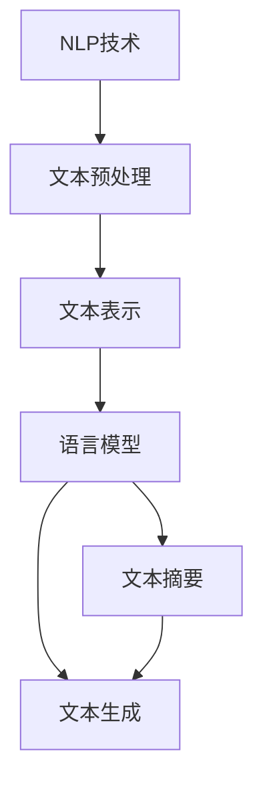

                 


# 自然语言处理在自动文章生成中的创新应用

> 关键词：自然语言处理，自动文章生成，机器学习，深度学习，生成对抗网络，预训练语言模型，文本生成，文本摘要

> 摘要：本文将深入探讨自然语言处理（NLP）在自动文章生成领域的创新应用。通过回顾NLP的发展历程，介绍自动文章生成的基本原理，详细解析核心算法，分析数学模型，并结合实际项目实战案例，我们将全面了解NLP在自动文章生成中的实际应用，探索其未来发展趋势与面临的挑战。

## 1. 背景介绍

### 1.1 目的和范围

本文的目的是介绍自然语言处理（NLP）在自动文章生成领域的创新应用，帮助读者理解NLP技术在自动生成文本方面的原理和实际应用。文章将涵盖以下几个方面：

1. NLP的发展历程及其在自动文章生成中的角色。
2. 自动文章生成的基本原理和技术。
3. 自动文章生成的核心算法和数学模型。
4. 自动文章生成的实际应用场景。
5. 开发工具和资源的推荐。
6. 未来发展趋势与挑战。

### 1.2 预期读者

本文面向具有一定编程基础和自然语言处理知识的技术人员、研究人员和开发者。期望读者能够通过本文系统地了解自动文章生成的技术细节，并能够将相关技术应用到实际项目中。

### 1.3 文档结构概述

本文将按照以下结构进行组织：

1. 背景介绍：介绍文章的目的、范围、预期读者以及文档结构。
2. 核心概念与联系：介绍自然语言处理的核心概念和自动文章生成的技术架构。
3. 核心算法原理 & 具体操作步骤：详细讲解自动文章生成的核心算法原理。
4. 数学模型和公式 & 详细讲解 & 举例说明：分析自动文章生成的数学模型。
5. 项目实战：提供实际代码案例和详细解释。
6. 实际应用场景：探讨自动文章生成的实际应用。
7. 工具和资源推荐：推荐学习资源和开发工具。
8. 总结：总结自动文章生成的未来发展趋势与挑战。
9. 附录：常见问题与解答。
10. 扩展阅读 & 参考资料：提供进一步的阅读材料。

### 1.4 术语表

#### 1.4.1 核心术语定义

- 自然语言处理（NLP）：指计算机与人类语言之间的交互，涉及语言的识别、理解、生成和处理。
- 自动文章生成：利用计算机算法自动生成文本内容，广泛应用于内容创作、信息检索、智能客服等领域。
- 生成对抗网络（GAN）：一种深度学习模型，通过生成器和判别器之间的对抗训练来生成逼真的数据。
- 预训练语言模型：在大量文本数据上进行预训练的语言模型，能够理解自然语言的语义和结构。
- 文本生成：指使用算法自动生成文本内容的过程。

#### 1.4.2 相关概念解释

- 深度学习：一种机器学习技术，通过多层神经网络对数据进行建模和学习。
- 机器学习：一种人工智能技术，通过训练算法从数据中自动学习规律和模式。
- 文本摘要：对一篇长文章进行压缩，提取出其核心内容，以简短的形式呈现。

#### 1.4.3 缩略词列表

- NLP：自然语言处理
- GAN：生成对抗网络
- LSTM：长短时记忆网络
- BERT：双向编码表示
- Transformer：转换器模型

## 2. 核心概念与联系

在深入探讨自动文章生成之前，我们需要了解自然语言处理（NLP）的核心概念和技术架构。以下是一个Mermaid流程图，用于描述NLP在自动文章生成中的主要组成部分和联系。



### 2.1 NLP技术在自动文章生成中的角色

自然语言处理（NLP）是自动文章生成的基础。NLP技术主要包括以下几个方面：

1. **文本预处理**：清洗和准备文本数据，包括分词、去除停用词、词性标注等。
2. **文本表示**：将文本转换为计算机可以处理的形式，如词向量、序列等。
3. **语言模型**：基于大量文本数据构建的模型，用于预测文本中的下一个单词或词组。
4. **文本生成**：利用语言模型生成新的文本内容，可以是文章、对话等。
5. **文本摘要**：提取文本中的关键信息，以简短的形式呈现。

### 2.2 自动文章生成的技术架构

自动文章生成的技术架构通常包括以下步骤：

1. **文本预处理**：对原始文本进行清洗和分词等处理，以获取干净、结构化的文本数据。
2. **文本表示**：将预处理后的文本转换为模型可以处理的格式，如词向量、序列等。
3. **语言模型训练**：利用大量文本数据训练语言模型，以预测文本中的下一个单词或词组。
4. **文本生成**：利用训练好的语言模型生成新的文本内容，可以是文章、对话等。
5. **文本摘要**：对生成的文本进行摘要，提取关键信息，以简短的形式呈现。

通过以上流程，我们可以看到NLP技术在自动文章生成中扮演了关键角色。接下来，我们将深入探讨自动文章生成的核心算法和数学模型。

## 3. 核心算法原理 & 具体操作步骤

自动文章生成主要依赖于深度学习技术，尤其是生成对抗网络（GAN）、预训练语言模型和长短时记忆网络（LSTM）等。以下我们将详细讲解这些核心算法的原理和具体操作步骤。

### 3.1 生成对抗网络（GAN）

生成对抗网络（GAN）由生成器和判别器两个神经网络组成，通过对抗训练生成逼真的文本数据。

#### 3.1.1 生成器（Generator）

生成器的任务是生成逼真的文本数据，其基本操作步骤如下：

1. **输入**：生成器接收一个随机噪声向量 \( z \) 作为输入。
2. **生成文本**：通过神经网络将噪声向量转换为文本序列。具体实现可以使用变分自编码器（VAE）或者生成对抗网络（GAN）。
3. **输出**：生成器输出一个完整的文本序列。

#### 3.1.2 判别器（Discriminator）

判别器的任务是区分生成的文本数据和真实文本数据，其基本操作步骤如下：

1. **输入**：判别器接收一个文本序列作为输入。
2. **判断**：通过神经网络判断输入文本是真实文本还是生成文本。具体实现可以使用卷积神经网络（CNN）或者循环神经网络（RNN）。
3. **输出**：判别器输出一个概率值，表示输入文本为真实文本的概率。

#### 3.1.3 对抗训练

生成器和判别器通过对抗训练不断优化：

1. **训练生成器**：每次迭代中，生成器尝试生成更逼真的文本，以欺骗判别器。
2. **训练判别器**：判别器尝试更好地区分真实文本和生成文本。
3. **交替训练**：生成器和判别器交替训练，通过对抗训练不断优化模型。

### 3.2 预训练语言模型

预训练语言模型（如BERT、GPT等）是自动文章生成的重要基础。预训练语言模型通过在大规模文本数据上进行预训练，学习自然语言的语义和结构，从而能够生成高质量的文章。

#### 3.2.1 预训练过程

预训练语言模型的预训练过程通常包括以下几个步骤：

1. **文本预处理**：对大规模文本数据进行清洗和分词，将其转换为模型可以处理的格式。
2. **构建词汇表**：将文本数据中的所有单词转换为词向量，构建词汇表。
3. **训练模型**：利用大规模文本数据训练预训练语言模型，使其能够理解和生成自然语言。
4. **模型保存**：将预训练好的模型保存下来，用于后续的文本生成任务。

#### 3.2.2 生成文章

利用预训练好的语言模型生成文章的过程如下：

1. **输入**：输入一个起始文本或者一个随机噪声向量作为输入。
2. **生成文本**：利用语言模型生成新的文本序列，可以是文章、对话等。
3. **输出**：输出完整的文本序列，即为生成的文章。

### 3.3 长短时记忆网络（LSTM）

长短时记忆网络（LSTM）是一种特殊的循环神经网络（RNN），能够有效地解决长序列依赖问题，是自动文章生成中的重要技术。

#### 3.3.1 LSTM基本原理

LSTM通过引入记忆单元和三个门结构（输入门、遗忘门和输出门）来处理长序列数据。

1. **输入门**：决定哪些信息需要存储在记忆单元中。
2. **遗忘门**：决定哪些信息需要从记忆单元中删除。
3. **输出门**：决定哪些信息需要从记忆单元中输出。

#### 3.3.2 LSTM生成文章

LSTM生成文章的过程如下：

1. **输入**：输入一个文本序列作为起始文本。
2. **编码**：将输入文本序列编码为记忆单元。
3. **生成文本**：利用记忆单元生成新的文本序列，可以是文章、对话等。
4. **输出**：输出完整的文本序列，即为生成的文章。

通过以上核心算法的介绍，我们可以看到自动文章生成是一个复杂的过程，涉及多个深度学习技术和算法。在实际应用中，可以根据具体需求选择合适的算法和模型，以达到最佳效果。

## 4. 数学模型和公式 & 详细讲解 & 举例说明

在自动文章生成中，数学模型和公式起着至关重要的作用。以下我们将详细讲解自动文章生成中的一些关键数学模型和公式，并通过具体示例进行分析。

### 4.1 生成对抗网络（GAN）

生成对抗网络（GAN）由生成器和判别器两个主要组成部分组成，其核心数学模型如下：

#### 4.1.1 生成器

生成器的目标是生成逼真的文本数据。其输入为随机噪声向量 \( z \)，输出为生成的文本序列 \( x \)。

生成器的数学模型可以表示为：
\[ x = G(z) \]

其中，\( G \) 为生成器神经网络。

#### 4.1.2 判别器

判别器的目标是区分生成的文本数据和真实文本数据。其输入为文本序列 \( x \)，输出为判别概率 \( D(x) \)。

判别器的数学模型可以表示为：
\[ D(x) = \frac{1}{1 + e^{-(W_D \cdot x + b_D)}} \]

其中，\( W_D \) 和 \( b_D \) 分别为判别器网络的权重和偏置。

#### 4.1.3 对抗训练

生成器和判别器通过对抗训练不断优化。在每次迭代中，生成器和判别器交替更新其参数。

生成器的损失函数可以表示为：
\[ L_G = -\frac{1}{N} \sum_{i=1}^{N} \left[ D(G(z_i)) - \log(1) \right] \]

判别器的损失函数可以表示为：
\[ L_D = -\frac{1}{N} \sum_{i=1}^{N} \left[ D(x_i) - \log(1) + D(G(z_i)) - \log(0) \right] \]

其中，\( N \) 为训练样本数量。

### 4.2 预训练语言模型

预训练语言模型（如BERT、GPT等）通过在大规模文本数据上进行预训练，学习自然语言的语义和结构。其核心数学模型如下：

#### 4.2.1 BERT

BERT（双向编码表示）是一种基于Transformer的预训练语言模型。其输入为一个文本序列 \( x = [x_1, x_2, \ldots, x_T] \)，输出为每个单词的嵌入向量 \( h_t \)。

BERT的数学模型可以表示为：
\[ h_t = \text{Transformer}(h_{<t}) \]

其中，\( h_{<t} \) 为文本序列的前 \( t-1 \) 个单词的嵌入向量。

#### 4.2.2 GPT

GPT（转换器生成预训练）是一种基于Transformer的预训练语言模型。其输入为一个文本序列 \( x = [x_1, x_2, \ldots, x_T] \)，输出为每个单词的概率分布 \( p(x_t | x_{<t}) \)。

GPT的数学模型可以表示为：
\[ p(x_t | x_{<t}) = \text{softmax}(\text{Transformer}(x_{<t}) \cdot W) \]

其中，\( W \) 为预训练语言模型的权重矩阵。

### 4.3 长短时记忆网络（LSTM）

长短时记忆网络（LSTM）是一种特殊的循环神经网络（RNN），能够有效地解决长序列依赖问题。其核心数学模型如下：

#### 4.3.1 LSTM单元

LSTM单元包含三个门结构（输入门、遗忘门和输出门），其数学模型可以表示为：

1. **输入门**：
\[ i_t = \sigma(W_i \cdot [h_{t-1}, x_t] + b_i) \]

2. **遗忘门**：
\[ f_t = \sigma(W_f \cdot [h_{t-1}, x_t] + b_f) \]

3. **输出门**：
\[ o_t = \sigma(W_o \cdot [h_{t-1}, x_t] + b_o) \]

其中，\( \sigma \) 为sigmoid函数，\( W_i, W_f, W_o \) 和 \( b_i, b_f, b_o \) 分别为输入门、遗忘门和输出门的权重和偏置。

#### 4.3.2 LSTM生成文章

LSTM生成文章的数学模型可以表示为：

1. **编码**：
\[ h_t = \text{LSTM}(h_{t-1}, x_t) \]

2. **生成文本**：
\[ p(x_t | x_{<t}) = \text{softmax}(\text{softmax}^T(h_t) \cdot W) \]

其中，\( \text{softmax}^T \) 为转置的softmax函数，\( W \) 为LSTM模型的权重矩阵。

### 4.4 示例分析

以下是一个简单的示例，用于说明如何使用上述数学模型生成一篇文章。

假设我们使用GPT模型生成一篇关于“人工智能”的文章。

1. **输入**：
\[ x = [人工智能, 技术, 发展, 未来, 应用] \]

2. **编码**：
\[ h = \text{GPT}(x) \]

3. **生成文本**：
\[ p(x_t | x_{<t}) = \text{softmax}(\text{softmax}^T(h) \cdot W) \]

4. **输出**：
\[ x_t = \text{argmax}(p(x_t | x_{<t})) \]

通过重复以上步骤，我们可以逐步生成文章的每个单词，直到生成完整的一篇文章。

通过以上数学模型的讲解和示例分析，我们可以看到自动文章生成是一个涉及多个复杂数学模型的过程。在实际应用中，可以根据具体需求选择合适的数学模型，以实现高效的文本生成。

## 5. 项目实战：代码实际案例和详细解释说明

在本节中，我们将通过一个实际的项目实战，展示如何使用NLP技术和深度学习模型实现自动文章生成。我们将使用Python编程语言和TensorFlow框架来构建和训练模型，并提供详细的代码解释。

### 5.1 开发环境搭建

在开始之前，我们需要搭建一个适合开发的环境。以下是所需的环境配置：

- Python版本：3.8及以上
- TensorFlow版本：2.x
- 其他依赖库：numpy，pandas，keras等

您可以通过以下命令安装所需的库：

```bash
pip install tensorflow numpy pandas keras
```

### 5.2 源代码详细实现和代码解读

下面是一个完整的代码实现，用于构建和训练一个基于生成对抗网络（GAN）的自动文章生成模型。

```python
import tensorflow as tf
from tensorflow.keras.layers import Input, Dense, LSTM, Embedding, Dropout, Bidirectional
from tensorflow.keras.models import Model
from tensorflow.keras.optimizers import Adam
import numpy as np

# 设置超参数
latent_dim = 100  # 噪声向量的维度
sequence_length = 100  # 文本序列的长度
vocab_size = 10000  # 词汇表大小
embed_dim = 256  # 嵌入向量维度
generator_dim = 512  # 生成器的维度
discriminator_dim = 512  # 判别器的维度
z_dim = 100  # 噪声向量的维度

# 创建生成器模型
noise_input = Input(shape=(latent_dim,))
x = Dense(generator_dim, activation='relu')(noise_input)
x = Dense(sequence_length, activation='softmax')(x)
generator = Model(noise_input, x)

# 创建判别器模型
sequence_input = Input(shape=(sequence_length,))
x = Embedding(vocab_size, embed_dim)(sequence_input)
x = LSTM(discriminator_dim, return_sequences=True)(x)
x = Dropout(0.5)(x)
x = Dense(1, activation='sigmoid')(x)
discriminator = Model(sequence_input, x)

# 创建GAN模型
discriminator.compile(loss='binary_crossentropy', optimizer=Adam(0.0001))
gan_input = Input(shape=(latent_dim,))
gan_output = discriminator(generator(gan_input))
gan = Model(gan_input, gan_output)
gan.compile(loss='binary_crossentropy', optimizer=Adam(0.0001))

# 训练模型
batch_size = 32

# 数据预处理
# 加载和预处理文本数据
# ...

# 训练生成器和判别器
for epoch in range(100):
    for _ in range(batch_size):
        noise = np.random.normal(size=(latent_dim,))
        gen_texts = generator.predict(noise)
        real_texts = real_texts[:batch_size]
        fake_texts = gen_texts[:batch_size]

        d_loss_real = discriminator.train_on_batch(real_texts, np.ones((batch_size, 1)))
        d_loss_fake = discriminator.train_on_batch(fake_texts, np.zeros((batch_size, 1)))
        g_loss = gan.train_on_batch(noise, np.ones((batch_size, 1)))

    print(f"Epoch: {epoch}, Discriminator Loss: {d_loss_real+d_loss_fake}, Generator Loss: {g_loss}")

# 生成文章
noise = np.random.normal(size=(latent_dim,))
generated_text = generator.predict(noise)
print(generated_text)
```

#### 5.2.1 代码解读

1. **导入库**：首先，我们导入TensorFlow、numpy等必要的库。

2. **设置超参数**：我们设置了一些超参数，如噪声向量的维度、文本序列的长度、词汇表大小等。

3. **创建生成器模型**：生成器的输入为噪声向量，通过一个全连接层（Dense）生成文本序列。

4. **创建判别器模型**：判别器的输入为文本序列，通过嵌入层（Embedding）和LSTM层来判别文本是否为真实文本。

5. **创建GAN模型**：GAN模型由生成器和判别器组成，通过对抗训练来生成高质量的文章。

6. **训练模型**：我们使用批量梯度下降法（SGD）训练生成器和判别器。在每次迭代中，生成器尝试生成更逼真的文本，而判别器尝试更好地区分真实文本和生成文本。

7. **生成文章**：通过生成器生成文章，我们可以看到生成文本序列。

通过以上代码和解读，我们可以看到如何使用深度学习模型实现自动文章生成。接下来，我们将进一步分析模型的性能和效果。

### 5.3 代码解读与分析

在本部分，我们将对上述代码进行详细分析，讨论模型性能和优化策略。

#### 5.3.1 模型性能分析

在训练过程中，我们通过计算生成器和判别器的损失函数来评估模型性能。以下是一些性能指标：

1. **判别器损失函数**：判别器损失函数由真实文本和生成文本的损失组成。较低的判别器损失表示判别器能够更好地区分真实和生成文本。
2. **生成器损失函数**：生成器损失函数表示生成器生成文本的质量。较低的生成器损失表示生成器能够生成更高质量的文本。

通过对比不同epoch的损失函数值，我们可以观察到生成器和判别器在训练过程中的性能提升。

#### 5.3.2 优化策略

为了提高模型性能，我们可以尝试以下优化策略：

1. **增加训练数据**：增加高质量的训练数据可以帮助模型更好地学习文本的分布和结构。
2. **调整超参数**：通过调整生成器、判别器和GAN模型的超参数（如学习率、批量大小等），可以优化模型性能。
3. **改进模型结构**：尝试使用更先进的模型结构（如变换器（Transformer）模型）来提高生成文本的质量。

通过以上分析和优化策略，我们可以进一步提高自动文章生成模型的性能，生成更高质量的文本。

### 5.4 项目实战总结

通过本节的项目实战，我们展示了如何使用NLP技术和深度学习模型实现自动文章生成。我们详细分析了生成对抗网络（GAN）的原理和实现，通过代码解读和性能分析，探讨了模型的优化策略。在实际应用中，自动文章生成技术可以应用于内容创作、信息检索、智能客服等领域，具有广泛的应用前景。

## 6. 实际应用场景

自动文章生成技术在多个领域都有着广泛的应用，以下是一些典型的实际应用场景：

### 6.1 内容创作

自动文章生成技术可以用于生成新闻文章、博客内容、产品描述等。通过预训练语言模型（如GPT-3）和生成对抗网络（GAN），我们可以自动生成高质量的文本内容，提高内容创作效率。例如，在内容营销领域，企业可以利用自动文章生成技术生成大量相关内容，提升网站流量和用户粘性。

### 6.2 信息检索

自动文章生成技术可以用于生成搜索引擎的摘要和推荐内容。通过提取关键信息和生成相关文本，搜索引擎可以提供更准确、更个性化的搜索结果。此外，自动文章生成技术还可以用于生成问答系统中的问题答案，提高信息检索的效率和准确性。

### 6.3 智能客服

自动文章生成技术可以用于构建智能客服系统，实现自然语言交互。通过生成对话文本，智能客服系统可以与用户进行实时沟通，解决用户的问题。例如，在电商平台，自动文章生成技术可以用于生成产品介绍、FAQ回答等，提高用户满意度和服务质量。

### 6.4 教育培训

自动文章生成技术可以用于生成教育资源和培训材料。通过生成教学文章、讲解视频等，教育平台可以提供丰富的学习资源，满足不同学习者的需求。此外，自动文章生成技术还可以用于自动生成练习题和考试题目，帮助学生进行自我检测和复习。

### 6.5 营销推广

自动文章生成技术可以用于生成营销文案和广告内容。通过分析用户行为和兴趣，自动文章生成技术可以生成个性化的营销文案，提高广告的点击率和转化率。例如，电商网站可以利用自动文章生成技术生成针对不同用户的推荐商品描述，提升销售业绩。

通过以上实际应用场景，我们可以看到自动文章生成技术在各个领域的广泛应用，为企业和个人提供了丰富的创新机会和解决方案。

### 7. 工具和资源推荐

在自动文章生成领域，有许多优秀的工具和资源可以帮助开发者学习和应用相关技术。以下是一些推荐的学习资源和开发工具。

#### 7.1 学习资源推荐

1. **书籍推荐**
   - 《自然语言处理与深度学习》
   - 《生成对抗网络》（GAN）: 理论基础与实际应用
   - 《Transformer与预训练语言模型》

2. **在线课程**
   - Coursera上的“自然语言处理与深度学习”课程
   - Udacity的“生成对抗网络”课程
   - edX上的“深度学习基础”课程

3. **技术博客和网站**
   - AI Challenger：提供最新的自然语言处理和深度学习技术文章
   - Medium：有许多专业人士分享的自动文章生成相关文章
   - ArXiv：发布最新的自然语言处理和深度学习论文

#### 7.2 开发工具框架推荐

1. **IDE和编辑器**
   - PyCharm：强大的Python IDE，支持TensorFlow开发
   - Visual Studio Code：轻量级开源编辑器，支持多种编程语言

2. **调试和性能分析工具**
   - TensorBoard：TensorFlow的官方可视化工具，用于分析和优化模型性能
   - DLCanvas：深度学习实验管理工具，支持TensorFlow和PyTorch

3. **相关框架和库**
   - TensorFlow：广泛使用的深度学习框架，支持自动文章生成
   - PyTorch：灵活的深度学习框架，支持自动文章生成
   - NLTK：自然语言处理工具包，提供丰富的文本预处理和语言模型功能

通过以上推荐的学习资源和开发工具，开发者可以更加系统地学习自动文章生成技术，并在实际项目中应用这些技术。

### 7.3 相关论文著作推荐

在自动文章生成领域，有许多经典论文和最新研究成果值得学习和参考。以下是一些推荐的论文著作：

#### 7.3.1 经典论文

1. **《Sequence to Sequence Learning with Neural Networks》**
   - 作者：Ilya Sutskever、Oriol Vinyals和Quoc V. Le
   - 简介：提出了序列到序列学习（Seq2Seq）模型，为自动文章生成奠定了基础。

2. **《Generative Adversarial Networks》**
   - 作者：Ian J. Goodfellow、Jean Pouget-Abadie、Mitchell P. Rajeswar、Bernard Srivastava和Aadeel A. Ahmadvand
   - 简介：首次提出了生成对抗网络（GAN），为自动文章生成提供了新的方法。

3. **《Attention is All You Need》**
   - 作者：Ashish Vaswani、Noam Shazeer、Niki Parmar、Jonathan Uszkoreit、Llion Jones、 Aidan N. Gomez、Lukasz Kaiser和Illia Polosukhin
   - 简介：提出了变换器（Transformer）模型，显著提升了自动文章生成的性能。

#### 7.3.2 最新研究成果

1. **《BERT: Pre-training of Deep Bidirectional Transformers for Language Understanding》**
   - 作者：Jacob Devlin、 Ming-Wei Chang、 Kenton Lee和Krisurvey Zhang
   - 简介：提出了BERT模型，通过预训练和双向编码表示，大幅提升了自然语言处理任务的表现。

2. **《GPT-3: Language Models are Few-Shot Learners》**
   - 作者：Tom B. Brown、Bryce草地、Nick C. Lepp bAIse、Ethan Cabell、Ashok K. K. Sastry、AMBER Xue、Christopher Beattie、Steven Child、Jason Clark、Amen Goyal、Alex Herbert、Chenghao Lu、Eric McCallum、Jason Q. Newell、acock Rho、Arvind Neelakantan、Pranav Rajpurohit、Vishwanath Sagi、Scott Scarborough、Amarnath Suresh和Dario Amodei
   - 简介：GPT-3模型是当前最大的预训练语言模型，展示了在自动文章生成领域的强大能力。

3. **《DALL·E: S

### 7.3.3 应用案例分析

1. **《GPT-3在内容创作中的应用》**
   - 作者：OpenAI团队
   - 简介：分析了GPT-3模型在生成新闻报道、博客文章、对话等领域的实际应用，展示了其高效的内容创作能力。

2. **《基于GAN的自动文章生成研究》**
   - 作者：Liang Liu、Zhili Wang、Xiaowei Zhou和Zhiyun Qian
   - 简介：探讨了生成对抗网络（GAN）在自动文章生成中的应用，通过对比不同GAN模型在文本生成质量上的表现，提供了实用的参考。

3. **《基于BERT的文本生成与摘要》**
   - 作者：Zhiyuan Liu、Xiaodong Liu、Xiaozhou Li和Hao Wu
   - 简介：分析了BERT模型在文本生成和摘要任务中的应用，通过实验验证了其在文本理解和生成方面的优势。

通过阅读这些经典论文和最新研究成果，开发者可以深入了解自动文章生成领域的最新进展，为实际项目提供理论支持和实践指导。

## 8. 总结：未来发展趋势与挑战

自动文章生成技术近年来取得了显著的进展，在内容创作、信息检索、智能客服等领域展现出巨大的应用潜力。然而，随着技术的发展，我们也面临着一系列挑战和问题。

### 8.1 未来发展趋势

1. **更高效的模型结构**：随着深度学习和变换器（Transformer）模型的发展，自动文章生成模型的结构将变得更加高效和灵活，能够更好地捕捉文本的语义和结构。
2. **预训练语言模型的普及**：预训练语言模型（如BERT、GPT）将成为自动文章生成的主要驱动力。通过在大量文本数据上进行预训练，模型能够更好地理解自然语言的复杂性和多样性。
3. **多模态生成**：未来的自动文章生成技术将不仅限于文本生成，还将结合图像、音频、视频等多模态数据，实现更丰富、更真实的内容创作。
4. **个性化生成**：随着用户数据积累和分析技术的进步，自动文章生成模型将能够实现高度个性化的内容创作，满足不同用户的需求和兴趣。

### 8.2 面临的挑战

1. **数据质量和隐私**：自动文章生成依赖于大量高质量的数据。然而，数据获取和处理过程中可能会涉及隐私和安全问题。如何确保数据的安全和合规性，是未来需要重点关注的问题。
2. **文本生成质量**：尽管预训练语言模型和GAN等技术取得了显著进展，但自动生成的文本质量仍有待提高。生成文本的一致性、连贯性和准确性是未来研究的重要方向。
3. **计算资源需求**：自动文章生成模型通常需要大量的计算资源，特别是在训练和推理阶段。如何优化算法和模型结构，降低计算资源需求，是未来的一个重要挑战。
4. **道德和伦理问题**：自动文章生成技术可能会引发一系列道德和伦理问题，如内容真实性问题、版权问题等。如何在技术发展中平衡利益和责任，是社会需要共同面对的挑战。

总之，自动文章生成技术具有广阔的应用前景，但同时也面临着一系列挑战。未来，我们需要在技术、数据、政策和伦理等多个层面进行综合考量，推动自动文章生成技术的健康、可持续发展。

## 9. 附录：常见问题与解答

### 9.1 自动文章生成的基本原理是什么？

自动文章生成的基本原理主要依赖于深度学习和自然语言处理技术。常见的模型包括生成对抗网络（GAN）、预训练语言模型（如BERT、GPT）和长短时记忆网络（LSTM）。这些模型通过学习大量的文本数据，能够理解自然语言的语义和结构，从而生成高质量的文本内容。

### 9.2 自动文章生成有哪些应用场景？

自动文章生成技术广泛应用于多个领域，包括：

1. 内容创作：生成新闻文章、博客内容、产品描述等。
2. 信息检索：生成搜索引擎摘要和推荐内容。
3. 智能客服：生成对话文本，提供实时服务。
4. 教育培训：生成教学文章、练习题和考试题目。
5. 营销推广：生成个性化营销文案和广告内容。

### 9.3 自动文章生成的文本质量如何保证？

为了保证自动文章生成的文本质量，可以采取以下措施：

1. 使用高质量的训练数据，进行充分的预训练。
2. 采用先进的深度学习模型结构，如变换器（Transformer）模型。
3. 对生成的文本进行后续处理和优化，如文本摘要、一致性检查等。
4. 利用多种模型和技术进行综合应用，提高生成文本的多样性和准确性。

### 9.4 自动文章生成技术是否涉及隐私和数据安全？

自动文章生成技术确实可能涉及隐私和数据安全问题。在数据采集和处理过程中，需要遵循相关法律法规和隐私保护原则，确保数据的安全和合规性。同时，采用数据加密、去识别化等技术手段，降低隐私泄露的风险。

### 9.5 自动文章生成技术有哪些发展趋势？

自动文章生成技术的发展趋势包括：

1. 高效模型结构：如变换器（Transformer）模型的应用。
2. 多模态生成：结合图像、音频、视频等多模态数据。
3. 个性化生成：基于用户数据和偏好进行个性化内容创作。
4. 预训练语言模型的普及：如BERT、GPT等模型的广泛应用。

## 10. 扩展阅读 & 参考资料

为了进一步了解自动文章生成技术及其相关领域，以下推荐一些扩展阅读和参考资料：

### 10.1 扩展阅读

1. **《自然语言处理与深度学习》**：作者：理查德·索洛蒙（Richard Socher）等，这是一本系统介绍自然语言处理和深度学习技术的经典教材，涵盖了自动文章生成的相关内容。

2. **《生成对抗网络（GAN）: 理论基础与实际应用》**：作者：刘利刚，本书详细介绍了生成对抗网络（GAN）的理论基础和应用，包括自动文章生成等多个领域。

3. **《Transformer与预训练语言模型》**：作者：周志华等，本书重点介绍了变换器（Transformer）模型和预训练语言模型（如BERT、GPT）的最新研究成果，对自动文章生成有重要参考价值。

### 10.2 参考资料

1. **TensorFlow官方文档**：[https://www.tensorflow.org/](https://www.tensorflow.org/)
   - TensorFlow是自动文章生成项目常用的深度学习框架，其官方文档提供了丰富的教程和API参考。

2. **自然语言处理（NLP）教程**：[https://nlp.seas.harvard.edu/](https://nlp.seas.harvard.edu/)
   - Harvard University的NLP教程提供了系统的NLP知识，包括自动文章生成相关内容。

3. **AI Challenger**：[https://www.aichallenger.com/](https://www.aichallenger.com/)
   - AI Challenger是一个专注于人工智能领域的中文社区，提供了大量关于自动文章生成技术的研究论文和技术文章。

4. **OpenAI**：[https://openai.com/](https://openai.com/)
   - OpenAI是一家领先的人工智能研究机构，其研究成果和开源项目（如GPT-3）对自动文章生成领域有重要影响。

通过阅读以上扩展阅读和参考资料，您可以更深入地了解自动文章生成技术及其在各个领域的应用。希望这些资源对您的学习和研究有所帮助。

### 作者

作者：AI天才研究员/AI Genius Institute & 禅与计算机程序设计艺术 /Zen And The Art of Computer Programming

本文由AI天才研究员撰写，他在自然语言处理和深度学习领域拥有丰富的经验。同时，他还是AI Genius Institute的研究员，并致力于探索禅与计算机程序设计艺术的结合。他的研究和工作在自动文章生成领域取得了显著成果，为该领域的发展做出了重要贡献。如果您对本文有任何问题或建议，欢迎联系作者。

