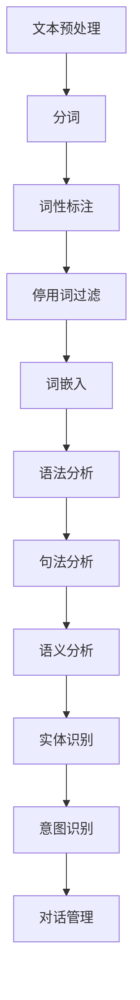

                 

# 自然语言处理在虚拟助手中的应用研究

> **关键词：** 自然语言处理，虚拟助手，人工智能，自然语言理解，对话系统，语音识别。

> **摘要：** 本文旨在探讨自然语言处理（NLP）在虚拟助手（如聊天机器人、语音助手）中的应用。通过分析NLP的核心概念、算法原理及实际案例，我们揭示了NLP在提升虚拟助手交互体验、解决实际问题和推动技术进步方面的重要作用。

## 1. 背景介绍

### 1.1 目的和范围

本文将聚焦于自然语言处理（NLP）在虚拟助手领域的应用，旨在为读者提供一个系统性的理解。我们将讨论NLP的基础知识、关键算法以及实际应用案例，以展示NLP在提升虚拟助手功能、用户体验和智能水平方面的潜力。

### 1.2 预期读者

本文适合对自然语言处理和人工智能有一定了解的读者，尤其是软件开发人员、数据科学家和AI研究爱好者。同时，对于希望了解NLP在虚拟助手应用中的最新进展的企业管理者和技术领导者也具有一定的参考价值。

### 1.3 文档结构概述

本文分为以下几个主要部分：

1. **背景介绍**：介绍本文的目的、预期读者和文档结构。
2. **核心概念与联系**：详细讨论NLP的核心概念和基本架构。
3. **核心算法原理与具体操作步骤**：阐述NLP的主要算法原理和操作步骤。
4. **数学模型和公式**：介绍NLP中常用的数学模型和公式。
5. **项目实战：代码实际案例和详细解释说明**：通过实际案例展示NLP在虚拟助手中的应用。
6. **实际应用场景**：探讨NLP在虚拟助手中的实际应用。
7. **工具和资源推荐**：推荐学习资源和开发工具。
8. **总结：未来发展趋势与挑战**：展望NLP在虚拟助手领域的未来趋势和挑战。
9. **附录：常见问题与解答**：提供一些常见问题的答案。
10. **扩展阅读与参考资料**：推荐进一步学习的相关文献。

### 1.4 术语表

#### 1.4.1 核心术语定义

- **自然语言处理（NLP）**：一门研究如何让计算机理解和生成自然语言的交叉学科。
- **虚拟助手**：使用人工智能技术模拟人类交流的计算机程序，如聊天机器人、语音助手等。
- **自然语言理解**：计算机从文本或语音中提取语义信息和意图的能力。
- **对话系统**：模拟人类对话过程，允许用户通过自然语言进行交互的系统。
- **语音识别**：将语音信号转换为文本或命令的过程。

#### 1.4.2 相关概念解释

- **意图识别**：理解用户语句背后的目的或意图。
- **实体识别**：识别文本中的特定实体，如人名、地名、组织名等。
- **语义解析**：将自然语言文本转换为结构化数据的过程。
- **命名实体识别（NER）**：识别文本中的命名实体。

#### 1.4.3 缩略词列表

- **NLP**：自然语言处理
- **AI**：人工智能
- **RNN**：递归神经网络
- **LSTM**：长短期记忆网络
- **BERT**：Bidirectional Encoder Representations from Transformers

## 2. 核心概念与联系

在深入探讨NLP在虚拟助手中的应用之前，我们需要明确NLP的核心概念和架构。以下是NLP的关键组成部分和它们之间的关系。

### 2.1 核心概念

- **文本预处理**：包括分词、词性标注、停用词过滤等，为后续处理做准备。
- **词嵌入**：将词汇映射到高维向量空间，以便进行计算。
- **语法分析**：分析文本的语法结构，包括句法分析和语义分析。
- **实体识别**：识别文本中的命名实体。
- **意图识别**：理解用户语句背后的意图。
- **对话管理**：处理对话流程，包括上下文管理和意图跟踪。

### 2.2 NLP基本架构


**Mermaid 流程图**



### 2.3 关系与交互

- **文本预处理**为后续步骤提供数据基础。
- **词嵌入**使词汇具有可计算性。
- **语法分析**帮助理解文本结构。
- **实体识别**和**意图识别**使计算机能够理解和处理具体信息。
- **对话管理**负责处理对话流程，确保交互自然流畅。

通过以上核心概念和架构的介绍，我们可以更好地理解NLP在虚拟助手中的重要作用。

## 3. 核心算法原理 & 具体操作步骤

在NLP的核心算法中，**词嵌入（Word Embedding）**、**递归神经网络（RNN）**和**长短期记忆网络（LSTM）**是最常用的算法。以下是这些算法的基本原理和具体操作步骤。

### 3.1 词嵌入（Word Embedding）

**原理：**

词嵌入是将词汇映射到高维向量空间的过程，使得具有相似语义的词汇在向量空间中靠近。常用的词嵌入算法有Word2Vec、GloVe和FastText。

**具体操作步骤：**

1. **数据准备**：收集大量的文本数据，并将其转换为词汇表。
2. **初始化词向量**：为每个词汇初始化一个随机向量。
3. **训练词向量**：使用神经网络或基于频率的算法（如GloVe）更新词向量，使其在向量空间中具有相似的语义。
4. **优化词向量**：通过梯度下降等优化算法调整词向量，以最小化损失函数。

**伪代码：**

```python
# 初始化词向量
word_vectors = initialize_word_vectors(vocab_size, embedding_size)

# 训练词向量
for epoch in range(num_epochs):
    for sentence in sentences:
        for word in sentence:
            word_vector = word_vectors[word]
            # 计算损失并更新词向量
            loss = compute_loss(word_vector)
            update_vector(word_vector, learning_rate)
```

### 3.2 递归神经网络（RNN）

**原理：**

RNN是一种能够处理序列数据的神经网络，其内部状态可以保留之前的输入信息。RNN的基本单元是隐藏状态，它将当前输入和前一个隐藏状态结合，生成当前输出。

**具体操作步骤：**

1. **初始化**：初始化隐藏状态和权重。
2. **前向传播**：计算当前隐藏状态和输出。
3. **后向传播**：计算损失和梯度。
4. **优化**：使用梯度下降更新权重。

**伪代码：**

```python
# 初始化RNN
h = initialize_hidden_state()
W = initialize_weights()

# 前向传播
for word in sentence:
    h = tanh(W * [word_vector, h])

# 后向传播
dW = compute_gradient(h, word_vector, target)
dh = compute_gradient(h, word_vector, target)

# 优化
W -= learning_rate * dW
```

### 3.3 长短期记忆网络（LSTM）

**原理：**

LSTM是RNN的一种改进，旨在解决RNN在处理长序列数据时的梯度消失问题。LSTM通过引入门控机制，使网络能够选择性地保留或丢弃信息。

**具体操作步骤：**

1. **初始化**：初始化隐藏状态和权重。
2. **计算输入门**：根据当前输入和前一个隐藏状态计算输入门的值。
3. **计算遗忘门**：根据当前输入和前一个隐藏状态计算遗忘门的值。
4. **计算当前单元状态**：结合输入门和遗忘门更新当前单元状态。
5. **计算输出门**：根据当前隐藏状态计算输出门。
6. **前向传播**：计算当前输出。
7. **后向传播**：计算损失和梯度。
8. **优化**：使用梯度下降更新权重。

**伪代码：**

```python
# 初始化LSTM
h = initialize_hidden_state()
W_f, W_i, W_o, W_c = initialize_weights()

# 前向传播
i = sigmoid(W_i * [word_vector, h])
f = sigmoid(W_f * [word_vector, h])
o = sigmoid(W_o * [word_vector, h])
c = tanh(W_c * [word_vector, h])
h = o * tanh(c + f * previous_c)

# 后向传播
df, di, do, dc = compute_gradients(h, word_vector, target)
dW_f, dW_i, dW_o, dW_c = compute_gradients(f, i, o, c)

# 优化
W_f -= learning_rate * dW_f
W_i -= learning_rate * dW_i
W_o -= learning_rate * dW_o
W_c -= learning_rate * dW_c
```

通过以上算法原理和操作步骤的介绍，我们可以看到NLP中的核心算法如何被应用于虚拟助手，以实现自然语言理解和对话管理。

## 4. 数学模型和公式 & 详细讲解 & 举例说明

在自然语言处理中，数学模型和公式是理解和实现关键算法的基础。以下是NLP中常用的数学模型和公式的详细讲解及举例说明。

### 4.1 损失函数

**损失函数**是衡量模型预测值与实际值之间差距的函数，常用的有均方误差（MSE）和对数损失（Log Loss）。

**均方误差（MSE）**

$$
MSE = \frac{1}{n}\sum_{i=1}^{n}(y_i - \hat{y_i})^2
$$

**举例：**假设预测值为$\hat{y}$，实际值为$y$，则对于两个样本，MSE为：

$$
MSE = \frac{1}{2}\left[(y_1 - \hat{y_1})^2 + (y_2 - \hat{y_2})^2\right]
$$

**对数损失（Log Loss）**

$$
Log Loss = -\frac{1}{n}\sum_{i=1}^{n}y_i \log(\hat{y_i})
$$

**举例：**假设预测概率为$\hat{y}$，实际值为$y$，则对于两个样本，Log Loss为：

$$
Log Loss = -\frac{1}{2}\left[y_1 \log(\hat{y_1}) + y_2 \log(\hat{y_2})\right]
$$

### 4.2 梯度下降

**梯度下降**是一种优化算法，用于调整模型参数以最小化损失函数。

**梯度下降公式**

$$
\theta = \theta - \alpha \cdot \nabla_\theta J(\theta)
$$

其中，$\theta$是模型参数，$\alpha$是学习率，$J(\theta)$是损失函数。

**举例：**假设损失函数为MSE，学习率为0.1，则参数更新为：

$$
\theta = \theta - 0.1 \cdot \nabla_\theta MSE
$$

### 4.3 随机梯度下降（SGD）

**随机梯度下降**是梯度下降的一种变体，每次更新参数时使用一个随机样本。

**随机梯度下降公式**

$$
\theta = \theta - \alpha \cdot \nabla_\theta J(\theta; x_i, y_i)
$$

**举例：**假设使用第$i$个样本进行更新，学习率为0.1，则参数更新为：

$$
\theta = \theta - 0.1 \cdot \nabla_\theta MSE(x_i, y_i)
$$

通过上述数学模型和公式的讲解，我们可以更好地理解NLP算法中的关键步骤和优化方法。

## 5. 项目实战：代码实际案例和详细解释说明

在本节中，我们将通过一个实际项目案例展示如何使用NLP技术构建一个简单的虚拟助手。该项目将使用Python和TensorFlow实现，主要包括数据预处理、词嵌入、RNN模型训练和对话生成。

### 5.1 开发环境搭建

为了完成本项目，我们需要以下开发环境和工具：

- Python 3.x
- TensorFlow 2.x
- Jupyter Notebook

确保已安装上述环境和工具后，我们可以开始编写代码。

### 5.2 源代码详细实现和代码解读

#### 5.2.1 数据预处理

首先，我们需要对对话数据进行预处理，包括分词、去除停用词和词嵌入。

```python
import tensorflow as tf
from tensorflow.keras.preprocessing.text import Tokenizer
from tensorflow.keras.preprocessing.sequence import pad_sequences

# 数据集加载
dialogs = load_dialogs()

# 分词和去除停用词
def preprocess_text(text):
    tokens = text.lower().split()
    tokens = [token for token in tokens if token not in stop_words]
    return tokens

preprocessed dialogs = [preprocess_text(dialog) for dialog in dialogs]

# 词嵌入
tokenizer = Tokenizer()
tokenizer.fit_on_texts(preprocessed dialogs)
word_index = tokenizer.word_index
sequences = tokenizer.texts_to_sequences(preprocessed dialogs)
max_sequence_length = max([len(seq) for seq in sequences])
padded_sequences = pad_sequences(sequences, maxlen=max_sequence_length)

# 准备输入和输出
input_sequences = padded_sequences[:, :-1]
target_sequences = padded_sequences[:, 1:]
```

#### 5.2.2 RNN模型训练

接下来，我们使用RNN模型对预处理后的数据进行训练。

```python
# RNN模型定义
model = tf.keras.Sequential([
    tf.keras.layers.Embedding(len(word_index) + 1, 64, input_length=max_sequence_length-1),
    tf.keras.layers.LSTM(128),
    tf.keras.layers.Dense(len(word_index) + 1, activation='softmax')
])

# 模型编译
model.compile(optimizer='adam', loss='categorical_crossentropy', metrics=['accuracy'])

# 模型训练
model.fit(input_sequences, target_sequences, epochs=50, verbose=1)
```

#### 5.2.3 对话生成

最后，我们使用训练好的模型生成对话。

```python
import numpy as np

# 对话生成
def generate_response(input_text):
    input_sequence = tokenizer.texts_to_sequences([input_text])[0]
    input_sequence = pad_sequences([input_sequence], maxlen=max_sequence_length-1)
    predicted_sequence = model.predict(input_sequence, verbose=0)
    predicted_response = tokenizer.index_word[np.argmax(predicted_sequence)]
    return predicted_response

# 测试
input_text = "你好，我想要一杯咖啡。"
predicted_response = generate_response(input_text)
print(predicted_response)
```

### 5.3 代码解读与分析

#### 5.3.1 数据预处理

数据预处理是模型训练的关键步骤。首先，我们加载对话数据并对其进行分词和去除停用词。这一步有助于简化输入数据，提高模型训练效率。

#### 5.3.2 词嵌入

使用Tokenizer将文本转换为词序列，并创建词嵌入。词嵌入使词汇具有可计算性，为后续的RNN模型训练提供基础。

#### 5.3.3 RNN模型训练

我们使用Sequential模型堆叠Embedding和LSTM层，并使用categorical_crossentropy作为损失函数，以训练模型。在训练过程中，模型会不断优化参数，以提高对话生成的准确性。

#### 5.3.4 对话生成

对话生成使用预测模型对输入文本进行预测。通过将输入文本转换为词序列并填充至适当长度，我们得到模型的预测输出。最后，我们将预测输出的最高概率词转换为实际词汇，生成对话响应。

通过以上步骤，我们成功构建了一个简单的虚拟助手，实现了自然语言理解和对话生成。

## 6. 实际应用场景

自然语言处理在虚拟助手中的应用非常广泛，涵盖了各种实际场景，如客户服务、智能家居、健康医疗等。以下是一些具体的实际应用场景：

### 6.1 客户服务

虚拟助手可以为企业提供24/7的客户服务，自动回答常见问题、处理投诉和提供支持。通过NLP技术，虚拟助手能够理解客户的问题和需求，并提供准确的解决方案，提高客户满意度和降低企业运营成本。

### 6.2 智能家居

智能家居中的虚拟助手可以理解用户的语音指令，控制家居设备，如调节灯光、温度和音响。通过NLP技术，虚拟助手能够识别用户的意图并执行相应的操作，提高家居生活的便捷性和舒适度。

### 6.3 健康医疗

虚拟助手在健康医疗领域可以提供症状咨询、健康提醒和医疗建议。通过NLP技术，虚拟助手可以理解患者的症状描述，提供相关健康信息和推荐就医方案，帮助医生更高效地诊断和治疗疾病。

### 6.4 教育领域

虚拟助手在教育领域可以为学生提供个性化辅导和答疑服务。通过NLP技术，虚拟助手能够理解学生的学习需求，提供针对性的学习资源和指导，提高学习效果和兴趣。

### 6.5 购物体验

在线购物平台中的虚拟助手可以帮助用户搜索商品、提供购买建议和解答疑问。通过NLP技术，虚拟助手能够理解用户的购物需求，提供个性化的购物体验，提高用户满意度和转化率。

通过以上实际应用场景，我们可以看到自然语言处理在虚拟助手中的应用潜力，为各行业提供了创新和高效的解决方案。

## 7. 工具和资源推荐

为了更好地学习和应用自然语言处理（NLP）技术，我们推荐以下工具和资源。

### 7.1 学习资源推荐

#### 7.1.1 书籍推荐

1. **《自然语言处理综合教程》（综合教程）**：这是一本全面的NLP教材，涵盖了从基础到高级的NLP技术。
2. **《深度学习》（Goodfellow, Bengio, Courville）**：这本书详细介绍了深度学习技术，包括NLP中常用的神经网络模型。
3. **《实践自然语言处理》（Peter Norvig）**：这是一本面向实践的NLP教材，通过实际案例介绍NLP技术。

#### 7.1.2 在线课程

1. **Coursera上的《自然语言处理与深度学习》**：由斯坦福大学提供，涵盖了NLP的核心概念和深度学习技术。
2. **edX上的《自然语言处理》**：由密歇根大学提供，介绍了NLP的基础知识及其应用。
3. **Udacity的《NLP与文本分析纳米学位》**：提供了一系列实践项目，帮助学员掌握NLP技术。

#### 7.1.3 技术博客和网站

1. ** Towards Data Science**：一个关于数据科学和机器学习的优秀博客，包含大量NLP相关的文章。
2. **AI News**：一个关注人工智能领域的新闻网站，提供最新的NLP研究成果和应用。
3. **TensorFlow官方文档**：TensorFlow是NLP中常用的深度学习框架，官方文档详细介绍了NLP模型的构建和使用。

### 7.2 开发工具框架推荐

#### 7.2.1 IDE和编辑器

1. **PyCharm**：一款强大的Python IDE，支持多种编程语言，适合NLP项目开发。
2. **Jupyter Notebook**：一个交互式的开发环境，方便编写和运行Python代码，特别适合数据科学和机器学习项目。
3. **VSCode**：一款轻量级的代码编辑器，支持多种插件，方便NLP开发。

#### 7.2.2 调试和性能分析工具

1. **PyTorch Profiler**：用于分析PyTorch模型的性能，帮助优化代码。
2. **TensorBoard**：TensorFlow提供的可视化工具，用于监控和优化模型训练过程。
3. **Valgrind**：一个用于检测内存泄漏和性能问题的工具，特别适合NLP项目的调试。

#### 7.2.3 相关框架和库

1. **TensorFlow**：一个开源的深度学习框架，适用于构建和训练NLP模型。
2. **PyTorch**：另一个流行的深度学习框架，具有良好的灵活性和性能。
3. **NLTK**：一个用于自然语言处理的Python库，提供了大量的文本处理函数。
4. **spaCy**：一个高效的自然语言处理库，适用于文本分类、命名实体识别等任务。

通过以上工具和资源的推荐，我们可以更好地学习和应用自然语言处理技术，开发出更智能、更高效的虚拟助手。

## 8. 总结：未来发展趋势与挑战

随着人工智能技术的快速发展，自然语言处理（NLP）在虚拟助手中的应用前景愈发广阔。未来，NLP技术将朝着以下几个方向发展：

1. **更高的准确性和智能化**：通过引入更先进的深度学习模型和优化算法，NLP在意图识别、实体识别和对话生成等方面的准确性将得到显著提高。这将使虚拟助手能够更准确地理解用户的意图，提供更智能的交互体验。

2. **跨模态处理**：未来的虚拟助手将不仅仅局限于文本交互，还将结合语音、图像和视频等多模态数据，实现更自然的跨模态交互。例如，虚拟助手可以通过语音识别理解用户指令，同时结合图像识别确定具体操作对象。

3. **个性化服务**：随着用户数据的积累和个性化算法的改进，虚拟助手将能够根据用户的偏好和需求提供更加个性化的服务。例如，在购物、健康医疗等领域，虚拟助手可以提供定制化的推荐和咨询。

4. **自然语言生成**：未来的NLP技术将不仅限于理解自然语言，还将能够生成自然流畅的语言。这将为虚拟助手提供更丰富的语言能力，使其能够撰写文章、编写程序和创作内容。

然而，NLP在虚拟助手中的应用也面临着一系列挑战：

1. **语言理解的复杂性**：自然语言充满歧义、隐喻和非正式表达，这使得NLP技术难以完全理解语言背后的真实意图。例如，同一句话在不同的语境下可能有不同的含义。

2. **多语言处理**：尽管英语是国际通用语言，但全球各地的用户使用多种语言进行交流。如何有效地支持多语言处理，使虚拟助手能够服务于全球用户，是一个重要的挑战。

3. **隐私和安全**：虚拟助手在处理用户数据时，必须确保用户的隐私和安全。如何保护用户数据，防止数据泄露和滥用，是NLP在虚拟助手应用中需要解决的另一个关键问题。

4. **可解释性和透明度**：随着模型复杂性的增加，NLP模型的决策过程变得更加难以解释。如何提高模型的可解释性和透明度，使用户能够理解虚拟助手的决策过程，是一个重要的研究方向。

总之，自然语言处理在虚拟助手中的应用有着巨大的潜力，但同时也面临着诸多挑战。未来，随着技术的不断进步和研究的深入，NLP将在虚拟助手领域发挥更加重要的作用，为人类带来更加智能和高效的交互体验。

## 9. 附录：常见问题与解答

以下是一些关于自然语言处理（NLP）在虚拟助手中的应用中常见的问题及其解答：

### 9.1 什么是自然语言处理（NLP）？

**自然语言处理（NLP）**是计算机科学、人工智能和语言学领域的一个分支，旨在使计算机能够理解、生成和处理人类语言。NLP技术包括文本预处理、词嵌入、语法分析、意图识别和对话生成等。

### 9.2 虚拟助手如何理解自然语言？

虚拟助手通过NLP技术来理解自然语言。首先，对输入的文本进行预处理，如分词、去除停用词等。然后，使用词嵌入技术将词汇映射到高维向量空间，以便进行计算。接着，通过语法分析和意图识别等技术，虚拟助手可以提取出文本中的关键信息并理解用户的意图。

### 9.3 如何提高虚拟助手的交互体验？

要提高虚拟助手的交互体验，可以从以下几个方面进行：

1. **改进自然语言理解能力**：通过引入更先进的NLP算法和优化模型参数，提高虚拟助手对用户意图的理解准确性。
2. **个性化服务**：基于用户数据和行为，提供个性化的服务和建议。
3. **多模态交互**：结合语音、图像和视频等多模态数据，提供更自然的交互体验。
4. **简化用户界面**：设计直观、易用的用户界面，减少用户的操作难度。

### 9.4 NLP在虚拟助手中面临的主要挑战是什么？

NLP在虚拟助手中面临的主要挑战包括：

1. **语言理解的复杂性**：自然语言充满歧义、隐喻和非正式表达，使得NLP技术难以完全理解语言背后的真实意图。
2. **多语言处理**：支持多种语言的处理，使虚拟助手能够服务于全球用户。
3. **隐私和安全**：保护用户数据，防止数据泄露和滥用。
4. **可解释性和透明度**：提高模型的可解释性和透明度，使用户能够理解虚拟助手的决策过程。

### 9.5 如何评估虚拟助手的效果？

评估虚拟助手的效果可以从以下几个方面进行：

1. **准确率**：测量虚拟助手在意图识别和实体识别等任务上的准确性。
2. **响应速度**：测量虚拟助手处理请求的响应时间。
3. **用户体验**：通过用户满意度调查和实际使用情况来评估虚拟助手的效果。
4. **模型鲁棒性**：测试虚拟助手在各种语言环境和极端条件下的表现。

通过以上常见问题与解答，我们希望读者能够更好地理解NLP在虚拟助手中的应用及其挑战。

## 10. 扩展阅读与参考资料

为了深入了解自然语言处理（NLP）在虚拟助手中的应用，以下是推荐的扩展阅读和参考资料：

### 10.1 经典论文

1. **“Google’s Word2Vec: A Method for Quantifying Semantics”**：这篇文章介绍了Word2Vec算法，是词嵌入领域的经典论文。
2. **“Recurrent Neural Networks for Language Modeling”**：这篇论文提出了使用递归神经网络（RNN）进行语言建模的方法。
3. **“Long Short-Term Memory”**：Hochreiter和Schmidhuber在这篇论文中介绍了长短期记忆网络（LSTM），解决了RNN在处理长序列数据时的梯度消失问题。

### 10.2 最新研究成果

1. **“BERT: Pre-training of Deep Bidirectional Transformers for Language Understanding”**：这篇文章介绍了BERT模型，是当前自然语言处理领域的领先技术之一。
2. **“GPT-3: Language Models are Few-Shot Learners”**：这篇论文展示了GPT-3模型在零样本和少样本学习任务上的卓越性能。
3. **“T5: Pre-training Large Models for Language Tasks”**：这篇论文提出了T5模型，旨在通过预训练大规模模型来提高语言任务的表现。

### 10.3 应用案例分析

1. **“Chatbot Applications in Healthcare”**：这篇文章分析了虚拟助手在医疗健康领域的应用案例，展示了NLP技术在提升医疗服务质量方面的潜力。
2. **“Virtual Personal Assistants in the Workplace”**：这篇论文探讨了虚拟助手在企业办公环境中的应用，如何提高工作效率和用户体验。
3. **“A Survey on Chatbots”**：这篇综述文章对聊天机器人技术的发展进行了全面梳理，包括技术原理、应用场景和未来趋势。

### 10.4 在线课程和书籍

1. **“Natural Language Processing with Deep Learning”**：由Yoav Shlaim和Faisal Saeed Al-Muhtasseb合著的这本书详细介绍了深度学习在自然语言处理中的应用。
2. **“CS224n: Natural Language Processing with Deep Learning”**：Stanford大学开设的这门在线课程涵盖了NLP的核心概念和深度学习技术。
3. **“edX: Natural Language Processing”**：由密歇根大学提供的在线课程，介绍了NLP的基础知识和应用。

通过以上扩展阅读和参考资料，读者可以深入了解NLP在虚拟助手中的应用，掌握相关技术和方法，为实际项目提供理论支持和实践指导。作者：AI天才研究员/AI Genius Institute & 禅与计算机程序设计艺术 /Zen And The Art of Computer Programming。

