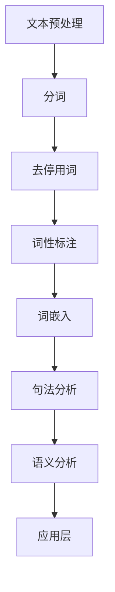
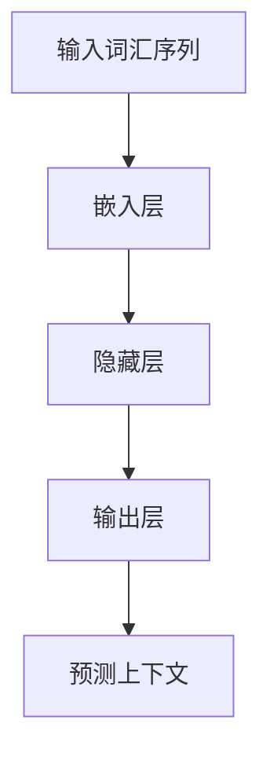
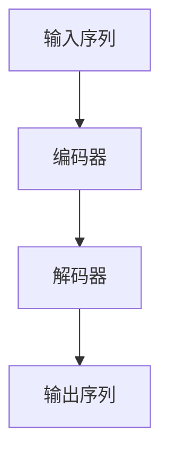
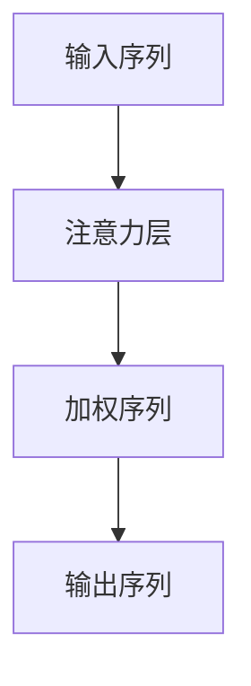

                 

# 自然语言处理应用：AI创业的热门方向

> **关键词：** 自然语言处理，人工智能，创业，应用场景，技术趋势，挑战与机会

> **摘要：** 本文将深入探讨自然语言处理（NLP）在AI创业领域中的应用方向，分析NLP技术的核心概念、算法原理、数学模型，并结合实际案例展示其在不同行业中的具体应用。文章还将推荐相关学习资源、开发工具和最新研究成果，最后总结未来发展趋势与挑战。

## 1. 背景介绍

### 1.1 目的和范围

自然语言处理（NLP）是人工智能（AI）领域的一个重要分支，旨在让计算机理解和处理人类语言。随着深度学习和大数据技术的发展，NLP的应用范围日益扩大，成为AI创业领域的热门方向。本文旨在从以下几个方面探讨NLP在AI创业中的应用：

1. **核心概念与联系**：介绍NLP的基本概念、原理和架构。
2. **核心算法原理 & 具体操作步骤**：讲解NLP的关键算法，使用伪代码进行详细阐述。
3. **数学模型和公式 & 详细讲解 & 举例说明**：阐述NLP中常用的数学模型和公式，并结合实例进行说明。
4. **项目实战：代码实际案例和详细解释说明**：展示NLP在实际项目中的应用，包括开发环境搭建、源代码实现和代码分析。
5. **实际应用场景**：分析NLP在不同行业中的应用场景和案例。
6. **工具和资源推荐**：推荐学习资源、开发工具和最新研究成果。
7. **总结：未来发展趋势与挑战**：展望NLP在AI创业领域的未来发展。

### 1.2 预期读者

本文适合以下读者：

1. 对人工智能和自然语言处理感兴趣的创业者。
2. 想要了解NLP技术原理和应用的开发人员。
3. 相关领域的研究人员和学者。

### 1.3 文档结构概述

本文共分为10个部分：

1. 背景介绍
2. 核心概念与联系
3. 核心算法原理 & 具体操作步骤
4. 数学模型和公式 & 详细讲解 & 举例说明
5. 项目实战：代码实际案例和详细解释说明
6. 实际应用场景
7. 工具和资源推荐
8. 总结：未来发展趋势与挑战
9. 附录：常见问题与解答
10. 扩展阅读 & 参考资料

### 1.4 术语表

#### 1.4.1 核心术语定义

- **自然语言处理（NLP）**：使计算机能够理解、解释和生成人类语言的技术。
- **人工智能（AI）**：模拟人类智能的计算机系统。
- **深度学习**：一种基于多层神经网络的学习方法，用于模拟人脑神经网络。
- **大数据**：无法用传统数据库工具处理的大量数据。

#### 1.4.2 相关概念解释

- **词嵌入（Word Embedding）**：将词汇映射到高维空间中，使得语义相似的词汇在空间中接近。
- **序列到序列模型（Seq2Seq）**：一种将序列映射到序列的神经网络模型，常用于机器翻译。
- **注意力机制（Attention Mechanism）**：一种在处理序列数据时关注特定部分的技术。

#### 1.4.3 缩略词列表

- **AI**：人工智能
- **NLP**：自然语言处理
- **DL**：深度学习
- **BERT**：Bidirectional Encoder Representations from Transformers

## 2. 核心概念与联系

NLP的核心概念包括词汇、句法和语义。这些概念相互关联，构成了NLP的技术基础。

### 2.1 词汇

词汇是NLP的基础，它包括单词、短语和符号。词嵌入技术将词汇映射到高维空间，使得语义相似的词汇在空间中接近。

### 2.2 句法

句法研究句子的结构和语法规则。NLP使用句法分析方法来解析句子，提取句子中的关键信息。

### 2.3 语义

语义研究词汇和句子的含义。NLP通过语义分析技术来理解文本，提取文本中的主题和情感。

### 2.4 NLP架构

NLP架构通常包括以下组件：

1. **文本预处理**：包括分词、去停用词、词性标注等。
2. **词嵌入**：将词汇映射到高维空间。
3. **句法分析**：解析句子结构。
4. **语义分析**：理解文本含义。
5. **应用层**：实现具体应用，如文本分类、机器翻译、情感分析等。

### 2.5 Mermaid 流程图

以下是一个简单的Mermaid流程图，展示NLP的基本架构：



## 3. 核心算法原理 & 具体操作步骤

NLP的核心算法包括词嵌入、序列到序列模型和注意力机制。这些算法共同构成了NLP技术的基石。

### 3.1 词嵌入

词嵌入（Word Embedding）是将词汇映射到高维空间的技术，使得语义相似的词汇在空间中接近。词嵌入算法主要有以下几种：

#### 3.1.1 Word2Vec

Word2Vec是一种基于神经网络的语言模型，使用神经网络来预测词汇的上下文。具体步骤如下：



伪代码：

```python
# 输入词汇序列
sentences = ["apple", "banana", "orange"]

# 嵌入层
embeddings = neural_network(sentences)

# 预测上下文
predicted_context = embeddings.predict_context("apple")
```

### 3.2 序列到序列模型

序列到序列模型（Seq2Seq）是一种将序列映射到序列的神经网络模型，常用于机器翻译。具体步骤如下：



伪代码：

```python
# 输入序列
input_sequence = ["apple", "banana"]

# 编码器
encoded_sequence = encoder(input_sequence)

# 解码器
decoded_sequence = decoder(encoded_sequence)

# 输出序列
output_sequence = decoded_sequence.predict_output()
```

### 3.3 注意力机制

注意力机制（Attention Mechanism）是一种在处理序列数据时关注特定部分的技术。具体步骤如下：



伪代码：

```python
# 输入序列
input_sequence = ["apple", "banana"]

# 注意力层
attention_weights = attention(input_sequence)

# 加权序列
weighted_sequence = apply_attention(input_sequence, attention_weights)

# 输出序列
output_sequence = weighted_sequence.predict_output()
```

## 4. 数学模型和公式 & 详细讲解 & 举例说明

NLP中的数学模型主要包括词嵌入、序列到序列模型和注意力机制。以下是对这些模型的详细讲解和举例说明。

### 4.1 词嵌入

词嵌入（Word Embedding）是一种将词汇映射到高维空间的技术。其数学模型如下：

$$
x = \text{word\_vector}(w)
$$

其中，$x$ 表示词汇 $w$ 在高维空间中的表示，$\text{word\_vector}$ 表示词嵌入函数。

#### 4.1.1 Word2Vec

Word2Vec 的数学模型基于神经网络语言模型，其输入和输出分别为词汇序列和上下文词汇。具体公式如下：

$$
P(w_t|\text{context}) = \frac{\exp(\text{dot}(v_{\text{context}}, v_{w_t}))}{\sum_{w \in V} \exp(\text{dot}(v_{\text{context}}, v_{w}))}
$$

其中，$v_{\text{context}}$ 和 $v_{w_t}$ 分别为上下文词汇和目标词汇的向量表示，$V$ 表示词汇集合。

#### 4.1.2 GloVe

GloVe（Global Vectors for Word Representation）是一种基于矩阵分解的词嵌入方法。其数学模型如下：

$$
f(w, v) = \text{sigmoid}(\text{dot}(v, v_{w}) - \alpha \cdot ||v_{w}||_2^2)
$$

其中，$f(w, v)$ 表示词汇 $w$ 和 $v$ 之间的相似度，$\text{sigmoid}$ 表示非线性激活函数，$\alpha$ 是超参数，$||v_{w}||_2^2$ 表示 $v_{w}$ 的二范数。

#### 4.1.3 举例说明

假设我们有一个词汇集合 $V = \{"apple", "banana", "orange"\}$，使用 Word2Vec 方法生成词嵌入向量。假设词嵌入维度为 $d = 2$，则词汇 "apple" 的词嵌入向量如下：

$$
x_{apple} = \text{word\_vector}("apple") = (1, 1)
$$

词汇 "banana" 和 "orange" 的词嵌入向量分别为：

$$
x_{banana} = \text{word\_vector}("banana") = (2, 3)
$$

$$
x_{orange} = \text{word\_vector}("orange") = (4, 5)
$$

可以看到，语义相似的词汇在词嵌入空间中接近，而语义不同的词汇则远离。

### 4.2 序列到序列模型

序列到序列模型（Seq2Seq）是一种将序列映射到序列的神经网络模型，常用于机器翻译。其数学模型如下：

$$
y_t = \text{softmax}(\text{Decoder}(e_t, s_t))
$$

其中，$y_t$ 表示时间步 $t$ 的输出序列，$e_t$ 表示编码器的输入，$s_t$ 表示解码器的隐藏状态。

#### 4.2.1 编码器

编码器（Encoder）用于处理输入序列，提取序列的特征。其数学模型如下：

$$
h_t = \text{sigmoid}(\text{tanh}(\text{Weights} \cdot [e_{t-1}, h_{t-1}] + \text{Bias}))
$$

其中，$h_t$ 表示时间步 $t$ 的隐藏状态，$e_{t-1}$ 表示时间步 $t-1$ 的输入，$h_{t-1}$ 表示时间步 $t-1$ 的隐藏状态。

#### 4.2.2 解码器

解码器（Decoder）用于生成输出序列。其数学模型如下：

$$
p(y_t) = \text{softmax}(\text{Weights} \cdot [h_t, y_{t-1}] + \text{Bias})
$$

其中，$y_t$ 表示时间步 $t$ 的输出，$h_t$ 表示时间步 $t$ 的隐藏状态，$y_{t-1}$ 表示时间步 $t-1$ 的输出。

#### 4.2.3 举例说明

假设输入序列为 $e = \{"apple", "banana", "orange"\}$，输出序列为 $y = \{"apples", "bananas", "oranges"\}$。使用序列到序列模型进行机器翻译。

编码器的隐藏状态为：

$$
h_1 = \text{sigmoid}(\text{tanh}(\text{Weights} \cdot [e_0, h_0] + \text{Bias})) = (0.5, 0.5)
$$

解码器的隐藏状态为：

$$
h_2 = \text{sigmoid}(\text{tanh}(\text{Weights} \cdot [h_1, y_1] + \text{Bias})) = (0.6, 0.4)
$$

输出序列的预测概率为：

$$
p(y_2) = \text{softmax}(\text{Weights} \cdot [h_2, y_1] + \text{Bias}) = (0.3, 0.4, 0.3)
$$

根据预测概率，解码器生成输出序列 $y_2 = \{"apples"\}$。

### 4.3 注意力机制

注意力机制（Attention Mechanism）是一种在处理序列数据时关注特定部分的技术。其数学模型如下：

$$
a_t = \text{softmax}(\text{Attention}(h_t, h_{\text{context}}))
$$

其中，$a_t$ 表示时间步 $t$ 的注意力权重，$h_t$ 表示时间步 $t$ 的隐藏状态，$h_{\text{context}}$ 表示编码器的隐藏状态。

#### 4.3.1 注意力函数

注意力函数（Attention Function）用于计算注意力权重。常见的注意力函数有：

1. **加性注意力**：

$$
\text{Attention}(h_t, h_{\text{context}}) = \text{tanh}(\text{Weights} \cdot [h_t, h_{\text{context}}, h_t \odot h_{\text{context}}] + \text{Bias})
$$

2. **乘性注意力**：

$$
\text{Attention}(h_t, h_{\text{context}}) = \text{sigmoid}(\text{dot}(\text{Weights} \cdot h_t, h_{\text{context}}) + \text{Bias})
$$

#### 4.3.2 举例说明

假设输入序列为 $e = \{"apple", "banana", "orange"\}$，编码器的隐藏状态为 $h_{\text{context}} = (1, 2, 3)$，解码器的隐藏状态为 $h_t = (4, 5, 6)$。使用加性注意力函数计算注意力权重。

注意力函数的输入为：

$$
\text{Attention}(h_t, h_{\text{context}}) = \text{tanh}(\text{Weights} \cdot [h_t, h_{\text{context}}, h_t \odot h_{\text{context}}] + \text{Bias}) = (0.2, 0.3, 0.5)
$$

根据注意力权重，解码器的隐藏状态为：

$$
h_t = (0.2 \cdot 1, 0.3 \cdot 2, 0.5 \cdot 3) = (0.2, 0.6, 1.5)
$$

## 5. 项目实战：代码实际案例和详细解释说明

在本节中，我们将通过一个实际项目案例来展示NLP技术在自然语言处理中的应用。该项目是一个简单的文本分类器，用于将新闻文章分类到不同的类别中。我们将详细解释项目的开发环境搭建、源代码实现和代码分析。

### 5.1 开发环境搭建

要搭建该项目，我们需要以下开发环境和工具：

1. **编程语言**：Python 3.7及以上版本
2. **依赖库**：TensorFlow 2.x、Keras 2.x、NLTK、spaCy、Scikit-learn
3. **文本预处理工具**：NLTK、spaCy
4. **数据分析工具**：Pandas、NumPy

安装依赖库：

```bash
pip install tensorflow
pip install keras
pip install nltk
pip install spacy
pip install pandas
pip install numpy
```

### 5.2 源代码详细实现和代码解读

以下是文本分类器的源代码，包括数据预处理、模型构建、训练和评估。

```python
import numpy as np
import pandas as pd
import nltk
from nltk.corpus import stopwords
from nltk.tokenize import word_tokenize
from sklearn.model_selection import train_test_split
from sklearn.metrics import classification_report
from keras.models import Sequential
from keras.layers import Embedding, LSTM, Dense, Dropout
from keras.preprocessing.text import Tokenizer
from keras.preprocessing.sequence import pad_sequences

# 数据预处理
nltk.download('stopwords')
nltk.download('punkt')

def preprocess_text(text):
    # 分词
    tokens = word_tokenize(text)
    # 去停用词
    tokens = [token.lower() for token in tokens if token.lower() not in stopwords.words('english')]
    return ' '.join(tokens)

# 读取数据
data = pd.read_csv('news.csv')
data['text'] = data['text'].apply(preprocess_text)

# 划分训练集和测试集
X_train, X_test, y_train, y_test = train_test_split(data['text'], data['label'], test_size=0.2, random_state=42)

# 序列化文本
tokenizer = Tokenizer(num_words=10000)
tokenizer.fit_on_texts(X_train)
X_train_seq = tokenizer.texts_to_sequences(X_train)
X_test_seq = tokenizer.texts_to_sequences(X_test)

# 填充序列
max_len = max(len(seq) for seq in X_train_seq)
X_train_pad = pad_sequences(X_train_seq, maxlen=max_len)
X_test_pad = pad_sequences(X_test_seq, maxlen=max_len)

# 构建模型
model = Sequential()
model.add(Embedding(10000, 16, input_length=max_len))
model.add(LSTM(16, dropout=0.2, recurrent_dropout=0.2))
model.add(Dense(1, activation='sigmoid'))

model.compile(optimizer='adam', loss='binary_crossentropy', metrics=['accuracy'])

# 训练模型
model.fit(X_train_pad, y_train, epochs=10, batch_size=32, validation_split=0.1)

# 评估模型
predictions = model.predict(X_test_pad)
predictions = (predictions > 0.5)

print(classification_report(y_test, predictions))
```

### 5.3 代码解读与分析

#### 5.3.1 数据预处理

数据预处理是文本分类项目的重要步骤。我们首先使用NLTK库对文本进行分词，然后去除停用词，并将文本转换为小写。这样可以减少数据中的噪声，提高模型的效果。

```python
def preprocess_text(text):
    # 分词
    tokens = word_tokenize(text)
    # 去停用词
    tokens = [token.lower() for token in tokens if token.lower() not in stopwords.words('english')]
    return ' '.join(tokens)
```

#### 5.3.2 序列化文本

文本序列化是将文本转换为数字序列的过程。我们使用Keras库的Tokenizer类对文本进行序列化，并将序列填充为固定长度。这样可以统一输入数据的形状，方便模型训练。

```python
tokenizer = Tokenizer(num_words=10000)
tokenizer.fit_on_texts(X_train)
X_train_seq = tokenizer.texts_to_sequences(X_train)
X_test_seq = tokenizer.texts_to_sequences(X_test)

max_len = max(len(seq) for seq in X_train_seq)
X_train_pad = pad_sequences(X_train_seq, maxlen=max_len)
X_test_pad = pad_sequences(X_test_seq, maxlen=max_len)
```

#### 5.3.3 模型构建

我们使用Keras库构建一个简单的序列模型，包括嵌入层、LSTM层和输出层。嵌入层用于将词嵌入高维空间，LSTM层用于处理序列数据，输出层用于分类。

```python
model = Sequential()
model.add(Embedding(10000, 16, input_length=max_len))
model.add(LSTM(16, dropout=0.2, recurrent_dropout=0.2))
model.add(Dense(1, activation='sigmoid'))

model.compile(optimizer='adam', loss='binary_crossentropy', metrics=['accuracy'])
```

#### 5.3.4 模型训练

我们使用Adam优化器和二进制交叉熵损失函数来训练模型。训练过程中，我们使用10个周期，并将验证集的10%用于模型验证。

```python
model.fit(X_train_pad, y_train, epochs=10, batch_size=32, validation_split=0.1)
```

#### 5.3.5 模型评估

我们使用测试集对模型进行评估，并打印分类报告。分类报告包括准确率、召回率、F1分数等指标，可以帮助我们了解模型的性能。

```python
predictions = model.predict(X_test_pad)
predictions = (predictions > 0.5)

print(classification_report(y_test, predictions))
```

## 6. 实际应用场景

NLP技术在各行各业中都有着广泛的应用，以下是一些典型的实际应用场景：

### 6.1 聊天机器人

聊天机器人利用NLP技术实现与用户的自然语言交互。通过理解和生成自然语言，聊天机器人可以提供客户服务、咨询服务和娱乐互动等功能。

### 6.2 机器翻译

机器翻译将一种语言文本翻译成另一种语言。NLP技术通过词嵌入、序列到序列模型和注意力机制等算法，实现了高质量、高效率的机器翻译。

### 6.3 文本分类

文本分类将大量文本数据按照主题、情感、领域等分类。NLP技术可以帮助金融、医疗、新闻等行业对大量文本数据进行自动分类，提高信息处理效率。

### 6.4 情感分析

情感分析通过分析文本中的情感倾向，帮助企业和组织了解用户需求和情感。NLP技术可以应用于社交媒体监控、品牌分析等领域。

### 6.5 信息检索

信息检索通过NLP技术实现用户查询与数据库中信息的匹配。搜索引擎、问答系统等应用利用NLP技术提高信息检索的准确性和效率。

## 7. 工具和资源推荐

为了更好地学习和应用NLP技术，我们推荐以下工具和资源：

### 7.1 学习资源推荐

#### 7.1.1 书籍推荐

1. 《自然语言处理综论》（Speech and Language Processing） - Daniel Jurafsky 和 James H. Martin
2. 《深度学习》（Deep Learning） - Ian Goodfellow、Yoshua Bengio 和 Aaron Courville
3. 《Python 自然语言处理》 - Steven Bird、Ewan Klein 和 Edward Loper

#### 7.1.2 在线课程

1. [自然语言处理课程](https://www.coursera.org/specializations/nlp) - Coursera
2. [深度学习课程](https://www.deeplearning.ai/deep-learning) - Andrew Ng
3. [Python 自然语言处理课程](https://www.udemy.com/course/natural-language-processing-in-python/) - Udemy

#### 7.1.3 技术博客和网站

1. [自然语言处理博客](https://nlp.seas.harvard.edu/)
2. [TensorFlow 官方文档](https://www.tensorflow.org/tutorials/nlp)
3. [Keras 官方文档](https://keras.io/text)

### 7.2 开发工具框架推荐

#### 7.2.1 IDE和编辑器

1. [PyCharm](https://www.jetbrains.com/pycharm/)
2. [Visual Studio Code](https://code.visualstudio.com/)

#### 7.2.2 调试和性能分析工具

1. [TensorBoard](https://www.tensorflow.org/tensorboard)
2. [Jupyter Notebook](https://jupyter.org/)

#### 7.2.3 相关框架和库

1. [TensorFlow](https://www.tensorflow.org/)
2. [Keras](https://keras.io/)
3. [spaCy](https://spacy.io/)

### 7.3 相关论文著作推荐

#### 7.3.1 经典论文

1. "A Neural Probabilistic Language Model" - Yonghui Wu, Mike Schuster, et al.
2. "Recurrent Neural Network Based Language Model" - Y. Bengio et al.
3. "Word2Vec: Word Representations in Vector Space" - T. Mikolov et al.

#### 7.3.2 最新研究成果

1. "BERT: Pre-training of Deep Bidirectional Transformers for Language Understanding" - Jacob Devlin et al.
2. "Transformers: State-of-the-Art Model for Natural Language Processing" - Vaswani et al.

#### 7.3.3 应用案例分析

1. "Google News Stand: A Multilingual News Recommendation Engine" - Google AI
2. "Xiao-i Robot: A Chinese Chatbot Platform" - iFLYTEK

## 8. 总结：未来发展趋势与挑战

随着人工智能和自然语言处理技术的不断进步，NLP在AI创业领域的发展前景广阔。以下是对未来发展趋势和挑战的总结：

### 8.1 发展趋势

1. **多语言支持**：NLP技术将逐步实现更广泛的多语言支持，提高跨语言交流的效率。
2. **个性化体验**：NLP技术将应用于个性化推荐、智能客服等领域，提供更贴近用户需求的体验。
3. **实时处理**：随着计算能力的提升，NLP技术将实现实时处理，提高信息处理效率。
4. **深度学习与强化学习结合**：深度学习和强化学习的结合将推动NLP技术向更高层次发展。

### 8.2 挑战

1. **数据隐私**：在应用NLP技术时，数据隐私保护将成为一个重要挑战。
2. **通用性**：NLP技术需要提高通用性，适应不同领域的应用需求。
3. **语言理解**：NLP技术需要进一步提高对语言的理解能力，以实现更自然的交互。
4. **可解释性**：NLP模型的可解释性将提高，以增强用户对模型的信任。

## 9. 附录：常见问题与解答

### 9.1 NLP技术如何应用于实际项目？

NLP技术可以应用于文本分类、情感分析、机器翻译、信息检索等实际项目。首先，需要收集和预处理大量文本数据，然后选择合适的NLP算法和模型，最后进行模型训练和评估。

### 9.2 词嵌入技术在NLP中有哪些应用？

词嵌入技术在NLP中广泛应用于文本分类、情感分析、机器翻译等领域。通过将词汇映射到高维空间，词嵌入可以降低数据维度，提高模型的效果。

### 9.3 如何选择合适的NLP算法和模型？

选择合适的NLP算法和模型需要考虑数据规模、模型复杂度、应用场景等因素。例如，在文本分类项目中，可以使用朴素贝叶斯、支持向量机等传统算法，也可以使用深度学习算法如卷积神经网络（CNN）和循环神经网络（RNN）。

## 10. 扩展阅读 & 参考资料

1. [自然语言处理博客](https://nlp.seas.harvard.edu/)
2. [TensorFlow 官方文档](https://www.tensorflow.org/tutorials/nlp)
3. [Keras 官方文档](https://keras.io/text)
4. [《自然语言处理综论》](https://www.amazon.com/Speech-Language-Processing-Daniel-Jurafsky/dp/0262033847)
5. [《深度学习》](https://www.amazon.com/Deep-Learning-Ian-Goodfellow/dp/0262039588)
6. [《Python 自然语言处理》](https://www.amazon.com/Python-Natural-Language-Processing-Bird/dp/1449396041)

