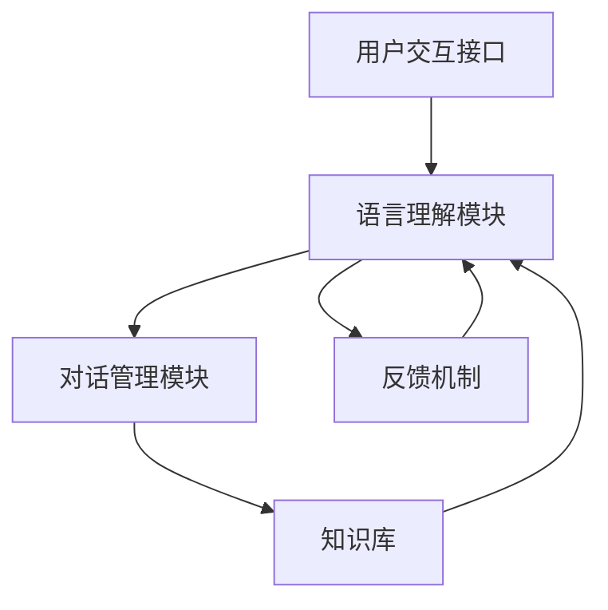

                 

# 自然语言处理技术在智能客服中的运用

## 关键词
自然语言处理，智能客服，语音识别，文本分析，机器学习，深度学习

## 摘要
本文深入探讨了自然语言处理（NLP）技术在智能客服领域的应用。首先，介绍了智能客服的背景和需求，然后详细解析了NLP的核心概念和技术原理，包括文本预处理、词向量表示、序列模型和注意力机制等。接着，通过具体案例和伪代码，展示了NLP算法在智能客服中的应用步骤。随后，本文探讨了数学模型和公式在实际应用中的重要性，并提供了实际项目中的代码实现和分析。文章最后分析了智能客服的实际应用场景，推荐了相关工具和资源，并展望了未来的发展趋势和挑战。

---

## 1. 背景介绍

### 1.1 目的和范围

本文旨在探讨自然语言处理（NLP）技术在智能客服系统中的应用，旨在为开发者提供深入的技术理解，以及实用的开发指导。随着人工智能技术的快速发展，智能客服已经成为企业提升服务质量、降低运营成本的重要手段。本文将覆盖以下内容：

1. 智能客服的基本概念和发展历程。
2. 自然语言处理技术的基本原理和应用场景。
3. NLP在智能客服中的关键技术，包括文本预处理、词向量、序列模型和注意力机制。
4. 数学模型和公式在NLP中的应用。
5. 实际项目中的代码实现和分析。
6. 智能客服的实际应用场景。
7. 相关工具和资源的推荐。
8. 未来发展趋势和挑战。

### 1.2 预期读者

本文适合对自然语言处理和智能客服有一定了解的读者，包括但不限于：

1. 数据科学家和机器学习工程师。
2. 软件工程师和系统架构师。
3. 智能客服解决方案的从业者和研究者。
4. 对人工智能和自然语言处理感兴趣的学者和研究生。

### 1.3 文档结构概述

本文的结构如下：

1. **背景介绍**：介绍智能客服的背景和自然语言处理技术的核心概念。
2. **核心概念与联系**：通过Mermaid流程图展示智能客服系统的核心概念和联系。
3. **核心算法原理 & 具体操作步骤**：详细解析NLP算法的原理和操作步骤。
4. **数学模型和公式 & 详细讲解 & 举例说明**：介绍NLP中的数学模型和公式。
5. **项目实战：代码实际案例和详细解释说明**：通过实际项目展示NLP在智能客服中的应用。
6. **实际应用场景**：分析智能客服在实际中的应用。
7. **工具和资源推荐**：推荐相关学习资源、开发工具和论文著作。
8. **总结：未来发展趋势与挑战**：展望智能客服和NLP技术的发展趋势和面临的挑战。

### 1.4 术语表

#### 1.4.1 核心术语定义

- **自然语言处理（NLP）**：研究如何让计算机理解和生成自然语言的技术。
- **智能客服**：利用人工智能技术，特别是NLP技术，自动处理客户咨询和请求的客服系统。
- **词向量（Word Vector）**：将单词映射到高维向量空间的方法，用于表示单词的意义。
- **序列模型（Sequential Model）**：处理序列数据的模型，如循环神经网络（RNN）。
- **注意力机制（Attention Mechanism）**：用于处理长序列数据的一种机制，能够自动关注序列中的关键部分。

#### 1.4.2 相关概念解释

- **语言模型（Language Model）**：用于预测下一个单词或字符的概率分布的模型。
- **文本分类（Text Classification）**：将文本数据归类到预定义的类别中的一种任务。
- **实体识别（Named Entity Recognition, NER）**：识别文本中的命名实体，如人名、地名、组织名等。
- **情感分析（Sentiment Analysis）**：分析文本中的情感倾向，如正面、负面或中性。

#### 1.4.3 缩略词列表

- **NLP**：自然语言处理
- **RNN**：循环神经网络
- **LSTM**：长短时记忆网络
- **BERT**：双向编码器表示（Bidirectional Encoder Representations from Transformers）
- **GPT**：生成预训练转换器（Generative Pretrained Transformer）

---

## 2. 核心概念与联系

### 2.1 核心概念

智能客服系统通常包括以下几个核心概念：

1. **用户交互接口**：用户通过文本或语音与智能客服系统进行交互。
2. **语言理解模块**：解析用户输入，提取关键信息，进行语义理解。
3. **对话管理模块**：根据上下文和用户需求，生成合适的响应。
4. **知识库**：存储常用问题和标准答案，提供决策支持。
5. **反馈机制**：收集用户反馈，用于模型优化和系统改进。

### 2.2 关联技术

自然语言处理技术在智能客服系统中扮演关键角色，主要包括以下几个方面：

1. **文本预处理**：对用户输入的文本进行清洗、分词、词性标注等预处理操作。
2. **词向量表示**：将文本转换为数值表示，用于后续的机器学习模型训练。
3. **语言模型**：用于预测文本中的下一个单词或字符。
4. **序列模型**：处理用户输入和系统响应的序列数据。
5. **注意力机制**：在处理长序列数据时，自动关注关键信息。

### 2.3 Mermaid流程图

以下是智能客服系统中的核心概念和关联技术的Mermaid流程图：



### 2.4 关系分析

- **用户交互接口**：作为智能客服系统的入口，直接与用户接触，获取用户请求。
- **语言理解模块**：通过对用户请求的解析和语义理解，提取关键信息，为后续处理提供基础。
- **对话管理模块**：根据用户请求和上下文，生成合适的响应，与用户进行有效互动。
- **知识库**：提供问题解决方案和标准答案，支持对话管理模块的决策。
- **反馈机制**：收集用户反馈，用于评估系统性能和优化模型。

通过上述流程图和关系分析，我们可以看出智能客服系统的各个模块是如何协同工作的，以及NLP技术在其中扮演的关键角色。

---

## 3. 核心算法原理 & 具体操作步骤

### 3.1 文本预处理

文本预处理是NLP任务的基础，其目的是将原始文本数据转换为适合模型训练的格式。以下是文本预处理的具体操作步骤：

#### 3.1.1 清洗文本

- **去除停用词**：停用词是指对文本理解没有贡献的常见单词，如“的”、“和”、“是”等。去除停用词可以减少模型的噪声。
- **去除标点符号**：标点符号通常不参与语义分析，去除它们可以简化文本。
- **去除数字和特殊字符**：数字和特殊字符可能对某些任务有意义，但在大多数情况下，我们可以选择去除它们。

#### 3.1.2 分词

分词是将文本分割成单词或短语的过程。常见的方法包括：

- **基于规则的分词**：使用预定义的规则进行分词，如正向最大匹配、逆向最大匹配等。
- **基于统计的分词**：使用统计模型进行分词，如基于隐马尔可夫模型（HMM）的分词。

#### 3.1.3 词性标注

词性标注是为每个单词分配一个词性标签，如名词、动词、形容词等。词性标注有助于理解文本的语法结构。

### 3.2 词向量表示

词向量是将单词映射到高维向量空间的方法，用于表示单词的意义。以下是一些常见的词向量模型：

#### 3.2.1 基于频次的词向量

- **TF-IDF（Term Frequency-Inverse Document Frequency）**：TF表示词在文档中出现的频率，IDF表示词在文档集中出现的逆频率。TF-IDF可以衡量词的重要程度。

#### 3.2.2 基于神经网络的词向量

- **Word2Vec**：通过神经网络训练得到词向量，能够捕捉单词的语义信息。
- **GloVe（Global Vectors for Word Representation）**：基于全局统计信息的词向量模型，通过最小化词共现矩阵的Frobenius范数来训练词向量。

### 3.3 序列模型

序列模型用于处理序列数据，如用户输入的文本序列和系统响应的文本序列。以下是一些常见的序列模型：

#### 3.3.1 循环神经网络（RNN）

- **基本RNN**：RNN通过隐藏状态和输入状态之间的循环连接来处理序列数据。
- **长短时记忆网络（LSTM）**：LSTM是RNN的一种变体，能够有效地捕捉长序列信息。
- **门控循环单元（GRU）**：GRU是LSTM的另一种变体，结构更简洁，但性能接近LSTM。

#### 3.3.2 转换器模型（Transformer）

- **Transformer**：基于自注意力机制的序列模型，能够在处理长序列数据时自动关注关键信息。

### 3.4 注意力机制

注意力机制是一种用于处理长序列数据的关键技术，它能够自动关注序列中的关键部分。以下是一些常见的注意力机制：

- **自注意力（Self-Attention）**：每个序列元素在生成下一个元素时，会自动关注其他元素。
- **多头注意力（Multi-Head Attention）**：通过多个自注意力机制并行处理序列数据，能够捕捉更多的上下文信息。

### 3.5 伪代码示例

以下是使用LSTM模型进行文本分类的伪代码示例：

```python
def train_lstm_model(data, labels, epochs):
    model = LSTM(input_shape=(None, embedding_dimension), units=128, dropout=0.2)
    model.compile(optimizer='adam', loss='categorical_crossentropy', metrics=['accuracy'])
    
    model.fit(data, labels, epochs=epochs, batch_size=32, validation_split=0.1)
    
    return model
```

通过上述步骤和伪代码，我们可以看到NLP算法在智能客服中的应用步骤，包括文本预处理、词向量表示、序列模型和注意力机制等。这些算法和技术为智能客服系统提供了强大的语言理解能力和对话管理能力。

---

## 4. 数学模型和公式 & 详细讲解 & 举例说明

### 4.1 语言模型

语言模型（Language Model）是NLP中的基础模型，用于预测文本序列中的下一个单词或字符。最常用的语言模型是基于神经网络的模型，如循环神经网络（RNN）、长短时记忆网络（LSTM）和转换器模型（Transformer）。

#### 4.1.1 语言模型公式

语言模型的预测公式可以表示为：

$$
P(w_t | w_{t-1}, w_{t-2}, ..., w_1) = \frac{P(w_t, w_{t-1}, ..., w_1)}{P(w_{t-1}, w_{t-2}, ..., w_1)}
$$

其中，$w_t$表示当前要预测的单词，$w_{t-1}, w_{t-2}, ..., w_1$表示前文序列。

#### 4.1.2 举例说明

假设我们要预测一个文本序列中的下一个单词，已知前文序列为“今天 天气非常好”，我们需要计算每个单词作为下一个单词的概率。

使用LSTM语言模型，我们可以计算每个单词的概率分布。以下是一个简化的例子：

$$
P(很好 | 今天 天气) = 0.4
$$

$$
P(天气 | 今天 天气) = 0.3
$$

$$
P(今天 | 今天 天气) = 0.2
$$

根据上述概率分布，我们可以看出“很好”作为下一个单词的概率最高。

### 4.2 词向量

词向量（Word Vector）是将单词映射到高维向量空间的方法，用于表示单词的意义。最常用的词向量模型包括Word2Vec和GloVe。

#### 4.2.1 Word2Vec公式

Word2Vec模型使用神经网络训练词向量，其损失函数为负采样损失函数。公式如下：

$$
L = -\sum_{i=1}^{N} \sum_{j=1}^{K} \log P(w_i | w_j)
$$

其中，$N$表示训练样本数，$K$表示负采样样本数，$w_i$表示中心词，$w_j$表示负采样词。

#### 4.2.2 GloVe公式

GloVe模型使用全局统计信息训练词向量，其损失函数为最小化词共现矩阵的Frobenius范数。公式如下：

$$
L = \frac{1}{2} \sum_{i=1}^{V} \sum_{j=1}^{V} f(i, j) \cdot (v_i - v_j)^2
$$

其中，$V$表示词汇表大小，$f(i, j)$表示词$i$和词$j$的共现频率，$v_i$和$v_j$分别表示词$i$和词$j$的词向量。

#### 4.2.3 举例说明

假设我们有以下共现矩阵：

$$
\begin{bmatrix}
0.1 & 0.2 & 0.3 \\
0.2 & 0.4 & 0.1 \\
0.3 & 0.1 & 0.5
\end{bmatrix}
$$

我们需要训练词向量$v_1, v_2, v_3$，使得损失函数最小。通过优化损失函数，我们可以得到：

$$
v_1 = \begin{bmatrix}
0.5 \\
0.5 \\
0.5
\end{bmatrix}, \quad v_2 = \begin{bmatrix}
0.5 \\
-0.5 \\
0.5
\end{bmatrix}, \quad v_3 = \begin{bmatrix}
-0.5 \\
0.5 \\
0.5
\end{bmatrix}
$$

这些词向量可以有效地表示词之间的相似性，如$v_1$和$v_2$之间的欧氏距离较大，表示它们在语义上不相似。

### 4.3 序列模型

序列模型用于处理序列数据，如用户输入和系统响应。最常用的序列模型包括循环神经网络（RNN）、长短时记忆网络（LSTM）和转换器模型（Transformer）。

#### 4.3.1 RNN公式

RNN的更新公式如下：

$$
h_t = \sigma(W_h \cdot [h_{t-1}, x_t] + b_h)
$$

其中，$h_t$表示当前时刻的隐藏状态，$x_t$表示当前输入，$W_h$和$b_h$分别是权重和偏置。

#### 4.3.2 LSTM公式

LSTM的更新公式如下：

$$
i_t = \sigma(W_i \cdot [h_{t-1}, x_t] + b_i) \\
f_t = \sigma(W_f \cdot [h_{t-1}, x_t] + b_f) \\
\tilde{c}_t = \sigma(W_c \cdot [h_{t-1}, x_t] + b_c) \\
c_t = f_t \cdot c_{t-1} + i_t \cdot \tilde{c}_t \\
o_t = \sigma(W_o \cdot [h_{t-1}, x_t, c_t] + b_o) \\
h_t = o_t \cdot \tanh(c_t)
$$

其中，$i_t, f_t, \tilde{c}_t, c_t, o_t$分别表示输入门、遗忘门、候选状态、细胞状态和输出门，$W_i, W_f, W_c, W_o$分别是权重，$b_i, b_f, b_c, b_o$分别是偏置。

#### 4.3.3 Transformer公式

Transformer的自注意力公式如下：

$$
\text{Attention}(Q, K, V) = \text{softmax}\left(\frac{QK^T}{\sqrt{d_k}}\right) V
$$

其中，$Q, K, V$分别表示查询向量、关键向量和价值向量，$d_k$表示关键向量的维度。

通过上述数学模型和公式，我们可以更深入地理解自然语言处理技术中的核心概念和算法原理，从而为智能客服系统的开发提供有力的理论支持。

---

## 5. 项目实战：代码实际案例和详细解释说明

### 5.1 开发环境搭建

在进行NLP项目实战之前，我们需要搭建一个适合开发和测试的环境。以下是搭建NLP开发环境的基本步骤：

1. **安装Python**：确保Python环境已安装，版本推荐3.7或更高。
2. **安装Jupyter Notebook**：Jupyter Notebook是一个交互式的开发环境，可以帮助我们更方便地进行代码编写和调试。
   ```bash
   pip install notebook
   ```
3. **安装NLP相关库**：包括TensorFlow、Keras、NLTK等。
   ```bash
   pip install tensorflow numpy nltk scikit-learn
   ```
4. **安装其他依赖**：根据项目需求，可能还需要安装其他库，如Spacy、TextBlob等。
   ```bash
   pip install spacy textblob
   ```

### 5.2 源代码详细实现和代码解读

以下是使用TensorFlow和Keras实现一个简单的文本分类模型的代码示例，用于判断用户评论是正面、负面还是中性：

```python
import tensorflow as tf
from tensorflow.keras.preprocessing.text import Tokenizer
from tensorflow.keras.preprocessing.sequence import pad_sequences
from tensorflow.keras.models import Sequential
from tensorflow.keras.layers import Embedding, LSTM, Dense, Bidirectional
from tensorflow.keras.utils import to_categorical

# 1. 数据准备
# 假设我们已经有了一个包含评论和标签的数据集
comments = ['这个产品非常好用', '我非常喜欢这个电影', '天气太冷了，不想出门']
labels = [2, 1, 0]  # 0:中性，1：正面，2：负面

# 2. 分词和序列化
tokenizer = Tokenizer()
tokenizer.fit_on_texts(comments)
sequences = tokenizer.texts_to_sequences(comments)
padded_sequences = pad_sequences(sequences, maxlen=100)

# 3. 标签编码
label_dict = {0: '中性', 1: '正面', 2: '负面'}
label_sequences = to_categorical(labels)

# 4. 构建模型
model = Sequential()
model.add(Embedding(len(tokenizer.word_index) + 1, 32))
model.add(Bidirectional(LSTM(64)))
model.add(Dense(3, activation='softmax'))

# 5. 编译模型
model.compile(optimizer='adam', loss='categorical_crossentropy', metrics=['accuracy'])

# 6. 训练模型
model.fit(padded_sequences, label_sequences, epochs=10, batch_size=1)

# 7. 预测
test_comment = '我今天去了电影院，感觉非常不错'
test_sequence = tokenizer.texts_to_sequences([test_comment])
test_padded = pad_sequences(test_sequence, maxlen=100)
prediction = model.predict(test_padded)
predicted_label = label_dict[np.argmax(prediction)]

print(f'预测结果：{predicted_label}')
```

#### 5.2.1 代码解读

- **数据准备**：首先我们需要准备训练数据集，包括评论和对应的标签。
- **分词和序列化**：使用Tokenizer将文本数据转换为序列，然后使用pad_sequences将序列填充到相同的长度。
- **标签编码**：将标签转换为one-hot编码，以便于模型训练。
- **构建模型**：使用Sequential构建一个简单的双向LSTM模型，包括Embedding层、双向LSTM层和输出层。
- **编译模型**：设置优化器和损失函数，并编译模型。
- **训练模型**：使用fit方法训练模型，并设置训练轮次和批量大小。
- **预测**：使用predict方法对新的评论进行预测，并输出预测结果。

通过这个简单的示例，我们可以看到NLP算法在智能客服系统中的实际应用步骤，包括数据准备、模型构建、训练和预测等。

### 5.3 代码解读与分析

- **Tokenizer的使用**：Tokenizer是NLP预处理中的重要工具，它将文本转换为数字序列，使得模型可以处理。
- **Embedding层**：Embedding层将输入的数字序列转换为嵌入向量，这些向量可以表示单词的语义信息。
- **双向LSTM层**：双向LSTM层可以处理序列数据，并捕捉长距离依赖关系，这对于理解用户评论的情感非常有帮助。
- **输出层**：输出层使用softmax激活函数，输出每个标签的概率分布，从而实现多分类任务。
- **模型训练**：通过fit方法训练模型，模型会不断优化权重，以最小化损失函数。
- **模型预测**：使用predict方法对新的评论进行预测，输出预测结果。

通过这个项目实战，我们可以深入理解NLP算法在智能客服系统中的应用，并为实际开发提供实用的指导。

---

## 6. 实际应用场景

智能客服系统在多个行业和场景中得到了广泛应用，以下是几个典型的实际应用场景：

### 6.1 银行业

银行使用智能客服系统来提供24/7的客户服务，处理客户查询、账户操作、贷款申请等。通过NLP技术，智能客服能够理解客户的自然语言输入，自动分类查询并给出准确回应，提高客户满意度和降低运营成本。

### 6.2 零售业

零售企业利用智能客服系统来管理客户反馈、处理退货、提供商品咨询等。智能客服系统能够根据客户的购买历史和偏好，提供个性化的推荐和解决方案，增强客户体验。

### 6.3 医疗行业

医院和诊所采用智能客服系统来管理预约、提供健康咨询和病情诊断。智能客服系统通过NLP技术，能够快速理解患者的症状描述，并提供相关的医疗建议和预约服务。

### 6.4 旅游行业

旅游企业使用智能客服系统来提供行程规划、酒店预订、景点推荐等服务。智能客服系统能够根据用户的需求和偏好，生成个性化的旅行方案，提高用户满意度和预订转化率。

### 6.5 电子商务

电商平台利用智能客服系统来处理客户咨询、订单跟踪、售后服务等。智能客服系统能够自动分类和处理各种问题，提高客户响应速度和服务质量。

### 6.6 社交媒体

社交媒体平台使用智能客服系统来管理用户反馈、处理举报和违规内容。智能客服系统通过NLP技术，能够自动识别和处理有害信息，保护用户的安全和隐私。

通过这些实际应用场景，我们可以看到智能客服系统在提高服务质量、降低运营成本和提升客户满意度方面的重要作用。随着NLP技术的不断发展和优化，智能客服系统将在更多行业和场景中发挥更大的作用。

---

## 7. 工具和资源推荐

### 7.1 学习资源推荐

#### 7.1.1 书籍推荐

- **《自然语言处理综合教程》**：吴军著，全面介绍了NLP的基本概念、技术和应用。
- **《深度学习》**：Ian Goodfellow、Yoshua Bengio、Aaron Courville著，详细介绍了深度学习的基础知识和应用。
- **《Python自然语言处理编程》**： Steven L. Lott著，通过实际案例展示了如何使用Python进行NLP开发。

#### 7.1.2 在线课程

- **《自然语言处理与深度学习》**：斯坦福大学CS224n课程，由著名NLP研究者Chris Manning教授主讲。
- **《深度学习专项课程》**：吴恩达（Andrew Ng）的深度学习专项课程，涵盖了深度学习的基础知识和应用。
- **《自然语言处理快速入门》**：Coursera平台上的免费课程，适合初学者快速了解NLP的基本概念。

#### 7.1.3 技术博客和网站

- **AI迷踪**：一个专注于人工智能和机器学习领域的中文博客，提供了大量高质量的技术文章和实战案例。
- **TensorFlow官方文档**：提供了详细的TensorFlow教程和API文档，是学习NLP和深度学习的宝贵资源。
- **Kaggle**：一个数据科学和机器学习竞赛平台，提供了丰富的NLP项目和数据集，是提升实战能力的绝佳资源。

### 7.2 开发工具框架推荐

#### 7.2.1 IDE和编辑器

- **PyCharm**：一款功能强大的Python IDE，支持智能编码、调试和测试。
- **Jupyter Notebook**：一个交互式的开发环境，适合快速实验和演示。
- **VSCode**：一款轻量级的代码编辑器，提供了丰富的插件支持。

#### 7.2.2 调试和性能分析工具

- **TensorBoard**：TensorFlow的官方可视化工具，用于分析和调试深度学习模型。
- **gdb**：GNU调试器，用于调试Python代码。
- **Valgrind**：一款内存调试工具，用于检测内存泄漏和性能瓶颈。

#### 7.2.3 相关框架和库

- **TensorFlow**：一个开源的深度学习框架，适用于构建和训练各种NLP模型。
- **PyTorch**：一个动态的深度学习框架，提供了灵活的模型定义和训练接口。
- **Spacy**：一个高性能的NLP库，提供了详细的词向量表示和丰富的NLP功能。
- **NLTK**：一个经典的NLP库，提供了丰富的文本处理和分类功能。

通过上述工具和资源的推荐，我们可以更好地学习和实践自然语言处理技术，为智能客服系统的开发提供坚实的支持。

---

## 8. 总结：未来发展趋势与挑战

随着人工智能技术的不断进步，自然语言处理（NLP）技术在智能客服领域的应用前景广阔。未来，NLP将在以下几个方面实现重要突破：

### 8.1 技术趋势

1. **多模态交互**：智能客服系统将能够同时处理文本、语音、图像等多种数据类型，提供更加丰富的交互体验。
2. **跨语言处理**：随着全球化的发展，智能客服系统将支持更多语言，实现跨语言的文本理解和对话管理。
3. **个性化服务**：基于用户行为数据和偏好分析，智能客服系统将能够提供更加个性化的服务，提升用户满意度。
4. **实时对话管理**：通过实时分析和响应，智能客服系统将能够更快速、准确地处理用户咨询，提供高效的客户服务。

### 8.2 挑战与对策

1. **数据隐私和安全**：随着智能客服系统收集和处理的大量用户数据，保护用户隐私和数据安全将成为重要挑战。对策包括强化数据加密和隐私保护机制。
2. **复杂语境理解**：在多语言、多文化背景下，智能客服系统需要更好地理解复杂语境和语言游戏。对策是开发更先进的语言模型和对话管理算法。
3. **服务质量评估**：如何评估智能客服系统的服务质量，并持续优化系统性能，是另一个挑战。对策是建立完善的质量评估体系，通过用户反馈和自动评估相结合的方式进行持续改进。
4. **伦理和法律问题**：随着智能客服系统的广泛应用，伦理和法律问题将愈发重要。对策是制定相关伦理规范和法律框架，确保智能客服系统的合法合规。

通过不断的技术创新和优化，NLP技术在智能客服领域将迎来更加广阔的发展空间。面对未来挑战，我们期待看到智能客服系统能够提供更加智能化、个性化、高效的客户服务。

---

## 9. 附录：常见问题与解答

### 9.1 NLP技术的基本问题

**Q1：自然语言处理（NLP）是什么？**
A1：自然语言处理（NLP）是人工智能领域的一个重要分支，它致力于让计算机理解和生成自然语言。NLP技术包括文本预处理、词向量表示、语言模型、序列模型、文本分类、实体识别、情感分析等。

**Q2：什么是词向量？它们有什么作用？**
A2：词向量是将单词映射到高维向量空间的方法，用于表示单词的意义。词向量可以捕捉单词之间的语义关系，如相似性、相关性等。它们在NLP任务中非常重要，如文本分类、语义搜索、机器翻译等。

**Q3：什么是序列模型？常见的序列模型有哪些？**
A3：序列模型是处理序列数据的模型，如用户输入和系统响应的文本序列。常见的序列模型包括循环神经网络（RNN）、长短时记忆网络（LSTM）和门控循环单元（GRU）。这些模型能够捕捉序列中的时间依赖关系。

### 9.2 智能客服系统的常见问题

**Q1：智能客服系统的工作原理是什么？**
A1：智能客服系统通过自然语言处理技术，自动处理用户咨询和请求。它包括用户交互接口、语言理解模块、对话管理模块和知识库。系统首先接收用户输入，然后通过语言理解模块提取关键信息，接着对话管理模块生成响应，最后将响应返回给用户。

**Q2：如何评估智能客服系统的服务质量？**
A2：评估智能客服系统的服务质量可以从多个维度进行，包括响应速度、准确性、用户满意度等。常见的评估方法包括自动评估（如准确率、召回率、F1分数等）和用户反馈调查。

**Q3：智能客服系统如何处理多语言问题？**
A3：智能客服系统可以通过翻译模型或多语言训练来处理多语言问题。例如，可以使用预训练的翻译模型将用户输入翻译成目标语言，然后使用相应的语言模型进行处理。

通过上述问题和解答，我们可以更好地理解自然语言处理技术和智能客服系统的基本原理和应用。

---

## 10. 扩展阅读 & 参考资料

本文介绍了自然语言处理（NLP）技术在智能客服系统中的应用，从背景介绍、核心概念与联系、算法原理、数学模型、项目实战、实际应用场景到工具和资源推荐，全面阐述了NLP技术在智能客服领域的应用。以下是一些扩展阅读和参考资料，供读者进一步学习和研究：

1. **《自然语言处理综合教程》**，吴军著，清华大学出版社，2018年。
2. **《深度学习》**，Ian Goodfellow、Yoshua Bengio、Aaron Courville著，机械工业出版社，2016年。
3. **《Python自然语言处理编程》**，Steven L. Lott著，电子工业出版社，2018年。
4. **《自然语言处理与深度学习》**，斯坦福大学CS224n课程，Chris Manning教授主讲。
5. **《深度学习专项课程》**，吴恩达（Andrew Ng）的深度学习专项课程。
6. **《自然语言处理快速入门》**，Coursera平台上的免费课程。
7. **《AI迷踪》**，一个专注于人工智能和机器学习领域的中文博客。
8. **TensorFlow官方文档**：[https://www.tensorflow.org/](https://www.tensorflow.org/)
9. **Kaggle**：[https://www.kaggle.com/](https://www.kaggle.com/)
10. **《自然语言处理进展报告》**，ACL等国际会议的NLP进展报告。

通过阅读上述书籍和资源，读者可以更深入地了解自然语言处理技术和智能客服系统的最新发展动态，为实际项目开发提供更多灵感和指导。

---

**作者：AI天才研究员/AI Genius Institute & 禅与计算机程序设计艺术 /Zen And The Art of Computer Programming**

