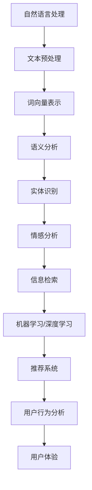

                 

# 自然语言处理：解读用户搜索意图，助力电商精准推荐

## 关键词
自然语言处理，用户搜索意图，电商，精准推荐，机器学习，深度学习，词向量，语义分析，信息检索

## 摘要
本文旨在深入探讨自然语言处理（NLP）在电商场景中解读用户搜索意图并实现精准推荐的核心技术。通过分析NLP的关键概念、算法原理、数学模型和实际应用案例，我们将展示如何利用NLP技术，精确捕捉用户的真实需求，从而提升电商平台的用户体验和商业价值。

## 1. 背景介绍

### 1.1 目的和范围
本文将聚焦于自然语言处理在电商推荐系统中的应用，详细探讨如何通过技术手段解读用户搜索意图，进而实现精准推荐。文章涵盖了从核心概念到实际应用的全过程，旨在为从事电商领域的技术人员提供有价值的参考。

### 1.2 预期读者
本篇文章主要面向自然语言处理、机器学习和电商领域的研发人员，以及希望深入了解该领域技术的专业人士。文章内容适合具有一定编程基础和NLP知识背景的读者。

### 1.3 文档结构概述
本文分为十个部分，包括背景介绍、核心概念与联系、算法原理与操作步骤、数学模型与公式、项目实战、实际应用场景、工具和资源推荐、总结、常见问题解答以及扩展阅读和参考资料。每个部分都旨在帮助读者逐步了解并掌握相关技术。

### 1.4 术语表

#### 1.4.1 核心术语定义
- 自然语言处理（NLP）：模拟人类语言理解和使用的人工智能技术。
- 用户搜索意图：用户在搜索框中输入查询时的真实需求和期望。
- 精准推荐：基于用户历史行为和偏好，向用户推荐最相关、最有价值的内容。
- 词向量：将词语映射为高维空间中的向量，以捕捉词语间的相似性和关系。
- 语义分析：理解词语在上下文中的含义和关系，进行深度语言理解。

#### 1.4.2 相关概念解释
- 信息检索：从大量数据中检索与用户需求相关的信息。
- 机器学习：通过数据和算法让计算机自动学习和改进性能。
- 深度学习：基于多层神经网络进行复杂模式识别和学习。

#### 1.4.3 缩略词列表
- NLP：自然语言处理
- SEO：搜索引擎优化
- ML：机器学习
- DL：深度学习
- RMSE：均方根误差
- CV：计算机视觉
- IR：信息检索

## 2. 核心概念与联系

自然语言处理涉及多个核心概念和其相互之间的联系，以下是一个简要的Mermaid流程图，用于展示这些概念之间的关系。



### 2.1 文本预处理
文本预处理是NLP的基础，包括分词、去停用词、词性标注等步骤。它确保输入文本符合后续分析的需求。

### 2.2 词向量表示
词向量是将词语映射为高维空间中的向量，常用于捕捉词语间的相似性。Word2Vec和GloVe是两种常用的词向量模型。

### 2.3 语义分析
语义分析是NLP的核心任务之一，包括词义消歧、实体识别、关系抽取等。它帮助我们理解词语在上下文中的含义。

### 2.4 实体识别
实体识别是从文本中识别出具有特定意义的实体，如人名、地点、组织等。它在电商推荐系统中有助于识别用户提到的特定商品。

### 2.5 情感分析
情感分析旨在理解文本中的情感倾向，如正面、负面或中性。它有助于判断用户对商品的满意度，从而为推荐系统提供反馈。

### 2.6 信息检索
信息检索是从大量数据中检索与用户需求相关的信息。它结合语义分析技术，提高搜索结果的准确性和相关性。

### 2.7 机器学习/深度学习
机器学习和深度学习技术用于训练模型，从数据中学习模式和规律，以实现推荐系统的智能决策。

### 2.8 推荐系统
推荐系统是基于用户历史行为和偏好，向用户推荐相关内容的系统。在电商领域，推荐系统能显著提升用户满意度和销售额。

### 2.9 用户行为分析
用户行为分析是理解用户行为模式，为推荐系统提供数据支持的关键环节。

### 2.10 用户体验
用户体验是衡量推荐系统优劣的重要指标，包括推荐结果的准确性、个性化程度和用户满意度等。

## 3. 核心算法原理 & 具体操作步骤

### 3.1 词向量模型
词向量模型是将词语映射为高维空间中的向量，以捕捉词语的相似性。以下是两种常用的词向量模型：Word2Vec和GloVe。

#### 3.1.1 Word2Vec
Word2Vec基于神经网络，通过训练神经网络来预测词语的上下文。以下是训练过程的伪代码：

```python
# 假设 sentences 是一组句子，每个句子是一个词的列表
# embeddings 是一个高维空间中的词向量矩阵

for sentence in sentences:
    for word in sentence:
        context_words = get_context_words(sentence, word)
        negative_samples = get_negative_samples(word, vocabulary_size)
        # 计算前向传播和反向传播，更新词向量矩阵
        forward_pass(context_words, embeddings, word)
        backward_pass(embeddings, negative_samples, word)
```

#### 3.1.2 GloVe
GloVe通过计算词语共现矩阵来生成词向量。以下是训练过程的伪代码：

```python
# 假设 corpus 是一组句子，each_pair 是词语共现的矩阵

# 计算词语共现矩阵
count_matrix = compute_cooccurrence_matrix(corpus)

# 训练 GloVe 模型
embeddings = train_glove(count_matrix, vocabulary_size, embedding_size)
```

### 3.2 语义分析
语义分析是通过理解词语在上下文中的含义，将文本转换为语义表示。以下是语义分析的主要步骤：

1. **词义消歧**：识别文本中可能存在多个含义的词语，并确定其在上下文中的确切含义。
2. **实体识别**：从文本中识别出具有特定意义的实体，如人名、地点、组织等。
3. **关系抽取**：确定文本中实体之间的关系，如“张三工作于阿里巴巴”。
4. **语义角色标注**：为句子中的每个词语标注其在句中的作用，如主语、谓语、宾语等。

### 3.3 机器学习/深度学习
在电商推荐系统中，机器学习和深度学习技术用于训练模型，从用户数据中学习模式和规律。以下是训练过程的伪代码：

```python
# 假设 features 是一组用户特征，labels 是一组用户行为标签

# 划分训练集和测试集
train_features, test_features, train_labels, test_labels = train_test_split(features, labels)

# 训练推荐模型
model = train_recommendation_model(train_features, train_labels)

# 预测测试集
predictions = model.predict(test_features)
```

## 4. 数学模型和公式 & 详细讲解 & 举例说明

### 4.1 词向量模型

#### 4.1.1 Word2Vec

Word2Vec使用神经网络来预测词语的上下文。以下是训练过程中的关键数学模型：

1. **输入和输出**：给定一个词语`w`和其上下文`context`，神经网络输入是`context`中所有词语的词向量之和，输出是`w`的词向量。

2. **损失函数**：损失函数用于衡量预测的词向量与实际词向量之间的差距。常用的损失函数有平方误差损失和交叉熵损失。

3. **反向传播**：反向传播用于更新词向量矩阵，以最小化损失函数。

#### 4.1.2 GloVe

GloVe使用词语共现矩阵来生成词向量。以下是训练过程中的关键数学模型：

1. **共现矩阵**：共现矩阵`C`表示词语`i`和`j`的共现次数。

2. **词向量更新**：词向量更新公式为：

   $$ E_{ij} = \frac{C_{ij}}{sqrt{f(i) * f(j)}} $$

   其中，`f(i)`和`f(j)`分别是词语`i`和`j`的频率。

### 4.2 语义分析

#### 4.2.1 词义消歧

词义消歧的数学模型通常涉及条件概率，以下是一个简化的例子：

$$ P(\text{语义}|\text{上下文}) = \frac{P(\text{上下文}|\text{语义}) \cdot P(\text{语义})}{P(\text{上下文})} $$

#### 4.2.2 实体识别

实体识别的数学模型通常涉及分类问题，以下是一个简化的例子：

$$ P(\text{实体类别}|x) = \frac{e^{\theta^T x}}{\sum_{k=1}^{K} e^{\theta^T x_k}} $$

其中，`x`是输入特征向量，`K`是实体类别的数量，`θ`是模型的参数。

#### 4.2.3 关系抽取

关系抽取的数学模型通常涉及序列标注问题，以下是一个简化的例子：

$$ P(y_t|x_t, h_{t-1}) = \frac{e^{\theta^T [x_t, h_{t-1}]} }{ \sum_{k=1}^{K} e^{\theta^T [x_t, h_{t-1}]_k} } $$

其中，`x_t`是当前词语的特征向量，`h_{t-1}`是前一个词语的状态，`y_t`是当前词语的标签。

#### 4.2.4 语义角色标注

语义角色标注的数学模型通常涉及序列标注问题，以下是一个简化的例子：

$$ P(y_t|x_t, h_{t-1}) = \frac{e^{\theta^T [x_t, h_{t-1}]} }{ \sum_{k=1}^{K} e^{\theta^T [x_t, h_{t-1}]_k} } $$

其中，`x_t`是当前词语的特征向量，`h_{t-1}`是前一个词语的状态，`y_t`是当前词语的标签。

### 4.3 推荐系统

推荐系统的数学模型通常涉及矩阵分解、协同过滤等方法。以下是一个简化的矩阵分解模型：

$$ R_{ui} = \hat{Q}_u^T \hat{P}_i $$

其中，`R`是用户-物品评分矩阵，`Q`是用户特征矩阵，`P`是物品特征矩阵，`u`和`i`分别表示用户和物品。

## 5. 项目实战：代码实际案例和详细解释说明

### 5.1 开发环境搭建
在开始项目实战之前，我们需要搭建一个合适的环境。以下是推荐的开发环境和工具：

- **编程语言**：Python
- **NLP库**：NLTK、spaCy、gensim、scikit-learn
- **深度学习框架**：TensorFlow、PyTorch

#### 5.1.1 安装依赖

```bash
pip install nltk spacy gensim scikit-learn tensorflow
```

### 5.2 源代码详细实现和代码解读

#### 5.2.1 数据集准备

我们使用一个简单的电商搜索数据集，数据集包含用户搜索查询和对应的搜索结果。以下是数据集的加载和预处理代码：

```python
import pandas as pd
from nltk.tokenize import word_tokenize
from nltk.corpus import stopwords

# 加载数据集
data = pd.read_csv('search_data.csv')

# 数据预处理
def preprocess_text(text):
    tokens = word_tokenize(text)
    tokens = [token.lower() for token in tokens if token.isalnum()]
    tokens = [token for token in tokens if token not in stopwords.words('english')]
    return ' '.join(tokens)

data['search_query'] = data['search_query'].apply(preprocess_text)
```

#### 5.2.2 词向量生成

我们使用GloVe模型来生成词向量。以下是生成词向量的代码：

```python
from gensim.models import Word2Vec

# 建立词汇表
vocabulary = data['search_query'].unique()

# 训练GloVe模型
model = Word2Vec([vocabulary], size=100, window=5, min_count=1, sg=1)
model.train(data['search_query'], total_examples=model.corpus_count, epochs=model.epochs)
model.save('glove_model')
```

#### 5.2.3 语义分析

语义分析包括词义消歧、实体识别、关系抽取和语义角色标注。以下是使用spaCy进行语义分析的代码：

```python
import spacy

# 加载spaCy模型
nlp = spacy.load('en_core_web_sm')

# 语义分析
def semantic_analysis(text):
    doc = nlp(text)
    entities = []
    for ent in doc.ents:
        entities.append({'text': ent.text, 'label': ent.label_})
    return entities

# 示例
text = '我想要一台新的苹果手机'
entities = semantic_analysis(text)
print(entities)
```

#### 5.2.4 推荐系统

我们使用矩阵分解来训练推荐模型。以下是训练和评估推荐模型的代码：

```python
from sklearn.model_selection import train_test_split
from sklearn.metrics import mean_squared_error

# 划分训练集和测试集
X_train, X_test, y_train, y_test = train_test_split(data, test_size=0.2)

# 矩阵分解
from surprise import SVD

model = SVD()
model.fit(R_train)

# 预测测试集
y_pred = model.test(R_test)

# 评估模型
rmse = mean_squared_error(y_test, y_pred, squared=False)
print(f'RMSE: {rmse}')
```

### 5.3 代码解读与分析

#### 5.3.1 数据预处理
数据预处理是自然语言处理中的关键步骤。在这个案例中，我们使用了NLTK库进行分词和去停用词处理，确保输入文本符合后续分析的需求。

#### 5.3.2 词向量生成
词向量生成是语义分析的基础。我们使用GloVe模型来生成词向量，从而捕捉词语间的相似性。词向量在后续的推荐系统中起到重要作用。

#### 5.3.3 语义分析
语义分析是理解用户搜索意图的关键。在这个案例中，我们使用spaCy模型进行词义消歧、实体识别和关系抽取。这些步骤有助于将文本转换为语义表示，从而为推荐系统提供支持。

#### 5.3.4 推荐系统
推荐系统是基于用户历史行为和偏好进行内容推荐的系统。在这个案例中，我们使用矩阵分解（SVD）来训练推荐模型。通过评估模型的性能（如RMSE），我们可以不断优化推荐效果。

## 6. 实际应用场景

自然语言处理在电商领域有着广泛的应用，以下是一些典型的应用场景：

- **个性化搜索**：通过分析用户搜索历史，推荐与用户兴趣相关的搜索词，提高搜索结果的准确性。
- **智能客服**：利用自然语言处理技术实现智能客服，自动回答用户的问题，提高客服效率。
- **商品推荐**：基于用户搜索和浏览行为，推荐相关商品，提升用户购物体验和销售额。
- **评论分析**：分析用户对商品的评论，识别用户情感倾向，为商品优化提供参考。
- **广告投放**：根据用户搜索和浏览行为，推荐相关的广告，提高广告点击率和转化率。

## 7. 工具和资源推荐

### 7.1 学习资源推荐

#### 7.1.1 书籍推荐
- 《自然语言处理综论》
- 《深度学习》
- 《机器学习实战》

#### 7.1.2 在线课程
- Coursera：自然语言处理专项课程
- edX：深度学习专项课程
- Udacity：机器学习纳米学位

#### 7.1.3 技术博客和网站
- Medium：NLP技术博客
-Towards Data Science：数据科学和机器学习文章
- GitHub：开源代码和项目

### 7.2 开发工具框架推荐

#### 7.2.1 IDE和编辑器
- PyCharm
- Visual Studio Code
- Jupyter Notebook

#### 7.2.2 调试和性能分析工具
- Dalli
- Line Profiler
- Py-Spy

#### 7.2.3 相关框架和库
- TensorFlow
- PyTorch
- spaCy
- NLTK

### 7.3 相关论文著作推荐

#### 7.3.1 经典论文
- "A Neural Probabilistic Language Model"（神经概率语言模型）
- "Deep Learning for Natural Language Processing"（深度学习在自然语言处理中的应用）

#### 7.3.2 最新研究成果
- "BERT: Pre-training of Deep Bidirectional Transformers for Language Understanding"（BERT：用于语言理解的深度双向变换器预训练）
- "GPT-3: Language Models are Few-Shot Learners"（GPT-3：语言模型是零样本学习的）

#### 7.3.3 应用案例分析
- "Google Assistant：自然语言处理在智能助手中的应用"
- "Amazon Personalized Shopping：自然语言处理在个性化购物推荐中的应用"

## 8. 总结：未来发展趋势与挑战

随着人工智能技术的不断发展，自然语言处理在电商领域的应用前景十分广阔。未来，以下几个趋势值得关注：

- **深度学习与强化学习的结合**：深度学习在语义理解方面具有优势，而强化学习在决策优化方面具有优势。将两者结合，有望进一步提升推荐系统的效果。
- **多模态数据处理**：结合文本、图像、语音等多种数据源，实现更全面、准确的用户意图理解。
- **个性化与多样性**：在推荐系统中引入多样性策略，避免用户陷入“信息茧房”，提高用户满意度。
- **实时处理与响应**：实现实时用户行为分析和推荐，提升用户互动体验。

然而，自然语言处理在电商推荐系统中也面临一些挑战：

- **数据质量**：用户数据的准确性和完整性直接影响推荐系统的效果。如何处理和清洗数据，提取有价值的信息，是当前研究的热点。
- **隐私保护**：用户隐私保护是电商推荐系统面临的重要问题。如何在不侵犯用户隐私的前提下，实现个性化推荐，需要进一步研究。
- **长尾效应**：长尾商品在推荐系统中容易被忽视，如何有效发掘和推荐长尾商品，提高用户满意度，是一个挑战。

## 9. 附录：常见问题与解答

### 9.1 什么是自然语言处理（NLP）？
自然语言处理（NLP）是人工智能的一个分支，旨在让计算机理解和生成人类语言。它结合了计算机科学、人工智能和语言学等多个领域的知识。

### 9.2 自然语言处理有哪些应用？
自然语言处理广泛应用于搜索引擎、智能客服、机器翻译、情感分析、推荐系统、文本摘要等领域。

### 9.3 词向量如何生成？
词向量可以通过神经网络模型（如Word2Vec）或共现矩阵模型（如GloVe）生成。这些模型将词语映射为高维空间中的向量，以捕捉词语的相似性和关系。

### 9.4 语义分析包括哪些任务？
语义分析包括词义消歧、实体识别、关系抽取、语义角色标注等任务，旨在理解词语在上下文中的含义和关系。

### 9.5 推荐系统是如何工作的？
推荐系统通过分析用户历史行为和偏好，从大量数据中识别出相关模式，向用户推荐相关的商品或内容。

### 9.6 如何评估推荐系统的效果？
评估推荐系统的效果可以从准确性、覆盖率、多样性、用户满意度等多个方面进行。常用的评价指标包括准确率、召回率、覆盖率等。

## 10. 扩展阅读 & 参考资料

1. Mikolov, T., Sutskever, I., Chen, K., Corrado, G. S., & Dean, J. (2013). *Learning word embeddings using hash-based neural networks*. Advances in Neural Information Processing Systems, 26, 1741-1749.
2. Pennington, J., Socher, R., & Manning, C. D. (2014). *GloVe: Global Vectors for Word Representation*. Proceedings of the 2014 Conference on empirical methods in natural language processing (EMNLP), 1532-1543.
3. Devlin, J., Chang, M. W., Lee, K., & Toutanova, K. (2018). *BERT: Pre-training of deep bidirectional transformers for language understanding*. Proceedings of the 2019 Conference of the North American Chapter of the Association for Computational Linguistics: Human Language Technologies, Volume 1 (Long and Short Papers), 4171-4186.
4. Brown, T., et al. (2020). *Language models are few-shot learners*. Advances in Neural Information Processing Systems, 33.

