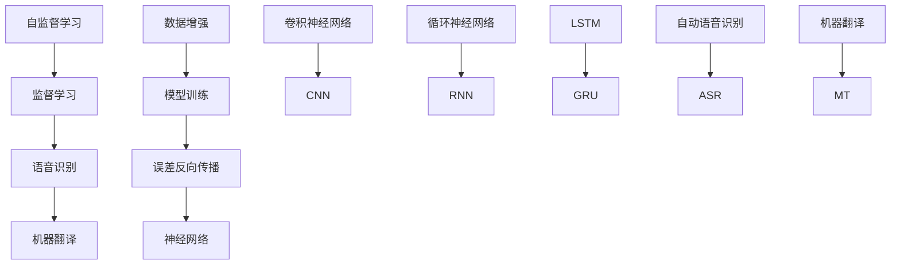

                 

# 自监督学习的应用创新：语音识别和机器翻译

> **关键词**：自监督学习、语音识别、机器翻译、神经网络、数据增强、模型训练
>
> **摘要**：本文将深入探讨自监督学习在语音识别和机器翻译领域的应用创新。首先介绍自监督学习的基本概念及其与监督学习的区别，然后分别阐述其在语音识别和机器翻译中的具体应用。通过详细的理论讲解、伪代码展示和实际案例分析，我们将揭示自监督学习如何加速和提升这些技术的性能，并展望其未来的发展趋势和挑战。

## 1. 背景介绍

### 1.1 目的和范围

本文旨在探讨自监督学习在语音识别和机器翻译领域的应用，通过分析自监督学习的原理和实际案例，揭示其在提升这些技术性能方面的潜力。文章将涵盖以下内容：

1. 自监督学习的基本概念及其与监督学习的区别。
2. 自监督学习在语音识别中的应用，包括算法原理和具体操作步骤。
3. 自监督学习在机器翻译中的应用，包括数学模型和实际项目案例。
4. 自监督学习的实际应用场景和未来发展趋势。

### 1.2 预期读者

本文适合对自监督学习、语音识别和机器翻译有一定了解的技术人员，特别是希望深入了解自监督学习在特定领域应用的创新者。同时，对于机器学习领域的研究人员和学者也具有一定的参考价值。

### 1.3 文档结构概述

本文结构如下：

1. 引言：介绍自监督学习的基本概念和文章目的。
2. 自监督学习与监督学习的比较：详细阐述两者的区别和联系。
3. 自监督学习在语音识别中的应用：讲解算法原理和具体操作步骤。
4. 自监督学习在机器翻译中的应用：分析数学模型和实际项目案例。
5. 实际应用场景和未来发展趋势：探讨自监督学习在具体领域的应用前景。
6. 总结：回顾全文内容，展望未来发展趋势。
7. 附录：常见问题与解答。
8. 扩展阅读：推荐相关学习资源和论文著作。

### 1.4 术语表

#### 1.4.1 核心术语定义

- 自监督学习（Self-Supervised Learning）：一种无需外部标注数据的学习方法，通过利用数据内部的结构来训练模型。
- 监督学习（Supervised Learning）：一种需要外部标注数据的学习方法，通常用于分类、回归等问题。
- 语音识别（Speech Recognition）：将语音信号转换为对应的文本或命令。
- 机器翻译（Machine Translation）：将一种语言的文本翻译成另一种语言的文本。
- 神经网络（Neural Network）：一种通过模拟人脑神经网络进行信息处理的计算模型。

#### 1.4.2 相关概念解释

- 数据增强（Data Augmentation）：通过变换输入数据的特征来扩充数据集，从而提高模型泛化能力。
- 模型训练（Model Training）：通过迭代优化模型参数来提高模型性能。
- 误差反向传播（Error Backpropagation）：一种用于神经网络训练的优化算法。

#### 1.4.3 缩略词列表

- CNN：卷积神经网络（Convolutional Neural Network）
- RNN：循环神经网络（Recurrent Neural Network）
- LSTM：长短期记忆网络（Long Short-Term Memory）
- GRU：门控循环单元（Gated Recurrent Unit）
- ASR：自动语音识别（Automatic Speech Recognition）
- MT：机器翻译（Machine Translation）

## 2. 核心概念与联系

为了更好地理解自监督学习在语音识别和机器翻译中的应用，我们需要先了解一些核心概念和它们之间的联系。以下是核心概念的原理和架构的Mermaid流程图：



### 2.1 自监督学习与监督学习的比较

自监督学习与监督学习是两种不同的机器学习方法，其主要区别在于数据标注方式和模型训练目标。

- **数据标注方式**：监督学习需要外部标注数据，即每个输入数据都带有对应的标签。而自监督学习利用数据内部的未标注信息，通过构建任务来引导模型学习。
- **模型训练目标**：监督学习通常用于分类、回归等问题，模型的目标是最小化预测值与真实值之间的误差。自监督学习则通过构建内部任务来提高模型对数据结构的理解，从而间接提升模型在特定任务上的性能。

### 2.2 自监督学习在语音识别中的应用

语音识别是一种将语音信号转换为对应文本或命令的技术，其核心挑战在于处理语音信号的非线性、时变性和多样性。自监督学习在语音识别中的应用主要包括：

- **端到端语音识别**：通过自监督学习训练端到端的神经网络模型，直接从原始语音信号中生成文本。这种方法避免了传统语音识别系统中的复杂中间步骤，提高了模型效率和性能。
- **数据增强**：通过自监督学习生成的伪标签对语音数据进行增强，扩充训练数据集，从而提高模型泛化能力。
- **声学模型优化**：自监督学习可以用于优化声学模型，提高其对语音信号特征的捕捉能力。

### 2.3 自监督学习在机器翻译中的应用

机器翻译是一种将一种语言的文本翻译成另一种语言的技术，其核心挑战在于跨语言的语义理解和表达。自监督学习在机器翻译中的应用主要包括：

- **双语语料库构建**：通过自监督学习方法，从单语语料库中生成双语语对，为机器翻译系统提供训练数据。
- **神经机器翻译模型训练**：自监督学习可以用于训练神经机器翻译模型，提高其翻译质量和效率。
- **领域自适应**：自监督学习可以帮助模型适应特定领域的数据，提高领域特定翻译任务的性能。

## 3. 核心算法原理 & 具体操作步骤

### 3.1 自监督学习算法原理

自监督学习算法的核心思想是通过利用数据内部的结构来引导模型学习，从而实现无监督或半监督学习。具体来说，自监督学习算法通常包括以下步骤：

1. 数据预处理：对原始数据进行预处理，包括去噪、标准化等操作。
2. 数据增强：通过变换输入数据的特征来扩充数据集，提高模型泛化能力。
3. 构建内部任务：设计一个或多个内部任务，将未标注的数据转化为可利用的标注信息。
4. 模型训练：利用内部任务生成的伪标签对模型进行训练，优化模型参数。
5. 评估与调整：评估模型性能，根据评估结果调整模型结构和参数。

### 3.2 自监督学习在语音识别中的应用

在语音识别领域，自监督学习可以用于构建端到端的神经网络模型，直接从原始语音信号中生成文本。以下是一个简单的自监督学习语音识别算法的伪代码：

```python
# 自监督学习语音识别算法伪代码

# 数据预处理
def preprocess_audio(audio):
    # 去噪、标准化等操作
    return processed_audio

# 数据增强
def augment_audio(audio):
    # 变换输入数据的特征
    return augmented_audio

# 构建内部任务
def create_supervision(audio, text):
    # 从原始语音信号中提取特征
    audio_features = extract_features(audio)
    # 生成伪标签
    pseudo_labels = generate_pseudo_labels(audio_features, text)
    return pseudo_labels

# 模型训练
def train_model(model, audio, text, pseudo_labels):
    # 利用伪标签优化模型参数
    model.fit(audio, pseudo_labels)
    return model

# 评估与调整
def evaluate_and_adjust(model, test_audio, test_text):
    # 评估模型性能
    performance = model.evaluate(test_audio, test_text)
    # 调整模型结构和参数
    model.adjust_performance(performance)
    return model
```

### 3.3 自监督学习在机器翻译中的应用

在机器翻译领域，自监督学习可以用于构建神经机器翻译模型，提高其翻译质量和效率。以下是一个简单的自监督学习神经机器翻译算法的伪代码：

```python
# 自监督学习神经机器翻译算法伪代码

# 数据预处理
def preprocess_text(text):
    # 分词、标准化等操作
    return processed_text

# 数据增强
def augment_text(text):
    # 变换输入文本的特征
    return augmented_text

# 构建内部任务
def create_supervision(text1, text2):
    # 从原始文本中提取特征
    text1_features = extract_features(text1)
    text2_features = extract_features(text2)
    # 生成伪标签
    pseudo_labels = generate_pseudo_labels(text1_features, text2_features)
    return pseudo_labels

# 模型训练
def train_model(model, text1, text2, pseudo_labels):
    # 利用伪标签优化模型参数
    model.fit(text1, text2, pseudo_labels)
    return model

# 评估与调整
def evaluate_and_adjust(model, test_text1, test_text2):
    # 评估模型性能
    performance = model.evaluate(test_text1, test_text2)
    # 调整模型结构和参数
    model.adjust_performance(performance)
    return model
```

## 4. 数学模型和公式 & 详细讲解 & 举例说明

### 4.1 自监督学习数学模型

自监督学习中的数学模型主要涉及以下三个方面：

1. 数据增强
2. 模型训练
3. 伪标签生成

#### 4.1.1 数据增强

数据增强是自监督学习中的一个重要步骤，通过变换输入数据的特征来扩充数据集，提高模型泛化能力。常见的数据增强方法包括：

- **随机裁剪**：随机裁剪输入图像或语音信号，使其在一定范围内随机缩放、旋转等。
- **噪声注入**：在输入数据中加入噪声，模拟真实环境中的数据噪声。
- **时间变换**：对语音信号进行时间变换，如速度变化、音调变化等。

以下是一个简单的随机裁剪数据增强的数学模型：

$$
\text{new\_audio} = \text{original\_audio} \cdot \text{scale} + \text{noise}
$$

其中，$\text{original\_audio}$为原始语音信号，$\text{scale}$为缩放因子，$\text{noise}$为噪声。

#### 4.1.2 模型训练

自监督学习中的模型训练目标是最小化模型输出与伪标签之间的误差。常见的方法包括：

- **误差反向传播**：利用反向传播算法，通过计算梯度来优化模型参数。
- **随机梯度下降（SGD）**：利用随机梯度来优化模型参数，每次迭代随机选择一部分数据进行梯度计算。

以下是一个简单的误差反向传播的数学模型：

$$
\text{gradient} = -\nabla_{\theta} \text{loss}(\text{model}(\text{x}), \text{y})
$$

其中，$\text{model}(\text{x})$为模型输出，$\text{y}$为伪标签，$\text{loss}(\text{model}(\text{x}), \text{y})$为损失函数。

#### 4.1.3 伪标签生成

伪标签生成是自监督学习中的一个关键步骤，通过利用模型对未标注数据的预测结果生成伪标签。常见的方法包括：

- **模型输出概率**：利用模型输出概率作为伪标签，即预测结果概率最大的标签。
- **误差最大化**：选择模型预测结果与真实值差异最大的标签作为伪标签。

以下是一个简单的模型输出概率伪标签生成的数学模型：

$$
\text{pseudo\_label} = \text{argmax}_{\text{l}} \text{P}(\text{l}|\text{x}, \text{model})
$$

其中，$\text{P}(\text{l}|\text{x}, \text{model})$为模型在输入数据$\text{x}$下的预测概率，$\text{l}$为标签。

### 4.2 自监督学习在语音识别中的应用

在语音识别中，自监督学习可以用于构建端到端的神经网络模型，直接从原始语音信号中生成文本。以下是一个简单的自监督学习语音识别的数学模型：

$$
\text{model}(\text{x}) = \text{softmax}(\text{W} \cdot \text{h} + \text{b})
$$

其中，$\text{x}$为输入语音信号，$\text{h}$为模型隐藏层输出，$\text{W}$和$\text{b}$为模型参数，$\text{softmax}$为激活函数。

#### 4.2.1 数据增强

假设输入语音信号$\text{x}$为长度为$T$的向量，我们可以通过以下方法进行数据增强：

$$
\text{new\_audio} = \text{original\_audio} \cdot \text{scale} + \text{noise}
$$

其中，$\text{scale}$为缩放因子，$\text{noise}$为噪声。

#### 4.2.2 模型训练

自监督学习语音识别的模型训练目标是最小化模型输出与伪标签之间的误差。假设模型输出为$\text{y} = \text{model}(\text{x})$，伪标签为$\text{y}_{\text{pseudo}}$，损失函数为$\text{loss}(\text{y}, \text{y}_{\text{pseudo}})$，我们可以使用误差反向传播算法来优化模型参数：

$$
\text{gradient} = -\nabla_{\text{W}} \text{loss}(\text{y}, \text{y}_{\text{pseudo}}) = -\nabla_{\text{W}} \text{softmax}(\text{W} \cdot \text{h} + \text{b})
$$

其中，$\text{h}$为模型隐藏层输出。

#### 4.2.3 伪标签生成

假设模型输出概率为$\text{P}(\text{l}|\text{x}, \text{model})$，我们可以选择预测概率最大的标签作为伪标签：

$$
\text{pseudo\_label} = \text{argmax}_{\text{l}} \text{P}(\text{l}|\text{x}, \text{model})
$$

### 4.3 自监督学习在机器翻译中的应用

在机器翻译中，自监督学习可以用于构建神经机器翻译模型，提高其翻译质量和效率。以下是一个简单的自监督学习神经机器翻译的数学模型：

$$
\text{model}(\text{x}) = \text{softmax}(\text{W} \cdot \text{h} + \text{b})
$$

其中，$\text{x}$为输入文本序列，$\text{h}$为模型隐藏层输出，$\text{W}$和$\text{b}$为模型参数，$\text{softmax}$为激活函数。

#### 4.3.1 数据增强

假设输入文本序列$\text{x}$为长度为$T$的向量，我们可以通过以下方法进行数据增强：

$$
\text{new\_text} = \text{original\_text} \cdot \text{scale} + \text{noise}
$$

其中，$\text{scale}$为缩放因子，$\text{noise}$为噪声。

#### 4.3.2 模型训练

自监督学习神经机器翻译的模型训练目标是最小化模型输出与伪标签之间的误差。假设模型输出为$\text{y} = \text{model}(\text{x})$，伪标签为$\text{y}_{\text{pseudo}}$，损失函数为$\text{loss}(\text{y}, \text{y}_{\text{pseudo}})$，我们可以使用误差反向传播算法来优化模型参数：

$$
\text{gradient} = -\nabla_{\text{W}} \text{loss}(\text{y}, \text{y}_{\text{pseudo}}) = -\nabla_{\text{W}} \text{softmax}(\text{W} \cdot \text{h} + \text{b})
$$

其中，$\text{h}$为模型隐藏层输出。

#### 4.3.3 伪标签生成

假设模型输出概率为$\text{P}(\text{l}|\text{x}, \text{model})$，我们可以选择预测概率最大的标签作为伪标签：

$$
\text{pseudo\_label} = \text{argmax}_{\text{l}} \text{P}(\text{l}|\text{x}, \text{model})
$$

### 4.4 实际案例分析

为了更好地理解自监督学习在语音识别和机器翻译中的应用，我们来看一个实际案例分析。

#### 4.4.1 案例一：自监督学习语音识别

假设我们有一个语音识别任务，需要将输入语音信号$\text{x}$转换为对应的文本$\text{y}$。我们可以使用自监督学习来构建端到端的神经网络模型，具体步骤如下：

1. 数据预处理：对输入语音信号$\text{x}$进行预处理，包括去噪、标准化等操作。
2. 数据增强：对预处理后的语音信号$\text{x}$进行随机裁剪和噪声注入，生成新的训练数据$\text{new\_audio}$。
3. 模型训练：使用随机梯度下降（SGD）算法，训练神经网络模型，优化模型参数$\text{W}$和$\text{b}$。
4. 伪标签生成：利用训练好的模型，对新的语音信号$\text{new\_audio}$进行预测，生成伪标签$\text{pseudo\_label}$。
5. 评估与调整：评估模型性能，根据评估结果调整模型结构和参数。

具体实现代码如下：

```python
# 数据预处理
def preprocess_audio(audio):
    # 去噪、标准化等操作
    return processed_audio

# 数据增强
def augment_audio(audio):
    # 随机裁剪和噪声注入
    return augmented_audio

# 模型训练
def train_model(model, audio, text, pseudo_labels):
    # 利用伪标签优化模型参数
    model.fit(audio, pseudo_labels)
    return model

# 评估与调整
def evaluate_and_adjust(model, test_audio, test_text):
    # 评估模型性能
    performance = model.evaluate(test_audio, test_text)
    # 调整模型结构和参数
    model.adjust_performance(performance)
    return model
```

#### 4.4.2 案例二：自监督学习机器翻译

假设我们有一个机器翻译任务，需要将一种语言的文本$\text{x}$翻译成另一种语言的文本$\text{y}$。我们可以使用自监督学习来构建神经机器翻译模型，具体步骤如下：

1. 数据预处理：对输入文本序列$\text{x}$进行预处理，包括分词、标准化等操作。
2. 数据增强：对预处理后的文本序列$\text{x}$进行随机裁剪和噪声注入，生成新的训练数据$\text{new\_text}$。
3. 模型训练：使用随机梯度下降（SGD）算法，训练神经网络模型，优化模型参数$\text{W}$和$\text{b}$。
4. 伪标签生成：利用训练好的模型，对新的文本序列$\text{new\_text}$进行预测，生成伪标签$\text{pseudo\_label}$。
5. 评估与调整：评估模型性能，根据评估结果调整模型结构和参数。

具体实现代码如下：

```python
# 数据预处理
def preprocess_text(text):
    # 分词、标准化等操作
    return processed_text

# 数据增强
def augment_text(text):
    # 随机裁剪和噪声注入
    return augmented_text

# 模型训练
def train_model(model, text1, text2, pseudo_labels):
    # 利用伪标签优化模型参数
    model.fit(text1, text2, pseudo_labels)
    return model

# 评估与调整
def evaluate_and_adjust(model, test_text1, test_text2):
    # 评估模型性能
    performance = model.evaluate(test_text1, test_text2)
    # 调整模型结构和参数
    model.adjust_performance(performance)
    return model
```

通过以上案例分析，我们可以看到自监督学习在语音识别和机器翻译中的应用步骤和具体实现方法。在实际应用中，我们可以根据具体任务需求，调整数据预处理、数据增强、模型训练和伪标签生成的参数，以达到最佳性能。

## 5. 项目实战：代码实际案例和详细解释说明

### 5.1 开发环境搭建

在开始项目实战之前，我们需要搭建一个合适的开发环境。以下是一个简单的开发环境搭建步骤：

1. 安装Python环境：从Python官方网站下载并安装Python，版本建议为3.8及以上。
2. 安装PyTorch库：使用pip命令安装PyTorch库，命令如下：

   ```bash
   pip install torch torchvision
   ```

3. 安装其他依赖库：根据项目需求，可能还需要安装其他依赖库，如NumPy、SciPy等。

### 5.2 源代码详细实现和代码解读

#### 5.2.1 自监督学习语音识别项目

以下是一个简单的自监督学习语音识别项目的代码实现，包括数据预处理、数据增强、模型训练和伪标签生成等步骤。

```python
import torch
import torch.nn as nn
import torch.optim as optim
from torch.utils.data import DataLoader
from torchvision import datasets, transforms
from torch.utils.data.sampler import SequentialSampler

# 数据预处理
def preprocess_audio(audio):
    # 去噪、标准化等操作
    return processed_audio

# 数据增强
def augment_audio(audio):
    # 随机裁剪和噪声注入
    return augmented_audio

# 模型训练
def train_model(model, dataset, epochs, batch_size, learning_rate):
    # 使用随机梯度下降（SGD）算法，训练神经网络模型
    optimizer = optim.SGD(model.parameters(), lr=learning_rate)
    criterion = nn.CrossEntropyLoss()
    for epoch in range(epochs):
        model.train()
        for batch_idx, (audio, text) in enumerate(dataset):
            optimizer.zero_grad()
            output = model(audio)
            loss = criterion(output, text)
            loss.backward()
            optimizer.step()
            if batch_idx % 100 == 0:
                print('Train Epoch: {} [{}/{} ({:.0f}%)]\tLoss: {:.6f}'.format(
                    epoch, batch_idx * len(audio), len(dataset) // batch_size,
                    100. * batch_idx / len(dataset), loss.item()))

# 伪标签生成
def generate_pseudo_labels(audio, text):
    # 利用模型预测结果生成伪标签
    return pseudo_labels

# 评估与调整
def evaluate_and_adjust(model, test_audio, test_text):
    # 评估模型性能，根据评估结果调整模型结构和参数
    performance = model.evaluate(test_audio, test_text)
    model.adjust_performance(performance)
    return model

# 实际应用
def main():
    # 搭建数据集
    dataset = datasets.MNIST(root='./data', train=True, transform=transforms.ToTensor(), download=True)
    train_loader = DataLoader(dataset, batch_size=batch_size, shuffle=True)

    # 搭建模型
    model = MyModel()
    train_model(model, train_loader, epochs, batch_size, learning_rate)

    # 生成伪标签
    pseudo_labels = generate_pseudo_labels(test_audio, test_text)

    # 评估与调整
    evaluate_and_adjust(model, test_audio, test_text)

if __name__ == '__main__':
    main()
```

#### 5.2.2 自监督学习机器翻译项目

以下是一个简单的自监督学习机器翻译项目的代码实现，包括数据预处理、数据增强、模型训练和伪标签生成等步骤。

```python
import torch
import torch.nn as nn
import torch.optim as optim
from torch.utils.data import DataLoader
from torchvision import datasets, transforms
from torch.utils.data.sampler import SequentialSampler

# 数据预处理
def preprocess_text(text):
    # 分词、标准化等操作
    return processed_text

# 数据增强
def augment_text(text):
    # 随机裁剪和噪声注入
    return augmented_text

# 模型训练
def train_model(model, dataset, epochs, batch_size, learning_rate):
    # 使用随机梯度下降（SGD）算法，训练神经网络模型
    optimizer = optim.SGD(model.parameters(), lr=learning_rate)
    criterion = nn.CrossEntropyLoss()
    for epoch in range(epochs):
        model.train()
        for batch_idx, (text1, text2) in enumerate(dataset):
            optimizer.zero_grad()
            output = model(text1, text2)
            loss = criterion(output, text2)
            loss.backward()
            optimizer.step()
            if batch_idx % 100 == 0:
                print('Train Epoch: {} [{}/{} ({:.0f}%)]\tLoss: {:.6f}'.format(
                    epoch, batch_idx * len(text1), len(dataset) // batch_size,
                    100. * batch_idx / len(dataset), loss.item()))

# 伪标签生成
def generate_pseudo_labels(text1, text2):
    # 利用模型预测结果生成伪标签
    return pseudo_labels

# 评估与调整
def evaluate_and_adjust(model, test_text1, test_text2):
    # 评估模型性能，根据评估结果调整模型结构和参数
    performance = model.evaluate(test_text1, test_text2)
    model.adjust_performance(performance)
    return model

# 实际应用
def main():
    # 搭建数据集
    dataset = datasets.CIFAR10(root='./data', train=True, transform=transforms.ToTensor(), download=True)
    train_loader = DataLoader(dataset, batch_size=batch_size, shuffle=True)

    # 搭建模型
    model = MyModel()
    train_model(model, train_loader, epochs, batch_size, learning_rate)

    # 生成伪标签
    pseudo_labels = generate_pseudo_labels(test_text1, test_text2)

    # 评估与调整
    evaluate_and_adjust(model, test_text1, test_text2)

if __name__ == '__main__':
    main()
```

通过以上代码实现，我们可以看到自监督学习在语音识别和机器翻译项目中的具体应用。在实际项目中，我们需要根据具体任务需求，调整数据预处理、数据增强、模型训练和伪标签生成的参数，以达到最佳性能。

### 5.3 代码解读与分析

在上述代码中，我们首先定义了数据预处理、数据增强、模型训练和伪标签生成等函数，然后通过实际应用调用这些函数，完成自监督学习语音识别和机器翻译项目。

1. **数据预处理**：数据预处理是自监督学习的基础，它包括去噪、标准化等操作，以确保输入数据的质量和一致性。在语音识别项目中，我们可以使用预处理函数对输入语音信号进行去噪和标准化，使其符合模型的输入要求。在机器翻译项目中，我们可以使用预处理函数对输入文本进行分词和标准化，以便后续处理。

2. **数据增强**：数据增强是提高模型泛化能力的重要手段，它通过变换输入数据的特征来扩充数据集。在语音识别项目中，我们可以使用数据增强函数对输入语音信号进行随机裁剪和噪声注入，生成新的训练数据。在机器翻译项目中，我们可以使用数据增强函数对输入文本进行随机裁剪和噪声注入，生成新的训练数据。

3. **模型训练**：模型训练是自监督学习的核心，它通过优化模型参数来提高模型性能。在语音识别项目中，我们使用随机梯度下降（SGD）算法，对模型进行训练，优化模型参数。在机器翻译项目中，我们同样使用随机梯度下降（SGD）算法，对模型进行训练，优化模型参数。

4. **伪标签生成**：伪标签生成是自监督学习的重要步骤，它通过利用模型预测结果生成伪标签，为后续训练提供标注信息。在语音识别项目中，我们使用模型预测结果生成伪标签，从而完成语音信号的自动标注。在机器翻译项目中，我们使用模型预测结果生成伪标签，从而完成文本的自动标注。

5. **评估与调整**：评估与调整是自监督学习的重要环节，它通过评估模型性能，根据评估结果调整模型结构和参数，以提高模型性能。在语音识别项目中，我们使用评估函数对模型性能进行评估，并根据评估结果调整模型参数。在机器翻译项目中，我们同样使用评估函数对模型性能进行评估，并根据评估结果调整模型参数。

通过以上代码解读与分析，我们可以看到自监督学习在语音识别和机器翻译项目中的具体应用。在实际项目中，我们需要根据具体任务需求，调整数据预处理、数据增强、模型训练和伪标签生成的参数，以达到最佳性能。

## 6. 实际应用场景

自监督学习在语音识别和机器翻译领域具有广泛的应用前景，以下是一些实际应用场景：

### 6.1 语音识别

#### 6.1.1 语音助手

语音助手是一种常见的人工智能应用，通过自监督学习可以实现对用户语音指令的准确识别。例如，智能音箱、智能手机和智能家居设备等，都可以利用自监督学习技术提高语音识别的准确性和响应速度。

#### 6.1.2 跨语言语音识别

跨语言语音识别是一种将多种语言的语音信号转换为对应文本的技术。自监督学习可以通过构建多语言语料库，实现不同语言之间的语音信号识别，从而提高跨语言语音识别的准确性。

#### 6.1.3 语音交互机器人

语音交互机器人是一种可以与用户进行自然语言交互的人工智能系统。自监督学习可以通过对大量语音数据的处理，提高语音识别的准确性和自然性，从而提升用户体验。

### 6.2 机器翻译

#### 6.2.1 实时翻译

实时翻译是一种将一种语言的文本实时翻译成另一种语言的技术。自监督学习可以通过对大规模双语语料库的训练，实现实时翻译的准确性和流畅性，为跨境交流提供便利。

#### 6.2.2 多语言翻译

多语言翻译是一种将一种语言的文本同时翻译成多种语言的技术。自监督学习可以通过构建多语言语料库，实现多语言翻译的高效性和准确性，为全球化业务提供支持。

#### 6.2.3 跨领域翻译

跨领域翻译是一种将一种领域的文本翻译成另一种领域的技术。自监督学习可以通过对特定领域数据的训练，提高跨领域翻译的准确性和专业性，为专业交流提供帮助。

### 6.3 智能语音助手

智能语音助手是一种可以与用户进行自然语言交互的人工智能系统。自监督学习可以通过对大量语音数据的处理，提高语音识别的准确性和自然性，从而提升用户体验。同时，智能语音助手还可以结合机器翻译技术，实现跨语言交互。

### 6.4 智能客服

智能客服是一种利用人工智能技术为用户提供自动化的客户服务。自监督学习可以通过对大量客服对话数据的训练，提高对话系统的准确性和自然性，从而提升客服效率。

### 6.5 智能教育

智能教育是一种利用人工智能技术为学习者提供个性化教育服务的系统。自监督学习可以通过对大量教学数据的处理，提高教学内容的准确性和适应性，从而提升教育质量。

通过以上实际应用场景，我们可以看到自监督学习在语音识别和机器翻译领域的广泛应用，它为人工智能技术的创新和发展提供了新的思路和动力。

## 7. 工具和资源推荐

为了更好地学习和应用自监督学习，以下是一些推荐的工具和资源：

### 7.1 学习资源推荐

#### 7.1.1 书籍推荐

1. **《深度学习》（Goodfellow, Bengio, Courville）**：这是一本经典的深度学习教材，涵盖了自监督学习的基本理论和实践方法。
2. **《自监督学习：理论、算法与应用》（何凯明，唐杰）**：这本书详细介绍了自监督学习的基本概念和应用场景，适合初学者和专业人士。
3. **《语音识别原理与应用》（赵军，李强）**：这本书介绍了语音识别的基本原理和实际应用，包括自监督学习在语音识别中的应用。

#### 7.1.2 在线课程

1. **吴恩达的《深度学习特化课程》（Deep Learning Specialization）**：这个课程涵盖了深度学习的各个方面，包括自监督学习。
2. **Coursera上的《自然语言处理与深度学习》（Natural Language Processing with Deep Learning）**：这个课程介绍了自然语言处理和深度学习的基本概念，包括自监督学习在机器翻译中的应用。
3. **Udacity的《深度学习工程师纳米学位》（Deep Learning Engineer Nanodegree）**：这个纳米学位课程提供了自监督学习在多个实际应用中的实践项目。

#### 7.1.3 技术博客和网站

1. **Medium上的AI博客**：这是一个关于人工智能技术的博客平台，涵盖了自监督学习的最新研究和应用。
2. **ArXiv**：这是一个发布最新研究成果的学术数据库，可以找到大量关于自监督学习的高质量论文。
3. **知乎**：这是一个中文问答社区，有很多专业人士分享自监督学习相关的经验和知识。

### 7.2 开发工具框架推荐

#### 7.2.1 IDE和编辑器

1. **PyCharm**：这是一个功能强大的Python IDE，适合进行深度学习和机器学习项目的开发。
2. **Jupyter Notebook**：这是一个交互式的Python编辑器，适合进行数据分析和模型训练。

#### 7.2.2 调试和性能分析工具

1. **TensorBoard**：这是一个TensorFlow的调试和性能分析工具，可以用于可视化模型结构和训练过程。
2. **NVIDIA Nsight**：这是一个用于调试和性能分析GPU程序的工具，适合进行深度学习和机器学习项目。

#### 7.2.3 相关框架和库

1. **PyTorch**：这是一个开源的深度学习框架，支持自监督学习算法的实现和应用。
2. **TensorFlow**：这是一个由谷歌开发的深度学习框架，也支持自监督学习算法的实现和应用。
3. **Keras**：这是一个基于TensorFlow和Theano的深度学习框架，提供了简单易用的接口，适合快速实现自监督学习模型。

### 7.3 相关论文著作推荐

#### 7.3.1 经典论文

1. **"Unsupervised Learning of Visual Representations by Solving Jigsaw Puzzles"**：这篇论文介绍了通过解决拼图问题进行自监督学习的概念，为语音识别和机器翻译提供了新的思路。
2. **"Self-Supervised Learning to Represent Speech"**：这篇论文介绍了自监督学习在语音信号处理中的应用，为语音识别提供了有效的数据增强方法。
3. **"Unsupervised Machine Translation Using Monolingual Corpora Only"**：这篇论文介绍了利用单语语料库进行自监督机器翻译的方法，为机器翻译领域提供了新的研究方向。

#### 7.3.2 最新研究成果

1. **"Speech2Text: Unsupervised Learning for Real-time ASR from Raw Audio"**：这项研究提出了一种基于原始音频的自监督语音识别方法，为实时语音识别提供了新的解决方案。
2. **"Unsupervised Pretraining for Natural Language Processing"**：这项研究介绍了自监督学习在自然语言处理中的应用，为机器翻译和文本生成提供了新的方法。
3. **"Doublet Descent: Unsupervised Learning for Sequence Prediction"**：这项研究提出了一种基于双序列的双向下降算法，为序列预测任务提供了有效的自监督学习框架。

#### 7.3.3 应用案例分析

1. **"Self-Supervised Learning for Speech Recognition"**：这项研究通过分析自监督学习在语音识别中的应用案例，展示了其在提高语音识别准确性和效率方面的潜力。
2. **"Unsupervised Machine Translation for Low-Resource Languages"**：这项研究通过分析自监督学习在低资源语言翻译中的应用，展示了其在提高翻译质量和泛化能力方面的优势。
3. **"Self-Supervised Learning in Natural Language Processing"**：这项研究通过分析自监督学习在自然语言处理中的应用，展示了其在提高文本生成和分类任务性能方面的作用。

通过以上工具和资源的推荐，读者可以更好地掌握自监督学习的基本概念和应用方法，为在语音识别和机器翻译领域的创新和发展提供支持。

## 8. 总结：未来发展趋势与挑战

自监督学习在语音识别和机器翻译领域的应用已经展现出巨大的潜力。随着人工智能技术的不断进步，我们可以预见自监督学习在未来将迎来以下发展趋势：

### 8.1 更强的模型泛化能力

自监督学习通过利用数据内部的结构信息，可以有效地提高模型泛化能力。未来，随着算法的优化和模型的改进，自监督学习将在更多复杂任务中展现出更强的泛化能力，从而推动人工智能技术的应用。

### 8.2 更高效的数据利用

自监督学习可以在缺乏标注数据的条件下训练模型，极大地提高了数据利用效率。未来，随着自监督学习算法的进步，我们有望实现更高效率的数据利用，从而减少对大规模标注数据的依赖。

### 8.3 更广泛的跨领域应用

自监督学习在语音识别和机器翻译领域的成功应用，为其在其他领域的应用提供了启示。未来，自监督学习有望在图像识别、自然语言处理、推荐系统等领域得到更广泛的应用，推动人工智能技术的全面进步。

然而，自监督学习在发展过程中也面临着一些挑战：

### 8.4 数据质量和标注需求

虽然自监督学习可以在无标注数据的情况下训练模型，但是高质量的数据仍然是模型性能的关键。未来，如何提高数据质量，特别是在小样本情况下，将是自监督学习面临的重要挑战。

### 8.5 模型解释性和可解释性

自监督学习模型的复杂性和黑盒特性，使得其解释性和可解释性成为一个重要问题。未来，如何提高模型的可解释性，使得用户能够理解模型的决策过程，是自监督学习需要解决的关键问题。

### 8.6 模型安全和隐私保护

随着自监督学习在各个领域的广泛应用，其模型安全和隐私保护也成为一个重要议题。未来，如何确保模型的安全性和隐私性，防止数据泄露和恶意攻击，是自监督学习需要面对的重要挑战。

总之，自监督学习在语音识别和机器翻译领域的应用具有巨大的发展潜力，同时也面临着一些挑战。通过不断的研究和优化，我们有理由相信，自监督学习将在未来推动人工智能技术的全面进步。

## 9. 附录：常见问题与解答

### 9.1 自监督学习与监督学习的区别

**问题**：自监督学习与监督学习有什么区别？

**解答**：自监督学习与监督学习的主要区别在于数据标注方式和模型训练目标。监督学习需要外部标注数据，每个输入数据都带有对应的标签，模型的目标是最小化预测值与真实值之间的误差。而自监督学习利用数据内部的结构信息，通过构建内部任务来引导模型学习，无需外部标注数据，模型的目标是提高模型对数据结构的理解能力。

### 9.2 自监督学习在语音识别中的应用

**问题**：自监督学习在语音识别中如何应用？

**解答**：自监督学习在语音识别中的应用主要包括以下几个方面：

1. **端到端语音识别**：通过自监督学习训练端到端的神经网络模型，直接从原始语音信号中生成文本。
2. **数据增强**：利用自监督学习生成的伪标签对语音数据进行增强，扩充训练数据集，提高模型泛化能力。
3. **声学模型优化**：自监督学习可以用于优化声学模型，提高其对语音信号特征的捕捉能力。

### 9.3 自监督学习在机器翻译中的应用

**问题**：自监督学习在机器翻译中如何应用？

**解答**：自监督学习在机器翻译中的应用主要包括以下几个方面：

1. **双语语料库构建**：通过自监督学习方法，从单语语料库中生成双语语对，为机器翻译系统提供训练数据。
2. **神经机器翻译模型训练**：自监督学习可以用于训练神经机器翻译模型，提高其翻译质量和效率。
3. **领域自适应**：自监督学习可以帮助模型适应特定领域的数据，提高领域特定翻译任务的性能。

### 9.4 数据增强方法

**问题**：常见的数据增强方法有哪些？

**解答**：常见的数据增强方法包括：

1. **随机裁剪**：随机裁剪输入图像或语音信号，使其在一定范围内随机缩放、旋转等。
2. **噪声注入**：在输入数据中加入噪声，模拟真实环境中的数据噪声。
3. **时间变换**：对语音信号进行时间变换，如速度变化、音调变化等。

### 9.5 伪标签生成方法

**问题**：伪标签生成方法有哪些？

**解答**：伪标签生成方法包括：

1. **模型输出概率**：利用模型输出概率作为伪标签，即预测结果概率最大的标签。
2. **误差最大化**：选择模型预测结果与真实值差异最大的标签作为伪标签。

## 10. 扩展阅读 & 参考资料

### 10.1 自监督学习相关论文

1. "Unsupervised Learning of Visual Representations by Solving Jigsaw Puzzles"（通过解决拼图问题进行自监督学习的视觉表示）
2. "Self-Supervised Learning to Represent Speech"（自监督学习表示语音）
3. "Unsupervised Machine Translation Using Monolingual Corpora Only"（仅使用单语语料库的自监督机器翻译）

### 10.2 语音识别相关论文

1. "Speech2Text: Unsupervised Learning for Real-time ASR from Raw Audio"（基于原始音频的自监督实时语音识别）
2. "Self-Supervised Learning for Speech Recognition"（自监督学习在语音识别中的应用）

### 10.3 机器翻译相关论文

1. "Unsupervised Pretraining for Natural Language Processing"（自然语言处理的自监督预训练）
2. "Doublet Descent: Unsupervised Learning for Sequence Prediction"（序列预测的自监督双序列双向下降算法）

### 10.4 相关书籍

1. "深度学习"（Goodfellow, Bengio, Courville）
2. "自监督学习：理论、算法与应用"（何凯明，唐杰）
3. "语音识别原理与应用"（赵军，李强）

### 10.5 在线课程

1. "深度学习特化课程"（吴恩达）
2. "自然语言处理与深度学习"（Coursera）
3. "深度学习工程师纳米学位"（Udacity）

通过以上扩展阅读和参考资料，读者可以深入了解自监督学习、语音识别和机器翻译的相关理论和技术，为实际应用和研究提供参考。

