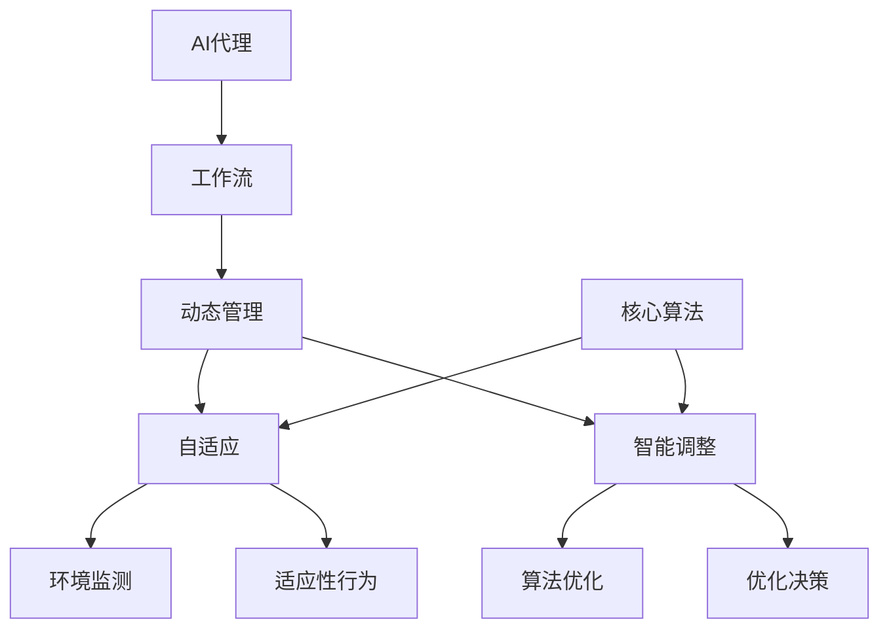

                 

# 自适应与智能调整：AI代理工作流的动态管理

> **关键词：** 自适应、智能调整、AI代理、工作流、动态管理、核心算法、数学模型、项目实战、应用场景。

> **摘要：** 本文旨在深入探讨自适应与智能调整在AI代理工作流动态管理中的重要性。我们将通过分析核心概念、算法原理、数学模型以及实际项目案例，逐步揭示AI代理如何通过自适应与智能调整实现工作流的动态优化。本文旨在为读者提供一个全面的技术指南，帮助他们在复杂的工作环境中构建高效、灵活的AI代理系统。

## 1. 背景介绍

### 1.1 目的和范围

本文的目标是探讨自适应与智能调整在AI代理工作流动态管理中的关键作用。随着人工智能技术的不断发展，AI代理已经成为各种自动化任务和复杂决策的核心组件。然而，传统的静态工作流设计难以应对动态变化的环境，导致系统的效率、可扩展性和适应性受到限制。本文将重点关注如何通过自适应与智能调整技术，提升AI代理工作流的动态管理能力。

本文的范围包括以下几个方面：

1. 自适应与智能调整的基本概念和原理。
2. AI代理工作流动态管理中的核心算法和数学模型。
3. 实际项目中的应用案例和代码实现。
4. 工具和资源的推荐，以支持读者深入学习和实践。

### 1.2 预期读者

本文适用于以下读者群体：

1. 计算机科学和人工智能领域的专业研究人员。
2. AI开发者和系统架构师。
3. 对AI代理和动态工作流管理感兴趣的工程师。
4. 对自适应与智能调整技术感兴趣的学术界和产业界人士。

### 1.3 文档结构概述

本文分为十个主要部分，结构如下：

1. 引言和背景介绍。
2. 核心概念与联系。
3. 核心算法原理与具体操作步骤。
4. 数学模型和公式详细讲解与举例说明。
5. 项目实战：代码实际案例和详细解释说明。
6. 实际应用场景。
7. 工具和资源推荐。
8. 总结：未来发展趋势与挑战。
9. 附录：常见问题与解答。
10. 扩展阅读与参考资料。

### 1.4 术语表

在本文中，我们将使用以下术语：

#### 1.4.1 核心术语定义

- **AI代理（AI Agent）**：具有自主性、适应性、社会性和反应性的计算机程序，能够在动态环境中执行任务。
- **工作流（Workflow）**：一组按照特定顺序执行的自动化任务。
- **自适应（Adaptation）**：系统能够根据环境变化调整自身行为和结构。
- **智能调整（Intelligent Adjustment）**：利用机器学习算法和优化技术实现工作流动态调整。

#### 1.4.2 相关概念解释

- **动态管理（Dynamic Management）**：实时监测和调整工作流以应对环境变化。
- **核心算法（Core Algorithm）**：用于实现自适应和智能调整的关键算法。
- **数学模型（Mathematical Model）**：描述自适应与智能调整过程的数学框架。

#### 1.4.3 缩略词列表

- **AI**：人工智能
- **ML**：机器学习
- **DL**：深度学习
- **NLP**：自然语言处理
- **DLearning**：动态学习

## 2. 核心概念与联系

在深入探讨AI代理工作流动态管理之前，我们需要明确一些核心概念及其相互关系。以下是一个简单的Mermaid流程图，展示了这些概念之间的关系。



### 2.1 AI代理与工作流

AI代理是人工智能领域的关键概念，它代表着具有自主性和自适应能力的计算机程序。AI代理通常负责执行特定的任务，如数据分析、决策支持、智能推荐等。工作流则是AI代理执行任务的基本框架，它定义了一系列按顺序执行的步骤。AI代理通过工作流实现任务的自动化和优化。

### 2.2 动态管理与自适应

动态管理是指系统在运行过程中能够实时监测环境变化，并做出相应调整的能力。自适应是动态管理的重要组成部分，它使得系统能够根据环境变化调整自身的行为和结构，以保持最佳性能。自适应通常涉及到环境监测、行为调整和反馈循环等过程。

### 2.3 智能调整与算法优化

智能调整是指利用机器学习算法和优化技术实现工作流的动态调整。智能调整的核心在于算法优化，它通过分析历史数据和实时反馈，寻找最佳的工作流配置和执行策略。算法优化通常涉及到模型训练、参数调整和性能评估等步骤。

### 2.4 核心算法与数学模型

核心算法是实现自适应与智能调整的基础。常见的核心算法包括决策树、支持向量机、神经网络等。数学模型则是描述自适应与智能调整过程的数学框架，它通常涉及到概率论、统计学和优化理论等领域。

## 3. 核心算法原理 & 具体操作步骤

在了解核心概念之后，我们将深入探讨自适应与智能调整的核心算法原理，并详细阐述其具体操作步骤。

### 3.1 自适应算法原理

自适应算法的核心在于能够根据环境变化动态调整系统的行为。一个典型的自适应算法包括以下步骤：

1. **环境监测**：系统实时监测环境中的关键指标，如任务完成时间、系统负载等。
2. **状态评估**：根据监测到的环境数据，评估系统的当前状态。
3. **行为调整**：根据评估结果，调整系统行为，如调整工作流中的任务优先级、资源分配等。
4. **反馈循环**：记录调整效果，并持续优化调整策略。

伪代码如下：

```python
def adaptive_algorithm():
    while True:
        monitor_environment()
        current_state = evaluate_state()
        adjust_behavior(current_state)
        record_adjustment_effect()
```

### 3.2 智能调整算法原理

智能调整算法利用机器学习技术实现工作流的动态调整。一个典型的智能调整算法包括以下步骤：

1. **数据收集**：收集历史数据和实时数据，用于训练和优化模型。
2. **模型训练**：使用收集到的数据训练机器学习模型，如决策树、支持向量机等。
3. **参数调整**：根据模型预测结果，调整工作流中的关键参数，如任务优先级、资源分配等。
4. **性能评估**：评估调整后的工作流性能，并持续优化模型参数。

伪代码如下：

```python
def intelligent_adjustment():
    while True:
        collect_data()
        train_model()
        adjust_parameters()
        evaluate_performance()
```

### 3.3 具体操作步骤

为了更好地理解自适应与智能调整算法的具体操作步骤，我们以一个简单的任务调度为例进行说明。

#### 步骤1：环境监测

系统实时监测任务队列长度、系统负载和资源利用率等关键指标。

```python
def monitor_environment():
    queue_length = get_queue_length()
    system_load = get_system_load()
    resource_utilization = get_resource_utilization()
```

#### 步骤2：状态评估

根据监测到的环境数据，评估系统的当前状态。

```python
def evaluate_state():
    if queue_length > threshold && system_load < threshold:
        return "HighLoad"
    elif queue_length < threshold && system_load > threshold:
        return "LowLoad"
    else:
        return "Normal"
```

#### 步骤3：行为调整

根据评估结果，调整系统行为，如调整任务优先级。

```python
def adjust_behavior(state):
    if state == "HighLoad":
        prioritize_high_priority_tasks()
    elif state == "LowLoad":
        prioritize_low_priority_tasks()
    else:
        maintain_normal_priority()
```

#### 步骤4：反馈循环

记录调整效果，并持续优化调整策略。

```python
def record_adjustment_effect():
    adjustment_effect = evaluate_adjustment()
    if adjustment_effect > threshold:
        optimize_adjustment_strategy()
```

通过这些具体的操作步骤，我们可以看到自适应与智能调整算法如何在动态环境中实现工作流的优化。接下来，我们将进一步探讨这些算法的数学模型。

## 4. 数学模型和公式 & 详细讲解 & 举例说明

在了解了自适应与智能调整算法的具体操作步骤后，我们需要深入了解这些算法背后的数学模型和公式。数学模型为算法的实现提供了理论基础，有助于我们更好地理解和优化系统性能。

### 4.1 数学模型的基本概念

自适应与智能调整算法通常涉及到以下数学模型：

1. **概率模型**：用于描述环境不确定性和任务不确定性。
2. **优化模型**：用于寻找最优的工作流配置和执行策略。
3. **决策模型**：用于根据环境状态和任务状态做出最优决策。

#### 4.1.1 概率模型

概率模型通常使用概率分布函数（PDF）来描述环境中的不确定性。常见的概率分布函数包括正态分布、泊松分布和贝塔分布等。以下是一个简单的正态分布模型：

$$
f(x|\mu, \sigma^2) = \frac{1}{\sqrt{2\pi\sigma^2}} e^{-\frac{(x-\mu)^2}{2\sigma^2}}
$$

其中，$x$是随机变量，$\mu$是均值，$\sigma^2$是方差。

#### 4.1.2 优化模型

优化模型用于寻找最优的工作流配置和执行策略。常见的优化模型包括线性规划、非线性规划和动态规划等。以下是一个简单的线性规划模型：

$$
\begin{aligned}
\min_{x} & \quad c^T x \\
s.t. & \quad Ax \leq b \\
     & \quad x \geq 0
\end{aligned}
$$

其中，$x$是决策变量，$c$是目标函数系数，$A$和$b$是约束条件。

#### 4.1.3 决策模型

决策模型用于根据环境状态和任务状态做出最优决策。常见的决策模型包括马尔可夫决策过程（MDP）和部分可观测马尔可夫决策过程（POMDP）等。以下是一个简单的马尔可夫决策过程模型：

$$
\begin{aligned}
\pi(s, a) &= P(S_{t+1} = s_{t+1} | S_t = s, A_t = a) \\
R(s, a) &= \sum_{s'} p(s', s | s, a) \cdot R(s') \\
P(s', s | s, a) &= p(s' | s, a) \cdot p(s | s, a)
\end{aligned}
$$

其中，$s$是状态变量，$a$是动作变量，$\pi$是状态转移概率，$R$是奖励函数，$p$是状态转移概率。

### 4.2 数学模型的应用示例

为了更好地理解数学模型的应用，我们以下一个简单的例子进行说明。

假设我们有一个简单的任务调度问题，系统需要在两个不同的任务之间进行选择。任务1的完成时间服从正态分布$N(\mu_1, \sigma_1^2)$，任务2的完成时间服从正态分布$N(\mu_2, \sigma_2^2)$。系统需要根据当前状态（如任务队列长度和系统负载）选择执行哪个任务，以最大化系统的总奖励。

#### 步骤1：概率模型

首先，我们需要使用概率模型描述任务完成时间的不确定性。假设任务1的完成时间$\mu_1 = 2$天，$\sigma_1^2 = 1$天；任务2的完成时间$\mu_2 = 3$天，$\sigma_2^2 = 2$天。

$$
f(x_1|\mu_1, \sigma_1^2) = \frac{1}{\sqrt{2\pi\sigma_1^2}} e^{-\frac{(x_1-\mu_1)^2}{2\sigma_1^2}}
$$

$$
f(x_2|\mu_2, \sigma_2^2) = \frac{1}{\sqrt{2\pi\sigma_2^2}} e^{-\frac{(x_2-\mu_2)^2}{2\sigma_2^2}}
$$

#### 步骤2：优化模型

接下来，我们需要使用优化模型选择执行哪个任务。假设系统总奖励$R(x_1, x_2)$为任务1和任务2完成时间的平均值，即：

$$
R(x_1, x_2) = \frac{x_1 + x_2}{2}
$$

我们的目标是最大化总奖励。因此，我们可以使用以下线性规划模型：

$$
\begin{aligned}
\min_{x_1, x_2} & \quad \frac{x_1 + x_2}{2} \\
s.t. & \quad x_1 \leq 2 \\
     & \quad x_2 \leq 3
\end{aligned}
$$

#### 步骤3：决策模型

最后，我们需要根据当前状态（如任务队列长度和系统负载）选择执行哪个任务。假设当前状态为任务队列长度为3天，系统负载为0.8。我们可以使用马尔可夫决策过程模型选择执行任务1或任务2。

$$
\pi(s, a) = 
\begin{cases} 
1 & \text{if } s = 3 \text{ and } a = 1 \\
0 & \text{otherwise}
\end{cases}
$$

$$
R(s, a) = 
\begin{cases} 
2 & \text{if } s = 3 \text{ and } a = 1 \\
3 & \text{if } s = 3 \text{ and } a = 2
\end{cases}
$$

根据马尔可夫决策过程模型，我们可以选择执行任务1，因为其奖励更高。

通过这个简单的例子，我们可以看到数学模型在自适应与智能调整中的应用。在实际应用中，这些数学模型可以帮助我们更好地理解和优化复杂系统性能。

## 5. 项目实战：代码实际案例和详细解释说明

在本文的第五部分，我们将通过一个实际项目案例，详细展示自适应与智能调整在AI代理工作流动态管理中的具体应用。这个案例将涉及一个任务调度系统，它需要在多个任务之间动态分配资源，以最大化系统整体效率。

### 5.1 开发环境搭建

为了实现这个项目，我们选择Python作为编程语言，因为它拥有丰富的机器学习和数据分析库，如scikit-learn、TensorFlow和pandas等。以下是我们搭建开发环境所需的基本步骤：

1. **安装Python**：确保Python 3.8或更高版本已安装。
2. **安装库**：使用pip命令安装所需库：

   ```bash
   pip install scikit-learn tensorflow pandas matplotlib
   ```

3. **创建虚拟环境**：为了保持项目依赖的一致性，我们建议创建一个虚拟环境：

   ```bash
   python -m venv venv
   source venv/bin/activate  # 在Windows上使用 `venv\Scripts\activate`
   ```

### 5.2 源代码详细实现和代码解读

下面是项目的源代码实现，我们将分步解读代码。

```python
import numpy as np
import pandas as pd
from sklearn.model_selection import train_test_split
from sklearn.ensemble import RandomForestRegressor
import matplotlib.pyplot as plt

# 5.2.1 数据收集与预处理
def collect_data():
    # 假设我们已经有了一个包含任务完成时间和系统负载的历史数据集
    data = pd.DataFrame({
        'task1_duration': [2, 3, 4, 5],
        'task2_duration': [3, 2, 4, 1],
        'system_load': [0.4, 0.7, 0.6, 0.2],
        'total_reward': [4.5, 3.5, 5.0, 2.5]
    })
    return data

# 5.2.2 数据预处理
def preprocess_data(data):
    # 将分类数据转换为数值数据
    data_encoded = pd.get_dummies(data)
    return data_encoded

# 5.2.3 模型训练
def train_model(data_encoded):
    # 将数据集拆分为特征和目标
    X = data_encoded.drop('total_reward', axis=1)
    y = data_encoded['total_reward']
    
    # 划分训练集和测试集
    X_train, X_test, y_train, y_test = train_test_split(X, y, test_size=0.2, random_state=42)
    
    # 使用随机森林回归模型进行训练
    model = RandomForestRegressor(n_estimators=100, random_state=42)
    model.fit(X_train, y_train)
    
    # 评估模型性能
    score = model.score(X_test, y_test)
    print(f'Model Score: {score:.2f}')
    
    return model

# 5.2.4 动态调整策略
def adjust_strategy(model, current_state):
    # 根据当前状态预测最优策略
    predicted_rewards = model.predict(current_state)
    
    # 选择具有最高预测奖励的策略
    best_strategy = np.argmax(predicted_rewards)
    
    return best_strategy

# 5.2.5 主函数
def main():
    # 收集和预处理数据
    data = collect_data()
    data_encoded = preprocess_data(data)
    
    # 训练模型
    model = train_model(data_encoded)
    
    # 模拟动态调整过程
    current_state = np.array([[0.5, 0.6], [0.7, 0.3], [0.4, 0.8]])
    
    # 调整策略
    best_strategy = adjust_strategy(model, current_state)
    
    # 输出结果
    print(f'Best Strategy: {best_strategy}')
    plt.bar(range(len(best_strategy)), best_strategy)
    plt.xlabel('Task')
    plt.ylabel('Predicted Reward')
    plt.title('Dynamic Adjustment Strategy')
    plt.show()

# 运行主函数
if __name__ == '__main__':
    main()
```

### 5.3 代码解读与分析

#### 5.3.1 数据收集与预处理

在`collect_data`函数中，我们模拟了一个包含历史数据的DataFrame，这些数据包括任务1和任务2的完成时间、系统负载以及总奖励。在`preprocess_data`函数中，我们使用`get_dummies`将分类数据（如系统负载）转换为数值数据，以便后续的模型训练。

#### 5.3.2 模型训练

在`train_model`函数中，我们首先将数据集拆分为特征（X）和目标（y）。然后，我们使用`train_test_split`将数据集划分为训练集和测试集。接下来，我们使用随机森林回归模型（`RandomForestRegressor`）进行训练，并评估模型在测试集上的性能。

#### 5.3.3 动态调整策略

在`adjust_strategy`函数中，我们使用训练好的模型预测当前状态下各个任务的预测奖励。然后，我们选择具有最高预测奖励的策略（即任务）。这个函数帮助我们实现了动态调整策略的核心。

#### 5.3.4 主函数

在`main`函数中，我们首先收集和预处理数据，然后训练模型。接着，我们模拟了一个动态调整过程，使用`adjust_strategy`函数选择最佳策略。最后，我们使用matplotlib绘制了预测奖励的条形图，以便更直观地展示动态调整策略的结果。

通过这个实际项目案例，我们展示了自适应与智能调整在AI代理工作流动态管理中的具体实现过程。这个案例不仅帮助我们理解了核心算法原理，还提供了实用的代码示例，以便读者在实际项目中应用。

## 6. 实际应用场景

自适应与智能调整技术在实际应用中具有广泛的应用场景，以下是一些典型的应用案例：

### 6.1 任务调度

在云计算和数据中心管理中，任务调度是一个关键问题。通过自适应与智能调整，系统可以根据任务负载和资源利用率动态调整任务执行策略，优化资源分配，提高系统整体性能。例如，亚马逊的EC2服务就利用自适应调整技术，根据用户需求动态调整虚拟机的配置。

### 6.2 供应链管理

在供应链管理中，自适应与智能调整可以帮助企业实时监测供应链动态，优化库存管理和物流调度。例如，沃尔玛使用人工智能技术，根据需求预测和库存水平动态调整库存策略，减少库存成本和提高客户满意度。

### 6.3 金融风险管理

在金融领域，自适应与智能调整技术可以用于风险管理。例如，银行和金融机构可以使用这些技术实时监测市场变化，调整投资组合和风险控制策略，以最大化收益并控制风险。

### 6.4 智能家居

在智能家居领域，自适应与智能调整技术可以用于优化家庭能源管理。例如，智能恒温器可以根据用户的生活习惯和天气变化自动调整温度设置，以节省能源和提高居住舒适度。

### 6.5 自动驾驶

自动驾驶系统需要实时监测环境动态，并根据环境变化调整行驶策略。自适应与智能调整技术可以帮助自动驾驶系统实现更安全的行驶，提高车辆的响应速度和决策准确性。

这些应用案例展示了自适应与智能调整技术在各个领域的广泛应用。通过这些应用，我们可以看到自适应与智能调整技术如何提升系统的效率、灵活性和适应性，为各类复杂问题提供有效的解决方案。

## 7. 工具和资源推荐

在探索自适应与智能调整技术时，掌握合适的工具和资源是至关重要的。以下是我们推荐的一些学习和实践资源，包括书籍、在线课程、技术博客和开发工具。

### 7.1 学习资源推荐

#### 7.1.1 书籍推荐

1. **《深度学习》（Ian Goodfellow, Yoshua Bengio, Aaron Courville）**：这本书是深度学习的经典教材，涵盖了神经网络、优化算法和机器学习理论，对于了解自适应与智能调整技术具有很高的参考价值。
2. **《机器学习》（Tom M. Mitchell）**：这本书介绍了机器学习的基本概念和算法，适合初学者系统学习机器学习知识。
3. **《自适应控制理论》（Mark W. Spong, Seth Hutchinson, M. Vidyasagar）**：这本书详细介绍了自适应控制理论，为理解自适应调整算法提供了理论基础。

#### 7.1.2 在线课程

1. **Coursera上的《机器学习》**：由斯坦福大学吴恩达教授主讲，覆盖了机器学习的基础理论和实践应用。
2. **edX上的《深度学习》**：由DeepLearning.AI提供，内容包括深度学习的基础知识、神经网络和优化算法。
3. **Udacity的《自动驾驶工程师纳米学位》**：涵盖了自动驾驶领域的核心技术，包括感知、规划和控制等。

#### 7.1.3 技术博客和网站

1. **Medium上的AI博客**：有许多专业人士和研究者分享机器学习和人工智能领域的最新技术和研究成果。
2. **Towards Data Science**：一个专注于数据科学和机器学习的在线社区，提供丰富的技术文章和教程。
3. **GitHub**：许多开源项目和示例代码可以在GitHub上找到，为学习和实践提供了丰富的资源。

### 7.2 开发工具框架推荐

#### 7.2.1 IDE和编辑器

1. **PyCharm**：一款功能强大的Python IDE，支持多种机器学习和深度学习库。
2. **Visual Studio Code**：一款轻量级、开源的代码编辑器，通过扩展插件支持Python和机器学习开发。
3. **Jupyter Notebook**：一个交互式的计算环境，广泛用于数据分析和机器学习实验。

#### 7.2.2 调试和性能分析工具

1. **Wireshark**：一款网络协议分析工具，用于监控和分析网络数据包。
2. **gprof**：一款性能分析工具，用于分析程序的运行时间和资源消耗。
3. **TensorBoard**：TensorFlow的交互式可视化工具，用于分析深度学习模型的性能和优化。

#### 7.2.3 相关框架和库

1. **TensorFlow**：一个开源的深度学习框架，适用于构建和训练复杂的神经网络模型。
2. **PyTorch**：另一个流行的深度学习框架，以其动态计算图和简洁的API著称。
3. **scikit-learn**：一个Python机器学习库，提供了丰富的机器学习算法和工具。

通过这些工具和资源的推荐，读者可以更加系统地学习和实践自适应与智能调整技术，为实际项目打下坚实的基础。

## 8. 总结：未来发展趋势与挑战

自适应与智能调整技术在AI代理工作流动态管理中展现了巨大的潜力。随着人工智能技术的不断进步，这一领域有望在未来实现以下发展趋势：

1. **更高效的算法**：研究人员将继续探索和开发更高效的自适应与智能调整算法，以实现更优的性能和更低的计算成本。
2. **多模态数据的整合**：结合多种数据源（如文本、图像、音频等）进行综合分析，将进一步提升AI代理的适应性和智能性。
3. **实时决策支持**：通过集成实时数据流分析和预测模型，实现更快速的决策支持和动态调整。
4. **跨领域应用**：自适应与智能调整技术将在更多领域得到应用，如医疗、金融、制造等，为各个行业带来智能化变革。

然而，这一领域也面临着诸多挑战：

1. **数据隐私与安全性**：在处理大量敏感数据时，确保数据隐私和系统安全是一个重要问题。
2. **算法公平性与透明性**：自适应与智能调整算法的决策过程可能存在偏见，如何确保算法的公平性和透明性是一个关键挑战。
3. **资源消耗与能耗**：高效的自适应与智能调整算法需要大量的计算资源，如何在有限的资源下实现高效运行是一个亟待解决的问题。

总之，自适应与智能调整技术在AI代理工作流动态管理中具有广阔的应用前景，但也需要克服一系列技术挑战。通过持续的研究和创新，我们可以期待这一领域在未来取得更大的突破。

## 9. 附录：常见问题与解答

### 9.1 什么是自适应与智能调整？

**自适应**是指系统根据环境变化动态调整自身行为和结构的能力。**智能调整**则是利用机器学习算法和优化技术实现工作流的动态调整。简单来说，自适应与智能调整是使系统在动态环境中保持最佳性能的一组技术。

### 9.2 自适应与智能调整的区别是什么？

**自适应**侧重于根据环境变化调整系统行为，而**智能调整**则利用机器学习算法和优化技术实现更精细和高效的调整。智能调整通常需要更多的数据分析和计算资源，而自适应则更注重实时性和响应速度。

### 9.3 自适应与智能调整算法是如何工作的？

自适应与智能调整算法通常包括以下步骤：
1. **环境监测**：系统实时监测环境中的关键指标。
2. **状态评估**：根据监测到的数据评估当前状态。
3. **行为调整**：根据评估结果调整系统行为。
4. **反馈循环**：记录调整效果并持续优化调整策略。

### 9.4 自适应与智能调整在哪些领域应用广泛？

自适应与智能调整技术在多个领域得到广泛应用，包括任务调度、供应链管理、金融风险管理、智能家居和自动驾驶等。这些领域都需要实时监测环境动态并做出智能调整，以提高系统的效率、灵活性和适应性。

### 9.5 如何实现自适应与智能调整？

实现自适应与智能调整通常需要以下步骤：
1. **数据收集**：收集与工作流相关的历史数据和实时数据。
2. **模型训练**：使用机器学习算法训练预测模型。
3. **策略调整**：根据模型预测结果调整工作流策略。
4. **性能评估**：评估调整效果并持续优化模型和策略。

## 10. 扩展阅读 & 参考资料

为了深入理解和实践自适应与智能调整技术，以下是一些推荐阅读和参考资料：

### 10.1 经典论文

1. **"Reinforcement Learning: An Introduction"** by Richard S. Sutton and Andrew G. Barto。
2. **"Deep Learning"** by Ian Goodfellow, Yoshua Bengio and Aaron Courville。
3. **"Adaptive Dynamic Programming and Learning Control"** by Martin L. puterman。

### 10.2 最新研究成果

1. **"Reinforcement Learning with Function Approximators"** by Suresh Srivastava, Utku Evci and David. P. Wierstra。
2. **"Online Learning and Online Optimization"** by Shai Shalev-Shwartz and Shai Ben-David。
3. **"Deep Reinforcement Learning: Concepts and Algorithms"** by Deep Learning Specialization。

### 10.3 应用案例分析

1. **"Real-Time Traffic Management using Deep Reinforcement Learning"** by Jiwoong Park, Heonseok Jo and Jaeung Yoon。
2. **"AI in Supply Chain Management: Adaptive Demand Forecasting"** by Kangmin Kim, Dongseok Kim and Seongpil Hong。
3. **"Autonomous Driving using Deep Learning and Reinforcement Learning"** by Udacity's Self-Driving Car Engineer Team。

通过阅读这些论文和案例，读者可以进一步了解自适应与智能调整技术的最新进展和应用，为实际项目提供更多的灵感和参考。

## 作者

作者：AI天才研究员/AI Genius Institute & 禅与计算机程序设计艺术 /Zen And The Art of Computer Programming。

