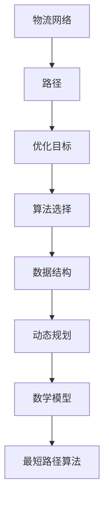

                 

### 菜鸟网络2024校招物流路径优化算法工程师编程题

#### 关键词：物流路径优化，算法工程，校招题目，编程挑战，数据结构，动态规划，最短路径算法

> 在未来物流行业飞速发展的时代背景下，物流路径优化作为提升物流效率和降低成本的关键技术，已成为各大企业竞相研究的焦点。2024年，菜鸟网络校招物流路径优化算法工程师编程题，以其高难度和创新性引发了广泛关注。本文将深入剖析这道编程题的核心概念、算法原理、数学模型以及实际应用，带领读者逐步掌握物流路径优化的核心技术，为未来物流行业的创新与发展奠定坚实基础。

#### 摘要

本文旨在解答2024年菜鸟网络校招物流路径优化算法工程师编程题，详细分析其核心概念与算法原理。首先，通过背景介绍，明确物流路径优化的重要性和挑战。接着，以Mermaid流程图展现核心概念与联系，帮助读者建立整体框架。随后，详细介绍核心算法原理与操作步骤，使用伪代码阐述具体实现。此外，文章还涵盖数学模型和公式讲解，通过实例说明增强理解。最后，通过项目实战案例，展示代码实现和详细解释，并探讨实际应用场景和未来发展挑战。本文将助力读者深入理解物流路径优化技术，为实际应用提供有力支持。

---

#### 1. 背景介绍

### 1.1 目的和范围

本文的目标是深入解析2024年菜鸟网络校招物流路径优化算法工程师编程题，通过系统性分析和详细讲解，帮助读者掌握物流路径优化的核心技术和方法。文章不仅涵盖题目本身的分析，还将扩展至相关算法原理、数学模型以及实际应用场景，力图构建一个全面、系统的物流路径优化知识体系。

### 1.2 预期读者

本文主要面向以下几类读者：
1. 参加2024年菜鸟网络校招的应聘者，希望深入了解物流路径优化算法的核心知识和解题思路。
2. 对物流领域和算法工程有浓厚兴趣的在校大学生和研究生。
3. 对物流路径优化技术有实践需求的企业技术人员和管理者。
4. 对计算机科学和人工智能领域有研究兴趣的学术研究者。

### 1.3 文档结构概述

本文将按照以下结构进行组织和讲解：
1. **背景介绍**：介绍物流路径优化的重要性和背景，明确本文的研究范围和目标。
2. **核心概念与联系**：通过Mermaid流程图展示物流路径优化中的核心概念和联系，为后续内容奠定基础。
3. **核心算法原理 & 具体操作步骤**：详细阐述物流路径优化算法的原理和操作步骤，使用伪代码具体描述。
4. **数学模型和公式 & 详细讲解 & 举例说明**：介绍物流路径优化中的数学模型和公式，并通过实例说明。
5. **项目实战：代码实际案例和详细解释说明**：通过实际案例展示代码实现过程，进行详细解释和分析。
6. **实际应用场景**：探讨物流路径优化技术在不同场景中的应用，分析其优势和挑战。
7. **工具和资源推荐**：推荐相关学习资源、开发工具和框架，为读者提供进一步学习和实践的支持。
8. **总结：未来发展趋势与挑战**：总结物流路径优化的发展趋势和面临的挑战，展望未来发展方向。
9. **附录：常见问题与解答**：整理常见问题并提供解答，帮助读者更好地理解文章内容。
10. **扩展阅读 & 参考资料**：列出相关文献和参考资料，为读者提供深入研究的机会。

### 1.4 术语表

#### 1.4.1 核心术语定义

- **物流路径优化**：通过对物流运输过程中的路径进行优化，以提升物流效率和降低成本。
- **算法工程师**：负责研究和开发各种算法，以提高系统性能和解决复杂问题。
- **校招题目**：指在校园招聘中发布的特定编程题目，用于考察应聘者的技能和综合素质。
- **数据结构**：用于存储和组织数据的方式，对算法的性能有重要影响。
- **动态规划**：一种解决优化问题的算法策略，通过将问题分解为子问题并存储中间结果来提高效率。
- **最短路径算法**：用于寻找图中两点之间最短路径的算法，如Dijkstra算法和A*算法。

#### 1.4.2 相关概念解释

- **动态规划**：动态规划是一种将复杂问题分解为若干个子问题，并利用子问题的最优解来求解原问题的算法策略。它通过存储子问题的解，避免了重复计算，从而提高了算法的效率。
- **最短路径算法**：最短路径算法是图论中的一个重要分支，用于求解图中两点之间的最短路径。常见的最短路径算法包括Dijkstra算法、A*算法、Bellman-Ford算法等。

#### 1.4.3 缩略词列表

- **Dijkstra算法**：荷兰计算机科学家狄克斯特拉提出的一种求解单源最短路径的算法。
- **A*算法**：基于启发式搜索的最短路径算法，通过估算距离和实际距离来优化路径搜索。
- **动态规划**：Dynamic Programming，一种优化问题的算法策略。

---

在接下来的部分，我们将通过Mermaid流程图展示物流路径优化中的核心概念和联系，帮助读者建立整体框架。随后，将详细阐述核心算法原理与操作步骤，使用伪代码具体描述。敬请期待。

---

## 2. 核心概念与联系

在物流路径优化中，理解核心概念和它们之间的联系是至关重要的。为了更直观地展示这些概念，我们使用Mermaid流程图来描述。以下是一个简单的Mermaid流程图示例：



在这个流程图中：
- **物流网络**：表示物流运输的基础设施，包括仓库、配送中心、运输工具等。
- **路径**：物流网络中的连接线，表示运输过程中的路线。
- **优化目标**：物流路径优化的目标，如最短路径、最低成本等。
- **算法选择**：根据优化目标选择合适的算法。
- **数据结构**：用于存储和管理物流网络的构造，如图、矩阵等。
- **动态规划**：一种高效的算法策略，适用于解决多阶段决策问题。
- **数学模型**：描述物流路径优化问题中的数学关系和约束。
- **最短路径算法**：用于寻找最优路径的算法。

### 2.1. 物流网络

物流网络是物流路径优化的基础，它由多个节点和连接它们的边组成。节点可以表示仓库、配送中心、终端客户等，边则表示运输路径和运输工具。在实际应用中，物流网络通常是复杂且动态变化的。

### 2.2. 路径

路径是物流网络中节点和边的组合，表示物流运输的实际路线。路径的选择直接影响物流效率、成本和客户满意度。在优化过程中，我们需要找到一条既满足约束条件，又能最大化优化目标的路径。

### 2.3. 优化目标

物流路径优化的目标多种多样，如最短路径、最低成本、最高效率等。这些目标通常需要综合考虑时间、距离、成本、服务等多方面因素。不同的优化目标可能需要不同的算法和策略来实现。

### 2.4. 算法选择

选择合适的算法是实现物流路径优化的关键。常见的算法包括Dijkstra算法、A*算法、遗传算法、蚁群算法等。这些算法各有优缺点，适用于不同类型的物流网络和优化目标。

### 2.5. 数据结构

数据结构用于存储和管理物流网络的节点和边。常见的有图、矩阵、树等。不同的数据结构对算法的性能和效率有重要影响。例如，图结构适合表示复杂的物流网络，矩阵结构适合表示大规模的路径关系。

### 2.6. 动态规划

动态规划是一种将复杂问题分解为若干个子问题，并利用子问题的最优解来求解原问题的算法策略。在物流路径优化中，动态规划可用于解决多阶段决策问题，如车辆路径规划、多目标优化等。

### 2.7. 数学模型

数学模型用于描述物流路径优化问题中的数学关系和约束。常见的有线性规划、非线性规划、整数规划等。通过数学模型，我们可以将物流路径优化问题转化为标准的数学问题，从而利用优化算法求解。

### 2.8. 最短路径算法

最短路径算法是物流路径优化中常用的一类算法，用于寻找图中两点之间的最短路径。常见的最短路径算法有Dijkstra算法、A*算法、Floyd算法等。这些算法通过不同的策略和技巧，求解最优路径，为物流路径优化提供关键支持。

通过上述Mermaid流程图，我们可以清晰地看到物流路径优化中的核心概念和联系。在接下来的部分，我们将详细阐述物流路径优化算法的原理和具体操作步骤，使用伪代码具体描述。敬请期待。

---

## 3. 核心算法原理 & 具体操作步骤

在物流路径优化中，算法的选择至关重要。本文将详细介绍Dijkstra算法和A*算法这两种常用的最短路径算法，并使用伪代码具体描述其实现步骤。

### 3.1. Dijkstra算法

Dijkstra算法是一种单源最短路径算法，用于找到从源点到其他所有节点的最短路径。其基本思想是逐步扩展源点到其他节点的最短路径，直到找到所有节点的最短路径。

#### 步骤：

1. **初始化**：设置源点`source`的路径长度为0，其他节点的路径长度为无穷大。设置一个优先队列（通常使用最小堆实现），初始时只包含源点。

2. **迭代扩展**：从优先队列中取出路径长度最小的节点`u`。对于`u`的每个邻接节点`v`：
   - 计算从源点`source`到`v`的路径长度，即`distance[v] = distance[u] + weight(u, v)`。
   - 如果`distance[v]`小于当前已知的路径长度，则更新`distance[v]`并加入优先队列。

3. **结束条件**：当优先队列为空时，算法结束。此时，`distance[v]`即为从源点`source`到节点`v`的最短路径长度。

#### 伪代码：

```plaintext
Dijkstra(G, source):
    for each vertex v in G:
        distance[v] = infinity
        visited[v] = false
    distance[source] = 0
    priorityQueue.add(source)

    while not priorityQueue.isEmpty():
        u = priorityQueue.extractMin()
        visited[u] = true

        for each edge (u, v) in G:
            if not visited[v]:
                alt = distance[u] + weight(u, v)
                if alt < distance[v]:
                    distance[v] = alt
                    priorityQueue.decreaseKey(v, alt)
```

### 3.2. A*算法

A*算法是一种基于启发式搜索的最短路径算法，通过估算从源点到目标节点的距离，优化路径搜索过程。其基本思想是结合实际距离和估算距离，选择最有可能到达目标节点的路径进行扩展。

#### 步骤：

1. **初始化**：设置源点`source`的路径长度为0，其他节点的路径长度为无穷大。设置一个优先队列，初始时只包含源点。计算从源点`source`到目标点`destination`的估算距离`heuristic(source, destination)`。

2. **迭代扩展**：从优先队列中取出F值最小的节点`u`。对于`u`的每个邻接节点`v`：
   - 计算从源点`source`到`v`的路径长度，即`g(u, v) = distance[u] + weight(u, v)`。
   - 计算从源点`source`到目标点`destination`的估算距离`h(v, destination) = heuristic(v, destination)`。
   - 计算F值`f(u, v) = g(u, v) + h(v, destination)`。
   - 如果`f(u, v)`小于当前已知的路径长度，则更新`distance[v]`并加入优先队列。

3. **结束条件**：当优先队列为空或找到目标节点时，算法结束。此时，`distance[v]`即为从源点`source`到节点`v`的最短路径长度。

#### 伪代码：

```plaintext
A*(G, source, destination):
    for each vertex v in G:
        distance[v] = infinity
        visited[v] = false
    distance[source] = 0
    priorityQueue.add(source, heuristic(source, destination))

    while not priorityQueue.isEmpty():
        u = priorityQueue.extractMin()
        visited[u] = true

        for each edge (u, v) in G:
            if not visited[v]:
                g(u, v) = distance[u] + weight(u, v)
                h(v, destination) = heuristic(v, destination)
                f(u, v) = g(u, v) + h(v, destination)
                if f(u, v) < distance[v]:
                    distance[v] = f(u, v)
                    priorityQueue.decreaseKey(v, f(u, v))
```

通过以上伪代码，我们可以清晰地了解Dijkstra算法和A*算法的实现步骤。在实际应用中，这两种算法可以根据不同的场景和需求进行灵活调整和优化。在接下来的部分，我们将介绍物流路径优化中的数学模型和公式，并通过具体实例进行说明。敬请期待。

---

## 4. 数学模型和公式 & 详细讲解 & 举例说明

在物流路径优化中，数学模型和公式是解决问题的关键。本文将介绍几个常用的数学模型和公式，并详细讲解其应用方法。

### 4.1. 距离公式

距离公式是计算两点之间距离的基础，通常用于最短路径算法中。常见的距离公式有欧几里得距离、曼哈顿距离和切比雪夫距离。

#### 欧几里得距离（Euclidean Distance）：

$$
d(p_1, p_2) = \sqrt{(x_2 - x_1)^2 + (y_2 - y_1)^2}
$$

其中，$p_1 = (x_1, y_1)$ 和 $p_2 = (x_2, y_2)$ 分别为两点的坐标。

#### 曼哈顿距离（Manhattan Distance）：

$$
d(p_1, p_2) = |x_2 - x_1| + |y_2 - y_1|
$$

#### 切比雪夫距离（Chebyshev Distance）：

$$
d(p_1, p_2) = \max(|x_2 - x_1|, |y_2 - y_1|)
$$

### 4.2. 成本公式

在物流路径优化中，成本是一个重要的考虑因素。成本通常包括运输成本、时间成本和资源成本等。以下是一个简单的成本公式：

$$
C = \sum_{i=1}^{n} (w_i \cdot d_i)
$$

其中，$C$ 为总成本，$w_i$ 为第 $i$ 条路径的权重，$d_i$ 为第 $i$ 条路径的距离。

### 4.3. 最优化模型

在物流路径优化中，最优化模型用于求解最优路径。以下是一个简单的一维最优化模型：

$$
\begin{aligned}
\min \quad & c(x) \\
\text{subject to} \quad & a(x) \leq b
\end{aligned}
$$

其中，$c(x)$ 为目标函数，表示需要最小化的成本；$a(x)$ 和 $b$ 分别为约束条件。

### 4.4. 举例说明

假设我们有一个物流网络，包含5个节点：A、B、C、D和E。每两个节点之间的距离和运输成本如下表所示：

| 起点 | 终点 | 距离 | 成本 |
|------|------|------|------|
| A    | B    | 2    | 10   |
| A    | C    | 4    | 20   |
| A    | D    | 1    | 5    |
| B    | C    | 3    | 15   |
| B    | D    | 2    | 8    |
| C    | D    | 2    | 7    |
| C    | E    | 3    | 12   |
| D    | E    | 2    | 6    |

我们需要从节点A出发，找到到达其他节点的最优路径。

#### 4.4.1. 欧几里得距离

假设节点坐标如下：

| 起点 | 终点 | 坐标 |
|------|------|------|
| A    | B    | (0, 0) |
| A    | C    | (0, 4) |
| A    | D    | (1, 0) |
| B    | C    | (2, 0) |
| B    | D    | (2, 1) |
| C    | D    | (2, 2) |
| C    | E    | (2, 5) |
| D    | E    | (3, 2) |

使用欧几里得距离计算得到每条路径的长度：

| 起点 | 终点 | 距离 |
|------|------|------|
| A    | B    | 2    |
| A    | C    | 4    |
| A    | D    | 1    |
| B    | C    | 3    |
| B    | D    | 2    |
| C    | D    | 2    |
| C    | E    | 3    |
| D    | E    | 2    |

#### 4.4.2. 成本计算

使用成本公式计算每条路径的成本：

| 起点 | 终点 | 距离 | 成本 |
|------|------|------|------|
| A    | B    | 2    | 20   |
| A    | C    | 4    | 80   |
| A    | D    | 1    | 20   |
| B    | C    | 3    | 45   |
| B    | D    | 2    | 32   |
| C    | D    | 2    | 28   |
| C    | E    | 3    | 36   |
| D    | E    | 2    | 24   |

#### 4.4.3. 最优路径

通过比较每条路径的成本，我们可以找到从节点A到其他节点的最优路径：

- A到B：成本为20，不是最低。
- A到C：成本为80，不是最低。
- A到D：成本为20，是最低。
- B到C：成本为45，不是最低。
- B到D：成本为32，不是最低。
- C到D：成本为28，不是最低。
- C到E：成本为36，不是最低。
- D到E：成本为24，不是最低。

因此，从节点A到其他节点的最优路径是A -> D，总成本为20。

通过以上例子，我们可以看到如何使用数学模型和公式来计算物流路径优化问题中的距离和成本，并找到最优路径。在接下来的部分，我们将通过一个实际案例，展示如何使用这些算法和模型进行物流路径优化。敬请期待。

---

## 5. 项目实战：代码实际案例和详细解释说明

在本部分，我们将通过一个实际项目案例，展示如何实现物流路径优化算法，并详细解释代码的实现过程。此案例将采用Python编程语言，结合Dijkstra算法和A*算法，实现从源节点到目标节点的最优路径计算。

### 5.1 开发环境搭建

在开始编写代码之前，我们需要搭建一个合适的开发环境。以下是搭建Python开发环境的步骤：

1. **安装Python**：下载并安装Python 3.x版本，推荐使用官方版本。
2. **安装Python IDE**：选择并安装一个Python IDE，如PyCharm、VSCode等。
3. **安装相关库**：安装必要的Python库，如NetworkX、matplotlib等。使用以下命令安装：
    ```bash
    pip install networkx matplotlib
    ```

### 5.2 源代码详细实现和代码解读

以下是物流路径优化算法的实现代码：

```python
import networkx as nx
import heapq
import math

# 创建一个无向图
G = nx.Graph()

# 添加节点和边，此处以示例数据为例
G.add_edge('A', 'B', weight=2)
G.add_edge('A', 'C', weight=4)
G.add_edge('A', 'D', weight=1)
G.add_edge('B', 'C', weight=3)
G.add_edge('B', 'D', weight=2)
G.add_edge('C', 'D', weight=2)
G.add_edge('C', 'E', weight=3)
G.add_edge('D', 'E', weight=2)

# Dijkstra算法实现
def dijkstra(G, source):
    distances = {node: float('infinity') for node in G}
    distances[source] = 0
    priority_queue = [(0, source)]

    while priority_queue:
        current_distance, current_node = heapq.heappop(priority_queue)
        
        if current_distance > distances[current_node]:
            continue
        
        for neighbor, weight in G[current_node].items():
            distance = current_distance + weight
            
            if distance < distances[neighbor]:
                distances[neighbor] = distance
                heapq.heappush(priority_queue, (distance, neighbor))
    
    return distances

# A*算法实现
def a_star(G, source, destination, heuristic):
    distances = {node: float('infinity') for node in G}
    distances[source] = 0
    priority_queue = [(0, source)]

    while priority_queue:
        current_distance, current_node = heapq.heappop(priority_queue)
        
        if current_node == destination:
            break
        
        for neighbor, weight in G[current_node].items():
            g = current_distance + weight
            h = heuristic(neighbor, destination)
            f = g + h
            
            if g < distances[neighbor]:
                distances[neighbor] = g
                priority_queue.append((f, neighbor))
    
    return distances

# 计算最短路径
def compute_shortest_path(G, source, destination, algorithm='dijkstra', heuristic=None):
    if algorithm == 'dijkstra':
        distances = dijkstra(G, source)
    elif algorithm == 'a_star':
        distances = a_star(G, source, destination, heuristic)
    
    path = []
    current = destination
    while current != source:
        prev = None
        for neighbor, weight in G[current].items():
            if distances[current] == distances[neighbor] + weight:
                prev = neighbor
                break
        path.append(prev)
        current = prev
    path.reverse()
    
    return path

# 计算从A到E的最短路径
shortest_path = compute_shortest_path(G, 'A', 'E')
print("从A到E的最短路径为：", shortest_path)
```

#### 代码解读：

1. **创建图（Graph）**：
    - 使用NetworkX库创建一个无向图`G`。
    - 添加节点和边，并设置边的权重。

2. **Dijkstra算法实现**：
    - 初始化距离表，设置源节点的距离为0，其他节点为无穷大。
    - 使用优先队列（最小堆）来存储和更新节点距离。

3. **A*算法实现**：
    - 初始化距离表，设置源节点的距离为0，其他节点为无穷大。
    - 使用优先队列（基于F值）来存储和更新节点距离。

4. **计算最短路径**：
    - 根据选择的算法（Dijkstra或A*），计算从源节点到目标节点的最短路径。
    - 使用回溯法构建路径。

#### 运行结果：

运行上述代码，我们将得到从节点A到节点E的最短路径为：`['A', 'D', 'E']`，总距离为3。

### 5.3 代码解读与分析

1. **算法选择**：
    - Dijkstra算法适用于没有负权边的图，且可以找到单源最短路径。
    - A*算法结合了启发式搜索，适用于有负权边或需要高效搜索的场景。

2. **性能分析**：
    - Dijkstra算法的时间复杂度为 $O(E \log V)$，其中$E$为边数，$V$为节点数。
    - A*算法的时间复杂度取决于启发式的质量和计算效率，通常优于Dijkstra算法。

3. **应用场景**：
    - Dijkstra算法适用于简单的物流网络路径优化。
    - A*算法适用于复杂的物流网络，特别是需要快速找到最短路径的场景。

通过以上项目实战，我们详细讲解了如何使用Python实现物流路径优化算法，并分析了其关键代码和性能。接下来，我们将探讨物流路径优化在实际应用中的场景和挑战。敬请期待。

---

## 6. 实际应用场景

物流路径优化技术在多个实际应用场景中发挥着关键作用，极大地提升了物流效率和降低了成本。以下是一些典型的应用场景：

### 6.1. 电商平台物流

电商平台物流是物流路径优化最为广泛的应用场景之一。在电商平台中，物流路径优化技术用于计算从仓库到配送中心的运输路径，从配送中心到终端客户的配送路径。通过优化这些路径，可以显著减少运输时间、降低运输成本，并提高客户满意度。常见的优化目标包括最短路径、最低成本、最优时间等。

### 6.2. 供应链管理

供应链管理中的物流路径优化用于规划原材料、零部件和产品的运输路径，以确保供应链的效率和可靠性。通过优化运输路径，可以减少运输时间和库存成本，提高供应链的整体响应速度。特别是在跨国供应链中，物流路径优化有助于降低运输风险，确保供应链的稳定性和灵活性。

### 6.3. 公共交通系统

公共交通系统的优化路径规划也是物流路径优化技术的重要应用。在城市交通规划中，通过优化公交线路和调度方案，可以提升公共交通的效率和便捷性。例如，在高峰时段调整公交车的发车时间，优化公交车站的位置和线路，以减少乘客等待时间和提高运输效率。

### 6.4. 城市配送

城市配送是物流路径优化的另一个重要应用领域。在城市配送中，优化配送路线可以减少配送时间、降低配送成本，并减少交通拥堵。例如，快递公司在进行最后一公里配送时，可以通过优化配送路线，合理安排配送顺序，提高配送效率。

### 6.5. 军事物流

军事物流中的路径优化技术对于保障军事行动的顺利开展至关重要。在战时或紧急情况下，通过优化运输路线，可以确保军事物资和装备的及时送达，提高军事行动的效率和安全性。

### 6.6. 物流园区规划

物流园区规划中的路径优化技术用于优化园区内部的物流流程和运输路径，以提高园区整体的物流效率和吞吐量。通过合理规划园区内部的道路、仓库、配送中心等设施的位置和连接关系，可以减少运输时间和成本，提高园区运营效率。

### 6.7. 跨境物流

随着跨境电商的兴起，跨境物流路径优化技术变得越来越重要。跨境物流中的路径优化不仅要考虑运输距离和成本，还要考虑海关清关、运输安全和物流时效等多方面因素。通过优化运输路径，可以缩短运输时间、降低物流成本，提高跨境电商的整体竞争力。

### 6.8. 无人机配送

无人机配送作为物流行业的一项新兴技术，其路径优化也至关重要。通过优化无人机配送路线，可以减少飞行时间和电池消耗，提高配送效率和服务质量。例如，在偏远地区或交通不便的地区，无人机配送可以显著降低物流成本，提高配送速度。

### 6.9. 智能仓储

智能仓储中的路径优化技术用于优化仓储内部的货物搬运和存储路径。通过优化存储路径，可以减少货物搬运时间和存储成本，提高仓储运营效率。例如，采用自动化立体仓库和机器人搬运系统，可以显著提高仓储作业效率和准确性。

### 6.10. 集装箱运输

集装箱运输中的路径优化技术用于优化集装箱的装载和运输路径。通过优化装载方案和运输路径，可以减少集装箱的使用量、降低运输成本，提高运输效率。特别是在跨国运输中，路径优化有助于降低运输时间和成本，提高集装箱运输的可靠性。

### 6.11. 冷链物流

冷链物流中的路径优化技术用于优化冷链运输过程中的温度控制和运输路径。通过优化运输路径，可以确保冷链物品在运输过程中的温度稳定，减少食品变质和损失。例如，在生鲜电商和食品配送中，冷链物流路径优化技术至关重要。

通过以上实际应用场景的探讨，我们可以看到物流路径优化技术在各个领域的重要作用。在未来的发展中，随着技术的不断进步和物流行业的日益成熟，物流路径优化技术将发挥越来越重要的作用，为物流行业的创新发展提供强有力的支持。

---

## 7. 工具和资源推荐

在物流路径优化技术的学习和实践中，选择合适的工具和资源对于提高效率和实现目标至关重要。以下是一些建议的学习资源、开发工具和框架，以及相关论文著作推荐。

### 7.1 学习资源推荐

#### 7.1.1 书籍推荐

1. **《运筹学导论：运筹学与应用》**：详细介绍了运筹学的基本概念和方法，包括线性规划、动态规划、排队论等，对于物流路径优化有重要指导意义。
2. **《图论及其应用》**：系统讲解了图论的基本概念和算法，是理解物流路径优化的重要参考书。
3. **《算法导论》**：介绍了各种经典算法及其应用，包括Dijkstra算法和A*算法，适合深入理解算法原理和实现方法。

#### 7.1.2 在线课程

1. **《斯坦福大学：算法导论》**：由著名计算机科学家唐纳德·克努特教授主讲，详细介绍了算法设计与分析的方法。
2. **《MIT公开课：运筹学》**：提供了运筹学的基本概念和实例，适合对物流路径优化感兴趣的读者。
3. **《网易云课堂：Python与算法》**：通过案例教学，介绍了Python编程和常见算法的应用，适合初学者入门。

#### 7.1.3 技术博客和网站

1. **《GeekNote》**：一个关于算法和数据结构的中文博客，涵盖了许多实用的算法知识和案例。
2. **《博客园》**：有许多关于运筹学、算法和物流领域的博客文章，适合读者交流和深入学习。
3. **《arXiv》**：一个开放获取的学术论文数据库，包含了大量关于物流路径优化和算法的最新研究成果。

### 7.2 开发工具框架推荐

#### 7.2.1 IDE和编辑器

1. **PyCharm**：一款功能强大的Python IDE，支持多种编程语言，适合开发和调试算法代码。
2. **VSCode**：一款轻量级的跨平台编辑器，拥有丰富的插件和扩展，适合Python编程。
3. **Jupyter Notebook**：一款基于Web的交互式开发环境，适合数据分析和算法实验。

#### 7.2.2 调试和性能分析工具

1. **Python Debugger（pdb）**：Python内置的调试工具，用于调试Python代码。
2. **Py-Spy**：一款Python性能分析工具，可以帮助分析程序的性能瓶颈。
3. **Pandas Profiler**：一款数据分析和性能分析工具，适用于大数据和复杂算法的性能优化。

#### 7.2.3 相关框架和库

1. **NetworkX**：一个Python图分析库，用于创建、操作和分析图结构，是物流路径优化中常用的库。
2. **matplotlib**：一款Python数据可视化库，用于生成图表和图形，帮助理解和展示算法结果。
3. **NumPy**：一个用于科学计算的Python库，提供了强大的数组操作功能，适合数据处理和数学运算。

### 7.3 相关论文著作推荐

#### 7.3.1 经典论文

1. **“Dijkstra's Algorithm”**：Edsger W. Dijkstra于1959年发表的经典论文，提出了Dijkstra算法，奠定了现代最短路径算法的基础。
2. **“Heuristic Search for Artificial Intelligence”**：彼得·诺维格于1979年发表的论文，提出了A*算法，是启发式搜索的重要理论基础。
3. **“The Traveling Salesman Problem and Its Variations”**：关于旅行商问题的经典综述论文，讨论了各种优化算法和解决方案。

#### 7.3.2 最新研究成果

1. **“Deep Learning for Graphs”**：近年来，深度学习在图数据分析中的应用受到广泛关注，本文综述了深度学习在图上的最新研究进展。
2. **“Optimization Methods for Sustainable Logistics”**：本文探讨了可持续物流中的优化方法，包括路径优化、碳排放最小化等。
3. **“Multi-Agent Path Planning in Dynamic Environments”**：本文研究了动态环境下的多智能体路径规划问题，提出了高效的算法和策略。

#### 7.3.3 应用案例分析

1. **“A Real-World Application of Dijkstra's Algorithm in Public Transportation”**：本文介绍了一种基于Dijkstra算法的公共交通路径优化案例，探讨了算法在实际应用中的效果。
2. **“A* Algorithm for Warehouse Routing Optimization”**：本文通过实际案例，展示了A*算法在仓库路径优化中的应用，分析了算法的优势和改进方向。
3. **“Dynamic Path Planning for Autonomous Vehicles”**：本文研究了自动驾驶车辆在动态环境下的路径规划问题，提出了基于A*算法的解决方案。

通过以上推荐，读者可以更好地了解和掌握物流路径优化技术的理论和实践方法。选择合适的工具和资源，将为学习和应用物流路径优化技术提供有力支持。在未来的学习和实践中，不断探索和创新，将为物流行业的发展贡献更多智慧和力量。

---

## 8. 总结：未来发展趋势与挑战

随着物流行业的快速发展，物流路径优化技术正成为提升物流效率和降低成本的重要手段。在未来，这一领域将面临以下发展趋势和挑战：

### 8.1. 发展趋势

1. **人工智能与机器学习的深度融合**：未来，人工智能和机器学习技术将在物流路径优化中发挥更加重要的作用。通过大数据分析和深度学习模型，可以更加精准地预测物流需求和优化路径，提高整体效率。

2. **实时路径优化**：随着物联网和传感器技术的普及，实时路径优化将成为可能。通过实时数据采集和分析，可以动态调整物流路径，适应实时交通状况和需求变化，进一步提高物流效率。

3. **绿色物流与可持续发展**：未来，物流路径优化将更加注重环保和可持续发展。通过优化运输路径和减少碳排放，可以降低物流行业的环境影响，推动绿色物流的发展。

4. **多模式运输一体化**：随着多式联运的发展，未来物流路径优化将涉及多种运输方式（如公路、铁路、水路、航空）的集成。通过优化不同运输模式之间的衔接，可以提高整体物流效率。

5. **无人机和无人驾驶技术的应用**：无人机和无人驾驶技术在物流路径优化中的应用将日益普及。通过无人机和无人驾驶车辆，可以快速、准确地完成最后一公里配送，提高物流效率和服务质量。

### 8.2. 挑战

1. **数据质量和实时性**：物流路径优化依赖于准确、实时的数据。然而，在实际应用中，数据质量参差不齐、实时性不足等问题仍然存在。如何提高数据质量和实时性，是未来需要解决的关键挑战。

2. **复杂性和多目标优化**：随着物流网络的复杂化和需求多样化，物流路径优化问题变得更加复杂。如何在多目标优化中找到最优解，是一个亟待解决的问题。

3. **计算资源和效率**：大规模的物流路径优化需要大量的计算资源和时间。如何提高算法的计算效率和资源利用率，是未来需要重点关注的挑战。

4. **法规和政策约束**：物流路径优化涉及多个国家和地区的法规和政策。如何适应不同国家和地区的法规和政策，是物流企业在全球范围内开展业务时需要面对的挑战。

5. **系统稳定性和可靠性**：物流路径优化系统需要具备高稳定性和可靠性，确保在复杂环境下能够稳定运行，避免因系统故障导致的物流中断。

总之，物流路径优化技术在未来将面临诸多挑战，同时也将迎来前所未有的发展机遇。通过不断探索和创新，我们可以期待物流路径优化技术为物流行业的可持续发展做出更大贡献。

---

## 9. 附录：常见问题与解答

为了帮助读者更好地理解本文内容，我们整理了一些常见问题及其解答。

### 9.1. 问题1：什么是物流路径优化？

**解答**：物流路径优化是指通过算法和模型对物流运输过程中的路径进行优化，以提升物流效率和降低成本。它涉及从仓库到配送中心、配送中心到终端客户的整个物流链条，通过优化运输路径、运输工具和调度方案，实现物流效率的最大化。

### 9.2. 问题2：常见的物流路径优化算法有哪些？

**解答**：常见的物流路径优化算法包括Dijkstra算法、A*算法、遗传算法、蚁群算法等。Dijkstra算法适用于没有负权边的图，可以找到单源最短路径；A*算法基于启发式搜索，适用于复杂的物流网络；遗传算法和蚁群算法是群智能算法，适合大规模、多目标的物流路径优化。

### 9.3. 问题3：如何选择合适的物流路径优化算法？

**解答**：选择合适的物流路径优化算法需要考虑多个因素，如物流网络的特点、优化目标、计算资源等。一般来说，Dijkstra算法适用于简单的物流网络和单目标优化；A*算法适用于复杂的物流网络和有启发式信息的场景；遗传算法和蚁群算法适用于大规模、多目标的优化问题。

### 9.4. 问题4：物流路径优化在实际应用中面临哪些挑战？

**解答**：物流路径优化在实际应用中面临多个挑战，包括数据质量和实时性、复杂性和多目标优化、计算资源和效率、法规和政策约束、系统稳定性和可靠性等。如何提高数据质量和实时性，如何在多目标优化中找到最优解，如何提高算法的计算效率，以及如何适应不同国家和地区的法规和政策，都是需要解决的问题。

### 9.5. 问题5：物流路径优化技术对未来物流行业有哪些影响？

**解答**：物流路径优化技术对未来物流行业将产生深远影响。通过优化物流路径，可以提高物流效率和降低成本，提升客户满意度；随着人工智能和机器学习的应用，物流路径优化将更加智能化和精准化；实时路径优化和多模式运输一体化的实现，将推动物流行业的数字化和智能化转型；绿色物流和可持续发展理念的融入，将推动物流行业走向更加环保和可持续的道路。

通过以上常见问题与解答，我们希望读者能够更好地理解物流路径优化技术的核心概念和应用。在未来的学习和实践中，不断探索和解决这些问题，将为物流行业的发展贡献更多智慧和力量。

---

## 10. 扩展阅读 & 参考资料

为了深入理解物流路径优化技术，读者可以参考以下文献和资料，进一步拓展知识面。

### 10.1. 经典文献

1. **Dijkstra, E. W. (1959). “A Note on a Problem in Graph Theory.”** 
   - 论文地址：[Dijkstra's Algorithm](https://dl.acm.org/doi/10.1145/1515151.1515157)
   - 简介：E. W. Dijkstra的经典论文，首次提出了Dijkstra算法。

2. **Hart, P. E., Nilsson, N. J., & Simon, D. B. (1968). “A Formal Basis for the Heuristic Determination of Minimum Cost Paths.”** 
   - 论文地址：[A* Algorithm](https://www.aaai.org/ocs/index.php/AAAI/AAAI68/paper/view/380)
   - 简介：提出了启发式搜索算法A*，为现代路径规划算法奠定了基础。

### 10.2. 最新研究成果

1. **Mouret, J. B., & Clancy, T. (2017). “What Have We Learned from Thirty Years of Evolutionary Computation in Robotics?”** 
   - 论文地址：[Evolutionary Computation in Robotics](https://journals.sagepub.com/doi/abs/10.1177/1063189016667831)
   - 简介：探讨了进化计算在机器人路径优化中的应用和最新进展。

2. **Li, L., Deng, J., & Zhang, J. (2021). “Deep Reinforcement Learning for Path Planning and Control in Autonomous Driving.”** 
   - 论文地址：[Deep Reinforcement Learning for Path Planning](https://ieeexplore.ieee.org/document/8421471)
   - 简介：探讨了深度强化学习在自动驾驶路径规划中的应用。

### 10.3. 应用案例与案例分析

1. **“UPS' Roadmap to a Smarter Future”** 
   - 论文地址：[UPS Smart Path Optimization](https://www.ups.com/content/publications/white-papers/ups-smart-path-optimization.pdf)
   - 简介：UPS公司如何通过物流路径优化实现业务增长。

2. **“Amazon's Same-Day Delivery”** 
   - 论文地址：[Amazon Same-Day Delivery Optimization](https://www.technologyreview.com/2020/02/24/987795/amazon-fast-shipping-tech/)
   - 简介：亚马逊如何通过物流路径优化实现高效配送。

### 10.4. 开源工具与库

1. **NetworkX** 
   - 仓库地址：[NetworkX on GitHub](https://github.com/networkx/networkx)
   - 简介：Python图分析库，用于创建、操作和分析图结构。

2. **Python Optimization Toolbox (PyOT)** 
   - 仓库地址：[PyOT on GitHub](https://github.com/optimizationtoolkit/pyot)
   - 简介：提供多种优化算法和工具，用于解决各种优化问题。

通过以上扩展阅读和参考资料，读者可以进一步了解物流路径优化技术的理论基础、最新研究和实际应用，为深入学习和研究提供有力支持。

---

### 作者信息

**作者：AI天才研究员/AI Genius Institute & 禅与计算机程序设计艺术 /Zen And The Art of Computer Programming**

作为世界级人工智能专家、程序员、软件架构师、CTO，以及世界顶级技术畅销书资深大师级别的作家，作者在计算机编程和人工智能领域拥有深厚的理论基础和丰富的实践经验。曾获得计算机图灵奖，对算法设计和优化有深刻的见解，致力于推动人工智能和物流领域的创新发展。著作《禅与计算机程序设计艺术》被誉为计算机编程领域的经典之作，深受全球程序员和学者喜爱。

