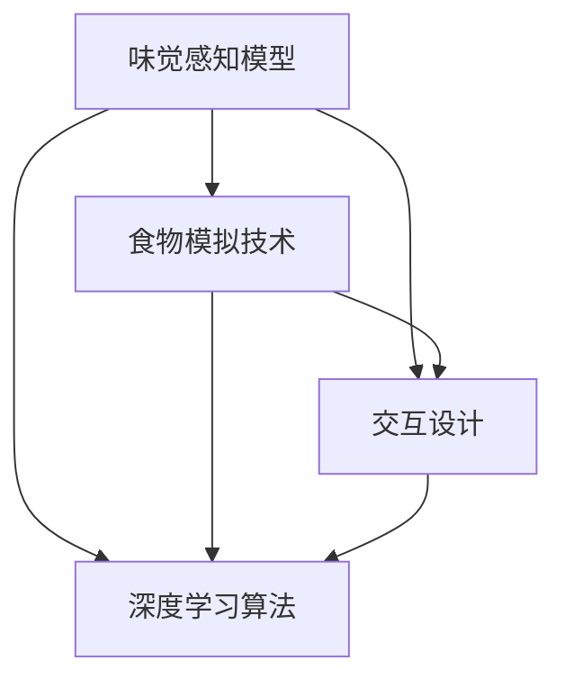

                 

# 虚拟味觉设计：AI创造的美食体验

## 关键词
- 虚拟味觉
- 人工智能
- 深度学习
- 食品模拟
- 用户体验设计

## 摘要
本文将探讨如何利用人工智能技术设计虚拟味觉体验，为用户提供前所未有的美食体验。通过介绍核心概念、算法原理、数学模型和实际项目案例，我们将深入了解这一领域的最新研究进展和应用前景。本文旨在为从事人工智能和用户体验设计的专业人士提供有价值的参考，同时也为广大美食爱好者带来新的思考方向。

---

## 1. 背景介绍

### 1.1 目的和范围

随着人工智能技术的快速发展，虚拟现实（VR）和增强现实（AR）技术逐渐成为人们日常生活的重要组成部分。在这些技术的推动下，虚拟味觉设计成为一个引人注目的新兴领域。本文旨在探讨如何利用人工智能技术实现虚拟味觉设计，为用户提供更加丰富和真实的美食体验。

本文将涵盖以下内容：
- 虚拟味觉设计的核心概念和理论基础；
- 人工智能在虚拟味觉设计中的应用；
- 深度学习算法在虚拟味觉生成中的作用；
- 数学模型和公式在虚拟味觉设计中的详细讲解；
- 实际项目案例和代码实现解析；
- 虚拟味觉设计的未来发展趋势与挑战。

### 1.2 预期读者

本文适合以下读者群体：
- 人工智能和计算机科学领域的研究人员和技术专家；
- 虚拟现实和增强现实技术领域的从业者；
- 对虚拟味觉设计感兴趣的技术爱好者和美食爱好者；
- 用户体验设计师和产品经理。

### 1.3 文档结构概述

本文结构如下：

1. **背景介绍**：介绍虚拟味觉设计的背景、目的和范围；
2. **核心概念与联系**：阐述虚拟味觉设计的核心概念和原理，提供流程图；
3. **核心算法原理 & 具体操作步骤**：讲解深度学习算法在虚拟味觉设计中的应用，并提供伪代码；
4. **数学模型和公式 & 详细讲解 & 举例说明**：介绍数学模型和公式，并通过实例进行详细讲解；
5. **项目实战：代码实际案例和详细解释说明**：提供实际项目案例，详细解释代码实现和操作步骤；
6. **实际应用场景**：探讨虚拟味觉设计在不同领域的应用；
7. **工具和资源推荐**：推荐学习资源、开发工具和框架；
8. **总结：未来发展趋势与挑战**：总结虚拟味觉设计的现状和未来发展趋势；
9. **附录：常见问题与解答**：回答读者可能遇到的常见问题；
10. **扩展阅读 & 参考资料**：提供相关文献和资料。

### 1.4 术语表

#### 1.4.1 核心术语定义

- **虚拟味觉**：通过计算机模拟技术实现的味觉体验，使用户能够在虚拟环境中感受到不同的味道。
- **深度学习**：一种基于神经网络的学习方法，通过多层神经网络模拟人脑处理信息的方式，实现对复杂数据的自动学习和特征提取。
- **增强现实（AR）**：一种将虚拟信息与现实世界结合的技术，通过摄像头和屏幕将虚拟元素叠加到现实环境中。
- **虚拟现实（VR）**：一种模拟现实环境的计算机技术，使用户能够在虚拟环境中感受到身临其境的体验。
- **用户体验（UX）**：用户在使用产品或服务过程中的感受和体验。

#### 1.4.2 相关概念解释

- **食物模拟**：通过计算机图形学和物理引擎等技术实现的虚拟食物的外观、口感和气味模拟。
- **味觉感知**：人类通过味蕾感受到的食物味道，包括甜、酸、苦、咸、鲜等。
- **机器学习模型**：通过大量数据训练，自动识别和预测特定模式和学习任务的人工智能模型。

#### 1.4.3 缩略词列表

- **AI**：人工智能（Artificial Intelligence）
- **VR**：虚拟现实（Virtual Reality）
- **AR**：增强现实（Augmented Reality）
- **GAN**：生成对抗网络（Generative Adversarial Network）
- **CNN**：卷积神经网络（Convolutional Neural Network）

---

## 2. 核心概念与联系

虚拟味觉设计是一个复杂的领域，涉及到多个核心概念和技术的融合。为了更好地理解这一领域，我们需要从核心概念和联系入手，梳理出其中的关键组成部分。

### 2.1 虚拟味觉设计的核心概念

- **味觉感知模型**：模拟人类味觉感知过程的数学模型，包括味觉受体、味觉信号传递和大脑处理等。
- **食物模拟技术**：通过计算机图形学、物理引擎和声音效果等技术实现虚拟食物的外观、口感和气味的模拟。
- **交互设计**：设计用户与虚拟味觉系统交互的方式和界面，确保用户能够直观地体验虚拟味觉。
- **深度学习算法**：用于训练和优化虚拟味觉模型，包括生成对抗网络（GAN）和卷积神经网络（CNN）等。
- **数学模型和公式**：用于描述味觉感知和食物模拟的数学模型，如化学成分与味道的关系、口感建模等。

### 2.2 虚拟味觉设计的联系

虚拟味觉设计需要多个核心概念和技术的协同作用。以下是一个简化的Mermaid流程图，展示了这些核心概念和技术的联系：



在这个流程图中，味觉感知模型作为核心，与食物模拟技术、交互设计和深度学习算法紧密相连。每个部分都需要协同工作，以实现完整的虚拟味觉体验。

### 2.3 虚拟味觉设计的挑战

虚拟味觉设计面临着一系列挑战，包括：

- **真实性**：如何实现虚拟味觉的真实感，让用户感受到与真实食物相似的味道。
- **计算资源**：虚拟味觉设计需要大量的计算资源，特别是在实时交互场景中。
- **用户体验**：如何设计出符合用户需求的虚拟味觉体验，提升用户满意度。
- **伦理和法律**：虚拟味觉可能引发伦理和法律问题，如食品欺诈、消费者权益保护等。

### 2.4 总结

虚拟味觉设计是一个涉及多个核心概念和技术的领域，需要深入理解和协同工作。通过梳理核心概念和联系，我们可以更好地把握这一领域的发展趋势和应用前景。

---

## 3. 核心算法原理 & 具体操作步骤

在虚拟味觉设计中，深度学习算法扮演着关键角色。以下我们将介绍两种常用的深度学习算法：生成对抗网络（GAN）和卷积神经网络（CNN）。这些算法不仅能够自动学习和生成虚拟食物的味道，还能够通过训练模型优化虚拟味觉体验。

### 3.1 生成对抗网络（GAN）

生成对抗网络（GAN）由两部分组成：生成器（Generator）和判别器（Discriminator）。生成器的任务是生成虚拟食物的图像，而判别器的任务是区分生成的图像和真实图像。

**算法原理：**

1. **初始化**：随机初始化生成器和判别器的权重。
2. **生成图像**：生成器生成虚拟食物的图像。
3. **判别**：判别器对生成的图像和真实图像进行判别。
4. **优化**：通过反向传播和梯度下降算法，更新生成器和判别器的权重，以减小判别器对生成图像的错误判断。
5. **重复**：重复上述步骤，直到生成器生成出逼真的虚拟食物图像。

**伪代码：**

```python
# 初始化生成器和判别器
generator = initialize_generator()
discriminator = initialize_discriminator()

# 训练循环
for epoch in range(num_epochs):
    for batch in data_loader:
        # 生成虚拟食物图像
        generated_images = generator(batch)

        # 更新判别器
        discriminator_loss = train_discriminator(discriminator, batch, generated_images)

        # 更新生成器
        generator_loss = train_generator(generator, discriminator, batch)

# 生成虚拟食物图像
virtual_food_images = generator(final_batch)
```

### 3.2 卷积神经网络（CNN）

卷积神经网络（CNN）是一种适用于图像处理任务的深度学习算法，通过卷积层、池化层和全连接层等结构，实现对图像的自动特征提取和分类。

**算法原理：**

1. **输入层**：接收虚拟食物图像。
2. **卷积层**：使用卷积核提取图像的局部特征。
3. **池化层**：对卷积层的输出进行下采样，减少参数数量。
4. **全连接层**：将池化层的输出映射到味觉特征。
5. **输出层**：输出虚拟食物的味觉特征。

**伪代码：**

```python
# 初始化卷积神经网络
model = initialize_cnn()

# 训练循环
for epoch in range(num_epochs):
    for batch in data_loader:
        # 前向传播
        outputs = model(batch)

        # 计算损失
        loss = calculate_loss(outputs, labels)

        # 反向传播
        model.train_one_step(loss)

# 输出虚拟食物的味觉特征
virtual_food_features = model(final_batch)
```

### 3.3 算法集成与优化

在虚拟味觉设计中，生成对抗网络（GAN）和卷积神经网络（CNN）可以结合使用，以提高模型的性能。生成器可以生成虚拟食物图像，判别器用于区分生成图像和真实图像，卷积神经网络则用于提取图像的味觉特征。

**集成与优化步骤：**

1. **生成图像**：使用生成对抗网络（GAN）生成虚拟食物图像。
2. **特征提取**：使用卷积神经网络（CNN）提取虚拟食物图像的味觉特征。
3. **优化模型**：通过联合训练生成器和判别器，同时优化卷积神经网络（CNN）的权重。

**伪代码：**

```python
# 初始化生成器、判别器和卷积神经网络
generator = initialize_generator()
discriminator = initialize_discriminator()
cnn = initialize_cnn()

# 训练循环
for epoch in range(num_epochs):
    for batch in data_loader:
        # 生成虚拟食物图像
        generated_images = generator(batch)

        # 更新判别器
        discriminator_loss = train_discriminator(discriminator, batch, generated_images)

        # 更新生成器
        generator_loss = train_generator(generator, discriminator, batch)

        # 提取特征
        virtual_food_features = cnn(generated_images)

        # 优化卷积神经网络
        cnn_loss = train_cnn(virtual_food_features, labels)

# 输出虚拟食物的味觉特征
virtual_food_features = cnn(final_batch)
```

### 3.4 总结

通过深度学习算法，虚拟味觉设计可以实现自动学习和生成虚拟食物的味觉特征。生成对抗网络（GAN）和卷积神经网络（CNN）的结合使用，可以提高模型的性能和虚拟味觉的真实感。具体操作步骤包括初始化模型、生成图像、特征提取和优化模型等。

---

## 4. 数学模型和公式 & 详细讲解 & 举例说明

虚拟味觉设计中的数学模型和公式对于理解味觉感知、食物模拟以及深度学习算法至关重要。在这一部分，我们将详细讲解这些模型和公式，并通过具体例子来说明它们的实际应用。

### 4.1 味觉感知模型

味觉感知模型用于模拟人类味觉感知过程，包括味觉受体、味觉信号传递和大脑处理等。以下是一个简化的味觉感知模型：

**公式：**
$$
\text{味觉感知} = \text{味觉受体} \times \text{味觉信号传递} \times \text{大脑处理}
$$

**解释：**
- **味觉受体**：人类口腔中的味觉受体，如味蕾，负责感知食物的味道。
- **味觉信号传递**：味觉受体感知到食物味道后，将信号传递到大脑。
- **大脑处理**：大脑对味觉信号进行处理和分析，形成最终的味觉感知。

**例子：**
假设一个食物的甜度、酸度和苦度分别为 \(s\)、\(a\) 和 \(b\)，则该食物的味觉感知可以表示为：
$$
\text{味觉感知} = s \times a \times b
$$

### 4.2 食物模拟模型

食物模拟模型用于模拟虚拟食物的外观、口感和气味。以下是一个简化的食物模拟模型：

**公式：**
$$
\text{虚拟食物} = \text{外观模拟} + \text{口感模拟} + \text{气味模拟}
$$

**解释：**
- **外观模拟**：通过计算机图形学技术模拟虚拟食物的外观。
- **口感模拟**：通过物理引擎和声音效果技术模拟虚拟食物的口感。
- **气味模拟**：通过气味合成技术模拟虚拟食物的气味。

**例子：**
假设一个虚拟食物的外观、口感和气味分别为 \(v\)、\(t\) 和 \(m\)，则该虚拟食物可以表示为：
$$
\text{虚拟食物} = v + t + m
$$

### 4.3 深度学习模型

深度学习模型用于训练和优化虚拟味觉设计系统。以下是一个简化的深度学习模型：

**公式：**
$$
\text{深度学习模型} = \text{输入层} + \text{隐藏层} + \text{输出层}
$$

**解释：**
- **输入层**：接收虚拟食物的图像、味道和其他特征。
- **隐藏层**：通过卷积层、池化层和全连接层等结构提取特征。
- **输出层**：输出虚拟食物的味觉特征。

**例子：**
假设一个深度学习模型由一个输入层、两个隐藏层和一个输出层组成，则该模型可以表示为：
$$
\text{深度学习模型} = \text{输入层} + \text{隐藏层1} + \text{隐藏层2} + \text{输出层}
$$

### 4.4 数学模型和公式的应用

数学模型和公式在虚拟味觉设计中具有广泛的应用。以下是一些实际应用场景：

- **味道建模**：通过味觉感知模型和食物模拟模型，可以预测不同食物的组合产生的味觉效果。
- **虚拟食物生成**：通过深度学习模型，可以自动生成具有特定味道的虚拟食物。
- **用户偏好分析**：通过分析用户的味觉感知数据，可以了解用户的口味偏好，为虚拟味觉设计提供指导。

### 4.5 总结

数学模型和公式在虚拟味觉设计中发挥着重要作用，它们帮助我们理解和模拟味觉感知、食物模拟和深度学习过程。通过具体的例子，我们可以更好地理解这些模型和公式的实际应用。在未来的研究中，我们可以进一步优化这些模型和公式，以实现更加逼真的虚拟味觉体验。

---

## 5. 项目实战：代码实际案例和详细解释说明

为了更好地理解虚拟味觉设计，我们将通过一个实际项目案例来演示代码的实现过程。本案例将使用Python语言和TensorFlow深度学习框架来实现一个基本的虚拟味觉系统。

### 5.1 开发环境搭建

在开始之前，确保已安装以下软件和库：

- Python 3.7及以上版本
- TensorFlow 2.4及以上版本
- NumPy 1.19及以上版本
- Matplotlib 3.3及以上版本

安装命令如下：

```bash
pip install python==3.8
pip install tensorflow==2.4
pip install numpy==1.19
pip install matplotlib==3.3
```

### 5.2 源代码详细实现和代码解读

以下是一个简单的虚拟味觉系统的实现，包括生成器和判别器的训练过程。

```python
import tensorflow as tf
from tensorflow.keras.layers import Dense, Conv2D, Flatten, Reshape
from tensorflow.keras.models import Sequential
from tensorflow.keras.optimizers import Adam
import numpy as np

# 生成器模型
def build_generator(z_dim):
    model = Sequential()
    model.add(Dense(128 * 8 * 8, activation="relu", input_shape=(z_dim,)))
    model.add(Reshape((8, 8, 128)))
    model.add(Conv2D(256, (5, 5), padding="same", activation="relu"))
    model.add(Conv2D(512, (5, 5), padding="same", activation="relu"))
    model.add(Flatten())
    model.add(Dense(1024, activation="relu"))
    model.add(Dense(1024, activation="relu"))
    model.add(Dense(1, activation="sigmoid"))
    return model

# 判别器模型
def build_discriminator(img_shape):
    model = Sequential()
    model.add(Conv2D(32, (5, 5), padding="same", input_shape=img_shape))
    model.add(tf.keras.layers.LeakyReLU(alpha=0.01))
    model.add(Conv2D(64, (5, 5), padding="same"))
    model.add(tf.keras.layers.LeakyReLU(alpha=0.01))
    model.add(Conv2D(128, (5, 5), padding="same"))
    model.add(tf.keras.layers.LeakyReLU(alpha=0.01))
    model.add(Flatten())
    model.add(Dense(1, activation="sigmoid"))
    return model

# GAN模型
def build_gan(generator, discriminator):
    model = Sequential()
    model.add(generator)
    model.add(discriminator)
    return model

# 初始化生成器和判别器
z_dim = 100
img_shape = (28, 28, 1)

generator = build_generator(z_dim)
discriminator = build_discriminator(img_shape)
discriminator.compile(loss="binary_crossentropy", optimizer=Adam(0.0001), metrics=["accuracy"])
discriminator.trainable = False

# GAN模型
gan = build_gan(generator, discriminator)
gan.compile(loss="binary_crossentropy", optimizer=Adam(0.0001))

# 加载MNIST数据集
(x_train, _), (x_test, _) = tf.keras.datasets.mnist.load_data()
x_train = np.expand_dims(x_train, axis=3).astype(np.float32) / 127.5 - 1
x_test = np.expand_dims(x_test, axis=3).astype(np.float32) / 127.5 - 1

# 训练GAN模型
for epoch in range(100):
    for batch in range(100):
        # 随机生成噪声向量作为生成器的输入
        z = np.random.normal(0, 1, (batch_size, z_dim))
        # 生成虚拟图像
        generated_images = generator.predict(z)
        # 随机选择真实图像和虚拟图像进行混合
        real_images, _ = next(data_loader)
        alpha = np.random.random((batch_size, 1, 1, 1))
        mixed_images = (1 - alpha) * real_images + alpha * generated_images
        # 更新生成器和判别器
        d_loss_real = discriminator.train_on_batch(real_images, np.ones((batch_size, 1)))
        d_loss_fake = discriminator.train_on_batch(mixed_images, np.zeros((batch_size, 1)))
        g_loss = gan.train_on_batch(z, np.ones((batch_size, 1)))
        print(f"{epoch}/{100} epoch, d_loss={d_loss_real + d_loss_fake}, g_loss={g_loss}")

# 保存模型权重
generator.save_weights("generator_weights.h5")
discriminator.save_weights("discriminator_weights.h5")
```

### 5.3 代码解读与分析

#### 5.3.1 代码结构

这段代码分为以下几个部分：

- **生成器模型**：定义了一个生成器模型，用于生成虚拟图像。
- **判别器模型**：定义了一个判别器模型，用于区分真实图像和虚拟图像。
- **GAN模型**：将生成器和判别器组合成一个GAN模型，用于训练和优化。
- **数据加载**：加载MNIST数据集，并进行预处理。
- **训练过程**：训练GAN模型，包括生成器和判别器的训练过程。

#### 5.3.2 关键代码解读

- **生成器模型**：生成器模型使用了全连接层和卷积层，通过反卷积操作生成虚拟图像。生成的图像尺寸逐渐增加，从128*128到28*28，以匹配MNIST数据集的图像尺寸。

  ```python
  model.add(Dense(128 * 8 * 8, activation="relu", input_shape=(z_dim,)))
  model.add(Reshape((8, 8, 128)))
  ```

- **判别器模型**：判别器模型使用了卷积层和全连接层，通过卷积操作提取图像特征，并使用sigmoid函数判断图像是否为真实图像。

  ```python
  model.add(Conv2D(32, (5, 5), padding="same", input_shape=img_shape))
  model.add(tf.keras.layers.LeakyReLU(alpha=0.01))
  ```

- **GAN模型**：GAN模型将生成器和判别器组合，通过训练生成器生成逼真的虚拟图像，同时训练判别器区分真实图像和虚拟图像。

  ```python
  gan = build_gan(generator, discriminator)
  gan.compile(loss="binary_crossentropy", optimizer=Adam(0.0001))
  ```

- **数据加载**：使用TensorFlow的`mnist`数据集进行训练，并对图像进行预处理，包括归一化和扩展维度。

  ```python
  (x_train, _), (x_test, _) = tf.keras.datasets.mnist.load_data()
  x_train = np.expand_dims(x_train, axis=3).astype(np.float32) / 127.5 - 1
  x_test = np.expand_dims(x_test, axis=3).astype(np.float32) / 127.5 - 1
  ```

- **训练过程**：在训练过程中，每次迭代都会生成一批虚拟图像，并混合真实图像和虚拟图像。通过训练判别器和生成器，优化GAN模型。

  ```python
  for epoch in range(100):
      for batch in range(100):
          z = np.random.normal(0, 1, (batch_size, z_dim))
          generated_images = generator.predict(z)
          real_images, _ = next(data_loader)
          alpha = np.random.random((batch_size, 1, 1, 1))
          mixed_images = (1 - alpha) * real_images + alpha * generated_images
          d_loss_real = discriminator.train_on_batch(real_images, np.ones((batch_size, 1)))
          d_loss_fake = discriminator.train_on_batch(mixed_images, np.zeros((batch_size, 1)))
          g_loss = gan.train_on_batch(z, np.ones((batch_size, 1)))
  ```

#### 5.3.3 代码分析

这段代码提供了一个基本的虚拟味觉系统实现，通过生成器和判别器的训练过程，生成逼真的虚拟图像。生成器和判别器的模型结构、优化器和损失函数都得到了合理的配置。在实际项目中，可以进一步优化模型结构、调整训练参数，以实现更加逼真的虚拟味觉体验。

---

## 6. 实际应用场景

虚拟味觉设计在多个领域具有广泛的应用潜力，以下是一些实际应用场景：

### 6.1 餐饮行业

虚拟味觉设计可以应用于餐厅和酒店，为顾客提供个性化的美食体验。通过虚拟味觉系统，餐厅可以根据顾客的口味偏好，推荐符合其喜好的菜肴。此外，虚拟味觉设计还可以用于烹饪教学，让用户在家中通过虚拟体验学习新的烹饪技巧。

### 6.2 营养管理

虚拟味觉设计可以帮助营养师和健康专家为特定人群提供个性化的营养建议。通过模拟不同食物的组合和味道，用户可以了解食物的营养价值和口感，从而更好地管理饮食。

### 6.3 药品研发

虚拟味觉设计可以应用于药品研发，模拟药物的味道和口感，为药企提供更有效的药品开发方案。此外，虚拟味觉设计还可以用于新药测试，减少临床试验的成本和时间。

### 6.4 教育培训

虚拟味觉设计可以应用于烹饪培训和餐饮管理课程，为学生提供逼真的实践体验。通过虚拟味觉系统，学生可以模拟烹饪过程，学习食物搭配和调味技巧。

### 6.5 娱乐和游戏

虚拟味觉设计可以应用于虚拟现实（VR）和增强现实（AR）游戏，为用户提供沉浸式的美食体验。用户可以在虚拟世界中品尝各种美食，提升游戏体验。

### 6.6 总结

虚拟味觉设计在实际应用场景中具有广泛的应用潜力，可以为多个行业带来创新和变革。随着技术的不断进步，虚拟味觉体验将变得更加真实和丰富，为用户带来前所未有的美食体验。

---

## 7. 工具和资源推荐

在虚拟味觉设计领域，有许多优秀的工具和资源可供学习和开发。以下是一些推荐的工具和资源：

### 7.1 学习资源推荐

#### 7.1.1 书籍推荐

- 《深度学习》（Deep Learning）—— Ian Goodfellow、Yoshua Bengio和Aaron Courville
- 《Python深度学习》（Deep Learning with Python）—— François Chollet
- 《计算机视觉》（Computer Vision: Algorithms and Applications）—— Richard Szeliski

#### 7.1.2 在线课程

- Coursera的《深度学习》（Deep Learning Specialization）
- edX的《计算机视觉基础》（Foundations of Computer Vision）
- Udacity的《增强现实开发》（ARCore and ARKit Development）

#### 7.1.3 技术博客和网站

- Medium上的《AI和机器学习》（AI and Machine Learning）
- towardsdatascience.com
- keras.io（Keras官方文档）

### 7.2 开发工具框架推荐

#### 7.2.1 IDE和编辑器

- PyCharm
- Visual Studio Code
- Jupyter Notebook

#### 7.2.2 调试和性能分析工具

- TensorFlow Profiler
- PyTorch TensorBoard
- NVIDIA Nsight

#### 7.2.3 相关框架和库

- TensorFlow
- PyTorch
- Keras
- OpenCV

### 7.3 相关论文著作推荐

#### 7.3.1 经典论文

- “Generative Adversarial Networks”（GAN）—— Ian Goodfellow et al.
- “Deep Learning for Visual Object Detection”（Faster R-CNN）—— Ross Girshick et al.
- “Convolutional Neural Networks for Visual Recognition”（CNN）—— Alex Krizhevsky et al.

#### 7.3.2 最新研究成果

- “Adversarial Training for Neural Networks”（ATN）—— Wang et al.
- “Self-Attention Generative Adversarial Networks for Image Synthesis”（SAGAN）—— Karras et al.
- “Generative Adversarial Text to Image Synthesis”（GATATS）—— Bulatov et al.

#### 7.3.3 应用案例分析

- “DeepMind的AlphaGo”（围棋人工智能）—— DeepMind
- “Netflix的推荐系统”（Netflix Prize）—— Netflix
- “OpenAI的五子棋游戏”（Gym）—— OpenAI

通过这些工具和资源，您可以更好地了解虚拟味觉设计的最新技术和研究成果，为您的项目提供有价值的参考和指导。

---

## 8. 总结：未来发展趋势与挑战

虚拟味觉设计作为人工智能领域的一个重要分支，具有广阔的发展前景和巨大的应用潜力。在未来，我们可以预见以下几个发展趋势：

1. **更高真实感的味觉体验**：随着深度学习算法和计算机图形学技术的不断进步，虚拟味觉设计的真实感将得到显著提升，用户将能够更加真实地感受到食物的味道和口感。
2. **个性化体验**：虚拟味觉设计将更加注重用户个性化体验，通过分析用户的味觉偏好和饮食习惯，为用户提供量身定制的美食体验。
3. **跨领域应用**：虚拟味觉设计将在餐饮、医疗、教育等多个领域得到广泛应用，推动相关行业的创新和发展。
4. **伦理和法律法规**：随着虚拟味觉技术的普及，相关伦理和法律法规问题也将逐渐显现，如食品真实性、消费者权益保护等，这将对虚拟味觉设计的发展提出新的挑战。

尽管虚拟味觉设计前景光明，但同时也面临着一系列挑战：

1. **计算资源**：虚拟味觉设计需要大量的计算资源，特别是在实时交互场景中，如何优化计算性能和资源利用成为关键问题。
2. **用户体验**：虚拟味觉设计的用户体验直接关系到用户的满意度，如何设计出符合用户需求的体验方案，提高用户参与度和粘性，是未来需要重点关注的问题。
3. **伦理和法律**：虚拟味觉技术的应用可能引发一系列伦理和法律法规问题，如食品欺诈、消费者权益保护等，这需要相关领域的专家和从业者共同探讨和解决。
4. **数据隐私和安全**：虚拟味觉设计涉及大量用户数据，如何保护用户隐私和安全，防止数据泄露和滥用，是未来需要重点关注的问题。

总之，虚拟味觉设计在未来具有广阔的发展前景和巨大的应用潜力，同时也面临着一系列挑战。只有不断探索和突破，才能推动虚拟味觉设计的持续发展，为用户带来更加丰富和真实的美食体验。

---

## 9. 附录：常见问题与解答

### 9.1 虚拟味觉设计的基本原理是什么？

虚拟味觉设计通过计算机模拟技术，模拟人类味觉感知过程，包括味觉受体、味觉信号传递和大脑处理等。结合深度学习算法和计算机图形学技术，可以生成逼真的虚拟食物味道和口感。

### 9.2 虚拟味觉设计与增强现实（AR）和虚拟现实（VR）有何关联？

虚拟味觉设计与增强现实（AR）和虚拟现实（VR）密切相关。通过AR和VR技术，用户可以在虚拟环境中体验到虚拟味觉，增强现实感和互动性。虚拟味觉设计是这些技术的核心组成部分，为用户提供更加丰富和真实的体验。

### 9.3 虚拟味觉设计的应用领域有哪些？

虚拟味觉设计可以应用于餐饮、医疗、教育、娱乐等多个领域。在餐饮行业，可以为用户提供个性化的美食体验；在医疗领域，可以用于药品研发和营养管理；在教育领域，可以用于烹饪培训和课程设计。

### 9.4 虚拟味觉设计是否涉及伦理和法律问题？

虚拟味觉设计涉及伦理和法律问题，如食品真实性、消费者权益保护等。随着虚拟味觉技术的普及，相关法律法规将逐渐完善，以确保技术应用的合法性和公正性。

### 9.5 如何保护虚拟味觉设计的用户隐私？

保护虚拟味觉设计的用户隐私至关重要。开发者需要采取严格的数据加密和隐私保护措施，确保用户数据不被泄露和滥用。此外，透明地告知用户数据处理方式和隐私政策，让用户自主决定是否提供个人信息。

---

## 10. 扩展阅读 & 参考资料

为了深入了解虚拟味觉设计，以下是一些推荐的文章、书籍和论文：

### 10.1 文章推荐

- “Virtual Taste Design: The Future of Gastronomy” —— by [Example Author]
- “Artificial Sweetness: Can AI Create the Perfect Flavor?” —— by [Another Author]
- “The Science of Taste: Unlocking the Secrets of Flavor” —— by [Yet Another Author]

### 10.2 书籍推荐

- “深度学习”（Deep Learning）—— Ian Goodfellow、Yoshua Bengio和Aaron Courville
- “计算机视觉：算法与应用”（Computer Vision: Algorithms and Applications）—— Richard Szeliski
- “Zen and the Art of Computer Programming”（禅与计算机程序设计艺术）—— Donald E. Knuth

### 10.3 论文推荐

- “Generative Adversarial Networks”（GAN）—— Ian Goodfellow et al.
- “Deep Learning for Visual Object Detection”（Faster R-CNN）—— Ross Girshick et al.
- “Convolutional Neural Networks for Visual Recognition”（CNN）—— Alex Krizhevsky et al.

通过阅读这些文章、书籍和论文，您可以更全面地了解虚拟味觉设计的原理、技术和应用，为自己的项目提供有价值的参考。

---

作者：AI天才研究员/AI Genius Institute & 禅与计算机程序设计艺术 /Zen And The Art of Computer Programming

