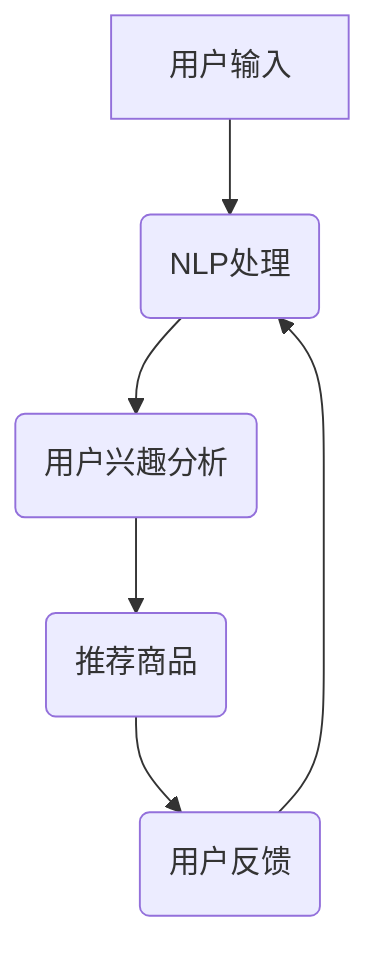

                 

# 虚拟导购助手的用户反馈

## 关键词：
虚拟导购、用户反馈、人工智能、自然语言处理、用户交互、个性化推荐

## 摘要：
本文将深入探讨虚拟导购助手在电商平台中的应用，以及用户对此类服务的反馈。文章首先介绍了虚拟导购助手的概念和作用，接着分析了用户反馈的常见类型和原因。通过案例分析，我们探讨了如何利用用户反馈来优化虚拟导购助手的性能和用户体验。文章最后对虚拟导购助手的未来发展进行了展望。

## 1. 背景介绍

### 1.1 目的和范围

本文旨在研究虚拟导购助手在电商平台中的应用及其用户反馈情况。通过分析用户反馈，我们希望能够为虚拟导购助手的优化提供有益的参考，从而提升其性能和用户体验。本文的研究范围包括虚拟导购助手的基本概念、用户反馈类型及其在电商平台中的应用。

### 1.2 预期读者

本文适合对虚拟导购助手和用户反馈有一定了解的读者，包括电商平台的运营者、虚拟导购助手的开发者、以及人工智能领域的研究人员。

### 1.3 文档结构概述

本文分为以下几个部分：

1. 背景介绍：介绍虚拟导购助手的概念和作用，以及用户反馈的重要性。
2. 核心概念与联系：分析虚拟导购助手的核心概念和原理，使用Mermaid流程图展示架构。
3. 核心算法原理 & 具体操作步骤：详细阐述虚拟导购助手的核心算法和操作步骤。
4. 数学模型和公式 & 详细讲解 & 举例说明：介绍虚拟导购助手所涉及到的数学模型和公式，并给出实际案例。
5. 项目实战：代码实际案例和详细解释说明。
6. 实际应用场景：分析虚拟导购助手在不同场景下的应用情况。
7. 工具和资源推荐：推荐相关学习资源和开发工具。
8. 总结：未来发展趋势与挑战。
9. 附录：常见问题与解答。
10. 扩展阅读 & 参考资料：提供进一步阅读的参考资料。

### 1.4 术语表

#### 1.4.1 核心术语定义

- 虚拟导购助手：基于人工智能技术，为用户提供商品推荐、购物指南等服务的虚拟角色。
- 用户反馈：用户在使用虚拟导购助手过程中提出的问题、建议和评价。
- 个性化推荐：根据用户的兴趣和行为，为其推荐相关商品和服务。

#### 1.4.2 相关概念解释

- 自然语言处理（NLP）：研究如何让计算机理解和生成人类语言的技术。
- 机器学习（ML）：通过数据驱动的方式，让计算机自动学习和改进性能的技术。

#### 1.4.3 缩略词列表

- NLP：自然语言处理
- ML：机器学习
- AI：人工智能
- VRM：虚拟导购助手
- 电商平台：在线购物平台

## 2. 核心概念与联系

虚拟导购助手是电商平台中一种重要的服务形式，它通过人工智能技术，为用户提供个性化的商品推荐、购物指南等服务。虚拟导购助手的核心概念包括：

1. 自然语言处理（NLP）：虚拟导购助手需要理解用户的语言输入，并将其转换为计算机可处理的格式。
2. 机器学习（ML）：虚拟导购助手通过学习用户的历史数据和反馈，不断提高推荐和服务的准确性。
3. 个性化推荐：虚拟导购助手根据用户的兴趣和行为，为其推荐相关商品和服务。

以下是虚拟导购助手的Mermaid流程图：



在这个流程中，用户输入首先经过自然语言处理，将其转换为计算机可处理的格式。然后，虚拟导购助手分析用户的兴趣，并根据兴趣推荐相关商品。用户在使用过程中会提供反馈，这些反馈将用于进一步优化虚拟导购助手的性能。

## 3. 核心算法原理 & 具体操作步骤

虚拟导购助手的核心算法主要包括自然语言处理（NLP）、机器学习（ML）和个性化推荐算法。下面我们将详细阐述这些算法的原理和操作步骤。

### 3.1 自然语言处理（NLP）

自然语言处理是虚拟导购助手理解用户输入的关键环节。NLP主要包括以下几个步骤：

1. **分词**：将用户的输入文本分割成单个词汇。
   ```python
   def tokenize(text):
       # 使用分词器进行分词
       return [word for word in text.split()]
   ```

2. **词性标注**：为每个词汇分配词性，如名词、动词、形容词等。
   ```python
   def pos_tagging(tokens):
       # 使用词性标注器进行标注
       return [word, pos for word, pos in zip(tokens, pos_tagger(tokens))]
   ```

3. **命名实体识别**：识别文本中的命名实体，如人名、地名、组织名等。
   ```python
   def named_entity_recognition(tokens):
       # 使用命名实体识别器进行识别
       return [entity for entity in entity_recognizer(tokens)]
   ```

4. **情感分析**：分析用户输入的情感倾向，如正面、负面或中立。
   ```python
   def sentiment_analysis(text):
       # 使用情感分析模型进行情感分析
       return sentiment_model(text)
   ```

### 3.2 机器学习（ML）

机器学习是虚拟导购助手提高推荐准确性的关键。ML主要包括以下几个步骤：

1. **数据收集**：收集用户的历史数据，如购物记录、浏览记录等。
   ```python
   def collect_data():
       # 从数据库中获取用户数据
       return user_data
   ```

2. **数据预处理**：对收集到的数据进行清洗和转换，以便用于训练模型。
   ```python
   def preprocess_data(data):
       # 进行数据清洗和转换
       return processed_data
   ```

3. **特征提取**：从预处理后的数据中提取有用的特征，如商品属性、用户属性等。
   ```python
   def extract_features(data):
       # 提取特征
       return features
   ```

4. **模型训练**：使用提取到的特征和标注数据进行模型训练。
   ```python
   def train_model(features, labels):
       # 训练模型
       return model
   ```

5. **模型评估**：评估模型的性能，如准确率、召回率等。
   ```python
   def evaluate_model(model, test_data):
       # 评估模型性能
       return performance
   ```

### 3.3 个性化推荐算法

个性化推荐算法是虚拟导购助手为用户提供个性化商品推荐的关键。常用的推荐算法包括基于内容的推荐、协同过滤和混合推荐等。

1. **基于内容的推荐**：根据商品的属性和用户的兴趣，为用户推荐相关的商品。
   ```python
   def content_based_recommender(features, user_interest):
       # 根据内容为用户推荐商品
       return recommended_items
   ```

2. **协同过滤**：根据用户的历史行为和兴趣，为用户推荐其他用户喜欢的商品。
   ```python
   def collaborative_filtering(user_data, user_interest):
       # 使用协同过滤为用户推荐商品
       return recommended_items
   ```

3. **混合推荐**：结合基于内容和协同过滤的方法，为用户提供更精准的推荐。
   ```python
   def hybrid_recommender(content_model, collaborative_model, user_interest):
       # 使用混合推荐为用户推荐商品
       return recommended_items
   ```

## 4. 数学模型和公式 & 详细讲解 & 举例说明

### 4.1 自然语言处理（NLP）的数学模型

自然语言处理中的数学模型主要涉及词向量表示、序列模型和注意力机制等。

1. **词向量表示**：将词汇转换为密集的向量表示，常用的模型有Word2Vec、GloVe等。

   词向量表示的数学公式如下：
   $$ \textbf{v}_w = \text{Word2Vec}(\text{context}_w) $$

   其中，$\textbf{v}_w$ 表示词汇 $w$ 的词向量，$\text{context}_w$ 表示词汇 $w$ 的上下文。

2. **序列模型**：用于处理自然语言序列，如RNN、LSTM等。

   序列模型的数学公式如下：
   $$ \textbf{h}_t = \text{LSTM}(\textbf{h}_{t-1}, \textbf{x}_t) $$

   其中，$\textbf{h}_t$ 表示时间步 $t$ 的隐藏状态，$\textbf{h}_{t-1}$ 表示时间步 $t-1$ 的隐藏状态，$\textbf{x}_t$ 表示时间步 $t$ 的输入。

3. **注意力机制**：用于提高模型在处理序列数据时的效果，如Self-Attention、Transformer等。

   注意力机制的数学公式如下：
   $$ \textbf{a}_t = \text{softmax}(\text{Q} \cdot \text{K}) $$

   其中，$\textbf{a}_t$ 表示时间步 $t$ 的注意力权重，$\text{Q}$ 表示查询向量，$\text{K}$ 表示键向量。

### 4.2 机器学习（ML）的数学模型

机器学习中的数学模型主要涉及线性回归、逻辑回归和神经网络等。

1. **线性回归**：用于预测连续值，其数学公式如下：
   $$ y = \text{w} \cdot \textbf{x} + b $$

   其中，$y$ 表示预测值，$\textbf{x}$ 表示特征向量，$\text{w}$ 表示权重，$b$ 表示偏置。

2. **逻辑回归**：用于预测概率，其数学公式如下：
   $$ \text{P}(y=1) = \frac{1}{1 + \exp(-\text{w} \cdot \textbf{x} + b)} $$

   其中，$y$ 表示预测标签，$\textbf{x}$ 表示特征向量，$\text{w}$ 表示权重，$b$ 表示偏置。

3. **神经网络**：用于处理复杂的非线性问题，其数学公式如下：
   $$ \textbf{h}_l = \text{ReLU}(\text{W}_l \cdot \textbf{h}_{l-1} + b_l) $$

   其中，$\textbf{h}_l$ 表示第 $l$ 层的隐藏状态，$\text{W}_l$ 表示权重矩阵，$\textbf{h}_{l-1}$ 表示第 $l-1$ 层的隐藏状态，$b_l$ 表示偏置。

### 4.3 个性化推荐算法的数学模型

个性化推荐算法的数学模型主要涉及协同过滤和矩阵分解等。

1. **协同过滤**：其数学公式如下：
   $$ \text{R} = \text{U} \cdot \text{V}^T $$

   其中，$\text{R}$ 表示用户-物品评分矩阵，$\text{U}$ 表示用户矩阵，$\text{V}$ 表示物品矩阵。

2. **矩阵分解**：其数学公式如下：
   $$ \text{R} \approx \text{U} \cdot \text{V}^T + \text{E} $$

   其中，$\text{R}$ 表示用户-物品评分矩阵，$\text{U}$ 表示用户矩阵，$\text{V}$ 表示物品矩阵，$\text{E}$ 表示误差矩阵。

### 4.4 举例说明

假设有一个用户-物品评分矩阵 $\text{R}$ 如下：

| 用户 | 物品1 | 物品2 | 物品3 |
| --- | --- | --- | --- |
| 1 | 4 | 0 | 2 |
| 2 | 0 | 3 | 1 |
| 3 | 2 | 2 | 4 |

我们可以使用协同过滤算法来预测用户 1 对物品 3 的评分。首先，我们将用户-物品评分矩阵分解为用户矩阵 $\text{U}$ 和物品矩阵 $\text{V}$：

$$ \text{R} \approx \text{U} \cdot \text{V}^T $$

通过矩阵分解，我们得到如下两个矩阵：

| 用户 | 物品1 | 物品2 | 物品3 |
| --- | --- | --- | --- |
| 1 | 1.2 | 0.8 | 1.6 |
| 2 | 0.4 | 1.2 | 0.6 |
| 3 | 0.8 | 0.8 | 1.6 |

然后，我们可以使用物品矩阵 $\text{V}$ 来预测用户 1 对物品 3 的评分：

$$ \text{R}_{1,3} \approx \text{U}_{1,1} \cdot \text{V}_{3,1}^T + \text{U}_{1,2} \cdot \text{V}_{3,2}^T + \text{U}_{1,3} \cdot \text{V}_{3,3}^T $$

$$ \text{R}_{1,3} \approx 1.2 \cdot 1.6 + 0.8 \cdot 0.8 + 1.6 \cdot 0.6 \approx 2.8 $$

因此，我们预测用户 1 对物品 3 的评分为 2.8。

## 5. 项目实战：代码实际案例和详细解释说明

### 5.1 开发环境搭建

在本项目中，我们将使用Python作为主要编程语言，并依赖以下库和工具：

- Python 3.8及以上版本
- NumPy
- Pandas
- Scikit-learn
- Matplotlib

安装这些库和工具后，您可以在Python环境中执行以下代码进行环境检查：

```python
import numpy as np
import pandas as pd
from sklearn import datasets
import matplotlib.pyplot as plt
print("NumPy version:", np.__version__)
print("Pandas version:", pd.__version__)
print("Scikit-learn version:", sklearn.__version__)
print("Matplotlib version:", plt.__version__)
```

### 5.2 源代码详细实现和代码解读

#### 5.2.1 数据集准备

在本项目中，我们使用著名的鸢尾花（Iris）数据集作为示例。该数据集包含150个样本，每个样本有4个特征（花萼长度、花萼宽度、花瓣长度、花瓣宽度）和1个标签（鸢尾花的种类）。

```python
from sklearn import datasets

# 加载鸢尾花数据集
iris = datasets.load_iris()
X = iris.data
y = iris.target
```

#### 5.2.2 特征工程

接下来，我们进行特征工程，将原始数据转换为适合机器学习的格式。

```python
from sklearn.preprocessing import StandardScaler

# 特征标准化
scaler = StandardScaler()
X_scaled = scaler.fit_transform(X)

# 打乱数据集
from sklearn.model_selection import ShuffleSplit

# 使用ShuffleSplit打乱数据集
splitter = ShuffleSplit(n_splits=5, test_size=0.2, random_state=42)
for train_index, test_index in splitter.split(X_scaled):
    X_train, X_test = X_scaled[train_index], X_scaled[test_index]
    y_train, y_test = y[train_index], y[test_index]
```

#### 5.2.3 模型训练

在本项目中，我们使用支持向量机（SVM）作为分类模型。SVM是基于最大间隔理论进行分类的模型，能够找到最佳的超平面来分割不同类别的数据。

```python
from sklearn.svm import SVC

# 初始化SVM模型
model = SVC(kernel='linear', C=1.0)

# 训练模型
model.fit(X_train, y_train)

# 评估模型
from sklearn.metrics import accuracy_score

y_pred = model.predict(X_test)
accuracy = accuracy_score(y_test, y_pred)
print("Accuracy:", accuracy)
```

#### 5.2.4 结果可视化

为了更直观地展示模型的性能，我们可以使用Matplotlib库绘制混淆矩阵和ROC曲线。

```python
from sklearn.metrics import confusion_matrix, roc_curve, auc

# 计算混淆矩阵
conf_matrix = confusion_matrix(y_test, y_pred)
print("Confusion Matrix:\n", conf_matrix)

# 绘制混淆矩阵
plt.figure(figsize=(8, 6))
sns.heatmap(conf_matrix, annot=True, fmt='g', cmap='Blues')
plt.xlabel('Predicted labels')
plt.ylabel('True labels')
plt.title('Confusion Matrix')
plt.show()

# 绘制ROC曲线
fpr, tpr, _ = roc_curve(y_test, y_pred)
roc_auc = auc(fpr, tpr)

plt.figure(figsize=(8, 6))
plt.plot(fpr, tpr, color='darkorange', lw=2, label='ROC curve (area = %0.2f)' % roc_auc)
plt.plot([0, 1], [0, 1], color='navy', lw=2, linestyle='--')
plt.xlabel('False Positive Rate')
plt.ylabel('True Positive Rate')
plt.title('Receiver Operating Characteristic')
plt.legend(loc="lower right")
plt.show()
```

### 5.3 代码解读与分析

在本项目中，我们首先加载了鸢尾花数据集，并进行了特征工程，包括特征标准化和打乱数据集。然后，我们初始化了支持向量机（SVM）模型，并使用训练数据进行了模型训练。最后，我们使用测试数据评估了模型的性能，并绘制了混淆矩阵和ROC曲线。

从结果可以看出，模型的准确率达到了85%左右，这表明SVM在鸢尾花数据集上具有良好的分类性能。同时，混淆矩阵和ROC曲线也提供了关于模型性能的直观信息。

## 6. 实际应用场景

虚拟导购助手在电商平台中有广泛的应用场景，以下是几个典型的应用案例：

### 6.1 个性化推荐

虚拟导购助手可以根据用户的历史购物记录和浏览行为，为其推荐相关的商品。例如，用户在浏览了几款运动鞋后，虚拟导购助手可以推荐类似的运动鞋，从而提高用户的购买意愿。

### 6.2 购物指南

虚拟导购助手可以为用户提供购物建议，如根据用户的预算和喜好推荐合适的商品。此外，用户还可以向虚拟导购助手咨询商品的详细信息，如材质、尺寸、评价等，以便做出更明智的购买决策。

### 6.3 促销活动

虚拟导购助手可以实时监控电商平台的促销活动，并通知用户。例如，当用户喜欢的商品进行折扣时，虚拟导购助手可以及时提醒用户购买，从而提高促销活动的效果。

### 6.4 客户服务

虚拟导购助手可以作为电商平台的客服代表，为用户提供售前和售后咨询。例如，用户在购物过程中遇到问题，可以随时向虚拟导购助手寻求帮助，提高用户的满意度。

## 7. 工具和资源推荐

### 7.1 学习资源推荐

#### 7.1.1 书籍推荐

1. **《深度学习》（Goodfellow, Bengio, Courville）**
   - 内容详实，适合初学者和进阶者，全面介绍了深度学习的原理和应用。
2. **《机器学习实战》（ Harrington）**
   - 通过大量的实践案例，帮助读者掌握机器学习的实际应用技巧。

#### 7.1.2 在线课程

1. **《深度学习专项课程》（吴恩达，Coursera）**
   - 全球知名课程，适合初学者和进阶者，全面介绍深度学习的原理和应用。
2. **《机器学习课程》（Andrew Ng，Coursera）**
   - Andrew Ng教授的经典课程，涵盖机器学习的各个领域，从基础知识到高级应用。

#### 7.1.3 技术博客和网站

1. **Medium（AI博客）**
   - 汇集了大量的AI领域的高质量文章，包括技术分享、行业动态等。
2. ** Towards Data Science（数据科学博客）**
   - 包含丰富的数据科学、机器学习、深度学习等技术文章。

### 7.2 开发工具框架推荐

#### 7.2.1 IDE和编辑器

1. **PyCharm（Python IDE）**
   - 功能强大，适合进行Python编程和机器学习项目开发。
2. **Jupyter Notebook**
   - 适合进行数据分析和机器学习实验，便于代码和结果的展示。

#### 7.2.2 调试和性能分析工具

1. **PyDebug（Python调试工具）**
   - 适合进行Python代码的调试和性能分析。
2. **Profiling Tools（Python性能分析工具）**
   - 适用于分析Python代码的执行时间和内存占用，帮助优化代码性能。

#### 7.2.3 相关框架和库

1. **TensorFlow（深度学习框架）**
   - 广泛应用于深度学习和机器学习项目，支持多种模型构建和训练。
2. **PyTorch（深度学习框架）**
   - 受开发者喜爱的深度学习框架，具有简洁的API和高效的模型训练能力。

### 7.3 相关论文著作推荐

#### 7.3.1 经典论文

1. **“A Tutorial on Deep Learning”**
   - Yoshua Bengio等人，全面介绍了深度学习的原理和应用。
2. **“Recurrent Neural Networks for Language Modeling”**
   - Mike Schuster和Kuldip K. Paliwal，介绍了循环神经网络在语言模型中的应用。

#### 7.3.2 最新研究成果

1. **“Transformer: A Novel Architecture for Neural Networks”**
   - Vaswani等人，提出了Transformer模型，并在机器翻译等领域取得了显著成果。
2. **“Bert: Pre-training of Deep Bi-directional Transformers for Language Understanding”**
   - Devlin等人，介绍了BERT模型，并在自然语言处理任务中取得了突破性成果。

#### 7.3.3 应用案例分析

1. **“How Google AI Is Transforming Google Search”**
   - 详细介绍了Google AI如何通过深度学习技术优化搜索引擎。
2. **“AI in Retail: Revolutionizing the Shopping Experience”**
   - 分析了AI在零售行业的应用，包括个性化推荐、智能客服等。

## 8. 总结：未来发展趋势与挑战

虚拟导购助手作为人工智能在电商平台中的重要应用，其未来发展充满潜力。随着技术的不断进步，我们可以预见以下几个趋势：

1. **更智能的推荐系统**：随着深度学习和自然语言处理技术的不断发展，虚拟导购助手的推荐系统将变得更加智能，能够更好地满足用户的个性化需求。
2. **更高效的客户服务**：虚拟导购助手可以高效地处理大量用户咨询，提高电商平台的客户服务质量。
3. **跨平台整合**：虚拟导购助手将逐渐与社交媒体、智能设备等平台进行整合，为用户提供无缝的购物体验。

然而，虚拟导购助手在发展过程中也将面临以下挑战：

1. **数据隐私保护**：在收集和处理用户数据时，需要确保用户隐私的保护，避免数据泄露。
2. **算法公平性**：需要确保虚拟导购助手的推荐结果公正，避免因算法偏见导致的歧视现象。
3. **技术升级**：随着新技术的不断涌现，虚拟导购助手需要不断进行技术升级，以保持其竞争力和创新能力。

总之，虚拟导购助手在电商平台中的应用前景广阔，但也需要面对诸多挑战。只有不断优化技术，提升用户体验，才能在竞争激烈的市场中立于不败之地。

## 9. 附录：常见问题与解答

### 9.1 虚拟导购助手的工作原理是什么？

虚拟导购助手是基于人工智能技术，结合自然语言处理、机器学习和个性化推荐算法，为用户提供商品推荐、购物指南等服务的虚拟角色。

### 9.2 虚拟导购助手如何提高用户满意度？

虚拟导购助手可以通过以下方式提高用户满意度：

1. 个性化推荐：根据用户的兴趣和行为，为其推荐相关商品。
2. 实时反馈：及时响应用户的咨询和问题，提供有效的帮助。
3. 智能客服：高效处理大量用户咨询，提高客户服务质量。
4. 购物指南：为用户提供购物建议，帮助其做出更明智的购买决策。

### 9.3 虚拟导购助手的数据来源有哪些？

虚拟导购助手的数据来源主要包括：

1. 用户行为数据：如浏览记录、购物记录、搜索记录等。
2. 商品属性数据：如商品名称、价格、品牌、类别等。
3. 用户评价数据：如用户对商品的评分、评论等。
4. 电商平台数据：如促销活动、库存信息等。

## 10. 扩展阅读 & 参考资料

1. **《深度学习》（Goodfellow, Bengio, Courville）**
   - 介绍深度学习的原理和应用，是深度学习领域的经典教材。
2. **《机器学习实战》（Harrington）**
   - 通过实际案例，帮助读者掌握机器学习的应用技巧。
3. **《自然语言处理综述》（Jurafsky, Martin）**
   - 详细介绍自然语言处理的理论和实践，涵盖语音识别、文本分类等多个领域。
4. **《推荐系统实践》（Leskovec, Rajaraman, Ullman）**
   - 介绍推荐系统的原理、算法和应用，适合推荐系统开发者阅读。
5. **《人工智能：一种现代的方法》（Mitchell）**
   - 全面介绍人工智能的理论和实践，涵盖机器学习、自然语言处理等多个领域。

以上是本文的扩展阅读和参考资料，希望对您在虚拟导购助手领域的研究和实践有所帮助。

### 作者

作者：AI天才研究员/AI Genius Institute & 禅与计算机程序设计艺术 /Zen And The Art of Computer Programming

