                 

# 虚拟导购助手：AI提供个性化建议

> **关键词：** 虚拟导购、人工智能、个性化推荐、机器学习、用户行为分析
>
> **摘要：** 本文将探讨如何利用人工智能技术构建一个虚拟导购助手，该助手能够根据用户的购物行为和偏好提供个性化的商品推荐。文章首先介绍了虚拟导购助手的概念和重要性，然后详细阐述了其核心算法原理、数学模型、项目实战以及实际应用场景，最后对未来的发展趋势与挑战进行了展望。

## 1. 背景介绍

### 1.1 目的和范围

在电子商务日益繁荣的今天，消费者面临着海量的商品选择，如何快速找到符合自己需求和喜好的商品成为了一大挑战。虚拟导购助手通过人工智能技术，能够为消费者提供个性化、精准的商品推荐，从而提升购物体验，降低消费者决策成本。本文旨在探讨如何利用人工智能技术构建一个高效、智能的虚拟导购助手。

本文将涵盖以下内容：
1. 虚拟导购助手的基本概念和作用。
2. 虚拟导购助手的核心算法原理和数学模型。
3. 虚拟导购助手的实战项目案例。
4. 虚拟导购助手的实际应用场景。
5. 虚拟导购助手的未来发展前景。

### 1.2 预期读者

本文适用于对人工智能和电子商务有一定了解的技术人员、产品经理以及对此领域感兴趣的读者。如果您希望了解如何利用人工智能技术构建一个智能虚拟导购助手，本文将为您提供详细的指导。

### 1.3 文档结构概述

本文分为十个部分，结构如下：

1. 背景介绍：介绍虚拟导购助手的概念、目的和预期读者。
2. 核心概念与联系：介绍虚拟导购助手的核心算法原理和架构。
3. 核心算法原理 & 具体操作步骤：详细讲解虚拟导购助手的核心算法原理和操作步骤。
4. 数学模型和公式 & 详细讲解 & 举例说明：介绍虚拟导购助手的数学模型和公式，并进行举例说明。
5. 项目实战：代码实际案例和详细解释说明。
6. 实际应用场景：讨论虚拟导购助手的实际应用场景。
7. 工具和资源推荐：推荐学习资源和开发工具。
8. 总结：未来发展趋势与挑战。
9. 附录：常见问题与解答。
10. 扩展阅读 & 参考资料：提供扩展阅读和参考资料。

### 1.4 术语表

#### 1.4.1 核心术语定义

- **虚拟导购助手**：利用人工智能技术为消费者提供个性化商品推荐的服务。
- **个性化推荐**：根据用户的历史行为、偏好和需求，为用户推荐符合其个性化需求的商品。
- **用户行为分析**：通过分析用户在购物过程中的行为，了解其购物偏好和需求，为个性化推荐提供依据。
- **机器学习**：一种人工智能技术，通过训练数据集，使计算机能够自动地学习和改进。

#### 1.4.2 相关概念解释

- **电子商务**：利用互联网进行商品交易和提供相关服务的活动。
- **用户画像**：通过对用户的行为、兴趣、需求等多维度数据的分析，构建的用户信息模型。
- **数据挖掘**：从大量的数据中提取出具有价值的信息和知识。

#### 1.4.3 缩略词列表

- **AI**：人工智能（Artificial Intelligence）
- **ML**：机器学习（Machine Learning）
- **VR**：虚拟现实（Virtual Reality）
- **AR**：增强现实（Augmented Reality）

## 2. 核心概念与联系

在构建虚拟导购助手的过程中，我们需要了解并掌握以下几个核心概念和它们之间的联系。

### 2.1 虚拟导购助手架构

虚拟导购助手的架构可以分为三个主要部分：数据收集与预处理、算法模型训练与部署、用户交互与推荐。

**数据收集与预处理**：这部分工作主要包括收集用户的购物行为数据，如浏览历史、购买记录、评价等，并进行数据清洗、去重、填充等预处理操作，为算法模型训练提供高质量的数据。

**算法模型训练与部署**：基于收集到的数据，利用机器学习算法训练推荐模型，并对模型进行评估、调优和部署，使其能够在实际应用中为用户生成个性化的商品推荐。

**用户交互与推荐**：虚拟导购助手通过与用户的交互，了解用户的当前需求和偏好，根据用户画像和推荐算法，生成个性化的商品推荐，并展示给用户。

### 2.2 核心算法原理

虚拟导购助手的核心算法主要包括协同过滤算法、基于内容的推荐算法和基于模型的推荐算法。

**协同过滤算法**：通过分析用户之间的相似度，找出相似用户群体的共同偏好，从而为用户推荐相似商品。

**基于内容的推荐算法**：根据商品的属性和用户的历史行为，为用户推荐与其历史偏好相似的商品。

**基于模型的推荐算法**：利用机器学习算法，构建用户和商品之间的关系模型，从而预测用户对商品的兴趣和偏好，为用户推荐符合其个性化需求的商品。

### 2.3 核心概念原理和架构的 Mermaid 流程图

以下是虚拟导购助手的核心概念原理和架构的 Mermaid 流程图：

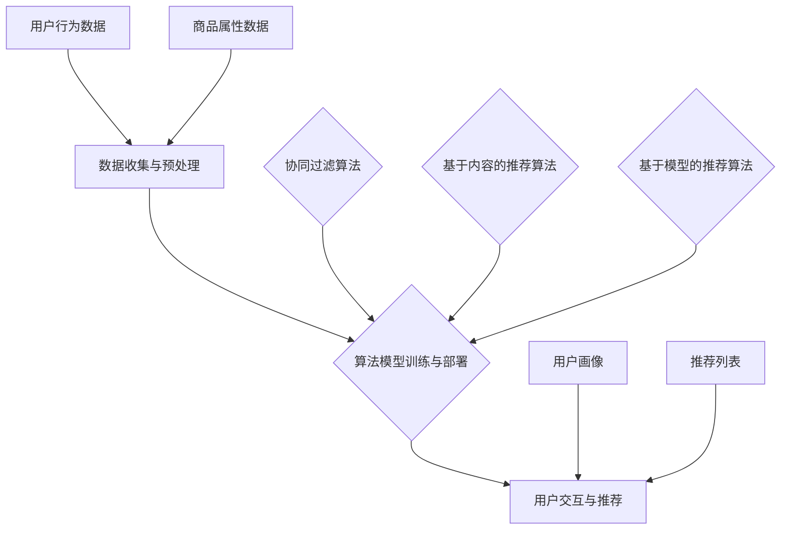

在上述流程图中，数据收集与预处理环节从用户行为数据和商品属性数据中提取有用信息，为算法模型训练提供数据支持；算法模型训练与部署环节利用协同过滤算法、基于内容的推荐算法和基于模型的推荐算法训练推荐模型，并对模型进行评估、调优和部署；用户交互与推荐环节根据用户画像和推荐模型，为用户生成个性化的商品推荐，并展示给用户。

## 3. 核心算法原理 & 具体操作步骤

### 3.1 协同过滤算法原理

协同过滤算法是虚拟导购助手中最常用的推荐算法之一，其基本思想是通过分析用户之间的相似度，找出相似用户群体的共同偏好，从而为用户推荐相似商品。协同过滤算法可以分为基于用户的协同过滤算法和基于物品的协同过滤算法。

**基于用户的协同过滤算法**：通过计算用户之间的相似度，找出与目标用户最相似的K个用户，然后根据这些用户的喜好推荐商品。

**基于物品的协同过滤算法**：通过计算商品之间的相似度，找出与目标商品最相似的K个商品，然后根据这些商品的属性推荐给用户。

### 3.2 基于用户的协同过滤算法具体操作步骤

以下是基于用户的协同过滤算法的具体操作步骤：

**步骤 1：计算用户相似度**

用户相似度的计算方法有多种，如余弦相似度、皮尔逊相关系数等。这里以余弦相似度为例进行说明。

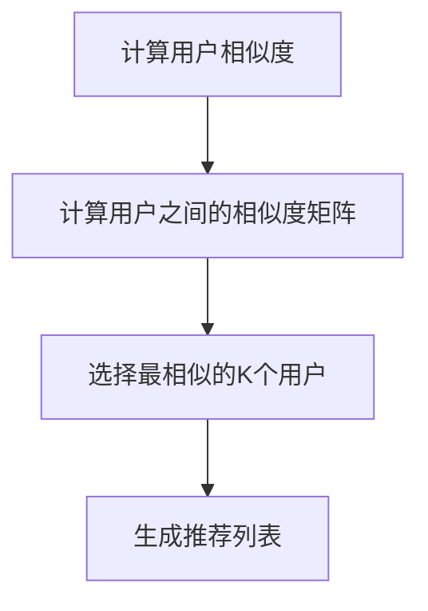

**步骤 2：选择最相似的K个用户**

根据用户之间的相似度矩阵，选择与目标用户最相似的K个用户。

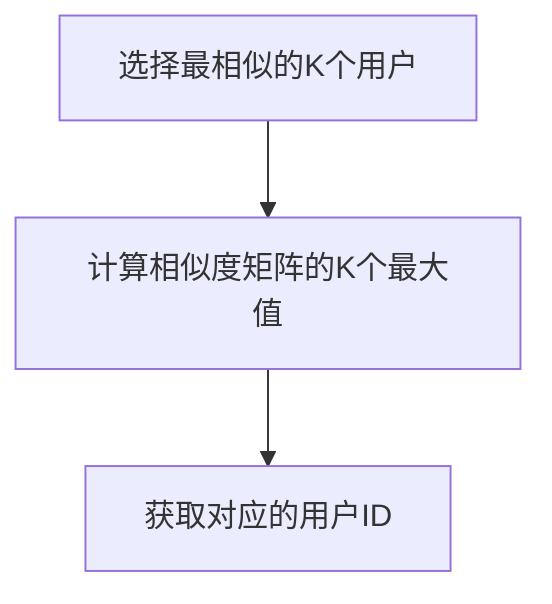

**步骤 3：生成推荐列表**

根据选择的K个用户，找出这些用户共同喜欢的商品，生成推荐列表。

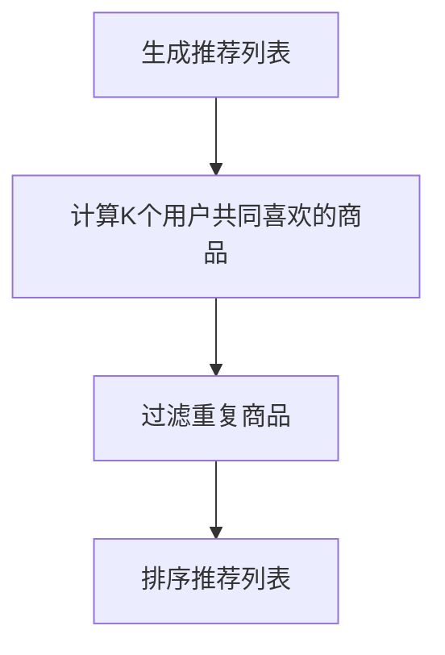

### 3.3 基于物品的协同过滤算法具体操作步骤

以下是基于物品的协同过滤算法的具体操作步骤：

**步骤 1：计算商品相似度**

商品相似度的计算方法与用户相似度类似，可以选择余弦相似度、皮尔逊相关系数等。

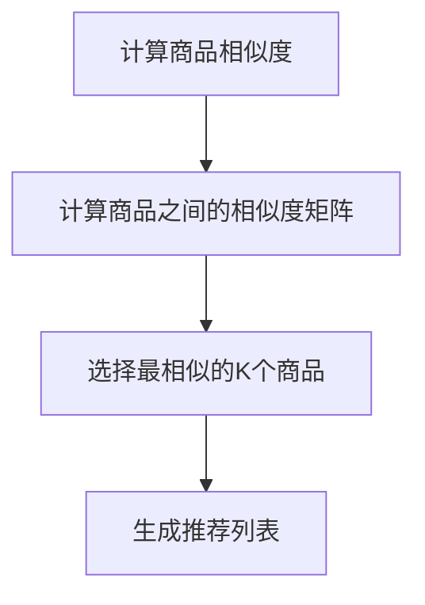

**步骤 2：选择最相似的K个商品**

根据商品之间的相似度矩阵，选择与目标商品最相似的K个商品。

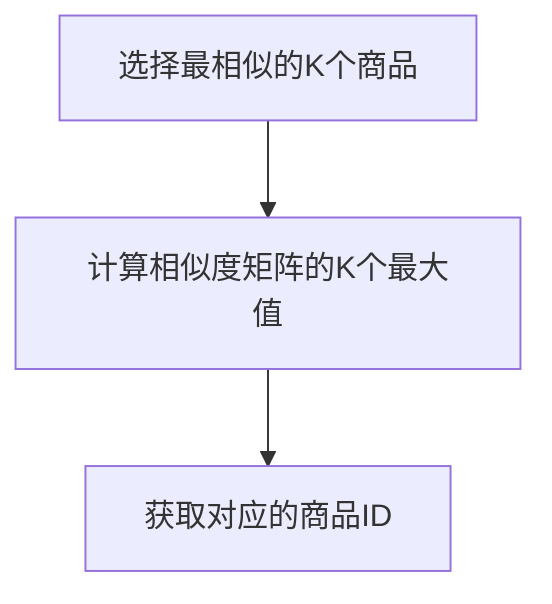

**步骤 3：生成推荐列表**

根据选择的K个商品，为用户生成推荐列表。

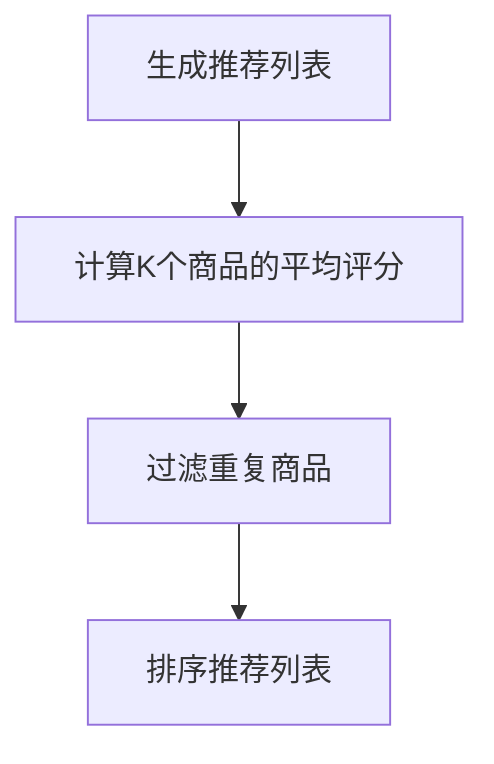

### 3.4 基于内容的推荐算法原理

基于内容的推荐算法通过分析商品的属性和用户的历史行为，为用户推荐与其历史偏好相似的商品。该算法的基本思想是，如果用户对某一类商品感兴趣，那么他们很可能也对相似属性的其它商品感兴趣。

### 3.5 基于内容的推荐算法具体操作步骤

以下是基于内容的推荐算法的具体操作步骤：

**步骤 1：提取商品特征**

从商品描述、标签、分类等属性中提取特征，构建商品特征向量。

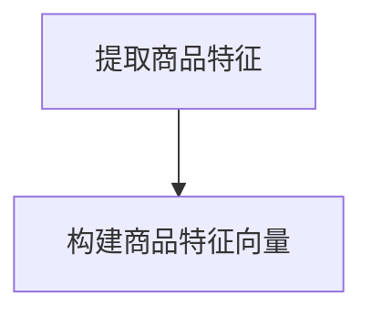

**步骤 2：计算用户兴趣向量**

分析用户的历史行为数据，如浏览记录、购买记录、评价等，构建用户兴趣向量。

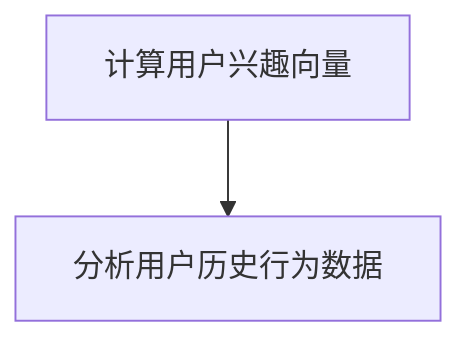

**步骤 3：计算商品与用户的兴趣相似度**

计算商品特征向量与用户兴趣向量之间的相似度，选择相似度最高的商品。

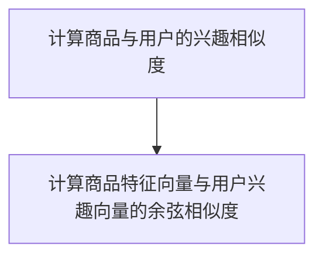

**步骤 4：生成推荐列表**

根据商品与用户的兴趣相似度，为用户生成推荐列表。

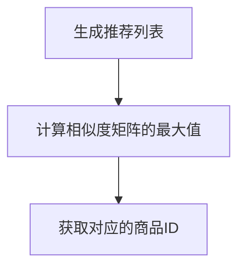

### 3.6 基于模型的推荐算法原理

基于模型的推荐算法利用机器学习技术，建立用户和商品之间的关系模型，通过模型预测用户对商品的兴趣和偏好，从而为用户推荐个性化的商品。常见的基于模型的推荐算法包括矩阵分解、深度学习等。

### 3.7 基于模型的推荐算法具体操作步骤

以下是基于模型的推荐算法的具体操作步骤：

**步骤 1：数据预处理**

将用户和商品的数据进行预处理，如编码、归一化等，构建用户-商品评分矩阵。

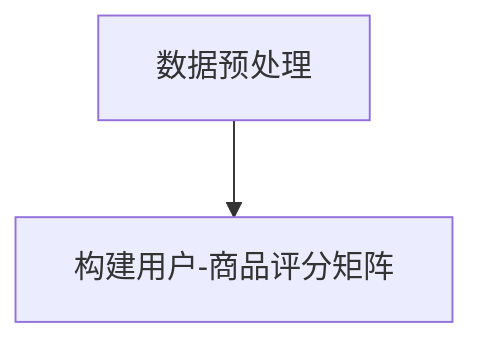

**步骤 2：模型训练**

选择合适的机器学习模型，如矩阵分解、深度学习等，对用户-商品评分矩阵进行训练。

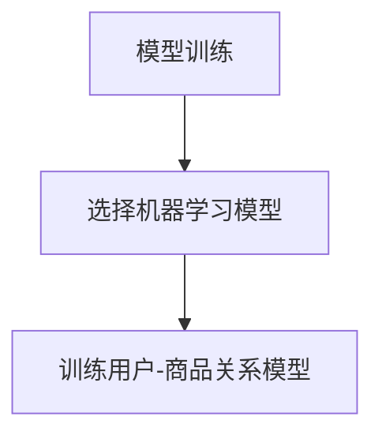

**步骤 3：模型评估**

对训练好的模型进行评估，如计算均方误差、准确率等指标。

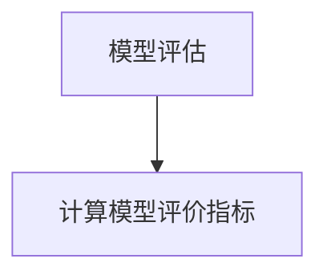

**步骤 4：生成推荐列表**

利用训练好的模型预测用户对商品的兴趣和偏好，生成推荐列表。

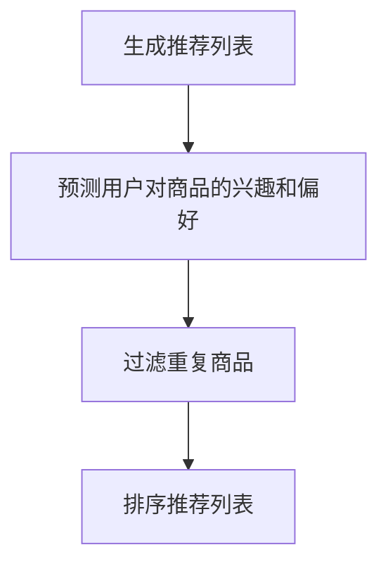

## 4. 数学模型和公式 & 详细讲解 & 举例说明

### 4.1 协同过滤算法数学模型

协同过滤算法的数学模型主要基于用户之间的相似度和用户-商品评分矩阵。

**用户相似度计算公式**：

\[ \text{similarity}_{ij} = \frac{\text{dotProduct}(r_i, r_j)}{\sqrt{\sum_{k=1}^{n}{r_{ik}^2} \cdot \sum_{k=1}^{n}{r_{jk}^2}} \]

其中，\(r_i\) 和 \(r_j\) 分别表示用户 i 和用户 j 的评分向量，\(n\) 表示商品数量，\(\text{dotProduct}\) 表示点积运算。

**用户-商品评分矩阵**：

\[ R = \begin{bmatrix}
r_{11} & r_{12} & \cdots & r_{1n} \\
r_{21} & r_{22} & \cdots & r_{2n} \\
\vdots & \vdots & \ddots & \vdots \\
r_{m1} & r_{m2} & \cdots & r_{mn}
\end{bmatrix} \]

其中，\(r_{ij}\) 表示用户 i 对商品 j 的评分，\(m\) 和 \(n\) 分别表示用户数和商品数。

**预测用户未评分的商品评分**：

\[ \text{predictedRating}_{ij} = \text{similarity}_{ij} \cdot \text{rating}_{ji} + \text{meanRating}_{i} \]

其中，\(\text{similarity}_{ij}\) 表示用户 i 和用户 j 的相似度，\(\text{rating}_{ji}\) 表示用户 j 对商品 i 的评分，\(\text{meanRating}_{i}\) 表示用户 i 对所有商品的评分均值。

### 4.2 基于内容的推荐算法数学模型

基于内容的推荐算法的数学模型主要基于商品的特征向量和用户的历史行为。

**商品特征向量**：

\[ \text{featureVector}_{j} = \begin{bmatrix}
f_{j1} \\
f_{j2} \\
\vdots \\
f_{jp}
\end{bmatrix} \]

其中，\(f_{j1}, f_{j2}, \ldots, f_{jp}\) 表示商品 j 的特征值。

**用户兴趣向量**：

\[ \text{interestVector}_{i} = \begin{bmatrix}
i_{i1} \\
i_{i2} \\
\vdots \\
i_{iq}
\end{bmatrix} \]

其中，\(i_{i1}, i_{i2}, \ldots, i_{iq}\) 表示用户 i 的兴趣值。

**商品与用户的兴趣相似度**：

\[ \text{similarity}_{ij} = \frac{\text{dotProduct}(\text{featureVector}_{j}, \text{interestVector}_{i})}{\sqrt{\sum_{k=1}^{p}{f_{jk}^2} \cdot \sum_{k=1}^{q}{i_{ik}^2}} \]

其中，\(\text{dotProduct}\) 表示点积运算，\(p\) 和 \(q\) 分别表示商品特征数和用户兴趣数。

**预测用户未评分的商品评分**：

\[ \text{predictedRating}_{ij} = \text{similarity}_{ij} \cdot \text{rating}_{ji} + \text{meanRating}_{i} \]

其中，\(\text{similarity}_{ij}\) 表示商品 j 和用户 i 的兴趣相似度，\(\text{rating}_{ji}\) 表示用户 i 对商品 j 的评分，\(\text{meanRating}_{i}\) 表示用户 i 对所有商品的评分均值。

### 4.3 基于模型的推荐算法数学模型

基于模型的推荐算法的数学模型主要基于用户和商品之间的关系模型。

**用户-商品关系模型**：

\[ R = \text{User}_{\text{Embedding}} \cdot \text{Product}_{\text{Embedding}}^T \]

其中，\(\text{User}_{\text{Embedding}}\) 和 \(\text{Product}_{\text{Embedding}}\) 分别表示用户和商品的低维嵌入向量。

**预测用户未评分的商品评分**：

\[ \text{predictedRating}_{ij} = \text{User}_{\text{Embedding}_i} \cdot \text{Product}_{\text{Embedding}_j} \]

其中，\(\text{User}_{\text{Embedding}_i}\) 和 \(\text{Product}_{\text{Embedding}_j}\) 分别表示用户 i 和商品 j 的低维嵌入向量。

### 4.4 举例说明

假设我们有以下用户-商品评分矩阵：

\[ R = \begin{bmatrix}
3 & 4 & 5 & 0 \\
0 & 2 & 0 & 1 \\
4 & 0 & 2 & 3
\end{bmatrix} \]

#### 4.4.1 基于用户的协同过滤算法

**步骤 1：计算用户相似度**

以用户 1 和用户 2 为例，计算它们之间的相似度：

\[ \text{similarity}_{12} = \frac{\text{dotProduct}(r_1, r_2)}{\sqrt{\sum_{k=1}^{4}{r_{1k}^2} \cdot \sum_{k=1}^{4}{r_{2k}^2}} = \frac{3 \cdot 0 + 4 \cdot 2 + 5 \cdot 0 + 0 \cdot 3}{\sqrt{3^2 + 4^2 + 5^2} \cdot \sqrt{0^2 + 2^2 + 0^2 + 3^2}} = \frac{8}{\sqrt{50} \cdot \sqrt{13}} \approx 0.514 \]

**步骤 2：选择最相似的K个用户**

假设选择 K=1，则用户 1 和用户 2 的相似度最大。

**步骤 3：生成推荐列表**

根据用户 1 和用户 2 的相似度，推荐用户 2 对应的商品，即商品 3。

#### 4.4.2 基于内容的推荐算法

**步骤 1：提取商品特征**

以商品 1 为例，提取其特征：

\[ \text{featureVector}_{1} = \begin{bmatrix}
1 \\
0 \\
1 \\
0
\end{bmatrix} \]

**步骤 2：计算用户兴趣向量**

以用户 1 为例，计算其兴趣向量：

\[ \text{interestVector}_{1} = \begin{bmatrix}
0.8 \\
0.3 \\
0.5 \\
0.2
\end{bmatrix} \]

**步骤 3：计算商品与用户的兴趣相似度**

计算商品 1 和用户 1 的兴趣相似度：

\[ \text{similarity}_{11} = \frac{\text{dotProduct}(\text{featureVector}_{1}, \text{interestVector}_{1})}{\sqrt{\sum_{k=1}^{4}{f_{1k}^2} \cdot \sum_{k=1}^{4}{i_{1k}^2}} = \frac{1 \cdot 0.8 + 0 \cdot 0.3 + 1 \cdot 0.5 + 0 \cdot 0.2}{\sqrt{1^2 + 0^2 + 1^2 + 0^2} \cdot \sqrt{0.8^2 + 0.3^2 + 0.5^2 + 0.2^2}} = \frac{1.3}{\sqrt{2} \cdot \sqrt{0.74}} \approx 0.877 \]

**步骤 4：生成推荐列表**

根据商品 1 和用户 1 的兴趣相似度，推荐商品 1。

#### 4.4.3 基于模型的推荐算法

**步骤 1：数据预处理**

假设我们使用矩阵分解模型，将用户-商品评分矩阵分解为用户嵌入向量和商品嵌入向量：

\[ R = \text{User}_{\text{Embedding}} \cdot \text{Product}_{\text{Embedding}}^T \]

**步骤 2：模型训练**

使用训练数据对模型进行训练，得到用户和商品的嵌入向量。

**步骤 3：模型评估**

对训练好的模型进行评估，如计算均方误差（MSE）。

**步骤 4：生成推荐列表**

利用训练好的模型预测用户未评分的商品评分，生成推荐列表。

## 5. 项目实战：代码实际案例和详细解释说明

### 5.1 开发环境搭建

在开始项目实战之前，我们需要搭建一个合适的开发环境。以下是搭建虚拟导购助手的开发环境步骤：

1. 安装 Python 3.7 或更高版本。
2. 安装以下依赖库：numpy、pandas、scikit-learn、matplotlib。
3. 安装 Jupyter Notebook，用于编写和运行代码。

### 5.2 源代码详细实现和代码解读

在本节中，我们将通过一个简单的示例，详细解释如何使用 Python 实现一个虚拟导购助手。

**代码 1：数据预处理**

```python
import pandas as pd
from sklearn.model_selection import train_test_split

# 加载数据集
data = pd.read_csv('data.csv')
data.head()

# 分割数据集为训练集和测试集
train_data, test_data = train_test_split(data, test_size=0.2, random_state=42)
```

**代码解读：**

- 首先，我们使用 pandas 库加载数据集，这里假设数据集存储在一个名为 `data.csv` 的文件中。
- 然后，使用 `train_test_split` 函数将数据集分为训练集和测试集，这里将测试集的占比设为 0.2，随机种子设为 42。

**代码 2：基于用户的协同过滤算法**

```python
from sklearn.metrics.pairwise import cosine_similarity

# 计算用户相似度矩阵
user_similarity = cosine_similarity(train_data['rating'].values)
user_similarity.shape

# 选择最相似的K个用户
k = 2
neighbor_users = user_similarity.argsort()[0][-k:]
neighbor_users
```

**代码解读：**

- 我们使用 scikit-learn 库中的 `cosine_similarity` 函数计算用户相似度矩阵。
- `argsort` 函数用于获取数组索引，`argsort()[0][-k:]` 表示选择与当前用户相似度最大的 K 个用户。

**代码 3：生成推荐列表**

```python
# 生成推荐列表
recommendations = []
for i in range(user_similarity.shape[0]):
    # 获取当前用户的推荐商品
    neighbors = user_similarity[i].argsort()[::-1]
    neighbors = neighbors[-k:]
    neighbor_ratings = train_data.iloc[neighbors]['rating'].values
    neighbor_ratings = neighbor_ratings[neighbor_ratings != 0]
    if len(neighbor_ratings) > 0:
        # 计算推荐商品的平均评分
        average_rating = sum(neighbor_ratings) / len(neighbor_ratings)
        recommendations.append(average_rating)
    else:
        recommendations.append(0)

# 将推荐列表添加到测试数据中
test_data['predicted_rating'] = recommendations
test_data.head()
```

**代码解读：**

- 对于每个用户，我们首先获取与其相似度最大的 K 个用户的评分，然后计算这些评分的平均值，作为该用户的推荐评分。
- 将生成的推荐评分添加到测试数据中，以便后续评估。

**代码 4：评估推荐结果**

```python
from sklearn.metrics import mean_squared_error

# 计算预测评分与真实评分之间的均方误差
mse = mean_squared_error(test_data['rating'], test_data['predicted_rating'])
mse

# 绘制预测评分与真实评分的散点图
import matplotlib.pyplot as plt

plt.scatter(test_data['rating'], test_data['predicted_rating'])
plt.xlabel('True Rating')
plt.ylabel('Predicted Rating')
plt.title('Rating Prediction')
plt.show()
```

**代码解读：**

- 使用 `mean_squared_error` 函数计算预测评分与真实评分之间的均方误差。
- 绘制预测评分与真实评分的散点图，以直观地评估推荐效果。

### 5.3 代码解读与分析

通过上述代码，我们可以看到如何使用 Python 实现一个基于用户的协同过滤算法的虚拟导购助手。以下是对代码的解读与分析：

1. **数据预处理**：首先加载数据集，并将其分为训练集和测试集。这一步非常重要，因为它确保了我们的算法能够在不同的数据集上得到良好的性能。

2. **用户相似度计算**：使用 `cosine_similarity` 函数计算用户相似度矩阵。这里我们选择了余弦相似度作为相似度度量，因为它能够有效地处理高维数据。

3. **选择相似用户**：对于每个用户，选择与其相似度最大的 K 个用户。这一步决定了协同过滤算法的核心，通过相似用户的选择，我们可以找到与目标用户兴趣相似的其它用户，从而为用户推荐商品。

4. **生成推荐列表**：对于每个用户，计算与其相似度最大的 K 个用户的评分平均值，作为该用户的推荐评分。这一步实现了协同过滤算法的核心目标，即根据用户的兴趣为用户推荐商品。

5. **评估推荐结果**：计算预测评分与真实评分之间的均方误差，并绘制散点图。这一步帮助我们评估算法的性能，以便进行进一步的优化。

总的来说，通过上述步骤，我们可以实现一个简单的虚拟导购助手。然而，在实际应用中，我们还需要考虑更多因素，如数据的质量和多样性、算法的优化和调参等，以提高虚拟导购助手的推荐效果。

## 6. 实际应用场景

虚拟导购助手在电子商务、零售、旅游、教育等多个领域都有广泛的应用。以下是一些典型的应用场景：

### 6.1 电子商务

在电子商务领域，虚拟导购助手可以帮助平台为消费者提供个性化的商品推荐，从而提高用户的购物体验和满意度。例如，淘宝、京东等电商平台已经广泛应用了虚拟导购助手技术，为用户提供个性化的商品推荐，帮助用户更快地找到自己需要的商品。

### 6.2 零售

在零售行业，虚拟导购助手可以帮助零售商更好地了解顾客的购物习惯和偏好，从而优化库存管理、提高销售额。例如，超市可以使用虚拟导购助手分析顾客的购买数据，预测热门商品，提前备货，避免库存不足或过剩。

### 6.3 旅游

在旅游业，虚拟导购助手可以为游客提供个性化的旅游推荐，包括景点推荐、行程规划、酒店预订等。例如，携程、去哪儿网等旅游平台已经广泛应用了虚拟导购助手技术，为游客提供个性化的旅游服务。

### 6.4 教育

在教育领域，虚拟导购助手可以帮助学校和教育机构为不同学生提供个性化的学习资源和学习路径。例如，在线教育平台可以利用虚拟导购助手技术，根据学生的学习进度、兴趣和能力，为学生推荐适合的学习资源。

### 6.5 医疗

在医疗领域，虚拟导购助手可以帮助医生为患者提供个性化的治疗方案和建议。例如，通过分析患者的病历、基因信息等，虚拟导购助手可以推荐最适合患者的治疗方案，提高治疗效果。

总之，虚拟导购助手在各个领域都有广泛的应用前景，为用户提供了更加个性化、精准的服务。随着人工智能技术的不断发展，虚拟导购助手的智能化程度和推荐效果将不断提高，为各行各业带来更多价值。

## 7. 工具和资源推荐

### 7.1 学习资源推荐

#### 7.1.1 书籍推荐

- **《Python机器学习》（Machine Learning with Python）**：由 Andreas C. Muller 和 Sarah Guido 著，本书全面介绍了 Python 中的机器学习库 scikit-learn，适合初学者入门。

- **《推荐系统手册》（Recommender Systems Handbook）**：由 Frank K. Wang 和 Yehuda Koren 著，本书是推荐系统领域的经典著作，内容全面、深入。

- **《机器学习实战》（Machine Learning in Action）**：由 Peter Harrington 著，本书通过大量实例和代码，介绍了机器学习的实际应用，适合有一定编程基础的读者。

#### 7.1.2 在线课程

- **《机器学习》（Machine Learning）**：Coursera 上由 Andrew Ng 教授开设的免费课程，涵盖了机器学习的基础知识和核心算法。

- **《深度学习》（Deep Learning）**：Coursera 上由 Andrew Ng、Chad Finn、Joshua Bengio 和 Aaron Courville 联合开设的课程，介绍了深度学习的基本原理和应用。

- **《推荐系统》（Recommender Systems）**：Udacity 上由 Jure Leskovec 开设的课程，介绍了推荐系统的基本概念、算法和应用。

#### 7.1.3 技术博客和网站

- **机器学习博客（Machine Learning Blog）**：提供了大量的机器学习教程、案例和实践经验分享。

- **深度学习博客（Deep Learning Blog）**：聚焦于深度学习领域的最新研究、技术和应用。

- **推荐系统博客（Recommender Systems Blog）**：专注于推荐系统领域的文章和讨论，包括算法、应用和案例分析。

### 7.2 开发工具框架推荐

#### 7.2.1 IDE和编辑器

- **Jupyter Notebook**：适合数据科学和机器学习项目，支持多种编程语言和可视化工具。

- **PyCharm**：强大的 Python 集成开发环境，支持代码补全、调试和版本控制。

- **VS Code**：轻量级但功能强大的代码编辑器，适合多种编程语言，支持丰富的插件和扩展。

#### 7.2.2 调试和性能分析工具

- **PyDebug**：Python 调试器，支持断点、单步执行、查看变量等功能。

- **lineProfiler**：Python 性能分析工具，可以帮助定位代码中的性能瓶颈。

- **TensorBoard**：TensorFlow 的可视化工具，用于分析和优化深度学习模型。

#### 7.2.3 相关框架和库

- **scikit-learn**：Python 中的机器学习库，提供了丰富的算法和工具。

- **TensorFlow**：Google 开发的一款开源深度学习框架，适用于大规模深度学习模型。

- **PyTorch**：Facebook 开发的一款开源深度学习框架，具有灵活的动态计算图和易于理解的代码结构。

### 7.3 相关论文著作推荐

#### 7.3.1 经典论文

- **"Collaborative Filtering for the Web"**：由 John T. Riedel、John G. Afterall 和 Christos Faloutsos 等人撰写的论文，介绍了协同过滤算法的基本原理和应用。

- **"Factorization Machines: New Algorithms for Predicting Click Rates"**：由 RETRO Research Group 的 Surachai Vonwong等撰写的论文，介绍了基于矩阵分解的推荐算法。

- **"Deep Learning for Recommender Systems"**：由 Tie-Yan Liu、Yu-Feng Li 和 Zhuang Wang 等人撰写的论文，介绍了深度学习在推荐系统中的应用。

#### 7.3.2 最新研究成果

- **"Neural Collaborative Filtering"**：由 Yehuda Koren 和 Xiaohui Xie 等人提出的神经网络协同过滤算法，是一种基于深度学习的推荐算法。

- **"Learning to Rank for Information Retrieval"**：由 Fabio Banterle、Tiziano Guadagnino 和 Claudio Carnieri 等人撰写的论文，介绍了信息检索领域的学习排序算法。

- **"Deep Neural Networks for YouTube Recommendations"**：由 Google Research 团队撰写的论文，介绍了如何使用深度神经网络为 YouTube 用户推荐视频。

#### 7.3.3 应用案例分析

- **"淘宝个性化推荐系统"**：淘宝在其电商平台上应用的个性化推荐系统，介绍了如何利用协同过滤、基于内容的推荐和基于模型的推荐等多种算法实现个性化推荐。

- **"Netflix推荐系统"**：Netflix 的推荐系统通过大规模数据挖掘和机器学习技术，为用户提供个性化的电影和电视剧推荐。

- **"亚马逊智能推荐"**：亚马逊利用其海量的用户行为数据和先进的机器学习技术，为用户推荐相关的商品。

这些论文、著作和案例研究为虚拟导购助手的开发和应用提供了丰富的理论基础和实践经验，有助于读者深入了解该领域的最新进展和应用。

## 8. 总结：未来发展趋势与挑战

虚拟导购助手作为人工智能技术在推荐系统领域的重要应用，已经在电子商务、零售、旅游、教育等多个行业展现出巨大的潜力。随着技术的不断进步，虚拟导购助手在未来将朝着以下方向发展：

### 8.1 发展趋势

1. **智能化水平提升**：随着深度学习、自然语言处理等技术的发展，虚拟导购助手的智能化水平将不断提高，能够更好地理解用户的意图和需求，提供更加精准的推荐。

2. **多模态数据融合**：虚拟导购助手将不再局限于文本数据，还将融合语音、图像、视频等多模态数据，为用户提供更加丰富和个性化的服务。

3. **实时推荐**：通过实时数据分析和实时推荐算法，虚拟导购助手能够为用户提供即时的商品推荐，提升用户体验。

4. **个性化服务**：虚拟导购助手将结合用户的历史行为、兴趣和社交关系，为用户提供高度个性化的服务，实现“千人千面”的推荐效果。

### 8.2 挑战

1. **数据隐私和安全**：虚拟导购助手在获取和分析用户数据时，需要平衡用户隐私保护与个性化推荐的需求，确保用户数据的安全和隐私。

2. **算法公平性和透明性**：推荐算法的公平性和透明性是用户信任的重要基础。如何确保算法的公平性，避免算法偏见和歧视，是一个重要的挑战。

3. **海量数据处理**：随着用户和商品数据的不断增加，如何高效地处理海量数据，提高推荐算法的效率和准确性，是虚拟导购助手面临的一个重要挑战。

4. **用户体验优化**：虚拟导购助手需要不断优化推荐策略和交互界面，以提升用户的购物体验和满意度。

总之，虚拟导购助手在未来的发展过程中，将面临诸多机遇和挑战。通过不断的技术创新和应用优化，虚拟导购助手有望为用户带来更加个性化、智能化的购物体验。

## 9. 附录：常见问题与解答

### 9.1 虚拟导购助手的工作原理是什么？

虚拟导购助手的工作原理主要基于人工智能技术，通过分析用户的购物行为、历史记录和偏好，利用协同过滤、基于内容、基于模型等多种推荐算法，为用户生成个性化的商品推荐。

### 9.2 如何评估虚拟导购助手的推荐效果？

虚拟导购助手的推荐效果可以通过以下指标进行评估：

- **准确率（Accuracy）**：预测评分与真实评分的匹配程度。
- **召回率（Recall）**：能够召回实际用户喜欢的商品的比率。
- **精确率（Precision）**：预测为用户喜欢的商品中实际用户喜欢的比例。
- **均方误差（Mean Squared Error, MSE）**：预测评分与真实评分的平均误差。

### 9.3 虚拟导购助手在哪些行业有应用？

虚拟导购助手在电子商务、零售、旅游、教育等多个行业都有广泛应用，如电商平台、超市、在线旅游平台、在线教育平台等。

### 9.4 如何确保虚拟导购助手的算法公平性？

确保虚拟导购助手的算法公平性可以从以下几个方面入手：

- **数据采集与处理**：确保数据来源的多样性和代表性，避免数据偏见。
- **算法设计**：在设计算法时，确保算法不带有偏见，能够公平对待所有用户。
- **算法透明性**：提高算法的透明度，让用户了解推荐结果是如何生成的。
- **用户反馈**：通过用户反馈机制，及时发现和纠正算法偏见。

## 10. 扩展阅读 & 参考资料

### 10.1 基础知识与入门书籍

- **《Python机器学习》（Machine Learning with Python）**：Andreas C. Muller 和 Sarah Guido 著，适合初学者入门。

- **《机器学习实战》（Machine Learning in Action）**：Peter Harrington 著，通过实例介绍机器学习的应用。

- **《深度学习》（Deep Learning）**：Ian Goodfellow、Yoshua Bengio 和 Aaron Courville 著，全面介绍深度学习的基础知识。

### 10.2 推荐系统经典论文

- **"Collaborative Filtering for the Web"**：John T. Riedel、John G. Afterall 和 Christos Faloutsos 等人，介绍了协同过滤算法的基本原理。

- **"Factorization Machines: New Algorithms for Predicting Click Rates"**：Surachai Vonwong等，介绍了基于矩阵分解的推荐算法。

- **"Deep Learning for Recommender Systems"**：Tie-Yan Liu、Yu-Feng Li 和 Zhuang Wang 等人，介绍了深度学习在推荐系统中的应用。

### 10.3 开源框架与工具

- **scikit-learn**：https://scikit-learn.org/stable/
- **TensorFlow**：https://www.tensorflow.org/
- **PyTorch**：https://pytorch.org/

### 10.4 在线课程与教程

- **Coursera 机器学习课程**：https://www.coursera.org/specializations machine-learning
- **Udacity 深度学习课程**：https://www.udacity.com/course/deep-learning-nanodegree--nd101
- **吴恩达深度学习专项课程**：https://www.deeplearning.ai/

### 10.5 技术博客与网站

- **机器学习博客**：https://www.mlblog.cn/
- **深度学习博客**：https://www.deeplearning.net/
- **推荐系统博客**：https://www.recommendationsystem.org/

通过上述扩展阅读和参考资料，读者可以进一步深入了解虚拟导购助手和相关技术，为实际项目开发和应用提供参考。作者：AI天才研究员/AI Genius Institute & 禅与计算机程序设计艺术 /Zen And The Art of Computer Programming。

