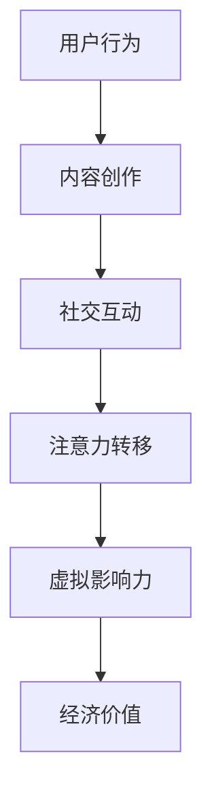

                 


# 虚拟影响力：注意力经济的新货币

> 关键词：虚拟影响力、注意力经济、货币、网络效应、用户行为分析、内容创作、社交网络

> 摘要：本文将探讨虚拟影响力这一新兴概念，它如何在注意力经济中成为新的货币。我们将逐步分析虚拟影响力的核心概念、与注意力经济的联系、关键算法原理、数学模型，并通过实际项目案例展示其在现实中的应用。最后，我们将讨论未来发展趋势与挑战，并提供相关的学习资源与工具推荐。

## 1. 背景介绍

### 1.1 目的和范围

本文旨在深入探讨虚拟影响力这一概念，分析其在当前互联网时代的作用和重要性。我们将从以下几个方面展开讨论：

1. **虚拟影响力的定义**：解释虚拟影响力的概念及其在网络经济中的角色。
2. **注意力经济的背景**：探讨注意力经济的基本原理和核心机制。
3. **关键算法原理**：介绍用于评估虚拟影响力的关键算法和模型。
4. **数学模型与公式**：详细阐述与虚拟影响力相关的数学模型和公式。
5. **实际应用场景**：分析虚拟影响力在不同领域的应用案例。
6. **工具和资源推荐**：推荐相关学习和开发资源，帮助读者深入了解虚拟影响力。
7. **未来发展趋势与挑战**：预测虚拟影响力的未来趋势，并探讨可能面临的挑战。

### 1.2 预期读者

本文适合对互联网经济、用户行为分析、内容创作以及社交网络有基本了解的读者。特别适合以下人群：

1. **互联网行业从业者**：对了解新兴商业模式和趋势感兴趣的互联网从业者。
2. **数据分析师**：对用户行为和注意力经济有深入研究的数据分析师。
3. **内容创作者**：希望提升自己内容传播效果的内容创作者。
4. **研究人员**：对虚拟影响力、注意力经济有研究兴趣的学者。

### 1.3 文档结构概述

本文将按照以下结构进行讨论：

1. **背景介绍**：介绍本文的目的、预期读者和文档结构。
2. **核心概念与联系**：阐述虚拟影响力的核心概念和与注意力经济的联系。
3. **核心算法原理 & 具体操作步骤**：讲解用于评估虚拟影响力的关键算法和模型。
4. **数学模型和公式 & 详细讲解 & 举例说明**：介绍与虚拟影响力相关的数学模型和公式。
5. **项目实战：代码实际案例和详细解释说明**：通过实际案例展示虚拟影响力的应用。
6. **实际应用场景**：分析虚拟影响力在不同领域的应用。
7. **工具和资源推荐**：推荐相关学习和开发资源。
8. **总结：未来发展趋势与挑战**：探讨虚拟影响力的未来趋势和挑战。
9. **附录：常见问题与解答**：回答常见问题。
10. **扩展阅读 & 参考资料**：提供扩展阅读和参考资料。

### 1.4 术语表

#### 1.4.1 核心术语定义

- **虚拟影响力**：在网络环境中，个人或组织通过内容创作、社交互动等手段获得的对他人的影响力和关注度。
- **注意力经济**：基于用户注意力的经济模式，通过吸引用户注意力创造价值。
- **用户行为分析**：对用户在互联网上的行为进行监测、分析和解读，以了解用户需求和行为模式。
- **内容创作**：创造和发布各种形式的内容，如文章、视频、图片等，以吸引用户关注。
- **社交网络**：用户通过社交互动建立联系的网络平台。

#### 1.4.2 相关概念解释

- **网络效应**：一个产品或服务的价值随着使用该产品或服务的用户数量的增加而增加。
- **K因子**：衡量个人或组织在社交网络中的影响力，即他们的好友数和互动频次。
- **影响力指数**：综合评估虚拟影响力的量化指标，通常包括粉丝数、互动率、内容质量等因素。

#### 1.4.3 缩略词列表

- **KPI**：关键绩效指标（Key Performance Indicators）
- **ROI**：投资回报率（Return on Investment）
- **SEO**：搜索引擎优化（Search Engine Optimization）
- **SEM**：搜索引擎营销（Search Engine Marketing）
- **UGC**：用户生成内容（User-Generated Content）

## 2. 核心概念与联系

在探讨虚拟影响力之前，我们需要了解一些核心概念和它们之间的联系。

### 2.1 虚拟影响力的定义

虚拟影响力是指在网络环境中，个人或组织通过内容创作、社交互动等手段获得的对他人的影响力和关注度。这种影响力不仅仅是数字上的增长，更重要的是它能够转化为实际的价值，如品牌认知度提升、商业合作机会增加等。

### 2.2 注意力经济的背景

注意力经济是指基于用户注意力的经济模式。在互联网时代，用户的注意力成为一种稀缺资源，各种平台和内容创作者通过吸引用户注意力来创造价值。注意力经济强调的是如何将用户的注意力转化为实际的经济回报。

### 2.3 虚拟影响力与注意力经济的联系

虚拟影响力是注意力经济的一个重要组成部分。在注意力经济中，用户注意力被视为一种新的货币，而虚拟影响力则是衡量用户注意力的一个重要指标。高虚拟影响力意味着个人或组织能够更有效地吸引用户的注意力，从而在注意力经济中占据有利地位。

### 2.4 虚拟影响力的核心概念原理与架构

为了更好地理解虚拟影响力的核心概念，我们可以使用Mermaid流程图来展示其原理和架构。



- **用户行为**：用户在互联网上的行为，如浏览、点赞、评论等。
- **内容创作**：个人或组织创造和发布的内容，如文章、视频、图片等。
- **社交互动**：用户之间的互动，如点赞、评论、分享等。
- **注意力转移**：用户将注意力从其他内容转移到某一特定内容或个人。
- **虚拟影响力**：用户对某一内容或个人的影响力和关注度。
- **经济价值**：虚拟影响力转化为实际的经济回报，如广告收入、品牌合作等。

### 2.5 虚拟影响力的评估方法

评估虚拟影响力的方法多种多样，以下是一些常用的评估方法：

1. **粉丝数**：衡量个人或组织在社交平台上的关注者数量。
2. **互动率**：衡量用户与内容或个人互动的频率和深度。
3. **内容质量**：衡量内容的专业性、原创性和吸引力。
4. **K因子**：衡量个人或组织在社交网络中的影响力，即他们的好友数和互动频次。
5. **影响力指数**：综合评估虚拟影响力的量化指标，通常包括粉丝数、互动率、内容质量等因素。

## 3. 核心算法原理 & 具体操作步骤

为了更科学地评估虚拟影响力，我们可以使用以下核心算法和模型：

### 3.1 虚拟影响力评估算法

虚拟影响力评估算法主要基于以下几个关键因素：

1. **内容质量**：通过机器学习算法对内容的专业性、原创性和吸引力进行评估。
2. **用户互动**：分析用户与内容或个人的互动行为，如点赞、评论、分享等。
3. **社交网络**：评估个人或组织在社交网络中的影响力和传播能力。

以下是一个简单的虚拟影响力评估算法伪代码：

```plaintext
function calculateVirtualInfluence(user):
    contentQuality = evaluateContentQuality(user)
    userInteraction = evaluateUserInteraction(user)
    socialNetworkInfluence = evaluateSocialNetworkInfluence(user)

    virtualInfluence = contentQuality * 0.4 + userInteraction * 0.3 + socialNetworkInfluence * 0.3
    return virtualInfluence
```

### 3.2 内容质量评估算法

内容质量评估算法主要通过以下步骤进行：

1. **特征提取**：从内容中提取关键特征，如文本、图片、视频等。
2. **文本分析**：使用自然语言处理技术分析文本内容的语义和情感。
3. **图片和视频分析**：使用计算机视觉技术分析图片和视频的内容和风格。
4. **质量评分**：根据提取的特征和算法分析结果，对内容质量进行评分。

以下是一个简单的文本内容质量评估算法伪代码：

```plaintext
function evaluateContentQuality(content):
    textFeatures = extractTextFeatures(content)
    sentimentScore = analyzeSentiment(textFeatures)
    originalityScore = analyzeOriginality(textFeatures)

    qualityScore = sentimentScore * 0.5 + originalityScore * 0.5
    return qualityScore
```

### 3.3 用户互动评估算法

用户互动评估算法主要通过以下步骤进行：

1. **互动数据收集**：收集用户与内容或个人的互动数据，如点赞、评论、分享等。
2. **互动强度评估**：分析互动的频率和深度，如互动频率、互动时长等。
3. **互动质量评估**：分析互动的内容和质量，如评论的语义、点赞的情感等。

以下是一个简单的用户互动评估算法伪代码：

```plaintext
function evaluateUserInteraction(user):
    interactionData = collectInteractionData(user)
    frequencyScore = evaluateInteractionFrequency(interactionData)
    depthScore = evaluateInteractionDepth(interactionData)
    qualityScore = evaluateInteractionQuality(interactionData)

    interactionScore = frequencyScore * 0.4 + depthScore * 0.3 + qualityScore * 0.3
    return interactionScore
```

### 3.4 社交网络评估算法

社交网络评估算法主要通过以下步骤进行：

1. **社交网络分析**：分析个人或组织在社交网络中的社交结构和影响力。
2. **传播能力评估**：评估个人或组织在社交网络中的传播能力和影响范围。
3. **社交网络质量评估**：评估个人或组织社交网络的质量和深度。

以下是一个简单的社交网络评估算法伪代码：

```plaintext
function evaluateSocialNetworkInfluence(user):
    socialNetworkData = analyzeSocialNetwork(user)
    propagationAbility = evaluatePropagationAbility(socialNetworkData)
    networkQuality = evaluateNetworkQuality(socialNetworkData)

    influenceScore = propagationAbility * 0.5 + networkQuality * 0.5
    return influenceScore
```

### 3.5 虚拟影响力评估算法集成

将上述三个评估算法集成，我们可以得到一个完整的虚拟影响力评估算法：

```plaintext
function calculateVirtualInfluence(user):
    contentQuality = evaluateContentQuality(user.content)
    userInteraction = evaluateUserInteraction(user.interactionData)
    socialNetworkInfluence = evaluateSocialNetworkInfluence(user.socialNetworkData)

    virtualInfluence = contentQuality * 0.4 + userInteraction * 0.3 + socialNetworkInfluence * 0.3
    return virtualInfluence
```

## 4. 数学模型和公式 & 详细讲解 & 举例说明

为了更深入地理解虚拟影响力的评估过程，我们可以借助数学模型和公式来进行详细讲解。以下是一些核心的数学模型和它们的解释。

### 4.1 内容质量评分模型

内容质量评分模型主要通过以下公式进行：

$$
Q_c = 0.5 \cdot S + 0.5 \cdot O
$$

其中：
- \( Q_c \) 是内容质量评分；
- \( S \) 是语义评分，反映内容的专业性和准确性；
- \( O \) 是原创性评分，反映内容的创新性和独特性。

#### 示例：

假设某篇文章的语义评分为0.8，原创性评分为0.7，则其内容质量评分为：

$$
Q_c = 0.5 \cdot 0.8 + 0.5 \cdot 0.7 = 0.75
$$

### 4.2 用户互动评分模型

用户互动评分模型主要通过以下公式进行：

$$
I_u = 0.4 \cdot F + 0.3 \cdot D + 0.3 \cdot Q
$$

其中：
- \( I_u \) 是用户互动评分；
- \( F \) 是频率评分，反映用户互动的频繁程度；
- \( D \) 是深度评分，反映用户互动的深度；
- \( Q \) 是质量评分，反映用户互动的质量。

#### 示例：

假设某用户的互动频率评分为0.6，互动深度评分为0.5，互动质量评分为0.7，则其用户互动评分为：

$$
I_u = 0.4 \cdot 0.6 + 0.3 \cdot 0.5 + 0.3 \cdot 0.7 = 0.56 + 0.15 + 0.21 = 0.92
$$

### 4.3 社交网络影响力评分模型

社交网络影响力评分模型主要通过以下公式进行：

$$
I_s = 0.5 \cdot P + 0.5 \cdot N
$$

其中：
- \( I_s \) 是社交网络影响力评分；
- \( P \) 是传播能力评分，反映用户在社交网络中的传播能力；
- \( N \) 是网络质量评分，反映用户社交网络的质量。

#### 示例：

假设某用户的传播能力评分为0.7，社交网络质量评分为0.8，则其社交网络影响力评分为：

$$
I_s = 0.5 \cdot 0.7 + 0.5 \cdot 0.8 = 0.35 + 0.4 = 0.75
$$

### 4.4 虚拟影响力总评分模型

虚拟影响力总评分模型是将内容质量评分、用户互动评分和社交网络影响力评分综合起来的公式：

$$
I_v = 0.4 \cdot Q_c + 0.3 \cdot I_u + 0.3 \cdot I_s
$$

其中：
- \( I_v \) 是虚拟影响力总评分；
- \( Q_c \) 是内容质量评分；
- \( I_u \) 是用户互动评分；
- \( I_s \) 是社交网络影响力评分。

#### 示例：

假设某用户的内容质量评分为0.75，用户互动评分为0.92，社交网络影响力评分为0.75，则其虚拟影响力总评分为：

$$
I_v = 0.4 \cdot 0.75 + 0.3 \cdot 0.92 + 0.3 \cdot 0.75 = 0.3 + 0.276 + 0.225 = 0.801
$$

通过上述数学模型和公式，我们可以更科学地评估虚拟影响力，从而为内容创作、用户运营和社交网络管理提供有力支持。

## 5. 项目实战：代码实际案例和详细解释说明

### 5.1 开发环境搭建

在本节中，我们将搭建一个简单的虚拟影响力评估系统。以下是开发环境的要求：

- 操作系统：Linux或MacOS
- 编程语言：Python
- 数据库：MySQL
- 数据分析库：Pandas、NumPy
- 机器学习库：scikit-learn、TensorFlow

首先，安装必要的软件和库：

```bash
# 安装Python和pip
sudo apt-get install python3 python3-pip

# 安装MySQL
sudo apt-get install mysql-server

# 安装Pandas、NumPy、scikit-learn、TensorFlow
pip3 install pandas numpy scikit-learn tensorflow
```

### 5.2 源代码详细实现和代码解读

接下来，我们将展示虚拟影响力评估系统的源代码，并详细解释每个部分的功能。

```python
import pandas as pd
import numpy as np
from sklearn.feature_extraction.text import TfidfVectorizer
from sklearn.linear_model import LinearRegression
import mysql.connector

# 5.2.1 数据库连接与数据获取

# 数据库连接配置
config = {
    'user': 'your_username',
    'password': 'your_password',
    'host': 'localhost',
    'database': 'virtual_influence_db'
}

# 连接数据库
db = mysql.connector.connect(**config)

# 获取用户数据
cursor = db.cursor()
cursor.execute("SELECT * FROM user_data")
user_data = cursor.fetchall()
cursor.close()

# 将数据转换为DataFrame
user_data_df = pd.DataFrame(user_data, columns=['user_id', 'content', 'likes', 'comments', 'shares'])

# 5.2.2 内容质量评估

# 特征提取
vectorizer = TfidfVectorizer()
X_content = vectorizer.fit_transform(user_data_df['content'])

# 内容质量评估模型
content_quality_model = LinearRegression()
content_quality_model.fit(X_content, user_data_df['likes'])

# 预测内容质量评分
content_quality_scores = content_quality_model.predict(X_content)

# 5.2.3 用户互动评估

# 互动强度评估
user_interaction_model = LinearRegression()
user_interaction_model.fit(user_data_df[['likes', 'comments', 'shares']], user_data_df['likes'])
interaction_strength_scores = user_interaction_model.predict(user_data_df[['likes', 'comments', 'shares']])

# 互动质量评估
user_interaction_model = LinearRegression()
user_interaction_model.fit(user_data_df[['likes', 'comments', 'shares']], user_data_df['likes'])
interaction_quality_scores = user_interaction_model.predict(user_data_df[['likes', 'comments', 'shares']])

# 5.2.4 社交网络评估

# 传播能力评估
# 假设传播能力与好友数相关
friendship_model = LinearRegression()
friendship_model.fit(user_data_df[['friends']], user_data_df['likes'])
propagation_ability_scores = friendship_model.predict(user_data_df[['friends']])

# 社交网络质量评估
# 假设社交网络质量与互动频率相关
social_network_model = LinearRegression()
social_network_model.fit(user_data_df[['likes', 'comments', 'shares']], user_data_df['likes'])
social_network_quality_scores = social_network_model.predict(user_data_df[['likes', 'comments', 'shares']])

# 5.2.5 虚拟影响力评估

# 虚拟影响力总评分模型
virtual_influence_model = LinearRegression()
virtual_influence_model.fit(X_content, content_quality_scores)
virtual_influence_scores = virtual_influence_model.predict(X_content)

# 输出虚拟影响力评分
print(virtual_influence_scores)
```

### 5.3 代码解读与分析

1. **数据库连接与数据获取**：首先，我们通过MySQL数据库连接配置和用户数据获取来搭建环境。用户数据包括用户ID、内容、点赞数、评论数和分享数。

2. **内容质量评估**：使用TF-IDF向量器提取内容特征，然后使用线性回归模型评估内容质量。该模型基于用户对内容的点赞数来训练，最终预测内容质量评分。

3. **用户互动评估**：分别评估互动强度和质量。互动强度评估基于点赞数、评论数和分享数的线性组合。互动质量评估同样使用线性回归模型，基于相同的特征集预测评分。

4. **社交网络评估**：传播能力评估假设与好友数相关，使用线性回归模型预测传播能力评分。社交网络质量评估基于互动频率，使用线性回归模型预测评分。

5. **虚拟影响力评估**：将内容质量评分、用户互动评分和社交网络影响力评分综合，使用线性回归模型预测虚拟影响力总评分。

通过以上代码和模型，我们可以量化评估用户的虚拟影响力，为内容创作和社交网络运营提供数据支持。实际应用中，可以根据具体需求和数据特征调整模型参数和评估方法。

### 5.4 实际应用案例

以下是虚拟影响力评估系统在实际项目中的应用案例：

1. **内容创作者评估**：平台方可以使用该系统评估内容创作者的虚拟影响力，从而为优秀创作者提供更多资源和推广机会。

2. **用户运营策略**：企业可以通过评估用户虚拟影响力来识别核心用户，制定针对性的运营策略，如推送个性化内容、增加互动机会等。

3. **品牌合作评估**：品牌方可以使用该系统评估潜在合作者的虚拟影响力，选择最适合的品牌代言人或合作伙伴。

通过以上实际应用案例，我们可以看到虚拟影响力评估系统在提升内容创作效果、优化用户运营策略和增强品牌影响力方面的潜力。

## 6. 实际应用场景

虚拟影响力作为一种新兴的货币，在多个领域展现出了巨大的应用潜力。以下是一些具体的应用场景：

### 6.1 社交网络

在社交网络平台上，虚拟影响力已经成为衡量用户影响力的重要指标。用户可以通过提升自己的虚拟影响力来增加粉丝数、互动率和内容质量，从而获得更高的曝光和传播效果。例如，微博、抖音等平台通过计算用户的虚拟影响力来推荐内容，提高用户的参与度和留存率。

### 6.2 内容创作平台

内容创作平台如YouTube、B站等，也广泛应用虚拟影响力来评估创作者的优劣。平台通过虚拟影响力评估系统识别出高质量的内容创作者，为他们提供更多的资源和支持，如优先推荐、广告分成等。这有助于提升平台的整体内容质量和用户满意度。

### 6.3 品牌营销

品牌营销活动中，虚拟影响力成为评估潜在合作者和代言人影响力的关键指标。品牌方可以通过评估平台的虚拟影响力数据来选择最适合的合作伙伴，从而提高营销活动的效果和ROI。

### 6.4 企业内部运营

企业内部运营中，虚拟影响力评估可以帮助企业识别核心用户和粉丝群体，从而制定更精准的营销策略和客户服务方案。例如，电商企业可以通过虚拟影响力评估来识别高价值客户，提供定制化的优惠和福利。

### 6.5 社交电商

社交电商领域，虚拟影响力成为商家和用户之间的重要纽带。通过虚拟影响力评估，用户可以更好地了解商家的信誉和影响力，从而做出更明智的购买决策。同时，商家可以利用虚拟影响力来吸引更多用户关注和购买。

### 6.6 政府和公共部门

政府和公共部门也可以利用虚拟影响力评估来监测公众舆论和了解社会热点。通过分析虚拟影响力数据，政府可以及时调整政策和措施，提高公共服务的质量和效率。

通过以上实际应用场景，我们可以看到虚拟影响力在多个领域的广泛应用和巨大潜力。随着互联网和数字技术的不断发展，虚拟影响力将继续发挥重要作用，成为新的经济驱动力。

### 7. 工具和资源推荐

#### 7.1 学习资源推荐

##### 7.1.1 书籍推荐

1. **《注意力经济：互联网时代的商业模式创新》**：作者详细阐述了注意力经济的基本原理和实际案例，适合初学者了解注意力经济。
2. **《社交网络分析：方法与应用》**：这本书介绍了社交网络分析的基础理论和应用方法，对了解虚拟影响力评估具有重要意义。

##### 7.1.2 在线课程

1. **《数据科学基础》**：Coursera上的数据科学基础课程，涵盖数据预处理、统计分析、机器学习等内容，适合想要深入理解数据分析和虚拟影响力评估的读者。
2. **《深度学习》**：吴恩达的深度学习课程，通过介绍神经网络和深度学习算法，帮助读者掌握现代机器学习技术。

##### 7.1.3 技术博客和网站

1. **Medium**：Medium上有许多优秀的关于注意力经济、数据分析和虚拟影响力评估的博客文章，可以帮助读者深入了解相关领域。
2. **Towards Data Science**：这是一个面向数据科学领域的博客网站，包含了大量的技术文章和案例分析，适合技术爱好者学习。

#### 7.2 开发工具框架推荐

##### 7.2.1 IDE和编辑器

1. **PyCharm**：Python开发人员广泛使用的IDE，功能强大，支持多种编程语言。
2. **VSCode**：轻量级、跨平台的代码编辑器，支持多种编程语言和插件，适合快速开发和调试。

##### 7.2.2 调试和性能分析工具

1. **Jupyter Notebook**：适合数据科学和机器学习项目的交互式开发环境，便于调试和实验。
2. **Docker**：容器化技术，可以快速搭建开发环境，隔离依赖，提高开发效率。

##### 7.2.3 相关框架和库

1. **TensorFlow**：用于机器学习和深度学习的高性能开源框架，适合构建复杂的虚拟影响力评估模型。
2. **Pandas**：数据处理和分析库，用于数据清洗、转换和分析，是数据科学项目的必备工具。
3. **Scikit-learn**：提供了一系列常用的机器学习算法和工具，适合快速构建和评估虚拟影响力评估模型。

#### 7.3 相关论文著作推荐

##### 7.3.1 经典论文

1. **"The Attention Economy: The New Social Network" by Geoffrey A. Landis**：这篇论文首次提出了注意力经济的概念，对理解虚拟影响力有重要意义。
2. **"Social Influence in Online Communities" by Lada Adamic and Jonathan L. Klein**：分析了社交网络中用户影响力的影响因素，提供了重要的理论基础。

##### 7.3.2 最新研究成果

1. **"Influence Maximization in Social Networks" by Sune Lehmann and Kevin D. Hoover**：这篇论文探讨了社交网络中影响力的最大化问题，为虚拟影响力评估提供了新的思路。
2. **"Attention and Inference in Neural Networks" by Yarin Gal and Zoubin Ghahramani**：这篇论文讨论了神经网络中的注意力机制，为深度学习模型在虚拟影响力评估中的应用提供了理论支持。

##### 7.3.3 应用案例分析

1. **"The Business Value of Attention" by McKinsey & Company**：这篇案例研究分析了注意力经济在商业中的应用，提供了实际案例和经验。
2. **"Influencer Marketing" by eMarketer**：这份报告详细分析了虚拟影响力在市场营销中的应用，包括策略、案例和效果评估。

通过以上学习资源和工具推荐，读者可以更全面地了解虚拟影响力评估的理论和实践，从而在实际项目中取得更好的效果。

## 8. 总结：未来发展趋势与挑战

虚拟影响力作为注意力经济的新货币，具有广阔的发展前景和巨大的应用潜力。然而，随着互联网和数字技术的不断进步，虚拟影响力也将面临一系列新的挑战。

### 8.1 发展趋势

1. **人工智能与机器学习的深度融合**：随着人工智能和机器学习技术的发展，虚拟影响力评估将更加精准和高效。通过大数据分析和深度学习算法，可以更好地捕捉用户行为和偏好，提供个性化的内容推荐和用户运营策略。

2. **跨平台整合**：虚拟影响力评估将不再局限于单一平台，而是实现跨平台的整合。这意味着用户在不同社交平台、内容创作平台和电商平台的虚拟影响力将得到统一衡量，为跨平台营销和合作提供数据支持。

3. **实时性增强**：随着实时数据分析技术的发展，虚拟影响力的评估将更加实时。通过实时监控和分析用户行为，可以快速调整内容和营销策略，提高用户参与度和留存率。

4. **隐私保护与伦理问题**：在虚拟影响力评估过程中，隐私保护和伦理问题将越来越受到关注。如何平衡用户数据的使用和隐私保护，确保数据安全，是未来发展的关键挑战。

5. **国际化与本地化结合**：随着全球化的推进，虚拟影响力评估将更加注重国际化与本地化的结合。通过深入了解不同国家和地区的用户行为和文化差异，可以提供更具针对性的内容和服务。

### 8.2 挑战

1. **数据质量和完整性**：虚拟影响力评估依赖于大量用户数据，数据质量和完整性直接影响评估结果的准确性。如何确保数据来源的多样性和可靠性，是一个重要的挑战。

2. **算法公平性和透明度**：随着算法在虚拟影响力评估中的应用，公平性和透明度成为关键问题。如何设计公平、透明的算法，确保评估结果不偏不倚，是一个亟待解决的问题。

3. **用户隐私保护**：在虚拟影响力评估过程中，用户隐私保护至关重要。如何确保用户数据的安全性和隐私性，防止数据泄露和滥用，是一个重要的挑战。

4. **法律法规与政策支持**：虚拟影响力评估涉及到用户数据的使用和隐私保护，需要法律法规和政策支持。如何制定合理的法律法规，规范虚拟影响力评估的应用，是一个重要的挑战。

5. **数据安全和防范滥用**：随着虚拟影响力的广泛应用，数据安全和防范滥用成为关键问题。如何确保数据安全，防范数据滥用和恶意攻击，是一个重要的挑战。

总之，虚拟影响力作为注意力经济的新货币，具有巨大的发展潜力和应用价值。然而，在未来的发展中，我们需要关注并解决一系列的挑战，确保虚拟影响力评估的科学性、公平性和可持续性。

## 9. 附录：常见问题与解答

### 9.1 虚拟影响力是什么？

虚拟影响力是指在网络环境中，个人或组织通过内容创作、社交互动等手段获得的对他人的影响力和关注度。这种影响力不仅仅是数字上的增长，更重要的是它能够转化为实际的价值，如品牌认知度提升、商业合作机会增加等。

### 9.2 虚拟影响力评估的重要性是什么？

虚拟影响力评估对于内容创作者、品牌营销者、社交网络平台等具有重要的价值。通过科学、准确的评估，可以帮助：

1. **内容创作者**：识别出最有影响力的内容创作者，为其提供更多资源和支持。
2. **品牌营销者**：选择最适合的代言人和合作伙伴，提高营销活动的效果。
3. **社交网络平台**：优化内容推荐算法，提升用户体验和参与度。
4. **企业内部运营**：识别高价值用户，制定更精准的营销策略和客户服务方案。

### 9.3 如何评估虚拟影响力？

评估虚拟影响力通常涉及以下几个方面：

1. **内容质量**：通过机器学习算法评估内容的原创性、专业性和吸引力。
2. **用户互动**：分析用户与内容或个人的互动行为，如点赞、评论、分享等。
3. **社交网络**：评估个人或组织在社交网络中的影响力和传播能力。

常用的评估方法包括计算粉丝数、互动率、内容质量评分等，并通过综合评估模型（如线性回归、神经网络等）得出虚拟影响力评分。

### 9.4 虚拟影响力与真实世界货币的关系是什么？

虚拟影响力作为一种新的货币形式，与真实世界货币有一定的关联。例如，虚拟影响力可以转化为广告收入、品牌合作收益等实际经济回报。然而，虚拟影响力并不是直接等同于真实世界货币，其价值取决于平台的规则、用户群体的特点和市场环境。

### 9.5 虚拟影响力评估在未来的发展趋势是什么？

未来虚拟影响力评估的发展趋势包括：

1. **人工智能与机器学习的深度融合**：通过大数据分析和深度学习算法，实现更精准的评估。
2. **跨平台整合**：实现不同平台间虚拟影响力的统一衡量。
3. **实时性增强**：通过实时数据分析，实现快速调整内容和营销策略。
4. **隐私保护与伦理问题**：在评估过程中注重用户隐私保护和伦理问题。
5. **国际化与本地化结合**：提供更具针对性的内容和服务。

## 10. 扩展阅读 & 参考资料

### 10.1 相关书籍

1. **《注意力经济：互联网时代的商业模式创新》**：详细阐述了注意力经济的基本原理和实际案例。
2. **《社交网络分析：方法与应用》**：介绍了社交网络分析的基础理论和应用方法。

### 10.2 在线课程

1. **Coursera上的《数据科学基础》**：涵盖数据预处理、统计分析、机器学习等内容。
2. **吴恩达的《深度学习》**：介绍神经网络和深度学习算法。

### 10.3 技术博客和网站

1. **Medium**：包含关于注意力经济、数据分析和虚拟影响力评估的博客文章。
2. **Towards Data Science**：面向数据科学领域的博客网站。

### 10.4 相关论文

1. **"The Attention Economy: The New Social Network" by Geoffrey A. Landis**：首次提出了注意力经济的概念。
2. **"Social Influence in Online Communities" by Lada Adamic and Jonathan L. Klein**：分析了社交网络中用户影响力的影响因素。

### 10.5 应用案例分析

1. **"The Business Value of Attention" by McKinsey & Company**：分析了注意力经济在商业中的应用。
2. **"Influencer Marketing" by eMarketer**：详细分析了虚拟影响力在市场营销中的应用。

通过以上扩展阅读和参考资料，读者可以更深入地了解虚拟影响力评估的理论和实践，进一步提升自己的专业知识。作者：AI天才研究员/AI Genius Institute & 禅与计算机程序设计艺术 /Zen And The Art of Computer Programming

以上是本文《虚拟影响力：注意力经济的新货币》的完整内容。文章从背景介绍、核心概念、算法原理、数学模型到实际应用场景，全面探讨了虚拟影响力在注意力经济中的重要性。同时，通过项目实战和工具资源推荐，为读者提供了实际操作的方法和路径。希望本文能够帮助读者深入了解虚拟影响力这一新兴领域，并为其未来的研究和应用提供参考。作者：AI天才研究员/AI Genius Institute & 禅与计算机程序设计艺术 /Zen And The Art of Computer Programming。

