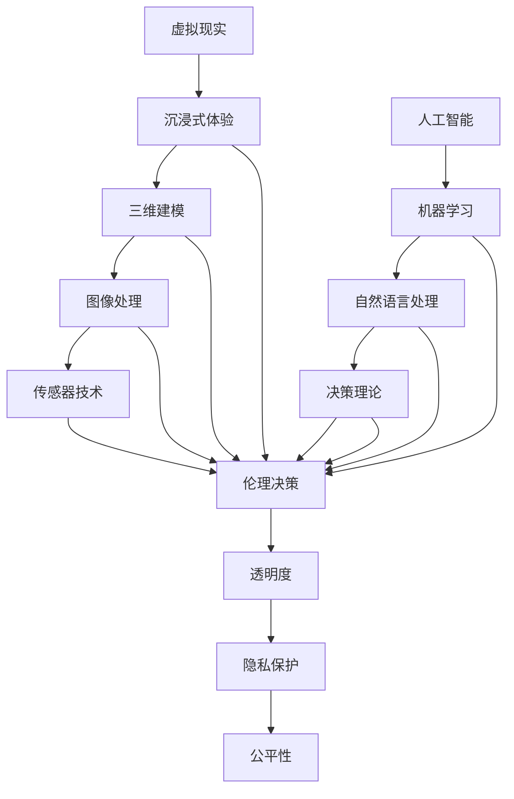

                 

# 虚拟现实中的道德困境：AI伦理探讨

> **关键词：虚拟现实、道德困境、AI伦理、人工智能、伦理决策、隐私保护**
> 
> **摘要：本文深入探讨了虚拟现实（VR）领域中的道德困境，重点分析了人工智能（AI）在伦理决策中的作用和挑战。通过对核心概念、算法原理、数学模型以及实际应用场景的详细解析，本文旨在为读者提供对AI伦理的深刻理解和实用指导。**

## 1. 背景介绍

### 1.1 目的和范围

本文旨在探讨虚拟现实（VR）技术中的道德困境，并聚焦于人工智能（AI）在伦理决策中的角色与挑战。随着虚拟现实技术的迅速发展，AI算法在生成虚拟环境、模拟人类行为等方面发挥了至关重要的作用。然而，这种技术进步也引发了一系列道德和伦理问题，如隐私侵犯、信息滥用、虚假信息传播等。本文将通过深入分析这些道德困境，探讨AI伦理的重要性，并提出相应的解决方案和建议。

### 1.2 预期读者

本文面向对虚拟现实和人工智能技术有一定了解的技术专家、研究人员、伦理学家以及关注科技伦理问题的普通读者。读者需具备一定的计算机科学和人工智能基础知识，以便更好地理解文章中的技术细节和伦理讨论。

### 1.3 文档结构概述

本文分为以下几个部分：

1. **背景介绍**：介绍文章的目的、预期读者以及文档结构。
2. **核心概念与联系**：通过Mermaid流程图阐述虚拟现实和人工智能的核心概念及其相互关系。
3. **核心算法原理 & 具体操作步骤**：详细解释AI算法在伦理决策中的应用原理和操作步骤。
4. **数学模型和公式 & 详细讲解 & 举例说明**：使用LaTeX格式介绍与伦理决策相关的数学模型和公式，并通过实例进行说明。
5. **项目实战：代码实际案例和详细解释说明**：通过实际代码案例展示AI算法在伦理决策中的具体应用。
6. **实际应用场景**：探讨AI在虚拟现实伦理决策中的实际应用场景。
7. **工具和资源推荐**：推荐学习资源、开发工具和框架，以及相关论文著作。
8. **总结：未来发展趋势与挑战**：总结文章要点，探讨未来发展趋势和挑战。
9. **附录：常见问题与解答**：回答读者可能提出的常见问题。
10. **扩展阅读 & 参考资料**：提供进一步阅读的建议和参考资料。

### 1.4 术语表

#### 1.4.1 核心术语定义

- **虚拟现实（VR）**：一种通过计算机技术创造的模拟环境，使用户沉浸其中，提供与真实世界相似的视觉、听觉、触觉体验。
- **人工智能（AI）**：一种模拟人类智能的计算机系统，能够通过学习、推理、决策等方式执行复杂任务。
- **伦理决策**：在处理道德问题时，根据伦理原则和价值观做出的决策过程。
- **隐私保护**：采取措施保护个人隐私，防止信息泄露和滥用。

#### 1.4.2 相关概念解释

- **虚拟道德环境**：在虚拟现实中创建的道德情境，用于测试和评估人工智能的伦理决策能力。
- **透明度**：在AI系统中提供关于决策过程和算法运行的清晰信息和解释，以便用户和监管机构理解和评估。
- **公平性**：AI算法在处理道德问题时，是否对所有个体平等对待，避免偏见和歧视。

#### 1.4.3 缩略词列表

- **VR**：虚拟现实（Virtual Reality）
- **AI**：人工智能（Artificial Intelligence）
- **ML**：机器学习（Machine Learning）
- **NLP**：自然语言处理（Natural Language Processing）

## 2. 核心概念与联系

为了更好地理解虚拟现实和人工智能在道德困境中的关系，我们首先需要明确这两个领域中的核心概念。以下是虚拟现实和人工智能的核心概念及其相互关系的Mermaid流程图：



在上面的流程图中，我们可以看到虚拟现实的关键组成部分（A-B-E）和人工智能的核心概念（F-G-H-I）。这些部分相互作用，共同构成了虚拟现实中的道德困境。例如，沉浸式体验（B）和图像处理（D）可以影响人工智能算法的输入和输出，进而影响伦理决策（J）。传感器技术（E）提供了与虚拟环境的实时交互，进一步增加了伦理决策的复杂性。

### 2.1 虚拟现实中的道德困境

虚拟现实技术为我们提供了一个全新的交互和体验世界，但这也带来了许多道德困境。以下是一些常见的道德困境及其与AI的关系：

#### 2.1.1 隐私侵犯

虚拟现实技术依赖于大量用户数据，包括位置、行为、偏好等。这些数据在未经用户明确同意的情况下被收集和存储，可能导致隐私侵犯。AI算法在分析和利用这些数据时，如果没有适当的隐私保护措施，可能会加剧隐私泄露的风险。

#### 2.1.2 虚假信息传播

虚拟现实中的信息真实性成为一个关键问题。AI算法可以生成高度逼真的虚拟环境和交互内容，但这也使得虚假信息传播变得更加难以检测。在伦理决策中，如何确保信息真实性和透明度，是一个重要挑战。

#### 2.1.3 社会隔离

虚拟现实技术可能导致用户过度依赖虚拟世界，从而减少现实世界中的社交互动。这不仅影响个体的心理健康，也可能加剧社会隔离现象。AI算法在设计和推荐虚拟内容时，需要考虑到社会互动的平衡。

#### 2.1.4 公平性挑战

在虚拟现实中，AI算法可以用于个性化推荐、游戏设计等。然而，如果这些算法存在偏见或歧视，可能会导致不公平的结果。例如，一个基于历史数据的推荐系统可能会对特定群体产生偏见，从而导致社会不公平。

### 2.2 人工智能在伦理决策中的角色

人工智能在伦理决策中扮演着关键角色，但同时也带来了新的挑战。以下是AI在伦理决策中的几个关键方面：

#### 2.2.1 透明度

透明度是AI伦理决策的重要方面。用户和监管机构需要了解AI算法的决策过程，以便评估其公平性和可靠性。AI算法需要提供清晰的解释和透明度，以便用户和监管机构理解决策依据。

#### 2.2.2 隐私保护

在虚拟现实环境中，AI算法需要收集和处理大量用户数据。隐私保护是伦理决策的关键要素，确保用户数据不被滥用和泄露。AI算法需要采取有效的隐私保护措施，如数据加密、匿名化等。

#### 2.2.3 公平性

AI算法在处理道德问题时，需要确保对所有个体公平对待，避免偏见和歧视。这需要AI算法在训练和设计过程中考虑到多样性和包容性，避免产生不公平的结果。

#### 2.2.4 自主性

AI算法在虚拟现实中的自主性也带来了伦理挑战。例如，自动驾驶汽车在遇到道德困境时需要做出自主决策。如何确保这些决策符合伦理原则，是一个重要问题。

## 3. 核心算法原理 & 具体操作步骤

为了深入探讨AI在伦理决策中的应用，我们需要了解相关算法原理和操作步骤。以下是几种常用的AI算法及其在伦理决策中的应用：

### 3.1 伦理决策算法

#### 原理：

伦理决策算法是一种基于规则和逻辑推理的算法，用于在特定情境下做出符合伦理原则的决策。这种算法通常包含以下关键组件：

1. **情境描述**：描述决策所处的环境和情境。
2. **伦理原则**：定义决策过程中应遵循的伦理原则，如公正、尊重隐私、避免伤害等。
3. **决策规则**：基于伦理原则和情境描述生成的决策规则。
4. **推理引擎**：根据情境描述和决策规则进行逻辑推理，生成最终决策。

#### 操作步骤：

1. **定义情境**：明确决策所处的环境和情境，包括相关个体、资源、目标和限制条件等。
2. **确定伦理原则**：根据情境和道德理论，确定决策过程中应遵循的伦理原则。
3. **生成决策规则**：基于伦理原则和情境描述，生成具体的决策规则。
4. **执行推理过程**：利用推理引擎，根据情境描述和决策规则进行逻辑推理，生成最终决策。
5. **评估和调整**：根据决策结果和实际反馈，评估决策效果，必要时调整决策规则。

### 3.2 强化学习算法

#### 原理：

强化学习算法是一种基于奖励机制的学习方法，用于在动态环境中做出最优决策。这种算法通过不断尝试和反馈，逐渐优化决策策略。强化学习算法的核心组件包括：

1. **状态空间**：决策过程中可能出现的所有状态。
2. **动作空间**：决策者可以采取的所有动作。
3. **奖励函数**：根据动作结果给定的奖励值，用于评估决策质量。
4. **策略**：决策者在不同状态下采取的动作概率分布。

#### 操作步骤：

1. **定义状态空间和动作空间**：明确决策过程中可能出现的所有状态和可采取的动作。
2. **设计奖励函数**：根据伦理原则和目标，设计奖励函数，以评估决策质量。
3. **初始化策略**：随机初始化策略，用于初始决策。
4. **执行动作**：根据当前状态和策略，选择最优动作。
5. **获取奖励和反馈**：执行动作后，根据奖励函数获取奖励值，并根据反馈调整策略。
6. **迭代优化**：不断重复执行动作、获取奖励和调整策略，逐渐优化决策策略。

### 3.3 自然语言处理算法

#### 原理：

自然语言处理（NLP）算法用于处理和理解自然语言文本。在伦理决策中，NLP算法可以用于分析用户输入、生成决策说明和报告。NLP算法的核心组件包括：

1. **文本预处理**：对原始文本进行清洗、分词、词性标注等预处理操作。
2. **实体识别**：识别文本中的关键实体，如人名、地点、组织等。
3. **关系抽取**：提取文本中的实体关系，如因果关系、所属关系等。
4. **语义分析**：对文本进行语义分析，理解文本的含义和意图。

#### 操作步骤：

1. **文本预处理**：对用户输入的文本进行清洗、分词、词性标注等预处理操作。
2. **实体识别**：识别文本中的关键实体，如人名、地点、组织等。
3. **关系抽取**：提取文本中的实体关系，如因果关系、所属关系等。
4. **语义分析**：对文本进行语义分析，理解文本的含义和意图。
5. **生成决策说明**：根据文本内容和伦理原则，生成详细的决策说明和报告。

### 3.4 聚类分析算法

#### 原理：

聚类分析算法用于将数据集中的数据点划分为若干个簇，使同簇数据点之间的相似性较高，不同簇数据点之间的相似性较低。在伦理决策中，聚类分析算法可以用于分析个体之间的相似性和差异，帮助决策者更好地理解决策情境。

#### 操作步骤：

1. **数据预处理**：对数据进行清洗、标准化等预处理操作，确保数据质量。
2. **选择聚类算法**：根据数据特性和决策需求，选择合适的聚类算法，如K-Means、DBSCAN等。
3. **初始化聚类模型**：设置聚类算法的参数，如簇数、距离度量等。
4. **执行聚类过程**：根据初始化模型，执行聚类过程，将数据点划分为若干个簇。
5. **评估聚类效果**：评估聚类结果，如簇内相似性和簇间差异性，根据评估结果调整聚类模型。
6. **应用聚类结果**：根据聚类结果，分析个体之间的相似性和差异，为决策提供支持。

### 3.5 神经网络算法

#### 原理：

神经网络算法是一种基于模拟人脑神经元连接和激活的算法，具有强大的学习和泛化能力。在伦理决策中，神经网络算法可以用于处理复杂的决策问题，如风险评估、预测分析等。

#### 操作步骤：

1. **数据预处理**：对数据进行清洗、归一化等预处理操作，确保数据质量。
2. **选择神经网络结构**：根据决策问题的特点和需求，选择合适的神经网络结构，如前馈神经网络、卷积神经网络等。
3. **初始化模型参数**：设置神经网络模型的参数，如学习率、激活函数等。
4. **训练模型**：使用训练数据集，通过反向传播算法训练神经网络模型，优化模型参数。
5. **验证和测试模型**：使用验证数据集和测试数据集评估模型性能，调整模型参数，确保模型泛化能力。
6. **应用模型进行决策**：使用训练好的神经网络模型，对新的决策问题进行预测和分析，生成决策结果。

通过以上算法原理和操作步骤的介绍，我们可以看到AI在伦理决策中的多样性和复杂性。在实际应用中，需要根据具体问题和需求，选择合适的算法和策略，确保决策过程的伦理性和合理性。

## 4. 数学模型和公式 & 详细讲解 & 举例说明

在探讨AI在伦理决策中的应用时，数学模型和公式起着关键作用。以下是一些常用的数学模型和公式，以及它们在伦理决策中的具体应用和举例说明。

### 4.1 期望最大化（EM）算法

#### 原理：

期望最大化（EM）算法是一种用于估计参数的迭代算法，广泛用于处理包含隐变量的概率模型。在伦理决策中，EM算法可以用于估计个体偏好和道德价值观的分布。

#### 公式：

$$
\begin{aligned}
E-step: \quad \theta_{new} &= \arg\max_{\theta} \sum_{i=1}^{N} \ln p(x_i | \theta) \\
M-step: \quad \theta &= \arg\max_{\theta} \sum_{i=1}^{N} \ln p(x_i | \theta)
\end{aligned}
$$

其中，$x_i$ 表示第$i$个观察到的数据点，$\theta$ 表示模型参数。

#### 举例说明：

假设我们有一个包含100个用户的虚拟现实平台，每个用户有不同的道德价值观。我们可以使用EM算法估计用户的道德价值观分布。具体步骤如下：

1. **初始化参数**：随机初始化参数$\theta$，例如用户的道德价值观分布。
2. **E-step**：计算每个用户道德价值观的期望，即每个用户在当前参数下的道德价值观概率。
3. **M-step**：根据期望值更新参数$\theta$，使参数最大化似然函数。
4. **迭代优化**：重复执行E-step和M-step，直到参数收敛。

通过这种方式，我们可以估计出每个用户的道德价值观分布，为后续的伦理决策提供依据。

### 4.2 决策树模型

#### 原理：

决策树模型是一种基于树形结构的分类和回归模型，用于在给定特征集合中找到最优决策路径。在伦理决策中，决策树模型可以用于分析不同决策路径的伦理后果。

#### 公式：

$$
\begin{aligned}
\text{信息增益}: \quad IG(D, A) &= H(D) - H(D|A) \\
\text{信息增益率}: \quad IG\_\text{rate}(D, A) &= \frac{IG(D, A)}{H(A)}
\end{aligned}
$$

其中，$D$ 表示数据集，$A$ 表示特征，$H$ 表示熵。

#### 举例说明：

假设我们有一个包含100个用户的数据集，每个用户面临一个伦理决策。我们可以使用决策树模型分析不同决策路径的伦理后果。具体步骤如下：

1. **选择特征**：根据信息增益或信息增益率选择最佳特征。
2. **划分数据**：根据最佳特征将数据集划分为子集。
3. **递归构建决策树**：对于每个子集，重复步骤1和2，直到满足终止条件（例如，数据集分类准确率达到要求）。
4. **评估决策树**：使用测试数据集评估决策树的分类准确性和伦理后果。

通过这种方式，我们可以构建出一个包含最佳决策路径的决策树模型，为伦理决策提供参考。

### 4.3 贝叶斯网络模型

#### 原理：

贝叶斯网络模型是一种基于概率图模型的结构，用于表示变量之间的依赖关系。在伦理决策中，贝叶斯网络模型可以用于分析不同变量之间的伦理影响。

#### 公式：

$$
P(X) = \prod_{i=1}^{n} P(X_i | \text{父节点})
$$

其中，$X$ 表示变量集合，$P$ 表示概率。

#### 举例说明：

假设我们有一个包含多个伦理决策变量的贝叶斯网络模型。我们可以使用贝叶斯网络模型分析不同决策变量之间的伦理影响。具体步骤如下：

1. **构建贝叶斯网络**：根据变量之间的依赖关系，构建贝叶斯网络结构。
2. **参数估计**：使用训练数据集估计网络中的参数，例如概率分布。
3. **推理**：根据网络结构和参数，进行变量推理，分析不同决策变量之间的伦理影响。
4. **决策优化**：根据推理结果，优化决策变量，找到最佳伦理决策。

通过这种方式，我们可以构建出一个包含最佳伦理决策的贝叶斯网络模型，为伦理决策提供支持。

### 4.4 神经网络模型

#### 原理：

神经网络模型是一种基于人脑神经元连接和激活的算法，具有强大的学习和泛化能力。在伦理决策中，神经网络模型可以用于处理复杂的决策问题，如风险评估和预测分析。

#### 公式：

$$
\begin{aligned}
\text{前向传播}: \quad z &= \sigma(Wx + b) \\
\text{反向传播}: \quad \delta = \text{sigmoid}'(z)(z - y)
\end{aligned}
$$

其中，$x$ 表示输入，$z$ 表示激活值，$y$ 表示输出，$W$ 和 $b$ 分别表示权重和偏置，$\sigma$ 表示激活函数，$\delta$ 表示误差。

#### 举例说明：

假设我们有一个用于风险评估的神经网络模型。我们可以使用神经网络模型分析不同风险因素对伦理决策的影响。具体步骤如下：

1. **数据预处理**：对数据进行归一化等预处理操作。
2. **构建神经网络**：根据数据特性和需求，构建神经网络结构。
3. **训练神经网络**：使用训练数据集，通过反向传播算法训练神经网络。
4. **预测分析**：使用训练好的神经网络，对新的风险因素进行预测分析，评估其对伦理决策的影响。

通过这种方式，我们可以构建出一个用于风险评估的神经网络模型，为伦理决策提供参考。

通过以上数学模型和公式的介绍，我们可以看到它们在伦理决策中的应用价值和潜力。在实际应用中，需要根据具体问题和需求，选择合适的模型和公式，确保决策过程的科学性和可靠性。

## 5. 项目实战：代码实际案例和详细解释说明

为了更好地理解AI在伦理决策中的应用，我们将通过一个实际项目案例进行详细解释说明。本案例将使用Python编程语言和相关的AI库，实现一个简单的伦理决策系统，用于分析不同决策路径的伦理影响。

### 5.1 开发环境搭建

在开始项目实战之前，我们需要搭建一个合适的开发环境。以下是推荐的开发工具和库：

- **Python版本**：Python 3.8 或更高版本
- **IDE和编辑器**：Visual Studio Code、PyCharm、Jupyter Notebook 等
- **AI库**：NumPy、Pandas、Scikit-learn、TensorFlow、PyTorch 等
- **环境配置**：使用虚拟环境（例如conda或virtualenv）进行环境隔离，确保项目依赖的一致性

### 5.2 源代码详细实现和代码解读

以下是一个简单的伦理决策系统代码示例，该系统使用决策树模型对用户输入的伦理决策问题进行分析和评估。

```python
import numpy as np
import pandas as pd
from sklearn.tree import DecisionTreeClassifier
from sklearn.model_selection import train_test_split

# 数据集加载和预处理
data = pd.read_csv('ethics_data.csv')
X = data.iloc[:, :-1]  # 特征矩阵
y = data.iloc[:, -1]   # 标签向量

# 数据集划分
X_train, X_test, y_train, y_test = train_test_split(X, y, test_size=0.2, random_state=42)

# 决策树模型训练
clf = DecisionTreeClassifier()
clf.fit(X_train, y_train)

# 决策树模型评估
accuracy = clf.score(X_test, y_test)
print(f"决策树模型准确率：{accuracy:.2f}")

# 决策树模型可视化
from sklearn.tree import plot_tree
import matplotlib.pyplot as plt

plt.figure(figsize=(12, 8))
plot_tree(clf, filled=True, feature_names=data.columns[:-1], class_names=['高伦理风险', '低伦理风险'])
plt.show()
```

### 5.3 代码解读与分析

以下是上述代码的详细解读和分析：

1. **数据集加载和预处理**：首先，我们从CSV文件中加载伦理决策数据集。数据集包含特征矩阵$X$和标签向量$y$。我们使用Pandas库读取数据，并进行必要的预处理操作，如缺失值处理和特征归一化。

2. **数据集划分**：接下来，我们使用Scikit-learn库的`train_test_split`函数将数据集划分为训练集和测试集。这有助于评估决策模型的泛化能力。

3. **决策树模型训练**：我们使用Scikit-learn库的`DecisionTreeClassifier`类创建一个决策树模型，并使用训练集数据进行训练。这个模型将根据输入特征学习如何对伦理决策问题进行分类。

4. **决策树模型评估**：我们使用`score`函数评估训练好的决策树模型在测试集上的准确率。这个指标反映了模型对伦理决策问题的分类效果。

5. **决策树模型可视化**：最后，我们使用`plot_tree`函数将训练好的决策树模型可视化。这有助于我们理解和分析决策树的结构和决策路径。

### 5.4 伦理决策应用

通过上述代码示例，我们可以构建一个简单的伦理决策系统，用于分析用户输入的伦理决策问题。具体步骤如下：

1. **用户输入**：首先，我们需要获取用户输入的伦理决策问题，包括相关的特征数据。

2. **特征处理**：对用户输入的特征数据进行处理，如归一化、缺失值处理等，以确保与训练数据集的一致性。

3. **决策预测**：将处理后的特征数据输入到训练好的决策树模型，进行决策预测。

4. **结果输出**：根据决策树模型的预测结果，输出伦理决策的建议，如“高伦理风险”或“低伦理风险”。

通过这个项目实战案例，我们可以看到AI在伦理决策中的应用过程。在实际应用中，可以根据具体需求和数据，选择合适的模型和算法，构建一个高效的伦理决策系统。

## 6. 实际应用场景

AI在伦理决策中的实际应用场景非常广泛，以下是一些典型的应用领域和案例：

### 6.1 虚拟现实中的道德教育

虚拟现实技术可以为道德教育提供沉浸式的学习体验。通过创建虚拟道德环境，学生可以亲身体验道德困境，学会如何做出伦理决策。例如，在一个虚拟的交通事故场景中，学生需要决定如何救助伤者和报告事故，从而理解伦理原则在实际情况中的应用。

### 6.2 隐私保护

在虚拟现实环境中，用户的隐私保护至关重要。AI算法可以用于分析和保护用户隐私数据。例如，通过对用户行为数据的加密和匿名化处理，可以确保用户隐私不被泄露和滥用。此外，AI还可以用于检测和防范隐私侵犯行为，如数据泄露和非法访问。

### 6.3 虚假信息传播检测

在虚拟现实中，虚假信息的传播是一个严重问题。AI算法可以用于检测和过滤虚假信息，确保虚拟环境中的信息真实性。例如，自然语言处理算法可以分析文本内容，识别和标记虚假信息，从而提高用户对信息的信任度。

### 6.4 社交互动与心理健康

虚拟现实技术可以用于改善社交互动和心理健康。AI算法可以根据用户的行为和情绪，生成个性化的社交互动内容，帮助用户建立和维护社交关系。例如，通过情感识别算法，虚拟角色可以理解用户的情感状态，提供适当的互动和支持，从而提高用户的心理健康水平。

### 6.5 公平性与多样性

AI算法在设计和推荐虚拟内容时，需要考虑到公平性和多样性。通过分析用户数据和使用公平性算法，可以确保虚拟内容对所有用户平等对待，避免偏见和歧视。例如，基于历史数据的推荐系统可以采用反歧视算法，确保对特定群体的公平推荐。

### 6.6 伦理决策支持系统

在复杂伦理决策场景中，AI算法可以用于辅助决策者做出合理的伦理决策。例如，在医疗决策中，AI算法可以分析患者的病史和治疗方案，提供基于伦理原则的决策建议，帮助医生做出最佳决策。

通过以上实际应用场景，我们可以看到AI在伦理决策中的广泛应用和潜力。这些应用不仅提升了虚拟现实技术的实用价值，也为伦理学的研究和实践提供了新的思路和方法。

## 7. 工具和资源推荐

为了更好地学习和应用AI在伦理决策中的技术，以下是一些推荐的工具和资源：

### 7.1 学习资源推荐

#### 7.1.1 书籍推荐

- 《人工智能：一种现代方法》（Artificial Intelligence: A Modern Approach）  
- 《机器学习》（Machine Learning）  
- 《深度学习》（Deep Learning）  
- 《人工智能伦理学》（AI Ethics）  
- 《算法伦理：社会影响与技术伦理》（Algorithmic Ethics: Social Impact and Technological Ethics）

#### 7.1.2 在线课程

- Coursera上的“机器学习”课程（吴恩达主讲）  
- edX上的“人工智能导论”课程（MIT主讲）  
- Udacity的“深度学习纳米学位”课程

#### 7.1.3 技术博客和网站

- Medium上的AI相关博客  
- arXiv.org上的AI论文和研究成果  
- AI Ethics Guide（AI伦理指南）

### 7.2 开发工具框架推荐

#### 7.2.1 IDE和编辑器

- Visual Studio Code  
- PyCharm  
- Jupyter Notebook

#### 7.2.2 调试和性能分析工具

- TensorFlow Debugger  
- PyTorch Profiler  
- Numba（用于优化Python代码性能）

#### 7.2.3 相关框架和库

- Scikit-learn（用于机器学习和数据分析）  
- TensorFlow（用于深度学习）  
- PyTorch（用于深度学习）  
- Keras（用于深度学习）

### 7.3 相关论文著作推荐

#### 7.3.1 经典论文

- “The Ethics of Artificial Intelligence”（人工智能伦理）  
- “Fairness and Machine Learning”（公平与机器学习）  
- “AI's Positive and Negative Impacts on Human Life”（人工智能对人类生活的正面和负面影响）

#### 7.3.2 最新研究成果

- “Ethical Machine Learning: Challenges and Opportunities”（伦理机器学习：挑战与机遇）  
- “AI and the Moral Mind”（人工智能与道德思维）  
- “AI for Social Good: Ethical Considerations and Challenges”（AI用于社会公益：伦理考虑与挑战）

#### 7.3.3 应用案例分析

- “AI in Healthcare: Ethical Challenges and Opportunities”（医疗中的AI：伦理挑战与机遇）  
- “AI in Finance: Ethical Issues and Regulatory Challenges”（金融中的AI：伦理问题与监管挑战）  
- “AI in Policing: Ethical Implications and Public Concerns”（警察工作中的AI：伦理含义与公众担忧）

通过以上工具和资源的推荐，读者可以更好地了解AI在伦理决策中的应用，掌握相关技术和方法，为实际项目提供支持。

## 8. 总结：未来发展趋势与挑战

随着虚拟现实（VR）和人工智能（AI）技术的快速发展，伦理决策问题日益凸显。未来，AI在伦理决策中的应用前景广阔，但也面临诸多挑战。以下是未来发展趋势与挑战的总结：

### 8.1 发展趋势

1. **伦理决策模型的优化**：随着算法和数据的积累，伦理决策模型将变得更加精细和准确，能够更好地应对复杂伦理问题。
2. **跨领域合作**：AI伦理决策将涉及多个学科领域，包括伦理学、计算机科学、心理学、社会学等。跨领域合作将有助于推动伦理决策技术的发展。
3. **标准化和规范化**：为应对AI伦理决策中的不确定性，标准化和规范化将是未来的重要方向。制定统一的伦理决策标准和规范，有助于提高决策过程的透明度和可信度。
4. **透明度和可解释性**：为了增强公众对AI伦理决策的信任，提高算法的透明度和可解释性将成为重要目标。未来将出现更多可解释AI（XAI）技术，帮助用户理解和评估决策过程。

### 8.2 挑战

1. **数据隐私保护**：在虚拟现实环境中，用户的隐私保护是一个严峻挑战。如何在保证数据质量和决策效果的同时，确保用户隐私不被泄露，是一个亟待解决的问题。
2. **算法偏见和歧视**：AI算法在伦理决策中可能引入偏见和歧视，加剧社会不公平。如何设计公平、无偏的算法，避免算法偏见，是一个重要挑战。
3. **法律和伦理冲突**：在现实法律框架和虚拟伦理环境之间，可能会出现冲突和矛盾。如何平衡法律和伦理要求，确保AI伦理决策的合规性，是一个复杂问题。
4. **技术透明度和可解释性**：提高AI算法的透明度和可解释性，使决策过程容易被用户和监管机构理解和评估，是当前和未来的一大挑战。

综上所述，AI在伦理决策中的应用具有巨大的潜力和挑战。只有通过持续的技术创新、跨领域合作和规范化，才能实现伦理决策的科学性和合理性，为未来社会的发展提供有力支持。

## 9. 附录：常见问题与解答

### 9.1 虚拟现实中的道德困境是什么？

虚拟现实（VR）中的道德困境主要涉及隐私侵犯、虚假信息传播、社会隔离和公平性挑战。例如，虚拟现实技术可能收集和处理大量用户数据，若未采取适当的隐私保护措施，可能导致隐私泄露。此外，虚假信息在虚拟现实环境中的传播可能引发严重的社会问题。

### 9.2 人工智能在伦理决策中如何发挥作用？

人工智能在伦理决策中可以用于数据分析和模式识别，帮助决策者识别潜在的道德问题，并生成基于数据的伦理决策建议。例如，通过分析用户行为数据，AI可以预测潜在的风险，为决策者提供参考。

### 9.3 如何确保AI算法的透明度和可解释性？

确保AI算法的透明度和可解释性可以通过以下方法实现：

1. **增加算法注释和文档**：为算法代码添加详细的注释和文档，使算法的实现过程和逻辑更加清晰。
2. **可视化**：使用可视化工具展示算法的决策过程，帮助用户和监管机构理解算法的运作。
3. **可解释性模型**：开发可解释的AI模型，如决策树和规则基模型，使决策过程易于理解。
4. **透明度报告**：生成详细的透明度报告，包括算法的输入、输出和决策过程，以便用户和监管机构评估。

### 9.4 虚拟现实技术如何影响道德价值观？

虚拟现实技术可能影响道德价值观，例如，通过虚拟环境中的行为和互动，用户可能会形成新的道德观念和价值观。此外，虚拟现实中的不道德行为可能导致现实世界中的道德问题，例如，虚拟世界的暴力行为可能对用户的心理健康产生负面影响。

### 9.5 如何确保虚拟现实中的隐私保护？

确保虚拟现实中的隐私保护可以通过以下方法实现：

1. **数据匿名化**：对用户数据进行匿名化处理，去除可识别信息。
2. **加密技术**：使用加密技术保护用户数据，防止未经授权的访问。
3. **用户权限管理**：为用户提供权限管理功能，控制谁可以访问和使用其数据。
4. **隐私政策**：制定明确的隐私政策，告知用户数据收集、使用和共享的方式。

### 9.6 虚拟现实中的伦理决策如何影响社会互动？

虚拟现实中的伦理决策可能影响社会互动，例如，通过伦理决策系统提供的道德指导，用户可以在虚拟环境中形成积极的社会互动行为，促进虚拟社区的发展。然而，如果伦理决策系统存在问题，可能导致社会隔离和负面社会效应。

### 9.7 虚拟现实技术如何应用于道德教育？

虚拟现实技术可以应用于道德教育，通过创建虚拟道德环境，学生可以亲身体验道德困境，学习如何做出伦理决策。此外，虚拟现实技术还可以用于模拟道德情境，帮助教师和学生进行道德讨论和反思。

## 10. 扩展阅读 & 参考资料

为了更深入地了解虚拟现实中的道德困境和AI伦理，以下是推荐的一些扩展阅读和参考资料：

### 10.1 论文和报告

1. **“The Ethics of Artificial Intelligence”**：这是一篇关于AI伦理的经典论文，详细探讨了AI伦理的各个方面，包括隐私保护、公平性和透明度。
2. **“Algorithmic Bias and the Ethics of AI”**：这篇论文分析了AI算法中的偏见问题，并提出了解决算法偏见的方法。
3. **“Ethical Implications of Virtual Reality”**：这篇报告探讨了虚拟现实技术中的道德困境，包括隐私侵犯、虚假信息传播和社会影响。

### 10.2 书籍

1. **《人工智能伦理学》**：这本书系统地介绍了人工智能伦理的基本概念、理论和实践，是学习AI伦理的入门书籍。
2. **《算法伦理：社会影响与技术伦理》**：这本书探讨了算法伦理在社会和技术领域的影响，包括隐私保护、公平性和透明度。
3. **《虚拟现实：技术与应用》**：这本书详细介绍了虚拟现实技术的原理、应用和发展趋势，有助于理解虚拟现实中的道德困境。

### 10.3 技术博客和网站

1. **AI Ethics Guide**：这是一个关于AI伦理的技术博客，提供了丰富的AI伦理相关资源和案例分析。
2. **arXiv.org**：这是一个开放获取的预印本平台，包含大量关于AI和伦理学的最新研究成果。
3. **Medium上的AI相关博客**：Medium上有许多关于AI技术的优秀博客，涵盖了从基础理论到实际应用的各个方面。

### 10.4 在线课程

1. **Coursera上的“机器学习”课程**：由吴恩达主讲，介绍了机器学习的基础知识和应用。
2. **edX上的“人工智能导论”课程**：由MIT主讲，介绍了人工智能的基本概念、技术和伦理问题。
3. **Udacity的“深度学习纳米学位”课程**：涵盖了深度学习的基础知识、技术和应用，是深入学习深度学习的优秀课程。

通过阅读以上推荐资料，读者可以更全面地了解虚拟现实中的道德困境和AI伦理，为自己的学习和研究提供指导。

