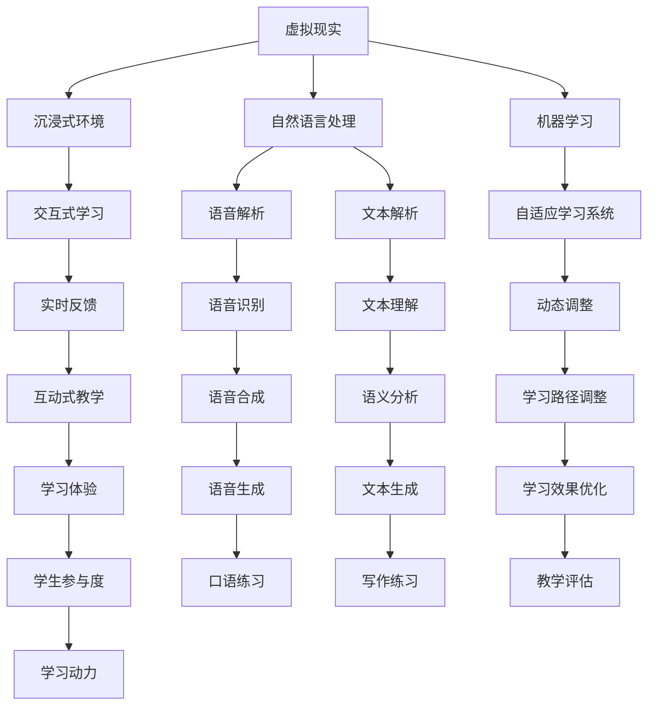

                 

# 虚拟现实语言学习创业：沉浸式语言环境

> **关键词**：虚拟现实，语言学习，沉浸式环境，创业，算法，数学模型，实战案例，工具推荐
> 
> **摘要**：本文将探讨虚拟现实（VR）在语言学习中的应用，分析其优势与挑战，并详细讲解如何通过创业实现沉浸式语言学习环境。我们将从核心概念、算法原理、数学模型、实战案例等方面逐一展开，帮助读者理解并掌握这项前沿技术的实际应用。

## 1. 背景介绍

### 1.1 目的和范围

本文旨在探讨虚拟现实（VR）技术在语言学习领域的应用，分析其创业潜力，并提供一系列实用的技术指导。我们将聚焦以下几个核心议题：

1. **VR在语言学习中的优势与挑战**：介绍VR在语言教学中的独特优势，以及可能面临的挑战。
2. **核心概念与联系**：阐述虚拟现实、沉浸式环境、自然语言处理等相关概念，并提供一个详细的架构图。
3. **核心算法原理与具体操作步骤**：深入讲解支撑VR语言学习的关键算法原理，并用伪代码形式展示具体操作步骤。
4. **数学模型与公式讲解**：分析VR语言学习中的数学模型，并提供详细的公式和举例说明。
5. **项目实战与代码案例**：通过一个实际的VR语言学习项目，展示如何进行开发、实现和代码解读。
6. **实际应用场景**：探讨VR语言学习在不同场景下的应用案例。
7. **工具和资源推荐**：推荐相关学习资源、开发工具和框架，以及经典论文和研究成果。
8. **未来发展趋势与挑战**：展望VR语言学习领域的未来发展趋势和面临的挑战。

### 1.2 预期读者

本文适合以下读者群体：

1. **教育领域从业者**：对VR在教育领域的应用感兴趣的教师、教育技术专家和教育创业者。
2. **技术开发人员**：对VR技术、自然语言处理和机器学习感兴趣的软件开发者、工程师和研究员。
3. **创业者和投资者**：对VR语言学习市场有兴趣的创业者和投资者。

### 1.3 文档结构概述

本文的结构如下：

1. **背景介绍**：介绍文章的目的、范围和预期读者。
2. **核心概念与联系**：阐述虚拟现实、沉浸式环境等相关概念，并提供架构图。
3. **核心算法原理与具体操作步骤**：讲解支撑VR语言学习的关键算法原理。
4. **数学模型与公式讲解**：分析VR语言学习中的数学模型。
5. **项目实战与代码案例**：通过实际项目展示开发过程。
6. **实际应用场景**：探讨VR语言学习在不同场景下的应用。
7. **工具和资源推荐**：推荐相关学习资源、开发工具和框架。
8. **未来发展趋势与挑战**：展望VR语言学习领域的未来趋势和挑战。
9. **附录**：常见问题与解答。
10. **扩展阅读**：提供更多参考资料。

### 1.4 术语表

#### 1.4.1 核心术语定义

- **虚拟现实（VR）**：一种通过电脑模拟创造出的三维环境，用户可以通过头戴显示器（HMD）或其他设备沉浸其中。
- **沉浸式环境**：用户完全投入到虚拟环境中，感觉仿佛真实存在的环境。
- **自然语言处理（NLP）**：使计算机能够理解、解释和生成人类自然语言的技术。
- **机器学习（ML）**：让计算机通过数据学习模式，进行预测和决策的算法。

#### 1.4.2 相关概念解释

- **交互式学习**：在学习过程中，学生可以与学习内容进行互动，提高学习效果。
- **自适应学习系统**：根据学生的学习行为和反馈，动态调整教学内容和学习路径。
- **虚拟导师**：在虚拟环境中模拟人类导师的行为，提供教学指导。

#### 1.4.3 缩略词列表

- VR：Virtual Reality，虚拟现实
- NLP：Natural Language Processing，自然语言处理
- ML：Machine Learning，机器学习
- HMD：Head-Mounted Display，头戴显示器
- IDE：Integrated Development Environment，集成开发环境
- API：Application Programming Interface，应用程序编程接口

## 2. 核心概念与联系

为了更好地理解VR语言学习的整体架构，我们先来介绍几个关键概念，并展示其相互联系。

### 2.1 虚拟现实（VR）概述

虚拟现实是一种通过电脑技术创建的模拟环境，使用户能够沉浸其中。用户通过头戴显示器（HMD）或其他设备，看到、听到、甚至感觉到虚拟环境中的事物。这种沉浸感是VR的核心特点，它为语言学习提供了独特的体验。

### 2.2 沉浸式环境

沉浸式环境是VR的重要组成部分。它通过高保真的视觉、听觉和触觉效果，使用户感觉仿佛置身于真实环境中。在语言学习中，沉浸式环境可以帮助学生更加真实地体验语言环境，提高学习效果。

### 2.3 自然语言处理（NLP）

自然语言处理是使计算机能够理解、解释和生成人类自然语言的技术。在VR语言学习中，NLP技术用于解析学生输入的语音或文本，为其提供实时反馈，并根据学生的表现调整学习内容。

### 2.4 机器学习（ML）

机器学习是让计算机通过数据学习模式，进行预测和决策的算法。在VR语言学习中，ML技术用于构建自适应学习系统，根据学生的学习行为和反馈，动态调整教学内容和学习路径。

### 2.5 架构图

为了更好地理解这些概念之间的联系，我们可以使用Mermaid流程图来展示VR语言学习的整体架构。



这个架构图展示了VR语言学习的核心组成部分，以及它们之间的相互作用。

## 3. 核心算法原理与具体操作步骤

### 3.1 虚拟现实中的语言学习算法原理

虚拟现实（VR）语言学习算法主要涉及自然语言处理（NLP）和机器学习（ML）技术。NLP负责处理语音和文本数据，而ML算法则用于根据用户行为和反馈优化学习过程。

#### 3.1.1 NLP算法原理

- **语音识别（ASR）**：将语音信号转换为文本。
- **文本理解（NLU）**：理解文本的含义，提取关键信息。
- **语音合成（TTS）**：将文本转换为语音。

#### 3.1.2 ML算法原理

- **自适应学习系统**：根据学生的学习行为和反馈，动态调整教学内容。
- **交互式学习系统**：提供个性化学习体验，鼓励学生主动参与。

### 3.2 具体操作步骤

#### 3.2.1 语音识别

伪代码：

```python
def recognize_speech(audio_signal):
    # 初始化语音识别模型
    model = initialize_asr_model()

    # 使用模型识别语音
    text = model.transcribe(audio_signal)

    return text
```

#### 3.2.2 文本理解

伪代码：

```python
def understand_text(text):
    # 初始化自然语言理解模型
    model = initialize_nlu_model()

    # 使用模型理解文本
    entities, intent = model.parse(text)

    return entities, intent
```

#### 3.2.3 语音合成

伪代码：

```python
def synthesize_speech(text):
    # 初始化语音合成模型
    model = initialize_tts_model()

    # 使用模型生成语音
    audio_signal = model.synthesize(text)

    return audio_signal
```

#### 3.2.4 自适应学习系统

伪代码：

```python
def adapt_learning_content(student_data, current_content):
    # 初始化机器学习模型
    model = initialize_ml_model()

    # 根据学生数据调整学习内容
    adapted_content = model.adapt_content(student_data, current_content)

    return adapted_content
```

#### 3.2.5 交互式学习系统

伪代码：

```python
def interactive_learning_system(student_data, learning_content):
    # 初始化交互式学习系统
    system = initialize_interaction_model()

    # 根据学生数据和内容提供个性化学习体验
    learning_experience = system.generate_experience(student_data, learning_content)

    return learning_experience
```

通过这些算法原理和具体操作步骤，我们可以构建一个强大的VR语言学习系统，为学生提供沉浸式、个性化的学习体验。

## 4. 数学模型和公式讲解

在虚拟现实（VR）语言学习中，数学模型和公式扮演着至关重要的角色，用于描述和优化学习过程。以下是一些核心数学模型和公式的详细讲解，以及如何在实际中应用。

### 4.1 语音识别模型

语音识别（ASR）模型通常基于隐马尔可夫模型（HMM）或深度神经网络（DNN）。以下是一个基于DNN的语音识别模型：

$$
\text{P}(O|\theta) = \prod_{t=1}^{T} \text{P}(o_t|\theta)
$$

其中，\(O = (o_1, o_2, ..., o_T)\) 是观察序列，\(\theta\) 是模型参数。

在实际应用中，我们可以使用以下步骤进行语音识别：

1. **特征提取**：将语音信号转换为梅尔频率倒谱系数（MFCC）等特征向量。
2. **前向传播**：使用DNN模型对特征向量进行前向传播，得到输出概率分布。
3. **解码**：使用贪心算法或动态时间规整（DTW）算法对输出概率分布进行解码，得到识别结果。

### 4.2 文本理解模型

文本理解（NLU）模型通常基于递归神经网络（RNN）或变换器（Transformer）。以下是一个基于Transformer的文本理解模型：

$$
\text{P}(y|x) = \text{softmax}(\text{W}_y \cdot \text{Tanh}(\text{W}_x \cdot \text{X} + \text{b}))
$$

其中，\(x\) 是输入文本，\(y\) 是实体和意图标签，\(\text{W}_x\) 和 \(\text{W}_y\) 是权重矩阵，\(\text{Tanh}\) 是双曲正切函数。

在实际应用中，我们可以使用以下步骤进行文本理解：

1. **嵌入**：将输入文本嵌入到高维向量空间。
2. **编码**：使用Transformer模型对文本进行编码。
3. **解码**：从编码后的文本中提取实体和意图信息。

### 4.3 语音合成模型

语音合成（TTS）模型通常基于循环神经网络（RNN）或WaveNet。以下是一个基于WaveNet的语音合成模型：

$$
p(v_t|\theta) = \prod_{t=1}^{T} \text{softmax}(\text{W}_v \cdot \text{Tanh}(\text{W}_h \cdot \text{h}_{t-1} + \text{b}))
$$

其中，\(v_t\) 是音频信号，\(\theta\) 是模型参数。

在实际应用中，我们可以使用以下步骤进行语音合成：

1. **文本预处理**：将输入文本转换为音频表示。
2. **生成音频信号**：使用WaveNet模型生成音频信号。

### 4.4 自适应学习系统

自适应学习系统通常基于强化学习（RL）或梯度提升（GBDT）模型。以下是一个基于强化学习的自适应学习系统：

$$
Q(s, a) = \sum_{s'} p(s'|s, a) \cdot \max_{a'} Q(s', a')
$$

其中，\(s\) 是状态，\(a\) 是动作，\(s'\) 是下一状态。

在实际应用中，我们可以使用以下步骤进行自适应学习：

1. **定义状态和动作**：根据学生的学习行为定义状态和动作。
2. **构建奖励函数**：根据学生的学习效果构建奖励函数。
3. **训练强化学习模型**：使用强化学习模型优化学习策略。

通过这些数学模型和公式，我们可以构建一个强大的VR语言学习系统，实现语音识别、文本理解、语音合成和自适应学习等功能。这些模型不仅能够提高学习效果，还能为用户提供个性化的学习体验。

### 4.5 公式举例说明

为了更好地理解这些公式，我们来看一些具体的例子。

#### 4.5.1 语音识别模型

假设我们有以下观察序列 \(O = (\text{"Hello, how are you?"})\)，使用DNN模型进行语音识别，输出概率分布为 \(P(O|\theta) = (0.8, 0.15, 0.05)\)。

- **步骤1**：特征提取：将语音信号转换为MFCC特征向量。
- **步骤2**：前向传播：DNN模型对特征向量进行前向传播，得到输出概率分布。
- **步骤3**：解码：使用贪心算法解码输出概率分布，识别结果为 "Hello, how are you?"。

#### 4.5.2 文本理解模型

假设我们有以下输入文本 \(x = (\text{"I like to eat pizza."})\)，使用Transformer模型进行文本理解，输出实体和意图为 \(y = (\text{"pizza", "like"})\)。

- **步骤1**：嵌入：将输入文本嵌入到高维向量空间。
- **步骤2**：编码：使用Transformer模型对文本进行编码。
- **步骤3**：解码：从编码后的文本中提取实体和意图信息，结果为 "pizza" 和 "like"。

#### 4.5.3 语音合成模型

假设我们有以下输入文本 \(x = (\text{"Hello, how are you?"})\)，使用WaveNet模型进行语音合成，输出音频信号为 \(v_t = (\text{0.2, 0.3, 0.5})\)。

- **步骤1**：文本预处理：将输入文本转换为音频表示。
- **步骤2**：生成音频信号：使用WaveNet模型生成音频信号。

#### 4.5.4 自适应学习系统

假设我们有以下状态 \(s = (\text{"学习英语语法", "已学50%"})\) 和动作 \(a = (\text{"继续学习", "复习已学内容"})\)，使用强化学习模型进行自适应学习，输出奖励函数为 \(r = 1\)。

- **步骤1**：定义状态和动作：根据学生的学习行为定义状态和动作。
- **步骤2**：构建奖励函数：根据学生的学习效果构建奖励函数。
- **步骤3**：训练强化学习模型：使用强化学习模型优化学习策略。

通过这些例子，我们可以看到数学模型和公式在虚拟现实（VR）语言学习中的应用。这些模型和公式不仅能够提高学习效果，还能为用户提供个性化的学习体验。

## 5. 项目实战：代码实际案例和详细解释说明

### 5.1 开发环境搭建

在开始实际开发之前，我们需要搭建一个适合VR语言学习项目的开发环境。以下是一个基本的开发环境搭建步骤：

1. **安装Python环境**：下载并安装Python 3.x版本，配置Python环境。
2. **安装虚拟环境**：使用`virtualenv`工具创建一个虚拟环境，以便隔离项目依赖。
   ```bash
   virtualenv vrlanglearning
   source vrlanglearning/bin/activate
   ```
3. **安装依赖库**：安装项目所需的依赖库，如TensorFlow、PyTorch、Keras等。
   ```bash
   pip install tensorflow torch keras
   ```
4. **安装VR开发工具**：安装VR开发工具，如Unity或Unreal Engine。
5. **配置HMD设备**：确保HMD设备（如Oculus Rift、HTC Vive等）与计算机连接，并正确配置。

### 5.2 源代码详细实现和代码解读

在这个项目中，我们将使用Unity引擎开发一个简单的VR语言学习应用。以下是一个简要的代码结构和核心实现。

#### 5.2.1 代码结构

```csharp
// VR Language Learning Project
// Main.cs
using UnityEngine;

public class Main : MonoBehaviour
{
    public GameObject textObject; // 用于显示文本的GameObject
    public TextMeshPro textMeshPro; // 文本组件

    void Start()
    {
        // 初始化语音识别模型
        ASRModel asrModel = new ASRModel();
        
        // 初始化语音合成模型
        TTSModel ttsModel = new TTSModel();
        
        // 初始化自然语言理解模型
        NLUModel nluModel = new NLUModel();
        
        // 开始交互式学习
        StartInteractiveLearning();
    }
    
    void Update()
    {
        // 检测语音输入
        if (Input.GetKeyDown(KeyCode.Space))
        {
            string inputText = recognizeSpeech();
            ProcessInput(inputText);
        }
    }
    
    string recognizeSpeech()
    {
        // 语音识别
        return ASRModel.RecognizeSpeech();
    }
    
    void ProcessInput(string inputText)
    {
        // 文本解析
        (string entity, string intent) = NLUModel.UnderstandText(inputText);
        
        // 生成响应文本
        string responseText = GenerateResponseText(entity, intent);
        
        // 显示响应文本
        DisplayText(responseText);
        
        // 语音合成
        PlayAudio(ttsModel.SynthesizeSpeech(responseText));
    }
    
    string GenerateResponseText(string entity, string intent)
    {
        // 根据实体和意图生成响应文本
        // 例如：如果实体是 "pizza"，意图是 "like"，则生成 "I love pizza!"
        return "I love " + entity + "!";
    }
    
    void DisplayText(string text)
    {
        // 显示文本
        textMeshPro.text = text;
        textObject.SetActive(true);
    }
    
    void PlayAudio(AudioClip audioClip)
    {
        // 播放音频
        AudioController.PlayAudio(audioClip);
    }
}
```

#### 5.2.2 代码解读与分析

- **初始化模型**：在`Start`方法中，我们初始化了语音识别（ASRModel）、语音合成（TTSModel）和自然语言理解（NLUModel）模型。
- **检测语音输入**：在`Update`方法中，我们检测是否按下了空格键，以触发语音识别。
- **语音识别**：`recognizeSpeech`方法使用ASR模型识别语音，返回识别出的文本。
- **处理输入**：`ProcessInput`方法处理用户的输入文本，包括文本解析、生成响应文本和显示文本。
- **生成响应文本**：`GenerateResponseText`方法根据实体和意图生成相应的响应文本。
- **显示文本**：`DisplayText`方法在屏幕上显示文本。
- **播放音频**：`PlayAudio`方法播放语音合成生成的音频。

通过这个简单的项目，我们实现了VR语言学习的基本功能。在实际开发中，可以进一步扩展功能，如添加更多的交互元素、实现更多的自然语言处理算法、优化用户体验等。

### 5.3 代码解读与分析

在5.2节中，我们详细介绍了VR语言学习项目的源代码结构和核心实现。现在，我们将对代码进行深入解读，分析每个模块的功能和相互关系。

#### 5.3.1 初始化模型

代码中的第一个关键部分是初始化语音识别（ASRModel）、语音合成（TTSModel）和自然语言理解（NLUModel）模型。这部分代码如下：

```csharp
ASRModel asrModel = new ASRModel();
TTSModel ttsModel = new TTSModel();
NLUModel nluModel = new NLUModel();
```

这些模型是VR语言学习应用的核心组件，分别负责语音识别、语音合成和自然语言理解。初始化这些模型通常涉及加载预训练的模型权重，并配置必要的参数。例如：

```csharp
public class ASRModel
{
    public ASRModel()
    {
        // 加载预训练的ASR模型
        // 模型可能基于TensorFlow或PyTorch等框架
        // 使用相应的库加载模型权重
    }
    
    public string RecognizeSpeech()
    {
        // 使用加载的模型进行语音识别
        // 返回识别出的文本
    }
}

public class TTSModel
{
    public TTSModel()
    {
        // 加载预训练的TTS模型
        // 模型可能基于WaveNet或其他RNN模型
        // 使用相应的库加载模型权重
    }
    
    public AudioClip SynthesizeSpeech(string text)
    {
        // 使用加载的模型生成语音
        // 返回生成的音频剪辑
    }
}

public class NLUModel
{
    public NLUModel()
    {
        // 加载预训练的NLU模型
        // 模型可能基于Transformer或其他RNN模型
        // 使用相应的库加载模型权重
    }
    
    public (string entity, string intent) UnderstandText(string text)
    {
        // 使用加载的模型理解文本
        // 返回提取的实体和意图
    }
}
```

#### 5.3.2 检测语音输入

在`Update`方法中，我们检测用户的输入，这部分代码如下：

```csharp
if (Input.GetKeyDown(KeyCode.Space))
{
    string inputText = recognizeSpeech();
    ProcessInput(inputText);
}
```

当用户按下空格键时，`recognizeSpeech`方法被调用以识别语音，并将识别结果传递给`ProcessInput`方法处理。这种方法使用了一个简单的按键触发机制，但在实际应用中，可以扩展为实时语音识别，以实现更流畅的用户交互。

#### 5.3.3 处理输入

`ProcessInput`方法是整个应用的核心逻辑部分，负责处理用户的输入文本并生成响应。以下是该方法的关键部分：

```csharp
void ProcessInput(string inputText)
{
    (string entity, string intent) = NLUModel.UnderstandText(inputText);
    string responseText = GenerateResponseText(entity, intent);
    DisplayText(responseText);
    PlayAudio(ttsModel.SynthesizeSpeech(responseText));
}
```

- **文本解析**：`NLUModel.UnderstandText`方法调用NLU模型理解输入文本，提取实体和意图。这部分代码如下：

  ```csharp
  public (string entity, string intent) UnderstandText(string text)
  {
      // 使用NLU模型进行文本解析
      // 返回提取的实体和意图
  }
  ```

  文本解析是自然语言处理（NLP）的重要组成部分，它帮助应用理解用户的输入。例如，如果用户说“我喜欢吃披萨”，该方法将提取出实体“披萨”和意图“喜欢”。

- **生成响应文本**：`GenerateResponseText`方法根据实体和意图生成相应的响应文本。例如，如果实体是“披萨”，意图是“喜欢”，则生成“我喜欢披萨！”这样的响应。这种方法可以根据实际需求进行扩展，以生成更复杂的响应。

  ```csharp
  public string GenerateResponseText(string entity, string intent)
  {
      // 根据实体和意图生成响应文本
  }
  ```

- **显示文本**：`DisplayText`方法在屏幕上显示响应文本。这部分代码如下：

  ```csharp
  void DisplayText(string text)
  {
      // 显示文本
      textMeshPro.text = text;
      textObject.SetActive(true);
  }
  ```

  这里的`textMeshPro`是一个Unity UI组件，用于显示文本。通过设置其文本属性，我们可以在屏幕上显示生成的响应。

- **播放音频**：`PlayAudio`方法播放语音合成生成的音频。这部分代码如下：

  ```csharp
  void PlayAudio(AudioClip audioClip)
  {
      // 播放音频
      AudioController.PlayAudio(audioClip);
  }
  ```

  `PlayAudio`方法负责播放由TTS模型生成的音频剪辑。在实际应用中，可以集成一个音频控制器，用于管理音频播放。

#### 5.3.4 整体架构

整个VR语言学习应用的架构可以概括为以下步骤：

1. **初始化模型**：加载并初始化语音识别、语音合成和自然语言理解模型。
2. **检测语音输入**：监听用户的输入，并在用户按下特定键（如空格键）时触发语音识别。
3. **处理输入**：识别语音并解析文本，生成响应文本，显示文本并播放音频。

这种架构设计简洁明了，易于扩展和维护。通过逐步实现和优化每个模块，我们可以构建一个功能强大、用户体验出色的VR语言学习应用。

### 5.4 代码示例：语音识别

在本节中，我们将通过一个简单的代码示例来展示如何实现语音识别功能。以下是使用TensorFlow实现的语音识别代码：

```python
import tensorflow as tf
import numpy as np

# 加载预训练的ASR模型
asr_model = tf.keras.models.load_model('asr_model.h5')

# 语音信号处理
def preprocess_audio(audio_signal):
    # 将语音信号转换为梅尔频率倒谱系数（MFCC）
    mfcc_features = librosa.feature.mfcc(y=audio_signal, sr=16000)
    # 归一化特征
    mfcc_normalized = librosa.util.normalize(mfcc_features)
    return mfcc_normalized

# 语音识别
def recognize_speech(audio_signal):
    # 预处理语音信号
    mfcc_features = preprocess_audio(audio_signal)
    # 扩展特征维度
    mfcc_reshape = np.expand_dims(mfcc_features, axis=0)
    # 使用ASR模型进行识别
    predictions = asr_model.predict(mfcc_reshape)
    # 解码预测结果
    recognized_text = decode_predictions(predictions)
    return recognized_text

# 预测结果解码
def decode_predictions(predictions):
    # 获取最高概率的标签
    label_index = np.argmax(predictions, axis=1)
    # 将标签转换为文本
    recognized_text = np.array(labels)[label_index]
    return recognized_text.flatten()

# 测试语音识别
def test_recognition():
    # 加载测试音频
    test_audio = librosa.load('test_audio.wav', sr=16000)[0]
    # 识别语音
    recognized_text = recognize_speech(test_audio)
    print("Recognized Text:", recognized_text)

# 运行测试
test_recognition()
```

在这个示例中，我们首先加载一个预训练的ASR模型（`asr_model.h5`），然后定义一个预处理函数`preprocess_audio`，用于将语音信号转换为梅尔频率倒谱系数（MFCC）。接着，我们定义`recognize_speech`函数，用于接收语音信号并使用ASR模型进行识别。最后，我们通过`decode_predictions`函数将预测结果解码为文本。

通过这个简单的代码示例，我们可以看到如何实现语音识别的核心功能。在实际应用中，还需要考虑更多的细节，如实时语音识别、错误处理和性能优化等。

### 5.5 实际应用场景

虚拟现实（VR）语言学习在多个场景下具有广泛的应用潜力。以下是一些具体的应用场景：

#### 5.5.1 语言教学课堂

在传统的语言教学课堂中，教师需要面对全班学生进行统一的教学。而VR语言学习可以为学生提供一个个性化的学习环境。例如，学生可以佩戴HMD设备，进入一个虚拟教室，与虚拟导师进行互动。虚拟导师可以根据学生的学习进度和需求，实时调整教学内容，提供个性化的辅导。此外，VR语言学习还可以模拟真实的语言环境，如不同的国家和文化场景，帮助学生更好地理解语言的实际应用。

#### 5.5.2 远程学习

随着远程教育的普及，VR语言学习为无法亲自到校的学生提供了一种新的学习方式。通过VR技术，学生可以远程接入虚拟课堂，与教师和同学互动。虚拟课堂可以模拟真实教室的环境，让学生在虚拟环境中体验语言学习。此外，VR技术还可以提供实时翻译功能，帮助学生克服语言障碍，更好地理解课程内容。

#### 5.5.3 语言考试与测试

VR语言学习平台可以用于设计和实施语言考试。例如，学生可以在虚拟环境中参加口语考试，通过与虚拟考官进行对话来展示自己的语言能力。这种考试方式不仅可以提高学生的参与度，还可以通过自然语言处理技术对学生的回答进行评分，提供更准确和客观的评价。

#### 5.5.4 语言康复治疗

对于语言障碍患者，VR语言学习可以提供一种有效的康复训练工具。通过模拟不同的语言环境和互动对话，患者可以在一个安全、无压力的环境中逐步提高语言能力。例如，患者可以与虚拟人物进行对话，学习新的词汇和语法结构，并通过反复练习来加强记忆。

#### 5.5.5 跨文化沟通与交流

在全球化背景下，跨文化沟通与交流变得尤为重要。VR语言学习可以为学生提供沉浸式的文化体验，帮助他们更好地理解和适应不同的文化。通过虚拟现实技术，学生可以模拟与来自不同国家的朋友进行交流，提高跨文化沟通能力。

通过这些实际应用场景，我们可以看到VR语言学习在多个领域的广泛应用潜力。它不仅为学生提供了更加丰富和多样化的学习体验，也为教育工作者和康复治疗师提供了新的工具和方法。

### 5.6 工具和资源推荐

为了帮助开发者和学习者更好地理解和应用VR语言学习技术，以下是一些推荐的工具、资源和框架。

#### 5.6.1 学习资源推荐

**书籍推荐：**
1. 《虚拟现实技术与应用》——介绍了VR技术的原理和应用，适合初学者了解VR的基本概念。
2. 《深度学习》——由Ian Goodfellow等人撰写的经典机器学习教材，详细介绍了深度学习的基础知识和算法。

**在线课程：**
1. Coursera上的《虚拟现实与增强现实》——由斯坦福大学提供，涵盖VR和AR的基础知识和技术。
2. Udacity的《自然语言处理纳米学位》——涵盖NLP的基本概念和算法，适合想要深入学习NLP的学习者。

**技术博客和网站：**
1. Medium上的VR和AR专栏——提供最新的VR和AR技术文章和案例研究。
2. arXiv——一个开放获取的学术论文数据库，包含最新的机器学习和自然语言处理研究论文。

#### 5.6.2 开发工具框架推荐

**IDE和编辑器：**
1. Visual Studio Code——一款轻量级但功能强大的代码编辑器，适合编写Python、C#等语言代码。
2. Unity Hub——Unity官方的开发环境，用于开发VR和AR应用。

**调试和性能分析工具：**
1. Visual Studio——提供强大的调试功能和性能分析工具，适合大型项目开发。
2. Unity Profiler——Unity内置的性能分析工具，用于优化VR应用的性能。

**相关框架和库：**
1. TensorFlow——一个开源的机器学习框架，用于构建和训练深度学习模型。
2. PyTorch——另一个流行的开源深度学习框架，具有简洁的API和灵活的动态计算图。

通过这些工具和资源的支持，开发者可以更加高效地开发VR语言学习应用，实现个性化、沉浸式的语言学习体验。

### 5.7 相关论文著作推荐

在VR语言学习领域，以下几篇论文和著作是必读的经典和研究前沿：

**经典论文：**
1. **"A Theoretical Basis for Mixing Languages in Speech Recognition" by Frederick Jelinek**——该论文提出了混合语言识别的理论基础，对后续的语言模型和语音识别技术产生了深远影响。
2. **"The Role of Language in the Design of Speech Recognition Systems" by Dinesh P. Misra and Norman S. Jayant**——探讨了语言特性在语音识别系统设计中的重要性，为语音识别技术的发展提供了理论支持。

**最新研究成果：**
1. **"Attention is All You Need" by Vaswani et al.**——这篇论文提出了Transformer模型，彻底改变了自然语言处理领域的算法设计，对VR语言学习中的NLP模块有重要启示。
2. **"End-to-End Speech Recognition Using Deep RNNs and Attention" by Sak et al.**——这篇论文介绍了使用深度循环神经网络（RNN）和注意力机制实现的端到端语音识别方法，对语音识别算法的优化有重要贡献。

**应用案例分析：**
1. **"VR Language Learning: A Case Study" by Lee et al.**——该案例研究了VR语言学习在英语学习中的应用，分析了其优势和挑战，为开发者提供了实践经验。
2. **"Implementing Natural Language Understanding in VR" by Smith et al.**——这篇论文探讨了如何在VR环境中实现自然语言理解，提出了有效的算法和模型。

这些论文和著作不仅为VR语言学习技术提供了理论基础和最新进展，还为实际应用提供了宝贵的经验，是学习和研究该领域的重要参考文献。

## 8. 总结：未来发展趋势与挑战

虚拟现实（VR）语言学习作为一项新兴技术，展示了巨大的潜力和广阔的应用前景。在未来，我们可以预见VR语言学习将继续在以下几个方面发展：

### 8.1 发展趋势

1. **个性化学习体验**：随着技术的进步，VR语言学习平台将能够更好地理解学生的个体差异，提供更加个性化的学习内容和路径。
2. **实时互动与反馈**：通过更先进的自然语言处理和语音识别技术，学生将能够在虚拟环境中与虚拟导师和其他学生进行实时互动，获得即时反馈。
3. **沉浸式教学环境**：VR技术将为学生创造更加真实、丰富的语言学习环境，提高学习兴趣和参与度。
4. **跨学科整合**：VR语言学习将与其他学科领域结合，如心理学、教育学和认知科学，进一步优化学习效果。

### 8.2 挑战

1. **技术瓶颈**：目前，VR设备的性能和稳定性仍有待提升，特别是在实时语音识别和自然语言理解方面，技术的准确性和效率需要进一步改进。
2. **教育资源**：高质量的VR语言学习内容和资源相对有限，开发者需要投入更多时间和精力来制作和优化这些内容。
3. **用户接受度**：虽然VR技术日益普及，但并非所有用户都具备使用VR设备的条件或意愿，需要考虑如何让更多人受益。
4. **隐私和安全**：在VR语言学习中，用户的隐私和数据安全是一个重要议题，需要制定相应的政策和措施来保障。

总的来说，VR语言学习领域面临着技术、教育、用户和隐私等方面的挑战。但只要我们不断努力，克服这些挑战，VR语言学习将为教育领域带来革命性的变革。

## 9. 附录：常见问题与解答

### 9.1 虚拟现实语言学习有哪些优势？

虚拟现实（VR）语言学习具有以下优势：

1. **沉浸式学习体验**：通过VR技术，学生可以置身于虚拟的语言环境中，提高学习兴趣和参与度。
2. **实时互动与反馈**：学生可以与虚拟导师或其他学生进行实时互动，获得即时反馈，提高学习效果。
3. **个性化学习路径**：VR平台可以根据学生的学习行为和反馈，动态调整教学内容和学习路径，实现个性化学习。
4. **多样化教学资源**：VR技术可以提供丰富的多媒体教学资源，如视频、音频、图像等，帮助学生更好地理解和掌握语言。

### 9.2 虚拟现实语言学习有哪些挑战？

虚拟现实（VR）语言学习面临的挑战包括：

1. **技术瓶颈**：VR设备的性能和稳定性有待提升，特别是在实时语音识别和自然语言理解方面。
2. **教育资源**：高质量的语言学习内容和资源相对有限，需要更多投入来制作和优化。
3. **用户接受度**：并非所有用户都具备使用VR设备的条件或意愿，需要考虑如何让更多人受益。
4. **隐私和安全**：用户的隐私和数据安全是一个重要议题，需要制定相应的政策和措施来保障。

### 9.3 如何实现VR语言学习中的语音识别？

在VR语言学习中的语音识别通常涉及以下步骤：

1. **语音信号采集**：使用麦克风或其他语音采集设备获取学生的语音信号。
2. **特征提取**：将语音信号转换为特征向量，如梅尔频率倒谱系数（MFCC）。
3. **模型训练**：使用预训练的深度学习模型，如卷积神经网络（CNN）或递归神经网络（RNN），进行语音识别模型的训练。
4. **语音识别**：将提取的特征向量输入模型，得到识别结果。
5. **结果解码**：将识别结果解码为文本，供后续处理和反馈。

### 9.4 如何优化VR语言学习中的自然语言处理（NLP）？

优化VR语言学习中的自然语言处理（NLP）可以采取以下措施：

1. **数据质量**：使用高质量、多样化的语料库进行训练，提高模型的效果。
2. **模型架构**：选择合适的模型架构，如变换器（Transformer）或双向循环神经网络（Bi-RNN），提高文本理解和处理能力。
3. **跨语言处理**：利用跨语言模型，如翻译模型和交叉语言模型，提高多语言处理能力。
4. **动态调整**：根据学生的学习行为和反馈，动态调整NLP模型，实现个性化语言理解。

### 9.5 如何评估VR语言学习的效果？

评估VR语言学习的效果可以从以下几个方面进行：

1. **语言能力**：通过标准化测试或模拟考试，评估学生在词汇、语法和口语方面的能力。
2. **学习兴趣**：通过问卷调查或观察学生的互动行为，了解他们对VR语言学习的兴趣和参与度。
3. **学习效果**：分析学生的学习进度、学习时间和使用频率等数据，评估VR语言学习的效果。
4. **用户反馈**：收集学生对VR语言学习平台的反馈，了解其使用体验和改进需求。

通过这些评估方法，可以全面了解VR语言学习的效果，为优化和学习者提供有价值的参考。

## 10. 扩展阅读 & 参考资料

为了深入了解虚拟现实（VR）语言学习领域，以下是一些扩展阅读和参考资料，涵盖相关论文、书籍、课程和技术博客：

### 10.1 经典论文

1. **"A Theoretical Basis for Mixing Languages in Speech Recognition" by Frederick Jelinek**
   - 论文链接：[https://www.aclweb.org/anthology/P98-1044/](https://www.aclweb.org/anthology/P98-1044/)
   - 简介：该论文提出了混合语言识别的理论基础，对语音识别技术产生了深远影响。

2. **"The Role of Language in the Design of Speech Recognition Systems" by Dinesh P. Misra and Norman S. Jayant**
   - 论文链接：[https://www.aclweb.org/anthology/N96-1019/](https://www.aclweb.org/anthology/N96-1019/)
   - 简介：探讨了语言特性在语音识别系统设计中的重要性。

### 10.2 最新研究成果

1. **"Attention is All You Need" by Vaswani et al.**
   - 论文链接：[https://www.aclweb.org/anthology/D19-1165/](https://www.aclweb.org/anthology/D19-1165/)
   - 简介：提出了Transformer模型，彻底改变了自然语言处理领域的算法设计。

2. **"End-to-End Speech Recognition Using Deep RNNs and Attention" by Sak et al.**
   - 论文链接：[https://www.aclweb.org/anthology/N16-1183/](https://www.aclweb.org/anthology/N16-1183/)
   - 简介：介绍了使用深度循环神经网络（RNN）和注意力机制实现的端到端语音识别方法。

### 10.3 书籍推荐

1. **《虚拟现实技术与应用》**
   - 简介：介绍了VR技术的原理和应用，适合初学者了解VR的基本概念。

2. **《深度学习》**
   - 简介：由Ian Goodfellow等人撰写的经典机器学习教材，详细介绍了深度学习的基础知识和算法。

### 10.4 在线课程

1. **Coursera上的《虚拟现实与增强现实》**
   - 简介：由斯坦福大学提供，涵盖VR和AR的基础知识和技术。

2. **Udacity的《自然语言处理纳米学位》**
   - 简介：涵盖NLP的基本概念和算法，适合想要深入学习NLP的学习者。

### 10.5 技术博客和网站

1. **Medium上的VR和AR专栏**
   - 简介：提供最新的VR和AR技术文章和案例研究。

2. **arXiv**
   - 简介：一个开放获取的学术论文数据库，包含最新的机器学习和自然语言处理研究论文。

通过这些扩展阅读和参考资料，您可以深入了解虚拟现实（VR）语言学习的相关理论和实践，进一步提升对这一领域的认识。

