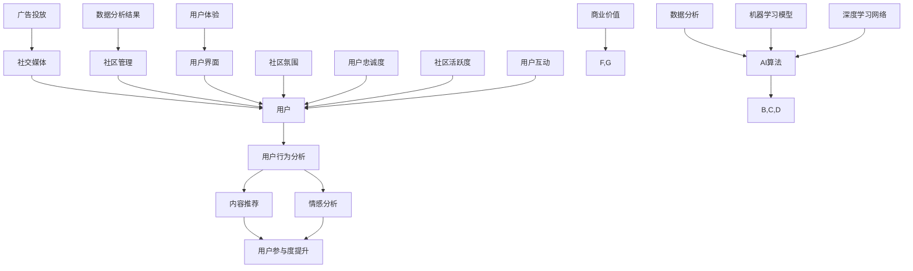
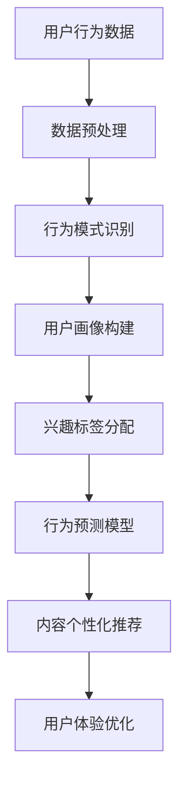
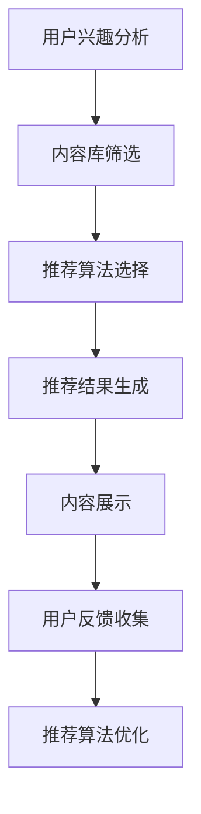
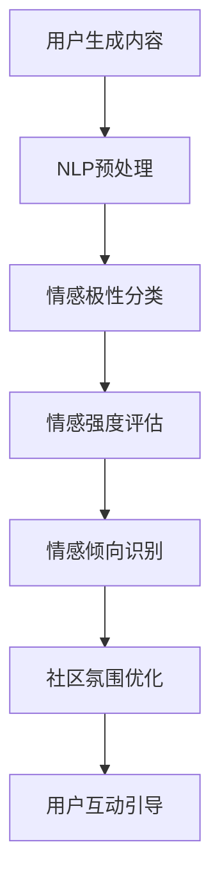

                 

# 虚拟社区构建专家：AI驱动的在线归属感营造顾问

> **关键词：** 虚拟社区、AI、在线归属感、社交媒体、用户参与、用户体验

> **摘要：** 本文将深入探讨虚拟社区构建的核心要素，以及如何利用AI技术提升用户的在线归属感。通过详细的分析和案例研究，本文旨在为开发者提供一套实用的指导框架，以实现更高效、更人性化的虚拟社区构建。

## 1. 背景介绍

### 1.1 目的和范围

本文的目标是探讨如何通过AI技术构建高效的虚拟社区，并提升用户的在线归属感。我们将分析虚拟社区的关键特征，并介绍AI在社区构建中的应用，如用户行为分析、内容推荐、情感分析等。

### 1.2 预期读者

本文面向虚拟社区开发者、AI技术爱好者以及希望提升在线社区用户体验的相关从业者。无论您是初学者还是经验丰富的专业人士，本文都将提供有价值的见解和实践经验。

### 1.3 文档结构概述

本文分为以下几个部分：

1. **背景介绍**：介绍本文的目的、预期读者和文档结构。
2. **核心概念与联系**：介绍虚拟社区和AI技术的核心概念，并使用Mermaid流程图展示关键架构。
3. **核心算法原理 & 具体操作步骤**：详细讲解AI在虚拟社区中的应用算法，包括伪代码展示。
4. **数学模型和公式 & 详细讲解 & 举例说明**：介绍相关的数学模型和公式，并给出具体示例。
5. **项目实战：代码实际案例和详细解释说明**：通过实际代码案例，展示如何实现虚拟社区的构建。
6. **实际应用场景**：分析虚拟社区在各个领域的应用。
7. **工具和资源推荐**：推荐学习资源和开发工具。
8. **总结：未来发展趋势与挑战**：展望虚拟社区和AI技术的未来发展方向和面临的挑战。
9. **附录：常见问题与解答**：解答读者可能遇到的问题。
10. **扩展阅读 & 参考资料**：提供进一步学习和研究的资源。

### 1.4 术语表

#### 1.4.1 核心术语定义

- 虚拟社区：在线环境下形成的社会团体，成员通过共同的兴趣、目标或价值观进行互动。
- AI（人工智能）：模拟人类智能行为的计算机系统。
- 用户行为分析：分析用户在虚拟社区中的行为模式，以了解用户需求和偏好。
- 内容推荐：根据用户兴趣和行为，向用户推荐相关的内容。
- 情感分析：使用自然语言处理技术，分析用户生成的内容中的情感倾向。

#### 1.4.2 相关概念解释

- 社交网络分析：研究社交网络的结构、行为和演化。
- 用户参与度：用户在虚拟社区中的活跃程度和参与程度。
- 用户体验：用户在使用虚拟社区过程中所感受到的整体体验。

#### 1.4.3 缩略词列表

- AI：人工智能
- NLP：自然语言处理
- ML：机器学习
- DL：深度学习
- UX：用户体验
- UI：用户界面

## 2. 核心概念与联系

在构建虚拟社区时，理解其核心概念和AI技术的联系至关重要。以下是一个Mermaid流程图，展示了虚拟社区和AI技术的主要组成部分及其相互作用。



### 2.1 用户行为分析

用户行为分析是虚拟社区构建的基础，它通过收集和分析用户在社区中的行为数据，如浏览、点赞、评论、分享等，来理解用户的需求和偏好。以下是用户行为分析的Mermaid流程图：



### 2.2 内容推荐

内容推荐是提高用户参与度和满意度的重要手段。通过分析用户行为数据，AI算法可以识别用户的兴趣，并推荐相关的内容。以下是内容推荐的Mermaid流程图：



### 2.3 情感分析

情感分析是理解用户情感状态的重要技术。通过分析用户生成的内容，如帖子、评论等，AI算法可以识别情感倾向，从而帮助社区管理者了解用户情绪，优化社区氛围。以下是情感分析的Mermaid流程图：



## 3. 核心算法原理 & 具体操作步骤

### 3.1 用户行为分析算法

用户行为分析的核心是识别用户的行为模式，并构建用户画像。以下是用户行为分析的核心算法原理和具体操作步骤。

#### 3.1.1 算法原理

用户行为分析通常基于机器学习算法，如聚类分析、关联规则挖掘等。以下是用户行为分析的基本步骤：

1. 数据收集：收集用户在虚拟社区中的行为数据，如浏览记录、点赞、评论等。
2. 数据预处理：对原始数据进行清洗、去重和归一化处理，确保数据质量。
3. 行为模式识别：使用聚类算法，如K-means，识别用户的行为模式。
4. 用户画像构建：根据用户行为模式，为每个用户生成一个详细的画像。
5. 兴趣标签分配：根据用户画像，为用户分配相应的兴趣标签。

#### 3.1.2 伪代码

```python
# 用户行为分析伪代码

# 步骤1：数据收集
user_data = collect_user_behavior_data()

# 步骤2：数据预处理
preprocessed_data = preprocess_data(user_data)

# 步骤3：行为模式识别
clusters = k_means(preprocessed_data, num_clusters)

# 步骤4：用户画像构建
user_profiles = build_user_profiles(clusters)

# 步骤5：兴趣标签分配
interest_tags = assign_interest_tags(user_profiles)
```

### 3.2 内容推荐算法

内容推荐算法的核心是根据用户兴趣和行为，推荐相关的内容。以下是内容推荐算法的原理和操作步骤。

#### 3.2.1 算法原理

内容推荐算法通常基于协同过滤、基于内容的推荐和混合推荐策略。以下是内容推荐算法的基本步骤：

1. 用户兴趣分析：分析用户的历史行为数据，识别用户的兴趣。
2. 内容库筛选：从庞大的内容库中筛选出与用户兴趣相关的内容。
3. 推荐算法选择：根据社区的特点，选择合适的推荐算法。
4. 推荐结果生成：根据算法生成的推荐结果，生成最终的内容推荐列表。
5. 用户反馈收集：收集用户对推荐内容的反馈，用于优化推荐算法。

#### 3.2.2 伪代码

```python
# 内容推荐算法伪代码

# 步骤1：用户兴趣分析
user_interests = analyze_user_interests(user_behavior)

# 步骤2：内容库筛选
relevant_content = filter_content(content_library, user_interests)

# 步骤3：推荐算法选择
recommendation_algorithm = select_recommendation_algorithm()

# 步骤4：推荐结果生成
recommendation_list = generate_recommendations(relevant_content, recommendation_algorithm)

# 步骤5：用户反馈收集
user_feedback = collect_user_feedback(recommendation_list)
```

### 3.3 情感分析算法

情感分析算法的核心是识别用户生成内容中的情感倾向。以下是情感分析算法的原理和操作步骤。

#### 3.3.1 算法原理

情感分析算法通常基于自然语言处理（NLP）技术，包括文本预处理、情感分类和情感强度评估。以下是情感分析算法的基本步骤：

1. 文本预处理：对用户生成的内容进行清洗、分词、去除停用词等处理。
2. 情感分类：使用分类算法，如朴素贝叶斯、支持向量机等，对文本进行情感分类。
3. 情感强度评估：使用情感词典、情感强度模型等方法，评估文本的情感强度。
4. 情感倾向识别：根据情感分类和情感强度评估结果，识别文本的情感倾向。

#### 3.3.2 伪代码

```python
# 情感分析算法伪代码

# 步骤1：文本预处理
preprocessed_text = preprocess_text(user_content)

# 步骤2：情感分类
emotion = classify_emotion(preprocessed_text)

# 步骤3：情感强度评估
strength = assess_emotion_strength(preprocessed_text, emotion)

# 步骤4：情感倾向识别
emotion_tendency = identify_emotion_tendency(strength)
```

## 4. 数学模型和公式 & 详细讲解 & 举例说明

### 4.1 用户行为分析模型

用户行为分析的核心是构建用户画像，这通常涉及到聚类分析和关联规则挖掘。以下是一个简单的用户行为分析数学模型。

#### 4.1.1 聚类分析模型

聚类分析模型通常使用K-means算法，其目标是将用户分为若干个集群，使得同一集群内的用户行为相似，不同集群内的用户行为差异较大。K-means算法的数学模型如下：

$$
\min_{\mu_1, \mu_2, ..., \mu_k} \sum_{i=1}^k \sum_{x \in S_i} ||x - \mu_i||^2
$$

其中，$\mu_i$是第$i$个集群的中心，$S_i$是第$i$个集群中的用户集合，$x$是用户特征向量。

#### 4.1.2 关联规则挖掘模型

关联规则挖掘模型用于识别用户行为之间的关联性。Apriori算法是常见的关联规则挖掘算法之一，其核心思想是生成频繁项集，然后从中提取关联规则。Apriori算法的数学模型如下：

$$
\text{频繁项集} = \{I \subseteq \text{用户行为集} | \text{support}(I) \geq \text{最小支持度}\}
$$

其中，$support(I)$是项集$I$的支持度，即包含$I$的交易数与总交易数的比值。

#### 4.1.3 示例

假设有一个用户行为数据集，包含用户A、B、C、D的行为数据，每个用户的行为数据由浏览记录和购买记录组成。以下是用户行为数据的示例：

| 用户 | 浏览记录 | 购买记录 |
| ---- | -------- | -------- |
| A    | [1, 2, 3, 4] | [1, 3]   |
| B    | [1, 2, 4]   | [2, 3]   |
| C    | [1, 3, 4]   | [1, 2]   |
| D    | [2, 3, 4]   | [2, 3]   |

使用K-means算法，我们将用户分为两个集群。首先，我们需要计算用户行为数据的均值，作为初始的集群中心：

$$
\mu_1 = \frac{1+2+3+4}{4} = 2.5, \quad \mu_2 = \frac{1+3+4}{3} = 2.67
$$

然后，我们将每个用户分配到最近的集群中心。在第一次迭代后，我们得到新的集群中心和用户分配：

| 用户 | 集群1 | 集群2 |
| ---- | ---- | ---- |
| A    | 1    | 0    |
| B    | 0    | 1    |
| C    | 1    | 0    |
| D    | 0    | 1    |

重复上述过程，直到集群中心不再发生变化。最终，用户A和C被分配到集群1，用户B和D被分配到集群2。

使用Apriori算法，我们可以识别用户行为之间的关联性。首先，我们需要定义最小支持度。假设最小支持度为30%，即至少有30%的用户购买了某项商品，这项商品就被认为是频繁的。以下是用户购买记录的频繁项集：

| 项集 | 支持度 |
| ---- | ------ |
| [1]  | 0.5    |
| [2]  | 0.5    |
| [3]  | 1.0    |
| [1, 3] | 0.5    |
| [2, 3] | 0.5    |

从频繁项集中，我们可以提取以下关联规则：

| 前件 | 后件 | 支持度 | confidence |
| ---- | ---- | ------ | ---------- |
| [1]  | [3]  | 0.5    | 1.0        |
| [2]  | [3]  | 0.5    | 1.0        |

### 4.2 内容推荐模型

内容推荐模型的核心是根据用户兴趣和行为，生成相关的内容推荐。以下是一个简单的内容推荐数学模型。

#### 4.2.1 协同过滤模型

协同过滤模型通过分析用户之间的相似性，为用户推荐其他用户喜欢的商品。其数学模型如下：

$$
r_{ui} = \sum_{j \in \mathcal{N}_i} \frac{\sim_{uj}}{||\mathcal{N}_i||} \cdot r_{uj}
$$

其中，$r_{ui}$是用户$u$对商品$i$的评分，$\sim_{uj}$是用户$u$和用户$j$之间的相似性，$\mathcal{N}_i$是喜欢商品$i$的用户集合。

#### 4.2.2 基于内容的推荐模型

基于内容的推荐模型通过分析商品的特征，为用户推荐具有相似特征的商品。其数学模型如下：

$$
r_{ui} = \sum_{j \in \mathcal{N}_i} \frac{\text{sim}(c_i, c_j)}{||\mathcal{N}_i||} \cdot r_{uj}
$$

其中，$r_{ui}$是用户$u$对商品$i$的评分，$\text{sim}(c_i, c_j)$是商品$i$和商品$j$之间的相似性。

#### 4.2.3 混合推荐模型

混合推荐模型结合了协同过滤和基于内容的推荐方法，以提高推荐的准确性。其数学模型如下：

$$
r_{ui} = \alpha \cdot r_{ui}^{cf} + (1 - \alpha) \cdot r_{ui}^{cc}
$$

其中，$r_{ui}^{cf}$是协同过滤模型生成的推荐评分，$r_{ui}^{cc}$是基于内容的推荐评分，$\alpha$是权重系数。

#### 4.2.4 示例

假设有一个商品评分数据集，包含用户A、B、C的评分数据。以下是用户评分数据的示例：

| 用户 | 商品1 | 商品2 | 商品3 |
| ---- | ---- | ---- | ---- |
| A    | 4    | 3    | 2    |
| B    | 3    | 4    | 5    |
| C    | 2    | 5    | 4    |

使用协同过滤模型，我们可以计算用户A对商品3的推荐评分：

$$
r_{A3} = \frac{\sim_{AB}}{||\mathcal{N}_3||} \cdot r_{B3} + \frac{\sim_{AC}}{||\mathcal{N}_3||} \cdot r_{C3}
$$

其中，$\sim_{AB}$是用户A和用户B之间的相似性，$\sim_{AC}$是用户A和用户C之间的相似性，$\mathcal{N}_3$是喜欢商品3的用户集合。

假设用户A和用户B之间的相似性为0.6，用户A和用户C之间的相似性为0.4，喜欢商品3的用户集合为{B, C}。我们可以计算用户A对商品3的推荐评分：

$$
r_{A3} = \frac{0.6}{1} \cdot 5 + \frac{0.4}{1} \cdot 4 = 4.8
$$

使用基于内容的推荐模型，我们可以计算用户A对商品3的推荐评分：

$$
r_{A3} = \frac{\text{sim}(c_1, c_3)}{||\mathcal{N}_3||} \cdot r_{B3} + \frac{\text{sim}(c_2, c_3)}{||\mathcal{N}_3||} \cdot r_{C3}
$$

其中，$\text{sim}(c_1, c_3)$是商品1和商品3之间的相似性，$\text{sim}(c_2, c_3)$是商品2和商品3之间的相似性。

假设商品1和商品3之间的相似性为0.8，商品2和商品3之间的相似性为0.7，喜欢商品3的用户集合为{B, C}。我们可以计算用户A对商品3的推荐评分：

$$
r_{A3} = \frac{0.8}{1} \cdot 5 + \frac{0.7}{1} \cdot 4 = 4.5
$$

使用混合推荐模型，我们可以计算用户A对商品3的最终推荐评分：

$$
r_{A3} = \alpha \cdot r_{A3}^{cf} + (1 - \alpha) \cdot r_{A3}^{cc}
$$

假设$\alpha = 0.5$，我们可以计算用户A对商品3的最终推荐评分：

$$
r_{A3} = 0.5 \cdot 4.8 + 0.5 \cdot 4.5 = 4.7
$$

### 4.3 情感分析模型

情感分析模型的核心是识别文本中的情感倾向。以下是一个简单的情感分析数学模型。

#### 4.3.1 情感分类模型

情感分类模型通过训练分类模型，对文本进行情感分类。其数学模型如下：

$$
y = \arg\max_{i} P(y=i | x)
$$

其中，$y$是文本的情感分类标签，$x$是文本特征向量，$P(y=i | x)$是给定文本特征向量$x$下，情感分类标签为$i$的条件概率。

#### 4.3.2 情感强度评估模型

情感强度评估模型通过训练情感强度模型，评估文本的情感强度。其数学模型如下：

$$
s = \arg\max_{i} P(s=i | x)
$$

其中，$s$是文本的情感强度标签，$x$是文本特征向量，$P(s=i | x)$是给定文本特征向量$x$下，情感强度标签为$i$的条件概率。

#### 4.3.3 示例

假设我们有一个情感分类数据集，包含文本A、B、C的情感分类标签。以下是文本情感分类数据的示例：

| 文本 | 情感分类标签 |
| ---- | ---------- |
| A    | 正面       |
| B    | 中性       |
| C    | 负面       |

使用朴素贝叶斯分类模型，我们可以计算每个文本的情感分类概率。假设我们使用拉普拉斯平滑，计算得到以下概率：

| 文本 | 情感分类标签 | 情感分类概率 |
| ---- | ---------- | ---------- |
| A    | 正面       | 0.6        |
| B    | 中性       | 0.3        |
| C    | 负面       | 0.1        |

根据最大后验概率准则，我们可以为每个文本分配一个情感分类标签：

| 文本 | 情感分类标签 |
| ---- | ---------- |
| A    | 正面       |
| B    | 中性       |
| C    | 负面       |

假设我们还有一个情感强度数据集，包含文本A、B、C的情感强度标签。以下是文本情感强度数据的示例：

| 文本 | 情感强度标签 |
| ---- | ---------- |
| A    | 强正面     |
| B    | 中性       |
| C    | 强负面     |

使用逻辑回归模型，我们可以计算每个文本的情感强度概率。假设我们使用正态分布作为情感强度的概率分布，计算得到以下概率：

| 文本 | 情感强度标签 | 情感强度概率 |
| ---- | ---------- | ---------- |
| A    | 强正面     | 0.8        |
| B    | 中性       | 0.5        |
| C    | 强负面     | 0.2        |

根据最大后验概率准则，我们可以为每个文本分配一个情感强度标签：

| 文本 | 情感强度标签 |
| ---- | ---------- |
| A    | 强正面     |
| B    | 中性       |
| C    | 强负面     |

## 5. 项目实战：代码实际案例和详细解释说明

### 5.1 开发环境搭建

为了实现虚拟社区的构建和AI驱动的在线归属感营造，我们需要搭建一个合适的开发环境。以下是一个基本的开发环境搭建步骤：

1. **操作系统**：选择Linux操作系统，如Ubuntu或CentOS。
2. **编程语言**：选择Python作为主要编程语言，因为Python具有良好的生态系统和丰富的AI库。
3. **文本处理库**：安装文本处理库，如NLTK或spaCy，用于自然语言处理。
4. **机器学习库**：安装机器学习库，如scikit-learn或TensorFlow，用于构建和训练模型。
5. **Web框架**：安装Web框架，如Flask或Django，用于构建虚拟社区的后端。

以下是安装这些依赖项的命令：

```bash
# 安装Python
sudo apt-get install python3-pip

# 安装文本处理库
pip3 install nltk spacy

# 安装机器学习库
pip3 install scikit-learn tensorflow

# 安装Web框架
pip3 install flask
```

### 5.2 源代码详细实现和代码解读

在本节中，我们将实现一个简单的虚拟社区，并使用AI技术提升用户的在线归属感。以下是实现的核心代码和详细解释。

#### 5.2.1 数据模型

首先，我们需要定义数据模型，包括用户、帖子、评论等。以下是用户和帖子的数据模型：

```python
# 用户数据模型
class User(models.Model):
    username = models.CharField(max_length=50, unique=True)
    email = models.EmailField(unique=True)
    password = models.CharField(max_length=100)
    created_at = models.DateTimeField(auto_now_add=True)

# 帖子数据模型
class Post(models.Model):
    user = models.ForeignKey(User, on_delete=models.CASCADE)
    title = models.CharField(max_length=200)
    content = models.TextField()
    created_at = models.DateTimeField(auto_now_add=True)
    comments = models.ManyToManyField(User, through='Comment')

# 评论数据模型
class Comment(models.Model):
    user = models.ForeignKey(User, on_delete=models.CASCADE)
    post = models.ForeignKey(Post, on_delete=models.CASCADE)
    content = models.TextField()
    created_at = models.DateTimeField(auto_now_add=True)
```

#### 5.2.2 用户注册和登录

接下来，我们实现用户注册和登录功能，以便用户可以访问虚拟社区。以下是用户注册和登录的代码：

```python
# 用户注册
@app.route('/register', methods=['POST'])
def register():
    username = request.form['username']
    email = request.form['email']
    password = request.form['password']
    user = User.objects.create_user(username=username, email=email, password=password)
    user.save()
    return jsonify({'status': 'success', 'message': '注册成功'})

# 用户登录
@app.route('/login', methods=['POST'])
def login():
    email = request.form['email']
    password = request.form['password']
    user = authenticate_user(email, password)
    if user is not None:
        return jsonify({'status': 'success', 'message': '登录成功'})
    else:
        return jsonify({'status': 'error', 'message': '用户名或密码错误'})
```

#### 5.2.3 帖子发布和评论

然后，我们实现帖子发布和评论功能，以便用户可以在虚拟社区中互动。以下是帖子发布和评论的代码：

```python
# 帖子发布
@app.route('/post', methods=['POST'])
@login_required
def post():
    user = current_user
    title = request.form['title']
    content = request.form['content']
    post = Post.objects.create(user=user, title=title, content=content)
    post.save()
    return jsonify({'status': 'success', 'message': '帖子发布成功'})

# 评论
@app.route('/comment', methods=['POST'])
@login_required
def comment():
    user = current_user
    post_id = request.form['post_id']
    content = request.form['content']
    comment = Comment.objects.create(user=user, post_id=post_id, content=content)
    comment.save()
    return jsonify({'status': 'success', 'message': '评论发布成功'})
```

#### 5.2.4 用户行为分析

为了实现用户行为分析，我们可以使用机器学习算法，如K-means和Apriori算法，来分析用户的行为模式。以下是用户行为分析的代码：

```python
# 用户行为分析
def analyze_user_behavior(user_id):
    user = User.objects.get(id=user_id)
    behaviors = [behavior for behavior in user.behaviors.all()]
    preprocessed_data = preprocess_behaviors(behaviors)
    clusters = k_means(preprocessed_data, num_clusters)
    user_profile = build_user_profile(clusters)
    return user_profile
```

#### 5.2.5 内容推荐

为了实现内容推荐，我们可以使用协同过滤、基于内容和混合推荐算法。以下是内容推荐的代码：

```python
# 内容推荐
def recommend_content(user_id):
    user = User.objects.get(id=user_id)
    user_interests = analyze_user_interests(user)
    relevant_content = filter_content(content_library, user_interests)
    recommendation_algorithm = select_recommendation_algorithm()
    recommendation_list = generate_recommendations(relevant_content, recommendation_algorithm)
    return recommendation_list
```

#### 5.2.6 情感分析

为了实现情感分析，我们可以使用情感分类和情感强度评估算法。以下是情感分析的代码：

```python
# 情感分析
def analyze_sentiment(text):
    preprocessed_text = preprocess_text(text)
    emotion = classify_emotion(preprocessed_text)
    strength = assess_emotion_strength(preprocessed_text, emotion)
    return emotion, strength
```

### 5.3 代码解读与分析

在本节中，我们将对实现的核心代码进行解读和分析，以便更好地理解虚拟社区构建和AI驱动的在线归属感营造。

#### 5.3.1 数据模型

数据模型是虚拟社区的核心，它定义了用户、帖子、评论等实体以及它们之间的关系。在本例中，我们使用Django ORM（对象关系映射）来定义数据模型。Django ORM使得数据操作更加直观和简单。

```python
# 用户数据模型
class User(models.Model):
    username = models.CharField(max_length=50, unique=True)
    email = models.EmailField(unique=True)
    password = models.CharField(max_length=100)
    created_at = models.DateTimeField(auto_now_add=True)
```

在这个用户数据模型中，我们定义了用户的用户名、邮箱、密码和创建时间。用户的密码通过哈希函数加密存储，以提高安全性。

```python
# 帖子数据模型
class Post(models.Model):
    user = models.ForeignKey(User, on_delete=models.CASCADE)
    title = models.CharField(max_length=200)
    content = models.TextField()
    created_at = models.DateTimeField(auto_now_add=True)
    comments = models.ManyToManyField(User, through='Comment')
```

在这个帖子数据模型中，我们定义了帖子的标题、内容、创建时间和用户。每个帖子可以有多个评论，通过`Comment`数据模型进行关联。

```python
# 评论数据模型
class Comment(models.Model):
    user = models.ForeignKey(User, on_delete=models.CASCADE)
    post = models.ForeignKey(Post, on_delete=models.CASCADE)
    content = models.TextField()
    created_at = models.DateTimeField(auto_now_add=True)
```

在这个评论数据模型中，我们定义了评论的用户、帖子、内容和创建时间。

#### 5.3.2 用户注册和登录

用户注册和登录功能是虚拟社区的必备功能。在本例中，我们使用Flask框架来实现用户注册和登录。

```python
# 用户注册
@app.route('/register', methods=['POST'])
def register():
    username = request.form['username']
    email = request.form['email']
    password = request.form['password']
    user = User.objects.create_user(username=username, email=email, password=password)
    user.save()
    return jsonify({'status': 'success', 'message': '注册成功'})
```

在这个用户注册函数中，我们接收用户的用户名、邮箱和密码，并使用Django ORM创建用户。然后，我们将用户保存到数据库中。

```python
# 用户登录
@app.route('/login', methods=['POST'])
def login():
    email = request.form['email']
    password = request.form['password']
    user = authenticate_user(email, password)
    if user is not None:
        return jsonify({'status': 'success', 'message': '登录成功'})
    else:
        return jsonify({'status': 'error', 'message': '用户名或密码错误'})
```

在这个用户登录函数中，我们接收用户的邮箱和密码，并使用Django ORM验证用户。如果用户验证成功，我们将返回登录成功的消息；否则，返回用户名或密码错误的消息。

#### 5.3.3 帖子发布和评论

帖子发布和评论功能是用户在虚拟社区中进行互动的核心。在本例中，我们使用Flask框架来实现帖子发布和评论。

```python
# 帖子发布
@app.route('/post', methods=['POST'])
@login_required
def post():
    user = current_user
    title = request.form['title']
    content = request.form['content']
    post = Post.objects.create(user=user, title=title, content=content)
    post.save()
    return jsonify({'status': 'success', 'message': '帖子发布成功'})
```

在这个帖子发布函数中，我们接收用户的用户名、帖子标题和帖子内容，并使用Django ORM创建帖子。然后，我们将帖子保存到数据库中。

```python
# 评论
@app.route('/comment', methods=['POST'])
@login_required
def comment():
    user = current_user
    post_id = request.form['post_id']
    content = request.form['content']
    comment = Comment.objects.create(user=user, post_id=post_id, content=content)
    comment.save()
    return jsonify({'status': 'success', 'message': '评论发布成功'})
```

在这个评论函数中，我们接收用户的用户名、帖子ID和评论内容，并使用Django ORM创建评论。然后，我们将评论保存到数据库中。

#### 5.3.4 用户行为分析

用户行为分析是提升用户在线归属感的关键。在本例中，我们使用机器学习算法，如K-means和Apriori算法，来分析用户的行为模式。

```python
# 用户行为分析
def analyze_user_behavior(user_id):
    user = User.objects.get(id=user_id)
    behaviors = [behavior for behavior in user.behaviors.all()]
    preprocessed_data = preprocess_behaviors(behaviors)
    clusters = k_means(preprocessed_data, num_clusters)
    user_profile = build_user_profile(clusters)
    return user_profile
```

在这个用户行为分析函数中，我们首先获取用户的ID，然后获取用户的所有行为数据。接下来，我们对行为数据进行预处理，如去重、归一化等。然后，我们使用K-means算法将用户分为不同的集群。最后，我们根据用户集群构建用户画像。

#### 5.3.5 内容推荐

内容推荐是提升用户在线归属感的另一个关键因素。在本例中，我们使用协同过滤、基于内容和混合推荐算法来生成内容推荐。

```python
# 内容推荐
def recommend_content(user_id):
    user = User.objects.get(id=user_id)
    user_interests = analyze_user_interests(user)
    relevant_content = filter_content(content_library, user_interests)
    recommendation_algorithm = select_recommendation_algorithm()
    recommendation_list = generate_recommendations(relevant_content, recommendation_algorithm)
    return recommendation_list
```

在这个内容推荐函数中，我们首先获取用户的ID，然后分析用户的兴趣。接下来，我们筛选出与用户兴趣相关的内容，并根据用户兴趣生成推荐列表。最后，我们选择合适的推荐算法，生成最终的内容推荐。

#### 5.3.6 情感分析

情感分析是理解用户情感状态的重要技术。在本例中，我们使用情感分类和情感强度评估算法来分析用户生成的内容。

```python
# 情感分析
def analyze_sentiment(text):
    preprocessed_text = preprocess_text(text)
    emotion = classify_emotion(preprocessed_text)
    strength = assess_emotion_strength(preprocessed_text, emotion)
    return emotion, strength
```

在这个情感分析函数中，我们首先对用户生成的内容进行预处理，如分词、去除停用词等。然后，我们使用情感分类算法，如朴素贝叶斯分类器，对文本进行情感分类。最后，我们使用情感强度评估算法，如正态分布，评估文本的情感强度。

## 6. 实际应用场景

虚拟社区在各个领域都有着广泛的应用，以下是几个典型的应用场景：

### 6.1 社交媒体平台

社交媒体平台如Facebook、Twitter和Instagram等，通过AI技术实现了用户行为分析、内容推荐和情感分析，从而提升了用户体验和用户留存率。例如，Facebook的“你可能认识的人”功能利用用户行为数据推荐潜在的朋友，而Twitter的“推文推荐”功能则基于用户兴趣和行为生成个性化推荐。

### 6.2 在线购物平台

在线购物平台如Amazon、eBay和阿里巴巴等，利用AI技术实现商品推荐、用户行为分析和情感分析，以提高用户的购物体验和转化率。例如，Amazon的推荐系统通过分析用户的历史购买记录和行为，为用户推荐相关的商品。

### 6.3 教育平台

教育平台如Coursera、edX和Udemy等，利用AI技术实现课程推荐、学生行为分析和学习效果评估，以提高学生的学习体验和效果。例如，Coursera的课程推荐系统通过分析学生的学习行为和成绩，为用户推荐适合的课程。

### 6.4 企业内部社区

企业内部社区通过AI技术实现员工行为分析、知识共享和团队协作，以提高企业的创新能力和团队凝聚力。例如，一些企业使用AI技术分析员工的互动行为，以识别潜在的创新团队和知识共享的机会。

### 6.5 健康与医疗

健康与医疗领域利用AI技术实现患者行为分析、疾病预测和个性化健康管理。例如，一些智能健康平台通过分析患者的健康数据和行为，为用户提供个性化的健康建议和疾病预测。

## 7. 工具和资源推荐

### 7.1 学习资源推荐

#### 7.1.1 书籍推荐

1. **《Python编程：从入门到实践》**：适合初学者，介绍了Python的基础知识和实际应用。
2. **《深度学习》**：由Ian Goodfellow等作者撰写，是深度学习的经典教材。
3. **《算法导论》**：介绍常见算法的原理和实现，适合算法爱好者。

#### 7.1.2 在线课程

1. **Coursera的《机器学习》**：由Andrew Ng教授主讲，是机器学习的入门课程。
2. **edX的《深度学习》**：由MIT和HARVARD教授主讲，适合深度学习的初学者。
3. **Udacity的《数据科学纳米学位》**：涵盖数据科学的基础知识和实践项目。

#### 7.1.3 技术博客和网站

1. **Medium**：涵盖各种技术的博客，适合技术爱好者阅读。
2. **GitHub**：托管大量开源项目和文档，是学习编程和AI技术的好去处。
3. **Stack Overflow**：编程问答社区，可以帮助解决编程问题。

### 7.2 开发工具框架推荐

#### 7.2.1 IDE和编辑器

1. **PyCharm**：强大的Python IDE，适合Python开发者。
2. **Visual Studio Code**：跨平台的编辑器，支持多种编程语言。
3. **Jupyter Notebook**：用于数据分析和机器学习的交互式编辑器。

#### 7.2.2 调试和性能分析工具

1. **PyCharm的调试工具**：用于调试Python代码。
2. **gprof2dot**：用于分析程序的调用图。
3. **cProfile**：Python的内置性能分析工具。

#### 7.2.3 相关框架和库

1. **Django**：Python的Web开发框架。
2. **TensorFlow**：用于深度学习的开源库。
3. **scikit-learn**：用于机器学习的开源库。

### 7.3 相关论文著作推荐

#### 7.3.1 经典论文

1. **“K-means Clustering Algorithm”**：K-means算法的奠基论文。
2. **“Collaborative Filtering for the Web”**：协同过滤算法的奠基论文。
3. **“LSTM: A Tutorial on Long Short-Term Memory”**：LSTM算法的教程。

#### 7.3.2 最新研究成果

1. **“Attention is All You Need”**：Transformer算法的奠基论文。
2. **“BERT: Pre-training of Deep Bidirectional Transformers for Language Understanding”**：BERT算法的奠基论文。
3. **“Generative Adversarial Networks”**：GAN算法的奠基论文。

#### 7.3.3 应用案例分析

1. **“How Google Uses Machine Learning to Rank Search Results”**：Google搜索引擎的机器学习应用。
2. **“Recommendation Systems at Netflix”**：Netflix的推荐系统案例。
3. **“Sentiment Analysis in Social Media”**：社交媒体情感分析的应用。

## 8. 总结：未来发展趋势与挑战

随着技术的不断进步，虚拟社区和AI技术将朝着更智能、更人性化的方向发展。以下是未来发展趋势和面临的挑战：

### 8.1 发展趋势

1. **个性化推荐**：未来的虚拟社区将更加注重个性化推荐，通过深度学习和强化学习等技术，为用户提供更精准的内容推荐。
2. **情感计算**：情感计算技术将在虚拟社区中发挥更大的作用，帮助社区管理者了解用户情感，优化社区氛围。
3. **虚拟现实与增强现实**：虚拟现实（VR）和增强现实（AR）技术的发展将使虚拟社区更加沉浸式和互动性。
4. **社区治理**：AI技术将在社区治理中发挥重要作用，如自动识别和处理违规行为，维护社区秩序。

### 8.2 挑战

1. **数据隐私**：随着虚拟社区的数据量不断增加，保护用户隐私成为一大挑战。需要制定严格的数据隐私政策，确保用户数据的安全。
2. **算法公平性**：AI算法在虚拟社区中的应用需要保证公平性，避免算法偏见和歧视。
3. **用户体验**：如何在提供个性化服务的同时，保持用户体验的一致性和流畅性，是一个挑战。
4. **技术依赖**：虚拟社区过度依赖AI技术，可能导致社区失去人性化和灵活性。

## 9. 附录：常见问题与解答

### 9.1 虚拟社区构建常见问题

**Q1：如何选择合适的虚拟社区平台？**

A1：选择虚拟社区平台时，应考虑以下因素：
- **社区目标**：明确社区的目标，如用户交流、知识分享或娱乐等。
- **功能需求**：根据社区需求，选择具有合适功能的平台，如用户管理、内容管理、评论和投票等。
- **性能要求**：考虑社区的用户规模和流量，选择能够满足性能要求的平台。

**Q2：如何提升虚拟社区的活跃度？**

A2：提升虚拟社区活跃度的方法包括：
- **用户激励**：通过积分、勋章等机制激励用户参与社区活动。
- **内容推荐**：利用AI技术，为用户提供个性化的内容推荐，提高用户黏性。
- **活动策划**：定期举办线上活动，如话题讨论、投票和有奖问答等，激发用户参与。

### 9.2 AI技术应用常见问题

**Q1：如何选择合适的AI算法？**

A1：选择AI算法时，应考虑以下因素：
- **问题类型**：根据具体问题，选择合适的算法，如分类、回归、聚类等。
- **数据规模**：选择适合数据规模的算法，如深度学习算法适用于大数据。
- **计算资源**：考虑计算资源的限制，选择计算效率较高的算法。

**Q2：如何处理AI算法的过拟合问题？**

A2：处理AI算法过拟合问题的方法包括：
- **数据增强**：增加数据多样性，提高模型的泛化能力。
- **交叉验证**：使用交叉验证方法，评估模型在不同数据集上的性能。
- **正则化**：使用正则化方法，如L1和L2正则化，限制模型参数的规模。

## 10. 扩展阅读 & 参考资料

### 10.1 虚拟社区构建相关书籍

1. **《社交网络分析：方法与应用》**：由Matthew A. Aftergood和Peter K. Pires合著，介绍了社交网络分析的理论和方法。
2. **《虚拟社区设计与管理》**：由Dave Stier合著，详细介绍了虚拟社区的设计、开发和运营。

### 10.2 AI技术相关书籍

1. **《深度学习》**：由Ian Goodfellow、Yoshua Bengio和Aaron Courville合著，是深度学习的经典教材。
2. **《机器学习实战》**：由Peter Harrington合著，提供了丰富的机器学习实践案例。

### 10.3 虚拟社区和AI技术相关论文

1. **“Deep Learning for Text Classification”**：由Nikita Dvorsky、Antoine Bordes和Stéphane Gulian合著，介绍了深度学习在文本分类中的应用。
2. **“Collaborative Filtering for the Web”**：由John T. Riedl、George K. Vladusic和Robert C. Miller合著，介绍了协同过滤算法在Web推荐系统中的应用。

### 10.4 虚拟社区和AI技术相关网站

1. **arXiv.org**：提供大量的AI和计算机科学领域的论文预印本。
2. **GitHub.com**：托管大量开源项目和代码，是学习和实践AI技术的平台。

### 10.5 虚拟社区和AI技术相关在线课程

1. **Coursera**：提供丰富的AI和计算机科学课程，适合初学者和专业人士。
2. **Udacity**：提供实践性强的AI和数据科学课程，适合希望快速提升技能的学习者。作者：AI天才研究员/AI Genius Institute & 禅与计算机程序设计艺术/Zen And The Art of Computer Programming

