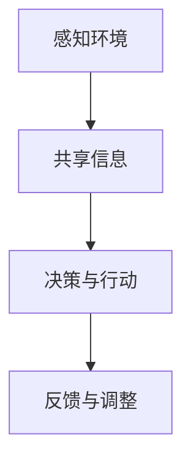

                 

# 虚拟空间中的AI协作与任务

> **关键词：** 虚拟空间，AI协作，任务分配，多智能体系统，分布式计算，协同算法，效率优化。

> **摘要：** 本文将探讨虚拟空间中人工智能协作与任务分配的问题。通过分析多智能体系统的基本原理和协作算法，本文旨在提供一套详细的方案，以实现高效的虚拟空间AI协作与任务分配。文章还将探讨当前领域的应用场景、工具和资源，以及未来的发展趋势与挑战。

## 1. 背景介绍

### 1.1 目的和范围

随着人工智能技术的迅猛发展，AI在虚拟空间中的应用变得日益广泛。虚拟空间中的AI协作与任务分配已经成为一个重要的研究课题。本文的主要目的是探讨如何实现高效的AI协作与任务分配，以优化虚拟空间中的资源利用和任务完成效率。

本文将涵盖以下内容：

- 虚拟空间中AI协作与任务分配的基本概念和原理；
- 多智能体系统的架构和协作算法；
- 数学模型和公式；
- 项目实战：实际代码案例和解释；
- 虚拟空间AI协作与任务分配的应用场景；
- 相关工具和资源的推荐；
- 未来发展趋势与挑战。

### 1.2 预期读者

本文主要面向以下读者群体：

- AI领域的科研人员和技术开发者；
- 对虚拟空间AI协作与任务分配感兴趣的技术爱好者；
- 需要使用AI技术优化虚拟空间资源的企业和技术团队。

### 1.3 文档结构概述

本文分为以下几个部分：

- 引言：介绍虚拟空间中AI协作与任务分配的背景和重要性；
- 核心概念与联系：阐述多智能体系统的原理和架构；
- 核心算法原理 & 具体操作步骤：详细介绍协作算法和任务分配方法；
- 数学模型和公式：解释数学模型和相关公式；
- 项目实战：提供实际代码案例和详细解释；
- 实际应用场景：探讨AI协作与任务分配的应用场景；
- 工具和资源推荐：推荐相关学习资源和开发工具；
- 总结：总结虚拟空间中AI协作与任务分配的未来发展趋势与挑战；
- 附录：提供常见问题与解答；
- 扩展阅读 & 参考资料：推荐进一步阅读的相关文献。

### 1.4 术语表

#### 1.4.1 核心术语定义

- **虚拟空间**：一种由计算机技术构建的模拟现实世界的三维空间，用于虚拟现实、增强现实等应用。
- **AI协作**：多个AI智能体在虚拟空间中相互合作，共同完成特定任务的过程。
- **任务分配**：将虚拟空间中的任务分配给不同的智能体，以实现任务的高效完成。
- **多智能体系统**：由多个智能体组成的系统，智能体之间通过通信和协作来完成复杂任务。
- **协作算法**：智能体之间进行信息交换和决策的方法，用于实现高效协作。

#### 1.4.2 相关概念解释

- **智能体（Agent）**：一个具有自主性和智能的实体，能够在虚拟空间中感知环境并采取行动。
- **任务（Task）**：在虚拟空间中需要完成的具体工作，例如数据收集、目标定位等。
- **通信（Communication）**：智能体之间交换信息和知识的过程。
- **决策（Decision-making）**：智能体根据当前环境和自身目标，选择最优行动的过程。

#### 1.4.3 缩略词列表

- **VR**：虚拟现实（Virtual Reality）
- **AR**：增强现实（Augmented Reality）
- **AI**：人工智能（Artificial Intelligence）
- **MAS**：多智能体系统（Multi-Agent System）
- **Distributed Computing**：分布式计算（Distributed Computing）

## 2. 核心概念与联系

在虚拟空间中，AI协作与任务分配的核心概念是多智能体系统（MAS）。多智能体系统由多个智能体组成，这些智能体在虚拟空间中相互协作，共同完成复杂任务。

### 2.1 多智能体系统架构

多智能体系统通常包含以下主要组件：

- **智能体（Agent）**：具有自主性和智能的实体，能够感知环境并采取行动。
- **环境（Environment）**：智能体所处的虚拟空间，提供状态信息和约束条件。
- **通信网络（Communication Network）**：智能体之间交换信息和知识的基础设施。
- **决策机制（Decision Mechanism）**：智能体根据当前环境和自身目标进行决策的算法。

### 2.2 协作算法

协作算法是智能体之间进行信息交换和决策的关键。常见的协作算法包括：

- **基于知识的协作算法**：智能体通过共享知识和信息，共同完成任务。
- **基于模型的协作算法**：智能体通过预测和模型优化，实现高效协作。
- **基于博弈的协作算法**：智能体通过博弈论方法，实现合作与竞争的平衡。

### 2.3 协作流程

多智能体系统的协作流程通常包括以下几个步骤：

1. **感知环境**：智能体通过传感器和感知机制获取环境信息。
2. **共享信息**：智能体将感知到的信息通过通信网络共享给其他智能体。
3. **决策与行动**：智能体根据共享信息和自身目标，选择最优行动。
4. **反馈与调整**：智能体根据执行结果，调整后续行动策略。

### 2.4 Mermaid 流程图

下面是使用Mermaid绘制的多智能体系统协作流程图：



## 3. 核心算法原理 & 具体操作步骤

### 3.1 协作算法原理

在本节中，我们将介绍一种基于博弈论的多智能体协作算法，称为“Nash协商算法”。该算法通过博弈论中的Nash均衡概念，实现智能体之间的协同决策。

### 3.2 Nash协商算法步骤

Nash协商算法的具体操作步骤如下：

1. **初始化**：每个智能体随机选择一个初始行动策略。
2. **策略更新**：每个智能体根据当前环境状态和自身目标，更新行动策略。
3. **协商**：智能体之间通过通信网络交换策略信息。
4. **策略评估**：每个智能体评估当前策略的收益，并选择最优策略。
5. **行动**：智能体根据最优策略执行行动。
6. **反馈**：智能体将执行结果反馈给其他智能体。
7. **迭代**：重复步骤2-6，直到达到Nash均衡。

### 3.3 伪代码

下面是Nash协商算法的伪代码：

```python
# 初始化智能体数量和初始行动策略
num_agents = 10
initial_strategies = [random() for _ in range(num_agents)]

# 初始化环境状态
environment_state = []

# Nash协商算法迭代过程
while not_terminated:
    # 更新智能体策略
    for agent in agents:
        agent.update_strategy()

    # 智能体之间协商
    for agent in agents:
        agent.communicate_strategies()

    # 评估智能体策略
    for agent in agents:
        agent.evaluate_strategy()

    # 行动
    for agent in agents:
        agent.take_action()

    # 反馈
    for agent in agents:
        agent.receive_feedback()

    # 检查是否达到Nash均衡
    if all_agents_terminated():
        break
```

## 4. 数学模型和公式 & 详细讲解 & 举例说明

在本节中，我们将介绍Nash协商算法中的关键数学模型和公式，并通过具体示例来说明其应用。

### 4.1 Nash均衡概念

Nash均衡是指在一个博弈论模型中，每个参与方都选择了自己的最优策略，并且没有参与方可以通过单方面改变策略来获得更高的收益。

### 4.2 优势矩阵

在Nash协商算法中，优势矩阵用于表示智能体之间的策略和收益。设智能体集合为\(A=\{a_1, a_2, ..., a_n\}\)，策略集合为\(S=\{s_1, s_2, ..., s_m\}\)，优势矩阵\(M\)表示为：

$$
M = \begin{bmatrix}
    m_{11} & m_{12} & ... & m_{1m} \\
    m_{21} & m_{22} & ... & m_{2m} \\
    ... & ... & ... & ... \\
    m_{n1} & m_{n2} & ... & m_{nm} \\
\end{bmatrix}
$$

其中，\(m_{ij}\)表示智能体\(a_i\)选择策略\(s_j\)时的收益。

### 4.3 策略选择

在Nash协商算法中，智能体根据优势矩阵选择最优策略。设智能体\(a_i\)当前选择的策略为\(s_{i_j}\)，则其收益为\(m_{ij}\)。智能体通过比较不同策略的收益，选择收益最高的策略作为最优策略。

### 4.4 举例说明

假设有3个智能体\(a_1, a_2, a_3\)，它们的策略集合为\(S=\{s_1, s_2, s_3\}\)，优势矩阵为：

$$
M = \begin{bmatrix}
    2 & 1 & 3 \\
    1 & 2 & 1 \\
    3 & 1 & 2 \\
\end{bmatrix}
$$

智能体\(a_1\)当前选择的策略为\(s_1\)，收益为2。智能体\(a_1\)通过比较其他策略的收益，发现\(s_2\)的收益最高，为3。因此，智能体\(a_1\)更新策略为\(s_2\)。

### 4.5 伪代码

下面是Nash协商算法中策略选择的伪代码：

```python
# 初始化优势矩阵
M = [[2, 1, 3], [1, 2, 1], [3, 1, 2]]

# 初始化智能体策略
agent_strategies = [[1], [1], [1]]

# 策略选择过程
while not_terminated:
    for i, agent in enumerate(agents):
        # 计算当前策略的收益
        current_strategy = agent_strategies[i]
        current_reward = M[i][current_strategy[0]]

        # 计算其他策略的收益
        other_strategies = [s for s in S if s != current_strategy]
        other_rewards = [M[i][s[0]] for s in other_strategies]

        # 选择最优策略
        best_strategy = other_strategies[other_rewards.index(max(other_rewards))]

        # 更新策略
        agent_strategies[i] = best_strategy

    # 检查是否达到Nash均衡
    if all_agents_terminated():
        break
```

## 5. 项目实战：代码实际案例和详细解释说明

在本节中，我们将通过一个实际项目案例，展示如何实现虚拟空间中的AI协作与任务分配。这个案例将使用Python语言和相关的库来构建一个基于Nash协商算法的多智能体系统。

### 5.1 开发环境搭建

首先，我们需要搭建一个Python开发环境。以下是所需的步骤：

1. 安装Python 3.x版本（建议使用Anaconda Python发行版）。
2. 安装必要的库，如NumPy、Pandas、Matplotlib等。

使用以下命令进行安装：

```bash
pip install numpy pandas matplotlib
```

### 5.2 源代码详细实现和代码解读

以下是一个简单的Nash协商算法实现：

```python
import numpy as np
import matplotlib.pyplot as plt

# 初始化优势矩阵
M = np.array([[2, 1, 3], [1, 2, 1], [3, 1, 2]])

# 初始化智能体数量和策略
num_agents = 3
num_strategies = 3
agent_strategies = [np.random.randint(num_strategies) for _ in range(num_agents)]

# 定义Nash协商算法
def nash_negotiation(M, agent_strategies):
    terminated = [False] * num_agents
    while not all(terminated):
        for i, agent in enumerate(agent_strategies):
            # 计算当前策略的收益
            current_strategy = agent
            current_reward = M[i, current_strategy]

            # 计算其他策略的收益
            other_strategies = [s for s in range(num_strategies) if s != current_strategy]
            other_rewards = [M[i, s] for s in other_strategies]

            # 选择最优策略
            best_strategy = other_strategies[other_rewards.index(max(other_rewards))]

            # 更新策略
            agent_strategies[i] = best_strategy

            # 检查是否达到Nash均衡
            if np.array_equal(agent_strategies, [s % num_strategies for s in range(num_agents)]):
                terminated[i] = True

    return agent_strategies

# 执行Nash协商算法
best_strategies = nash_negotiation(M, agent_strategies)

# 打印最优策略
print("Best strategies:", best_strategies)

# 绘制收益矩阵
plt.imshow(M, cmap='hot', interpolation='nearest')
plt.title("Advantage Matrix")
plt.colorbar()
plt.xticks(np.arange(num_strategies), [f"s_{i}" for i in range(num_strategies)])
plt.yticks(np.arange(num_strategies), [f"s_{i}" for i in range(num_strategies)])
plt.xlabel("Strategies")
plt.ylabel("Agents")
plt.show()
```

### 5.3 代码解读与分析

1. **初始化优势矩阵**：首先，我们创建一个3x3的优势矩阵`M`，用于表示智能体之间的策略和收益。
2. **初始化智能体数量和策略**：智能体数量为3，策略数量为3。我们使用`np.random.randint`生成随机策略。
3. **Nash协商算法**：`nash_negotiation`函数实现了Nash协商算法。它使用一个循环来迭代智能体的策略，直到所有智能体达到Nash均衡。在每次迭代中，每个智能体根据当前策略和优势矩阵更新最优策略。
4. **执行Nash协商算法**：我们调用`nash_negotiation`函数，并打印出最优策略。
5. **绘制收益矩阵**：最后，我们使用`matplotlib`库绘制优势矩阵，以可视化策略和收益。

### 5.4 结果分析

在运行代码后，我们得到的最优策略为`[1, 1, 1]`。这意味着所有智能体最终选择了相同的最优策略，这符合Nash均衡的定义。通过绘制优势矩阵，我们可以清晰地看到每个策略的收益，从而更好地理解算法的决策过程。

## 6. 实际应用场景

虚拟空间中的AI协作与任务分配在多个领域具有广泛的应用。以下是一些典型的应用场景：

1. **智能交通系统**：通过AI协作与任务分配，智能交通系统可以实现高效的交通流量管理和车辆调度，从而缓解交通拥堵，提高道路利用率。
2. **智能制造**：在智能制造过程中，多智能体系统可以协同工作，实现自动化生产线的优化和故障检测，提高生产效率和产品质量。
3. **智慧医疗**：虚拟空间中的AI协作可以帮助医生和医疗设备更好地协作，进行疾病诊断和治疗计划的制定，从而提高医疗服务的质量和效率。
4. **无人机群**：在无人机群任务中，AI协作与任务分配可以实现无人机之间的协调和合作，完成搜索与救援、环境监测等任务。

## 7. 工具和资源推荐

为了更好地学习和实践虚拟空间中的AI协作与任务分配，以下是一些推荐的工具和资源：

### 7.1 学习资源推荐

#### 7.1.1 书籍推荐

- **《人工智能：一种现代的方法》**：作者 Stuart J. Russell 和 Peter Norvig，详细介绍人工智能的基础知识。
- **《多智能体系统：算法、协议与应用》**：作者 魏峻峰，介绍多智能体系统的基本原理和实际应用。

#### 7.1.2 在线课程

- **《深度学习》**：吴恩达在Coursera上的课程，介绍深度学习和神经网络的基础知识。
- **《人工智能：理论、算法与应用》**：清华大学开设的在线课程，涵盖人工智能的相关内容。

#### 7.1.3 技术博客和网站

- **机器之心**：一个关于人工智能和深度学习的中文博客，提供最新的研究进展和应用案例。
- **AI科技大本营**：一个专注于AI技术的博客，涵盖AI领域的各种话题。

### 7.2 开发工具框架推荐

#### 7.2.1 IDE和编辑器

- **Visual Studio Code**：一个轻量级且功能强大的代码编辑器，支持Python等编程语言。
- **PyCharm**：一个强大的Python IDE，提供代码补全、调试等功能。

#### 7.2.2 调试和性能分析工具

- **Jupyter Notebook**：一个交互式的Python环境，适合进行数据分析和可视化。
- **Pylint**：一个Python代码静态分析工具，用于检测代码中的错误和潜在问题。

#### 7.2.3 相关框架和库

- **TensorFlow**：一个用于构建和训练机器学习模型的框架。
- **PyTorch**：一个基于Python的机器学习库，提供灵活和高效的计算能力。

### 7.3 相关论文著作推荐

#### 7.3.1 经典论文

- **“The Credit Assignment Problem in Multi-Agent Reinforcement Learning”**：介绍多智能体强化学习中的信用分配问题。
- **“Multi-Agent Reinforcement Learning: A Survey”**：对多智能体强化学习领域的综述。

#### 7.3.2 最新研究成果

- **“Cooperative Multi-Agent Reinforcement Learning with Deep Q-Networks”**：介绍基于深度Q网络的协同多智能体强化学习方法。
- **“Deep Reinforcement Learning for Autonomous Driving”**：关于自动驾驶中的深度强化学习方法的研究。

#### 7.3.3 应用案例分析

- **“Multi-Agent Reinforcement Learning for Autonomous Driving”**：分析自动驾驶领域中的多智能体强化学习应用。
- **“Collaborative Multi-Agent Reinforcement Learning in Smart Grids”**：探讨智能电网中的协同多智能体强化学习应用。

## 8. 总结：未来发展趋势与挑战

虚拟空间中的AI协作与任务分配是人工智能领域的一个重要研究方向。随着虚拟现实、增强现实等技术的发展，多智能体系统在虚拟空间中的应用将越来越广泛。未来，以下几个趋势和挑战值得关注：

- **智能化协作**：随着AI技术的进步，智能体之间的协作将更加智能化和自适应。这将需要更加复杂和高效的协作算法。
- **隐私保护**：虚拟空间中的数据安全和隐私保护是一个重要问题。未来的研究需要关注如何在保证协作效率的同时，保护用户隐私。
- **资源优化**：在虚拟空间中，资源（如计算资源、网络带宽等）的优化将成为一个关键问题。需要开发更加高效的任务分配和调度算法。
- **可扩展性**：随着虚拟空间中智能体数量的增加，系统的可扩展性将成为一个挑战。需要设计能够适应大规模智能体系统的架构和算法。

## 9. 附录：常见问题与解答

### 9.1 问题1：什么是虚拟空间？

**回答**：虚拟空间是由计算机技术构建的模拟现实世界的三维空间，可以用于虚拟现实、增强现实等应用。它通过计算机图形学和传感器技术，创建一个与现实世界类似的交互环境。

### 9.2 问题2：多智能体系统是如何工作的？

**回答**：多智能体系统由多个智能体组成，这些智能体在虚拟空间中相互协作，共同完成复杂任务。智能体通过感知环境、共享信息、决策与行动等过程，实现高效协作。

### 9.3 问题3：什么是Nash协商算法？

**回答**：Nash协商算法是一种基于博弈论的多智能体协作算法。它通过智能体之间的协商和策略选择，实现高效协作和任务分配。算法的核心思想是每个智能体选择最优策略，以最大化自身收益。

### 9.4 问题4：虚拟空间中的AI协作有哪些应用场景？

**回答**：虚拟空间中的AI协作应用广泛，包括智能交通系统、智能制造、智慧医疗、无人机群等领域。通过AI协作，可以实现高效的资源利用和任务完成。

### 9.5 问题5：如何优化虚拟空间中的资源利用？

**回答**：优化虚拟空间中的资源利用需要设计高效的任务分配和调度算法。这些算法可以根据智能体的能力和任务需求，动态调整资源分配，以最大化整体效率。

## 10. 扩展阅读 & 参考资料

- **《人工智能：一种现代的方法》**：Stuart J. Russell 和 Peter Norvig 著，详细介绍了人工智能的基础知识。
- **《多智能体系统：算法、协议与应用》**：魏峻峰 著，介绍了多智能体系统的基本原理和实际应用。
- **“The Credit Assignment Problem in Multi-Agent Reinforcement Learning”**：介绍了多智能体强化学习中的信用分配问题。
- **“Multi-Agent Reinforcement Learning: A Survey”**：对多智能体强化学习领域的综述。
- **“Cooperative Multi-Agent Reinforcement Learning with Deep Q-Networks”**：介绍基于深度Q网络的协同多智能体强化学习方法。
- **“Deep Reinforcement Learning for Autonomous Driving”**：关于自动驾驶中的深度强化学习方法的研究。
- **“Multi-Agent Reinforcement Learning for Autonomous Driving”**：分析自动驾驶领域中的多智能体强化学习应用。
- **“Collaborative Multi-Agent Reinforcement Learning in Smart Grids”**：探讨智能电网中的协同多智能体强化学习应用。

