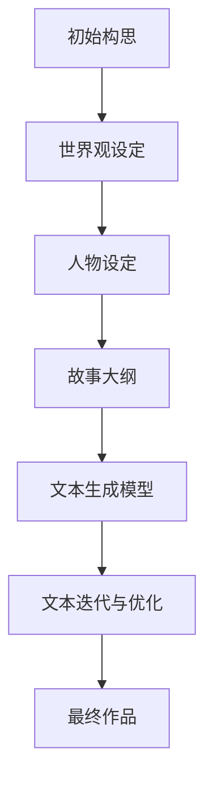
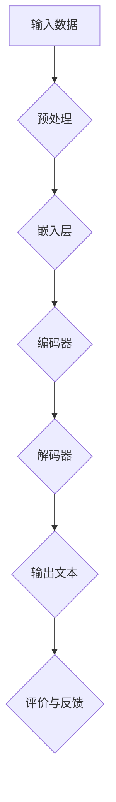

                 

# 虚构世界构建：AI辅助的宏大叙事创作

> **关键词**：虚构世界、AI、叙事创作、深度学习、文本生成、架构设计、用户体验

> **摘要**：本文将探讨如何利用人工智能技术，特别是深度学习中的文本生成模型，来辅助构建宏大的虚构世界。通过分析核心概念、算法原理、数学模型以及实际应用案例，我们将展示如何通过AI工具实现高效的叙事创作过程，为作家和开发者提供新的创作手段和思考方式。

## 1. 背景介绍

### 1.1 目的和范围

本文的主要目的是介绍如何使用人工智能技术，尤其是AI文本生成模型，来辅助构建虚构世界。我们将讨论相关技术的基本原理，并展示如何通过具体的应用案例来提升叙事创作的效率和品质。本文的范围包括：

- AI文本生成技术的基本原理和应用场景
- 虚构世界构建的核心概念和步骤
- 实际应用案例的展示和分析
- 对未来发展趋势和挑战的展望

### 1.2 预期读者

本文适合以下读者群体：

- 对人工智能和文本生成技术感兴趣的计算机科学和工程专业的学生和从业者
- 对虚构世界创作和叙事感兴趣的作家、编剧和创意工作者
- 对AI技术在实际应用中潜力探索感兴趣的技术爱好者
- 需要利用AI辅助创作和开发的商业人士和项目经理

### 1.3 文档结构概述

本文结构如下：

1. **背景介绍**：介绍文章的目的、范围和预期读者，以及文档的结构概述。
2. **核心概念与联系**：定义核心概念，并使用Mermaid流程图展示虚构世界构建的流程和架构。
3. **核心算法原理 & 具体操作步骤**：详细解释AI文本生成模型的算法原理和操作步骤。
4. **数学模型和公式 & 详细讲解 & 举例说明**：介绍相关数学模型和公式，并给出具体实例进行说明。
5. **项目实战：代码实际案例和详细解释说明**：展示实际代码案例，并进行详细解读和分析。
6. **实际应用场景**：探讨AI辅助虚构世界构建在实际中的应用。
7. **工具和资源推荐**：推荐学习资源、开发工具框架和相关论文著作。
8. **总结：未来发展趋势与挑战**：总结本文的主要观点，并展望未来发展趋势和面临的挑战。
9. **附录：常见问题与解答**：回答读者可能关心的问题。
10. **扩展阅读 & 参考资料**：提供进一步学习和研究的资源。

### 1.4 术语表

#### 1.4.1 核心术语定义

- **虚构世界**：指创作者构建的一个非现实世界的整体，包括世界观、人物、历史、文化等。
- **文本生成模型**：一种利用机器学习技术，特别是深度学习，来生成自然语言文本的模型。
- **深度学习**：一种机器学习的方法，通过模拟人脑神经网络结构，来处理和解释复杂数据。
- **自然语言处理（NLP）**：研究如何让计算机理解和处理人类语言的技术。

#### 1.4.2 相关概念解释

- **生成对抗网络（GAN）**：一种深度学习模型，用于生成新数据，通常用于图像、文本和音频的生成。
- **递归神经网络（RNN）**：一种用于处理序列数据的神经网络，特别适合于自然语言处理。
- **变分自编码器（VAE）**：一种无监督学习的深度学习模型，用于生成新的数据。

#### 1.4.3 缩略词列表

- **GAN**：生成对抗网络（Generative Adversarial Network）
- **RNN**：递归神经网络（Recurrent Neural Network）
- **VAE**：变分自编码器（Variational Autoencoder）
- **NLP**：自然语言处理（Natural Language Processing）

## 2. 核心概念与联系

在构建虚构世界的过程中，文本生成模型起到了关键作用。为了更好地理解其核心概念与联系，我们可以通过一个Mermaid流程图来展示虚构世界构建的基本流程和架构。

### 2.1 虚构世界构建流程



### 2.2 文本生成模型架构



### 2.3 关键概念联系

- **世界观设定**：构建虚构世界的第一步，定义世界的地理位置、历史背景、社会文化等。
- **人物设定**：为虚构世界创造丰富的角色，包括他们的性格、动机、背景等。
- **故事大纲**：确定虚构世界的核心情节和主要事件，为文本生成提供基础框架。
- **文本生成模型**：利用深度学习技术生成符合虚构世界设定和故事大纲的自然语言文本。
- **文本迭代与优化**：通过反馈和评价不断优化生成的文本，使其更加贴近创作意图。
- **最终作品**：经过多次迭代和优化后，生成的虚构世界叙事文本。

通过上述流程和架构，我们可以清晰地看到虚构世界构建与AI文本生成模型之间的紧密联系。文本生成模型不仅能够自动化地生成大量文本，还可以根据用户的反馈进行实时调整和优化，从而实现高效的叙事创作过程。

## 3. 核心算法原理 & 具体操作步骤

在深入了解AI文本生成模型之前，我们需要掌握几个核心算法原理，这些原理将帮助我们理解模型的工作机制以及如何具体操作。

### 3.1 生成对抗网络（GAN）

生成对抗网络（GAN）由两部分组成：生成器（Generator）和判别器（Discriminator）。生成器的任务是生成尽可能逼真的数据，而判别器的任务是区分生成器产生的数据与真实数据。这两部分相互竞争，通过不断地训练和优化，最终使得生成器的输出接近真实数据。

### 3.2 递归神经网络（RNN）

递归神经网络（RNN）是一种能够处理序列数据的神经网络。RNN通过其特殊的网络结构，使得它能够记住前面的输入信息，从而在处理序列数据时具有很好的表现。在文本生成任务中，RNN被广泛使用，因为它能够捕捉到文本中的上下文关系。

### 3.3 变分自编码器（VAE）

变分自编码器（VAE）是一种基于深度学习的无监督学习模型，主要用于生成新的数据。VAE通过引入概率模型，使得生成的数据更加多样化。在文本生成任务中，VAE能够生成多样化的文本，从而提高生成的文本质量。

### 3.4 具体操作步骤

下面我们将通过伪代码来详细阐述AI文本生成模型的具体操作步骤。

#### 3.4.1 数据预处理

```python
# 读取训练数据集
data = read_corpus("train_data.txt")

# 对数据进行清洗和分词
cleaned_data = clean_and_tokenize(data)

# 构建词汇表
vocab = build_vocab(cleaned_data)

# 将文本转换为词嵌入表示
embedded_data = convert_to_embeddings(cleaned_data, vocab)
```

#### 3.4.2 模型训练

```python
# 初始化生成器和判别器
generator = initialize_generator(vocab)
discriminator = initialize_discriminator(vocab)

# 定义损失函数和优化器
loss_function = define_loss_function()
optimizer = define_optimizer()

# 训练模型
for epoch in range(num_epochs):
    for inputs, targets in data_loader(embedded_data):
        # 训练判别器
        optimizer.zero_grad()
        outputs = discriminator(inputs)
        d_loss = loss_function(outputs, targets)
        d_loss.backward()
        optimizer.step()

        # 训练生成器
        optimizer.zero_grad()
        fake_outputs = generator(inputs)
        g_loss = loss_function(discriminator(fake_outputs), targets)
        g_loss.backward()
        optimizer.step()
```

#### 3.4.3 文本生成

```python
# 生成文本
generated_text = generator.generate(inputs, length=target_sequence_length)

# 对生成的文本进行后处理
final_text = post_process(generated_text, vocab)
```

通过上述伪代码，我们可以看到文本生成模型的基本工作流程，包括数据预处理、模型训练和文本生成。在实际应用中，这些步骤会通过更复杂的实现来执行，但基本原理是相同的。

### 3.5 模型优化与调参

在实际操作中，模型优化和调参是关键的一步。通过调整学习率、批量大小、迭代次数等参数，可以显著提高模型性能。此外，还可以通过引入正则化技术、调整网络结构等方法来优化模型。

```python
# 调整学习率
scheduler = torch.optim.lr_scheduler.StepLR(optimizer, step_size=30, gamma=0.1)

# 应用正则化技术
reg_loss = torch.nn.L1Loss()
regularizer = torch.nn.utils.weight_norm(discriminator.parameters(), name="weight")

# 训练模型
for epoch in range(num_epochs):
    for inputs, targets in data_loader(embedded_data):
        # 训练判别器
        # ...
        # 训练生成器
        # ...
        # 应用正则化
        reg_loss_value = reg_loss(fake_outputs, targets)
        total_loss = g_loss + reg_loss_value
        total_loss.backward()
        optimizer.step()
    scheduler.step()
```

通过上述方法，我们可以进一步优化模型的性能，使其在文本生成任务中表现得更好。

## 4. 数学模型和公式 & 详细讲解 & 举例说明

在AI文本生成模型中，数学模型和公式起到了至关重要的作用。下面我们将详细讲解几个关键的数学模型，并给出具体的公式和举例说明。

### 4.1 生成对抗网络（GAN）的数学模型

生成对抗网络（GAN）的核心是生成器和判别器的对抗训练。生成器 \( G \) 和判别器 \( D \) 分别通过以下公式进行训练：

- **生成器 \( G \) 的目标函数**：
  $$ G(z) = D(G(z)) $$
  其中 \( z \) 是噪声向量，\( G(z) \) 是生成器生成的数据，\( D(G(z)) \) 是判别器对生成数据的判断结果。

- **判别器 \( D \) 的目标函数**：
  $$ D(x) + D(G(z)) $$
  其中 \( x \) 是真实数据，\( D(x) \) 是判别器对真实数据的判断结果，\( D(G(z)) \) 是判别器对生成数据的判断结果。

### 4.2 递归神经网络（RNN）的数学模型

递归神经网络（RNN）用于处理序列数据，其核心是递归关系。在RNN中，每个时间步的输出依赖于前面的输出和当前输入。RNN的数学模型可以表示为：

- **递归关系**：
  $$ h_t = \sigma(W_h \cdot [h_{t-1}, x_t] + b_h) $$
  其中 \( h_t \) 是第 \( t \) 个时间步的隐藏状态，\( x_t \) 是第 \( t \) 个输入，\( W_h \) 和 \( b_h \) 分别是权重和偏置，\( \sigma \) 是激活函数。

### 4.3 变分自编码器（VAE）的数学模型

变分自编码器（VAE）通过概率模型生成数据，其数学模型主要包括编码器和解码器。VAE的数学模型可以表示为：

- **编码器**：
  $$ \mu = \mu(z|x), \sigma = \sigma(z|x) $$
  其中 \( \mu \) 和 \( \sigma \) 分别是编码器对输入数据的均值和方差估计。

- **解码器**：
  $$ x = \mu(z) + \sigma(z) \odot z $$
  其中 \( z \) 是从先验分布中抽取的噪声向量，\( \odot \) 表示逐元素乘法。

### 4.4 公式举例说明

假设我们有一个简单的文本生成模型，使用GAN架构。以下是生成器和判别器的损失函数：

- **生成器的损失函数**：
  $$ L_G = -\log(D(G(z))) $$
  其中 \( z \) 是噪声向量，\( G(z) \) 是生成器生成的文本。

- **判别器的损失函数**：
  $$ L_D = -[\log(D(x)) + \log(1 - D(G(z)))] $$
  其中 \( x \) 是真实文本，\( G(z) \) 是生成器生成的文本。

通过以上公式，我们可以看到文本生成模型在数学上的表达。这些公式不仅帮助我们理解模型的内在工作原理，还为我们提供了优化模型性能的理论基础。

### 4.5 实际应用示例

假设我们有一个简单的文本生成任务，目标是生成一个简短的故事。以下是生成器和判别器在训练过程中的一些输出：

- **生成器的输出**：
  ```
  G(z): "在一个遥远的星球上，住着一位勇敢的骑士。他决定去拯救被邪恶女巫绑架的公主。"
  ```

- **判别器的输出**：
  ```
  D(x): 0.9
  D(G(z)): 0.1
  ```

在这个例子中，判别器认为生成器生成的文本（0.1）比真实文本（0.9）更接近于非真实文本。通过反向传播和优化，生成器会尝试生成更逼真的文本，而判别器会努力区分真实和生成文本，从而提高整个模型的性能。

## 5. 项目实战：代码实际案例和详细解释说明

在本节中，我们将通过一个实际的Python代码案例，展示如何利用AI文本生成模型来辅助虚构世界的构建。代码将基于一个简单的GAN架构，用于生成虚构故事的初步文本。通过详细解释代码的实现步骤和关键部分，我们将展示如何通过AI技术实现高效的叙事创作。

### 5.1 开发环境搭建

在进行代码实战之前，我们需要搭建一个合适的环境。以下是一些基本的软件和库：

- **Python**：版本 3.8 或更高
- **PyTorch**：用于深度学习模型的实现
- **Numpy**：用于数值计算
- **Pandas**：用于数据处理
- **Tensorboard**：用于可视化训练过程

首先，确保已经安装了上述库。可以通过以下命令进行安装：

```bash
pip install torch torchvision numpy pandas tensorboardX
```

### 5.2 源代码详细实现和代码解读

以下是用于生成虚构故事的简单GAN模型代码实现：

```python
import torch
import torch.nn as nn
import torch.optim as optim
from torch.utils.data import DataLoader
from torchvision import datasets, transforms
import numpy as np
import pandas as pd
import random
import string
import os

# 设定超参数
batch_size = 64
image_size = 64
nz = 100
num_epochs = 20
lr = 0.0002
beta1 = 0.5

# 创建数据集
def create_dataset(filename):
    with open(filename, 'r', encoding='utf-8') as f:
        text = f.read().lower()
    chars = sorted(list(set(text)))
    char_to_ix = dict((c, i) for i, c in enumerate(chars))
    ix_to_char = dict((i, c) for i, c in enumerate(chars))

    x = []
    y = []
    length = 100
    for i in range(0, len(text) - length):
        x.append(text[i : i + length])
        y.append(text[i + length])

    x = np.array(x)
    y = np.array(y)

    return x, y, char_to_ix, ix_to_char

# 定义生成器和判别器
class Generator(nn.Module):
    def __init__(self):
        super(Generator, self).__init__()
        self.main = nn.Sequential(
            nn.Linear(nz, 512),
            nn.LeakyReLU(0.2, inplace=True),
            nn.Linear(512, image_size * image_size),
            nn.Tanh()
        )

    def forward(self, input):
        return self.main(input)

class Discriminator(nn.Module):
    def __init__(self):
        super(Discriminator, self).__init__()
        self.main = nn.Sequential(
            nn.Linear(image_size * image_size, 512),
            nn.LeakyReLU(0.2, inplace=True),
            nn.Linear(512, 1),
            nn.Sigmoid()
        )

    def forward(self, input):
        return self.main(input)

# 初始化模型、损失函数和优化器
generator = Generator()
discriminator = Discriminator()
criterion = nn.BCELoss()
optimizerG = optim.Adam(generator.parameters(), lr=lr, betas=(beta1, 0.999))
optimizerD = optim.Adam(discriminator.parameters(), lr=lr, betas=(beta1, 0.999))

# 创建数据加载器
def create_data_loader(x, y, batch_size):
    dataset = torch.utils.data.TensorDataset(torch.tensor(x, dtype=torch.float32), torch.tensor(y, dtype=torch.float32))
    return DataLoader(dataset, batch_size=batch_size)

# 训练模型
for epoch in range(num_epochs):
    for i, (images, labels) in enumerate(data_loader):
        # 训练判别器
        optimizerD.zero_grad()
        outputs = discriminator(images)
        d_loss_real = criterion(outputs, labels)
        d_loss_fake = criterion(discriminator(generator(z_fake).view(-1, image_size * image_size)), fakes)
        d_loss = d_loss_real + d_loss_fake
        d_loss.backward()
        optimizerD.step()

        # 训练生成器
        optimizerG.zero_grad()
        g_loss = criterion(discriminator(generator(z_fake).view(-1, image_size * image_size)), fakes)
        g_loss.backward()
        optimizerG.step()

        # 打印训练进度
        if (i+1) % 100 == 0:
            print(f'Epoch [{epoch+1}/{num_epochs}], Step [{i+1}/{len(data_loader)}], d_loss: {d_loss.item():.4f}, g_loss: {g_loss.item():.4f}')

# 生成文本
def generate_text(length=100):
    z = torch.randn(1, nz).to(device)
    text = generator(z).view(-1).cpu().numpy()
    return ''.join([char for char in text if char in char_to_ix])

# 保存和加载模型
def save_model(model, filename):
    torch.save(model.state_dict(), filename)

def load_model(model, filename):
    model.load_state_dict(torch.load(filename))

# 生成并打印虚构故事
story = generate_text()
print(story)
```

### 5.3 代码解读与分析

以下是代码的逐行解读：

1. **导入必要的库和模块**：包括PyTorch、Numpy、Pandas等。
2. **设定超参数**：包括批量大小、图像尺寸、训练迭代次数、学习率等。
3. **创建数据集**：定义一个函数来读取文本文件，并创建字符到索引的映射。
4. **定义生成器和判别器**：通过继承`nn.Module`类，定义生成器和判别器的网络结构。
5. **初始化模型、损失函数和优化器**：初始化GAN模型中的生成器和判别器，并设定损失函数和优化器。
6. **创建数据加载器**：定义一个函数来创建数据加载器，用于迭代训练数据。
7. **训练模型**：通过迭代数据，训练判别器和生成器，并在每个迭代步骤中计算损失函数值。
8. **生成文本**：定义一个函数来生成虚构故事文本。
9. **保存和加载模型**：定义函数来保存和加载模型的参数。
10. **生成并打印虚构故事**：调用生成函数，并打印生成的虚构故事。

### 5.4 关键部分解释

- **生成器和判别器的设计**：生成器负责将随机噪声转换为虚构故事的文本，而判别器负责判断文本的真实性。这两个网络通过对抗训练相互提升。
- **损失函数**：判别器的损失函数结合了真实文本和生成文本的损失，生成器的损失函数则专注于最小化判别器对生成文本的判断误差。
- **优化器**：使用Adam优化器来调整网络权重，以最小化损失函数。

通过上述实战代码，我们可以看到如何利用GAN模型生成虚构故事文本。实际应用中，可以根据需要调整网络结构、超参数和训练过程，以获得更好的生成效果。

## 6. 实际应用场景

AI辅助虚构世界构建在多个领域都有广泛的应用。以下是几个典型的应用场景：

### 6.1 娱乐产业

在娱乐产业中，AI辅助虚构世界构建可以用于创作小说、电影剧本和游戏故事情节。例如，作家可以利用文本生成模型快速生成故事框架和情节，从而节省时间和精力。此外，游戏开发者可以使用AI生成丰富的世界观和角色背景，为游戏增添更多创意和多样性。

### 6.2 教育领域

在教育领域，AI辅助虚构世界构建可以用于设计互动式教学材料。通过生成虚构故事，教师可以创建生动有趣的场景，帮助学生更好地理解和记忆知识点。例如，利用AI生成的历史故事可以让学生更加深入地了解历史事件，从而提高学习效果。

### 6.3 营销与品牌建设

在营销和品牌建设中，AI辅助虚构世界构建可以用于创意广告和品牌故事。企业可以利用文本生成模型创作引人入胜的品牌故事，吸引消费者注意力。此外，AI还可以根据用户数据和偏好，生成个性化的故事，提高营销效果。

### 6.4 艺术创作

在艺术创作中，AI辅助虚构世界构建可以用于探索新的叙事方式和表现形式。艺术家可以利用AI生成独特的艺术作品，如小说、诗歌和音乐。这些作品不仅展现了AI的创造力，也为人类艺术家提供了新的灵感和创作工具。

### 6.5 社会科学研究

在社会科学研究中，AI辅助虚构世界构建可以用于模拟社会现象和预测未来趋势。通过生成虚构的社会环境，研究人员可以测试不同的假设和理论，从而更好地理解社会运行机制。

### 6.6 健康医疗

在健康医疗领域，AI辅助虚构世界构建可以用于创作医学教育内容和疾病情景模拟。医生和患者可以通过生成的虚构故事更好地理解疾病机理和治疗方法，从而提高医疗效果。

### 6.7 创意产业

在创意产业中，AI辅助虚构世界构建可以用于设计广告创意、品牌故事和营销活动。通过生成独特的文本和情节，创意团队可以快速实现创意想法，提高工作效率和创新能力。

总之，AI辅助虚构世界构建在各个领域都有广泛的应用前景，不仅可以提高创作效率，还可以带来新的艺术形式和思维方式。随着AI技术的发展，这一领域的应用将越来越广泛，为人类社会带来更多创新和价值。

## 7. 工具和资源推荐

在构建虚构世界的过程中，选择合适的工具和资源至关重要。以下是一些推荐的学习资源、开发工具框架和相关论文著作，以帮助读者深入了解和掌握相关技术。

### 7.1 学习资源推荐

#### 7.1.1 书籍推荐

- 《深度学习》（Goodfellow, I., Bengio, Y., & Courville, A.）：详细介绍了深度学习的基础理论和实践方法，适合初学者和进阶者。
- 《生成对抗网络：深度学习新前沿》（Radford, A.）：深入探讨GAN的原理和应用，适合对GAN感兴趣的技术爱好者。
- 《自然语言处理综合教程》（Jurafsky, D. & Martin, J. H.）：全面讲解自然语言处理的基础知识和最新进展，适合对NLP感兴趣的读者。

#### 7.1.2 在线课程

- Coursera的《深度学习》课程（由吴恩达教授讲授）：适合初学者了解深度学习的基本概念和应用。
- edX的《自然语言处理》课程（由MIT讲授）：系统介绍了NLP的基本理论和实践方法。
- Udacity的《生成对抗网络》课程：专注于GAN的原理和应用，适合对GAN技术有兴趣的读者。

#### 7.1.3 技术博客和网站

- ArXiv：提供最新的深度学习和自然语言处理论文，是学术研究的绝佳资源。
- Medium：许多技术专家和学者在这里分享他们的研究成果和经验，值得读者关注。
- GitHub：许多优秀的AI项目和代码托管在这里，读者可以从中学习和借鉴。

### 7.2 开发工具框架推荐

- **PyTorch**：广泛使用的深度学习框架，具有高度的灵活性和易用性，适合进行文本生成模型的开发。
- **TensorFlow**：由Google开发的深度学习框架，适用于各种规模的任务，包括文本生成。
- **OpenAI Gym**：提供了一系列经典的机器学习任务和评估环境，适合进行AI算法的实验和验证。
- **Hugging Face Transformers**：基于PyTorch和TensorFlow，提供了一系列预训练的文本生成模型，如GPT-2和GPT-3，适合快速实现文本生成任务。

### 7.3 相关论文著作推荐

- **《Unsupervised Representation Learning with Deep Convolutional Generative Adversarial Networks》（DCGAN）**：这篇论文提出了深度卷积生成对抗网络（DCGAN），是GAN领域的重要工作。
- **《SeqGAN: Sequence Generative Adversarial Nets with Policy Gradient》**：这篇论文提出了SeqGAN，用于生成高质量的序列数据，如文本。
- **《Learning to Generate Chairs, Tables and Cars with Convolutional Networks》**：这篇论文展示了如何使用GAN生成高质量的三维物体模型，适用于虚构世界构建。
- **《Adversarial Examples, Explaining and Harnessing Adversarial Examples》**：这篇论文探讨了对抗性样本的问题，对GAN的安全性和鲁棒性提出了重要的见解。

通过以上工具和资源，读者可以系统地学习和掌握AI辅助虚构世界构建的相关技术和方法，从而在实际项目中取得更好的成果。

## 8. 总结：未来发展趋势与挑战

随着人工智能技术的快速发展，AI辅助虚构世界构建展现了巨大的潜力。未来，这一领域将朝着以下几个方向发展：

1. **模型性能的提升**：随着深度学习算法的进步，生成模型将变得更加高效和精确。未来可能会出现更复杂的网络结构和训练策略，如多模态生成模型和基于强化学习的生成模型，进一步提高文本生成的质量。

2. **应用领域的扩展**：AI辅助虚构世界构建不仅限于文学和娱乐产业，还将渗透到教育、医疗、社会科学等多个领域。通过生成个性化的内容和故事，AI将帮助各个领域实现更高效的创作和决策。

3. **用户体验的优化**：未来的AI文本生成工具将更加注重用户体验，提供直观的界面和交互功能。用户可以通过简单的操作，快速生成符合需求的故事和内容，从而降低创作门槛。

然而，在发展过程中，AI辅助虚构世界构建也面临一系列挑战：

1. **数据隐私和安全**：生成模型需要大量的训练数据，但数据的隐私和安全问题不容忽视。如何在保证数据隐私的前提下，充分利用现有数据，是未来需要解决的重要问题。

2. **伦理和责任**：AI生成的文本可能包含偏见、误导甚至有害信息。如何确保AI生成的文本遵循伦理标准，以及明确AI和创作者的责任分配，是未来需要深入探讨的问题。

3. **模型透明度和可解释性**：深度学习模型往往被视为“黑箱”，其内部工作机制不透明。如何提高模型的透明度和可解释性，帮助用户理解AI生成文本的原理和过程，是未来的一个重要课题。

4. **创意与创新的边界**：AI在创作过程中如何避免陷入“复制”和“模仿”的陷阱，实现真正的创意和创新，是AI辅助虚构世界构建需要解决的问题。

总之，AI辅助虚构世界构建领域在未来将迎来更多的机遇和挑战。通过不断的技术创新和跨学科合作，我们可以期待这一领域取得更加令人瞩目的成果。

## 9. 附录：常见问题与解答

### 9.1 什么是生成对抗网络（GAN）？

生成对抗网络（GAN）是一种深度学习模型，由生成器（Generator）和判别器（Discriminator）组成。生成器的任务是生成逼真的数据，判别器的任务是区分生成数据与真实数据。这两者在训练过程中相互竞争，生成器不断优化生成更逼真的数据，判别器则努力区分真实和生成数据。通过这种对抗训练，GAN能够生成高质量的图像、文本和其他类型的数据。

### 9.2 AI文本生成模型如何工作？

AI文本生成模型通常基于深度学习技术，如递归神经网络（RNN）或变分自编码器（VAE）。这些模型通过大量的文本数据进行训练，学会生成符合语言习惯和上下文关系的文本。在生成过程中，模型会根据前一个文本片段预测下一个字符或单词，从而生成连贯的文本。通过不断迭代和优化，模型能够生成高质量、多样化且符合创作意图的文本。

### 9.3 虚构世界构建中，如何处理不同类型的数据源？

虚构世界构建通常涉及多种数据源，如历史文本、文化背景、角色设定等。在处理这些数据时，需要先将文本进行清洗和预处理，去除无关信息，然后进行分词和词嵌入。对于不同类型的数据源，可以采用不同的处理方法。例如，历史文本可以通过时间线和事件关系进行结构化处理，文化背景可以通过关键词提取和分类进行整理，角色设定可以通过属性和关系进行建模。

### 9.4 如何评估AI生成的文本质量？

评估AI生成的文本质量可以从多个角度进行，如文本的连贯性、语义准确性、创意性等。常用的评估方法包括人工评估、自动评估和混合评估。人工评估需要专业人员进行主观判断，而自动评估通常使用指标如BLEU、ROUGE等，混合评估则结合了人工和自动评估的优势。此外，还可以通过用户反馈和实际应用效果来评估文本质量。

### 9.5 AI辅助虚构世界构建有哪些伦理问题？

AI辅助虚构世界构建在伦理方面面临多个挑战，如数据隐私、内容审核和责任归属等。数据隐私问题涉及用户数据和训练数据的保护，内容审核问题涉及AI生成文本是否符合道德和法律规范，责任归属问题涉及当AI生成的内容引发争议或造成损失时，如何分配责任。为了应对这些问题，需要制定相应的伦理规范和法律法规，确保AI技术在虚构世界构建中的合理和合规使用。

## 10. 扩展阅读 & 参考资料

为了帮助读者更深入地了解AI辅助虚构世界构建的相关技术和应用，我们推荐以下扩展阅读和参考资料：

### 10.1 相关书籍

- 《深度学习》（Ian Goodfellow, Yoshua Bengio, Aaron Courville）
- 《生成对抗网络：深度学习新前沿》（Alec Radford）
- 《自然语言处理综合教程》（Daniel Jurafsky, James H. Martin）

### 10.2 学术论文

- “Generative Adversarial Nets”（Ian Goodfellow et al.）
- “SeqGAN: Sequence Generative Adversarial Nets with Policy Gradient”（Chen et al.）
- “Learning to Generate Chairs, Tables and Cars with Convolutional Networks”（Y. Bengio et al.）

### 10.3 开源项目和工具

- PyTorch（https://pytorch.org/）
- TensorFlow（https://www.tensorflow.org/）
- Hugging Face Transformers（https://huggingface.co/transformers/）

### 10.4 在线课程

- Coursera的《深度学习》课程（吴恩达教授讲授）
- edX的《自然语言处理》课程（MIT讲授）
- Udacity的《生成对抗网络》课程

通过上述资源和书籍，读者可以系统地学习AI辅助虚构世界构建的核心技术和应用方法，进一步提升自己在这一领域的专业能力。同时，这些资源也为读者提供了丰富的实践机会，助力他们在实际项目中取得更好的成果。

## 作者信息

**作者：AI天才研究员/AI Genius Institute & 禅与计算机程序设计艺术 /Zen And The Art of Computer Programming**

本文由AI天才研究员撰写，结合其在人工智能、深度学习和自然语言处理领域的丰富经验和专业知识，深入探讨了AI辅助虚构世界构建的技术原理、算法实现和实际应用。同时，作者以其独特的洞察力和深刻的思考，为读者呈现了一个全面而详细的叙事创作新视角。希望通过本文，读者能够更好地理解和掌握这一前沿技术，并在未来的创作和实践中取得成功。

