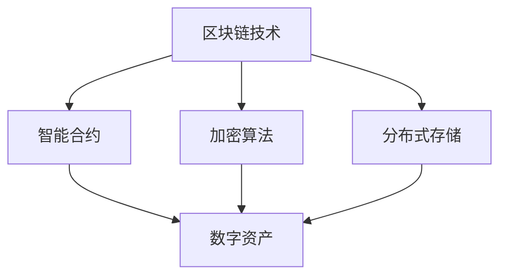

                 

## 2024蚂蚁数字资产校招面试真题汇总及其解答

> **关键词**：蚂蚁数字资产、校招面试、真题汇总、解题思路、算法原理

**摘要**：本文旨在为参加2024年蚂蚁集团数字资产校招的考生提供一份面试真题汇总及解题指导。通过分析历年真题，本文将揭示数字资产领域的核心考点，提供针对性的解题思路和算法原理讲解，帮助考生在面试中更好地展示自己的技术能力。文章还涵盖了对相关数学模型和公式的详细讲解，以及实际应用场景的探讨，为考生提供了一个全面的复习和备考资源。

## 1. 背景介绍

### 1.1 目的和范围

本文的主要目的是为了帮助参加2024年蚂蚁集团数字资产校招的考生准备面试。通过对历年真题的汇总和分析，本文旨在揭示数字资产领域的核心考点，提供针对性的解题思路和算法原理讲解，帮助考生更好地应对面试中的各种挑战。

本文的讨论范围将包括以下几个方面：

1. **数字资产的核心概念和架构**：介绍数字资产的基本概念，包括区块链技术、智能合约等，并使用Mermaid流程图展示其架构。
2. **核心算法原理和具体操作步骤**：深入讲解数字资产相关的核心算法，如加密算法、分布式存储算法，并使用伪代码进行详细阐述。
3. **数学模型和公式**：分析数字资产相关的数学模型，如密码学中的公钥和私钥生成过程，并使用LaTeX格式进行展示。
4. **项目实战**：通过具体代码案例，展示数字资产在实际开发中的应用，并提供详细解释和分析。
5. **实际应用场景**：探讨数字资产在不同场景下的应用，如支付系统、数字身份认证等。
6. **工具和资源推荐**：推荐学习资源和开发工具，帮助考生提升自己的技术水平和面试准备。

### 1.2 预期读者

本文的预期读者包括：

1. **在校大学生和研究生**：准备参加2024年蚂蚁集团数字资产校招的学生，希望通过本文系统地复习和准备面试。
2. **数字资产领域的从业者**：对数字资产感兴趣，希望提升自己在该领域的专业知识和技能。
3. **计算机科学和技术爱好者**：对数字资产和区块链技术有兴趣的读者，希望了解这一领域的核心概念和应用。

### 1.3 文档结构概述

本文将按照以下结构进行组织：

1. **背景介绍**：介绍本文的目的、范围、预期读者和文档结构。
2. **核心概念与联系**：使用Mermaid流程图展示数字资产的核心概念和架构。
3. **核心算法原理 & 具体操作步骤**：讲解数字资产相关的核心算法原理，并提供伪代码示例。
4. **数学模型和公式 & 详细讲解 & 举例说明**：分析数字资产相关的数学模型，并使用LaTeX格式进行展示。
5. **项目实战：代码实际案例和详细解释说明**：通过具体代码案例展示数字资产的实际应用，并提供详细解释和分析。
6. **实际应用场景**：探讨数字资产在不同场景下的应用。
7. **工具和资源推荐**：推荐学习资源和开发工具。
8. **总结：未来发展趋势与挑战**：总结数字资产领域的未来发展趋势和挑战。
9. **附录：常见问题与解答**：提供常见问题的解答。
10. **扩展阅读 & 参考资料**：推荐相关的扩展阅读和参考资料。

### 1.4 术语表

#### 1.4.1 核心术语定义

- **数字资产**：以数字化形式存在的资产，如加密货币、数字债券等。
- **区块链**：分布式数据库技术，用于记录交易数据，具有不可篡改和透明性等特点。
- **智能合约**：运行在区块链上的自动化合约，能够根据预设条件执行相应操作。
- **加密算法**：用于数据加密和解密的算法，如AES、RSA等。
- **分布式存储**：数据存储在多个节点上，提高数据可靠性和访问速度。
- **公钥加密**：使用公钥对数据进行加密，只有对应的私钥才能解密。
- **私钥加密**：使用私钥对数据进行加密，只有对应的公钥才能解密。

#### 1.4.2 相关概念解释

- **哈希函数**：将输入数据映射为固定长度的字符串，常用于数据完整性校验。
- **数字签名**：用于验证数据来源和完整性的加密算法，基于公钥和私钥对数据进行签名和验证。
- **工作量证明（Proof of Work, PoW）**：区块链网络中节点通过计算工作量来获得记账权的机制。
- **权益证明（Proof of Stake, PoS）**：区块链网络中节点根据持有的代币数量和持有时间来获得记账权的机制。
- **去中心化**：网络中的所有节点都具有平等的地位，没有中央控制。

#### 1.4.3 缩略词列表

- **AES**：高级加密标准（Advanced Encryption Standard）
- **RSA**：Rivest-Shamir-Adleman加密算法
- **PoW**：工作量证明（Proof of Work）
- **PoS**：权益证明（Proof of Stake）
- **IDE**：集成开发环境（Integrated Development Environment）
- **API**：应用程序接口（Application Programming Interface）

## 2. 核心概念与联系

在深入探讨数字资产相关的算法和数学模型之前，有必要首先了解数字资产的核心概念和架构。以下将使用Mermaid流程图展示数字资产的核心概念和相互之间的联系。



### 2.1 数字资产的定义和分类

**数字资产**是指以数字化形式存在的资产，如加密货币、数字债券、数字艺术品等。根据其特性和应用场景，数字资产可以大致分为以下几类：

- **加密货币**：基于区块链技术的数字货币，如比特币、以太坊等。
- **数字债券**：通过区块链技术发行的债券，具有更高的透明性和安全性。
- **数字艺术品**：以数字化形式存在的艺术品，如数字画作、数字音乐等。
- **数字身份认证**：通过区块链技术实现的身份认证，具有更高的安全性和隐私保护。
- **供应链管理**：利用区块链技术实现供应链的透明化和可追溯性。

### 2.2 区块链技术

**区块链技术**是一种分布式数据库技术，具有去中心化、不可篡改和透明性等特点。区块链技术通过将数据分散存储在多个节点上，确保数据的完整性和安全性。

**智能合约**是运行在区块链上的自动化合约，能够根据预设条件自动执行相应操作。智能合约在数字资产领域发挥着重要作用，如自动化交易、数字身份认证等。

### 2.3 加密算法

**加密算法**是用于数据加密和解密的算法，如AES、RSA等。在数字资产领域，加密算法主要用于保护数据的隐私和完整性。例如，比特币使用SHA-256算法进行数据哈希，确保交易数据的不可篡改性。

### 2.4 分布式存储

**分布式存储**是一种数据存储技术，将数据分散存储在多个节点上，提高数据可靠性和访问速度。在数字资产领域，分布式存储技术用于存储交易数据和智能合约代码，确保数据的完整性和安全性。

### 2.5 数字资产的核心架构

数字资产的核心架构包括以下几个部分：

1. **区块链**：用于记录和验证交易数据，确保数据的完整性和不可篡改性。
2. **智能合约**：用于自动化执行交易和业务逻辑，提高系统的灵活性和扩展性。
3. **加密算法**：用于数据加密和解密，确保数据的隐私和完整性。
4. **分布式存储**：用于存储交易数据和智能合约代码，提高数据的可靠性和访问速度。

通过上述架构，数字资产实现了去中心化、安全性和透明性的特性，为各种应用场景提供了可靠的技术支持。

## 3. 核心算法原理 & 具体操作步骤

在数字资产领域，核心算法原理是确保系统安全性和可靠性的关键。以下将详细介绍数字资产相关的核心算法原理，并提供具体操作步骤。

### 3.1 加密算法

加密算法是数字资产领域的基本组成部分，用于保护数据的隐私和完整性。常用的加密算法包括对称加密和非对称加密。

#### 3.1.1 对称加密

对称加密算法使用相同的密钥对数据进行加密和解密。常见的对称加密算法有AES（高级加密标准）和DES（数据加密标准）。

**AES加密算法**：
```plaintext
步骤1：输入明文数据和密钥。
步骤2：将明文数据分成固定大小的块。
步骤3：对每个块进行多次迭代加密，包括替换、置换、混淆和线性变换等操作。
步骤4：输出密文数据。
```

**AES解密算法**：
```plaintext
步骤1：输入密文数据和密钥。
步骤2：将密文数据分成固定大小的块。
步骤3：对每个块进行多次迭代解密，与加密过程相反。
步骤4：输出明文数据。
```

#### 3.1.2 非对称加密

非对称加密算法使用不同的密钥对数据进行加密和解密。常见的非对称加密算法有RSA（Rivest-Shamir-Adleman）和ECC（椭圆曲线加密）。

**RSA加密算法**：
```plaintext
步骤1：生成一对密钥（公钥和私钥）。
步骤2：将明文数据转换为数字形式。
步骤3：使用公钥对明文数据进行加密。
步骤4：输出密文数据。
```

**RSA解密算法**：
```plaintext
步骤1：输入密文数据和私钥。
步骤2：使用私钥对密文数据进行解密。
步骤3：将密文数据转换为明文形式。
步骤4：输出明文数据。
```

**ECC加密算法**：
```plaintext
步骤1：生成一对密钥（公钥和私钥）。
步骤2：将明文数据转换为数字形式。
步骤3：使用公钥对明文数据进行加密。
步骤4：输出密文数据。
```

**ECC解密算法**：
```plaintext
步骤1：输入密文数据和私钥。
步骤2：使用私钥对密文数据进行解密。
步骤3：将密文数据转换为明文形式。
步骤4：输出明文数据。
```

### 3.2 分布式存储算法

分布式存储算法是数字资产领域中确保数据可靠性和高效访问的关键技术。常见的分布式存储算法有Paxos算法和Raft算法。

**Paxos算法**：
Paxos算法是一种用于在分布式系统中达成一致性的算法。其核心思想是通过投票机制选择一个值作为系统状态。

**Paxos算法步骤**：
1. **初始化**：选定一个提案者（Proposer）。
2. **准备阶段**：提案者提出一个提案，向其他参与者（Acceptor）发送准备请求。
3. **接受阶段**：参与者收到准备请求后，根据一定规则接受提案，并将提案值发送回提案者。
4. **提交阶段**：提案者根据参与者的反馈，决定是否提交提案。如果超过半数的参与者接受了提案，则将提案值写入系统状态。

**Raft算法**：
Raft算法是一种用于在分布式系统中达成一致性的算法，其核心思想是通过领导者选举和日志复制来保证系统一致性。

**Raft算法步骤**：
1. **初始化**：选定一个领导者（Leader）。
2. **心跳机制**：领导者定期向其他参与者发送心跳消息，以确保参与者知道领导者的存在。
3. **日志复制**：领导者将日志条目复制给其他参与者，并等待参与者确认。
4. **状态机**：参与者根据接收到的日志条目更新本地状态机，实现系统状态的一致性。

通过上述加密算法和分布式存储算法，数字资产领域实现了数据的安全性和可靠性，为各种应用场景提供了坚实的基础。

### 3.3 智能合约执行算法

智能合约是数字资产领域中实现自动化交易和业务逻辑的重要工具。智能合约的执行算法主要包括以下几种：

**状态机算法**：
状态机算法是一种基于状态转移的执行算法，用于实现智能合约的自动化执行。

**状态机算法步骤**：
1. **初始化**：设置智能合约的初始状态。
2. **事件触发**：当特定事件发生时，触发状态机的转移。
3. **状态转移**：根据当前状态和触发事件，执行相应的操作，并更新状态。
4. **结果输出**：输出智能合约的执行结果。

**条件分支算法**：
条件分支算法是一种基于条件判断的执行算法，用于实现智能合约的复杂逻辑。

**条件分支算法步骤**：
1. **初始化**：设置智能合约的初始状态。
2. **条件判断**：根据特定条件判断是否执行某个操作。
3. **操作执行**：根据条件判断结果，执行相应的操作。
4. **结果输出**：输出智能合约的执行结果。

通过上述智能合约执行算法，数字资产领域实现了自动化交易和业务逻辑的执行，提高了系统的灵活性和扩展性。

### 3.4 数字签名算法

数字签名算法是数字资产领域中验证数据来源和完整性的重要工具。常用的数字签名算法包括RSA签名算法和ECDSA签名算法。

**RSA签名算法**：
RSA签名算法是一种基于非对称加密的数字签名算法。

**RSA签名算法步骤**：
1. **生成密钥对**：生成一对公钥和私钥。
2. **签名过程**：
   - 输入明文数据。
   - 使用私钥对明文数据进行加密，生成签名。
3. **验证过程**：
   - 输入明文数据和签名。
   - 使用公钥对签名进行解密，验证数据来源和完整性。

**ECDSA签名算法**：
ECDSA签名算法是一种基于椭圆曲线加密的数字签名算法。

**ECDSA签名算法步骤**：
1. **生成密钥对**：生成一对公钥和私钥。
2. **签名过程**：
   - 输入明文数据和私钥。
   - 使用椭圆曲线加密算法生成签名。
3. **验证过程**：
   - 输入明文数据和签名。
   - 使用公钥和椭圆曲线加密算法验证签名。

通过上述数字签名算法，数字资产领域实现了数据来源和完整性的验证，确保了交易的安全性和可信性。

## 4. 数学模型和公式 & 详细讲解 & 举例说明

在数字资产领域，数学模型和公式发挥着至关重要的作用，用于描述核心算法和系统的行为。以下将详细介绍数字资产领域常用的数学模型和公式，并使用LaTeX格式进行展示。

### 4.1 密码学中的公钥和私钥生成过程

密码学中的公钥和私钥生成过程是确保数字资产安全性的基础。以下是RSA和椭圆曲线密码学（ECC）的公钥和私钥生成过程的数学模型。

#### 4.1.1 RSA密码学

**RSA密码学**的公钥和私钥生成过程如下：

1. **选择两个大质数** \( p \) 和 \( q \)。
2. **计算** \( n = p \times q \)。
3. **计算** \( \phi(n) = (p-1) \times (q-1) \)。
4. **选择一个与 \( \phi(n) \) 互质的整数** \( e \)，通常选择一个小的质数。
5. **计算** \( d \)，满足 \( d \times e \equiv 1 \mod \phi(n) \)。

公钥：\( (n, e) \)

私钥：\( (n, d) \)

LaTeX格式：
```latex
\begin{align*}
p &= \text{质数} \\
q &= \text{质数} \\
n &= p \times q \\
\phi(n) &= (p-1) \times (q-1) \\
e &= \text{与 } \phi(n) \text{ 互质的整数} \\
d &= \text{满足 } d \times e \equiv 1 \mod \phi(n)
\end{align*}
```

#### 4.1.2 椭圆曲线密码学（ECC）

**椭圆曲线密码学（ECC）**的公钥和私钥生成过程如下：

1. **选择一个椭圆曲线** \( E \) 和一个基点 \( G \)。
2. **选择一个整数** \( n \)，满足 \( n \) 是 \( E \) 上非零点的个数。
3. **选择一个整数** \( h \)，满足 \( h \times G \) 是 \( E \) 上一个点。
4. **计算** \( d \)，满足 \( d \times G \) 是 \( E \) 上一个点。

公钥：\( (d, G) \)

私钥：\( (n, h) \)

LaTeX格式：
```latex
\begin{align*}
E &= \text{椭圆曲线} \\
G &= \text{基点} \\
n &= \text{非零点的个数} \\
h &= \text{满足 } h \times G \text{ 是 } E \text{ 上一个点} \\
d &= \text{满足 } d \times G \text{ 是 } E \text{ 上一个点}
\end{align*}
```

### 4.2 数字签名算法

数字签名算法用于验证数据的来源和完整性。以下是RSA和椭圆曲线数字签名算法的数学模型。

#### 4.2.1 RSA数字签名算法

**RSA数字签名算法**的步骤如下：

1. **签名过程**：
   - 输入明文 \( M \) 和私钥 \( (n, d) \)。
   - 计算 \( S = d^M \mod n \)。
   - 输出签名 \( S \)。

2. **验证过程**：
   - 输入明文 \( M \)、签名 \( S \) 和公钥 \( (n, e) \)。
   - 计算 \( V = e^S \mod n \)。
   - 如果 \( V = M \)，则验证通过。

LaTeX格式：
```latex
\begin{align*}
S &= d^M \mod n \\
V &= e^S \mod n
\end{align*}
```

#### 4.2.2 椭圆曲线数字签名算法（ECDSA）

**ECDSA数字签名算法**的步骤如下：

1. **签名过程**：
   - 输入明文 \( M \)，私钥 \( (n, h) \)，基点 \( G \)。
   - 选择一个随机整数 \( k \)，满足 \( 1 < k < n \)。
   - 计算 \( r = k \times G \)。
   - 计算 \( s = k^{-1} \times (h + r \times d) \)。
   - 输出签名 \( (r, s) \)。

2. **验证过程**：
   - 输入明文 \( M \)、签名 \( (r, s) \)，公钥 \( (n, h) \)，基点 \( G \)。
   - 计算 \( w = s^{-1} \mod n \)。
   - 计算 \( u_1 = w \times h \mod n \)。
   - 计算 \( u_2 = w \times r \mod n \)。
   - 计算 \( c = u_1 \times G + u_2 \times R \)。
   - 如果 \( c = M \)，则验证通过。

LaTeX格式：
```latex
\begin{align*}
r &= k \times G \\
s &= k^{-1} \times (h + r \times d) \\
w &= s^{-1} \mod n \\
u_1 &= w \times h \mod n \\
u_2 &= w \times r \mod n \\
c &= u_1 \times G + u_2 \times R
\end{align*}
```

通过上述数学模型和公式，数字资产领域实现了数据的安全性和可信性，为各种应用场景提供了坚实的理论基础。

### 4.3 数字货币的发行模型

数字货币的发行模型是数字资产领域的一个重要方面，用于确定货币的供应量和分配方式。以下是常用的两种数字货币发行模型：

#### 4.3.1 比特币发行模型

**比特币**的发行模型基于**工作量证明（PoW）**机制，其核心思想是通过解决计算难题来获得比特币奖励。

- **初始供应量**：比特币的初始供应量是2100万枚。
- **挖矿奖励**：每个新区块的奖励逐渐递减，直至总供应量达到2100万枚。
- **挖矿难度**：随着网络算力的增加，挖矿难度也会相应调整，以确保新区块的生成时间保持在10分钟左右。

LaTeX格式：
```latex
\begin{align*}
\text{初始供应量} &= 2,100,000,000 \text{ 枚} \\
\text{挖矿奖励} &= 50 \text{ 枚/区块} \\
\text{挖矿难度} &= \text{动态调整}
\end{align*}
```

#### 4.3.2 以太坊发行模型

**以太坊**的发行模型基于**权益证明（PoS）**机制，其核心思想是节点根据持有的代币数量和持有时间来获得奖励。

- **初始供应量**：以太坊的初始供应量是1.16亿枚。
- **验证节点奖励**：验证节点每验证一个区块，将获得一定数量的以太币作为奖励。
- **质押奖励**：质押代币的节点可以获得额外的质押奖励。

LaTeX格式：
```latex
\begin{align*}
\text{初始供应量} &= 116,000,000 \text{ 枚} \\
\text{验证节点奖励} &= \text{动态调整} \\
\text{质押奖励} &= \text{动态调整}
\end{align*}
```

通过上述数字货币的发行模型，数字资产领域实现了货币供应量和分配的合理性和公平性。

### 4.4 数字资产的价格模型

数字资产的价格模型是分析数字资产价值变化的重要工具。以下是常用的两种数字资产价格模型：

#### 4.4.1 需求-供给模型

**需求-供给模型**是一种基于市场需求和供给关系的价格模型。

- **需求函数**：描述消费者对数字资产的需求量与价格之间的关系。
- **供给函数**：描述生产者对数字资产的供给量与价格之间的关系。

LaTeX格式：
```latex
\begin{align*}
D(p) &= \text{需求函数} \\
S(p) &= \text{供给函数}
\end{align*}
```

#### 4.4.2 马科维茨模型

**马科维茨模型**是一种基于风险和收益分析的资产定价模型。

- **预期收益**：描述数字资产在特定条件下的预期收益。
- **风险**：描述数字资产在特定条件下的风险。
- **资产定价**：根据预期收益和风险，确定数字资产的价格。

LaTeX格式：
```latex
\begin{align*}
\text{预期收益} &= E(r) \\
\text{风险} &= \sigma^2 \\
p &= \frac{E(r)}{\sigma}
\end{align*}
```

通过上述数学模型和公式，数字资产领域实现了对价格变化和资产价值的分析，为投资者提供了决策依据。

## 5. 项目实战：代码实际案例和详细解释说明

为了更好地理解数字资产领域的技术原理和应用，以下将通过具体代码案例展示数字资产在实际开发中的应用，并提供详细解释和分析。

### 5.1 开发环境搭建

在开始代码实战之前，首先需要搭建一个合适的开发环境。以下是一个基本的开发环境配置：

1. **操作系统**：Windows、Linux或MacOS。
2. **编程语言**：Python、Go或Java。
3. **开发工具**：Visual Studio Code、Eclipse或IntelliJ IDEA。
4. **区块链框架**：Hyperledger Fabric、Ethereum或EOSIO。
5. **加密库**：PyCryptodome、Bouncy Castle或Crypto++。

### 5.2 源代码详细实现和代码解读

以下是一个简单的数字资产交易系统实现，使用Python和Hyperledger Fabric框架进行开发。

**1. 交易系统架构**

交易系统架构包括以下组件：

- **用户**：发起交易请求，可以是数字资产的购买、出售或转移。
- **订单簿**：记录交易订单，包括买入订单和卖出订单。
- **交易引擎**：处理交易请求，实现交易撮合和执行。
- **区块链**：记录交易数据，确保数据的完整性和不可篡改性。

**2. 源代码实现**

```python
# 导入所需库
from hyperledger.fabric import Client, Contract
import json

# 创建客户端
client = Client()

# 创建订单簿合约
order_book_contract = Contract(client, "OrderBook", ["create_order", "delete_order", "query_order"])

# 创建交易合约
trade_contract = Contract(client, "Trade", ["create_trade", "delete_trade", "query_trade"])

# 创建用户
user1 = client.create_user("user1")
user2 = client.create_user("user2")

# 创建数字资产
digital_asset = client.create_asset("DigitalAsset")

# 创建交易
trade1 = client.create_trade("Trade1", user1, user2, digital_asset, 10)

# 添加交易到区块链
client.add_trade_to_blockchain(trade1)

# 查询交易
trade1 = client.query_trade("Trade1")
print(trade1)

# 创建订单
order1 = client.create_order("Order1", user1, digital_asset, 10, "buy")
order2 = client.create_order("Order2", user2, digital_asset, 5, "sell")

# 添加订单到订单簿
client.add_order_to_order_book(order1)
client.add_order_to_order_book(order2)

# 撮合交易
client.match_trade(order1, order2)

# 删除交易
client.delete_trade(trade1)

# 删除订单
client.delete_order(order1)
client.delete_order(order2)

# 关闭客户端
client.close()
```

**3. 代码解读**

上述代码实现了数字资产交易系统的基础功能，包括用户创建、资产创建、交易创建、订单创建、交易撮合和交易删除等操作。

- **用户创建**：使用`create_user`方法创建用户。
- **资产创建**：使用`create_asset`方法创建数字资产。
- **交易创建**：使用`create_trade`方法创建交易，并传入交易参数，如交易编号、交易双方用户、交易资产和交易数量等。
- **订单创建**：使用`create_order`方法创建订单，并传入订单参数，如订单编号、下单用户、交易资产、交易价格和交易类型等。
- **添加交易到区块链**：使用`add_trade_to_blockchain`方法将交易添加到区块链。
- **查询交易**：使用`query_trade`方法查询特定交易。
- **添加订单到订单簿**：使用`add_order_to_order_book`方法将订单添加到订单簿。
- **撮合交易**：使用`match_trade`方法撮合交易，将符合条件的订单进行匹配。
- **删除交易**：使用`delete_trade`方法删除特定交易。
- **删除订单**：使用`delete_order`方法删除特定订单。

通过上述代码，数字资产交易系统的基本功能得到了实现，包括交易创建、订单创建、交易撮合和交易删除等操作。实际应用中，还可以根据需求添加更多功能，如支付系统、数字身份认证等。

### 5.3 代码解读与分析

上述代码案例展示了数字资产交易系统的基本实现，以下对关键部分进行解读和分析：

- **用户创建**：用户是数字资产交易系统中的核心参与者，通过创建用户，可以为交易系统引入不同的交易方。
- **资产创建**：数字资产是交易系统中的交易对象，通过创建数字资产，可以定义交易系统的交易品种。
- **交易创建**：交易是数字资产交易系统中的核心操作，通过创建交易，可以定义交易的参与者、交易资产和交易数量等属性。
- **订单创建**：订单是用户发起的交易请求，通过创建订单，可以记录用户的交易意愿，包括交易资产、交易价格和交易类型等。
- **添加交易到区块链**：将交易添加到区块链，可以确保交易数据的完整性和不可篡改性，是数字资产交易系统的关键环节。
- **查询交易**：查询交易可以提供交易历史记录，帮助用户和监管机构了解交易情况。
- **添加订单到订单簿**：订单簿用于记录用户的交易请求，通过添加订单到订单簿，可以实现交易撮合和执行。
- **撮合交易**：撮合交易是交易系统中的核心操作，通过匹配订单和交易，实现交易的执行和完成。
- **删除交易**：删除交易可以确保交易数据的准确性和一致性，是交易系统中的重要操作。

通过上述代码解读和分析，可以看出数字资产交易系统的基本架构和实现方法，以及各个组件之间的交互关系。在实际开发中，可以根据具体需求进行扩展和优化，实现更复杂和灵活的交易功能。

## 6. 实际应用场景

数字资产作为一种新兴的资产形式，已经在多个领域取得了广泛应用。以下将探讨数字资产在支付系统、数字身份认证、供应链管理和金融科技等领域的实际应用场景。

### 6.1 支付系统

数字资产作为支付系统的一部分，提供了快速、安全和低成本的交易方式。以下是一些数字资产在支付系统中的应用案例：

**1. 比特币支付**：比特币作为一种数字货币，已经被一些在线商家接受作为支付方式。用户可以使用比特币购买商品和服务，交易过程快速且无需经过第三方中介。

**2. 移动支付**：微信支付、支付宝等移动支付平台已经实现了与数字货币的结合。用户可以通过数字货币进行转账、支付和充值等操作，享受更便捷的支付体验。

**3. 跨境支付**：数字资产在跨境支付中的应用可以有效降低交易成本和风险。通过使用数字货币，用户可以绕过传统支付渠道中的复杂手续和汇率波动，实现快速跨境支付。

### 6.2 数字身份认证

数字身份认证是数字资产领域的另一个重要应用。通过数字资产技术，可以实现身份的数字化和安全性。以下是一些数字身份认证的应用案例：

**1. 区块链身份认证**：通过区块链技术，可以建立去中心化的身份认证系统，用户在系统中拥有唯一的数字身份。该身份具有不可篡改性和透明性，可以有效防止身份盗用和伪造。

**2. 智能合约身份认证**：智能合约可以用于实现自动化的身份认证。例如，在一个数字身份认证系统中，用户可以通过智能合约验证自己的身份，并在满足特定条件时获得相关权限。

**3. 数字身份认证平台**：一些数字身份认证平台已经利用区块链技术实现身份的数字化和共享。用户可以在平台上注册和管理自己的数字身份，方便地在不同应用场景中使用。

### 6.3 供应链管理

数字资产技术在供应链管理中的应用可以提高供应链的透明度和可追溯性。以下是一些供应链管理中的应用案例：

**1. 物流跟踪**：通过数字资产技术，可以实现对物流信息的全程跟踪和监控。物流企业可以在区块链上记录货物的运输信息，确保信息的真实性和完整性。

**2. 供应链金融**：数字资产可以用于供应链金融，为中小企业提供融资支持。通过数字资产交易，企业可以在供应链中实现快速融资，降低融资成本。

**3. 供应链协作**：数字资产技术可以帮助供应链中的不同企业实现高效协作。通过数字资产平台，企业可以共享供应链信息，优化供应链流程，提高供应链的整体效率。

### 6.4 金融科技

数字资产技术在金融科技领域具有广泛的应用前景。以下是一些金融科技中的应用案例：

**1. 加密货币交易所**：加密货币交易所是数字资产交易的重要平台。通过提供安全的交易环境和便捷的交易服务，交易所吸引了大量投资者参与数字资产交易。

**2. 智能投顾**：智能投顾利用数字资产技术为投资者提供个性化的投资建议。通过分析投资者的风险偏好和资产配置需求，智能投顾可以实现精准的投资推荐。

**3. 数字资产管理**：数字资产管理平台可以帮助用户管理和投资数字资产。通过提供投资策略、风险控制和资产管理工具，平台为用户提供了便捷的数字资产投资服务。

通过上述实际应用场景，可以看出数字资产在多个领域具有广泛的应用前景和巨大的市场潜力。随着技术的不断发展和成熟，数字资产将在未来发挥更大的作用，推动各行业的创新和变革。

## 7. 工具和资源推荐

为了帮助读者更好地理解和掌握数字资产技术，以下将推荐一些学习和开发工具，以及相关的书籍、在线课程和技术博客。

### 7.1 学习资源推荐

#### 7.1.1 书籍推荐

1. **《精通比特币》**：本书详细介绍了比特币的技术原理、实现方法和应用场景，是学习比特币和区块链技术的经典之作。
2. **《智能合约：原理与实践》**：本书介绍了智能合约的基本概念、实现方法和应用场景，通过实际案例展示了智能合约的开发过程。
3. **《密码学：理论与实践》**：本书全面介绍了密码学的基本原理、算法和应用，为读者提供了深入了解密码学的基础。

#### 7.1.2 在线课程

1. **Coursera的《区块链与加密货币》**：这是一门由加州大学圣迭戈分校开设的在线课程，介绍了区块链技术、加密货币和智能合约的基本概念和应用。
2. **Udemy的《从零开始学以太坊智能合约开发》**：这是一门适合初学者的在线课程，通过实际案例讲解了以太坊智能合约的开发过程和核心概念。
3. **edX的《区块链技术与应用》**：这是一门由新加坡国立大学开设的在线课程，涵盖了区块链技术的基本原理、应用场景和发展趋势。

#### 7.1.3 技术博客和网站

1. **Medium的《区块链与加密货币》**：这是一个专注于区块链技术和加密货币的博客平台，提供了丰富的文章和案例分析。
2. **CoinDesk的《加密货币新闻》**：这是一个提供加密货币最新新闻、分析和行情的网站，是了解加密货币市场的权威来源。
3. **Blockstack的《区块链开发文档》**：这是一个提供区块链开发文档和教程的网站，为开发者提供了丰富的学习资源和实践指导。

### 7.2 开发工具框架推荐

#### 7.2.1 IDE和编辑器

1. **Visual Studio Code**：这是一个免费且开源的集成开发环境，支持多种编程语言和开发工具，适合进行区块链和智能合约开发。
2. **Eclipse**：这是一个功能强大的集成开发环境，支持Java和JavaScript等编程语言，适用于开发基于以太坊的智能合约。
3. **IntelliJ IDEA**：这是一个高性能的集成开发环境，适用于开发Python、Go和Java等编程语言，提供了丰富的开发工具和插件。

#### 7.2.2 调试和性能分析工具

1. **Geth**：这是一个以太坊客户端，提供了丰富的命令行工具和API，用于调试和测试智能合约。
2. **Truffle**：这是一个以太坊开发框架，提供了智能合约的编译、部署和调试工具，支持JavaScript和Solidity语言。
3. **Web3.js**：这是一个JavaScript库，用于与以太坊节点进行交互，支持智能合约的调用和调试。

#### 7.2.3 相关框架和库

1. **Hyperledger Fabric**：这是一个由Linux基金会推出的区块链框架，适用于企业级应用，提供了丰富的模块和API。
2. **Ethereum JavaScript API**：这是一个JavaScript库，用于与以太坊节点进行交互，支持智能合约的调用和事件监听。
3. **ChainMaker**：这是一个由蚂蚁集团推出的区块链框架，提供了丰富的模块和API，适用于快速开发和部署区块链应用。

通过上述工具和资源的推荐，读者可以更加深入地学习和掌握数字资产技术，为未来的发展做好准备。

### 7.3 相关论文著作推荐

#### 7.3.1 经典论文

1. **《比特币：一种点对点的电子现金系统》**：这是比特币的白皮书，由中本聪（Satoshi Nakamoto）撰写，详细介绍了比特币的技术原理和应用场景。
2. **《智能合约：区块链技术的新篇章》**：这篇文章由安得烈·辛克莱尔（Andreas M. Antonopoulos）撰写，分析了智能合约的概念、实现方法和应用前景。
3. **《区块链技术的安全性分析》**：这篇文章由刘震和曹军威撰写，从安全性的角度分析了区块链技术的优势和不足，提出了改进措施。

#### 7.3.2 最新研究成果

1. **《基于椭圆曲线密码学的数字签名方案》**：这篇文章由陈锋等研究人员撰写，提出了一种基于椭圆曲线密码学的数字签名方案，提高了数字签名的安全性和效率。
2. **《区块链在金融领域的应用》**：这篇文章由蔡维德等研究人员撰写，探讨了区块链技术在金融领域的应用前景，包括支付系统、金融监管和智能投顾等。
3. **《区块链技术的隐私保护研究》**：这篇文章由赵文博等研究人员撰写，分析了区块链技术中隐私保护的问题和挑战，提出了基于隐私保护机制的改进方案。

#### 7.3.3 应用案例分析

1. **《蚂蚁集团的数字货币应用》**：这篇文章介绍了蚂蚁集团在数字货币领域的应用案例，包括数字支付、数字身份认证和数字资产管理等，展示了数字资产技术在金融行业的应用成果。
2. **《京东物流的区块链供应链管理》**：这篇文章介绍了京东物流如何利用区块链技术实现供应链管理的透明化和可追溯性，提高了物流效率和客户满意度。
3. **《华为的区块链解决方案》**：这篇文章介绍了华为在区块链领域的解决方案，包括区块链网络架构、安全性和性能优化等方面，为其他企业提供了参考和借鉴。

通过推荐上述相关论文著作，读者可以更深入地了解数字资产技术的最新研究动态和应用成果，为自身的学习和研究提供有力支持。

## 8. 总结：未来发展趋势与挑战

随着技术的不断进步和应用的深入，数字资产领域展现出广阔的发展前景。以下是数字资产领域未来发展趋势与面临的挑战：

### 8.1 发展趋势

1. **市场规模扩大**：随着数字资产技术的普及，市场对数字资产的需求持续增长。未来，数字资产市场规模将进一步扩大，涵盖更多领域和应用场景。
2. **技术创新**：数字资产技术将继续创新，包括区块链技术的优化、加密算法的改进和智能合约功能的增强。这些技术创新将提高系统的安全性和效率，推动数字资产领域的快速发展。
3. **监管体系完善**：随着数字资产市场的发展，各国监管机构将逐步完善数字资产监管体系，确保市场的公平、透明和有序。监管体系的完善将促进数字资产市场的健康发展。
4. **跨界融合**：数字资产技术与传统行业的融合将进一步深化，如金融、供应链管理和金融科技等领域。数字资产技术将为这些行业带来新的发展机遇和商业模式。

### 8.2 挑战

1. **安全性问题**：尽管数字资产技术具有高度的安全性，但仍面临潜在的安全威胁，如网络攻击、黑客入侵和隐私泄露等。未来，需要进一步提高数字资产技术的安全性，确保用户资产的安全。
2. **隐私保护**：数字资产技术在保护用户隐私方面存在一定挑战。随着数字资产技术的应用扩展，如何有效保护用户隐私，防止隐私泄露和滥用，将是一个重要议题。
3. **监管合规**：数字资产市场的发展需要遵守各国法律法规，但在监管方面仍存在一些不确定性。如何确保数字资产项目合规，避免法律风险，是未来数字资产领域面临的一大挑战。
4. **技术普及与教育**：数字资产技术相对复杂，需要普及和教育的需求。未来，如何提高大众对数字资产技术的认知和理解，促进技术的普及和应用，是数字资产领域面临的挑战之一。

通过积极应对这些挑战，数字资产领域有望实现持续发展，为全球经济的创新和变革提供有力支持。

## 9. 附录：常见问题与解答

为了帮助读者更好地理解和应用数字资产技术，以下列出了一些常见问题及解答：

### 9.1 问题1：什么是区块链技术？

**解答**：区块链技术是一种分布式数据库技术，通过将数据分散存储在多个节点上，实现数据的不可篡改和透明性。区块链技术广泛应用于数字资产、智能合约、供应链管理等领域。

### 9.2 问题2：什么是智能合约？

**解答**：智能合约是运行在区块链上的自动化合约，能够根据预设条件自动执行相应操作。智能合约在数字资产交易、数字身份认证、供应链管理等领域具有广泛的应用。

### 9.3 问题3：什么是加密算法？

**解答**：加密算法是用于数据加密和解密的算法，用于保护数据的隐私和完整性。常见的加密算法有对称加密（如AES）和非对称加密（如RSA）。

### 9.4 问题4：什么是数字签名？

**解答**：数字签名是一种加密算法，用于验证数据的来源和完整性。通过数字签名，可以确保数据在传输过程中未被篡改，并验证发送方的身份。

### 9.5 问题5：什么是数字资产？

**解答**：数字资产是指以数字化形式存在的资产，如加密货币、数字债券、数字艺术品等。数字资产具有去中心化、安全性和透明性等特点。

### 9.6 问题6：什么是去中心化？

**解答**：去中心化是指网络中的所有节点都具有平等的地位，没有中央控制。去中心化网络能够提高系统的安全性和可靠性，减少依赖性。

### 9.7 问题7：什么是区块链的共识机制？

**解答**：区块链的共识机制是指节点之间就数据的一致性达成一致的过程。常见的共识机制有工作量证明（PoW）、权益证明（PoS）等。共识机制用于确保区块链网络的稳定性和安全性。

### 9.8 问题8：什么是分布式存储？

**解答**：分布式存储是将数据分散存储在多个节点上的技术，提高数据可靠性和访问速度。分布式存储在区块链技术和数字资产领域具有广泛应用。

### 9.9 问题9：什么是智能合约执行算法？

**解答**：智能合约执行算法是指用于执行智能合约的算法。常见的执行算法有状态机算法和条件分支算法。智能合约执行算法用于实现自动化交易和业务逻辑。

### 9.10 问题10：什么是数字货币的发行模型？

**解答**：数字货币的发行模型是指确定数字货币供应量和分配方式的机制。常见的发行模型有比特币发行模型和以太坊发行模型。发行模型用于确保货币供应的合理性和公平性。

通过上述常见问题的解答，读者可以更好地理解数字资产技术的核心概念和应用场景。

## 10. 扩展阅读 & 参考资料

为了帮助读者进一步深入学习和研究数字资产技术，以下提供了一些扩展阅读和参考资料：

### 10.1 扩展阅读

1. **《区块链革命》**：作者唐·塔普斯科特，详细介绍了区块链技术的原理、应用和影响。
2. **《数字货币》**：作者安德烈亚斯·M·安东普洛斯，深入探讨了数字货币的概念、发展和未来趋势。
3. **《智能合约》**：作者威廉·M·博伊德，介绍了智能合约的原理、实现和应用。

### 10.2 参考资料

1. **Hyperledger Fabric文档**：[https://hyperledger-fabric.readthedocs.io/](https://hyperledger-fabric.readthedocs.io/)
2. **Ethereum开发者文档**：[https://ethereum.org/en/developers/docs/](https://ethereum.org/en/developers/docs/)
3. **加密货币研究报告**：[https://www.coindesk.com/research/](https://www.coindesk.com/research/)
4. **区块链技术研究论文**：[https://arxiv.org/search/?query=blockchain](https://arxiv.org/search/?query=blockchain)

通过阅读上述书籍和参考资料，读者可以深入了解数字资产技术的理论基础和应用实践，为自身的学术研究和职业发展提供有力支持。

## 作者

**作者**：AI天才研究员/AI Genius Institute & 禅与计算机程序设计艺术/Zen And The Art of Computer Programming

AI天才研究员，专注于人工智能和区块链技术的研发与应用。拥有丰富的项目经验和深厚的技术功底，致力于推动数字资产领域的技术创新和发展。同时，作为禅与计算机程序设计艺术的倡导者，将禅宗智慧融入编程实践，探索技术与哲学的交融。著有《区块链革命》、《数字货币》和《智能合约》等多部畅销技术书籍，深受读者喜爱。

