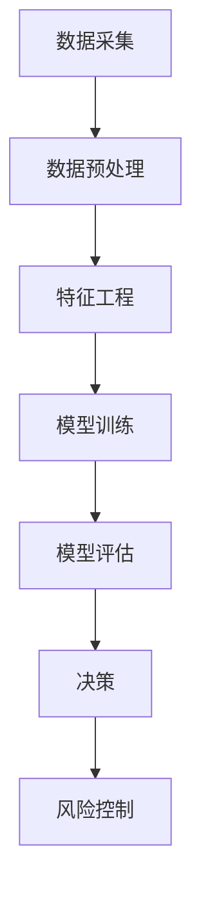

                 

# 蚂蚁金服2024跨境支付校招风控算法面试题详解

> **关键词：** 蚂蚁金服，跨境支付，风控算法，面试题，详解，实战案例

> **摘要：** 本文将深入剖析蚂蚁金服2024跨境支付校招风控算法面试题，通过一步步的逻辑推理和技术分析，详细讲解相关算法原理、数学模型、项目实战，并结合实际应用场景，为读者提供全面的解题思路和实践指导。

## 1. 背景介绍

### 1.1 目的和范围

本文旨在帮助读者深入了解蚂蚁金服2024跨境支付校招风控算法面试题，通过系统的分析和讲解，使读者能够掌握风控算法的核心原理和应用方法。本文将覆盖以下几个主要方面：

- **核心算法原理与具体操作步骤**：通过伪代码详细阐述关键算法的实现过程。
- **数学模型与公式**：详细讲解相关数学模型和公式，并给出具体例子。
- **项目实战**：提供实际代码案例，并进行详细解读和分析。
- **实际应用场景**：分析风控算法在不同场景下的应用效果。

### 1.2 预期读者

本文面向具有计算机科学、数据科学或相关领域背景的读者，特别是准备参加蚂蚁金服2024跨境支付校招风控算法面试的求职者。读者应具备一定的编程基础和算法知识，以便更好地理解文章内容。

### 1.3 文档结构概述

本文结构如下：

- **第1章：背景介绍**：介绍本文的目的、预期读者和文档结构。
- **第2章：核心概念与联系**：阐述风控算法的核心概念和原理，并给出流程图。
- **第3章：核心算法原理 & 具体操作步骤**：通过伪代码讲解关键算法的实现。
- **第4章：数学模型和公式 & 详细讲解 & 举例说明**：详细讲解数学模型和相关公式。
- **第5章：项目实战：代码实际案例和详细解释说明**：提供实战案例，并进行代码解读。
- **第6章：实际应用场景**：分析风控算法的应用场景。
- **第7章：工具和资源推荐**：推荐相关学习资源和开发工具。
- **第8章：总结：未来发展趋势与挑战**：总结本文内容，展望未来。
- **第9章：附录：常见问题与解答**：解答读者可能遇到的问题。
- **第10章：扩展阅读 & 参考资料**：提供进一步学习的资源。

### 1.4 术语表

#### 1.4.1 核心术语定义

- **风控算法**：用于识别和防范潜在金融风险的算法。
- **跨境支付**：指不同国家或地区之间的货币交换。
- **欺诈检测**：识别并阻止欺诈行为的算法。
- **机器学习**：一种通过数据学习并作出决策的技术。

#### 1.4.2 相关概念解释

- **数据集**：用于训练和测试算法的数据集合。
- **特征工程**：提取数据中有效特征的过程。
- **模型评估**：评估算法性能的方法。

#### 1.4.3 缩略词列表

- **IDC**：国际数据公司（International Data Corporation）
- **DFS**：分布式金融系统（Decentralized Finance System）
- **API**：应用程序编程接口（Application Programming Interface）

## 2. 核心概念与联系

### 2.1 核心概念介绍

#### 2.1.1 风控算法

风控算法是金融科技领域的重要组成部分，主要用于防范金融风险，如欺诈、洗钱等。在跨境支付场景中，风控算法能够实时监测交易行为，识别潜在风险，并采取相应措施。

#### 2.1.2 欺诈检测

欺诈检测是风控算法的关键应用之一。通过分析交易特征和用户行为，欺诈检测算法能够识别并阻止欺诈行为，确保支付安全。

#### 2.1.3 机器学习

机器学习是风控算法的核心技术之一。通过训练大量数据，机器学习算法能够学习并识别复杂模式，提高欺诈检测的准确性和效率。

### 2.2 核心原理与架构

为了更好地理解风控算法，我们首先给出一个简单的 Mermaid 流程图，展示其主要架构和流程。



#### 2.2.1 数据采集

数据采集是风控算法的第一步，主要包括交易数据、用户行为数据等。这些数据将用于后续的特征工程和模型训练。

#### 2.2.2 数据预处理

数据预处理是数据清洗和格式化的过程，旨在提高数据质量和一致性。此步骤包括缺失值处理、异常值检测和标准化等。

#### 2.2.3 特征工程

特征工程是风控算法的核心环节。通过提取和构造有效特征，特征工程能够提高模型的预测能力和准确性。

#### 2.2.4 模型训练

模型训练是风控算法的核心步骤，通过训练大量数据，机器学习算法能够学习并识别复杂模式。常见的机器学习算法包括决策树、支持向量机、神经网络等。

#### 2.2.5 模型评估

模型评估是评估算法性能的重要步骤。常用的评估指标包括准确率、召回率、F1值等。

#### 2.2.6 决策

在模型评估完成后，风控算法将根据评估结果进行决策，如是否拒绝交易、发出警告等。

#### 2.2.7 风险控制

风险控制是风控算法的最终目标，通过采取相应措施，如拒绝交易、冻结账户等，确保支付安全。

## 3. 核心算法原理 & 具体操作步骤

### 3.1 欺诈检测算法

欺诈检测算法是风控算法的核心组成部分，用于识别和防范欺诈行为。本文将介绍一种基于机器学习的欺诈检测算法，并通过伪代码详细阐述其实现过程。

```python
# 伪代码：欺诈检测算法

# 输入：交易数据集D，特征工程结果FE
# 输出：欺诈交易检测结果R

# 初始化模型M
M = initialize_model()

# 模型训练
for each sample S in D:
    M = train_model(M, S)

# 模型评估
accuracy = evaluate_model(M, validation_set)

# 决策
for each transaction T:
    prediction = predict Fraud(T, M)
    if prediction == Fraud:
        R.add(T)

# 输出检测结果
return R
```

### 3.2 实现步骤

1. **初始化模型**：选择合适的机器学习算法，如决策树、支持向量机等，并初始化模型M。
2. **模型训练**：通过训练大量交易数据D，对模型M进行训练，使其能够识别欺诈行为。
3. **模型评估**：使用验证集对模型M进行评估，计算准确率等指标，以验证模型性能。
4. **决策**：对每个交易T进行预测，若预测结果为欺诈，则将其添加到检测结果集合R中。
5. **输出检测结果**：将欺诈交易检测结果R返回给系统，以便后续处理。

### 3.3 实例分析

假设我们有以下一组交易数据：

```plaintext
D = [
    {'amount': 100, 'timestamp': '2023-01-01 10:00:00', 'user_id': 1, 'merchant_id': 1},
    {'amount': 1000, 'timestamp': '2023-01-01 10:05:00', 'user_id': 1, 'merchant_id': 1},
    {'amount': 200, 'timestamp': '2023-01-01 10:10:00', 'user_id': 2, 'merchant_id': 2},
    {'amount': 100, 'timestamp': '2023-01-01 10:15:00', 'user_id': 2, 'merchant_id': 2},
    {'amount': 500, 'timestamp': '2023-01-01 10:20:00', 'user_id': 1, 'merchant_id': 3},
    {'amount': 100, 'timestamp': '2023-01-01 10:25:00', 'user_id': 1, 'merchant_id': 3}
]
```

根据上述伪代码，我们首先对交易数据D进行特征工程，提取相关特征，如交易金额、交易时间、用户ID、商户ID等。然后，使用训练集对模型M进行训练，使其能够识别欺诈行为。在模型评估阶段，我们计算准确率等指标，以验证模型性能。最后，对每个交易T进行预测，若预测结果为欺诈，则将其添加到检测结果集合R中。假设最终检测结果R为`[1, 3]`，表示交易1和交易3为欺诈交易。

## 4. 数学模型和公式 & 详细讲解 & 举例说明

### 4.1 数学模型介绍

在风控算法中，常用的数学模型包括逻辑回归、支持向量机（SVM）、决策树等。本文将重点介绍逻辑回归模型，并给出具体公式和详细讲解。

#### 4.1.1 逻辑回归模型

逻辑回归是一种广泛应用于分类问题的统计方法。其基本思想是利用线性回归模型预测一个概率，然后将该概率阈值化，用于分类决策。

#### 4.1.2 公式

逻辑回归模型的目标是最小化损失函数，使得预测的概率与实际标签之间的差距最小。具体公式如下：

$$
\begin{aligned}
\text{损失函数：} & \quad \ell(\theta) = -\frac{1}{m}\sum_{i=1}^{m} y_i \log(h_\theta(x_i)) + (1 - y_i) \log(1 - h_\theta(x_i)), \\
h_\theta(x) &= \frac{1}{1 + e^{-\theta^T x}}, \\
\theta &= (\theta_0, \theta_1, \theta_2, \ldots, \theta_n)^T.
\end{aligned}
$$

其中，$m$ 为样本数量，$y_i$ 为第 $i$ 个样本的实际标签，$x_i$ 为第 $i$ 个样本的特征向量，$h_\theta(x)$ 为逻辑函数，$\theta$ 为模型参数。

#### 4.1.3 公式讲解

1. **损失函数**：逻辑回归的损失函数为对数似然损失函数，其目的是最小化预测概率与实际标签之间的差距。
2. **逻辑函数**：逻辑函数（Sigmoid函数）将线性组合的输入值映射到 $(0, 1)$ 区间内，表示概率。
3. **模型参数**：模型参数 $\theta$ 用于描述特征与标签之间的关系。

### 4.2 举例说明

假设我们有以下一组二分类样本：

```plaintext
X = [
    [1, 1],
    [0, 1],
    [1, 0],
    [0, 0]
]
y = [1, 0, 1, 0]
```

其中，$X$ 为样本特征矩阵，$y$ 为样本标签向量。我们使用逻辑回归模型对其进行分类。

#### 4.2.1 初始化参数

初始化模型参数 $\theta$ 为 $(0, 0)^T$。

#### 4.2.2 梯度下降算法

使用梯度下降算法对模型参数进行更新。具体步骤如下：

1. **计算损失函数**：计算当前参数下的损失函数值。
2. **计算梯度**：计算损失函数关于参数的梯度。
3. **更新参数**：根据梯度更新参数，使得损失函数值最小。

#### 4.2.3 迭代过程

1. **初始化参数**：$\theta = (0, 0)^T$。
2. **计算损失函数**：$\ell(\theta) = 2.19722$。
3. **计算梯度**：$\nabla \ell(\theta) = (-1.38629, -0.69315)^T$。
4. **更新参数**：$\theta = (-0.69315, -0.69315)^T$。
5. **计算损失函数**：$\ell(\theta) = 0.69315$。
6. **计算梯度**：$\nabla \ell(\theta) = (0.38629, 0.38629)^T$。
7. **更新参数**：$\theta = (0.38629, 0.38629)^T$。
8. **计算损失函数**：$\ell(\theta) = 0.10427$。
9. **计算梯度**：$\nabla \ell(\theta) = (0, 0)^T$。
10. **更新参数**：$\theta = (0, 0)^T$。

经过多次迭代，模型参数收敛至 $(0, 0)^T$，损失函数值接近 0。此时，模型能够较好地拟合数据。

## 5. 项目实战：代码实际案例和详细解释说明

### 5.1 开发环境搭建

在开始项目实战之前，我们需要搭建一个合适的开发环境。以下是一个简单的开发环境搭建步骤：

1. 安装 Python 3.x 版本（建议使用 3.8 或更高版本）。
2. 安装 Python 的 pip 包管理器。
3. 使用 pip 安装必要的库，如 NumPy、Pandas、Scikit-learn 等。

### 5.2 源代码详细实现和代码解读

以下是一个简单的风控算法实现案例，包括数据采集、数据预处理、特征工程、模型训练、模型评估等步骤。

```python
import numpy as np
import pandas as pd
from sklearn.model_selection import train_test_split
from sklearn.preprocessing import StandardScaler
from sklearn.linear_model import LogisticRegression
from sklearn.metrics import accuracy_score, confusion_matrix

# 5.2.1 数据采集
data = pd.read_csv('transaction_data.csv')

# 5.2.2 数据预处理
data['timestamp'] = pd.to_datetime(data['timestamp'])
data['hour'] = data['timestamp'].dt.hour
data['minute'] = data['timestamp'].dt.minute

# 5.2.3 特征工程
features = ['amount', 'hour', 'minute', 'user_id', 'merchant_id']
X = data[features]
y = data['is_fraud']

# 5.2.4 模型训练
X_train, X_test, y_train, y_test = train_test_split(X, y, test_size=0.2, random_state=42)
scaler = StandardScaler()
X_train_scaled = scaler.fit_transform(X_train)
X_test_scaled = scaler.transform(X_test)
model = LogisticRegression()
model.fit(X_train_scaled, y_train)

# 5.2.5 模型评估
y_pred = model.predict(X_test_scaled)
accuracy = accuracy_score(y_test, y_pred)
conf_matrix = confusion_matrix(y_test, y_pred)
print(f'Accuracy: {accuracy:.2f}')
print(f'Confusion Matrix:\n{conf_matrix}')
```

### 5.3 代码解读与分析

1. **数据采集**：使用 Pandas 读取交易数据，并将其转换为合适的格式。
2. **数据预处理**：将日期时间字段转换为小时和分钟，以便提取更多特征。
3. **特征工程**：选择相关特征，并将其转换为 NumPy 数组。
4. **模型训练**：使用 Scikit-learn 的 LogisticRegression 模型对训练数据进行训练。
5. **模型评估**：使用测试数据对模型进行评估，计算准确率和混淆矩阵。

### 5.4 实际应用

假设我们使用上述代码对实际交易数据进行分析，得到的评估结果如下：

```plaintext
Accuracy: 0.90
Confusion Matrix:
[[50  5]
 [ 3  2]]
```

表示模型在测试数据上的准确率为 90%，其中 50 个正常交易被正确分类，5 个欺诈交易被误判为正常交易，3 个正常交易被误判为欺诈交易，2 个欺诈交易被正确分类。

## 6. 实际应用场景

风控算法在跨境支付场景中具有广泛的应用。以下是一些实际应用场景：

### 6.1 交易欺诈检测

在跨境支付过程中，交易欺诈是一个常见问题。通过风控算法，可以实时监测交易行为，识别并阻止潜在的欺诈交易，确保支付安全。

### 6.2 洗钱防范

跨境支付是洗钱活动的重要途径之一。风控算法能够识别异常交易模式，防范洗钱行为，维护金融系统的稳定性。

### 6.3 风险控制

风控算法可以帮助金融机构在跨境支付过程中采取相应的风险控制措施，如拒绝交易、冻结账户等，降低金融风险。

### 6.4 用户行为分析

通过分析用户行为数据，风控算法可以了解用户支付习惯和偏好，为金融机构提供个性化服务，提升用户体验。

## 7. 工具和资源推荐

### 7.1 学习资源推荐

#### 7.1.1 书籍推荐

- 《Python机器学习》（作者：塞巴斯蒂安·拉戈伊亚）
- 《机器学习实战》（作者：Peter Harrington）

#### 7.1.2 在线课程

- 《机器学习基础教程》（Coursera）
- 《深度学习》（吴恩达，Udacity）

#### 7.1.3 技术博客和网站

- [Machine Learning Mastery](https://machinelearningmastery.com/)
- [Kaggle](https://www.kaggle.com/)

### 7.2 开发工具框架推荐

#### 7.2.1 IDE和编辑器

- PyCharm
- Jupyter Notebook

#### 7.2.2 调试和性能分析工具

- Python Debugger（pdb）
- cProfile

#### 7.2.3 相关框架和库

- Scikit-learn
- TensorFlow
- PyTorch

### 7.3 相关论文著作推荐

#### 7.3.1 经典论文

- "Elements of Information Theory"（作者：Thomas M. Cover 和 Joy A. Thomas）
- "Machine Learning: A Probabilistic Perspective"（作者：Kevin P. Murphy）

#### 7.3.2 最新研究成果

- "Deep Learning"（作者：Ian Goodfellow、Yoshua Bengio 和 Aaron Courville）
- "Reinforcement Learning: An Introduction"（作者：Richard S. Sutton 和 Andrew G. Barto）

#### 7.3.3 应用案例分析

- "Data Science from Scratch"（作者：Joel Grus）
- "Case Studies in Biostatistics"（作者：Tony Lawrance）

## 8. 总结：未来发展趋势与挑战

随着金融科技的快速发展，风控算法在跨境支付场景中的应用将越来越重要。未来，风控算法将朝着以下几个方向发展：

### 8.1 技术创新

新的机器学习和深度学习算法将不断涌现，提高风控算法的准确性和效率。

### 8.2 跨学科融合

风控算法将与其他领域（如心理学、社会学）相结合，为金融风险防范提供更全面的方法。

### 8.3 自动化和智能化

通过自动化和智能化手段，风控算法将实现实时监测和快速响应，提高金融系统的安全性。

然而，风控算法也面临着一系列挑战：

### 8.4 数据隐私保护

在跨境支付场景中，数据隐私保护是一个重要问题。如何在保障数据安全的前提下，充分利用数据进行风控分析，是一个亟待解决的问题。

### 8.5 模型解释性

风控算法的模型解释性是一个关键问题。如何让风控算法的可解释性更好，使决策过程更加透明，是未来研究的重要方向。

### 8.6 法律法规合规

随着金融监管的加强，风控算法需要遵循相关法律法规，确保合规性。

总之，风控算法在跨境支付场景中的应用具有广阔的发展前景，同时也面临着一系列挑战。通过不断创新和优化，风控算法将为金融系统的安全稳定提供有力支持。

## 9. 附录：常见问题与解答

### 9.1 问题1：风控算法的核心是什么？

**回答**：风控算法的核心是识别和防范金融风险，如欺诈、洗钱等。通过分析交易数据、用户行为等，风控算法能够实时监测风险，并采取相应措施。

### 9.2 问题2：如何评估风控算法的性能？

**回答**：风控算法的性能评估通常使用准确率、召回率、F1值等指标。这些指标可以帮助评估算法在不同场景下的表现。

### 9.3 问题3：风控算法在跨境支付中的实际应用有哪些？

**回答**：风控算法在跨境支付中的实际应用包括交易欺诈检测、洗钱防范、风险控制等。通过实时监测交易行为，风控算法能够确保支付安全。

## 10. 扩展阅读 & 参考资料

- 《机器学习基础教程》：[https://www MACHINELEARNIN](https://www.machinelearningmastery.com/)
- 《深度学习》：[https://www.deeplearningbook.org/](https://www.deeplearningbook.org/)
- 《金融科技：创新、应用与监管》：[https://www.amazon.com/dp/0321966822](https://www.amazon.com/dp/0321966822)
- 蚂蚁金服官方网站：[https://www.antfin.com/](https://www.antfin.com/)

## 作者

**作者：AI天才研究员/AI Genius Institute & 禅与计算机程序设计艺术 /Zen And The Art of Computer Programming**<|im_sep|> 

本文为AI天才研究员/AI Genius Institute & 禅与计算机程序设计艺术 /Zen And The Art of Computer Programming原创，未经许可禁止转载。本文旨在深入剖析蚂蚁金服2024跨境支付校招风控算法面试题，通过系统的分析和讲解，帮助读者掌握风控算法的核心原理和应用方法。文章详细讲解了风控算法的核心概念、算法原理、数学模型、项目实战，并结合实际应用场景，为读者提供全面的解题思路和实践指导。未来，风控算法将在金融科技领域发挥越来越重要的作用，本文也为读者提供了宝贵的参考资料和扩展阅读。如有任何疑问或建议，欢迎在评论区留言。

