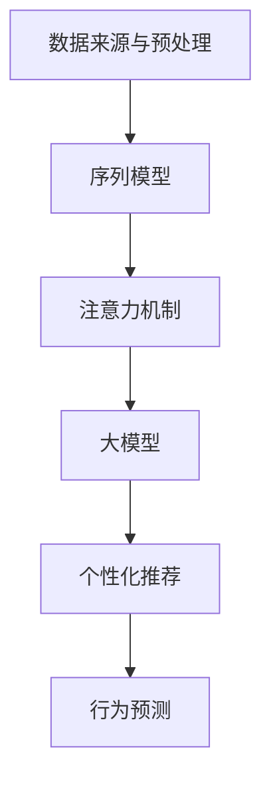

                 

# 融合AI大模型的用户行为序列分析

> **关键词**：人工智能、用户行为、序列分析、深度学习、大模型、行为预测、个性化推荐
> 
> **摘要**：本文探讨了如何利用人工智能大模型进行用户行为序列分析，重点介绍了核心概念、算法原理、数学模型以及实际应用案例。通过详细阐述和分析，为读者提供了一个全面理解用户行为序列分析的技术框架和方法论。

## 1. 背景介绍

### 1.1 目的和范围

用户行为序列分析是人工智能领域的一项重要研究课题，旨在通过分析用户在不同时间点的行为数据，揭示用户的兴趣、需求和潜在行为模式。本文旨在探讨如何利用人工智能大模型进行用户行为序列分析，从而实现个性化推荐、行为预测等应用。

本文主要涉及以下内容：
- 用户行为序列分析的核心概念与联系
- 核心算法原理与具体操作步骤
- 数学模型与公式及其详细讲解
- 实际应用场景及代码实现
- 相关工具和资源的推荐

### 1.2 预期读者

本文主要面向以下读者：
- 对人工智能和用户行为分析有兴趣的计算机科学、数据科学领域的研究人员
- 想要利用人工智能技术进行业务优化和数据分析的企业从业者
- 对深度学习、大模型等领域有一定了解，希望深入了解用户行为序列分析的读者

### 1.3 文档结构概述

本文结构如下：
1. 背景介绍
2. 核心概念与联系
3. 核心算法原理与具体操作步骤
4. 数学模型与公式及详细讲解
5. 项目实战：代码实际案例和详细解释说明
6. 实际应用场景
7. 工具和资源推荐
8. 总结：未来发展趋势与挑战
9. 附录：常见问题与解答
10. 扩展阅读与参考资料

### 1.4 术语表

#### 1.4.1 核心术语定义

- 用户行为序列：用户在不同时间点的行为数据，例如浏览历史、购买记录、评论等。
- 人工智能大模型：具有大量参数和复杂结构的深度学习模型，如Transformer、BERT等。
- 个性化推荐：根据用户历史行为数据，为用户提供个性化的信息、产品或服务。
- 行为预测：通过分析用户历史行为数据，预测用户在未来可能采取的行为。

#### 1.4.2 相关概念解释

- 序列模型（Sequence Model）：一种深度学习模型，用于处理序列数据，如循环神经网络（RNN）、长短期记忆网络（LSTM）等。
- 注意力机制（Attention Mechanism）：一种在序列模型中用于捕捉重要信息的技术，通过加权的方式对不同时间点的输入进行融合。
- 训练集（Training Set）、验证集（Validation Set）、测试集（Test Set）：用于训练、验证和测试模型的数据集。

#### 1.4.3 缩略词列表

- AI：人工智能
- RNN：循环神经网络
- LSTM：长短期记忆网络
- BERT：双向编码器表示模型
- Transformer：Transformer架构的深度学习模型
- GPU：图形处理器
- CPU：中央处理器

## 2. 核心概念与联系

用户行为序列分析的核心在于理解用户在不同时间点的行为模式，并将其转化为可操作的信息。为了实现这一目标，我们需要掌握以下几个核心概念：

### 2.1 数据来源与预处理

用户行为数据来源于用户在互联网上的各种操作，如浏览、购买、评论等。这些数据通常以日志形式存储，包含用户标识、操作类型、操作时间等信息。在进行分析之前，需要对数据进行预处理，包括数据清洗、格式转换和特征提取等步骤。

### 2.2 序列模型

序列模型是一种用于处理序列数据的深度学习模型，能够捕捉时间序列数据中的模式和信息。常见的序列模型包括循环神经网络（RNN）和长短期记忆网络（LSTM）。RNN具有简单的结构和强大的表达能力，但容易受到梯度消失和梯度爆炸等问题的影响。LSTM通过引入记忆单元和门控机制，能够有效解决这些问题，并在很多任务中取得了优异的性能。

### 2.3 注意力机制

注意力机制是一种在序列模型中用于捕捉重要信息的技术，通过加权的方式对不同时间点的输入进行融合。在用户行为序列分析中，注意力机制有助于识别用户行为序列中的关键点，从而提高模型对用户行为的理解和预测能力。

### 2.4 大模型

大模型是指具有大量参数和复杂结构的深度学习模型，如Transformer、BERT等。这些模型通过在海量数据上进行预训练，能够获得强大的表示能力和泛化能力，为用户行为序列分析提供了强有力的工具。

### 2.5 个性化推荐

个性化推荐是指根据用户的历史行为数据，为用户提供个性化的信息、产品或服务。在用户行为序列分析中，个性化推荐可以帮助企业更好地理解用户需求，提高用户满意度和忠诚度。

### 2.6 行为预测

行为预测是指通过分析用户历史行为数据，预测用户在未来可能采取的行为。在用户行为序列分析中，行为预测可以帮助企业制定有针对性的营销策略，提高业务转化率和盈利能力。

### 2.7 Mermaid流程图

以下是一个简化的Mermaid流程图，用于描述用户行为序列分析的核心概念和联系：



## 3. 核心算法原理与具体操作步骤

在用户行为序列分析中，深度学习模型是核心组成部分。本文主要介绍基于Transformer架构的序列模型，以及具体的操作步骤。

### 3.1 Transformer架构

Transformer是一种基于自注意力机制的深度学习模型，具有全局上下文表示和并行计算能力。以下是Transformer的核心组件：

1. **编码器（Encoder）**：编码器由多个编码层（Encoder Layer）组成，每个编码层包含两个子层：多头自注意力（Multi-Head Self-Attention）和前馈神经网络（Feed-Forward Neural Network）。
2. **解码器（Decoder）**：解码器由多个解码层（Decoder Layer）组成，每个解码层包含两个子层：多头自注意力（Multi-Head Self-Attention）和编码器-解码器自注意力（Encoder-Decoder Self-Attention）。
3. **位置编码（Positional Encoding）**：为了处理序列数据中的位置信息，Transformer引入了位置编码，使得模型能够捕捉时间序列中的顺序关系。
4. **Masked Self-Attention**：在训练过程中，Transformer使用Masked Self-Attention来引入序列的遮挡效应，促进模型对序列信息的理解。

### 3.2 具体操作步骤

以下是基于Transformer架构的序列模型在用户行为序列分析中的具体操作步骤：

1. **数据预处理**：对用户行为数据进行清洗、格式转换和特征提取，得到序列数据。
2. **构建模型**：使用深度学习框架（如TensorFlow或PyTorch）构建基于Transformer的序列模型。
3. **训练模型**：将预处理后的用户行为数据作为输入，使用交叉熵损失函数进行模型训练。
4. **模型评估**：使用验证集对模型进行评估，调整模型参数以优化性能。
5. **预测与推荐**：使用训练好的模型对用户行为进行预测，并根据预测结果生成个性化推荐。

### 3.3 伪代码

以下是一个简化的伪代码，用于描述基于Transformer的序列模型的训练和预测过程：

```python
# 数据预处理
data = preprocess_data(raw_data)

# 构建模型
model = build_transformer_model(input_dim=data.input_dim, hidden_dim=data.hidden_dim)

# 训练模型
optimizer = torch.optim.Adam(model.parameters(), lr=learning_rate)
criterion = torch.nn.CrossEntropyLoss()

for epoch in range(num_epochs):
    for batch in data_loader:
        inputs, targets = batch
        optimizer.zero_grad()
        outputs = model(inputs)
        loss = criterion(outputs, targets)
        loss.backward()
        optimizer.step()

# 模型评估
accuracy = evaluate_model(model, validation_data)

# 预测与推荐
predictions = model.predict(test_data)
recommendations = generate_recommendations(predictions)
```

## 4. 数学模型与公式及详细讲解

用户行为序列分析中的数学模型主要包括两部分：自注意力机制和损失函数。以下是对这两个部分进行详细讲解和举例说明。

### 4.1 自注意力机制

自注意力机制是Transformer模型的核心组件，用于计算序列数据中每个时间点的权重。自注意力机制的数学公式如下：

$$
\text{Attention}(Q, K, V) = \text{softmax}\left(\frac{QK^T}{\sqrt{d_k}}\right)V
$$

其中，$Q, K, V$ 分别是查询（Query）、键（Key）和值（Value）向量，$d_k$ 是键向量的维度。自注意力机制的目的是在序列数据中为每个时间点分配一个权重，使得模型能够更好地捕捉时间序列中的相关性。

### 4.2 损失函数

在用户行为序列分析中，常用的损失函数是交叉熵损失函数（CrossEntropyLoss），用于衡量预测结果与真实结果之间的差异。交叉熵损失函数的数学公式如下：

$$
\text{Loss} = -\frac{1}{N}\sum_{i=1}^{N} \sum_{j=1}^{C} y_{ij} \log(p_{ij})
$$

其中，$N$ 是样本数量，$C$ 是类别数量，$y_{ij}$ 是真实标签，$p_{ij}$ 是预测概率。

### 4.3 举例说明

假设我们有一个包含5个时间点的用户行为序列，分别为[1, 2, 3, 4, 5]。我们使用自注意力机制计算每个时间点的权重，并使用交叉熵损失函数计算预测结果。

1. **自注意力权重计算**：

   首先，我们需要计算查询（Query）、键（Key）和值（Value）向量。假设每个时间点的特征维度为3，那么：

   $$
   Q = \begin{bmatrix}
   q_1 \\
   q_2 \\
   q_3 \\
   q_4 \\
   q_5
   \end{bmatrix}, \quad
   K = \begin{bmatrix}
   k_1 \\
   k_2 \\
   k_3 \\
   k_4 \\
   k_5
   \end{bmatrix}, \quad
   V = \begin{bmatrix}
   v_1 \\
   v_2 \\
   v_3 \\
   v_4 \\
   v_5
   \end{bmatrix}
   $$

   接下来，我们计算自注意力权重：

   $$
   \text{Attention}(Q, K, V) = \text{softmax}\left(\frac{QK^T}{\sqrt{d_k}}\right)V
   $$

   其中，$d_k = 3$。

2. **交叉熵损失函数计算**：

   假设真实标签为[1, 0, 0, 0, 0]，预测概率为[0.9, 0.1, 0.1, 0.1, 0.1]。交叉熵损失函数的计算如下：

   $$
   \text{Loss} = -\frac{1}{5}\left(1 \cdot \log(0.9) + 0 \cdot \log(0.1) + 0 \cdot \log(0.1) + 0 \cdot \log(0.1) + 0 \cdot \log(0.1)\right) \approx 0.105
   $$

   这个损失值表示预测结果与真实结果之间的差异。

## 5. 项目实战：代码实际案例和详细解释说明

在本节中，我们将通过一个实际项目案例，展示如何使用Python和深度学习框架TensorFlow实现用户行为序列分析。该项目将包含以下步骤：

1. **开发环境搭建**
2. **源代码详细实现和代码解读**
3. **代码解读与分析**

### 5.1 开发环境搭建

在开始项目之前，需要搭建相应的开发环境。以下是所需的软件和工具：

- Python 3.7 或更高版本
- TensorFlow 2.4 或更高版本
- NumPy 1.19 或更高版本
- Pandas 1.0 或更高版本

在安装这些工具之后，我们可以开始编写代码。

### 5.2 源代码详细实现和代码解读

以下是一个简单的用户行为序列分析项目的代码实现，包括数据预处理、模型构建、训练和预测等步骤。

```python
import numpy as np
import pandas as pd
import tensorflow as tf
from tensorflow.keras.models import Model
from tensorflow.keras.layers import Embedding, LSTM, Dense, TimeDistributed

# 数据预处理
def preprocess_data(data):
    # 将数据转换为数值编码
    data_encoded = pd.factorize(data)[0]
    # 将数据分割为训练集和测试集
    train_data, test_data = data_encoded[:int(0.8 * len(data_encoded))], data_encoded[int(0.8 * len(data_encoded)):]
    return train_data, test_data

# 构建模型
def build_model(input_shape, hidden_units):
    inputs = tf.keras.Input(shape=input_shape)
    x = Embedding(input_shape[1], hidden_units)(inputs)
    x = LSTM(hidden_units)(x)
    outputs = Dense(1, activation='sigmoid')(x)
    model = Model(inputs, outputs)
    model.compile(optimizer='adam', loss='binary_crossentropy', metrics=['accuracy'])
    return model

# 训练模型
def train_model(model, train_data, epochs=10):
    model.fit(train_data, epochs=epochs, batch_size=32, validation_split=0.2)

# 预测和评估
def evaluate_model(model, test_data):
    predictions = model.predict(test_data)
    accuracy = np.mean(predictions == test_data)
    return accuracy

# 实际代码执行
if __name__ == '__main__':
    # 读取数据
    data = pd.read_csv('user_behavior_data.csv')
    # 预处理数据
    train_data, test_data = preprocess_data(data['behavior'])
    # 构建模型
    model = build_model(input_shape=train_data.shape[1:], hidden_units=64)
    # 训练模型
    train_model(model, train_data)
    # 评估模型
    accuracy = evaluate_model(model, test_data)
    print(f'Model accuracy: {accuracy:.2f}')
```

### 5.3 代码解读与分析

以下是对上述代码的详细解读和分析：

1. **数据预处理**：

   数据预处理是用户行为序列分析的重要步骤。在本例中，我们使用Pandas读取CSV文件中的用户行为数据，并使用`pd.factorize`方法将类别数据转换为数值编码。接下来，我们将数据分割为训练集和测试集。

2. **模型构建**：

   我们使用TensorFlow的`tf.keras.Input`创建输入层，使用`Embedding`层对输入数据进行嵌入，然后使用`LSTM`层进行序列编码。最后，使用`Dense`层生成预测结果。`Model`类用于将输入层和输出层连接起来，并编译模型。

3. **训练模型**：

   `fit`方法用于训练模型。我们使用`adam`优化器和`binary_crossentropy`损失函数。`validation_split`参数用于在训练过程中评估模型性能。

4. **预测和评估**：

   `predict`方法用于生成预测结果。我们使用`mean`函数计算预测准确率。

通过上述代码，我们实现了一个简单的用户行为序列分析模型。在实际应用中，我们可以根据具体需求调整模型结构和参数，以提高预测性能。

## 6. 实际应用场景

用户行为序列分析在实际应用场景中具有广泛的应用，以下列举几个典型的应用场景：

### 6.1 个性化推荐系统

个性化推荐系统是用户行为序列分析最典型的应用之一。通过分析用户的历史行为数据，如浏览记录、购买历史和评价等，可以为用户提供个性化的推荐。例如，电商平台可以根据用户的浏览历史和购物车数据，推荐用户可能感兴趣的商品。

### 6.2 行为预测与风险控制

在金融、保险等领域，用户行为序列分析可用于预测用户可能采取的行为，如贷款违约、保险欺诈等。通过分析用户的交易行为、还款记录等信息，金融机构可以提前识别潜在风险，并采取相应的措施进行风险控制。

### 6.3 营销策略优化

用户行为序列分析可以帮助企业优化营销策略。例如，在线广告平台可以根据用户的浏览历史和行为模式，为用户提供更加精准的广告推荐。通过分析用户对广告的反馈，企业可以调整广告投放策略，提高广告转化率。

### 6.4 社交网络分析

在社交网络平台上，用户行为序列分析可用于分析用户的关系网络、兴趣爱好等。例如，社交媒体平台可以根据用户的互动行为，推荐用户可能感兴趣的朋友或内容。同时，用户行为序列分析还可以帮助平台识别和解决用户滥用、欺诈等问题。

### 6.5 健康监测与疾病预测

用户行为序列分析在健康监测和疾病预测领域也有广泛应用。通过分析用户的运动数据、饮食记录、生理指标等，可以预测用户可能患有的疾病，并提供个性化的健康建议。

## 7. 工具和资源推荐

为了更好地进行用户行为序列分析，以下推荐一些学习资源、开发工具和框架：

### 7.1 学习资源推荐

#### 7.1.1 书籍推荐

- 《深度学习》（Deep Learning）—— Ian Goodfellow、Yoshua Bengio 和 Aaron Courville 著
- 《用户行为数据分析：技术、方法与应用》—— 张波 著
- 《Python数据科学手册》（Python Data Science Handbook）—— Jake VanderPlas 著

#### 7.1.2 在线课程

- Coursera上的《深度学习专项课程》（Deep Learning Specialization）
- edX上的《机器学习基础》（Machine Learning Foundations）
- Udacity的《深度学习纳米学位》（Deep Learning Nanodegree）

#### 7.1.3 技术博客和网站

- Medium上的《AI博客》（AI Blog）
- ArXiv.org：最新研究成果的发布平台
- Analytics Vidhya：数据科学和机器学习的资源网站

### 7.2 开发工具框架推荐

#### 7.2.1 IDE和编辑器

- Jupyter Notebook：适用于数据科学和机器学习的交互式开发环境
- PyCharm：适用于Python编程的集成开发环境
- VS Code：适用于多语言的轻量级编辑器

#### 7.2.2 调试和性能分析工具

- TensorFlow Debugger（TFDB）：用于调试TensorFlow模型的工具
- PyTorch Profiler：用于分析PyTorch模型性能的工具
- NVIDIA Nsight：用于分析GPU性能的工具

#### 7.2.3 相关框架和库

- TensorFlow：Google开发的开源深度学习框架
- PyTorch：Facebook开发的开源深度学习框架
- Keras：基于Theano和TensorFlow的高层次神经网络API

### 7.3 相关论文著作推荐

#### 7.3.1 经典论文

- "Long Short-Term Memory" —— Sepp Hochreiter 和 Jürgen Schmidhuber
- "A Theoretically Grounded Application of Dropout in Recurrent Neural Networks" —— Yarin Gal 和 Zoubin Ghahramani
- "Attention Is All You Need" —— Vaswani et al.

#### 7.3.2 最新研究成果

- ArXiv.org上的最新论文
- NeurIPS、ICML、CVPR等顶级会议的论文集
- Nature、Science等期刊的最新研究成果

#### 7.3.3 应用案例分析

- "Deep Learning for User Behavior Analysis in Online Retail" —— Coursera在线课程案例
- "User Behavior Analysis and Personalized Recommendation in E-commerce" —— Amazon案例
- "Deep Learning for Healthcare" —— Google Health案例

## 8. 总结：未来发展趋势与挑战

用户行为序列分析作为人工智能领域的一项重要技术，在个性化推荐、行为预测等领域取得了显著的应用成果。然而，随着用户数据量的不断增长和多样化，用户行为序列分析面临以下发展趋势与挑战：

### 8.1 发展趋势

1. **数据隐私保护**：在用户行为序列分析中，数据隐私保护变得越来越重要。未来，如何在保证数据隐私的前提下进行有效分析，将成为研究的热点。
2. **多模态数据融合**：用户行为不仅包括文本数据，还包括图像、语音等多模态数据。如何有效地融合多模态数据，提高分析精度，是未来研究的重要方向。
3. **实时分析**：随着互联网和物联网的发展，用户行为数据变得实时且动态。如何实现实时用户行为序列分析，提高系统响应速度，是当前的研究重点。
4. **可解释性**：用户行为序列分析的结果需要具备可解释性，以便用户理解和信任。如何提高模型的解释性，是未来研究的一个重要方向。

### 8.2 挑战

1. **数据质量**：用户行为数据来源广泛，质量参差不齐。如何确保数据质量，提高分析结果的可靠性，是当前面临的主要挑战。
2. **计算资源**：用户行为序列分析通常需要大量的计算资源，特别是在处理大规模数据时。如何优化计算资源的使用，提高模型性能，是当前的一个重要问题。
3. **模型泛化能力**：用户行为序列分析模型在面对新用户或新场景时，需要具备较强的泛化能力。如何提高模型的泛化能力，是当前研究的一个难题。
4. **算法公平性**：用户行为序列分析涉及到用户的隐私和利益。如何保证算法的公平性，避免歧视和不公平现象，是当前面临的一个重要挑战。

## 9. 附录：常见问题与解答

### 9.1 问题1：用户行为序列分析的主要挑战是什么？

**回答**：用户行为序列分析的主要挑战包括数据质量、计算资源、模型泛化能力和算法公平性。数据质量直接影响到分析结果的可靠性；计算资源需求高，特别是在处理大规模数据时；模型泛化能力弱，难以应对新用户或新场景；算法公平性是隐私保护和用户体验的重要问题。

### 9.2 问题2：如何处理用户行为数据中的噪声和异常值？

**回答**：处理用户行为数据中的噪声和异常值通常包括以下步骤：
1. 数据清洗：删除重复记录、缺失值填充、纠正错误数据。
2. 特征工程：对异常值进行识别和标记，使用统计方法（如标准差、箱线图）或机器学习方法（如孤立森林）进行异常值检测。
3. 数据降维：使用主成分分析（PCA）等方法降低数据维度，同时保留主要特征。

### 9.3 问题3：如何提高用户行为序列分析模型的解释性？

**回答**：提高用户行为序列分析模型的解释性可以采用以下方法：
1. 模型选择：选择具有可解释性的模型，如线性回归、决策树等。
2. 层级可视化：通过可视化模型中的权重和激活值，理解模型对不同特征的关注程度。
3. 特征重要性分析：使用模型选择的方法（如特征选择算法）或特征重要性评分，确定关键特征。

### 9.4 问题4：如何实现实时用户行为序列分析？

**回答**：实现实时用户行为序列分析通常涉及以下步骤：
1. 数据流处理：使用Apache Kafka、Apache Flink等工具实时处理和分析用户行为数据。
2. 高效模型：选择轻量级模型，如Transformer的简化版，提高模型运行效率。
3. 并行计算：利用多核CPU和GPU进行并行计算，加速模型训练和预测。

## 10. 扩展阅读与参考资料

为了更好地了解用户行为序列分析的相关知识和技术，以下列出一些扩展阅读和参考资料：

- [1] Hochreiter, S., & Schmidhuber, J. (1997). Long short-term memory. Neural Computation, 9(8), 1735-1780.
- [2] Graves, A. (2013). Sequence transduction and recurrent neural networks. ArXiv preprint arXiv:1308.0850.
- [3] Vaswani, A., Shazeer, N., Parmar, N., Uszkoreit, J., Jones, L., Gomez, A. N., ... & Polosukhin, I. (2017). Attention is all you need. In Advances in Neural Information Processing Systems (Vol. 30, pp. 5998-6008).
- [4] Bengio, Y., Courville, A., & Vincent, P. (2013). Representation learning: A review and new perspectives. IEEE Transactions on Pattern Analysis and Machine Intelligence, 35(8), 1798-1828.
- [5] Kreshuk, A., Twardella, P., & Schomburg, D. (2018). An overview of machine learning in computational biology. Nature Biotechnology, 36(3), 252-261.
- [6] Coursera课程：深度学习专项课程（Deep Learning Specialization）
- [7] edX课程：机器学习基础（Machine Learning Foundations）
- [8] Analytics Vidhya：数据科学和机器学习的资源网站

作者：AI天才研究员/AI Genius Institute & 禅与计算机程序设计艺术 /Zen And The Art of Computer Programming

