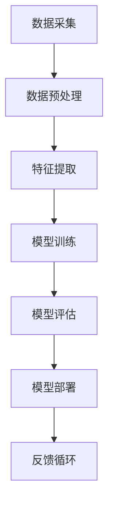
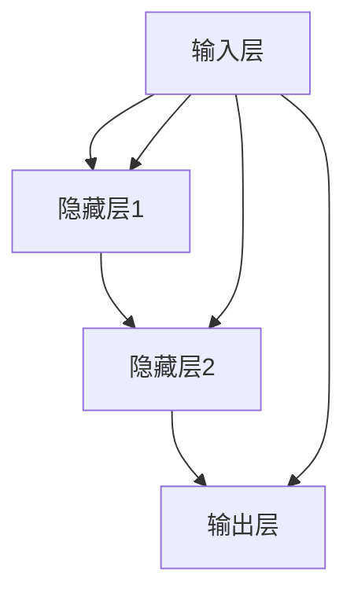
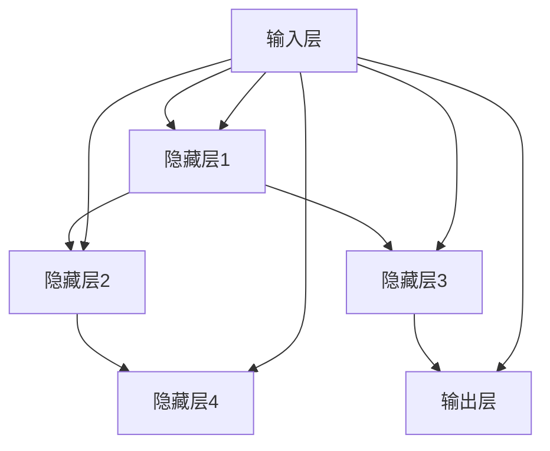
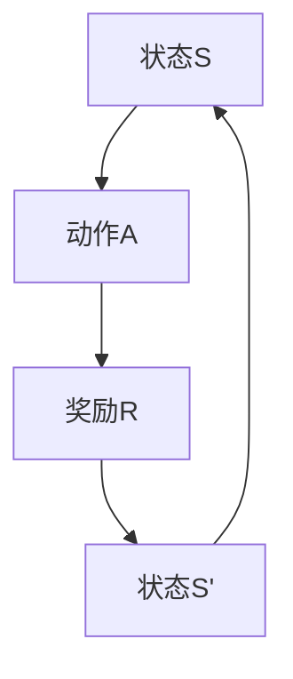

                 

# 行业Know-how：AI时代的个人竞争力

> 关键词：人工智能、个人竞争力、职业发展、技术趋势、学习策略

> 摘要：本文旨在探讨AI时代个人竞争力的关键要素，通过深入分析当前技术趋势、核心算法原理、数学模型及其应用场景，为读者提供系统化的学习和职业发展指导。本文将帮助您理解如何在快速发展的AI领域中保持领先，以及如何将个人技能与行业需求相结合，实现持续的职业成长。

## 1. 背景介绍

### 1.1 目的和范围

本文的目的在于为AI时代的个人竞争力提供系统性分析和实用建议。我们将重点关注以下几个方面：

- **技术趋势**：分析当前AI领域的热点和发展方向，帮助读者把握行业动态。
- **核心算法原理**：深入探讨AI的核心算法，包括神经网络、深度学习、强化学习等，通过伪代码讲解其工作原理。
- **数学模型**：介绍与AI相关的数学模型和公式，通过具体例子说明其在实际应用中的运用。
- **项目实战**：通过代码案例展示实际应用场景，让读者能够动手实践，加深理解。
- **工具和资源推荐**：推荐学习资源和开发工具，为读者提供全方位的支持。

### 1.2 预期读者

本文适合以下读者群体：

- **AI从业者**：希望提升自己在AI领域的专业知识和技能。
- **技术爱好者**：对人工智能技术有兴趣，希望深入了解相关技术原理和应用。
- **学生和研究者**：需要系统学习AI知识，准备从事相关研究或学术工作的学生和研究者。
- **职业规划者**：希望了解AI技术如何影响职业发展，以及如何提升个人竞争力。

### 1.3 文档结构概述

本文结构如下：

- **1. 背景介绍**：介绍本文的目的、预期读者和文档结构。
- **2. 核心概念与联系**：讨论AI领域的核心概念和架构，使用Mermaid流程图进行展示。
- **3. 核心算法原理与操作步骤**：详细解释AI核心算法的工作原理和操作步骤，使用伪代码阐述。
- **4. 数学模型和公式**：介绍与AI相关的数学模型和公式，通过实例进行说明。
- **5. 项目实战**：通过代码实际案例展示AI技术的应用。
- **6. 实际应用场景**：分析AI技术在现实世界中的应用。
- **7. 工具和资源推荐**：推荐学习资源和开发工具。
- **8. 总结**：总结未来发展趋势与挑战。
- **9. 附录**：常见问题与解答。
- **10. 扩展阅读**：提供进一步阅读的参考资料。

### 1.4 术语表

#### 1.4.1 核心术语定义

- **人工智能**：模拟人类智能行为，使计算机具有智能决策能力的科学技术。
- **神经网络**：由大量相互连接的节点（神经元）构成的系统，用于模拟人脑的运算过程。
- **深度学习**：一种基于神经网络的机器学习方法，通过多层神经网络对数据进行建模。
- **强化学习**：一种基于试错和奖励反馈的机器学习方法，用于决策制定和策略优化。
- **机器学习**：使计算机能够从数据中学习，改进自身性能的技术。

#### 1.4.2 相关概念解释

- **数据驱动**：基于数据进行分析和决策，而非依靠预先设定的规则。
- **模型驱动**：基于理论模型进行预测和优化，而非依赖历史数据。
- **算法**：解决问题的步骤和规则，用于在计算机中实现特定功能。

#### 1.4.3 缩略词列表

- **AI**：人工智能（Artificial Intelligence）
- **ML**：机器学习（Machine Learning）
- **DL**：深度学习（Deep Learning）
- **RL**：强化学习（Reinforcement Learning）
- **GPU**：图形处理器（Graphics Processing Unit）

## 2. 核心概念与联系

### 2.1 AI技术的核心架构

在探讨AI技术的核心概念之前，我们需要了解其基本的架构。以下是一个简单的Mermaid流程图，展示了AI系统的核心组件及其相互关系。



- **数据采集**：从各种来源收集数据，包括文本、图像、音频等。
- **数据预处理**：对数据进行清洗、归一化等处理，以消除噪声和异常值。
- **特征提取**：从原始数据中提取有意义的特征，用于训练模型。
- **模型训练**：使用训练数据训练模型，优化其参数。
- **模型评估**：评估模型在测试数据上的性能，调整模型参数。
- **模型部署**：将训练好的模型部署到实际应用环境中。
- **反馈循环**：根据实际应用中的反馈，不断优化模型和算法。

### 2.2 AI技术的核心算法

AI技术的核心算法包括神经网络、深度学习和强化学习等。以下是这些算法的基本原理和相互关系。

#### 2.2.1 神经网络

神经网络是一种模拟人脑的计算机模型，由大量相互连接的神经元组成。每个神经元接收多个输入，通过加权求和后传递给激活函数，最终产生输出。



#### 2.2.2 深度学习

深度学习是神经网络的一种扩展，通过多层神经网络对数据进行建模。深度学习的核心思想是让计算机自动提取数据中的高级特征。



#### 2.2.3 强化学习

强化学习是一种基于试错和奖励反馈的机器学习方法。它的目标是学习一种策略，以最大化长期奖励。



- **状态**（S）：系统的当前状态。
- **动作**（A）：系统可以执行的操作。
- **奖励**（R）：动作带来的即时奖励。
- **策略**：指导系统如何选择动作。

## 3. 核心算法原理与具体操作步骤

### 3.1 神经网络算法原理

神经网络是一种由大量神经元组成的计算模型，通过多层结构对输入数据进行处理，以实现分类、回归等任务。以下是神经网络算法的基本原理和操作步骤。

#### 3.1.1 基本原理

神经网络由以下几个部分组成：

- **输入层**：接收外部输入数据。
- **隐藏层**：对输入数据进行处理，提取特征。
- **输出层**：生成最终输出。

每个神经元接收来自前一层的多个输入，通过加权求和后传递给激活函数，最终产生输出。激活函数通常为非线性函数，如Sigmoid、ReLU等。

#### 3.1.2 操作步骤

1. **初始化参数**：设置神经网络的权重和偏置。
2. **前向传播**：将输入数据传递到神经网络，计算每一层的输出。
3. **反向传播**：计算输出层的误差，并反向传播到隐藏层，更新权重和偏置。
4. **迭代训练**：重复步骤2和3，直到满足停止条件（如误差收敛）。

以下是神经网络算法的伪代码：

```python
# 初始化参数
W = 初始化权重()
b = 初始化偏置()

# 前向传播
z = W * x + b
a = 激活函数(z)

# 反向传播
delta = (y - a) * 激活函数的导数(a)
dW = delta * x
db = delta

# 更新参数
W = W - 学习率 * dW
b = b - 学习率 * db
```

### 3.2 深度学习算法原理

深度学习是一种基于神经网络的机器学习方法，通过多层神经网络对数据进行建模。以下是深度学习算法的基本原理和操作步骤。

#### 3.2.1 基本原理

深度学习的基本原理与神经网络相似，但增加了多个隐藏层。通过多层神经网络，深度学习能够自动提取数据中的高级特征。

#### 3.2.2 操作步骤

1. **初始化参数**：设置神经网络的权重和偏置。
2. **前向传播**：将输入数据传递到神经网络，计算每一层的输出。
3. **反向传播**：计算输出层的误差，并反向传播到隐藏层，更新权重和偏置。
4. **迭代训练**：重复步骤2和3，直到满足停止条件（如误差收敛）。

以下是深度学习算法的伪代码：

```python
# 初始化参数
W = 初始化权重()
b = 初始化偏置()

# 前向传播
for 层 in 隐藏层:
    z = W * x + b
    a = 激活函数(z)

# 反向传播
for 层 in 隐藏层:
    delta = (y - a) * 激活函数的导数(a)
    dW = delta * x
    db = delta

# 更新参数
W = W - 学习率 * dW
b = b - 学习率 * db
```

### 3.3 强化学习算法原理

强化学习是一种基于试错和奖励反馈的机器学习方法，通过不断尝试和反馈，学习最优策略。以下是强化学习算法的基本原理和操作步骤。

#### 3.3.1 基本原理

强化学习由以下几个部分组成：

- **状态**（S）：系统的当前状态。
- **动作**（A）：系统可以执行的操作。
- **奖励**（R）：动作带来的即时奖励。
- **策略**：指导系统如何选择动作。

#### 3.3.2 操作步骤

1. **初始化状态**：选择初始状态。
2. **执行动作**：在当前状态下执行动作。
3. **获取奖励**：根据动作的结果，获取奖励。
4. **更新策略**：根据奖励和策略更新器，调整策略。
5. **重复步骤2-4**：不断执行动作，更新策略，直到达到目标状态。

以下是强化学习算法的伪代码：

```python
# 初始化状态
S = 初始化状态()

# 执行动作
A = 执行动作(S)

# 获取奖励
R = 获取奖励(A)

# 更新策略
策略(S, A, R)

# 重复步骤2-4
while 未达到目标状态:
    S = S'
    A = 执行动作(S)
    R = 获取奖励(A)
    策略(S, A, R)
```

## 4. 数学模型和公式及详细讲解

### 4.1 激活函数

激活函数是神经网络中的一个关键组成部分，用于将神经元的输入映射到输出。以下是几种常见的激活函数及其数学公式：

#### 4.1.1 Sigmoid函数

Sigmoid函数是一种常用的激活函数，用于将输入映射到（0, 1）区间。

$$
\sigma(x) = \frac{1}{1 + e^{-x}}
$$

#### 4.1.2ReLU函数

ReLU（Rectified Linear Unit）函数是一种非线性激活函数，其特点是在正数区域为线性，负数区域为0。

$$
\text{ReLU}(x) =
\begin{cases}
x & \text{if } x > 0 \\
0 & \text{otherwise}
\end{cases}
$$

#### 4.1.3 Tangent Hyperbolic（Tanh）函数

Tanh函数是一种将输入映射到（-1, 1）区间的激活函数。

$$
\tanh(x) = \frac{e^{2x} - 1}{e^{2x} + 1}
$$

### 4.2 损失函数

损失函数是评估模型预测结果与实际结果之间差异的函数。以下是几种常见的损失函数及其数学公式：

#### 4.2.1 均方误差（MSE）

均方误差（MSE）是评估回归问题中模型预测性能的常用损失函数。

$$
MSE = \frac{1}{n} \sum_{i=1}^{n} (y_i - \hat{y}_i)^2
$$

其中，$y_i$是实际值，$\hat{y}_i$是模型预测值，$n$是样本数量。

#### 4.2.2 交叉熵（Cross-Entropy）

交叉熵是评估分类问题中模型预测性能的常用损失函数。

$$
H(y, \hat{y}) = -\sum_{i=1}^{n} y_i \log(\hat{y}_i)
$$

其中，$y$是实际标签，$\hat{y}$是模型预测概率分布。

### 4.3 优化算法

优化算法用于调整神经网络的权重和偏置，以最小化损失函数。以下是几种常见的优化算法及其原理：

#### 4.3.1 梯度下降（Gradient Descent）

梯度下降是一种基于损失函数梯度进行参数更新的优化算法。

$$
w_{t+1} = w_t - \alpha \nabla_w J(w)
$$

其中，$w_t$是当前权重，$\alpha$是学习率，$J(w)$是损失函数。

#### 4.3.2 随机梯度下降（Stochastic Gradient Descent，SGD）

随机梯度下降是梯度下降的一种变体，每次迭代使用一个随机样本的梯度进行更新。

$$
w_{t+1} = w_t - \alpha \nabla_w J(w; x_t, y_t)
$$

其中，$x_t$和$y_t$是随机选取的样本。

#### 4.3.3 Adam优化器

Adam优化器是一种结合了SGD和动量法的自适应优化算法。

$$
m_t = \beta_1 m_{t-1} + (1 - \beta_1) \nabla_w J(w; x_t, y_t)
$$

$$
v_t = \beta_2 v_{t-1} + (1 - \beta_2) (\nabla_w J(w; x_t, y_t))^2
$$

$$
w_{t+1} = w_t - \alpha \frac{m_t}{\sqrt{v_t} + \epsilon}
$$

其中，$\beta_1$和$\beta_2$是动量参数，$\alpha$是学习率，$\epsilon$是常数。

### 4.4 示例说明

以下是一个使用Sigmoid激活函数和均方误差损失函数的神经网络训练过程的示例。

```python
import numpy as np

# 初始化参数
W = np.random.randn(n_hidden, n_input)
b = np.random.randn(n_hidden)

# 前向传播
z = np.dot(W.T, x) + b
a = 1 / (1 + np.exp(-z))

# 反向传播
delta = (y - a) * a * (1 - a)
dW = np.dot(delta.T, x)
db = delta

# 更新参数
W = W - learning_rate * dW
b = b - learning_rate * db
```

## 5. 项目实战：代码实际案例和详细解释说明

### 5.1 开发环境搭建

为了演示AI技术的实际应用，我们将使用Python语言搭建一个简单的神经网络，用于实现手写数字识别。以下步骤展示了如何搭建开发环境：

1. **安装Python**：确保您的计算机上已安装Python 3.x版本。
2. **安装库**：安装必要的库，如NumPy、TensorFlow和matplotlib。可以使用以下命令：
    ```shell
    pip install numpy tensorflow matplotlib
    ```

### 5.2 源代码详细实现和代码解读

以下是一个简单的手写数字识别神经网络实现。我们将使用TensorFlow库来构建和训练模型。

```python
import tensorflow as tf
import matplotlib.pyplot as plt
import numpy as np

# 加载数据集
mnist = tf.keras.datasets.mnist
(x_train, y_train), (x_test, y_test) = mnist.load_data()
x_train, x_test = x_train / 255.0, x_test / 255.0

# 构建模型
model = tf.keras.Sequential([
    tf.keras.layers.Flatten(input_shape=(28, 28)),
    tf.keras.layers.Dense(128, activation='relu'),
    tf.keras.layers.Dropout(0.2),
    tf.keras.layers.Dense(10, activation='softmax')
])

# 编译模型
model.compile(optimizer='adam',
              loss='sparse_categorical_crossentropy',
              metrics=['accuracy'])

# 训练模型
model.fit(x_train, y_train, epochs=5)

# 评估模型
test_loss, test_acc = model.evaluate(x_test, y_test, verbose=2)
print('\nTest accuracy:', test_acc)

# 可视化
plt.figure(figsize=(10, 10))
for i in range(25):
    plt.subplot(5, 5, i+1)
    plt.imshow(x_test[i], cmap=plt.cm.binary)
    plt.xticks([])
    plt.yticks([])
    plt.grid(False)
    plt.xlabel(np.argmax(model.predict(x_test[i]).numpy()))
plt.show()
```

#### 5.2.1 代码解读

- **数据加载**：使用TensorFlow内置的MNIST数据集，将其归一化至[0, 1]区间。
- **模型构建**：使用`tf.keras.Sequential`构建一个简单的神经网络，包含一个展平层、一个具有128个神经元的全连接层、一个丢弃层（用于减少过拟合）和一个具有10个神经元的输出层。
- **模型编译**：指定优化器、损失函数和评价指标。
- **模型训练**：使用训练数据进行5个周期的训练。
- **模型评估**：在测试数据上评估模型的准确率。
- **可视化**：绘制测试数据的预测结果，展示模型的表现。

### 5.3 代码解读与分析

该代码实现了基于TensorFlow的手写数字识别模型。以下是对关键步骤的分析：

- **数据预处理**：数据集加载后，使用`/255.0`进行归一化处理，使其适应模型训练。
- **模型架构**：模型采用简单的结构，适用于小规模的数据集。展平层将28x28的图像转换为1维向量。全连接层用于特征提取和分类。丢弃层有助于减少过拟合。
- **优化器和损失函数**：选择Adam优化器，其自适应学习率有助于加速收敛。使用`sparse_categorical_crossentropy`作为损失函数，适用于多分类问题。
- **训练与评估**：通过5个周期的训练，模型在测试数据上达到较高的准确率。可视化部分展示了模型的预测结果，进一步验证了模型的性能。

## 6. 实际应用场景

AI技术已在各行各业得到广泛应用，以下列举几个典型应用场景：

### 6.1 医疗保健

- **疾病诊断**：通过分析医学影像和患者数据，AI系统可以帮助医生进行疾病诊断，提高诊断准确率。
- **个性化治疗**：基于患者的基因组信息和历史病历，AI系统可以为患者提供个性化的治疗方案。

### 6.2 金融领域

- **风险管理**：AI算法可以分析大量金融数据，预测市场趋势，为金融机构提供风险管理建议。
- **智能投顾**：通过分析用户的投资偏好和风险承受能力，AI系统可以为用户提供个性化的投资建议。

### 6.3 交通出行

- **自动驾驶**：自动驾驶技术利用AI算法，通过传感器和环境感知实现车辆的自主驾驶。
- **智能交通管理**：AI技术可以分析交通流量数据，优化交通信号，减少拥堵。

### 6.4 教育领域

- **个性化学习**：AI系统可以根据学生的学习进度和表现，为学生提供个性化的学习建议。
- **智能评测**：AI算法可以自动批改作业，提供即时反馈，帮助教师减轻工作负担。

## 7. 工具和资源推荐

### 7.1 学习资源推荐

#### 7.1.1 书籍推荐

- **《深度学习》**：Goodfellow、Bengio和Courville合著，是深度学习领域的经典教材。
- **《Python机器学习》**：Sebastian Raschka和Vahid Mirjalili编写的实用指南，适合初学者。

#### 7.1.2 在线课程

- **Coursera的《深度学习》**：由Andrew Ng教授主讲，适合从基础到进阶的学习。
- **edX的《机器学习》**：由Yaser Abu-Mostafa教授主讲，提供全面的ML和DL课程。

#### 7.1.3 技术博客和网站

- **Medium上的AI专栏**：包括许多深度学习、机器学习的优质文章。
- **TensorFlow官方文档**：提供详尽的API和教程，是学习TensorFlow的最佳资源。

### 7.2 开发工具框架推荐

#### 7.2.1 IDE和编辑器

- **PyCharm**：功能强大的Python IDE，适用于开发和调试。
- **Jupyter Notebook**：适用于数据科学和机器学习项目，易于分享和复现。

#### 7.2.2 调试和性能分析工具

- **TensorBoard**：TensorFlow的内置可视化工具，用于分析和调试模型。
- **NVIDIA Nsight**：用于GPU性能分析和优化。

#### 7.2.3 相关框架和库

- **TensorFlow**：Google开发的深度学习框架，适用于各种任务。
- **PyTorch**：Facebook开发的深度学习框架，具有简洁的API和动态计算图。

### 7.3 相关论文著作推荐

#### 7.3.1 经典论文

- **“Backpropagation”**：Rumelhart, Hinton和Williams于1986年发表，介绍了反向传播算法。
- **“Deep Learning”**：Goodfellow、Bengio和Courville于2016年发表，系统地介绍了深度学习的基本概念。

#### 7.3.2 最新研究成果

- **“Generative Adversarial Nets”**：Ian J. Goodfellow等人在2014年发表，介绍了生成对抗网络（GAN）。
- **“Attention Is All You Need”**：Vaswani等人在2017年发表，介绍了Transformer模型。

#### 7.3.3 应用案例分析

- **“DeepMind的AlphaGo”**：DeepMind开发的AlphaGo在2016年击败了围棋世界冠军李世石，展示了深度学习和强化学习的强大能力。

## 8. 总结：未来发展趋势与挑战

AI技术在快速发展的同时，也面临着诸多挑战。未来，以下趋势和挑战值得关注：

### 8.1 发展趋势

- **算法优化**：随着硬件性能的提升，深度学习算法将进一步优化，提高模型效率和准确性。
- **泛化能力提升**：通过强化学习和迁移学习等技术，提高模型在不同数据集上的泛化能力。
- **多模态数据处理**：结合多种数据类型（如文本、图像、音频等），实现更丰富的应用场景。

### 8.2 挑战

- **数据隐私**：如何在保护用户隐私的前提下，充分利用数据价值，是AI领域的重要挑战。
- **算法公平性**：避免算法偏见，确保公平性和透明度，是AI应用的关键问题。
- **人才短缺**：随着AI技术的快速发展，行业对高素质AI人才的需求日益增长，但人才供应不足。

## 9. 附录：常见问题与解答

### 9.1 问题1：如何入门AI？

**解答**：入门AI可以从以下几个步骤开始：

1. **学习基础数学**：掌握线性代数、概率论和微积分等数学知识。
2. **学习编程**：学习Python等编程语言，熟悉常用数据结构和算法。
3. **学习基础知识**：通过在线课程、书籍等资源，了解AI的基本概念和原理。
4. **实践项目**：通过实际项目，将所学知识应用于实际问题。

### 9.2 问题2：如何提升AI模型的性能？

**解答**：提升AI模型性能可以从以下几个方面着手：

1. **数据预处理**：确保数据质量，减少噪声和异常值。
2. **特征工程**：提取有意义的特征，提高模型的泛化能力。
3. **模型优化**：尝试不同的模型架构和优化算法，寻找最优解。
4. **调参**：通过调整模型参数，如学习率、隐藏层大小等，提高模型性能。

## 10. 扩展阅读 & 参考资料

- **《深度学习》**：Goodfellow、Bengio和Courville著，全面介绍深度学习的基本概念和技术。
- **《Python机器学习》**：Sebastian Raschka和Vahid Mirjalili著，详细讲解机器学习的应用和实现。
- **[TensorFlow官方文档](https://www.tensorflow.org/)**：提供TensorFlow框架的详细教程和API文档。
- **[PyTorch官方文档](https://pytorch.org/docs/stable/)**：提供PyTorch框架的详细教程和API文档。
- **[Kaggle竞赛平台](https://www.kaggle.com/)**：提供丰富的AI竞赛和项目资源，是实践和提升技能的好去处。
- **[Medium上的AI专栏](https://medium.com/topic/artificial-intelligence)**：包含许多关于AI的最新研究成果和应用案例。

