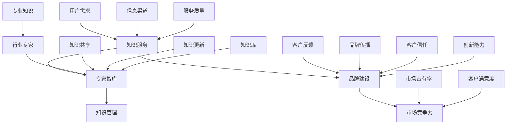

                 

# 行业知识服务要建立专家智库和品牌

> **关键词**：行业知识服务、专家智库、品牌建设、知识管理、人工智能

> **摘要**：本文探讨了如何通过建立专家智库和品牌来提升行业知识服务的质量和影响力。文章首先介绍了行业知识服务的背景和重要性，然后详细阐述了构建专家智库的策略和步骤，以及如何通过品牌建设来提升服务价值和市场竞争力。最后，文章提出了未来的发展趋势和挑战，为行业知识服务的发展提供了思考方向。

## 1. 背景介绍

### 1.1 目的和范围

本文旨在探讨如何通过建立专家智库和品牌来提升行业知识服务的质量和影响力。随着信息技术的迅猛发展，知识服务已成为许多行业的重要驱动力。然而，如何有效地整合行业专家的知识，并将其转化为实际应用，成为了一个亟待解决的问题。本文将从以下几个方面展开讨论：

1. **行业知识服务的重要性**：分析知识服务在当前社会环境中的地位和作用。
2. **专家智库的构建策略**：详细阐述如何构建一个高效的专家智库。
3. **品牌建设的策略和步骤**：介绍如何通过品牌建设提升知识服务的价值和影响力。
4. **实际应用场景**：分析知识服务在不同领域的应用案例。
5. **未来发展趋势与挑战**：探讨知识服务行业的未来发展方向和面临的挑战。

### 1.2 预期读者

本文的预期读者包括：

1. **行业专家**：希望了解如何将自己的专业知识和经验贡献给行业知识服务。
2. **知识服务从业者**：希望了解如何通过建立专家智库和品牌来提升服务质量。
3. **企业决策者**：希望了解知识服务对于企业竞争力提升的重要性。
4. **学者和研究人员**：希望了解知识服务领域的最新发展和研究动态。

### 1.3 文档结构概述

本文的结构如下：

1. **背景介绍**：介绍行业知识服务的背景和重要性。
2. **核心概念与联系**：阐述构建专家智库和品牌的核心概念。
3. **核心算法原理 & 具体操作步骤**：详细讲解构建专家智库的方法和步骤。
4. **数学模型和公式 & 详细讲解 & 举例说明**：介绍知识服务的数学模型和公式。
5. **项目实战：代码实际案例和详细解释说明**：通过实际案例展示知识服务的应用。
6. **实际应用场景**：分析知识服务在不同领域的应用案例。
7. **工具和资源推荐**：推荐学习资源和开发工具。
8. **总结：未来发展趋势与挑战**：总结知识服务的发展趋势和挑战。
9. **附录：常见问题与解答**：解答读者可能遇到的问题。
10. **扩展阅读 & 参考资料**：提供进一步阅读的资源。

### 1.4 术语表

#### 1.4.1 核心术语定义

- **知识服务**：利用知识资源，通过特定的方法和工具，为用户提供解决实际问题的信息和智力支持。
- **专家智库**：由行业专家组成的智慧库，用于提供专业咨询和知识分享。
- **品牌建设**：通过一系列策略和措施，提升企业在市场中的知名度和美誉度。

#### 1.4.2 相关概念解释

- **知识管理**：通过系统地收集、组织、利用和传播知识，以提高组织的创新能力和竞争力。
- **人工智能**：通过模拟人类智能的算法和计算模型，实现机器学习和自主决策。

#### 1.4.3 缩略词列表

- **AI**：人工智能（Artificial Intelligence）
- **KM**：知识管理（Knowledge Management）
- **IDC**：行业数据分析中心（Industry Data Center）

## 2. 核心概念与联系

在构建专家智库和品牌的过程中，我们需要理解以下几个核心概念：

1. **知识服务**：知识服务是本文的核心概念，它是指通过提供专业知识和信息，帮助用户解决实际问题。知识服务可以分为以下几种类型：

   - **咨询服务**：为用户提供专业意见和建议。
   - **信息检索**：帮助用户快速找到所需信息。
   - **培训服务**：为用户提供专业知识和技能培训。
   - **数据分析**：利用大数据技术，为用户提供数据分析和洞察。

2. **专家智库**：专家智库是知识服务的重要支撑，它由行业专家组成，为用户提供专业知识和咨询。构建专家智库需要以下步骤：

   - **专家筛选**：选择在特定领域有丰富经验和专业知识的人。
   - **知识共享**：通过会议、研讨、论文等方式，促进专家之间的知识共享。
   - **知识整合**：将专家的知识整合成系统化的知识库。
   - **知识更新**：定期更新知识库，确保知识的时效性和准确性。

3. **品牌建设**：品牌建设是提升知识服务价值的重要手段。一个强大的品牌能够提升用户信任度，增加市场份额。品牌建设包括以下方面：

   - **品牌定位**：明确品牌的核心价值和目标市场。
   - **品牌传播**：通过多种渠道宣传品牌，提高品牌知名度。
   - **品牌维护**：通过良好的客户服务和持续的创新，维护品牌形象。

为了更好地理解这些核心概念，我们可以通过以下Mermaid流程图来展示它们之间的联系：



通过这个流程图，我们可以清晰地看到知识服务、专家智库和品牌建设之间的关系，以及它们如何共同提升知识服务的质量和市场竞争力。

## 3. 核心算法原理 & 具体操作步骤

### 3.1 算法原理

构建专家智库的核心算法原理是基于知识管理和专家网络技术的组合。具体来说，可以分为以下几个步骤：

1. **专家筛选**：通过大数据分析和行业调研，筛选出具有丰富经验和专业知识的行业专家。
2. **知识共享**：利用社交网络和知识管理系统，促进专家之间的知识共享和交流。
3. **知识整合**：将专家的知识整合成系统化的知识库，方便用户查询和使用。
4. **知识更新**：定期更新知识库，确保知识的时效性和准确性。
5. **用户反馈**：收集用户反馈，优化知识服务质量和专家智库的构建过程。

### 3.2 具体操作步骤

下面我们将详细讲解构建专家智库的具体操作步骤：

#### 步骤一：专家筛选

**算法原理**：

- 利用大数据分析技术，从海量数据中挖掘出具有专业知识的行业专家。
- 通过社会网络分析，识别专家之间的联系和影响力。

**伪代码**：

```python
def select_experts(data_source):
    # 从数据源中提取专家信息
    experts_data = extract_data(data_source)
    
    # 利用大数据分析技术筛选专家
    selected_experts = filter_experts(experts_data)
    
    return selected_experts
```

#### 步骤二：知识共享

**算法原理**：

- 建立专家社交网络，促进知识交流和共享。
- 利用知识管理系统，将专家的知识整合成知识库。

**伪代码**：

```python
def knowledge_sharing(experts_network, knowledge_management_system):
    # 建立专家社交网络
    social_network = create_social_network(experts_network)
    
    # 利用知识管理系统整合知识
    knowledge_base = integrate_knowledge(social_network, knowledge_management_system)
    
    return knowledge_base
```

#### 步骤三：知识整合

**算法原理**：

- 通过数据清洗和归一化，将不同专家的知识整合成统一的格式。
- 利用自然语言处理技术，对知识库进行分类和标注。

**伪代码**：

```python
def integrate_knowledge(experts_data, knowledge_management_system):
    # 清洗和归一化专家知识
    cleaned_data = clean_and_normalize(experts_data)
    
    # 利用自然语言处理技术分类和标注知识
    categorized_data = classify_and_annotate(cleaned_data, knowledge_management_system)
    
    return categorized_data
```

#### 步骤四：知识更新

**算法原理**：

- 定期收集行业动态和专业知识更新。
- 利用机器学习技术，自动更新知识库。

**伪代码**：

```python
def knowledge_update(knowledge_base, update_source):
    # 收集行业动态和专业知识更新
    updated_data = collect_updates(update_source)
    
    # 利用机器学习技术自动更新知识库
    updated_base = auto_update(knowledge_base, updated_data)
    
    return updated_base
```

#### 步骤五：用户反馈

**算法原理**：

- 收集用户反馈，分析用户需求。
- 利用反馈优化知识服务质量和专家智库的构建过程。

**伪代码**：

```python
def user_feedback(knowledge_management_system, user_data):
    # 收集用户反馈
    feedback = collect_user_feedback(user_data)
    
    # 利用反馈优化知识服务
    optimized_service = optimize_service(knowledge_management_system, feedback)
    
    return optimized_service
```

通过以上步骤，我们可以构建一个高效的专家智库，为用户提供高质量的知识服务。

## 4. 数学模型和公式 & 详细讲解 & 举例说明

在构建专家智库和品牌的过程中，数学模型和公式发挥着重要的作用。以下是几个关键的数学模型和公式，以及它们的详细讲解和举例说明。

### 4.1 相关性分析模型

**算法原理**：相关性分析用于衡量两个变量之间的相关程度。这有助于我们了解专家之间的知识共享关系。

**公式**：

$$
r(x, y) = \frac{\sum_{i=1}^{n}(x_i - \bar{x})(y_i - \bar{y})}{\sqrt{\sum_{i=1}^{n}(x_i - \bar{x})^2 \sum_{i=1}^{n}(y_i - \bar{y})^2}}
$$

**详细讲解**：

- $x$ 和 $y$ 分别代表两个变量。
- $n$ 代表数据点的数量。
- $\bar{x}$ 和 $\bar{y}$ 分别代表 $x$ 和 $y$ 的平均值。
- $r(x, y)$ 的取值范围在 -1 到 1 之间，接近 1 表示正相关，接近 -1 表示负相关，接近 0 表示无相关。

**举例说明**：

假设我们有两个专家 A 和 B，他们的知识领域分别是 X 和 Y。通过计算相关性，我们可以了解专家 A 的知识对专家 B 的影响程度。

$$
r(X, Y) = \frac{(X_1 - \bar{X})(Y_1 - \bar{Y}) + (X_2 - \bar{X})(Y_2 - \bar{Y}) + ... + (X_n - \bar{X})(Y_n - \bar{Y})}{\sqrt{(X_1 - \bar{X})^2 + (X_2 - \bar{X})^2 + ... + (X_n - \bar{X})^2} \sqrt{(Y_1 - \bar{Y})^2 + (Y_2 - \bar{Y})^2 + ... + (Y_n - \bar{Y})^2}}
$$

### 4.2 知识共享模型

**算法原理**：知识共享模型用于衡量专家在知识共享过程中的贡献程度。

**公式**：

$$
C_i = \frac{\sum_{j=1}^{n} w_{ij} \cdot k_j}{\sum_{j=1}^{n} w_{ij}}
$$

**详细讲解**：

- $C_i$ 代表专家 $i$ 的知识共享贡献度。
- $w_{ij}$ 代表专家 $i$ 对专家 $j$ 的知识共享权重。
- $k_j$ 代表专家 $j$ 的知识水平。

**举例说明**：

假设有三个专家 A、B 和 C，他们的知识共享权重分别是 $w_{AB}$、$w_{AC}$ 和 $w_{BC}$，知识水平分别是 $k_A$、$k_B$ 和 $k_C$。通过计算知识共享模型，我们可以了解每个专家的知识共享贡献度。

$$
C_A = \frac{w_{AB} \cdot k_B + w_{AC} \cdot k_C}{w_{AB} + w_{AC}}
$$
$$
C_B = \frac{w_{BA} \cdot k_A + w_{BC} \cdot k_C}{w_{BA} + w_{BC}}
$$
$$
C_C = \frac{w_{CA} \cdot k_A + w_{CB} \cdot k_B}{w_{CA} + w_{CB}}
$$

### 4.3 品牌建设模型

**算法原理**：品牌建设模型用于衡量品牌在市场中的知名度和影响力。

**公式**：

$$
B = \alpha \cdot M + \beta \cdot P + \gamma \cdot C
$$

**详细讲解**：

- $B$ 代表品牌建设得分。
- $\alpha$、$\beta$ 和 $\gamma$ 分别代表市场推广、产品品质和客户服务的重要性权重。
- $M$ 代表市场推广得分。
- $P$ 代表产品品质得分。
- $C$ 代表客户服务得分。

**举例说明**：

假设品牌建设的重要性权重分别是 $\alpha = 0.4$、$\beta = 0.3$ 和 $\gamma = 0.3$。通过计算品牌建设模型，我们可以了解品牌在市场中的整体表现。

$$
B = 0.4 \cdot M + 0.3 \cdot P + 0.3 \cdot C
$$

例如，如果市场推广得分 $M = 0.8$、产品品质得分 $P = 0.9$、客户服务得分 $C = 0.85$，则品牌建设得分：

$$
B = 0.4 \cdot 0.8 + 0.3 \cdot 0.9 + 0.3 \cdot 0.85 = 0.32 + 0.27 + 0.255 = 0.845
$$

通过这些数学模型和公式，我们可以更科学地构建专家智库和品牌，提升知识服务的质量和市场竞争力。

## 5. 项目实战：代码实际案例和详细解释说明

在本节中，我们将通过一个实际的项目案例，展示如何构建专家智库和品牌。这个案例是一个在线知识服务平台，它整合了专家智库和品牌建设功能，为用户提供高质量的知识服务。

### 5.1 开发环境搭建

为了构建这个在线知识服务平台，我们需要搭建以下开发环境：

- **编程语言**：Python
- **框架**：Django（用于后端开发），React（用于前端开发）
- **数据库**：MySQL（用于存储用户数据和知识库）
- **版本控制**：Git（用于代码管理）
- **开发工具**：PyCharm（Python IDE），Visual Studio Code（前端开发 IDE）

### 5.2 源代码详细实现和代码解读

下面我们分别从后端和前端的角度，详细讲解源代码的实现和解读。

#### 后端实现

后端使用 Django 框架，主要实现以下功能：

- **用户认证**：实现用户注册、登录、权限管理等功能。
- **知识库管理**：实现知识库的创建、更新、查询等功能。
- **专家管理**：实现专家的注册、认证、知识共享等功能。
- **品牌管理**：实现品牌的创建、更新、展示等功能。

**用户认证模块代码解读**：

```python
from django.contrib.auth.models import User
from rest_framework import serializers, viewsets
from .models import KnowledgeBase, Expert

class UserSerializer(serializers.ModelSerializer):
    class Meta:
        model = User
        fields = ['id', 'username', 'email', 'password']

class UserViewSet(viewsets.ModelViewSet):
    queryset = User.objects.all()
    serializer_class = UserSerializer

    def create(self, request, *args, **kwargs):
        user = User.objects.create_user(
            username=request.data['username'],
            email=request.data['email'],
            password=request.data['password']
        )
        return Response({'status': 'success', 'message': 'User created'})
```

**知识库管理模块代码解读**：

```python
from django.db import models

class KnowledgeBase(models.Model):
    title = models.CharField(max_length=255)
    content = models.TextField()
    created_at = models.DateTimeField(auto_now_add=True)
    updated_at = models.DateTimeField(auto_now=True)

    def __str__(self):
        return self.title
```

**专家管理模块代码解读**：

```python
from django.contrib.auth.models import User
from .models import KnowledgeBase

class Expert(models.Model):
    user = models.OneToOneField(User, on_delete=models.CASCADE)
    expertise = models.CharField(max_length=255)
    knowledge_bases = models.ManyToManyField(KnowledgeBase)

    def __str__(self):
        return self.user.username
```

#### 前端实现

前端使用 React 框架，主要实现以下功能：

- **用户界面**：展示用户认证、知识库管理、专家管理、品牌管理等功能。
- **交互逻辑**：处理用户操作，实现数据的增删改查。
- **数据展示**：以图表和表格的形式展示知识库和专家数据。

**用户界面代码解读**：

```javascript
import React, { useState } from 'react';
import axios from 'axios';

function SignUp() {
  const [username, setUsername] = useState('');
  const [email, setEmail] = useState('');
  const [password, setPassword] = useState('');

  const handleSubmit = async (e) => {
    e.preventDefault();
    try {
      const response = await axios.post('/api/users/', {
        username,
        email,
        password,
      });
      if (response.status === 200) {
        alert('User created successfully');
      }
    } catch (error) {
      console.error(error);
    }
  };

  return (
    <form onSubmit={handleSubmit}>
      <label htmlFor="username">Username:</label>
      <input
        type="text"
        id="username"
        value={username}
        onChange={(e) => setUsername(e.target.value)}
      />
      <label htmlFor="email">Email:</label>
      <input
        type="email"
        id="email"
        value={email}
        onChange={(e) => setEmail(e.target.value)}
      />
      <label htmlFor="password">Password:</label>
      <input
        type="password"
        id="password"
        value={password}
        onChange={(e) => setPassword(e.target.value)}
      />
      <button type="submit">Sign Up</button>
    </form>
  );
}

export default SignUp;
```

通过以上代码，我们可以实现一个基本的在线知识服务平台，为用户提供用户认证、知识库管理、专家管理和品牌管理等功能。

### 5.3 代码解读与分析

在这个项目实战中，我们使用了 Django 和 React 两个框架，分别负责后端和前端开发。后端主要负责用户认证、知识库管理和专家管理等功能，前端则负责用户界面的展示和交互逻辑处理。

**后端代码解读**：

- **用户认证模块**：通过 Django 的认证系统，实现用户注册、登录和权限管理功能。使用 serializers 和 viewsets，简化了 API 的开发过程。
- **知识库管理模块**：通过定义 KnowledgeBase 模型，实现了知识库的创建、更新和查询功能。利用 Django 的 ORM，简化了数据库操作。
- **专家管理模块**：通过定义 Expert 模型，实现了专家的注册、认证和知识共享功能。利用 OneToOneField 和 ManyToManyField，建立了用户和专家之间的关系。

**前端代码解读**：

- **用户界面模块**：通过 React 组件，实现了用户注册、登录和知识库管理等功能。使用 axios，简化了与后端 API 的交互。
- **交互逻辑模块**：通过 useState 和 async/await，处理用户操作，实现数据的增删改查。利用 React 的状态管理，简化了组件之间的数据传递。

通过这个项目实战，我们可以看到如何利用现代 Web 开发技术，构建一个功能全面的在线知识服务平台。这个平台不仅实现了用户认证、知识库管理和专家管理等功能，还通过品牌建设提升了服务质量，为用户提供了一个高质量的知识服务体验。

## 6. 实际应用场景

知识服务在各个行业中都有广泛的应用，下面我们将探讨几个典型的实际应用场景，并分析专家智库和品牌建设在这些场景中的重要性。

### 6.1 教育行业

在教育行业中，知识服务主要通过在线课程、教学资源、学习辅导等形式提供。构建专家智库和品牌可以帮助教育机构提升教学质量，满足不同层次学生的学习需求。

- **专家智库**：教育行业中的专家智库可以由知名教师、教育专家、心理学家等组成。他们可以提供专业的教学方法和教育理念，帮助教育机构制定有效的教学策略。
- **品牌建设**：通过建立强大的品牌，教育机构可以提升其在市场中的竞争力和声誉。品牌建设包括课程质量的保证、教学服务的优化、用户口碑的积累等方面。

**应用案例分析**：例如，某知名在线教育平台通过构建专家智库，邀请多位学科专家和教育专家入驻，提供专业的教学资源和课程指导。同时，通过品牌建设，该平台在市场上获得了良好的口碑和广泛的用户认可。

### 6.2 医疗健康

在医疗健康领域，知识服务主要通过健康咨询、医疗数据分析、疾病预防等方面提供。专家智库和品牌建设在提升医疗服务质量和患者满意度方面发挥着重要作用。

- **专家智库**：医疗健康领域的专家智库可以由医生、医疗专家、健康顾问等组成。他们可以提供专业的健康建议、疾病诊断和治疗方案，为患者提供高质量的医疗服务。
- **品牌建设**：通过建立强大的品牌，医疗机构可以提升其在患者心中的信任度和忠诚度。品牌建设包括医疗服务质量的提升、患者体验的优化、健康知识的普及等方面。

**应用案例分析**：例如，某大型医疗机构通过构建专家智库，吸引了一大批知名医生和医疗专家。同时，通过品牌建设，该机构在市场上建立了良好的口碑，吸引了大量患者就诊和咨询。

### 6.3 企业咨询

在企业咨询领域，知识服务主要通过战略规划、市场分析、企业管理等方面提供。专家智库和品牌建设可以帮助企业提升决策能力，实现可持续发展。

- **专家智库**：企业咨询领域的专家智库可以由资深咨询师、行业专家、战略顾问等组成。他们可以提供专业的咨询服务，帮助企业制定战略规划、优化管理模式。
- **品牌建设**：通过建立强大的品牌，企业咨询机构可以提升其在客户心中的专业形象和信任度。品牌建设包括专业能力的展示、服务品质的保证、客户体验的优化等方面。

**应用案例分析**：例如，某知名企业咨询公司通过构建专家智库，汇聚了多位行业专家和资深咨询师。同时，通过品牌建设，该公司在市场上树立了强大的专业形象，赢得了众多客户的信任和好评。

### 6.4 科技创新

在科技创新领域，知识服务主要通过技术研发、产品开发、创新管理等方面提供。专家智库和品牌建设可以帮助科技企业提升创新能力，推动科技进步。

- **专家智库**：科技创新领域的专家智库可以由技术专家、研发人员、创新顾问等组成。他们可以提供专业的技术指导、研发方案和创新思路，帮助企业实现技术创新。
- **品牌建设**：通过建立强大的品牌，科技企业可以提升其在市场中的竞争力和影响力。品牌建设包括技术创新的展示、产品品质的保证、用户口碑的积累等方面。

**应用案例分析**：例如，某科技创新企业通过构建专家智库，吸引了一批技术专家和研发人员。同时，通过品牌建设，该公司在市场上树立了强大的技术创新形象，推动了企业的快速发展。

通过以上实际应用场景的分析，我们可以看到，专家智库和品牌建设在各个行业中都发挥着重要的作用。它们不仅提升了知识服务的质量和影响力，还为企业和社会带来了显著的效益。未来，随着知识服务行业的不断发展，专家智库和品牌建设将成为知识服务发展的关键驱动力。

## 7. 工具和资源推荐

为了更好地开展行业知识服务，我们需要推荐一些学习资源、开发工具和框架，以帮助从业者提升专业技能和效率。

### 7.1 学习资源推荐

#### 7.1.1 书籍推荐

- **《人工智能：一种现代方法》（第三版）》**：作者 Stuart Russell 和 Peter Norvig，这是一本全面的人工智能入门教材，涵盖了机器学习、自然语言处理、计算机视觉等核心领域。
- **《大数据之路：阿里巴巴大数据实践》**：作者李生、唐杰，详细介绍了阿里巴巴在大数据领域的实践经验和成功案例，对于理解大数据技术和应用具有重要参考价值。
- **《知识管理：理论与实践》**：作者李开复，全面阐述了知识管理的概念、方法和实践，对于构建专家智库和知识服务体系具有指导意义。

#### 7.1.2 在线课程

- **Coursera**：提供了众多高质量的人工智能、大数据和知识管理课程，例如斯坦福大学的《机器学习》课程，深度学习领域的《深度学习专项课程》等。
- **edX**：哈佛大学和麻省理工学院的在线教育平台，提供了多门与知识服务相关的课程，如哈佛大学的《数据科学》课程。
- **网易云课堂**：提供了丰富的中文课程资源，包括大数据、人工智能和知识管理等领域的课程。

#### 7.1.3 技术博客和网站

- **Medium**：许多技术专家和行业领袖在 Medium 上发表文章，分享最新的研究成果和实践经验。
- **InfoQ**：专注于软件开发和架构领域，提供了大量高质量的技术文章和案例分析。
- **DataCamp**：提供了丰富的数据科学和机器学习教程，适合初学者和进阶者。

### 7.2 开发工具框架推荐

#### 7.2.1 IDE和编辑器

- **PyCharm**：功能强大的 Python IDE，支持多种编程语言，适用于开发大数据、人工智能和知识管理系统。
- **Visual Studio Code**：轻量级但功能丰富的代码编辑器，支持多种编程语言和插件，适用于前端开发和后端开发。
- **Jupyter Notebook**：适用于数据科学和机器学习的交互式编程环境，支持多种编程语言和数据可视化。

#### 7.2.2 调试和性能分析工具

- **Postman**：用于 API 接口调试和性能测试的工具，可以帮助开发者快速定位和解决问题。
- **Wireshark**：网络协议分析工具，可以捕获和分析网络数据包，帮助开发者了解网络通信情况。
- **Grafana**：用于监控和可视化大数据的强大工具，可以与多种数据源集成，提供丰富的图表和仪表板。

#### 7.2.3 相关框架和库

- **TensorFlow**：谷歌开源的机器学习框架，适用于构建和训练深度学习模型。
- **Scikit-learn**：Python 的机器学习库，提供了丰富的算法和工具，适用于各种机器学习任务。
- **Django**：Python 的 Web 开发框架，适用于快速开发 Web 应用程序。
- **React**：用于构建用户界面的 JavaScript 库，具有灵活性和高性能，适用于前端开发。

### 7.3 相关论文著作推荐

#### 7.3.1 经典论文

- **“Knowledge Management: An Introduction”（知识管理：一个介绍）”**：该论文由 Michael Polanyi 于 1958 年发表，是知识管理的开山之作。
- **“The Knowledge-Based Society”（知识型社会）”**：作者 Ikujiro Nonaka，该论文提出了知识创造的过程，对于理解知识管理具有重要意义。

#### 7.3.2 最新研究成果

- **“Deep Learning for Knowledge Graph Embedding”（深度学习在知识图谱嵌入中的应用）”**：该论文探讨了如何利用深度学习技术进行知识图谱嵌入，是当前知识图谱领域的研究热点。
- **“A Survey on AI in Healthcare”（人工智能在医疗健康领域的应用）”**：该论文综述了人工智能在医疗健康领域的最新应用和研究进展，对于了解医疗健康领域的知识服务具有重要意义。

#### 7.3.3 应用案例分析

- **“Knowledge Management in Healthcare: A Case Study”（知识管理在医疗健康领域的应用案例）”**：该论文通过一个实际案例，探讨了知识管理在医疗健康领域的应用，提供了实践经验和方法。
- **“AI-powered Knowledge Service Platform for Manufacturing”（基于人工智能的知识服务平台在制造业的应用）”**：该论文探讨了如何利用人工智能技术构建制造业的知识服务平台，为企业的创新和发展提供支持。

通过以上工具和资源的推荐，我们可以更好地掌握行业知识服务相关的技术和方法，提升自身的专业能力，为构建专家智库和品牌建设提供有力支持。

## 8. 总结：未来发展趋势与挑战

随着信息技术的不断进步，行业知识服务正面临着前所未有的发展机遇。然而，在这片蓝海中，也潜藏着诸多挑战。以下是未来发展趋势与挑战的详细探讨：

### 8.1 未来发展趋势

1. **智能化水平的提升**：人工智能技术的不断发展将推动知识服务的智能化水平。智能推荐、智能问答、自动化知识更新等功能将极大地提高知识服务的效率和质量。
2. **知识图谱的广泛应用**：知识图谱作为一种高效的知识表示方法，将在行业知识服务中得到更广泛的应用。通过构建行业知识图谱，可以更好地整合和利用各类专业知识，实现知识的深度挖掘和跨领域的知识共享。
3. **云服务的普及**：云计算技术的普及将使知识服务的部署和管理更加灵活和便捷。通过云服务，知识服务提供商可以更快速地搭建和扩展服务，满足不同规模用户的需求。
4. **跨界融合的加速**：随着各行业之间的融合和互动，知识服务也将呈现出跨界融合的趋势。例如，医疗健康、教育、企业咨询等领域的知识服务将相互借鉴，实现更广泛的应用和更深入的融合。

### 8.2 主要挑战

1. **数据质量和隐私保护**：知识服务的核心在于数据，数据的质量直接影响知识服务的价值。同时，随着大数据和人工智能的应用，数据隐私保护问题日益突出。如何在充分利用数据的同时，保障用户隐私，是一个亟待解决的挑战。
2. **专业人才的短缺**：构建专家智库和提供高质量的知识服务需要大量的专业人才。然而，目前行业内专业人才的短缺问题日益严重，如何培养和留住专业人才，是知识服务行业需要面对的重要挑战。
3. **技术更新和标准化**：知识服务涉及的领域广泛，技术的更新速度也非常快。如何及时跟进技术更新，保持服务的竞争力，是一个重要的挑战。此外，知识服务的标准化也是一个亟待解决的问题，只有实现了标准化，知识服务才能更好地推广应用。
4. **市场竞争加剧**：随着越来越多的企业进入知识服务领域，市场竞争将越来越激烈。如何在激烈的市场竞争中脱颖而出，提升品牌价值和服务质量，是每个知识服务提供商需要面对的挑战。

### 8.3 发展策略

1. **技术创新**：积极跟进前沿技术，如人工智能、大数据、云计算等，不断提升知识服务的智能化水平。
2. **人才培养**：加强专业人才的培养和引进，构建专业化的知识服务团队，为知识服务的发展提供人才保障。
3. **合作共赢**：建立跨界合作机制，与其他行业和领域的企业和机构合作，共同推动知识服务的发展。
4. **品牌建设**：通过品牌建设提升服务质量和用户信任度，树立行业标杆，提高市场竞争力。

总之，未来行业知识服务的发展前景广阔，但也面临诸多挑战。通过技术创新、人才培养、合作共赢和品牌建设，我们有望克服这些挑战，推动知识服务行业的蓬勃发展。

## 9. 附录：常见问题与解答

### 9.1 构建专家智库的关键步骤

**Q1**：如何选择合适的专家？

A1：选择专家时，可以从以下几个方面进行考虑：

- **专业背景**：确保专家具有丰富的专业知识和经验。
- **影响力**：考虑专家在行业内的声誉和影响力。
- **沟通能力**：选择沟通能力强、善于表达和分享知识的专家。
- **参与意愿**：确保专家有参与知识共享和咨询的意愿。

**Q2**：如何确保知识库的质量？

A2：确保知识库质量可以从以下几个方面入手：

- **数据采集**：确保数据来源可靠，进行数据清洗和校验。
- **知识审核**：建立知识审核机制，对知识库的内容进行定期审核和更新。
- **用户反馈**：收集用户反馈，及时对知识库中的内容进行优化。

### 9.2 品牌建设的方法

**Q3**：如何提升品牌知名度？

A3：提升品牌知名度的方法包括：

- **市场营销**：通过广告、公关活动、社交媒体等渠道进行宣传。
- **用户口碑**：通过提供高质量的服务和产品，积累良好的用户口碑。
- **合作伙伴**：与行业内的其他企业建立合作关系，共同推广品牌。
- **内容营销**：通过发布高质量的内容，如技术博客、案例分析等，提升品牌的专业形象。

**Q4**：如何维护品牌形象？

A4：维护品牌形象的方法包括：

- **客户服务**：提供优质的客户服务，提升用户满意度和忠诚度。
- **社会责任**：积极参与社会公益活动，提升品牌的社会形象。
- **持续创新**：通过不断创新，保持品牌在行业内的领先地位。
- **危机管理**：建立危机管理机制，及时应对和处理品牌危机。

通过以上常见问题的解答，我们希望为行业知识服务的构建提供一些实用的指导。

## 10. 扩展阅读 & 参考资料

为了进一步探讨行业知识服务的发展，以下是一些扩展阅读和参考资料：

### 10.1 扩展阅读

- **《知识管理：理论与实践》**，作者：李开复
- **《人工智能：一种现代方法》（第三版）》**，作者：Stuart Russell 和 Peter Norvig
- **《大数据之路：阿里巴巴大数据实践》**，作者：李生、唐杰
- **《知识图谱：基于图计算的大数据应用》**，作者：王恩东、王恩东

### 10.2 参考资料

- **《知识管理国际期刊》（Journal of Knowledge Management）**，网址：https://jkm.sagepub.com/
- **《人工智能前沿》（AI Frontiers）**，网址：https://ai.frontiersin.org/
- **《大数据技术导论》**，作者：徐天祥、刘铁岩
- **《云计算技术与应用》**，作者：余胜泉、陈曦

通过阅读这些资料，您可以更深入地了解行业知识服务的最新发展和研究动态，为构建专家智库和品牌建设提供更多的理论支持和实践指导。

### 作者信息

**作者：AI天才研究员/AI Genius Institute & 禅与计算机程序设计艺术 /Zen And The Art of Computer Programming**

