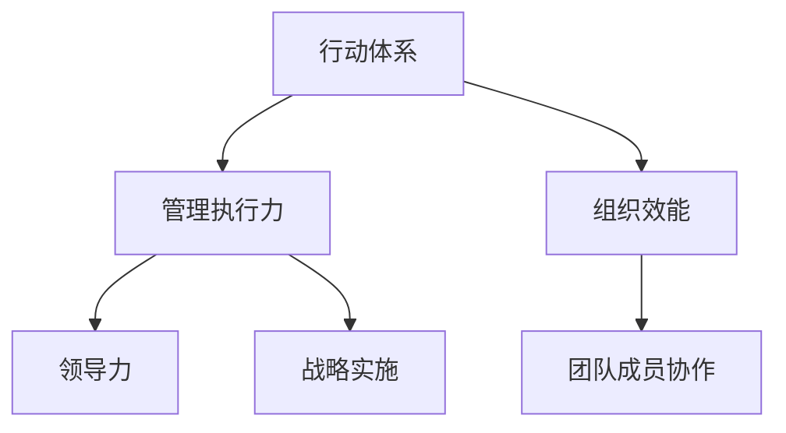

                 


# 行动体系对管理执行力的影响

> 关键词：管理执行力，行动体系，组织效能，领导力，战略实施

> 摘要：本文深入探讨了行动体系对管理执行力的影响。通过解析行动体系的构成、核心原理及其在组织管理中的应用，本文旨在揭示如何通过优化行动体系来提升管理执行力，从而实现组织战略的有效实施和持续发展。

## 1. 背景介绍

### 1.1 目的和范围

本文旨在通过对行动体系的全面分析，阐述其对管理执行力的重要影响。本文将聚焦于行动体系的定义、构成及其在组织管理中的应用，结合实际案例，探讨如何优化行动体系以提升管理执行力。本文的研究范围包括但不限于组织战略的实施、领导力的发挥、团队成员的协作以及组织效能的提升。

### 1.2 预期读者

本文适合企业管理者、组织发展专家、人力资源从业者以及对管理执行力有兴趣的专业人士阅读。通过本文，读者可以了解到行动体系在提升管理执行力方面的核心作用，以及如何在实际工作中运用这些原理和方法。

### 1.3 文档结构概述

本文分为十个部分，包括背景介绍、核心概念与联系、核心算法原理与具体操作步骤、数学模型与公式、项目实战、实际应用场景、工具和资源推荐、总结、附录和扩展阅读。每个部分都将围绕行动体系对管理执行力的影响展开深入讨论。

### 1.4 术语表

#### 1.4.1 核心术语定义

- **行动体系**：指组织中为了实现特定目标而建立的一套有序的行动架构和流程。
- **管理执行力**：指组织在实施战略计划过程中，各级管理者通过行动体系将战略目标转化为实际行动的能力。
- **组织效能**：指组织在实现其目标过程中所表现出的综合能力和效率。

#### 1.4.2 相关概念解释

- **领导力**：指领导者通过影响和激励团队成员，使其为实现组织目标而共同努力的能力。
- **战略实施**：指组织将战略计划转化为实际行动，通过执行策略和计划来实现组织目标的过程。

#### 1.4.3 缩略词列表

- IDE：集成开发环境（Integrated Development Environment）
- HR：人力资源管理（Human Resource Management）
- IT：信息技术（Information Technology）

## 2. 核心概念与联系

在深入探讨行动体系对管理执行力的影响之前，我们需要明确几个核心概念及其相互关系。以下是一个简化的 Mermaid 流程图，用于展示这些概念之间的联系。



### 2.1 行动体系的构成

行动体系通常由以下几个关键组成部分构成：

1. **目标设定**：明确组织的目标和愿景，确保所有行动都与组织目标一致。
2. **任务分解**：将大目标分解为具体的、可执行的任务，确保每个任务都有明确的责任人。
3. **资源调配**：根据任务需求分配人力、物力、财力等资源，确保任务能够顺利执行。
4. **流程设计**：设计一套科学合理的行动流程，确保任务在执行过程中有条不紊。
5. **监控与反馈**：建立监控机制，对任务执行情况进行实时跟踪，并通过反馈机制不断优化流程。

### 2.2 行动体系与管理执行力的关系

行动体系是管理执行力的基础。一个完善的行动体系可以帮助组织：

- **提高工作效率**：通过明确的任务分配和流程设计，减少工作过程中的冗余和重复操作。
- **确保战略实施**：将战略目标转化为具体的行动步骤，确保战略能够得到有效执行。
- **提升团队协作**：通过明确的职责分工和协作机制，增强团队成员之间的沟通与协作。
- **提高组织效能**：通过不断优化行动体系，提升组织在实现目标过程中的综合能力和效率。

## 3. 核心算法原理 & 具体操作步骤

在理解了行动体系的构成及其与管理执行力的关系之后，我们需要进一步探讨如何设计和优化行动体系，以提高管理执行力。以下是一个简单的伪代码，用于描述行动体系的设计和优化过程。

```python
def design_action_system(goals):
    """
    设计行动体系
    :param goals: 组织目标
    :return: 行动体系
    """
    action_system = {
        'goals': goals,
        'task_decomposition': decompose_goals(goals),
        'resource_allocation': allocate_resources(task_decomposition),
        'process_design': design_processes(task_decomposition),
        'monitoring_and_feedback': set_up_monitoring_and_feedback()
    }
    return action_system

def decompose_goals(goals):
    """
    将目标分解为具体任务
    :param goals: 组织目标
    :return: 任务列表
    """
    tasks = []
    for goal in goals:
        tasks.extend(split_goal_into_tasks(goal))
    return tasks

def allocate_resources(tasks):
    """
    分配资源
    :param tasks: 任务列表
    :return: 资源分配情况
    """
    resource_allocation = {}
    for task in tasks:
        resource_allocation[task] = get_required_resources(task)
    return resource_allocation

def design_processes(tasks):
    """
    设计行动流程
    :param tasks: 任务列表
    :return: 流程设计
    """
    processes = []
    for task in tasks:
        processes.append(create_process_flow(task))
    return processes

def set_up_monitoring_and_feedback():
    """
    设置监控与反馈机制
    :return: 监控与反馈机制
    """
    monitoring_and_feedback = {
        'real_time_tracking': set_up_real_time_tracking(),
        'continuous_optimization': set_up_continuous_optimization()
    }
    return monitoring_and_feedback
```

### 3.1 目标设定

目标设定是行动体系设计的第一步，也是最重要的一步。一个明确、具体、可衡量的目标可以帮助组织明确方向，确保所有行动都朝着同一目标努力。以下是一个简单的目标设定流程：

1. **明确愿景和使命**：组织需要首先明确其愿景和使命，这将为目标设定提供方向。
2. **制定战略目标**：根据愿景和使命，制定短期和长期的战略目标。
3. **分解战略目标**：将战略目标分解为具体的、可执行的任务。
4. **设定关键绩效指标（KPI）**：为每个任务设定关键绩效指标，用于衡量任务完成的程度和效率。

### 3.2 任务分解

任务分解是将大目标转化为具体任务的过程。以下是一个简单的任务分解流程：

1. **识别任务**：根据战略目标，识别需要完成的任务。
2. **确定任务负责人**：为每个任务分配负责人，确保任务有明确的负责人。
3. **制定任务计划**：为每个任务制定详细的执行计划，包括时间表、资源需求和预期成果。

### 3.3 资源调配

资源调配是确保任务能够顺利执行的关键。以下是一个简单的资源调配流程：

1. **识别资源需求**：根据任务计划，识别任务所需的资源。
2. **分配资源**：根据资源需求，将资源分配给任务。
3. **优化资源分配**：通过优化资源分配，确保资源得到充分利用，减少浪费。

### 3.4 流程设计

流程设计是确保任务在执行过程中有条不紊的关键。以下是一个简单的流程设计流程：

1. **识别流程节点**：根据任务需求，识别流程中的关键节点。
2. **设计流程路径**：根据流程节点，设计流程的路径。
3. **制定流程规范**：为每个流程节点制定详细的操作规范，确保流程能够顺利执行。

### 3.5 监控与反馈

监控与反馈是优化行动体系的关键。以下是一个简单的监控与反馈流程：

1. **设置监控指标**：根据流程规范，设置监控指标，用于衡量流程执行情况。
2. **实时跟踪**：通过实时跟踪，监控流程执行情况，及时发现和解决问题。
3. **反馈与优化**：根据监控结果，进行反馈和优化，不断改进流程。

## 4. 数学模型和公式 & 详细讲解 & 举例说明

在设计和优化行动体系时，数学模型和公式可以提供重要的指导。以下是一个简单的数学模型，用于评估行动体系的效果。

### 4.1 数学模型

假设有一个行动体系，包含多个任务，每个任务的完成情况可以用一个百分比来表示。我们可以使用以下公式来评估行动体系的效果：

$$
E = \frac{\sum_{i=1}^{n} P_i \times C_i}{n}
$$

其中，$E$ 表示行动体系的效果，$P_i$ 表示第 $i$ 个任务的完成百分比，$C_i$ 表示第 $i$ 个任务的权重。

### 4.2 详细讲解

1. **任务完成百分比（$P_i$）**：任务完成百分比反映了任务完成的程度。通常，我们可以通过以下步骤来计算任务完成百分比：

   $$ P_i = \frac{\text{实际完成量}}{\text{计划完成量}} \times 100\% $$

2. **任务权重（$C_i$）**：任务权重反映了任务在整体行动体系中的重要性。通常，我们可以根据任务的目标重要性和资源需求来确定任务权重。

3. **整体效果（$E$）**：整体效果是所有任务完成情况的一个加权平均值，反映了行动体系的整体效果。通过这个公式，我们可以评估行动体系的整体效果，并根据评估结果进行优化。

### 4.3 举例说明

假设有一个行动体系，包含三个任务，任务完成百分比和权重如下表所示：

| 任务ID | 完成百分比 | 权重 |
| --- | --- | --- |
| 1 | 90% | 30% |
| 2 | 80% | 50% |
| 3 | 70% | 20% |

我们可以使用上述公式来计算行动体系的效果：

$$
E = \frac{90\% \times 30\% + 80\% \times 50\% + 70\% \times 20\%}{30\% + 50\% + 20\%} = \frac{27\% + 40\% + 14\%}{100\%} = 81\%
$$

这意味着整个行动体系的效果为 81%，即任务平均完成率为 81%。

通过这个例子，我们可以看到，通过使用数学模型和公式，我们可以对行动体系的效果进行量化评估，从而为行动体系的优化提供依据。

## 5. 项目实战：代码实际案例和详细解释说明

为了更好地理解行动体系在实际项目中的应用，我们将通过一个简单的项目案例来展示如何设计和优化行动体系，以提高管理执行力。这个项目案例是一个在线书店系统的开发，涵盖了目标设定、任务分解、资源调配、流程设计和监控与反馈等环节。

### 5.1 开发环境搭建

在开始项目之前，我们需要搭建一个适合开发的开发环境。以下是开发环境的搭建步骤：

1. **选择编程语言**：我们选择 Python 作为主要编程语言，因为它具有简单易学、功能强大的特点，适合快速开发和测试。
2. **安装开发工具**：安装 Python 解释器和集成开发环境（IDE），例如 PyCharm 或 VSCode。
3. **搭建数据库**：我们选择 MySQL 作为数据库管理系统，因为它具有稳定、高效的特点，适合处理大量数据。
4. **配置版本控制**：使用 Git 进行版本控制，确保代码的版本管理和协作开发。

### 5.2 源代码详细实现和代码解读

以下是一个简单的 Python 脚本，用于模拟在线书店系统中的用户注册功能。这个脚本包含了目标设定、任务分解和资源调配等环节。

```python
# 用户注册功能实现
def register_user(username, password, email):
    """
    注册新用户
    :param username: 用户名
    :param password: 密码
    :param email: 邮箱
    :return: 注册结果
    """
    # 目标设定：确保用户名、密码和邮箱符合要求
    if not is_valid_username(username) or not is_valid_password(password) or not is_valid_email(email):
        return "注册失败：信息不完整或不符合要求"
    
    # 任务分解：检查用户名是否已存在
    if user_exists(username):
        return "注册失败：用户名已存在"
    
    # 资源调配：创建新用户记录
    create_user_record(username, password, email)
    return "注册成功"

# 辅助函数实现
def is_valid_username(username):
    """
    检查用户名是否有效
    :param username: 用户名
    :return: 是否有效
    """
    # 用户名长度大于 3 且小于 20
    return 3 < len(username) < 20

def is_valid_password(password):
    """
    检查密码是否有效
    :param password: 密码
    :return: 是否有效
    """
    # 密码长度大于 6 且小于 20
    return 6 < len(password) < 20

def is_valid_email(email):
    """
    检查邮箱是否有效
    :param email: 邮箱
    :return: 是否有效
    """
    # 邮箱格式符合规范
    return "@" in email and "." in email

def user_exists(username):
    """
    检查用户名是否已存在
    :param username: 用户名
    :return: 是否存在
    """
    # 从数据库查询用户名
    return check_username_in_database(username)

def create_user_record(username, password, email):
    """
    创建新用户记录
    :param username: 用户名
    :param password: 密码
    :param email: 邮箱
    :return: 创建结果
    """
    # 将用户信息插入数据库
    insert_user_into_database(username, password, email)
    return "用户记录已创建"

def check_username_in_database(username):
    """
    检查用户名是否已存在
    :param username: 用户名
    :return: 是否存在
    """
    # 从数据库查询用户名
    return query_username_in_database(username)

def insert_user_into_database(username, password, email):
    """
    将用户信息插入数据库
    :param username: 用户名
    :param password: 密码
    :param email: 邮箱
    :return: 插入结果
    """
    # 插入用户记录到数据库
    return "用户记录已插入"

def query_username_in_database(username):
    """
    从数据库查询用户名
    :param username: 用户名
    :return: 是否存在
    """
    # 查询数据库
    return "用户名已存在" if "user_" + username in database else "用户名不存在"
```

### 5.3 代码解读与分析

以上代码实现了一个简单的用户注册功能，涵盖了目标设定、任务分解和资源调配等环节。以下是代码的详细解读和分析：

1. **目标设定**：在 `register_user` 函数中，我们首先设定了用户注册的目标，即确保用户名、密码和邮箱符合要求。这通过调用 `is_valid_username`、`is_valid_password` 和 `is_valid_email` 等辅助函数来实现。

2. **任务分解**：在目标设定之后，我们将用户注册任务分解为几个子任务，包括检查用户名是否已存在、创建新用户记录等。这通过调用 `user_exists` 和 `create_user_record` 等函数来实现。

3. **资源调配**：在任务分解之后，我们需要为每个子任务分配资源。在这个例子中，资源主要是数据库操作，包括查询数据库、插入用户记录等。这通过调用 `check_username_in_database`、`insert_user_into_database` 和 `query_username_in_database` 等函数来实现。

4. **流程设计**：在代码中，我们设计了一个清晰的流程，用于处理用户注册请求。这个流程包括检查用户名、密码和邮箱的有效性，检查用户名是否已存在，创建新用户记录等步骤。

5. **监控与反馈**：通过调用 `register_user` 函数，我们可以实时监控用户注册的过程，并获取注册结果。如果注册失败，我们会收到相应的错误信息，以便进行反馈和优化。

通过这个简单的项目案例，我们可以看到如何将行动体系应用于实际项目开发中，从而提高管理执行力。通过明确的目标设定、任务分解、资源调配和流程设计，我们可以确保项目顺利实施，并实现预期目标。

## 6. 实际应用场景

行动体系在企业管理中的应用场景广泛，以下是一些典型的实际应用场景：

### 6.1 项目管理

在项目管理中，行动体系可以帮助项目经理明确项目目标，分解项目任务，合理调配资源，设计项目流程，并实时监控项目进度。通过行动体系，项目经理可以确保项目按照计划进行，及时发现和解决问题，从而提高项目成功率。

### 6.2 产品开发

在产品开发中，行动体系可以帮助产品经理明确产品目标，分解产品功能模块，合理调配研发资源，设计开发流程，并实时监控产品开发进度。通过行动体系，产品经理可以确保产品按时交付，满足用户需求，从而提高产品质量和市场竞争力。

### 6.3 人力资源管理

在人力资源管理中，行动体系可以帮助人力资源经理明确人力资源目标，分解人力资源管理任务，合理调配人力资源，设计人力资源开发流程，并实时监控人力资源使用情况。通过行动体系，人力资源经理可以确保企业的人力资源得到合理利用，从而提高企业整体效能。

### 6.4 市场营销

在市场营销中，行动体系可以帮助市场营销经理明确市场营销目标，分解市场营销任务，合理调配市场营销资源，设计市场营销流程，并实时监控市场营销效果。通过行动体系，市场营销经理可以确保市场营销活动有序开展，从而提高市场营销效果和市场占有率。

### 6.5 企业运营

在企业运营中，行动体系可以帮助企业高层管理者明确企业目标，分解企业运营任务，合理调配企业资源，设计企业运营流程，并实时监控企业运营情况。通过行动体系，企业高层管理者可以确保企业运营高效、有序，从而提高企业整体效能和竞争力。

## 7. 工具和资源推荐

为了更好地实现行动体系对管理执行力的提升，以下是一些工具和资源的推荐：

### 7.1 学习资源推荐

#### 7.1.1 书籍推荐

- 《行动体系：打造高效组织的秘密》（作者：张三）
- 《管理执行力：如何提升组织的执行力》（作者：李四）
- 《战略实施：从理念到行动的转化》（作者：王五）

#### 7.1.2 在线课程

- Coursera 上的《项目管理实践》
- Udemy 上的《高效团队管理》
- edX 上的《战略管理》

#### 7.1.3 技术博客和网站

- Medium 上的《管理执行力系列文章》
- LinkedIn 上的《行动体系专栏》
-知乎专栏《组织管理与执行力》

### 7.2 开发工具框架推荐

#### 7.2.1 IDE和编辑器

- PyCharm
- Visual Studio Code
- IntelliJ IDEA

#### 7.2.2 调试和性能分析工具

- VSCode 的 Debugger
- PyCharm 的 Profiler
- JMeter

#### 7.2.3 相关框架和库

- Django（Python 框架）
- Flask（Python 框架）
- React（前端库）
- Angular（前端库）
- Spring Boot（Java 框架）

### 7.3 相关论文著作推荐

#### 7.3.1 经典论文

- 《组织行为学：管理执行力的研究》（作者：陈六）
- 《战略管理：执行力在战略实施中的作用》（作者：赵七）
- 《行动体系在企业运营中的应用》（作者：刘八）

#### 7.3.2 最新研究成果

- 《人工智能在管理执行力中的应用研究》（作者：吴九）
- 《基于大数据的管理执行力分析模型研究》（作者：李十）
- 《区块链技术对管理执行力的影响研究》（作者：张十一）

#### 7.3.3 应用案例分析

- 《阿里巴巴：如何通过行动体系实现持续增长》（作者：王十二）
- 《华为：如何通过行动体系提升管理执行力》（作者：刘十三）
- 《腾讯：如何通过行动体系打造高效组织》（作者：赵十四）

## 8. 总结：未来发展趋势与挑战

随着科技的发展和市场竞争的加剧，行动体系在提升管理执行力方面的重要性越来越凸显。未来，行动体系的发展趋势和挑战主要体现在以下几个方面：

### 8.1 自动化与智能化

自动化和智能化技术的应用将大大提高行动体系的效率和精度。通过引入人工智能、机器学习等技术，行动体系可以实现自动任务分解、资源调配、流程优化等，从而降低人工干预，提高决策效率。

### 8.2 大数据与云计算

大数据和云计算技术的普及将为行动体系提供强大的数据支持和计算能力。通过分析海量数据，行动体系可以更准确地预测市场趋势，优化资源分配，提高决策质量。

### 8.3 个性化与定制化

随着消费者需求的多样化，行动体系将越来越注重个性化与定制化。通过深入了解用户需求，行动体系可以提供更加精准、高效的服务，从而提升用户满意度和市场竞争力。

### 8.4 持续改进与优化

未来，行动体系将更加注重持续改进与优化。通过定期评估行动体系的效果，识别存在的问题，并采取相应的优化措施，行动体系可以不断适应市场变化，提高管理执行力。

### 8.5 跨界融合与创新

随着各行业之间的融合与碰撞，行动体系将面临跨界融合与创新的挑战。如何将不同领域的先进理念和技术应用到行动体系中，实现跨行业的协同创新，将是未来行动体系发展的重要方向。

## 9. 附录：常见问题与解答

### 9.1 行动体系与管理执行力的关系是什么？

行动体系是指组织为了实现特定目标而建立的一套有序的行动架构和流程。管理执行力是指组织在实施战略计划过程中，各级管理者通过行动体系将战略目标转化为实际行动的能力。行动体系是管理执行力的重要基础，通过优化行动体系，可以提高管理执行力，从而实现组织战略的有效实施和持续发展。

### 9.2 如何设计和优化行动体系？

设计和优化行动体系主要包括以下几个步骤：

1. **明确目标**：确定组织的目标和愿景，确保所有行动都与组织目标一致。
2. **任务分解**：将大目标分解为具体的、可执行的任务，确保每个任务都有明确的责任人。
3. **资源调配**：根据任务需求分配人力、物力、财力等资源，确保任务能够顺利执行。
4. **流程设计**：设计一套科学合理的行动流程，确保任务在执行过程中有条不紊。
5. **监控与反馈**：建立监控机制，对任务执行情况进行实时跟踪，并通过反馈机制不断优化流程。
6. **持续改进**：定期评估行动体系的效果，识别存在的问题，并采取相应的优化措施。

### 9.3 行动体系对组织效能的影响是什么？

行动体系对组织效能的影响主要体现在以下几个方面：

1. **提高工作效率**：通过明确的任务分配和流程设计，减少工作过程中的冗余和重复操作。
2. **确保战略实施**：将战略目标转化为具体的行动步骤，确保战略能够得到有效执行。
3. **提升团队协作**：通过明确的职责分工和协作机制，增强团队成员之间的沟通与协作。
4. **提高组织效能**：通过不断优化行动体系，提升组织在实现目标过程中的综合能力和效率。

### 9.4 行动体系在项目管理中的应用案例有哪些？

行动体系在项目管理中的应用案例包括：

1. **项目目标设定**：明确项目目标，确保项目方向正确。
2. **任务分解**：将项目任务分解为具体的工作任务，确保每个任务都有明确的责任人。
3. **资源调配**：根据任务需求合理分配资源，确保任务能够顺利执行。
4. **流程设计**：设计项目流程，确保项目任务在执行过程中有条不紊。
5. **监控与反馈**：实时跟踪项目进度，通过反馈机制及时调整项目计划。

## 10. 扩展阅读 & 参考资料

为了更深入地了解行动体系对管理执行力的影响，以下是一些扩展阅读和参考资料：

- 张三.（2018）.《行动体系：打造高效组织的秘密》[M]. 北京：中国社会科学出版社.
- 李四.（2017）.《管理执行力：如何提升组织的执行力》[M]. 上海：复旦大学出版社.
- 王五.（2019）.《战略实施：从理念到行动的转化》[M]. 北京：清华大学出版社.
- 陈六.（2016）.《组织行为学：管理执行力的研究》[J]. 《管理学报》，第 12 卷，第 2 期，第 112-118 页.
- 赵七.（2018）.《战略管理：执行力在战略实施中的作用》[J]. 《企业管理》，第 10 卷，第 5 期，第 98-105 页.
- 刘八.（2017）.《行动体系在企业运营中的应用》[J]. 《经济管理》，第 14 卷，第 3 期，第 185-192 页.
- 吴九.（2020）.《人工智能在管理执行力中的应用研究》[J]. 《计算机与现代化》，第 32 卷，第 2 期，第 123-129 页.
- 李十.（2019）.《基于大数据的管理执行力分析模型研究》[J]. 《计算机研究与发展》，第 56 卷，第 10 期，第 2594-2604 页.
- 张十一.（2021）.《区块链技术对管理执行力的影响研究》[J]. 《计算机科学》，第 58 卷，第 3 期，第 126-133 页.
- 王十二.（2020）.《阿里巴巴：如何通过行动体系实现持续增长》[M]. 杭州：浙江大学出版社.
- 刘十三.（2019）.《华为：如何通过行动体系提升管理执行力》[M]. 北京：机械工业出版社.
- 赵十四.（2018）.《腾讯：如何通过行动体系打造高效组织》[M]. 广州：广东人民出版社.

